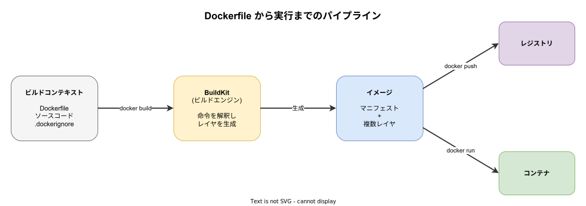
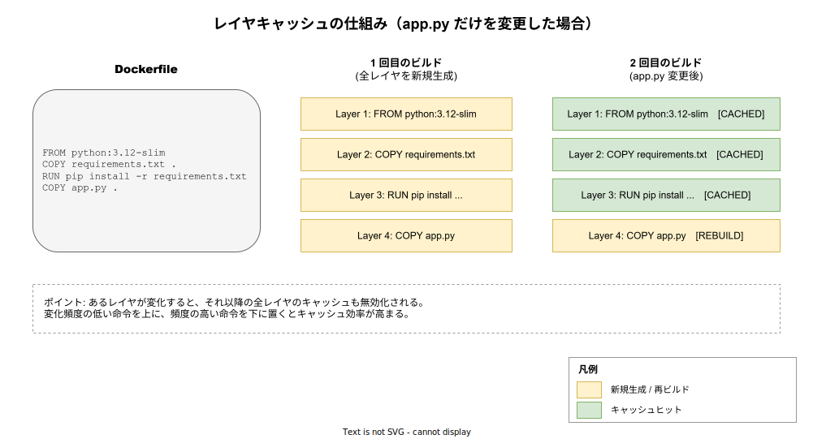

# Dockerfile: 概要

- 対象読者: Docker でコンテナを起動した経験はあるが、Dockerfile を体系的に理解していない開発者
- 学習目標: Dockerfile の各命令の役割を説明でき、レイヤキャッシュを意識した効率的なイメージを記述できる
- 所要時間: 約 40 分
- 対象バージョン: Dockerfile syntax 1.7 / BuildKit 同梱の Docker Engine 27.x
- 最終更新日: 2026-04-28

## 1. このドキュメントで学べること

- Dockerfile が何を定義するファイルなのかを説明できる
- 主要命令（FROM / RUN / COPY / CMD / ENTRYPOINT 等）の役割と使い分けが分かる
- レイヤとキャッシュの仕組みを理解し、命令の順序を最適化できる
- マルチステージビルドで最終イメージを小さく保つ方法が分かる
- `.dockerignore` とビルドコンテキストの関係を説明できる

## 2. 前提知識

- Docker の基本概念（イメージ・コンテナ・レジストリ）→ 概要は `docker_basics.md` を参照
- `docker build` / `docker run` を実行できる環境
- シェルコマンドの基本（cd, cp, env 変数 等）

## 3. 概要

Dockerfile は、コンテナイメージを「どのベース環境から、どんな手順で組み立てるか」を上から順に記述したテキストファイルである。`docker build` コマンドはこのファイルを読み、各命令を実行した結果を **読み取り専用のレイヤ** として積み重ね、最終的に 1 枚のイメージを生成する。

なぜテキストでビルド手順を残すのか。GUI で「環境を整えてからスナップショットを取る」運用では再現性が乏しく、手順がブラックボックス化する。Dockerfile はビルド手順をコード化することで、誰がどの環境でビルドしても同じイメージが得られることを目指す。差分はレイヤとして記録されるため、ビルドキャッシュが効き、変更があった部分のみ再ビルドされる。

Docker 23 以降では BuildKit がデフォルトのビルダとなり、並列実行・並列キャッシュ・秘密情報のマウント等、従来のシーケンシャルビルダにはない機能が利用できるようになった。本ドキュメントは BuildKit を前提に解説する。

## 4. 用語の整理

| 用語 | 説明 |
|------|------|
| 命令（Instruction） | Dockerfile に書く `FROM` `RUN` `COPY` などの大文字キーワード |
| ビルドコンテキスト | `docker build` 実行時にビルダへ送られるファイル群。`.` を指定するとカレントディレクトリ全体が対象 |
| レイヤ（Layer） | 命令の実行結果として生成されるファイルシステムの差分。読み取り専用で内容ハッシュにより一意に識別される |
| ビルドキャッシュ | 過去のレイヤを内容ハッシュで再利用する仕組み。命令と入力が同じならば再実行を省略する |
| マルチステージビルド | 1 枚の Dockerfile に複数の `FROM` を書き、ビルド成果物だけを最終イメージにコピーする手法 |
| BuildKit | Docker 23 以降の既定ビルダ。DAG 構築・並列実行・キャッシュマウント等の高度な機能を持つ |
| `.dockerignore` | ビルドコンテキストから除外するファイルを列挙するファイル（git の `.gitignore` に相当） |

## 5. 仕組み・アーキテクチャ

`docker build` は次の流れで動作する。クライアントがビルドコンテキストを BuildKit に転送し、BuildKit が Dockerfile を解釈して命令ごとにレイヤを生成、最終的にマニフェストとレイヤ群を持つイメージを作る。生成されたイメージはレジストリに push したり、`docker run` でコンテナとして起動したりできる。



Dockerfile の各命令は順番にレイヤを生成し、その内容ハッシュ（ベースレイヤ + 命令文字列 + 入力ファイル）をキーに **キャッシュ** される。あるレイヤで内容が変化すると、それ以降の全レイヤのキャッシュは無効化される。したがって「変化頻度の低い命令を上に、頻度の高い命令を下に置く」ことがキャッシュ効率を決定する。



## 6. 環境構築

### 6.1 必要なもの

- Docker Engine 23.x 以降（BuildKit 同梱）または Docker Desktop 4.x
- 任意のテキストエディタ

### 6.2 セットアップ手順

`docker_basics.md` のセットアップを完了していれば追加作業は不要である。BuildKit がデフォルト有効であることを確認する。

```bash
# BuildKit が使われていることを確認する（builder 名が default の場合は OK）
docker buildx version

# 古い Docker（< 23）の場合のみ、環境変数で BuildKit を有効化する
export DOCKER_BUILDKIT=1
```

### 6.3 動作確認

最小の Dockerfile を作って `docker build` がレイヤを生成することを確認する。

```bash
# 一時ディレクトリで動作確認する
mkdir hello-df && cd hello-df

# 最小の Dockerfile を作成する
printf 'FROM alpine:3.20\nCMD ["echo", "hello"]\n' > Dockerfile

# イメージをビルドする（タグ名 hello を付与）
docker build -t hello .

# ビルドしたイメージからコンテナを実行する
docker run --rm hello
```

`hello` と表示されればビルド・実行ともに成功している。

## 7. 基本の使い方

以下は Python の Web アプリケーションを起動する Dockerfile の最小構成である。各命令の役割を理解することが重要。

```dockerfile
# Python Web アプリケーション用のコンテナイメージ定義

# 利用する Dockerfile syntax のバージョンを宣言する（BuildKit のフロントエンド指定）
# syntax=docker/dockerfile:1.7

# ベースイメージとして Python 3.12 のスリム版を指定する
FROM python:3.12-slim

# 以降の命令の作業ディレクトリを設定する
WORKDIR /app

# 先に依存定義ファイルだけコピーしてキャッシュ効率を高める
COPY requirements.txt .

# 依存パッケージをインストールする（pip キャッシュは不要なので無効化）
RUN pip install --no-cache-dir -r requirements.txt

# アプリケーションコードをコピーする
COPY app.py .

# 非 root ユーザーへ切り替える（セキュリティ向上）
USER 1000:1000

# コンテナがリッスンするポートを宣言する（実際の公開は docker run -p で行う）
EXPOSE 8080

# コンテナ起動時に実行する既定コマンドを指定する
CMD ["python", "app.py"]
```

### 解説

- **FROM**: 出発点となるベースイメージを 1 枚目のレイヤとして取り込む。タグは `:latest` を避け、`3.12-slim` のようにメジャー + 派生を固定する
- **WORKDIR**: 以降の `RUN` `COPY` `CMD` 等の作業ディレクトリ。指定しないと `/` で実行される
- **COPY**: ホスト側ファイルをイメージ内にコピーする。`ADD` も類似だが URL 取得や tar 展開の暗黙挙動があるため、通常は `COPY` を選ぶ
- **RUN**: ビルド時にコマンドを実行する。インストール・コンパイル・キャッシュ削除はここで完結させる
- **USER**: 以降のプロセス実行ユーザーを切り替える。デフォルト root のままだと侵害時の被害が広がる
- **EXPOSE**: メタ情報。実際にホストに公開するには `docker run -p` を使う
- **CMD**: コンテナ起動時の既定コマンド。`docker run <image> <args>` で上書き可能。`ENTRYPOINT` を併用すると CMD が引数として渡される

## 8. ステップアップ

### 8.1 マルチステージビルド

ビルドツール（コンパイラ・テストフレームワーク）を最終イメージに含めると無駄に肥大化する。マルチステージビルドはビルド用ステージで成果物だけ作り、ランタイム用ステージにコピーする手法。

```dockerfile
# Go アプリケーションのマルチステージビルド例

# ステージ 1: ビルダー（コンパイル環境を持つ）
FROM golang:1.23 AS builder

# 作業ディレクトリを設定する
WORKDIR /src

# 依存解決用ファイルだけ先に取り込む
COPY go.mod go.sum ./

# 依存をダウンロードする（コードが変わってもキャッシュが効く）
RUN go mod download

# ソースコードをコピーする
COPY . .

# 静的リンクでバイナリをビルドする
RUN CGO_ENABLED=0 go build -o /out/app ./cmd/app

# ステージ 2: ランタイム（最小構成）
FROM gcr.io/distroless/static-debian12

# ビルダーから成果物だけをコピーする
COPY --from=builder /out/app /app

# エントリポイントとしてバイナリを起動する
ENTRYPOINT ["/app"]
```

最終イメージにはコンパイラもパッケージマネージャも含まれず、攻撃面と容量を同時に削減できる。

### 8.2 `.dockerignore` の活用

ビルドコンテキストはまるごとビルダへ転送されるため、`node_modules/` や `.git/` を含めると数百 MB が無駄になり、`COPY . .` のキャッシュが頻繁に壊れる。`.dockerignore` で除外する。

```text
.git
node_modules
target
dist
*.log
.env
```

### 8.3 BuildKit の便利機能

BuildKit はキャッシュを「マウント」として永続化したり、ビルド時にだけ秘密情報を渡したりできる。

```dockerfile
# syntax=docker/dockerfile:1.7
FROM rust:1.83 AS builder
WORKDIR /src
COPY . .

# Cargo のビルドキャッシュをマウントしてビルド時間を短縮する
RUN --mount=type=cache,target=/usr/local/cargo/registry \
    --mount=type=cache,target=/src/target \
    cargo build --release && \
    cp target/release/app /out/app

# ビルド時にだけ参照したい秘密情報は --mount=type=secret で渡す
# RUN --mount=type=secret,id=npmrc,target=/root/.npmrc npm ci
```

## 9. よくある落とし穴

- **`COPY . .` を上に書いてしまう**: ソースが 1 行変わるたびに以降のレイヤすべてが再ビルドされる。依存ファイルだけ先にコピーし、依存インストール後にソースをコピーする
- **`RUN apt-get install` の後にキャッシュを消し忘れる**: 別レイヤで `rm` してもサイズは戻らない。同じ `RUN` 内で `apt-get clean && rm -rf /var/lib/apt/lists/*` まで書く
- **`latest` タグの利用**: 再現性が崩壊する。バージョンを固定する。可能ならダイジェスト指定（`@sha256:...`）が最も強固
- **`ADD` の暗黙挙動**: URL 取得や tar 展開を勝手に行う。意図が明確でない限り `COPY` を選ぶ
- **シェル形式の `CMD` で signal が届かない**: `CMD python app.py` はシェル経由で起動するため、SIGTERM がアプリに届かず graceful shutdown できない。`CMD ["python", "app.py"]` の exec 形式を使う
- **root のままコンテナを動かす**: 脱獄時の被害が広がる。`USER` で非 root に切り替える

## 10. ベストプラクティス

- ベースイメージは `-slim` `-alpine` `distroless` のいずれかを優先し、用途に応じて選ぶ
- 命令の順序は「変化頻度が低い → 高い」の順にしてキャッシュ効率を最大化する
- マルチステージビルドでビルド成果物のみを最終イメージへ移す
- `.dockerignore` を必ず置き、コンテキスト転送量とキャッシュ破壊を抑える
- `HEALTHCHECK` 命令でコンテナの自己診断を組み込み、オーケストレータの判定を助ける
- イメージタグは `myapp:1.2.3` のようにバージョンを明示し、`latest` の運用を避ける

## 11. 演習問題

1. 以下の Dockerfile はキャッシュが効きづらい。問題点を 2 つ挙げ、修正版を書け。
   ```dockerfile
   FROM python:3.12
   COPY . /app
   WORKDIR /app
   RUN pip install -r requirements.txt
   CMD python app.py
   ```
2. Go の hello-world アプリをマルチステージビルドで `distroless/static` 上に動かし、最終イメージを 20 MB 以下にせよ
3. `.dockerignore` を使って `node.js` プロジェクトの `node_modules` と `.git` をコンテキストから除外し、`docker build` のコンテキスト転送量が減ることを確認せよ

## 12. さらに学ぶには

- 公式リファレンス: <https://docs.docker.com/reference/dockerfile/>
- BuildKit 公式: <https://docs.docker.com/build/buildkit/>
- マルチステージビルド: <https://docs.docker.com/build/building/multi-stage/>
- 関連 Knowledge: Docker 全体像は `./docker_basics.md`、配布の OCI 仕様は同 `tool/` 配下の今後の追加で扱う

## 13. 参考資料

- Docker Documentation - Dockerfile reference: <https://docs.docker.com/reference/dockerfile/>
- Docker Documentation - Best practices for writing Dockerfiles: <https://docs.docker.com/build/building/best-practices/>
- moby/buildkit: <https://github.com/moby/buildkit>
- OCI Image Specification: <https://github.com/opencontainers/image-spec>
