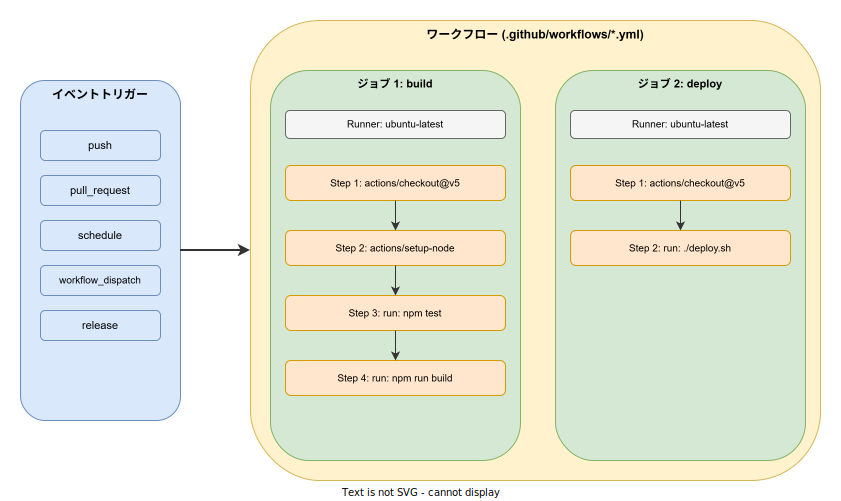
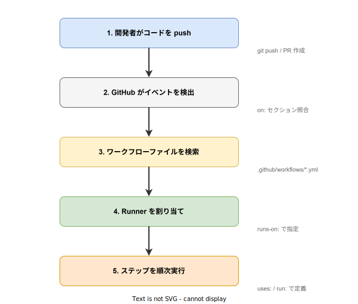

# GitHub Actions: 概要

- 対象読者: Git / GitHub の基本操作ができる開発者
- 学習目標: GitHub Actions の仕組みを理解し、ワークフローの作成・実行・管理ができるようになる
- 所要時間: 約 40 分
- 対象バージョン: GitHub Actions v2（2026 年 4 月時点）
- 最終更新日: 2026-04-12

## 1. このドキュメントで学べること

- GitHub Actions が解決する課題と CI/CD 自動化の意義を説明できる
- ワークフロー・ジョブ・ステップ・アクションの関係を理解できる
- YAML でワークフローファイルを記述し、リポジトリに配置できる
- イベントトリガーの種類と使い分けを把握できる

## 2. 前提知識

- Git の基本操作（commit, push, pull request の作成）
- GitHub リポジトリの基本的な使い方
- YAML の基本的な構文（キー・値、リスト、インデント）

## 3. 概要

GitHub Actions は、GitHub が提供する CI/CD（継続的インテグレーション / 継続的デリバリー）および自動化プラットフォームである。リポジトリ内のイベント（コードのプッシュ、プルリクエストの作成など）をトリガーとして、テスト・ビルド・デプロイなどの処理を自動実行する。

従来の CI/CD では、Jenkins や CircleCI などの外部サービスを別途セットアップし、リポジトリとの連携を構成する必要があった。GitHub Actions はリポジトリに YAML ファイルを配置するだけで動作するため、追加のインフラ構築が不要である。GitHub Marketplace には数千の再利用可能なアクションが公開されており、共通タスクを簡潔に記述できる。

## 4. 用語の整理

| 用語 | 説明 |
|------|------|
| ワークフロー（Workflow） | 自動化処理全体を定義する YAML ファイル。`.github/workflows/` に配置する |
| イベント（Event） | ワークフローの実行を開始するトリガー。push, pull_request, schedule 等 |
| ジョブ（Job） | ワークフロー内の実行単位。同一 Runner 上でステップを順次実行する |
| ステップ（Step） | ジョブ内の個々の処理。シェルコマンドまたはアクションを実行する |
| アクション（Action） | 再利用可能な処理の単位。Marketplace で公開されている |
| Runner | ジョブを実行する仮想マシン。GitHub ホスト型とセルフホスト型がある |
| `GITHUB_TOKEN` | ワークフロー実行時に自動生成される認証トークン |

## 5. 仕組み・アーキテクチャ

GitHub Actions は、イベント駆動型のアーキテクチャを採用している。リポジトリで発生したイベントに応じて、対応するワークフローファイルが検索・実行される。



ワークフローの実行は以下の順序で進行する。開発者のアクションからイベント検出、Runner の割り当て、ステップの実行まで、すべて GitHub が自動的に管理する。



## 6. 環境構築

### 6.1 必要なもの

- GitHub アカウント
- GitHub リポジトリ（パブリックまたはプライベート）
- テキストエディタ（VS Code 推奨）

### 6.2 セットアップ手順

GitHub Actions は追加のインストールが不要である。リポジトリにワークフローファイルを配置するだけで有効になる。

```bash
# リポジトリのルートにワークフロー用ディレクトリを作成する
mkdir -p .github/workflows
```

### 6.3 動作確認

ワークフローファイルを push した後、GitHub リポジトリの「Actions」タブで実行状態を確認できる。

## 7. 基本の使い方

以下は、main ブランチへの push 時にテストを自動実行する最小構成のワークフローである。

```yaml
# CI ワークフロー: push 時にテストを自動実行する
name: CI

# main ブランチへの push と pull_request をトリガーに設定する
on:
  push:
    branches: [ main ]
  pull_request:
    branches: [ main ]

# ジョブを定義する
jobs:
  # テストジョブを定義する
  test:
    # Ubuntu の最新版 Runner を使用する
    runs-on: ubuntu-latest

    # ステップを順次実行する
    steps:
      # リポジトリのソースコードをチェックアウトする
      - uses: actions/checkout@v5

      # Node.js 20 の環境をセットアップする
      - uses: actions/setup-node@v4
        with:
          node-version: '20'

      # 依存パッケージをインストールする
      - run: npm install

      # テストを実行する
      - run: npm test
```

### 解説

- `name`: ワークフローの表示名を定義する。Actions タブに表示される
- `on`: トリガーとなるイベントを指定する。複数のイベントを列挙できる
- `jobs`: 実行するジョブの集合を定義する
- `runs-on`: ジョブを実行する Runner の種類を指定する
- `steps`: ジョブ内で順次実行する処理を列挙する
- `uses`: Marketplace のアクションを呼び出す。`owner/repo@version` 形式で指定する
- `run`: シェルコマンドを直接実行する

## 8. ステップアップ

### 8.1 手動実行（workflow_dispatch）

`workflow_dispatch` イベントを追加すると、GitHub UI から手動でワークフローを実行できる。入力パラメータも定義可能である。

```yaml
# 手動実行可能なデプロイワークフロー
on:
  workflow_dispatch:
    inputs:
      # デプロイ先の環境を入力パラメータとして定義する
      environment:
        description: 'デプロイ先環境'
        required: true
        default: 'staging'
        type: choice
        options:
          - staging
          - production
```

### 8.2 ジョブ間の依存関係（needs）

`needs` キーワードを使うと、ジョブ間の実行順序を制御できる。指定しない場合、ジョブは並列に実行される。

```yaml
# ジョブ間の依存関係を定義する
jobs:
  # ビルドジョブを先に実行する
  build:
    runs-on: ubuntu-latest
    steps:
      - run: echo "Building..."
  # デプロイはビルド完了後に実行する
  deploy:
    needs: build
    runs-on: ubuntu-latest
    steps:
      - run: echo "Deploying..."
```

### 8.3 シークレットの利用

機密情報はリポジトリの Settings > Secrets に登録し、`secrets` コンテキストで参照する。ワークフローファイルに直接記載してはならない。

```yaml
# シークレットを環境変数として渡す
steps:
  - run: ./deploy.sh
    env:
      # リポジトリのシークレットを参照する
      API_KEY: ${{ secrets.API_KEY }}
```

## 9. よくある落とし穴

- **インデントの誤り**: YAML はインデントに敏感である。スペース 2 つで統一し、タブは使用しない
- **ブランチフィルタの未設定**: `on: push` だけでは全ブランチで実行される。`branches` で対象を絞る
- **アクションのバージョン未固定**: `uses: actions/checkout@main` のようにブランチ指定すると、予期しない変更が入る。`@v5` のようにタグで固定する
- **シークレットの直書き**: API キーやトークンを YAML に直接書くと漏洩する。必ず Secrets 機能を使う
- **タイムアウト未設定**: デフォルトのタイムアウトは 6 時間である。`timeout-minutes` で適切な上限を設定する

## 10. ベストプラクティス

- ワークフローファイルは目的ごとに分割する（CI 用、デプロイ用、リリース用など）
- アクションのバージョンはメジャーバージョンタグ（`@v5`）で固定する
- `permissions` を明示的に設定し、`GITHUB_TOKEN` の権限を最小限にする
- 実行時間の長いワークフローにはキャッシュ（`actions/cache`）を活用する
- `timeout-minutes` を全ジョブに設定し、無限実行を防止する

## 11. 演習問題

1. `.github/workflows/hello.yml` を作成し、push 時に `echo "Hello, GitHub Actions!"` を実行するワークフローを動かせ
2. `actions/setup-node` を使って Node.js プロジェクトのテストを自動実行するワークフローを構成せよ
3. `workflow_dispatch` を追加し、GitHub UI から手動実行できるようにせよ

## 12. さらに学ぶには

- 公式ドキュメント: https://docs.github.com/en/actions
- ワークフロー構文リファレンス: https://docs.github.com/en/actions/writing-workflows/workflow-syntax-for-github-actions
- GitHub Marketplace（アクション検索）: https://github.com/marketplace?type=actions
- 関連 Knowledge: Docker の基本は `docker_basics.md` を参照

## 13. 参考資料

- GitHub Actions Documentation: https://docs.github.com/en/actions
- Understanding GitHub Actions: https://docs.github.com/en/actions/get-started/understand-github-actions
- Events that trigger workflows: https://docs.github.com/en/actions/reference/workflows-and-actions/events-that-trigger-workflows
