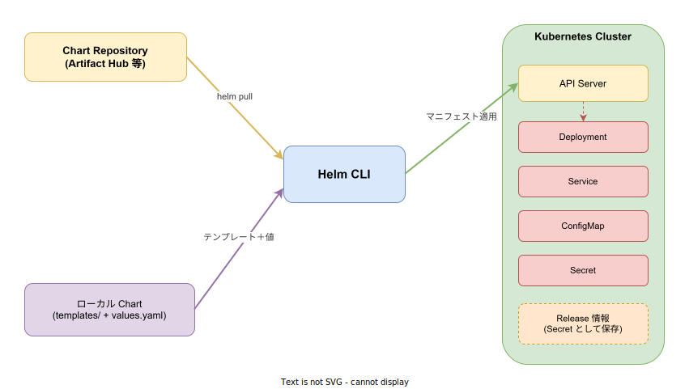
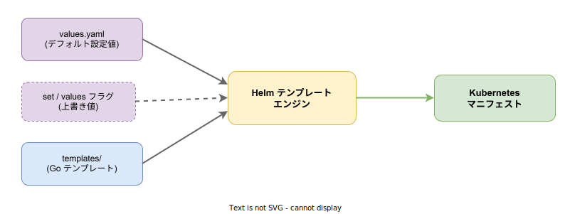

# Helm: 基本

- 対象読者: Kubernetes の基礎を理解している開発者・インフラエンジニア
- 学習目標: Helm の概念を理解し、Chart のインストール・更新・ロールバック・削除ができるようになる
- 所要時間: 約 30 分
- 対象バージョン: Helm v3.17
- 最終更新日: 2026-04-13

## 1. このドキュメントで学べること

- Helm が解決する課題とパッケージマネージャとしての役割を説明できる
- Chart・Release・Repository の関係を理解できる
- helm コマンドで Chart のインストール・更新・ロールバック・削除ができる
- values.yaml による設定値のカスタマイズができる

## 2. 前提知識

- Kubernetes の基本概念（Pod、Deployment、Service、Namespace）
- kubectl の基本操作
- YAML の読み書き
- 関連 Knowledge: Kubernetes の基本は `../infra/kubernetes_basics.md` を参照

## 3. 概要

Helm は Kubernetes のパッケージマネージャである。Linux における apt や yum、Node.js における npm に相当する。

Kubernetes にアプリケーションをデプロイするには、Deployment・Service・ConfigMap・Secret など複数のマニフェストファイルを作成し、kubectl で適用する必要がある。アプリケーションの規模が大きくなると、これらのファイルの管理・バージョニング・環境ごとの設定切り替えが煩雑になる。

Helm はこの問題を「Chart」というパッケージ単位で解決する。Chart にはテンプレート化されたマニフェストとデフォルトの設定値が含まれており、1 コマンドでアプリケーション全体をデプロイできる。更新やロールバックもリビジョン単位で管理される。

## 4. 用語の整理

| 用語 | 説明 |
|------|------|
| Chart | Kubernetes リソースのテンプレートと設定値をまとめたパッケージ |
| Release | Chart をクラスタにインストールした実行中のインスタンス |
| Repository | Chart を保管・配布するサーバー。Artifact Hub が公開 Chart の検索サイトとして利用できる |
| Revision | Release の更新履歴番号。install で 1、upgrade ごとに 1 ずつ増加する |
| values.yaml | Chart のデフォルト設定値を定義するファイル。インストール時に上書きできる |
| テンプレート | Go テンプレート構文で記述された Kubernetes マニフェストの雛形 |

## 5. 仕組み・アーキテクチャ

Helm はクライアントのみで構成される（Helm v2 にはサーバーコンポーネント Tiller があったが v3 で廃止された）。Helm CLI が Chart Repository からチャートを取得し、テンプレートに設定値を埋め込んでマニフェストを生成し、Kubernetes API Server に適用する。



テンプレートレンダリングの仕組みを以下に示す。values.yaml のデフォルト値と、ユーザーが `--set` フラグや `-f` オプションで指定した上書き値がマージされ、templates/ 内の Go テンプレートに埋め込まれる。結果として有効な Kubernetes マニフェストが生成される。



Release の情報は Kubernetes クラスタ内の Secret として保存される。これにより、Helm CLI がどのマシンから実行されても Release の状態を参照できる。

## 6. 環境構築

### 6.1 必要なもの

- Kubernetes クラスタ（ローカルなら minikube や kind で構築可能）
- kubectl（クラスタに接続済みであること）
- Helm CLI

### 6.2 セットアップ手順

```bash
# macOS: Homebrew でインストールする
brew install helm

# Linux: 公式スクリプトでインストールする
curl https://raw.githubusercontent.com/helm/helm/main/scripts/get-helm-3 | bash

# Windows: Chocolatey でインストールする
choco install kubernetes-helm
```

### 6.3 動作確認

```bash
# Helm のバージョンを確認する
helm version

# Kubernetes クラスタへの接続を確認する（kubectl が必要）
kubectl cluster-info
```

`helm version` でバージョン情報が表示されればセットアップ完了である。

## 7. 基本の使い方

以下に Helm の基本操作を示す。

```bash
# リポジトリを追加する（例: Bitnami）
helm repo add bitnami https://charts.bitnami.com/bitnami

# リポジトリのインデックスを更新する
helm repo update

# Chart を検索する
helm search repo nginx

# Chart をインストールする（Release 名: my-nginx）
helm install my-nginx bitnami/nginx

# Release の一覧を表示する
helm list

# Release の状態を確認する
helm status my-nginx

# 設定値を変更してアップグレードする
helm upgrade my-nginx bitnami/nginx --set service.type=NodePort

# 前のリビジョンにロールバックする（リビジョン 1 に戻す）
helm rollback my-nginx 1

# Release を削除する
helm uninstall my-nginx
```

### 解説

- `helm repo add`: Chart Repository を名前付きで登録する。以降この名前で参照できる
- `helm install <Release名> <Chart>`: Chart をクラスタにデプロイする。Release 名はクラスタ内で一意にする
- `helm upgrade`: 既存の Release を新しい設定やバージョンで更新する。Revision が 1 増加する
- `helm rollback <Release名> <Revision>`: 指定したリビジョンの状態に戻す
- `helm uninstall`: Release とそれに関連する Kubernetes リソースを削除する

## 8. ステップアップ

### 8.1 values.yaml によるカスタマイズ

Chart のデフォルト値は `helm show values <Chart>` で確認できる。カスタマイズする場合は YAML ファイルに上書き値を記述し、`-f` フラグで指定する。

```yaml
# my-values.yaml: nginx の設定をカスタマイズする

# レプリカ数を 3 に設定する
replicaCount: 3

# Service の設定を上書きする
service:
  # Service タイプを NodePort に変更する
  type: NodePort
  # NodePort のポート番号を指定する
  nodePort: 30080
```

```bash
# カスタム values ファイルを指定してインストールする
helm install my-nginx bitnami/nginx -f my-values.yaml

# 複数の values ファイルを指定する（後のファイルが優先される）
helm install my-nginx bitnami/nginx -f base.yaml -f production.yaml
```

### 8.2 Chart のディレクトリ構造

Chart は以下のディレクトリ構造を持つ。`helm create <名前>` で雛形を生成できる。

```text
mychart/
├── Chart.yaml          # Chart のメタデータ（名前、バージョン、説明）
├── values.yaml         # デフォルトの設定値
├── charts/             # 依存する Chart（サブチャート）
├── templates/          # Go テンプレートで記述された K8s マニフェスト
│   ├── deployment.yaml
│   ├── service.yaml
│   ├── _helpers.tpl    # テンプレートヘルパー関数
│   └── NOTES.txt       # インストール後に表示されるメッセージ
└── .helmignore         # パッケージング時に除外するファイルのパターン
```

## 9. よくある落とし穴

- **Release 名の重複**: 同一 Namespace 内で同じ Release 名は使用できない。異なる環境には Namespace を分けるか Release 名を変える
- **values の上書き順序**: `--set` は `-f` より後に評価される。意図しない上書きに注意する
- **CRD の管理**: Helm は CRD のインストールを行うが、アップグレード時に CRD を更新しない。CRD の更新は手動で行う必要がある
- **helm upgrade 時の値リセット**: `--reuse-values` を指定しないと、前回の `--set` 値はリセットされる

## 10. ベストプラクティス

- Chart のバージョンを `--version` で固定し、意図しない更新を防ぐ
- 環境ごとに values ファイルを分離する（values-dev.yaml、values-prod.yaml）
- `helm diff` プラグインを導入し、upgrade 前に変更差分を確認する
- `helm template` コマンドでローカルにレンダリング結果を確認してから適用する
- Release の履歴は `helm history <Release名>` で確認できる。問題発生時の調査に活用する

## 11. 演習問題

1. Bitnami リポジトリを追加し、`bitnami/nginx` を `exercise-nginx` という Release 名でインストールせよ
2. `helm upgrade` でレプリカ数を 2 に変更し、`helm history` でリビジョンが増えたことを確認せよ
3. `helm rollback` でリビジョン 1 に戻し、レプリカ数が元に戻ったことを確認せよ

## 12. さらに学ぶには

- 公式ドキュメント: <https://helm.sh/docs/>
- Artifact Hub（公開 Chart の検索）: <https://artifacthub.io/>
- Chart 開発ガイド: <https://helm.sh/docs/chart_template_guide/>
- 関連 Knowledge: Kubernetes の基本は `../infra/kubernetes_basics.md` を参照
- 関連 Knowledge: Argo CD によるデプロイは `../tool/argo-cd_basics.md` を参照

## 13. 参考資料

- Helm Documentation: <https://helm.sh/docs/>
- Helm GitHub: <https://github.com/helm/helm>
- Helm Cheat Sheet: <https://helm.sh/docs/intro/cheatsheet/>
