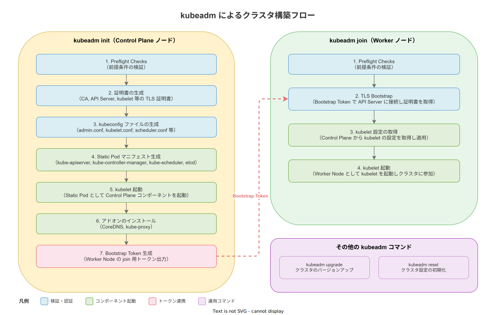

# kubeadm: 基本

- 対象読者: Kubernetes の基本概念（Pod, Node, Control Plane）を理解している開発者
- 学習目標: kubeadm の役割を理解し、クラスタの初期構築・ノード追加・アップグレード・リセットを実行できるようになる
- 所要時間: 約 35 分
- 対象バージョン: kubeadm v1.32
- 最終更新日: 2026-04-12

## 1. このドキュメントで学べること

- kubeadm が解決する課題と位置づけを説明できる
- `kubeadm init` によるControl Plane の構築手順を理解できる
- `kubeadm join` による Worker Node の追加手順を理解できる
- `kubeadm upgrade` / `kubeadm reset` の用途を説明できる

## 2. 前提知識

- Kubernetes の基本概念（Pod, Node, Control Plane, Worker Node）
  - 参照: [Kubernetes: 基本](../infra/kubernetes_basics.md)
- Linux コマンドラインの基本操作（root 権限での操作を含む）
- コンテナランタイム（containerd 等）の基礎知識

## 3. 概要

kubeadm は、Kubernetes クラスタを構築するための公式 CLI ツールである。Kubernetes の SIG Cluster Lifecycle が開発・保守している。

Kubernetes クラスタを手動で構築するには、証明書の生成、etcd の設定、各コンポーネントの起動設定など数十のステップが必要になる。kubeadm はこれらを `kubeadm init`（Control Plane 構築）と `kubeadm join`（ノード追加）の 2 コマンドに集約し、ベストプラクティスに沿ったクラスタを短時間で構築できる。

kubeadm はクラスタの「ブートストラップ」に特化しており、OS のプロビジョニングやネットワークプラグイン（CNI）の選定は範囲外である。この設計により、Ansible・Terraform 等の既存ツールと組み合わせて柔軟に利用できる。

## 4. 用語の整理

| 用語 | 説明 |
|------|------|
| kubeadm init | Control Plane ノードを初期化するコマンド |
| kubeadm join | 既存クラスタに Worker Node（または追加の Control Plane）を参加させるコマンド |
| kubeadm upgrade | クラスタの Kubernetes バージョンをアップグレードするコマンド |
| kubeadm reset | kubeadm で行った変更を元に戻し、ノードをクリーンな状態に戻すコマンド |
| Bootstrap Token | Worker Node がクラスタに参加する際の一時的な認証トークン |
| Static Pod | kubelet が直接管理する Pod。API Server を経由せずマニフェストファイルから起動される |
| Preflight Checks | コマンド実行前に前提条件（OS 設定、ポート、権限等）を検証する事前チェック |
| CNI | Container Network Interface。Pod 間のネットワーク通信を実現するプラグイン仕様 |

## 5. 仕組み・アーキテクチャ

kubeadm は `init` と `join` の 2 つの主要コマンドでクラスタを構築する。以下の図は各コマンドの実行フェーズを示している。



### kubeadm init の処理フェーズ

| フェーズ | 処理内容 |
|---------|---------|
| Preflight Checks | OS 設定・ポート・権限等の前提条件を検証する |
| 証明書生成 | CA・API Server・kubelet 等の TLS 証明書を `/etc/kubernetes/pki/` に生成する |
| kubeconfig 生成 | admin.conf・kubelet.conf・scheduler.conf 等を `/etc/kubernetes/` に生成する |
| Static Pod マニフェスト | kube-apiserver・kube-controller-manager・kube-scheduler・etcd のマニフェストを生成する |
| kubelet 起動 | kubelet が Static Pod として Control Plane コンポーネントを起動する |
| アドオン | CoreDNS と kube-proxy をクラスタにインストールする |
| Token 生成 | Worker Node が join するための Bootstrap Token を出力する |

### kubeadm join の処理フェーズ

| フェーズ | 処理内容 |
|---------|---------|
| Preflight Checks | OS 設定・ポート等の前提条件を検証する |
| TLS Bootstrap | Bootstrap Token で API Server に接続し、kubelet 用の証明書を取得する |
| kubelet 設定取得 | Control Plane から kubelet の設定（ConfigMap）を取得して適用する |
| kubelet 起動 | Worker Node として kubelet を起動し、クラスタに参加する |

## 6. 環境構築

### 6.1 必要なもの

- Linux マシン 2 台以上（物理・仮想問わない。1 台は Control Plane、残りは Worker Node）
- 各マシンに以下がインストール済みであること
  - コンテナランタイム（containerd 推奨）
  - kubeadm, kubelet, kubectl
- スワップが無効化されていること
- 必要なポートが開放されていること（6443, 10250 等）

### 6.2 セットアップ手順

```bash
# スワップを無効化する
sudo swapoff -a

# 必要なカーネルモジュールをロードする
sudo modprobe br_netfilter

# kubeadm・kubelet・kubectl をインストールする（Debian/Ubuntu の場合）
sudo apt-get update
sudo apt-get install -y kubeadm kubelet kubectl

# kubelet を自動起動に設定する
sudo systemctl enable kubelet
```

### 6.3 動作確認

```bash
# kubeadm のバージョンを確認する
kubeadm version
```

## 7. 基本の使い方

### Control Plane の構築（init）

```bash
# Control Plane ノードで kubeadm init を実行する
sudo kubeadm init --pod-network-cidr=10.244.0.0/16

# 一般ユーザーで kubectl を使えるように kubeconfig を設定する
mkdir -p $HOME/.kube
sudo cp /etc/kubernetes/admin.conf $HOME/.kube/config
sudo chown $(id -u):$(id -g) $HOME/.kube/config

# CNI プラグインをインストールする（Flannel の例）
kubectl apply -f https://github.com/flannel-io/flannel/releases/latest/download/kube-flannel.yml
```

### Worker Node の追加（join）

```bash
# init 完了時に出力されたコマンドを Worker Node で実行する
sudo kubeadm join <control-plane-ip>:6443 \
  --token <token> \
  --discovery-token-ca-cert-hash sha256:<hash>
```

### 解説

- `--pod-network-cidr`: Pod に割り当てる IP アドレスの範囲。CNI プラグインの要件に合わせて指定する
- `--token`: init 時に自動生成される Bootstrap Token。24 時間で有効期限が切れる
- `--discovery-token-ca-cert-hash`: CA 証明書のハッシュ値。中間者攻撃を防ぐために使用する

## 8. ステップアップ

### 8.1 クラスタのアップグレード

kubeadm はクラスタのバージョンアップグレードにも使用する。1 マイナーバージョンずつ段階的にアップグレードする必要がある。

```bash
# アップグレード可能なバージョンを確認する
sudo kubeadm upgrade plan

# Control Plane をアップグレードする
sudo kubeadm upgrade apply v1.32.0

# 各 Worker Node で kubelet を更新する
sudo kubeadm upgrade node
```

### 8.2 kubeadm reset によるクリーンアップ

クラスタの再構築やノードの離脱時に、kubeadm が行った変更をすべて元に戻す。

```bash
# ノードの設定をリセットする
sudo kubeadm reset

# iptables のルールをクリアする
sudo iptables -F && sudo iptables -t nat -F
```

## 9. よくある落とし穴

- **スワップが有効のまま init を実行する**: kubelet はデフォルトでスワップ有効時に起動を拒否する。事前に `swapoff -a` で無効化する
- **CNI プラグインの未インストール**: init 直後は Node が `NotReady` のままになる。CNI プラグインを適用して初めて `Ready` になる
- **Token の有効期限切れ**: Bootstrap Token はデフォルト 24 時間で失効する。失効後は `kubeadm token create --print-join-command` で再生成する
- **ポートの競合**: 6443（API Server）や 10250（kubelet）が既に使用されていると init が失敗する。Preflight Checks のエラーメッセージを確認する
- **バージョンスキュー**: kubeadm・kubelet・kubectl のバージョンは揃える必要がある。1 マイナーバージョン以上の差があると予期しない動作が発生する

## 10. ベストプラクティス

- `kubeadm init` 時に `--control-plane-endpoint` を指定して高可用性構成に備える
- 設定を YAML ファイル（`kubeadm-config.yaml`）で管理し、`--config` フラグで渡す
- 証明書の有効期限（デフォルト 1 年）を定期的に確認し、`kubeadm certs renew` で更新する
- アップグレードは必ず 1 マイナーバージョンずつ段階的に行う
- etcd のバックアップを定期的に取得してから upgrade を実行する

## 11. 演習問題

1. 仮想マシン 2 台を用意し、kubeadm で Control Plane 1 台・Worker Node 1 台のクラスタを構築せよ
2. 構築したクラスタで `kubectl get nodes` を実行し、両ノードが `Ready` であることを確認せよ
3. `kubeadm token list` で Bootstrap Token の有効期限を確認し、新しいトークンを `kubeadm token create` で生成せよ

## 12. さらに学ぶには

- 公式ドキュメント: https://kubernetes.io/docs/setup/production-environment/tools/kubeadm/
- kubeadm init リファレンス: https://kubernetes.io/docs/reference/setup-tools/kubeadm/kubeadm-init/
- 高可用性クラスタの構築: https://kubernetes.io/docs/setup/production-environment/tools/kubeadm/high-availability/

## 13. 参考資料

- Kubernetes 公式 kubeadm ドキュメント: https://kubernetes.io/docs/reference/setup-tools/kubeadm/
- kubeadm Design Documents: https://github.com/kubernetes/kubeadm/tree/main/docs/design
- Kubernetes The Hard Way: https://github.com/kelseyhightower/kubernetes-the-hard-way
