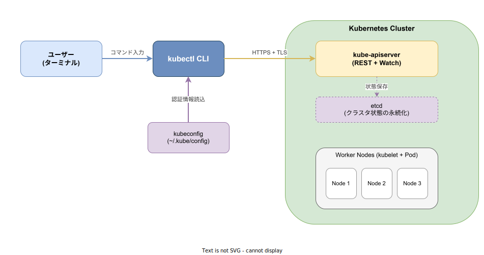
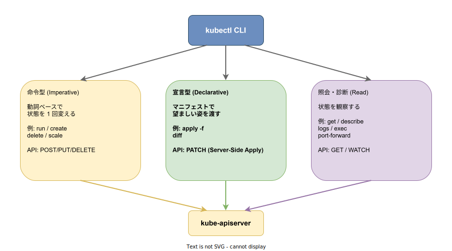

# kubectl: 基本

- 対象読者: Kubernetes クラスタを使い始める開発者・SRE
- 学習目標: kubectl の役割を説明し、リソースの参照・適用・更新・削除・ログ取得・対話シェル接続・ポート転送を 1 コマンドで実行できる
- 所要時間: 約 35 分
- 対象バージョン: kubectl v1.36（Kubernetes 1.36 系、2026-04 リリース）
- 最終更新日: 2026-05-01

## 1. このドキュメントで学べること

- kubectl が「Kubernetes API Server に対する CLI クライアント」であることを説明できる
- kubeconfig・コンテキスト・Namespace の関係を理解できる
- 命令型・宣言型・照会の 3 系統で kubectl コマンドを使い分けられる
- Pod / Deployment の作成、更新、ログ取得、対話シェル接続、ポート転送を 1 行で実行できる

## 2. 前提知識

- Kubernetes の基本概念（Pod / Deployment / Service / Namespace）
- YAML の読み書き
- HTTPS / TLS の基本（kubectl は TLS クライアント証明書または Bearer Token で API Server に認証する）
- 関連 Knowledge: クラスタ全体像は [`../infra/kubernetes_basics.md`](../infra/kubernetes_basics.md) を参照

## 3. 概要

kubectl は Kubernetes に対する **唯一の公式コマンドラインクライアント** である。Kubernetes の操作はすべて API Server への HTTPS リクエストとして実行され、kubectl はその HTTPS リクエストを「人が打ちやすい短い動詞」に翻訳するフロントエンドにすぎない。

API は Pod・Deployment・Service など何百種類ものリソースを持ち、生の HTTP/JSON で叩き続けるのは現実的ではない。kubectl はリソース種類ごとの URL・認証ヘッダ・パラメタを隠蔽し、`kubectl get pods` のように動詞 + リソース名で操作できる形に整える。さらに同じバイナリで複数クラスタ・複数権限を切り替えられるよう、接続設定を kubeconfig という 1 ファイルに集約する。

つまり kubectl の本質は **(1) HTTPS クライアント** と **(2) kubeconfig による接続切替器** の 2 点に集約される。クラスタ内部での状態保存（etcd）やコンテナ実行（kubelet）は API Server の先で起こり、kubectl からは透過的に見える。

## 4. 用語の整理

| 用語 | 説明 |
|------|------|
| API Server | Kubernetes クラスタの正面玄関。すべての操作はここへの HTTPS リクエストで完結する |
| kubeconfig | 接続先クラスタ・認証情報・既定 Namespace を束ねた YAML。既定パスは `~/.kube/config` |
| Context | kubeconfig 内で「クラスタ + ユーザー + Namespace」の組合せに付けた名前 |
| Resource | Pod / Deployment / Service など、API が管理する対象の総称 |
| 命令型コマンド | `kubectl run` / `create` / `delete` のように動詞で 1 回限りの状態変化を起こす操作 |
| 宣言型コマンド | `kubectl apply -f` のようにマニフェストで「あるべき姿」を渡す操作 |
| Server-Side Apply | API Server 側で差分を計算し冪等に適用する仕組み（Kubernetes 1.22 で GA） |

## 5. 仕組み・アーキテクチャ

kubectl は HTTPS クライアントであり、API Server との間で認証された TLS セッションを張る。認証情報・接続先 URL・既定 Namespace は kubeconfig から読まれる。クラスタ内部での状態保存（etcd）や Worker Node 上のコンテナ実行は API Server の先で起こり、kubectl からは透過的に見える。



kubectl のサブコマンドは大きく 3 系統に分かれる。命令型は「いま動かす」、宣言型は「望ましい姿に揃える」、照会系は「現在を観る」である。本番運用では宣言型を中心に、調査時に照会系、開発検証で命令型、と使い分けるのが定石である。



## 6. 環境構築

### 6.1 必要なもの

- 接続できる Kubernetes クラスタ（手元検証なら kind か minikube）
- kubectl v1.36 以降（API Server とのバージョン差は n±1 まで互換性が保証される）

### 6.2 セットアップ手順

```bash
# Linux: 公式 apt リポジトリからインストールする
curl -fsSL https://pkgs.k8s.io/core:/stable:/v1.36/deb/Release.key | sudo gpg --dearmor -o /etc/apt/keyrings/kubernetes-apt-keyring.gpg
echo 'deb [signed-by=/etc/apt/keyrings/kubernetes-apt-keyring.gpg] https://pkgs.k8s.io/core:/stable:/v1.36/deb/ /' | sudo tee /etc/apt/sources.list.d/kubernetes.list
sudo apt-get update && sudo apt-get install -y kubectl

# macOS: Homebrew でインストールする
brew install kubectl

# Windows: Chocolatey でインストールする
choco install kubernetes-cli
```

### 6.3 動作確認

```bash
# クライアント側のバージョンだけ表示する（クラスタ未接続でも実行可）
kubectl version --client

# 現在 kubeconfig が指しているクラスタの URL とノード一覧を確認する
kubectl cluster-info
kubectl get nodes
```

`kubectl get nodes` で `Ready` 状態のノードが返れば接続成功である。

## 7. 基本の使い方

```bash
# 現在のコンテキスト（接続中のクラスタ + Namespace）を表示する
kubectl config current-context

# 指定 Namespace の Pod を一覧する
kubectl get pods -n kube-system

# 1 リソースの詳細をイベント込みで確認する
kubectl describe pod <pod-name> -n <namespace>

# マニフェストでリソースをあるべき姿に揃える（宣言型）
kubectl apply -f deployment.yaml

# 命令型で素早く Pod を起動する（検証用、終了時に自動削除）
kubectl run debug --image=busybox --rm -it --restart=Never -- sh

# Pod のログをストリーミング表示する（-f で追従）
kubectl logs -f <pod-name> -n <namespace>

# 実行中コンテナに対話シェルで入る
kubectl exec -it <pod-name> -n <namespace> -- /bin/sh

# クラスタ内 Service をローカルポートに転送する
kubectl port-forward svc/<service-name> 8080:80 -n <namespace>

# リソースを削除する（マニフェスト基準）
kubectl delete -f deployment.yaml
```

### 解説

- `apply` は **Server-Side Apply** で動作し、同一マニフェストを何度実行しても結果が冪等になる。本番運用は基本これに統一する
- `run` / `create` は単発オペレーション用。既存リソースとの差分管理ができないため本番では避ける
- `logs -f` と `port-forward` は HTTPS の長時間接続を張り続ける挙動なので、ネットワーク切断時は再実行が必要
- `-n` を毎回指定する代わりに `kubectl config set-context --current --namespace=<ns>` で既定値を変更できる

## 8. ステップアップ

### 8.1 コンテキストと Namespace の切替

複数クラスタ・複数チームを横断する時はコンテキストを意識的に切り替える。`kubectx` / `kubens` を入れない場合でも素の kubectl で完結できる。

```bash
# 登録済みコンテキストを一覧する
kubectl config get-contexts

# コンテキストを切り替える
kubectl config use-context <context-name>

# 現在のコンテキストの既定 Namespace を変更する
kubectl config set-context --current --namespace=<ns>
```

### 8.2 出力フォーマットと jsonpath

`-o` で出力形式を切り替えられる。スクリプトに食わせる時は `jsonpath` か `go-template` が確実である。

```bash
# Pod 名と Node 名だけ抜き出す
kubectl get pods -o jsonpath='{range .items[*]}{.metadata.name}{"\t"}{.spec.nodeName}{"\n"}{end}'

# 全 Namespace の Deployment をワイド形式で表示する
kubectl get deploy -A -o wide
```

### 8.3 差分プレビューとドライラン

破壊的操作を流す前に差分とサーバー検証を取る習慣をつける。

```bash
# 適用前の差分を表示する（API Server 側で評価される）
kubectl diff -f deployment.yaml

# サーバー側で検証だけ行い、実際には適用しない
kubectl apply -f deployment.yaml --dry-run=server
```

## 9. よくある落とし穴

- **誤った Namespace を編集する**: 直前のコンテキストを引きずったまま `apply` を流して別環境を破壊する事故が起きる。本番触る前に必ず `kubectl config current-context` で確認すること
- **`kubectl edit` の保存忘れ**: エディタを保存せず閉じると変更が破棄される。CI 経由の宣言型運用に寄せると回避できる
- **クライアント / サーバー版差**: kubectl と API Server のバージョン差が n±1 を超えると一部 API で挙動が変わる。`kubectl version` で双方を確認すること
- **`kubectl get` のキャッシュ誤解**: `get` は常にリアルタイム照会で、`describe` のイベント欄も最新値である。古い結果を疑った時は接続先 kubeconfig を疑うべき

## 10. ベストプラクティス

- 本番変更は **宣言型 (`apply -f`) に統一** し、Git 管理されたマニフェストを単一の真実とする
- 環境ごとに kubeconfig ファイルを分け、`KUBECONFIG` 環境変数で明示的に切り替える（`~/.kube/config` に全部入れない）
- `kubectl diff` を CI に組み込み、PR 時点で差分が見えるようにする
- 大量リソースを `delete` する時は `--dry-run=client -o yaml` で対象を確認してから本実行する
- 開発検証では `kubectl run --rm -it` で使い捨て Pod を起動し、跡を残さない

## 11. 演習問題

1. 任意の Namespace に nginx の Deployment（レプリカ 2）をマニフェストで定義し、`kubectl apply` でデプロイせよ
2. `kubectl get pods -o jsonpath` で Pod 名と Node 名のみを抽出して表示せよ
3. `kubectl port-forward` で nginx の 80 番をローカル 8080 に転送し、`curl localhost:8080` で応答を確認せよ
4. レプリカを 3 に変更したマニフェストで `kubectl diff` を取り、差分が想定通りであることを確認してから `apply` せよ

## 12. さらに学ぶには

- 公式ドキュメント: <https://kubernetes.io/docs/reference/kubectl/>
- kubectl チートシート: <https://kubernetes.io/docs/reference/kubectl/quick-reference/>
- kubeconfig 仕様: <https://kubernetes.io/docs/concepts/configuration/organize-cluster-access-kubeconfig/>
- 関連 Knowledge: [`../infra/kubernetes_basics.md`](../infra/kubernetes_basics.md) / [`../infra/kubernetes_pod.md`](../infra/kubernetes_pod.md) / [`../infra/kubernetes_namespace.md`](../infra/kubernetes_namespace.md)
- 関連 Knowledge: パッケージ管理は [`./helm_basics.md`](./helm_basics.md)、宣言型 GitOps は [`./argo-cd_basics.md`](./argo-cd_basics.md)

## 13. 参考資料

- Kubernetes Documentation – kubectl Overview: <https://kubernetes.io/docs/reference/kubectl/>
- kubectl GitHub: <https://github.com/kubernetes/kubectl>
- Kubernetes Releases (v1.36, 2026-04-22): <https://kubernetes.io/releases/>
- Server-Side Apply: <https://kubernetes.io/docs/reference/using-api/server-side-apply/>
