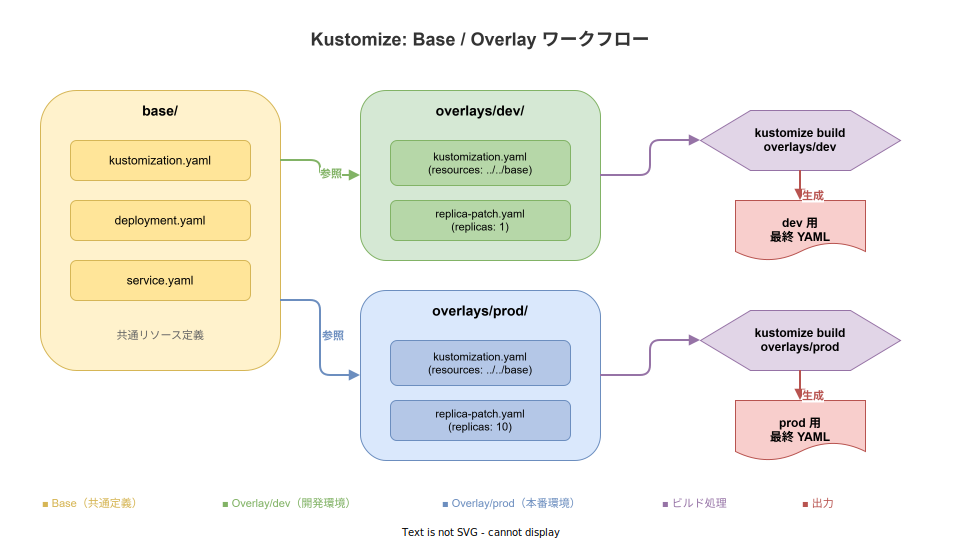
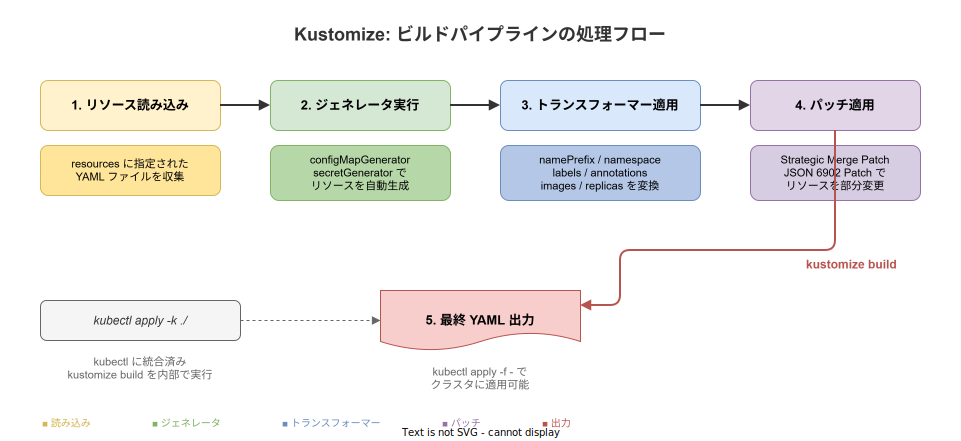

# Kustomize: 基本

- 対象読者: Kubernetes マニフェスト（YAML）の基本を理解している開発者
- 学習目標: Kustomize の仕組みを理解し、Base/Overlay パターンで環境ごとの構成管理ができるようになる
- 所要時間: 約 35 分
- 対象バージョン: Kustomize v5.x（kubectl v1.27 以降に統合）
- 最終更新日: 2026-04-13

## 1. このドキュメントで学べること

- Kustomize が解決する課題と Helm との違いを説明できる
- kustomization.yaml の基本構造を理解できる
- Base/Overlay パターンで環境別の構成を管理できる
- configMapGenerator / secretGenerator でリソースを自動生成できる
- patches によるリソースの部分変更ができる

## 2. 前提知識

- Kubernetes の基本概念（Pod, Deployment, Service, ConfigMap）
- kubectl によるマニフェスト適用の経験
- YAML の基本的な記法

## 3. 概要

Kustomize は Kubernetes マニフェストを**テンプレートなし**でカスタマイズするツールである。Kubernetes SIG（Special Interest Group）が開発し、kubectl v1.14 以降に標準統合されている。

従来、環境（開発・本番等）ごとに異なる設定を管理するには、YAML ファイルをコピーして編集するか、Helm のようなテンプレートエンジンを使う必要があった。Kustomize は「素の YAML をそのまま活かし、差分だけを宣言的に重ねる」というアプローチでこの課題を解決する。

Helm がテンプレート言語（Go template）で YAML を動的生成するのに対し、Kustomize は元の YAML に対してパッチやトランスフォーマーを適用する。YAML がそのまま読めるため、学習コストが低く、既存マニフェストへの導入が容易である。

## 4. 用語の整理

| 用語 | 説明 |
|------|------|
| kustomization.yaml | Kustomize の設定ファイル。リソース・パッチ・ジェネレータ等を宣言する |
| Base | 環境共通のリソース定義をまとめたディレクトリ |
| Overlay | Base を参照し、環境固有の差分を適用するディレクトリ |
| Patch | 既存リソースの一部を変更する差分定義 |
| Generator | ConfigMap や Secret を自動生成する機能 |
| Transformer | namePrefix や namespace 等をリソース横断で変換する機能 |
| Resource | Kustomize が管理対象とする Kubernetes マニフェストファイル |
| Component | 複数の Overlay で再利用可能な機能単位のカスタマイズ |

## 5. 仕組み・アーキテクチャ

### Base/Overlay パターン

Kustomize は Base（共通定義）と Overlay（環境差分）の 2 層構造で構成を管理する。



Base には環境に依存しない共通のマニフェストを配置する。各 Overlay は Base を `resources` フィールドで参照し、パッチや設定変更を重ねる。`kustomize build` を実行すると、Base と Overlay がマージされた最終 YAML が出力される。

### ビルドパイプライン

`kustomize build` の内部処理は以下の順序で実行される。



## 6. 環境構築

### 6.1 必要なもの

- kubectl v1.27 以降（Kustomize が統合済み）
- または Kustomize CLI 単体（詳細な機能が必要な場合）

### 6.2 セットアップ手順

```bash
# kubectl に統合された Kustomize のバージョンを確認する
kubectl version --client

# Kustomize CLI を単体でインストールする場合（任意）
# Go 環境がある場合
go install sigs.k8s.io/kustomize/kustomize/v5@latest
```

### 6.3 動作確認

```bash
# kubectl 統合版の動作確認
kubectl kustomize --help

# Kustomize CLI 単体の動作確認（インストールした場合）
kustomize version
```

## 7. 基本の使い方

以下は、Deployment と Service を管理する最小構成の例である。

```yaml
# kustomization.yaml: Kustomize の設定ファイル
apiVersion: kustomize.config.k8s.io/v1beta1
kind: Kustomization
# 管理対象のリソースファイルを指定する
resources:
  - deployment.yaml
  - service.yaml
```

```yaml
# deployment.yaml: nginx の Deployment 定義
apiVersion: apps/v1
kind: Deployment
metadata:
  # Deployment の名前を定義する
  name: my-app
spec:
  # レプリカ数を指定する
  replicas: 1
  selector:
    # Pod のラベルセレクタを定義する
    matchLabels:
      app: my-app
  template:
    metadata:
      # Pod に付与するラベルを定義する
      labels:
        app: my-app
    spec:
      containers:
        # コンテナ名を定義する
        - name: app
          # 使用するイメージを指定する
          image: nginx:1.27
```

### 解説

```bash
# kustomize build でマージ済み YAML を出力する
kustomize build .

# kubectl 統合版で直接適用する場合
kubectl apply -k .
```

`kustomize build` は標準出力に最終 YAML を出力する。`kubectl apply -k` は内部で `kustomize build` を実行し、その結果をクラスタに適用する。

## 8. ステップアップ

### 8.1 Overlay による環境分離

```yaml
# overlays/dev/kustomization.yaml: 開発環境用の Overlay
apiVersion: kustomize.config.k8s.io/v1beta1
kind: Kustomization
# Base ディレクトリを参照する
resources:
  - ../../base
# 開発用の namespace を設定する
namespace: dev
# リソース名にプレフィックスを付与する
namePrefix: dev-
# レプリカ数を開発用に変更する
replicas:
  - name: my-app
    count: 1
```

### 8.2 configMapGenerator による ConfigMap 自動生成

```yaml
# kustomization.yaml: ConfigMap をファイルやリテラルから自動生成する
configMapGenerator:
  - name: app-config
    # リテラル値から生成する
    literals:
      - LOG_LEVEL=debug
      - DB_HOST=localhost
  - name: nginx-config
    # ファイルから生成する
    files:
      - configs/nginx.conf
```

Generator で生成された ConfigMap にはコンテンツハッシュが名前に付与される（例: `app-config-k8m2d5`）。これにより、設定変更時に Pod が自動的に再起動される。

### 8.3 patches によるリソース変更

```yaml
# kustomization.yaml: パッチでリソースの一部を変更する
patches:
  # Strategic Merge Patch: YAML 形式でマージする
  - path: increase-memory.yaml
    target:
      kind: Deployment
      name: my-app
```

```yaml
# increase-memory.yaml: メモリ制限を追加するパッチ
apiVersion: apps/v1
kind: Deployment
metadata:
  # パッチ対象の名前を指定する
  name: my-app
spec:
  template:
    spec:
      containers:
        - name: app
          # リソース制限を追加する
          resources:
            limits:
              memory: "512Mi"
```

## 9. よくある落とし穴

- **Base を直接編集してしまう**: Base は全環境で共有されるため、環境固有の変更は必ず Overlay で行う
- **ハッシュ付き名前の参照ミス**: Generator が生成する ConfigMap/Secret にはハッシュが付くため、Deployment 側の参照名も Kustomize に自動解決させる必要がある。手動で名前を指定すると不整合が起きる
- **パッチの target 不一致**: パッチの `metadata.name` が Base のリソース名と一致しないとパッチが適用されない。エラーにならず無視される場合がある
- **resources の順序依存**: リソース間に依存関係がある場合、`resources` の記載順が適用順序に影響することがある

## 10. ベストプラクティス

- Base には環境非依存の最小構成のみを定義する
- 環境ごとの差分は Overlay に集約し、Overlay 間でファイルを共有しない
- `configMapGenerator` / `secretGenerator` を使い、ハッシュベースのローリング更新を活用する
- `kustomize build` の出力を CI で検証し、意図しない変更を検知する
- Argo CD 等の GitOps ツールと組み合わせ、Overlay ディレクトリをデプロイソースに指定する

## 11. 演習問題

1. Base に Deployment と Service を定義し、`kustomize build` で出力を確認せよ
2. dev と prod の 2 つの Overlay を作成し、レプリカ数と namespace を変えて出力を比較せよ
3. `configMapGenerator` で環境変数を定義し、Deployment から参照する構成を作成せよ
4. patches を使って prod Overlay のみメモリ制限を追加し、dev には影響しないことを確認せよ

## 12. さらに学ぶには

- 公式ドキュメント: https://kubectl.docs.kubernetes.io/references/kustomize/
- Kustomize GitHub: https://github.com/kubernetes-sigs/kustomize
- Kustomize Components（再利用可能なカスタマイズ）: https://kubectl.docs.kubernetes.io/guides/config_management/components/

## 13. 参考資料

- Kubernetes SIG CLI - Kustomize: https://github.com/kubernetes-sigs/kustomize
- Kustomize API Reference: https://kubectl.docs.kubernetes.io/references/kustomize/kustomization/
- Kubernetes Documentation - Managing Kubernetes Objects: https://kubernetes.io/docs/tasks/manage-kubernetes-objects/kustomization/
