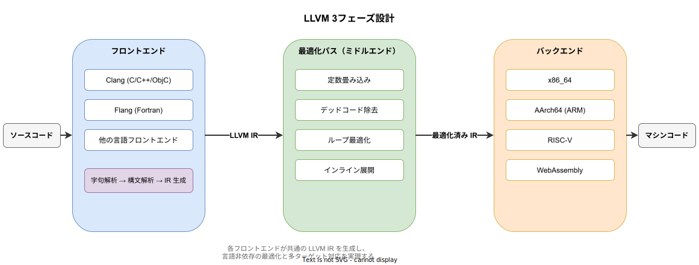
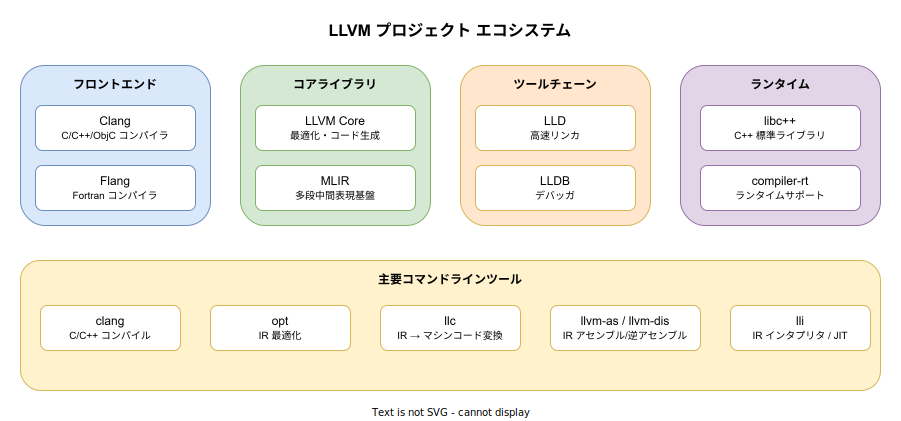

# LLVM: 概要

- 対象読者: コンパイラの基本概念（ソースコード→実行ファイルの流れ）を知っている開発者
- 学習目標: LLVM の設計思想・主要コンポーネント・IR の役割を説明でき、基本的なツールを使えるようになる
- 所要時間: 約 40 分
- 対象バージョン: LLVM 18.x / 19.x
- 最終更新日: 2026-04-12

## 1. このドキュメントで学べること

- LLVM が解決する課題と 3 フェーズ設計の意義を説明できる
- LLVM IR の役割と基本構造を理解できる
- LLVM プロジェクトの主要コンポーネント（Clang, LLD, LLDB 等）を把握できる
- `clang`, `opt`, `llc` 等の基本ツールを使って IR の生成・最適化・コード生成ができる

## 2. 前提知識

- C 言語の基本的な読み書きができること
- コンパイル・リンクの流れ（ソースコード → オブジェクトファイル → 実行ファイル）の概念
- コマンドラインの基本操作

## 3. 概要

LLVM（Low Level Virtual Machine の略に由来するが、現在はプロジェクト名として独立）は、コンパイラを構築するための再利用可能なライブラリとツールの集合体である。2000 年にイリノイ大学の Chris Lattner の研究プロジェクトとして始まり、現在は Apple, Google, ARM, Intel など多くの企業が開発に参加している。

従来のコンパイラは、ある言語をある CPU 向けにコンパイルする「一枚岩」の構造が一般的であった。M 個の言語と N 個のターゲットがあると M×N 個のコンパイラが必要になる。LLVM は「フロントエンド」「最適化パス」「バックエンド」の 3 フェーズに分離し、中間に LLVM IR（Intermediate Representation、中間表現）という共通言語を置くことで、この問題を M+N に削減した。新しい言語をサポートするにはフロントエンドを書くだけでよく、新しい CPU に対応するにはバックエンドを書くだけでよい。

## 4. 用語の整理

| 用語 | 説明 |
|------|------|
| LLVM IR | LLVM の中間表現。人間が読めるテキスト形式（.ll）とバイナリ形式（.bc）がある |
| フロントエンド | ソースコードを解析して LLVM IR を生成するコンパイラの前段部分 |
| ミドルエンド | LLVM IR に対して言語非依存の最適化を行う中間部分 |
| バックエンド | LLVM IR から特定の CPU 向けのマシンコードを生成する後段部分 |
| パス（Pass） | IR に対する 1 つの解析または変換処理の単位 |
| SSA | Static Single Assignment の略。各変数が一度だけ代入される形式。LLVM IR はこの形式を採用している |
| ターゲットトリプル | CPU アーキテクチャ・ベンダー・OS の組み合わせ（例: x86_64-unknown-linux-gnu） |
| Clang | LLVM ベースの C/C++/Objective-C コンパイラ |

## 5. 仕組み・アーキテクチャ

LLVM は 3 フェーズ設計を採用している。フロントエンドがソースコードを LLVM IR に変換し、ミドルエンドが言語に依存しない最適化を行い、バックエンドが特定の CPU 向けマシンコードを生成する。



この設計により、Clang（C/C++）、Flang（Fortran）、Rust コンパイラ（rustc）など複数のフロントエンドが同一の最適化パスとバックエンドを共有できる。

LLVM プロジェクトは以下のサブプロジェクトで構成される。



## 6. 環境構築

### 6.1 必要なもの

- LLVM / Clang（パッケージマネージャでインストール可能）
- ターミナル

### 6.2 セットアップ手順

```bash
# Ubuntu/Debian の場合: LLVM と Clang をインストールする
sudo apt install llvm clang

# macOS の場合: Xcode Command Line Tools に Clang が含まれている
xcode-select --install

# Windows の場合: LLVM 公式サイトからインストーラをダウンロードする
# または winget を使用する
winget install LLVM.LLVM
```

### 6.3 動作確認

```bash
# Clang のバージョンを確認する
clang --version

# LLVM ツールのバージョンを確認する
llc --version
```

バージョン番号とサポート対象ターゲット一覧が表示されればセットアップ完了である。

## 7. 基本の使い方

以下は C ソースコードから LLVM IR を生成し、最適化を経てマシンコードに変換する流れである。

```c
// LLVM IR 生成のデモ用 C プログラム

// 二つの整数を加算して返す関数
int add(int a, int b) {
    // a と b の和を返す
    return a + b;
}

// エントリポイント
int main() {
    // add 関数を呼び出して結果を取得する
    int result = add(3, 4);
    // 結果を返す
    return result;
}
```

### 解説

```bash
# C ソースから LLVM IR（テキスト形式 .ll）を生成する
clang -S -emit-llvm add.c -o add.ll

# 生成された IR を確認する（SSA 形式の中間表現が出力される）
cat add.ll

# IR に最適化パスを適用する（-O2 相当の最適化）
opt -O2 add.ll -S -o add_opt.ll

# 最適化済み IR からターゲットのアセンブリを生成する
llc add_opt.ll -o add.s

# 通常のコンパイルでは clang が全工程を一括実行する
clang -O2 add.c -o add
```

`clang -S -emit-llvm` で生成される IR は以下のような SSA 形式である。各変数（`%` で始まる）は一度だけ代入され、すべての演算が明示的に型付けされている。

## 8. ステップアップ

### 8.1 LLVM IR の読み方

LLVM IR にはモジュール・関数・基本ブロック・命令という 4 層の構造がある。モジュールが最上位で、関数を含む。関数は基本ブロック（ラベル付きの命令列）で構成され、各ブロックはターミネータ命令（`ret`, `br` 等）で終わる。`add` 命令は整数加算、`load`/`store` はメモリアクセス、`call` は関数呼び出しを表す。

### 8.2 最適化パスの仕組み

LLVM の最適化はパスの連鎖で実現される。各パスは IR を入力として受け取り、解析（Analysis Pass）または変換（Transform Pass）を行う。`opt` コマンドで個別のパスを指定して実行できる。代表的なパスとして、`mem2reg`（メモリアクセスをレジスタ操作に昇格）、`inline`（関数インライン展開）、`gvn`（Global Value Numbering、冗長な計算の除去）がある。

## 9. よくある落とし穴

- **LLVM IR はアセンブリではない**: IR は CPU のアセンブリ言語に似ているが、CPU 非依存の抽象的な命令セットである。特定の CPU のレジスタやアドレッシングモードは含まない
- **最適化レベルの影響**: `-O0` と `-O2` では生成される IR が大きく異なる。学習時は `-O0` で生成した IR を `-O2` で最適化する手順で違いを確認するとよい
- **ターゲットトリプルの不一致**: クロスコンパイル時にターゲットトリプルを正しく指定しないとリンクエラーが発生する

## 10. ベストプラクティス

- コンパイラ開発で LLVM を利用する場合、IR を直接文字列で生成するのではなく LLVM の C++ API（`IRBuilder`）を使用する。API はバージョン間の IR フォーマット変更を吸収する
- `opt` で個別パスを試し、各最適化の効果を観察することで IR の理解が深まる
- Rust や Swift など LLVM ベースの言語でも `--emit=llvm-ir` 等のオプションで IR を出力できる。言語間で IR を比較することで LLVM の言語非依存性を実感できる

## 11. 演習問題

1. 簡単な C プログラムを書き、`clang -S -emit-llvm -O0` で IR を生成せよ。次に `-O2` で生成した IR と比較し、どのような最適化が行われたか説明せよ
2. `opt -passes=mem2reg` を最適化なしの IR に適用し、`alloca`/`load`/`store` がレジスタ操作に変換される様子を確認せよ
3. `llc` コマンドで異なるターゲット（x86_64, aarch64 等）のアセンブリを生成し、同じ IR から異なるマシンコードが生成されることを確認せよ

## 12. さらに学ぶには

- 公式ドキュメント: https://llvm.org/docs/
- LLVM Language Reference Manual: https://llvm.org/docs/LangRef.html
- Kaleidoscope チュートリアル（LLVM で言語を作る入門）: https://llvm.org/docs/tutorial/
- "LLVM for Grad Students"（Adrian Sampson）: アーキテクチャとパス開発の簡潔な解説

## 13. 参考資料

- LLVM Project: https://llvm.org/
- LLVM GitHub Repository: https://github.com/llvm/llvm-project
- The Architecture of Open Source Applications: LLVM Chapter: https://aosabook.org/en/v1/llvm.html
- LLVM Documentation FAQ: https://llvm.org/docs/FAQ.html
