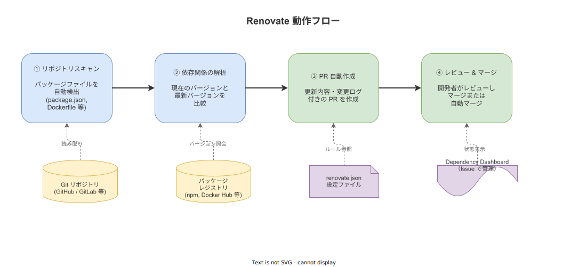
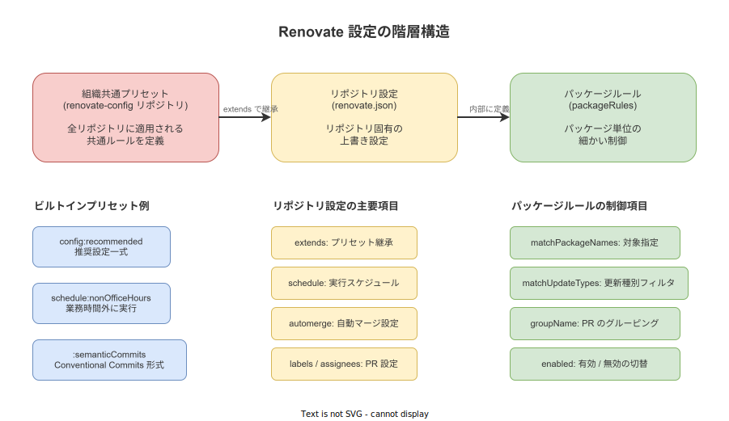

# Renovate: 概要

- 対象読者: Git / GitHub の基本操作ができ、依存パッケージの管理経験がある開発者
- 学習目標: Renovate の仕組みを理解し、リポジトリに導入して依存関係の自動更新を運用できるようになる
- 所要時間: 約 35 分
- 対象バージョン: Renovate 43.x（2026 年 4 月時点）
- 最終更新日: 2026-04-13

## 1. このドキュメントで学べること

- Renovate が解決する課題と依存関係の自動更新の意義を説明できる
- Renovate の動作フローを理解できる
- `renovate.json` の基本的な設定項目を把握し、リポジトリに適用できる
- スケジュール・自動マージ・パッケージルールの使い分けを理解できる

## 2. 前提知識

- Git の基本操作（commit, push, pull request の作成）
- パッケージマネージャの基本概念（npm, pip, Cargo 等のいずれか）
- JSON の基本的な読み書き

## 3. 概要

Renovate は、ソフトウェアの依存関係を自動的に最新の状態に保つためのオープンソースツールである。リポジトリ内のパッケージファイル（`package.json`、`Dockerfile`、`Cargo.toml` 等）をスキャンし、古くなった依存パッケージを検出して、更新用のプルリクエスト（PR）を自動作成する。

依存パッケージの更新を手作業で行うと、セキュリティパッチの適用が遅れたり、更新が滞って一度に大量のバージョンアップが必要になるリスクがある。Renovate はこの作業を自動化し、小さな更新を継続的に取り込む運用を実現する。90 以上のパッケージマネージャに対応し、GitHub・GitLab・Bitbucket・Azure DevOps 等の主要な Git プラットフォームで動作する。

## 4. 用語の整理

| 用語 | 説明 |
|------|------|
| Renovate Bot | Renovate の実行主体。GitHub App やセルフホストで動作する |
| `renovate.json` | リポジトリのルートに配置する設定ファイル |
| プリセット（Preset） | 再利用可能な設定テンプレート。`config:recommended` 等 |
| パッケージルール（packageRules） | 特定のパッケージやバージョン種別に対する個別ルール |
| Dependency Dashboard | リポジトリの Issue として作成される依存関係の管理画面 |
| 自動マージ（Automerge） | CI が通った PR を人手を介さずマージする機能 |
| マネージャ（Manager） | パッケージファイルの種類ごとの解析エンジン（npm, docker, cargo 等） |

## 5. 仕組み・アーキテクチャ

Renovate は以下のフローで動作する。リポジトリのスキャンからPR作成まで、すべて自動的に実行される。



設定は階層的に管理できる。組織共通のプリセットをベースに、リポジトリ固有の設定で上書きし、さらにパッケージ単位の細かい制御を行う。



## 6. 環境構築

### 6.1 必要なもの

- GitHub アカウント（GitLab / Bitbucket でも可）
- 対象リポジトリへの管理者権限

### 6.2 セットアップ手順（GitHub App 方式）

1. GitHub Marketplace から Renovate App をインストールする
2. 対象リポジトリへのアクセスを許可する
3. Renovate が自動的にオンボーディング PR を作成する
4. オンボーディング PR をマージすると `renovate.json` がリポジトリに追加される

### 6.3 動作確認

オンボーディング PR のマージ後、Renovate が依存関係をスキャンし、更新が必要なパッケージがあれば自動的に PR が作成される。リポジトリの Issues タブに Dependency Dashboard が作成されていることも確認する。

## 7. 基本の使い方

以下は、推奨設定を適用した最小構成の `renovate.json` である。

```json
// Renovate 設定ファイル: リポジトリルートに配置する
{
  // JSON Schema を指定してエディタの補完を有効にする
  "$schema": "https://docs.renovatebot.com/renovate-schema.json",
  // 推奨プリセットを継承する
  "extends": ["config:recommended"]
}
```

### 解説

- `$schema`: エディタでの入力補完とバリデーションを有効にする。動作には必須ではないが推奨される
- `extends`: プリセットを継承する。`config:recommended` は Renovate が公式に推奨する設定一式を含む

`config:recommended` には、以下の設定が含まれる:

- セマンティックコミットの自動検出
- 主要モノレポパッケージのグルーピング
- PR のラベル付与
- ロックファイルのメンテナンス

## 8. ステップアップ

### 8.1 スケジュールの設定

Renovate の実行タイミングを制御できる。業務時間外に PR を作成することで、開発中の集中を妨げない運用が可能である。

```json
// スケジュールを設定する例
{
  "extends": ["config:recommended"],
  // 月曜の朝 9 時までに PR を作成する
  "schedule": ["before 9am on monday"],
  // タイムゾーンを東京に設定する
  "timezone": "Asia/Tokyo"
}
```

### 8.2 自動マージの設定

リスクの低い更新（devDependencies のパッチ更新など）は自動マージを設定できる。

```json
// パッケージルールで自動マージを設定する例
{
  "extends": ["config:recommended"],
  "packageRules": [
    {
      // devDependencies のマイナー・パッチ更新を自動マージする
      "matchDepTypes": ["devDependencies"],
      "matchUpdateTypes": ["minor", "patch"],
      "automerge": true
    },
    {
      // メジャー更新は手動レビュー必須にする
      "matchUpdateTypes": ["major"],
      "automerge": false,
      "labels": ["major-update"]
    }
  ]
}
```

### 8.3 PR の同時数制限

大量の PR が一度に作られると対応が困難になる。同時に存在できる PR 数を制限できる。

```json
// PR の同時数を制限する例
{
  "extends": ["config:recommended"],
  // 同時に存在できる PR を最大 5 件に制限する
  "prConcurrentLimit": 5,
  // 1 時間あたりの PR 作成数を最大 2 件に制限する
  "prHourlyLimit": 2
}
```

## 9. よくある落とし穴

- **オンボーディング PR の放置**: 初回の PR をマージしないと Renovate は動作を開始しない
- **メジャー更新の自動マージ**: 破壊的変更を含む可能性があるため、メジャー更新の自動マージは避ける
- **PR の大量発生**: 初回導入時に古い依存が多いと大量の PR が作られる。`prConcurrentLimit` で制御する
- **ロックファイルの競合**: 複数の Renovate PR が同時に存在すると、ロックファイルでコンフリクトが発生しやすい。`rebaseWhen` の設定で緩和できる
- **プリセットの過信**: `config:recommended` の内容を理解せずに使うと、意図しないパッケージまで自動更新される

## 10. ベストプラクティス

- まず `config:recommended` から始め、必要に応じてカスタマイズを追加する
- メジャー更新は自動マージせず、手動レビューを必須にする
- CI パイプラインを整備してから Renovate を導入する（自動マージの安全性を確保するため）
- 組織で複数リポジトリを管理する場合は、共通プリセットリポジトリを作成して `extends` で継承する
- Dependency Dashboard を定期的に確認し、保留中の更新を把握する
- セキュリティ関連の更新（`vulnerabilityAlerts`）は即時適用するルールを設定する

## 11. 演習問題

1. 自分のリポジトリに `renovate.json` を配置し、`config:recommended` を適用せよ
2. `packageRules` を使って、特定のパッケージ（例: テスト関連）のパッチ更新を自動マージする設定を記述せよ
3. スケジュールを設定し、平日の夜間のみ PR が作成されるようにせよ

## 12. さらに学ぶには

- 公式ドキュメント: <https://docs.renovatebot.com/>
- 設定オプションリファレンス: <https://docs.renovatebot.com/configuration-options/>
- プリセット一覧: <https://docs.renovatebot.com/presets-config/>
- 関連 Knowledge: GitHub Actions の基本は `github-actions_basics.md` を参照

## 13. 参考資料

- Renovate Documentation: <https://docs.renovatebot.com/>
- Renovate GitHub Repository: <https://github.com/renovatebot/renovate>
- Key concepts - Renovate Docs: <https://docs.renovatebot.com/key-concepts/>
