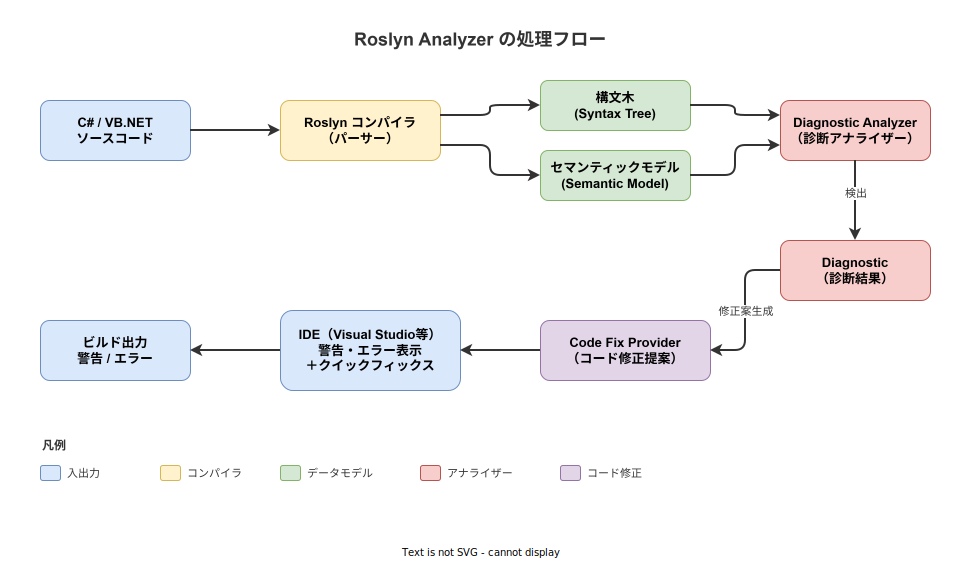
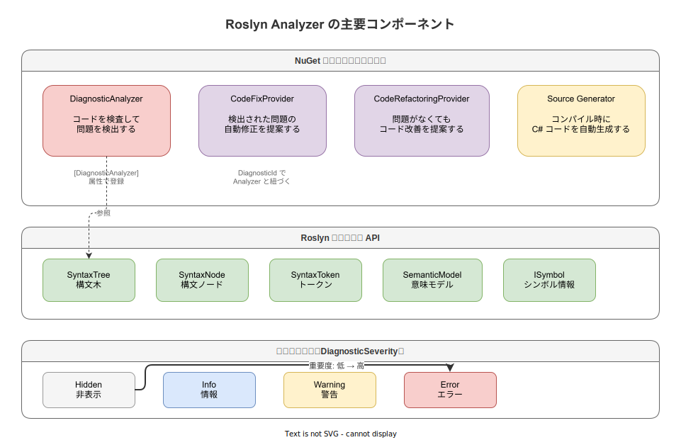

# Roslyn Analyzer: 基本

- 対象読者: C# の基本的な読み書きができる開発者
- 学習目標: Roslyn Analyzer の仕組みを理解し、カスタムアナライザーを作成できるようになる
- 所要時間: 約 40 分
- 対象バージョン: .NET 8.0 / Microsoft.CodeAnalysis 4.x
- 最終更新日: 2026-04-13

## 1. このドキュメントで学べること

- Roslyn Analyzer が何であり、なぜ必要かを説明できる
- 構文木（Syntax Tree）とセマンティックモデルの違いを理解できる
- カスタム DiagnosticAnalyzer を作成し、ビルド時に独自の警告を出せる
- CodeFixProvider で自動修正を提案する方法を理解できる

## 2. 前提知識

- C# の基本構文（クラス、メソッド、属性など）の理解
- NuGet パッケージの追加方法
- Visual Studio または .NET CLI の基本操作

## 3. 概要

Roslyn Analyzer は、.NET Compiler Platform（通称 Roslyn）のコンパイラ API を利用した静的コード解析ツールである。コンパイラが構築する構文木やセマンティックモデルに直接アクセスし、コーディング規約違反やバグの兆候をビルド時にリアルタイムで検出する。

従来の静的解析ツール（FxCop など）は、コンパイル済みの IL（中間言語）を後から解析していた。Roslyn Analyzer はコンパイルプロセスに組み込まれるため、ソースコードの構造をそのまま解析でき、より正確で高速な診断が可能である。

Roslyn Analyzer は NuGet パッケージとして配布されるため、プロジェクトに追加するだけでチーム全体に同一のコード品質基準を適用できる。

## 4. 用語の整理

| 用語 | 説明 |
|------|------|
| Roslyn | .NET Compiler Platform の通称。C# / VB.NET コンパイラをライブラリとして公開するプロジェクト |
| Syntax Tree | ソースコードをツリー構造に変換したもの。コードの「形」を表す |
| Semantic Model | 型情報やシンボル解決など、コードの「意味」を表すモデル |
| DiagnosticAnalyzer | コードを検査し、問題を検出するクラスの基底クラス |
| CodeFixProvider | 検出された問題に対して自動修正コードを提案するクラスの基底クラス |
| Diagnostic | アナライザーが報告する個々の警告やエラーのこと |
| DiagnosticDescriptor | 診断の ID・タイトル・重要度などを定義する記述子 |
| Severity | 診断の重要度。Hidden / Info / Warning / Error の 4 段階 |

## 5. 仕組み・アーキテクチャ

Roslyn Analyzer はコンパイルパイプラインに統合されている。コンパイラがソースコードを解析して構文木とセマンティックモデルを構築し、それらをアナライザーに渡す。アナライザーは問題を検出すると Diagnostic を報告し、CodeFixProvider が修正案を IDE に提示する。



主要コンポーネントの関係と診断の重要度レベルを以下に示す。



## 6. 環境構築

### 6.1 必要なもの

- .NET SDK 8.0 以上
- Visual Studio 2022 または JetBrains Rider（IDE 統合を利用する場合）
- .NET CLI（コマンドラインで開発する場合）

### 6.2 セットアップ手順

```bash
# アナライザー用のクラスライブラリプロジェクトを作成する
dotnet new classlib -n MyAnalyzer -f netstandard2.0

# Roslyn の解析 API パッケージを追加する
cd MyAnalyzer
dotnet add package Microsoft.CodeAnalysis.Analyzers
dotnet add package Microsoft.CodeAnalysis.CSharp
```

### 6.3 動作確認

```bash
# プロジェクトがビルドできることを確認する
dotnet build
```

## 7. 基本の使い方

以下は「メソッド名が小文字で始まっている場合に警告を出す」最小のアナライザーである。

```csharp
// メソッド名の命名規則を検査する Roslyn Analyzer
using System.Collections.Immutable;
using Microsoft.CodeAnalysis;
using Microsoft.CodeAnalysis.Diagnostics;

// DiagnosticAnalyzer 属性で対象言語を指定する
[DiagnosticAnalyzer(LanguageNames.CSharp)]
public class MethodNamingAnalyzer : DiagnosticAnalyzer
{
    // 診断 ID を定義する
    public const string DiagnosticId = "MY001";

    // 診断の説明を定義する
    private static readonly DiagnosticDescriptor Rule = new(
        // 一意の診断 ID
        id: DiagnosticId,
        // IDE に表示されるタイトル
        title: "メソッド名は大文字で始めること",
        // 詳細メッセージ（{0} にメソッド名が入る）
        messageFormat: "メソッド '{0}' は大文字で始めてください",
        // 分類カテゴリ
        category: "Naming",
        // 重要度を Warning に設定する
        defaultSeverity: DiagnosticSeverity.Warning,
        // このルールをデフォルトで有効にする
        isEnabledByDefault: true
    );

    // サポートする診断の一覧を返す
    public override ImmutableArray<DiagnosticDescriptor>
        SupportedDiagnostics => ImmutableArray.Create(Rule);

    // 解析の初期化処理を定義する
    public override void Initialize(AnalysisContext context)
    {
        // 生成コードの解析を無効にする
        context.ConfigureGeneratedCodeAnalysis(
            GeneratedCodeAnalysisFlags.None);
        // 並行解析を有効にする
        context.EnableConcurrentExecution();
        // シンボル解析のコールバックを登録する
        context.RegisterSymbolAction(
            AnalyzeSymbol, SymbolKind.Method);
    }

    // メソッドシンボルを検査する
    private static void AnalyzeSymbol(
        SymbolAnalysisContext context)
    {
        // 解析対象のシンボルを取得する
        var symbol = (IMethodSymbol)context.Symbol;
        // メソッド名の先頭が小文字かどうかを判定する
        if (char.IsLower(symbol.Name[0]))
        {
            // 診断を生成して報告する
            var diagnostic = Diagnostic.Create(
                Rule, symbol.Locations[0], symbol.Name);
            // コンテキストに診断を報告する
            context.ReportDiagnostic(diagnostic);
        }
    }
}
```

### 解説

`DiagnosticAnalyzer` を継承し、`Initialize` メソッドで解析対象（この例ではメソッドシンボル）を登録する。コンパイラがメソッドシンボルを処理するたびに `AnalyzeSymbol` が呼ばれ、命名規則に違反していれば `Diagnostic.Create` で警告を報告する。

## 8. ステップアップ

### 8.1 .editorconfig による制御

プロジェクトの `.editorconfig` ファイルで、アナライザーの重要度をプロジェクト単位で変更できる。

```ini
# MY001 ルールの重要度をエラーに変更する
dotnet_diagnostic.MY001.severity = error

# 特定のカテゴリ全体を無効にする
dotnet_analyzer_diagnostic.category-Naming.severity = none
```

### 8.2 代表的な公開アナライザー

| パッケージ名 | 用途 |
|-------------|------|
| StyleCop.Analyzers | コーディングスタイルの統一 |
| SonarAnalyzer.CSharp | セキュリティ・信頼性の検査 |
| Meziantou.Analyzer | 幅広いベストプラクティス検査 |
| Roslynator | 500 以上のリファクタリング・診断 |

## 9. よくある落とし穴

- **Analyzer と Source Generator の混同**: Analyzer はコードを検査するだけで変更しない。コンパイル時にコードを追加するのは Source Generator の役割である
- **netstandard2.0 を使う必要がある**: Analyzer プロジェクトは `netstandard2.0` をターゲットにする必要がある。.NET 8 などをターゲットにするとコンパイラがロードできない
- **状態の保持禁止**: `DiagnosticAnalyzer` のインスタンスはコンパイラが管理するため、フィールドに状態を保持してはならない。並行実行時にデータ競合が発生する
- **過剰な Severity 設定**: すべてを Error にするとビルドが通らなくなり、開発速度が低下する。チームで重要度の方針を合意してから設定する

## 10. ベストプラクティス

- 診断 ID はプロジェクト固有のプレフィックス（例: `MY001`）を付け、他のアナライザーとの衝突を避ける
- `EnableConcurrentExecution()` を呼び出し、並行解析を有効にしてパフォーマンスを確保する
- `ConfigureGeneratedCodeAnalysis(None)` で自動生成コードの解析を除外し、誤検知を減らす
- CI パイプラインで `dotnet build -warnaserror` を使い、Warning を Error として扱うことで品質を強制できる

## 11. 演習問題

1. 上記の `MethodNamingAnalyzer` をプロジェクトに追加し、小文字始まりのメソッドに対して警告が出ることを確認せよ
2. `.editorconfig` で `MY001` の重要度を `error` に変更し、ビルドが失敗することを確認せよ
3. `CodeFixProvider` を実装し、メソッド名の先頭を大文字に変換する自動修正を追加せよ

## 12. さらに学ぶには

- 公式チュートリアル: https://learn.microsoft.com/ja-jp/dotnet/csharp/roslyn-sdk/tutorials/how-to-write-csharp-analyzer-code-fix
- Roslyn GitHub リポジトリ: https://github.com/dotnet/roslyn
- Roslyn Analyzers リポジトリ: https://github.com/dotnet/roslyn-analyzers
- Syntax Visualizer（Visual Studio 拡張）: 構文木をリアルタイムに可視化できるツール

## 13. 参考資料

- Microsoft Learn - .NET Compiler Platform SDK: https://learn.microsoft.com/ja-jp/dotnet/csharp/roslyn-sdk/
- Microsoft Learn - Roslyn Analyzers Overview: https://learn.microsoft.com/ja-jp/visualstudio/code-quality/roslyn-analyzers-overview
- .NET Compiler Platform SDK API Reference: https://learn.microsoft.com/ja-jp/dotnet/api/microsoft.codeanalysis
