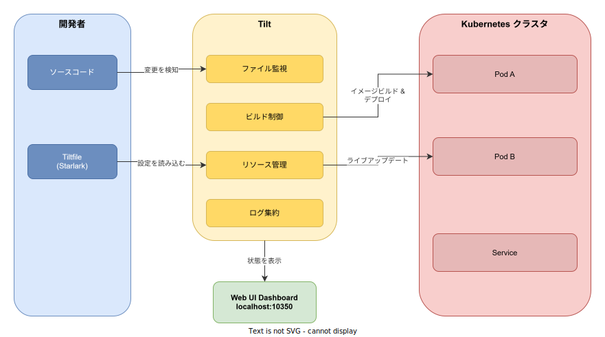
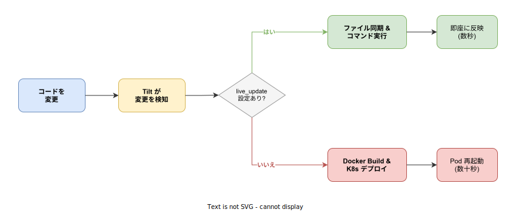

# Tilt: 基本

- 対象読者: Kubernetes と Docker の基本操作を理解している開発者
- 学習目標: Tilt の仕組みを理解し、Kubernetes 上のマイクロサービス開発でライブアップデートを活用できるようになる
- 所要時間: 約 35 分
- 対象バージョン: Tilt v0.37
- 最終更新日: 2026-04-13

## 1. このドキュメントで学べること

- Tilt が解決する課題と従来の開発ワークフローとの違いを説明できる
- Tiltfile の基本構文を理解し、最小構成を記述できる
- live_update を使ったホットリロード開発環境を構築できる
- Web UI Dashboard でサービスの状態をリアルタイムに確認できる

## 2. 前提知識

- Docker によるコンテナイメージのビルド経験
- Kubernetes の基本概念（Pod, Deployment, Service）
- kubectl によるマニフェスト適用の経験
- YAML の基本的な記法

## 3. 概要

Tilt は、Kubernetes 上のマイクロサービス開発を高速化するオープンソースの開発ツールである。Docker 社が買収し、現在は Docker 社の管理下で開発が継続されている。

従来の Kubernetes 開発では、コードを変更するたびに以下のサイクルを手動で繰り返す必要があった。

1. Docker イメージをビルドする
2. イメージをレジストリにプッシュする
3. Kubernetes マニフェストを更新・適用する
4. Pod が再起動するのを待つ

この一連のサイクル（インナーループ）には数分かかることがあり、開発生産性を大きく損なう。Tilt はこのインナーループを自動化し、コード変更からサービスへの反映を数秒に短縮する。

Tilt の特徴は、Tiltfile と呼ばれる Starlark（Python の簡略方言）で記述する設定ファイルにある。プログラマブルな設定により、ループ・条件分岐・関数を用いて柔軟にビルド・デプロイパイプラインを定義できる。

## 4. 用語の整理

| 用語 | 説明 |
|------|------|
| Tiltfile | Tilt の設定ファイル。Starlark 言語で記述する |
| Starlark | Python の簡略方言。Tiltfile の記述言語として使用される |
| live_update | コンテナを再起動せずにファイル変更を反映するホットリロード機能 |
| sync | live_update の一部。ローカルファイルをコンテナ内に同期する操作 |
| Resource | Tilt が管理するデプロイ単位。Kubernetes ワークロードとビルド設定の組み合わせ |
| インナーループ | コード変更→ビルド→デプロイ→確認の開発サイクル |
| Web UI | Tilt が提供するブラウザベースのダッシュボード（デフォルト: localhost:10350） |

## 5. 仕組み・アーキテクチャ

Tilt は開発者のローカル環境と Kubernetes クラスタの間に位置し、ビルドとデプロイを自動化する。



| コンポーネント | 役割 |
|---------------|------|
| ファイル監視 | ソースコードの変更をリアルタイムに検知する |
| ビルド制御 | Docker イメージのビルドと Kubernetes へのデプロイを管理する |
| リソース管理 | Tiltfile の設定を解析し、ビルドとデプロイのリソースを組み立てる |
| ログ集約 | 全サービスのログを一元的に収集し Web UI に表示する |
| Web UI | サービスの状態・ログ・エラーをリアルタイムに表示するダッシュボード |

### 開発ワークフロー

以下の図は、コード変更時の 2 つのビルドパスを示している。



live_update が設定されている場合、ファイル同期とコマンド実行のみで変更が数秒で反映される。設定がない場合は Docker イメージの再ビルドと Pod の再起動が行われ、数十秒を要する。

## 6. 環境構築

### 6.1 必要なもの

- Kubernetes クラスタ（Docker Desktop, minikube, kind 等）
- Docker
- kubectl
- Tilt CLI

### 6.2 セットアップ手順

```bash
# Tilt をインストールする（macOS / Linux）
curl -fsSL https://raw.githubusercontent.com/tilt-dev/tilt/master/scripts/install.sh | bash

# Windows の場合は scoop を使用する
scoop install tilt

# インストールを確認する
tilt version
```

### 6.3 動作確認

```bash
# プロジェクトのルートで Tilt を起動する
tilt up

# Web UI がブラウザで自動的に開く（localhost:10350）
# 終了する場合は Ctrl+C を押す
```

## 7. 基本の使い方

以下は、アプリケーションをデプロイする最小構成の Tiltfile 例である。

```python
# Tiltfile の最小構成例
# Kubernetes マニフェストを読み込む
k8s_yaml('kubernetes.yaml')

# Docker イメージをビルドする設定を定義する
docker_build('example-image', '.')

# リソースにポートフォワードを設定する
k8s_resource('example-deployment', port_forwards=8080)
```

### 解説

- `k8s_yaml()`: Kubernetes マニフェストファイルを Tilt に登録する。Helm や Kustomize の出力も指定できる
- `docker_build()`: 第 1 引数にイメージ名、第 2 引数にビルドコンテキストを指定する。Tilt はこのイメージ名をマニフェスト内から自動検索し、対応するリソースに紐付ける
- `k8s_resource()`: リソース名を指定して追加設定を行う。`port_forwards` でローカルポートをコンテナに転送する

```bash
# Tilt を起動する
tilt up

# バックグラウンドで起動する場合
tilt up --stream=false
```

`tilt up` を実行すると、Tilt は Tiltfile を読み込み、イメージのビルドとマニフェストの適用を自動で行う。以降はファイル変更を検知して自動的にリビルド・リデプロイする。

## 8. ステップアップ

### 8.1 live_update によるホットリロード

live_update を使うと、コンテナの再起動なしにファイル変更を反映できる。

```python
# ライブアップデートを使用した Tiltfile の例
docker_build(
    # ビルドするイメージ名を指定する
    'example-image',
    # ビルドコンテキストを指定する
    '.',
    # ライブアップデートのルールを定義する
    live_update=[
        # ローカルの src/ をコンテナの /app/src/ に同期する
        sync('./src', '/app/src'),
        # requirements.txt 変更時に依存関係を再インストールする
        run('pip install -r /app/requirements.txt',
            trigger=['./requirements.txt']),
    ],
)
```

`sync` はローカルのファイル変更をコンテナ内にコピーする。`run` は指定条件で任意のコマンドを実行する。`trigger` を指定すると、特定ファイルの変更時のみコマンドが実行される。

### 8.2 Helm / Kustomize との連携

Tiltfile はプログラマブルなため、Helm や Kustomize と組み合わせて使用できる。

```python
# Helm チャートを使用する例
k8s_yaml(helm('./charts/myapp', values=['./values-dev.yaml']))

# Kustomize を使用する例
k8s_yaml(kustomize('./k8s/overlays/dev'))
```

## 9. よくある落とし穴

- **初回ビルドが遅い**: live_update は実行中のコンテナに対して動作するため、初回は必ずフルビルドが必要である。ベースイメージのキャッシュを活用して初回を高速化する
- **live_update が動作しない**: sync のパスがコンテナ内の実際のパスと一致しているか確認する。パスの不一致は最も多いエラー原因である
- **Tiltfile の変更が反映されない**: Tiltfile 自体の変更は自動検知されるが、読み込む外部ファイル（Helm values 等）の変更は `watch_file()` で明示的に監視する必要がある
- **ポートフォワードの競合**: 複数サービスで同じローカルポートを指定するとエラーになる。サービスごとに異なるポートを割り当てる

## 10. ベストプラクティス

- live_update を積極的に活用し、インナーループを数秒に短縮する
- Tiltfile を小さく保ち、共通処理は `load()` で外部ファイルに分離する
- `k8s_resource()` でリソースの依存関係を定義し、起動順序を制御する
- 本番用と開発用の設定を分離し、Tiltfile は開発専用として扱う
- Web UI のログを活用してデバッグを効率化する

## 11. 演習問題

1. 任意のアプリケーションの Tiltfile を作成し、`tilt up` でデプロイせよ
2. live_update を追加し、ソースコード変更が再起動なしで反映されることを確認せよ
3. 2 つ以上のサービスを Tiltfile で管理し、Web UI で各サービスの状態を確認せよ
4. Helm または Kustomize と組み合わせた Tiltfile を作成せよ

## 12. さらに学ぶには

- 公式ドキュメント: https://docs.tilt.dev/
- Tilt Getting Started チュートリアル: https://docs.tilt.dev/tutorial/
- Tiltfile API リファレンス: https://docs.tilt.dev/api.html
- Tilt Extensions: https://github.com/tilt-dev/tilt-extensions

## 13. 参考資料

- Tilt GitHub リポジトリ: https://github.com/tilt-dev/tilt
- Tilt 公式サイト: https://tilt.dev/
- Tiltfile Concepts: https://docs.tilt.dev/tiltfile_concepts.html
- Docker Blog - Welcome Tilt: https://www.docker.com/blog/welcome-tilt-fixing-the-pains-of-microservice-development-for-kubernetes/
