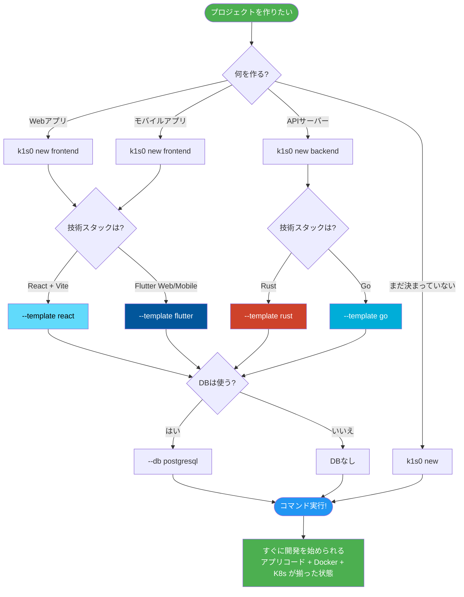

# CLI フロー（ユーザー視点）

## やりたいことから始める

```mermaid
flowchart TD
    Start([プロジェクトを作りたい]) --> What{何を作る?}

    What -->|Webアプリ| FE[k1s0 new frontend]
    What -->|モバイルアプリ| FE_M[k1s0 new frontend]
    What -->|APIサーバー| BE[k1s0 new backend]
    What -->|まだ決まっていない| Interactive[k1s0 new]

    FE --> FE_T{技術スタックは?}
    FE_M --> FE_T
    FE_T -->|React + Vite| React["--template react"]
    FE_T -->|Flutter Web/Mobile| Flutter["--template flutter"]

    BE --> BE_T{技術スタックは?}
    BE_T -->|Rust| Rust["--template rust"]
    BE_T -->|Go| Go["--template go"]

    React --> NeedDB{DBは使う?}
    Flutter --> NeedDB
    Rust --> NeedDB
    Go --> NeedDB

    NeedDB -->|はい| WithDB["--db postgresql"]
    NeedDB -->|いいえ| NoDB[DBなし]

    WithDB --> Run
    NoDB --> Run
    Interactive --> Run

    Run([コマンド実行!]) --> Result

    Result["すぐに開発を始められる<br>アプリコード + Docker + K8s が揃った状態"]

    style Start fill:#4CAF50,color:#fff
    style Run fill:#2196F3,color:#fff
    style Result fill:#4CAF50,color:#fff
    style React fill:#61DAFB,color:#000
    style Flutter fill:#02569B,color:#fff
    style Rust fill:#CE422B,color:#fff
    style Go fill:#00ADD8,color:#fff
```
