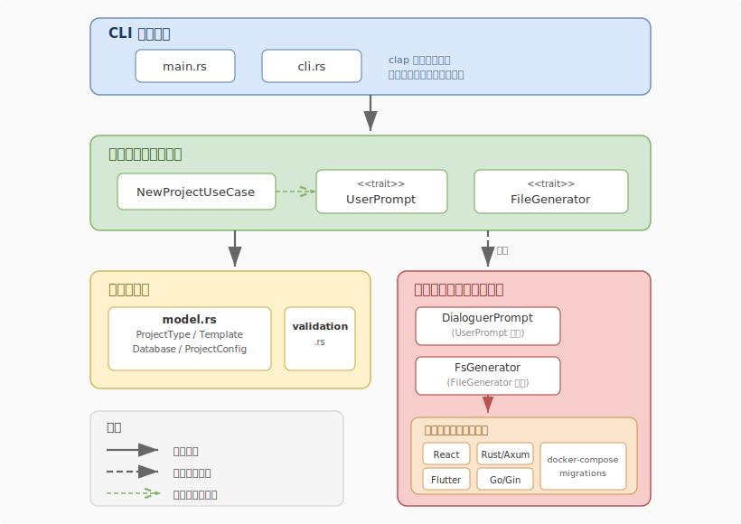

# CLI仕様書

---

この文書は、プロジェクト生成・管理用CLIの仕様書です。
CLIはRust（Edition 2024）で実装され、プロジェクトの雛形作成や初期設定を簡素化します。

---

## 概要

- 目的：新規プロジェクトの雛形作成と基本設定を自動化し、開発開始までの手間を削減する。
- 実装言語：Rust（Edition 2024）
- パッケージ名：`k1s0`（バージョン 0.1.0）
- 想定利用者：フロントエンド／バックエンド開発者、テンプレートを使いたいエンジニア

## ディレクトリ構造

```
CLI/
├── Cargo.toml
├── Cargo.lock
├── src/
│   ├── main.rs                        # エントリーポイント
│   ├── cli.rs                         # CLI引数パースとコマンド定義
│   ├── domain/                        # ドメイン層
│   │   ├── mod.rs
│   │   ├── model.rs                   # ドメインモデル（ProjectType, Template等）
│   │   └── validation.rs              # バリデーションルール
│   ├── application/                   # アプリケーション層
│   │   ├── mod.rs
│   │   ├── new_project.rs             # NewProjectUseCase
│   │   └── interactive.rs             # トレイト定義（UserPrompt, FileGenerator）
│   └── infrastructure/                # インフラストラクチャ層
│       ├── mod.rs
│       ├── prompt.rs                  # 対話UI実装（DialoguerPrompt）
│       ├── generator.rs              # ファイル生成実装（FsGenerator）
│       └── templates/                 # テンプレートジェネレータ
│           ├── mod.rs                 # テンプレートレジストリとディスパッチャ
│           ├── react.rs               # Reactテンプレート
│           ├── flutter.rs             # Flutterテンプレート
│           ├── rust_axum.rs           # Rust（Axum）テンプレート
│           ├── go_gin.rs              # Go（Gin）テンプレート
│           └── kubernetes.rs          # Kubernetesマニフェストジェネレータ
└── tests/
    ├── integration.rs                 # テストモジュール登録
    └── integration/
        ├── new_backend_test.rs        # バックエンド生成の統合テスト
        └── new_frontend_test.rs       # フロントエンド生成の統合テスト
```

## 依存クレート

| クレート    | バージョン            | 用途               |
| ----------- | --------------------- | ------------------ |
| `clap`      | 4（`derive`機能有効） | CLI引数パース      |
| `dialoguer` | 0.11                  | 対話式プロンプトUI |

**開発時依存：**

| クレート     | バージョン | 用途                         |
| ------------ | ---------- | ---------------------------- |
| `assert_cmd` | 2          | CLIテスト                    |
| `assert_fs`  | 1          | ファイルシステムアサーション |
| `predicates` | 3          | テスト述語                   |
| `tempfile`   | 3          | テスト用一時ディレクトリ     |

## コマンド一覧

### `new` コマンド

フロントエンドまたはバックエンド（＋任意でデータベース）プロジェクトを新規作成する。

#### `k1s0 new frontend`

フロントエンドプロジェクトを作成する。

| オプション              | 説明                                                            |
| ----------------------- | --------------------------------------------------------------- |
| `--template <TEMPLATE>` | テンプレート名（`react`, `flutter`）                            |
| `--name <NAME>`         | プロジェクト名                                                  |
| `--path <PATH>`         | 生成先ディレクトリ（省略時はCLI実行ファイルのあるディレクトリ） |
| `--yes`                 | 確認プロンプトをスキップ（非対話モード）                        |

#### `k1s0 new backend`

バックエンドプロジェクトを作成する。

| オプション              | 説明                                                            |
| ----------------------- | --------------------------------------------------------------- |
| `--template <TEMPLATE>` | テンプレート名（`rust`, `go`）                                  |
| `--name <NAME>`         | プロジェクト名                                                  |
| `--db <DATABASE>`       | データベース（`postgresql`, `none`）                            |
| `--path <PATH>`         | 生成先ディレクトリ（省略時はCLI実行ファイルのあるディレクトリ） |
| `--yes`                 | 確認プロンプトをスキップ（非対話モード）                        |

#### 実行例

```bash
# フロントエンド（React）作成
k1s0 new frontend --template react --name my-app --yes

# バックエンド（Rust + PostgreSQL）作成
k1s0 new backend --template rust --name my-service --db postgresql --yes

# 対話モードで起動（サブコマンドなし）
k1s0 new
```

## ドメインモデル

### ProjectType

プロジェクトの種別を表す列挙型。

| 値         | 説明                       |
| ---------- | -------------------------- |
| `Frontend` | フロントエンドプロジェクト |
| `Backend`  | バックエンドプロジェクト   |

### Template

使用するテンプレートを表す列挙型。

| 値         | 対応するProjectType | 文字列パース                     |
| ---------- | ------------------- | -------------------------------- |
| `React`    | Frontend            | `react`                          |
| `Flutter`  | Frontend            | `flutter`                        |
| `RustAxum` | Backend             | `rust`, `rust-axum`, `rust_axum` |
| `GoGin`    | Backend             | `go`, `go-gin`, `go_gin`         |

`Template::is_compatible_with()` でプロジェクト種別との互換性チェックを行う。
`Template::templates_for()` でプロジェクト種別に対応するテンプレート一覧を取得する。

### Database

データベースの選択を表す列挙型。

| 値           | 説明             |
| ------------ | ---------------- |
| `PostgreSql` | PostgreSQLを使用 |
| `None`       | データベースなし |

### ProjectConfig

プロジェクト生成に必要な設定をまとめた構造体。

| フィールド     | 型            | 説明             |
| -------------- | ------------- | ---------------- |
| `name`         | `String`      | プロジェクト名   |
| `project_type` | `ProjectType` | プロジェクト種別 |
| `template`     | `Template`    | テンプレート     |
| `database`     | `Database`    | データベース     |
| `path`         | `PathBuf`     | 生成先パス       |

## バリデーション

### プロジェクト名バリデーション

| ルール                               | エラー                      |
| ------------------------------------ | --------------------------- |
| 空文字列は不可                       | `EmptyName`                 |
| 64文字以下                           | `TooLong(usize)`            |
| 英数字・ハイフン・アンダースコアのみ | `InvalidCharacters(String)` |

### テンプレート互換性バリデーション

テンプレートとプロジェクト種別の組み合わせが不正な場合（例：`react` + `backend`）、`IncompatibleTemplate` エラーを返す。

## 対話式（Interactive）フロー

### デフォルト動作

CLIは対話式で進行する。ユーザーに対して順に質問し、入力や選択でプロジェクトを構成する。

### 対話フロー

1. **プロジェクトタイプ選択** — フロントエンドまたはバックエンドを選択
2. **テンプレート選択** — プロジェクト種別に応じた候補から選択
3. **テンプレート互換性検証** — 選択されたテンプレートの妥当性を確認
4. **データベース選択**（バックエンドのみ） — PostgreSQLまたはなしを選択
5. **プロジェクト名入力** — 名前を入力（バリデーション実施）
6. **生成先パス入力** — 出力ディレクトリを指定
7. **最終確認** — 設定サマリを表示し、確認を求める
8. **ファイル生成** — テンプレートに基づきファイルを出力

サブコマンドや引数で既に値が指定されている場合、該当するステップはスキップされる。

### 非対話モード

`--yes` フラグを指定すると、すべてのプロンプトをスキップし、コマンドライン引数で与えられた値を使用する。必要な引数が欠けている場合はエラーで終了する。CIやスクリプトでの利用を想定。

### 対話UIの技術的実装

- `dialoguer` クレートの `Select` で選択肢UI、`Input` でテキスト入力、`Confirm` で確認を実装
- `clap` でサブコマンドとオプションを定義

## アーキテクチャ

### レイヤー構成



### 設計方針

- **クリーンアーキテクチャ**：層を分離し、依存関係を内側へ向ける
- **依存性の注入**：ユースケースはトレイト（`UserPrompt`, `FileGenerator`）に依存し、具象実装に依存しない
- **テスト容易性**：プロンプトとジェネレータをモック可能な設計
- **ドメイン駆動設計（DDD）**：ビジネスルールをドメイン層に集約

### トレイト定義

```rust
pub trait UserPrompt {
    fn select_project_type() -> Result<ProjectType, String>;
    fn input_project_name(default: Option<&str>) -> Result<String, String>;
    fn select_template(project_type: &ProjectType) -> Result<Template, String>;
    fn select_database() -> Result<Database, String>;
    fn input_path(default: &Path) -> Result<PathBuf, String>;
    fn confirm(config: &ProjectConfig) -> Result<bool, String>;
}

pub trait FileGenerator {
    fn generate(config: &ProjectConfig) -> Result<(), String>;
}
```

## テンプレート詳細

すべてのテンプレートは `Vec<(PathBuf, String)>`（ファイルパスと内容のペア）を返すコードジェネレータとして実装されている。

### React テンプレート

TypeScript + React 18 + Vite 構成のフロントエンドプロジェクトを生成する。

**生成ファイル：**

| ファイル                   | 内容                                             |
| -------------------------- | ------------------------------------------------ |
| `package.json`             | react, react-dom, vite, vitest, testing-library  |
| `index.html`               | HTMLエントリーポイント                           |
| `vite.config.ts`           | Vite設定（Reactプラグイン）                      |
| `tsconfig.json`            | TypeScript設定                                   |
| `src/main.tsx`             | エントリーポイント                               |
| `src/App.tsx`              | ルートコンポーネント（プロジェクト名を埋め込み） |
| `src/App.test.tsx`         | コンポーネントテストのサンプル                   |
| `README.md`                | 開始ガイド                                       |
| `.github/workflows/ci.yml` | GitHub Actions CI（npm test）                    |
| `Dockerfile`               | マルチステージビルド（Node 20 → Nginx）          |
| `.dockerignore`            | Docker除外設定                                   |

ポート：80

### Flutter テンプレート

Dart + Flutter 構成のフロントエンドプロジェクトを生成する。

**生成ファイル：**

| ファイル                   | 内容                                    |
| -------------------------- | --------------------------------------- |
| `pubspec.yaml`             | プロジェクトマニフェストと依存          |
| `lib/main.dart`            | Material Designサンプルアプリ           |
| `test/widget_test.dart`    | ウィジェットテストのサンプル            |
| `README.md`                | 開始ガイド                              |
| `.github/workflows/ci.yml` | GitHub Actions CI（flutter test）       |
| `Dockerfile`               | マルチステージビルド（Flutter → Nginx） |
| `.dockerignore`            | Docker除外設定                          |

ポート：80

### Rust（Axum）テンプレート

Rust + Axum Webフレームワーク構成のバックエンドプロジェクトを生成する。

**生成ファイル：**

| ファイル                   | 内容                                       |
| -------------------------- | ------------------------------------------ |
| `Cargo.toml`               | axum, tokio, serde, serde_json             |
| `src/main.rs`              | サーバーエントリーポイント（0.0.0.0:3000） |
| `src/lib.rs`               | ルーター定義（ヘルスエンドポイント）       |
| `tests/health_check.rs`    | ヘルスエンドポイントの統合テスト           |
| `README.md`                | 開始ガイド                                 |
| `.github/workflows/ci.yml` | GitHub Actions CI（cargo test）            |
| `Dockerfile`               | マルチステージビルド（Rust 1.85 → Alpine） |
| `.dockerignore`            | Docker除外設定                             |

ポート：3000

### Go（Gin）テンプレート

Go + Gin Webフレームワーク構成のバックエンドプロジェクトを生成する。

**生成ファイル：**

| ファイル                   | 内容                                       |
| -------------------------- | ------------------------------------------ |
| `go.mod`                   | Goモジュールファイル（gin依存）            |
| `main.go`                  | サーバーセットアップとヘルスエンドポイント |
| `main_test.go`             | ヘルスエンドポイントのテスト               |
| `README.md`                | 開始ガイド                                 |
| `.github/workflows/ci.yml` | GitHub Actions CI（go test）               |
| `Dockerfile`               | マルチステージビルド（Go 1.22 → Alpine）   |
| `.dockerignore`            | Docker除外設定                             |

ポート：8080

### 共通生成ファイル

すべてのテンプレートで以下のファイルが追加生成される。

#### docker-compose.yml

テンプレートとデータベース選択に応じて自動生成される。

- **データベースなし**：アプリサービスのみ（テンプレート固有のポートで公開）
- **PostgreSQL選択時**：アプリサービス＋PostgreSQL 16（ボリューム、`DATABASE_URL`環境変数付き）

#### Kubernetesマニフェスト（`k8s/`）

すべてのテンプレートで `k8s/` ディレクトリ配下にプレーンYAMLのKubernetesマニフェストが自動生成される。テンプレート別にポート・リソース制限・ヘルスチェックパスが設定される。

**基本マニフェスト（全テンプレート共通）：**

| ファイル             | 内容                                                        |
| -------------------- | ----------------------------------------------------------- |
| `k8s/namespace.yml`  | Namespace（プロジェクト名）                                 |
| `k8s/deployment.yml` | Deployment（replicas: 2、リソース制限、ヘルスチェック付き） |
| `k8s/service.yml`    | Service（ClusterIP）                                        |
| `k8s/ingress.yml`    | Ingress（nginx）                                            |
| `k8s/configmap.yml`  | ConfigMap（環境変数）                                       |

**PostgreSQL選択時の追加マニフェスト：**

| ファイル                       | 内容                              |
| ------------------------------ | --------------------------------- |
| `k8s/postgres-secret.yml`      | Secret（dev用デフォルト認証情報） |
| `k8s/postgres-pvc.yml`         | PersistentVolumeClaim（1Gi）      |
| `k8s/postgres-statefulset.yml` | StatefulSet（postgres:16）        |
| `k8s/postgres-service.yml`     | Service（ClusterIP, 5432）        |

**テンプレート別設定値：**

| Template      | containerPort | ヘルスチェックパス | CPU req/lim | Memory req/lim |
| ------------- | ------------- | ------------------ | ----------- | -------------- |
| React/Flutter | 80            | `/`                | 50m / 200m  | 64Mi / 128Mi   |
| Rust（Axum）  | 3000          | `/health`          | 100m / 500m | 128Mi / 256Mi  |
| Go（Gin）     | 8080          | `/health`          | 100m / 500m | 128Mi / 256Mi  |

内部実装として `K8sParams` 構造体で `ProjectConfig` からテンプレート別パラメータを集約し、各マニフェスト生成関数に渡す設計。

#### migrations/001_init.sql

PostgreSQLを選択した場合のみ生成される初期スキーマファイル。

## テスト構成

### ユニットテスト

各モジュールにインラインテストを含む。

| モジュール                               | テスト数 | テスト内容                                                                         |
| ---------------------------------------- | -------- | ---------------------------------------------------------------------------------- |
| `cli.rs`                                 | 7        | CLI引数パース、フラグ処理、不正コマンド検出                                        |
| `domain/model.rs`                        | 8        | 型生成、互換性検証、FromStr・Displayの動作                                         |
| `domain/validation.rs`                   | 8        | 名前バリデーション、特殊文字拒否、長さ制限                                         |
| `application/new_project.rs`             | 11       | 非対話モード、データベース付きバックエンド、エラー処理、対話モード、キャンセル処理 |
| `infrastructure/generator.rs`            | 5        | 各テンプレートのファイル生成、内容検証                                             |
| `infrastructure/templates/mod.rs`        | 8        | テンプレートファイル生成、PostgreSQLマイグレーション、Docker Compose               |
| `infrastructure/templates/kubernetes.rs` | 15       | マニフェスト生成数、ファイルパス、各マニフェスト内容、テンプレート別設定値         |
| `infrastructure/templates/*.rs`          | 各8〜11  | ファイル生成検証、内容検証、Docker設定                                             |

### 統合テスト

`tests/integration/` に配置。CLIバイナリを実行し、生成結果を検証する。

| テストファイル         | テスト数 | テスト内容                                                                          |
| ---------------------- | -------- | ----------------------------------------------------------------------------------- |
| `new_frontend_test.rs` | 5        | React/Flutter非対話生成、名前欠落エラー、テンプレート不整合エラー、不正名エラー     |
| `new_backend_test.rs`  | 5        | Rust/Go非対話生成、PostgreSQL付きRust生成、名前欠落エラー、テンプレート不整合エラー |
