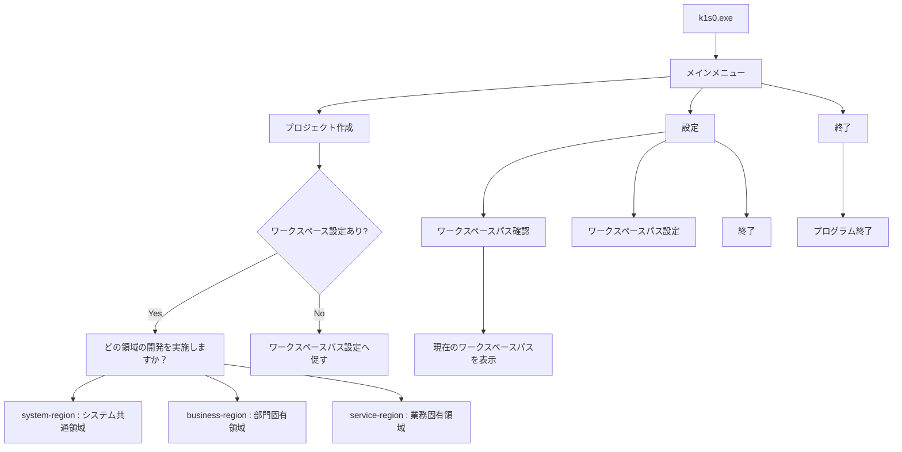

# CLI設計書

## 技術スタック

Rust 2024Edition

## コマンド一覧

引数無しを前提とする対話式CLI

## フロー図

```mermaid
flowchart TD
    A["k1s0.exe"] --> B["メインメニュー"]

    B --> C["プロジェクト作成"]
    B --> D["設定"]
    B --> E["終了"]

    C --> F{"ワークスペース設定あり?"}
    F -->|Yes| G["どの領域の開発を実施しますか？"]
    G --> G1["system-region : システム共通領域"]
    G --> G2["business-region : 部門固有領域"]
    G --> G3["service-region : 業務固有領域"]
    F -->|No| H["ワークスペースパス設定へ促す"]

    D --> I["ワークスペースパス確認"]
    D --> L["ワークスペースパス設定"]
    D --> J["終了"]

    I --> I1["現在のワークスペースパスを表示"]

    E --> K["プログラム終了"]
```