# CLI設計書

## 技術スタック

Rust 2024Edition

## コマンド一覧

引数無しを前提とする対話式CLI

## リポジトリ構成

```
k1s0/
├── CLI/
├── system-region/       ← システム共通領域
├── business-region/     ← 部門固有領域
├── service-region/      ← 業務固有領域
├── docs/
└── README.md
```

## Region間の依存関係

```
system-region           ← 依存なし（独立）
    ↑
business-region         ← system-region に依存
    ↑
service-region          ← system-region, business-region に依存
```

## Region別チェックアウト範囲

Git Sparse Checkout を利用し、選択したRegionに必要なディレクトリのみ取得する。
system-region および business-region 選択時はさらにプロジェクト種別（Library / Service）を選択する。

| Region選択      | プロジェクト種別          | チェックアウト対象                                                               |
| --------------- | ------------------------- | -------------------------------------------------------------------------------- |
| system-region   | Library → Rust            | `system-region/library/rust/`                                                    |
| system-region   | Library → Go              | `system-region/library/go/`                                                      |
| system-region   | Service → Rust            | `system-region/service/rust/`                                                    |
| system-region   | Service → Go              | `system-region/service/go/`                                                      |
| business-region | 既存 → Library → Rust     | `system-region/` + `business-region/{選択した領域}/library/rust/`                |
| business-region | 既存 → Library → Go       | `system-region/` + `business-region/{選択した領域}/library/go/`                  |
| business-region | 既存 → Service → Rust     | `system-region/` + `business-region/{選択した領域}/service/rust/`                |
| business-region | 既存 → Service → Go       | `system-region/` + `business-region/{選択した領域}/service/go/`                  |
| business-region | 新規追加 → Library → Rust | `system-region/` + `business-region/{入力した領域}/library/rust/`                |
| business-region | 新規追加 → Library → Go   | `system-region/` + `business-region/{入力した領域}/library/go/`                  |
| business-region | 新規追加 → Service → Rust | `system-region/` + `business-region/{入力した領域}/service/rust/`                |
| business-region | 新規追加 → Service → Go   | `system-region/` + `business-region/{入力した領域}/service/go/`                  |
| business-region | 既存 → Client → React     | `system-region/` + `business-region/{選択した領域}/client/react/`                |
| business-region | 既存 → Client → Flutter   | `system-region/` + `business-region/{選択した領域}/client/flutter/`              |
| business-region | 新規追加 → Client → React   | `system-region/` + `business-region/{入力した領域}/client/react/`              |
| business-region | 新規追加 → Client → Flutter | `system-region/` + `business-region/{入力した領域}/client/flutter/`            |
| service-region  | 部門固有領域選択 → Client → React   | `system-region/` + `business-region/{選択した部門固有領域}/` + `service-region/client/react/`   |
| service-region  | 部門固有領域選択 → Client → Flutter | `system-region/` + `business-region/{選択した部門固有領域}/` + `service-region/client/flutter/` |
| service-region  | 部門固有領域選択 → Server → Rust | `system-region/` + `business-region/{選択した部門固有領域}/` + `service-region/server/rust/` |
| service-region  | 部門固有領域選択 → Server → Go   | `system-region/` + `business-region/{選択した部門固有領域}/` + `service-region/server/go/`   |

## フロー図

```mermaid
flowchart TD
    A["k1s0.exe"] --> B["メインメニュー"]

    B --> C["プロジェクト作成"]
    B --> D["設定"]
    B --> T["E2Eテスト"]
    B --> E["終了"]

    T --> T1["全シナリオ自動実行（ScriptedPrompt + VerifyingCheckout）"]
    T1 --> T2["結果表示（✓/✗）"]
    T2 --> B

    C --> F{"ワークスペース設定あり?"}
    F -->|Yes| G["どの領域の開発を実施しますか？"]
    G --> G1["system-region : システム共通領域"]
    G --> G2["business-region : 部門固有領域"]
    G --> G3["service-region : 業務固有領域"]
    G1 --> PT["プロジェクト種別を選択"]
    PT --> PT1["Library : ライブラリ"]
    PT --> PT2["Service : サービス"]
    PT1 --> LLang["言語を選択"]
    LLang --> LLang1["Rust"]
    LLang --> LLang2["Go"]
    LLang1 --> SC1aR["sparse-checkout set system-region/library/rust/"]
    LLang2 --> SC1aG["sparse-checkout set system-region/library/go/"]
    PT2 --> SLang["言語を選択"]
    SLang --> SLang1["Rust"]
    SLang --> SLang2["Go"]
    SLang1 --> SC1bR["sparse-checkout set system-region/service/rust/"]
    SLang2 --> SC1bG["sparse-checkout set system-region/service/go/"]
    G2 --> BR{"部門固有領域の選択"}
    BR --> BR1["既存の部門固有領域"]
    BR --> BR2["新規追加"]
    BR1 --> BRL["既存の部門固有領域一覧から選択"]
    BRL --> BRPT1["プロジェクト種別を選択"]
    BRPT1 --> BRPT1L["Library : ライブラリ"]
    BRPT1 --> BRPT1S["Service : サービス"]
    BRPT1 --> BRPT1C["Client : クライアント"]
    BRPT1L --> BRLLLang["言語を選択"]
    BRLLLang --> BRLLLang1["Rust"]
    BRLLLang --> BRLLLang2["Go"]
    BRLLLang1 --> SC2LR["sparse-checkout set system-region/ business-region/{選択した領域}/library/rust/"]
    BRLLLang2 --> SC2LG["sparse-checkout set system-region/ business-region/{選択した領域}/library/go/"]
    BRPT1S --> BRLSLang["言語を選択"]
    BRLSLang --> BRLSLang1["Rust"]
    BRLSLang --> BRLSLang2["Go"]
    BRLSLang1 --> SC2SR["sparse-checkout set system-region/ business-region/{選択した領域}/service/rust/"]
    BRLSLang2 --> SC2SG["sparse-checkout set system-region/ business-region/{選択した領域}/service/go/"]
    BRPT1C --> BRLCFW["フレームワークを選択"]
    BRLCFW --> BRLCFW1["React"]
    BRLCFW --> BRLCFW2["Flutter"]
    BRLCFW1 --> SC2CR["sparse-checkout set system-region/ business-region/{選択した領域}/client/react/"]
    BRLCFW2 --> SC2CF["sparse-checkout set system-region/ business-region/{選択した領域}/client/flutter/"]
    BR2 --> BRN["部門固有領域名を入力"]
    BRN --> BRPT2["プロジェクト種別を選択"]
    BRPT2 --> BRPT2L["Library : ライブラリ"]
    BRPT2 --> BRPT2S["Service : サービス"]
    BRPT2 --> BRPT2C["Client : クライアント"]
    BRPT2L --> BRNLLang["言語を選択"]
    BRNLLang --> BRNLLang1["Rust"]
    BRNLLang --> BRNLLang2["Go"]
    BRNLLang1 --> SC2NLR["sparse-checkout set system-region/ business-region/{入力した領域}/library/rust/"]
    BRNLLang2 --> SC2NLG["sparse-checkout set system-region/ business-region/{入力した領域}/library/go/"]
    BRPT2S --> BRNSLang["言語を選択"]
    BRNSLang --> BRNSLang1["Rust"]
    BRNSLang --> BRNSLang2["Go"]
    BRNSLang1 --> SC2NSR["sparse-checkout set system-region/ business-region/{入力した領域}/service/rust/"]
    BRNSLang2 --> SC2NSG["sparse-checkout set system-region/ business-region/{入力した領域}/service/go/"]
    BRPT2C --> BRNCFW["フレームワークを選択"]
    BRNCFW --> BRNCFW1["React"]
    BRNCFW --> BRNCFW2["Flutter"]
    BRNCFW1 --> SC2NCR["sparse-checkout set system-region/ business-region/{入力した領域}/client/react/"]
    BRNCFW2 --> SC2NCF["sparse-checkout set system-region/ business-region/{入力した領域}/client/flutter/"]
    G3 --> SRBR["属する部門固有領域を選択"]
    SRBR --> SRBRL["部門固有領域一覧から選択"]
    SRBRL --> SRCS["Client / Server を選択"]
    SRCS --> SRC["Client"]
    SRCS --> SRS["Server"]
    SRC --> SRCFW["フレームワークを選択"]
    SRCFW --> SRCFW1["React"]
    SRCFW --> SRCFW2["Flutter"]
    SRCFW1 --> SC3CR["sparse-checkout set system-region/ business-region/{選択した部門固有領域}/ service-region/client/react/"]
    SRCFW2 --> SC3CF["sparse-checkout set system-region/ business-region/{選択した部門固有領域}/ service-region/client/flutter/"]
    SRS --> SRSLang["言語を選択"]
    SRSLang --> SRSLang1["Rust"]
    SRSLang --> SRSLang2["Go"]
    SRSLang1 --> SC3SR["sparse-checkout set system-region/ business-region/{選択した部門固有領域}/ service-region/server/rust/"]
    SRSLang2 --> SC3SG["sparse-checkout set system-region/ business-region/{選択した部門固有領域}/ service-region/server/go/"]
    F -->|No| H["ワークスペースパス設定へ促す"]

    D --> I["ワークスペースパス確認"]
    D --> L["ワークスペースパス設定"]
    D --> J["終了"]

    I --> I1["現在のワークスペースパスを表示"]

    E --> K["プログラム終了"]
```

