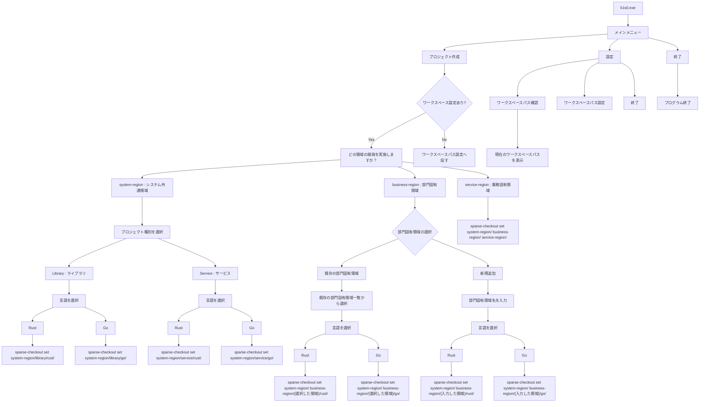

# CLI設計書

## 技術スタック

Rust 2024Edition

## コマンド一覧

引数無しを前提とする対話式CLI

## リポジトリ構成

```
k1s0/
├── CLI/
├── system-region/       ← システム共通領域
├── business-region/     ← 部門固有領域
├── service-region/      ← 業務固有領域
├── docs/
└── README.md
```

## Region間の依存関係

```
system-region           ← 依存なし（独立）
    ↑
business-region         ← system-region に依存
    ↑
service-region          ← system-region, business-region に依存
```

## Region別チェックアウト範囲

Git Sparse Checkout を利用し、選択したRegionに必要なディレクトリのみ取得する。
system-region 選択時はさらにプロジェクト種別（Library / Service）を選択する。

| Region選択      | プロジェクト種別 | チェックアウト対象                                        |
| --------------- | ---------------- | --------------------------------------------------------- |
| system-region   | Library → Rust   | `system-region/library/rust/`                             |
| system-region   | Library → Go     | `system-region/library/go/`                               |
| system-region   | Service → Rust   | `system-region/service/rust/`                             |
| system-region   | Service → Go     | `system-region/service/go/`                               |
| business-region | 既存 → Rust      | `system-region/` + `business-region/{選択した領域}/rust/`  |
| business-region | 既存 → Go        | `system-region/` + `business-region/{選択した領域}/go/`    |
| business-region | 新規追加 → Rust  | `system-region/` + `business-region/{入力した領域}/rust/`  |
| business-region | 新規追加 → Go    | `system-region/` + `business-region/{入力した領域}/go/`    |
| service-region  | —                | `system-region/` + `business-region/` + `service-region/` |

## フロー図

