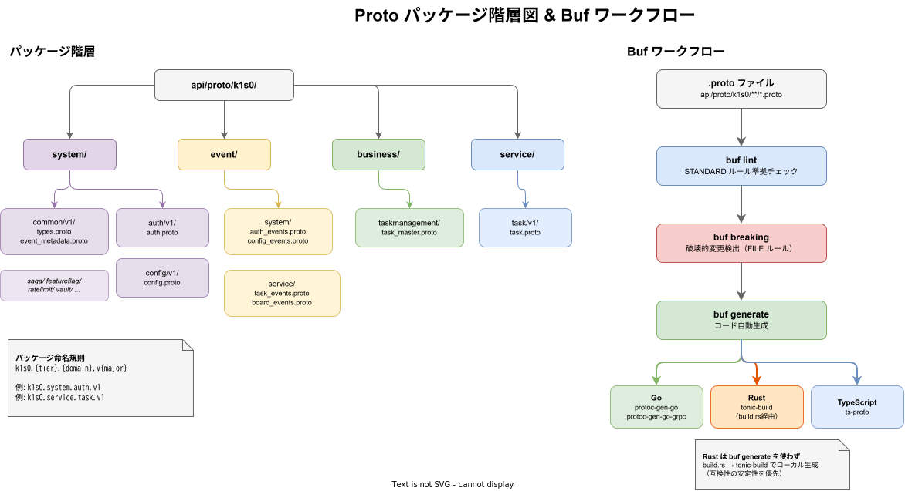
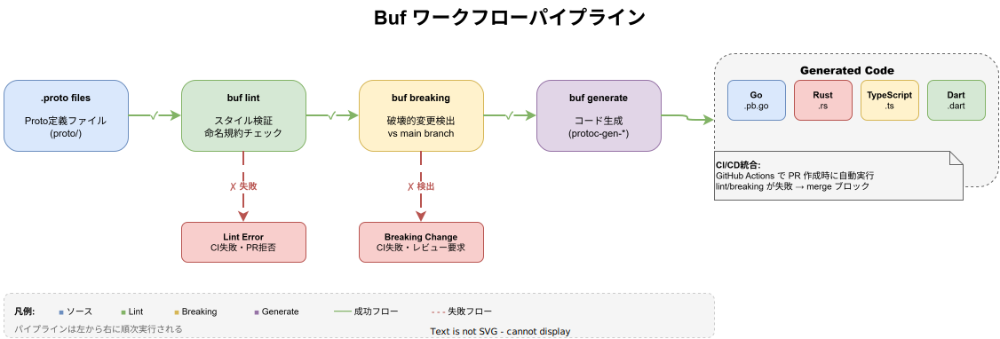
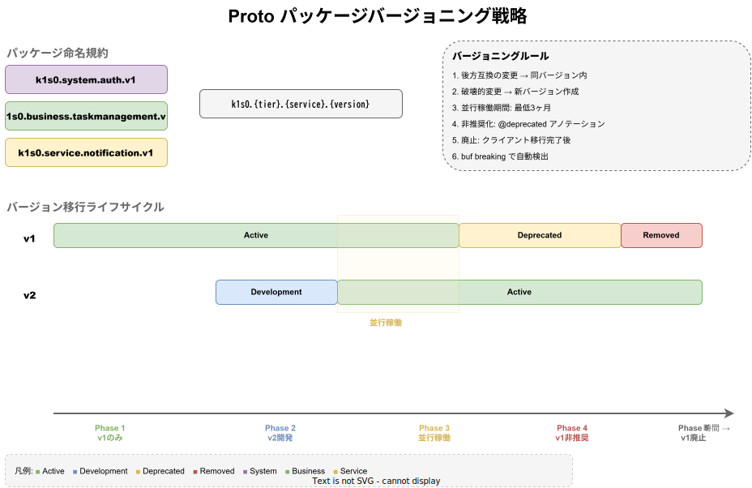

# Proto 設計

Protobuf / gRPC のサービス定義・共通型・Kafka イベントスキーマ・コード生成パイプラインの仕様。

## Protobuf / gRPC 採用の背景

### 選定理由

k1s0 のマイクロサービス間通信に Protobuf / gRPC を採用した理由は以下の通り。

| 目的 | 説明 |
| --- | --- |
| サービス間高速通信 | HTTP/2 ベースのバイナリプロトコルにより、REST API 比で低レイテンシ・高スループットを実現する |
| 型安全なインターフェース | Protobuf スキーマから Go / Rust / TypeScript のコードを自動生成し、型不一致を防止する |
| スキーマ進化の管理 | buf による lint・破壊的変更検出で、安全なスキーマ進化を保証する |
| Kafka イベントスキーマの統一 | メッセージング基盤のイベント型も Protobuf で定義し、Schema Registry で互換性を管理する |

REST API ではスキーマの逸脱が起きやすく、複数言語間でのインターフェース同期コストが高い。Protobuf による IDL ファーストアプローチにより、Go / Rust / TypeScript のコードを単一の `.proto` ファイルから生成し、一貫性を担保する。

### バージョニング戦略の設計意図

proto パッケージは [gRPC設計.md](./gRPC設計.md) D-009 の命名規則に従い、メジャーバージョンをパッケージ名に含める。

```
k1s0.{tier}.{domain}.v{major}
```

初期バージョンは `v1` とし、後方互換性を破壊する変更が必要な場合のみ `v2` パッケージを新設する。この方式を採用した理由は、gRPC のパッケージ名がクライアントコードのインポートパスに直接反映されるため、メジャーバージョンを明示的に分離することで、既存クライアントへの影響を完全にゼロにできるためである。

---

## 概要

### Proto パッケージ階層図 & Buf ワークフロー





パッケージ命名: `k1s0.{tier}.{domain}.v{major}`（初期 `v1`）

### 言語サポート

| 言語 | コード生成ツール | 用途 |
| --- | --- | --- |
| Go | `protoc-gen-go` + `protoc-gen-go-grpc` | Go サーバー・クライアント |
| Rust | `tonic-build` | Rust サーバー・クライアント |
| TypeScript | `ts-proto` | TypeScript ライブラリ・BFF |
| Dart | `protoc-gen-dart`（`protobuf` パッケージ付属） | Flutter クライアント |

> **注記（C-002）**: Dart コード生成は `buf.gen.yaml` に設定済みだが、CI 環境での `protoc-gen-dart` セットアップが未完了のため、
> 生成ファイルが欠損している。CI 対応完了まで `api/gen/dart/` の生成ファイルは手動管理とする。
> 対応は Phase 4 にて実施予定。

---

## ディレクトリ構造

### gRPC サービス定義（canonical 位置）

全サービスの proto ファイルは `api/proto/k1s0/` 配下に Tier 別ディレクトリで配置する。
gRPC サービス定義は、提供する API の Tier に合わせて `api/proto/k1s0/{tier}/{domain}/v{major}/` に配置する。

> **注記**: 現状のリポジトリでは system tier の gRPC が中心のため `api/proto/k1s0/system/` が主に存在する。business/service tier の gRPC を追加する場合は対応する Tier 配下を増設する。

```
api/proto/
├── buf.yaml                              # buf 設定（lint・breaking change 検出）
├── buf.gen.yaml                          # コード生成設定（Go / TypeScript / Rust）
├── buf.lock                              # 依存ロック
└── k1s0/
  ├── system/
  │   ├── common/
  │   │   └── v1/
  │   │       ├── types.proto           # Pagination, PaginationResult, Timestamp
  │   │       └── event_metadata.proto  # EventMetadata（Kafka イベント共通ヘッダー）
  │   ├── auth/
  │   │   └── v1/auth.proto             # AuthService / AuditService
  │   ├── config/
  │   │   └── v1/config.proto           # ConfigService（WatchConfig streaming 含む）
  │   ├── saga/
  │   │   └── v1/saga.proto             # SagaService
  │   ├── featureflag/
  │   │   └── v1/featureflag.proto      # FeatureFlagService
  │   ├── ratelimit/
  │   │   └── v1/ratelimit.proto        # RateLimitService
  │   ├── tenant/
  │   │   └── v1/tenant.proto           # TenantService
  │   ├── vault/
  │   │   └── v1/vault.proto            # VaultService
  │   ├── apiregistry/
  │   │   └── v1/api_registry.proto     # ApiRegistryService
  │   ├── eventstore/
  │   │   └── v1/event_store.proto      # EventStoreService
  │   ├── navigation/
  │   │   └── v1/navigation.proto       # NavigationService
  │   ├── notification/
  │   │   └── v1/notification.proto     # NotificationService
  │   ├── policy/
  │   │   └── v1/policy.proto           # PolicyService
  │   ├── scheduler/
  │   │   └── v1/scheduler.proto        # SchedulerService
  │   ├── search/
  │   │   └── v1/search.proto           # SearchService
  │   ├── session/
  │   │   └── v1/session.proto          # SessionService
  │   ├── workflow/
  │   │   └── v1/workflow.proto         # WorkflowService
  │   ├── dlq/
  │   │   └── v1/dlq.proto             # DlqService
  │   ├── quota/
  │   │   └── v1/quota.proto           # QuotaService
  │   ├── file/
  │   │   └── v1/file.proto            # FileService
  │   ├── mastermaintenance/
  │   │   └── v1/master_maintenance.proto  # MasterMaintenanceService
  │   ├── ruleengine/
  │   │   └── v1/rule_engine.proto        # RuleEngineService
  │   └── eventmonitor/
  │       └── v1/event_monitor.proto      # EventMonitorService
  ├── business/
  │   └── accounting/
  │       └── domainmaster/
  │           └── v1/domain_master.proto  # DomainMasterService
  └── service/
    └── order/
      └── v1/order.proto                 # OrderService
```

### Kafka イベント定義

Kafka イベントスキーマも `api/proto/` に配置する。

```
api/proto/k1s0/
└── event/
    ├── system/
    │   ├── auth/
    │   │   └── v1/auth_events.proto      # 認証系イベント
    │   └── config/
    │       └── v1/config_events.proto    # 設定変更イベント
    ├── business/
    │   └── accounting/
    │       └── v1/accounting_events.proto
    └── service/
        ├── order/
        │   └── v1/order_events.proto
        └── inventory/
            └── v1/inventory_events.proto
```

---

## 共通メッセージ型（common.proto）

全 Tier で共有する型を `k1s0.system.common.v1` パッケージに定義する。

### types.proto

```protobuf
// api/proto/k1s0/system/common/v1/types.proto
syntax = "proto3";
package k1s0.system.common.v1;

option go_package = "github.com/k1s0-platform/api/gen/go/k1s0/system/common/v1;commonv1";

// Pagination はページネーションリクエストパラメータ。
message Pagination {
  int32 page = 1;       // ページ番号（1始まり）
  int32 page_size = 2;  // 1ページあたりの件数
}

// PaginationResult はページネーション結果。
message PaginationResult {
  int32 total_count = 1;  // 全件数
  int32 page = 2;         // 現在のページ番号
  int32 page_size = 3;    // 1ページあたりの件数
  bool has_next = 4;      // 次ページの有無
}

// Timestamp は時刻情報。google.protobuf.Timestamp と互換。
message Timestamp {
  int64 seconds = 1;  // Unix epoch からの秒数
  int32 nanos = 2;    // ナノ秒（0-999999999）
}
```

> **Timestamp 型の使い分け**: `k1s0.system.common.v1.Timestamp` をプロジェクト標準とし、全サービスで統一的に使用する。`google.protobuf.Timestamp` は外部システムとの連携インターフェースでのみ許容する。

### event_metadata.proto

```protobuf
// api/proto/k1s0/system/common/v1/event_metadata.proto
syntax = "proto3";
package k1s0.system.common.v1;

option go_package = "github.com/k1s0-platform/api/gen/go/k1s0/system/common/v1;commonv1";

// EventMetadata は全イベントに付与する共通メタデータ。
message EventMetadata {
  string event_id = 1;        // UUID
  string event_type = 2;      // e.g., "auth.audit.recorded"
  string source = 3;          // e.g., "auth-server"
  int64 timestamp = 4;        // Unix timestamp (ms)
  string trace_id = 5;        // 分散トレース ID
  string correlation_id = 6;  // 業務相関 ID
  int32 schema_version = 7;   // スキーマのメジャーバージョン（Kafka topic 末尾の vN / event proto の vN と同期）
}
```

---

## 認証サービス定義（auth.proto）

パッケージ: `k1s0.system.auth.v1`

Go/Rust の既存 gRPC ハンドラー実装に完全対応するサービス定義。

```protobuf
// {auth-server}/api/proto/k1s0/system/auth/v1/auth.proto
syntax = "proto3";
package k1s0.system.auth.v1;

option go_package = "github.com/k1s0-platform/system-server-go-auth/gen/go/k1s0/system/auth/v1;authv1";

import "k1s0/system/common/v1/types.proto";

// AuthService は JWT トークン検証・ユーザー情報管理・パーミッション確認を提供する。
service AuthService {
  // JWT トークン検証
  rpc ValidateToken(ValidateTokenRequest) returns (ValidateTokenResponse);

  // ユーザー情報取得
  rpc GetUser(GetUserRequest) returns (GetUserResponse);

  // ユーザー一覧取得
  rpc ListUsers(ListUsersRequest) returns (ListUsersResponse);

  // ユーザーロール取得
  rpc GetUserRoles(GetUserRolesRequest) returns (GetUserRolesResponse);

  // パーミッション確認
  rpc CheckPermission(CheckPermissionRequest) returns (CheckPermissionResponse);
}

// AuditService は監査ログの記録・検索を提供する。
service AuditService {
  // 監査ログ記録
  rpc RecordAuditLog(RecordAuditLogRequest) returns (RecordAuditLogResponse);

  // 監査ログ検索
  rpc SearchAuditLogs(SearchAuditLogsRequest) returns (SearchAuditLogsResponse);
}

// ============================================================
// Token Validation
// ============================================================

message ValidateTokenRequest {
  string token = 1;
}

message ValidateTokenResponse {
  bool valid = 1;
  TokenClaims claims = 2;
  string error_message = 3;  // valid == false の場合のエラー理由
}

message TokenClaims {
  string sub = 1;                                    // ユーザー UUID
  string iss = 2;                                    // Issuer
  string aud = 3;                                    // Audience
  int64 exp = 4;                                     // 有効期限（Unix epoch）
  int64 iat = 5;                                     // 発行日時（Unix epoch）
  string jti = 6;                                    // Token ID
  string preferred_username = 7;                     // ユーザー名
  string email = 8;                                  // メールアドレス
  RealmAccess realm_access = 9;                      // グローバルロール
  map<string, ClientRoles> resource_access = 10;     // サービス固有ロール
  repeated string tier_access = 11;                  // アクセス可能 Tier
}

message RealmAccess {
  repeated string roles = 1;
}

message ClientRoles {
  repeated string roles = 1;
}

// ============================================================
// User
// ============================================================

message GetUserRequest {
  string user_id = 1;
}

message GetUserResponse {
  User user = 1;
}

message ListUsersRequest {
  k1s0.system.common.v1.Pagination pagination = 1;
  string search = 2;                                 // ユーザー名・メールで部分一致検索
  optional bool enabled = 3;                         // 有効/無効フィルタ
}

message ListUsersResponse {
  repeated User users = 1;
  k1s0.system.common.v1.PaginationResult pagination = 2;
}

message User {
  string id = 1;
  string username = 2;
  string email = 3;
  string first_name = 4;
  string last_name = 5;
  bool enabled = 6;
  bool email_verified = 7;
  k1s0.system.common.v1.Timestamp created_at = 8;
  map<string, StringList> attributes = 9;            // カスタム属性（部署, 社員番号等）
}

message StringList {
  repeated string values = 1;
}

// ============================================================
// Roles
// ============================================================

message GetUserRolesRequest {
  string user_id = 1;
}

message GetUserRolesResponse {
  string user_id = 1;
  repeated Role realm_roles = 2;                     // グローバルロール一覧
  map<string, RoleList> client_roles = 3;            // クライアント別ロール
}

message Role {
  string id = 1;
  string name = 2;
  string description = 3;
}

message RoleList {
  repeated Role roles = 1;
}

// ============================================================
// Permission Check
// ============================================================

message CheckPermissionRequest {
  string user_id = 1;
  string permission = 2;     // read, write, delete, admin
  string resource = 3;       // users, auth_config, audit_logs, etc.
  repeated string roles = 4; // JWT Claims から取得したロール一覧
}

message CheckPermissionResponse {
  bool allowed = 1;
  string reason = 2;         // 拒否理由（allowed == false の場合）
}

// ============================================================
// Audit Log
// ============================================================

message RecordAuditLogRequest {
  string event_type = 1;           // LOGIN_SUCCESS, LOGIN_FAILURE, TOKEN_VALIDATE, PERMISSION_DENIED 等
  string user_id = 2;
  string ip_address = 3;
  string user_agent = 4;
  string resource = 5;             // アクセス対象リソース
  string action = 6;               // HTTP メソッドまたは gRPC メソッド名
  string result = 7;               // SUCCESS / FAILURE
  google.protobuf.Struct detail = 8; // 操作の詳細情報（client_id, grant_type 等）
  string resource_id = 9;          // 操作対象リソースの ID
  string trace_id = 10;            // OpenTelemetry トレース ID
}

message RecordAuditLogResponse {
  string id = 1;                                     // 監査ログ UUID
  k1s0.system.common.v1.Timestamp created_at = 2;
}

message SearchAuditLogsRequest {
  k1s0.system.common.v1.Pagination pagination = 1;
  string user_id = 2;
  string event_type = 3;
  k1s0.system.common.v1.Timestamp from = 4;
  k1s0.system.common.v1.Timestamp to = 5;
  string result = 6;               // SUCCESS / FAILURE
}

message SearchAuditLogsResponse {
  repeated AuditLog logs = 1;
  k1s0.system.common.v1.PaginationResult pagination = 2;
}

message AuditLog {
  string id = 1;
  string event_type = 2;
  string user_id = 3;
  string ip_address = 4;
  string user_agent = 5;
  string resource = 6;
  string action = 7;
  string result = 8;
  google.protobuf.Struct detail = 9;               // 操作の詳細情報（変更前後の値等）
  k1s0.system.common.v1.Timestamp created_at = 10;
  string resource_id = 11;                         // 操作対象リソースの ID
  string trace_id = 12;                            // OpenTelemetry トレース ID
}
```

### RPC と既存ハンドラーの対応

| RPC | Go ハンドラー | Rust ハンドラー | 説明 |
| --- | --- | --- | --- |
| `AuthService.ValidateToken` | `AuthGRPCService.ValidateToken` | `auth_handler::validate_token` (REST) | JWT 署名・有効期限・issuer・audience 検証 |
| `AuthService.GetUser` | `AuthGRPCService.GetUser` | `auth_handler::get_user` (REST) | Keycloak Admin API 経由でユーザー情報取得 |
| `AuthService.ListUsers` | `AuthGRPCService.ListUsers` | `auth_handler::list_users` (REST) | ページネーション付きユーザー一覧 |
| `AuthService.GetUserRoles` | `AuthGRPCService.GetUserRoles` | `auth_handler::get_user_roles` (REST) | ユーザーのロール一覧（realm + client） |
| `AuthService.CheckPermission` | `AuthGRPCService.CheckPermission` | `auth_handler::check_permission` (REST) | RBAC パーミッション判定 |
| `AuditService.RecordAuditLog` | `AuditGRPCService.RecordAuditLog` | `auth_handler::record_audit_log` (REST) | 監査ログエントリ記録 |
| `AuditService.SearchAuditLogs` | `AuditGRPCService.SearchAuditLogs` | `auth_handler::search_audit_logs` (REST) | 監査ログ検索 |

---

## 設定管理サービス定義（config.proto）

パッケージ: `k1s0.system.config.v1`

Go/Rust の既存 gRPC ハンドラー実装に完全対応するサービス定義。

```protobuf
// {config-server}/api/proto/k1s0/system/config/v1/config.proto
syntax = "proto3";
package k1s0.system.config.v1;

option go_package = "github.com/k1s0-platform/system-server-go-config/gen/go/k1s0/system/config/v1;configv1";

import "k1s0/system/common/v1/types.proto";

// ConfigService は設定値の取得・更新・削除・監視を提供する。
service ConfigService {
  // 設定値取得
  rpc GetConfig(GetConfigRequest) returns (GetConfigResponse);

  // namespace 内の設定値一覧取得
  rpc ListConfigs(ListConfigsRequest) returns (ListConfigsResponse);

  // 設定値更新
  rpc UpdateConfig(UpdateConfigRequest) returns (UpdateConfigResponse);

  // 設定値削除
  rpc DeleteConfig(DeleteConfigRequest) returns (DeleteConfigResponse);

  // サービス向け設定一括取得
  rpc GetServiceConfig(GetServiceConfigRequest) returns (GetServiceConfigResponse);

  // 設定変更の監視（Server-Side Streaming）
  rpc WatchConfig(WatchConfigRequest) returns (stream WatchConfigResponse);

  // 設定スキーマ取得
  rpc GetConfigSchema(GetConfigSchemaRequest) returns (GetConfigSchemaResponse);

  // 設定スキーマ作成・更新
  rpc UpsertConfigSchema(UpsertConfigSchemaRequest) returns (UpsertConfigSchemaResponse);

  // 設定スキーマ一覧取得
  rpc ListConfigSchemas(ListConfigSchemasRequest) returns (ListConfigSchemasResponse);
}

// ============================================================
// ConfigEntry
// ============================================================

message ConfigEntry {
  string id = 1;                                     // UUID
  string namespace = 2;                              // e.g., "system.auth.database"
  string key = 3;                                    // e.g., "max_connections"
  bytes value = 4;                                   // JSON エンコード済みの値
  int32 version = 5;                                 // 楽観的排他制御用バージョン
  string description = 6;
  string created_by = 7;
  string updated_by = 8;
  k1s0.system.common.v1.Timestamp created_at = 9;
  k1s0.system.common.v1.Timestamp updated_at = 10;
}

// ============================================================
// GetConfig
// ============================================================

message GetConfigRequest {
  string namespace = 1;
  string key = 2;
}

message GetConfigResponse {
  ConfigEntry entry = 1;
}

// ============================================================
// ListConfigs
// ============================================================

message ListConfigsRequest {
  string namespace = 1;
  k1s0.system.common.v1.Pagination pagination = 2;
  string search = 3;           // キー名の部分一致検索
}

message ListConfigsResponse {
  repeated ConfigEntry entries = 1;
  k1s0.system.common.v1.PaginationResult pagination = 2;
}

// ============================================================
// UpdateConfig
// ============================================================

message UpdateConfigRequest {
  string namespace = 1;
  string key = 2;
  bytes value = 3;              // JSON エンコード済みの値
  int32 version = 4;            // 楽観的排他制御用（現在のバージョン番号）
  string description = 5;
  string updated_by = 6;
}

message UpdateConfigResponse {
  ConfigEntry entry = 1;
}

// ============================================================
// DeleteConfig
// ============================================================

message DeleteConfigRequest {
  string namespace = 1;
  string key = 2;
  string deleted_by = 3;
}

message DeleteConfigResponse {
  bool success = 1;
}

// ============================================================
// GetServiceConfig
// ============================================================

message GetServiceConfigRequest {
  string service_name = 1;
  string environment = 2;      // dev | staging | prod
}

message ServiceConfigEntry {
  string namespace = 1;
  string key = 2;
  string value = 3;
  int32 version = 4;
}

message GetServiceConfigResponse {
  repeated ServiceConfigEntry entries = 1;
}

// ============================================================
// WatchConfig（Server-Side Streaming）
// ============================================================

message WatchConfigRequest {
  repeated string namespaces = 1;  // 監視対象 namespace リスト（空の場合は全件）
}

message WatchConfigResponse {
  string namespace = 1;
  string key = 2;
  bytes old_value = 3;             // 変更前の値（JSON エンコード済み）
  bytes new_value = 4;             // 変更後の値（JSON エンコード済み）
  int32 old_version = 5;
  int32 new_version = 6;
  string changed_by = 7;
  string change_type = 8;          // CREATED, UPDATED, DELETED
  k1s0.system.common.v1.Timestamp changed_at = 9;
}

// ============================================================
// ConfigEditorSchema（設定エディタ向けスキーマ）
// ============================================================

// ConfigFieldType は設定フィールドの型を表す。
enum ConfigFieldType {
  CONFIG_FIELD_TYPE_UNSPECIFIED = 0;
  CONFIG_FIELD_TYPE_STRING      = 1;
  CONFIG_FIELD_TYPE_INTEGER     = 2;
  CONFIG_FIELD_TYPE_FLOAT       = 3;
  CONFIG_FIELD_TYPE_BOOLEAN     = 4;
  CONFIG_FIELD_TYPE_ENUM        = 5;
  CONFIG_FIELD_TYPE_OBJECT      = 6;
  CONFIG_FIELD_TYPE_ARRAY       = 7;
}

// ConfigFieldSchema は設定フィールドのスキーマ定義。
message ConfigFieldSchema {
  string          key           = 1;
  string          label         = 2;
  string          description   = 3;
  ConfigFieldType type          = 4;
  int64           min           = 5;
  int64           max           = 6;
  repeated string options       = 7;
  string          pattern       = 8;
  string          unit          = 9;
  bytes           default_value = 10;
}

// ConfigCategorySchema はカテゴリ単位のスキーマ定義。
message ConfigCategorySchema {
  string                     id         = 1;
  string                     label      = 2;
  string                     icon       = 3;
  repeated string            namespaces = 4;
  repeated ConfigFieldSchema fields     = 5;
}

// ConfigEditorSchema はサービスの設定エディタスキーマ全体を表す。
message ConfigEditorSchema {
  string                        service_name     = 1;
  string                        namespace_prefix = 2;
  repeated ConfigCategorySchema categories       = 3;
  k1s0.system.common.v1.Timestamp updated_at    = 4;
}

// ============================================================
// GetConfigSchema
// ============================================================

message GetConfigSchemaRequest {
  string service_name = 1;
}

message GetConfigSchemaResponse {
  ConfigEditorSchema schema = 1;
}

// ============================================================
// UpsertConfigSchema
// ============================================================

message UpsertConfigSchemaRequest {
  ConfigEditorSchema schema     = 1;
  string             updated_by = 2;
}

message UpsertConfigSchemaResponse {
  ConfigEditorSchema schema = 1;
}

// ============================================================
// ListConfigSchemas
// ============================================================

message ListConfigSchemasRequest {}

message ListConfigSchemasResponse {
  repeated ConfigEditorSchema schemas = 1;
}
```

### RPC と既存ハンドラーの対応

| RPC | Go ハンドラー | Rust ハンドラー | 説明 |
| --- | --- | --- | --- |
| `ConfigService.GetConfig` | `ConfigGRPCService.GetConfig` | `ConfigGrpcService.get_config` | namespace + key で設定値取得 |
| `ConfigService.ListConfigs` | `ConfigGRPCService.ListConfigs` | `ConfigGrpcService.list_configs` | namespace 内の設定値一覧（ページネーション付き） |
| `ConfigService.UpdateConfig` | `ConfigGRPCService.UpdateConfig` | `ConfigGrpcService.update_config` | 楽観的排他制御付き設定値更新 |
| `ConfigService.DeleteConfig` | `ConfigGRPCService.DeleteConfig` | `ConfigGrpcService.delete_config` | 設定値削除（sys_admin 権限） |
| `ConfigService.GetServiceConfig` | `ConfigGRPCService.GetServiceConfig` | `ConfigGrpcService.get_service_config` | サービス名 + 環境名で設定一括取得 |
| `ConfigService.WatchConfig` | `ConfigGRPCService.WatchConfig` (未実装) | `ConfigGrpcService.watch_config` (実装済み) | 設定変更のリアルタイム監視（複数 namespace 対応） |
| `ConfigService.GetConfigSchema` | `ConfigGRPCService.GetConfigSchema` | `ConfigGrpcService.get_config_schema` | サービス名でエディタスキーマ取得 |
| `ConfigService.UpsertConfigSchema` | `ConfigGRPCService.UpsertConfigSchema` | `ConfigGrpcService.upsert_config_schema` | エディタスキーマの作成・更新 |
| `ConfigService.ListConfigSchemas` | `ConfigGRPCService.ListConfigSchemas` | `ConfigGrpcService.list_config_schemas` | 全サービスの設定スキーマ一覧取得 |

---

## Saga サービス定義（saga.proto）

パッケージ: `k1s0.system.saga.v1`

分散トランザクション（Saga パターン）のオーケストレーション機能を提供するサービス定義。
定義ファイルは `api/proto/k1s0/system/saga/v1/saga.proto` に配置する（共有 proto）。

```protobuf
// api/proto/k1s0/system/saga/v1/saga.proto
syntax = "proto3";
package k1s0.system.saga.v1;

option go_package = "github.com/k1s0-platform/system-server-go-saga/gen/go/k1s0/system/saga/v1;sagav1";

import "k1s0/system/common/v1/types.proto";

// SagaService は Saga オーケストレーション機能を提供する。
service SagaService {
  // Saga 開始（非同期実行）
  rpc StartSaga(StartSagaRequest) returns (StartSagaResponse);

  // Saga 詳細取得（ステップログ含む）
  rpc GetSaga(GetSagaRequest) returns (GetSagaResponse);

  // Saga 一覧取得
  rpc ListSagas(ListSagasRequest) returns (ListSagasResponse);

  // Saga キャンセル
  rpc CancelSaga(CancelSagaRequest) returns (CancelSagaResponse);

  // Saga 補償実行
  rpc CompensateSaga(CompensateSagaRequest) returns (CompensateSagaResponse);

  // ワークフロー登録（YAML 文字列）
  rpc RegisterWorkflow(RegisterWorkflowRequest) returns (RegisterWorkflowResponse);

  // ワークフロー一覧取得
  rpc ListWorkflows(ListWorkflowsRequest) returns (ListWorkflowsResponse);
}

// CompensateSagaRequest は Saga 補償実行リクエスト。
message CompensateSagaRequest {
  string saga_id = 1;
}

// CompensateSagaResponse は Saga 補償実行レスポンス。
message CompensateSagaResponse {
  bool success = 1;
  string status = 2;
  string message = 3;
  string saga_id = 4;
}
```

### RPC と既存ハンドラーの対応

| RPC | Rust ハンドラー | 説明 |
| --- | --- | --- |
| `SagaService.StartSaga` | `SagaGrpcService.start_saga` | ワークフロー名・ペイロードで Saga を開始 |
| `SagaService.GetSaga` | `SagaGrpcService.get_saga` | Saga ID でステップログを含む詳細取得 |
| `SagaService.ListSagas` | `SagaGrpcService.list_sagas` | ページネーション・フィルタ付き一覧取得 |
| `SagaService.CancelSaga` | `SagaGrpcService.cancel_saga` | 実行中 Saga のキャンセル |
| `SagaService.CompensateSaga` | `SagaGrpcService.compensate_saga` | 失敗した Saga の補償処理を実行 |
| `SagaService.RegisterWorkflow` | `SagaGrpcService.register_workflow` | YAML 形式のワークフロー定義を登録 |
| `SagaService.ListWorkflows` | `SagaGrpcService.list_workflows` | 登録済みワークフロー一覧取得 |

---

## フィーチャーフラグサービス定義（featureflag.proto）

パッケージ: `k1s0.system.featureflag.v1`

フィーチャーフラグの評価・管理機能を提供するサービス定義。

```protobuf
// api/proto/k1s0/system/featureflag/v1/featureflag.proto
syntax = "proto3";
package k1s0.system.featureflag.v1;

option go_package = "github.com/k1s0-platform/system-proto-go/featureflag/v1;featureflagv1";

import "k1s0/system/common/v1/types.proto";

service FeatureFlagService {
  rpc EvaluateFlag(EvaluateFlagRequest) returns (EvaluateFlagResponse);
  rpc GetFlag(GetFlagRequest) returns (GetFlagResponse);
  rpc ListFlags(ListFlagsRequest) returns (ListFlagsResponse);
  rpc CreateFlag(CreateFlagRequest) returns (CreateFlagResponse);
  rpc UpdateFlag(UpdateFlagRequest) returns (UpdateFlagResponse);
  rpc DeleteFlag(DeleteFlagRequest) returns (DeleteFlagResponse);
  // WatchFeatureFlag はフラグ変更の監視（Server-Side Streaming）。
  rpc WatchFeatureFlag(WatchFeatureFlagRequest) returns (stream WatchFeatureFlagResponse);
}

message EvaluateFlagRequest {
  string flag_key = 1;
  EvaluationContext context = 2;
}

message EvaluateFlagResponse {
  string flag_key = 1;
  bool enabled = 2;
  optional string variant = 3;
  string reason = 4;
}

message EvaluationContext {
  optional string user_id = 1;
  optional string tenant_id = 2;
  map<string, string> attributes = 3;
}

message GetFlagRequest {
  string flag_key = 1;
}

message GetFlagResponse {
  FeatureFlag flag = 1;
}

message ListFlagsRequest {}

message ListFlagsResponse {
  repeated FeatureFlag flags = 1;
}

message CreateFlagRequest {
  string flag_key = 1;
  string description = 2;
  bool enabled = 3;
  repeated FlagVariant variants = 4;
}

message CreateFlagResponse {
  FeatureFlag flag = 1;
}

message UpdateFlagRequest {
  string flag_key = 1;
  optional bool enabled = 2;
  optional string description = 3;
  repeated FlagVariant variants = 4;
  repeated FlagRule rules = 5;
}

message UpdateFlagResponse {
  FeatureFlag flag = 1;
}

message DeleteFlagRequest {
  string flag_key = 1;
}

message DeleteFlagResponse {
  bool success = 1;
  string message = 2;
}

message FeatureFlag {
  string id = 1;
  string flag_key = 2;
  string description = 3;
  bool enabled = 4;
  repeated FlagVariant variants = 5;
  k1s0.system.common.v1.Timestamp created_at = 6;
  k1s0.system.common.v1.Timestamp updated_at = 7;
  repeated FlagRule rules = 8;
}

message FlagVariant {
  string name = 1;
  string value = 2;
  int32 weight = 3;
}

message FlagRule {
  string attribute = 1;
  string operator = 2;
  string value = 3;
  string variant = 4;
}

// ============================================================
// WatchFeatureFlag（Server-Side Streaming）
// ============================================================

// WatchFeatureFlagRequest はフラグ変更監視リクエスト。
message WatchFeatureFlagRequest {
  // 監視対象のフラグキー（空の場合は全フラグの変更を受け取る）
  string flag_key = 1;
}

// WatchFeatureFlagResponse はフラグ変更の監視レスポンス（ストリーミング）。
message WatchFeatureFlagResponse {
  string flag_key = 1;
  // CREATED, UPDATED, DELETED
  string change_type = 2;
  FeatureFlag flag = 3;
  k1s0.system.common.v1.Timestamp changed_at = 4;
}
```

### RPC と既存ハンドラーの対応

| RPC | 説明 |
| --- | --- |
| `FeatureFlagService.EvaluateFlag` | ユーザーコンテキストに基づくフラグ評価（バリアント決定） |
| `FeatureFlagService.GetFlag` | flag_key でフラグ定義取得 |
| `FeatureFlagService.ListFlags` | 全フラグ定義の一覧取得 |
| `FeatureFlagService.CreateFlag` | フラグ定義の新規作成（バリアント含む） |
| `FeatureFlagService.UpdateFlag` | フラグの有効/無効切り替え・説明・バリアント・ルール更新 |
| `FeatureFlagService.DeleteFlag` | フラグ定義の削除 |
| `FeatureFlagService.WatchFeatureFlag` | フラグ変更のリアルタイム監視（Server-Side Streaming） |

---

## レートリミットサービス定義（ratelimit.proto）

パッケージ: `k1s0.system.ratelimit.v1`

API リクエストのレートリミット判定・ルール管理を提供するサービス定義。

```protobuf
// api/proto/k1s0/system/ratelimit/v1/ratelimit.proto
syntax = "proto3";
package k1s0.system.ratelimit.v1;

option go_package = "github.com/k1s0-platform/system-proto-go/ratelimit/v1;ratelimitv1";

import "k1s0/system/common/v1/types.proto";

// RateLimitService は API レート制限サービス。
// スライディングウィンドウ・トークンバケット等のアルゴリズムをサポートする。
service RateLimitService {
  // CheckRateLimit はリクエストがレートリミットに引っかかるか確認する。
  rpc CheckRateLimit(CheckRateLimitRequest) returns (CheckRateLimitResponse);
  // CreateRule は新しいレートリミットルールを作成する。
  rpc CreateRule(CreateRuleRequest) returns (CreateRuleResponse);
  // GetRule はルールIDでルール情報を取得する。
  rpc GetRule(GetRuleRequest) returns (GetRuleResponse);
  // UpdateRule はルールを更新する。
  rpc UpdateRule(UpdateRuleRequest) returns (UpdateRuleResponse);
  // DeleteRule はルールを削除する。
  rpc DeleteRule(DeleteRuleRequest) returns (DeleteRuleResponse);
  // ListRules はルール一覧を取得する。
  rpc ListRules(ListRulesRequest) returns (ListRulesResponse);
  // GetUsage はレートリミットの使用状況を取得する。
  rpc GetUsage(GetUsageRequest) returns (GetUsageResponse);
  // ResetLimit はレートリミットの状態をリセットする。
  rpc ResetLimit(ResetLimitRequest) returns (ResetLimitResponse);
}

message CheckRateLimitRequest {
  string scope = 1;
  string identifier = 2;
  int64 window = 3;
}

message CheckRateLimitResponse {
  bool allowed = 1;
  int64 remaining = 2;
  int64 reset_at = 3;
  string reason = 4;
  int64 limit = 5;
  string scope = 6;
  string identifier = 7;
  int64 used = 8;
  string rule_id = 9;
}

message CreateRuleRequest {
  string scope = 1;
  string identifier_pattern = 2;
  int64 limit = 3;
  int64 window_seconds = 4;
  bool enabled = 5;
}

message CreateRuleResponse {
  RateLimitRule rule = 1;
}

message GetRuleRequest {
  string rule_id = 1;
}

message GetRuleResponse {
  RateLimitRule rule = 1;
}

message UpdateRuleRequest {
  string rule_id = 1;
  string scope = 2;
  string identifier_pattern = 3;
  int64 limit = 4;
  int64 window_seconds = 5;
  bool enabled = 6;
}

message UpdateRuleResponse {
  RateLimitRule rule = 1;
}

message DeleteRuleRequest {
  string rule_id = 1;
}

message DeleteRuleResponse {
  bool success = 1;
}

message ListRulesRequest {
  string scope = 1;
  optional bool enabled_only = 2;
  uint32 page = 3;
  uint32 page_size = 4;
}

message ListRulesResponse {
  repeated RateLimitRule rules = 1;
  k1s0.system.common.v1.PaginationResult pagination = 2;
}

message RateLimitRule {
  string id = 1;
  string scope = 2;
  string identifier_pattern = 3;
  int64 limit = 4;
  int64 window_seconds = 5;
  string algorithm = 6;
  bool enabled = 7;
  k1s0.system.common.v1.Timestamp created_at = 8;
  k1s0.system.common.v1.Timestamp updated_at = 9;
  string name = 10;
}

message GetUsageRequest {
  string rule_id = 1;
}

message GetUsageResponse {
  string rule_id = 1;
  string rule_name = 2;
  int64 limit = 3;
  int64 window_seconds = 4;
  string algorithm = 5;
  bool enabled = 6;
  optional int64 used = 7;
  optional int64 remaining = 8;
  optional int64 reset_at = 9;
}

message ResetLimitRequest {
  string scope = 1;
  string identifier = 2;
}

message ResetLimitResponse {
  bool success = 1;
}
```

### RPC と既存ハンドラーの対応

| RPC | 説明 |
| --- | --- |
| `RateLimitService.CheckRateLimit` | スコープ + 識別子でレートリミット判定（残り回数・リセット時刻・使用量を返却） |
| `RateLimitService.CreateRule` | レートリミットルールの作成（スコープ・パターン・ウィンドウサイズ指定） |
| `RateLimitService.GetRule` | ルール ID でルール定義取得 |
| `RateLimitService.UpdateRule` | ルールの更新（スコープ・パターン・リミット・有効/無効） |
| `RateLimitService.DeleteRule` | ルールの削除 |
| `RateLimitService.ListRules` | スコープ・有効フィルタ付きルール一覧取得（ページネーション対応） |
| `RateLimitService.GetUsage` | レートリミットの使用状況を取得（使用量・残り回数含む） |
| `RateLimitService.ResetLimit` | レートリミットの状態をリセット |

---

## テナントサービス定義（tenant.proto）

パッケージ: `k1s0.system.tenant.v1`

マルチテナント環境でのテナント管理・メンバー管理・プロビジョニング機能を提供するサービス定義。

```protobuf
// api/proto/k1s0/system/tenant/v1/tenant.proto
syntax = "proto3";
package k1s0.system.tenant.v1;

option go_package = "github.com/k1s0-platform/system-proto-go/tenant/v1;tenantv1";

import "k1s0/system/common/v1/types.proto";

// TenantService はマルチテナント管理サービス。
// Keycloak realm プロビジョニングおよびメンバー管理を担当する。
service TenantService {
  // CreateTenant は新しいテナントを作成し、Keycloak realm をプロビジョニングする。
  rpc CreateTenant(CreateTenantRequest) returns (CreateTenantResponse);
  // GetTenant はテナントIDでテナント情報を取得する。
  rpc GetTenant(GetTenantRequest) returns (GetTenantResponse);
  // ListTenants は全テナントの一覧をページネーション付きで返す。
  rpc ListTenants(ListTenantsRequest) returns (ListTenantsResponse);
  // UpdateTenant はテナント情報を更新する。
  rpc UpdateTenant(UpdateTenantRequest) returns (UpdateTenantResponse);
  // SuspendTenant はアクティブなテナントを停止する。
  rpc SuspendTenant(SuspendTenantRequest) returns (SuspendTenantResponse);
  // ActivateTenant は停止中のテナントを再開する。
  rpc ActivateTenant(ActivateTenantRequest) returns (ActivateTenantResponse);
  // DeleteTenant はテナントを論理削除する。
  rpc DeleteTenant(DeleteTenantRequest) returns (DeleteTenantResponse);
  // AddMember はテナントにメンバーを追加する。
  rpc AddMember(AddMemberRequest) returns (AddMemberResponse);
  // ListMembers はテナントのメンバー一覧を取得する。
  rpc ListMembers(ListMembersRequest) returns (ListMembersResponse);
  // RemoveMember はテナントからメンバーを削除する。
  rpc RemoveMember(RemoveMemberRequest) returns (RemoveMemberResponse);
  // GetProvisioningStatus はテナントプロビジョニングジョブのステータスを返す。
  rpc GetProvisioningStatus(GetProvisioningStatusRequest) returns (GetProvisioningStatusResponse);
  // WatchTenant はテナント変更の監視（Server-Side Streaming）。
  rpc WatchTenant(WatchTenantRequest) returns (stream WatchTenantResponse);
}

message CreateTenantRequest {
  string name = 1;
  string display_name = 2;
  string owner_id = 3;
  string plan = 4;
}

message CreateTenantResponse {
  Tenant tenant = 1;
}

message GetTenantRequest {
  string tenant_id = 1;
}

message GetTenantResponse {
  Tenant tenant = 1;
}

message ListTenantsRequest {
  k1s0.system.common.v1.Pagination pagination = 1;
}

message ListTenantsResponse {
  repeated Tenant tenants = 1;
  k1s0.system.common.v1.PaginationResult pagination = 2;
}

message UpdateTenantRequest {
  string tenant_id = 1;
  string display_name = 2;
  string plan = 3;
}

message UpdateTenantResponse {
  Tenant tenant = 1;
}

message SuspendTenantRequest {
  string tenant_id = 1;
}

message SuspendTenantResponse {
  Tenant tenant = 1;
}

message ActivateTenantRequest {
  string tenant_id = 1;
}

message ActivateTenantResponse {
  Tenant tenant = 1;
}

message DeleteTenantRequest {
  string tenant_id = 1;
}

message DeleteTenantResponse {
  Tenant tenant = 1;
}

message AddMemberRequest {
  string tenant_id = 1;
  string user_id = 2;
  string role = 3;
}

message AddMemberResponse {
  TenantMember member = 1;
}

message ListMembersRequest {
  string tenant_id = 1;
}

message ListMembersResponse {
  repeated TenantMember members = 1;
}

message RemoveMemberRequest {
  string tenant_id = 1;
  string user_id = 2;
}

message RemoveMemberResponse {
  bool success = 1;
}

message GetProvisioningStatusRequest {
  string job_id = 1;
}

message GetProvisioningStatusResponse {
  ProvisioningJob job = 1;
}

message Tenant {
  string id = 1;
  string name = 2;
  string display_name = 3;
  string status = 4;
  string plan = 5;
  k1s0.system.common.v1.Timestamp created_at = 6;
  string owner_id = 7;
  string settings = 8;
  string db_schema = 9;
  k1s0.system.common.v1.Timestamp updated_at = 10;
  string keycloak_realm = 11;
}

message TenantMember {
  string id = 1;
  string tenant_id = 2;
  string user_id = 3;
  string role = 4;
  k1s0.system.common.v1.Timestamp joined_at = 5;
}

message ProvisioningJob {
  string id = 1;
  string tenant_id = 2;
  string status = 3;
  string current_step = 4;
  string error_message = 5;
  k1s0.system.common.v1.Timestamp created_at = 6;
  k1s0.system.common.v1.Timestamp updated_at = 7;
}

// ============================================================
// WatchTenant（Server-Side Streaming）
// ============================================================

// WatchTenantRequest はテナント変更監視リクエスト。
message WatchTenantRequest {
  // 監視対象のテナント ID（空の場合は全テナントの変更を受け取る）
  string tenant_id = 1;
}

// WatchTenantResponse はテナント変更の監視レスポンス（ストリーミング）。
message WatchTenantResponse {
  string tenant_id = 1;
  // CREATED, UPDATED, SUSPENDED, ACTIVATED, DELETED
  string change_type = 2;
  Tenant tenant = 3;
  k1s0.system.common.v1.Timestamp changed_at = 4;
}
```

### RPC と既存ハンドラーの対応

| RPC | 説明 |
| --- | --- |
| `TenantService.CreateTenant` | テナントの新規作成（名前・表示名・オーナー・プラン指定） |
| `TenantService.GetTenant` | テナント ID で詳細取得 |
| `TenantService.ListTenants` | ページネーション付きテナント一覧取得 |
| `TenantService.UpdateTenant` | テナント情報の更新（表示名・プラン） |
| `TenantService.SuspendTenant` | アクティブなテナントの停止 |
| `TenantService.ActivateTenant` | 停止中テナントの再開 |
| `TenantService.DeleteTenant` | テナントの論理削除 |
| `TenantService.AddMember` | テナントにメンバーを追加（ロール指定） |
| `TenantService.ListMembers` | テナントのメンバー一覧取得 |
| `TenantService.RemoveMember` | テナントからメンバーを削除 |
| `TenantService.GetProvisioningStatus` | テナントプロビジョニングジョブの進捗確認 |
| `TenantService.WatchTenant` | テナント変更のリアルタイム監視（Server-Side Streaming） |

---

## Vault サービス定義（vault.proto）

パッケージ: `k1s0.system.vault.v1`

シークレット管理（取得・設定・削除・一覧）を提供するサービス定義。

```protobuf
// api/proto/k1s0/system/vault/v1/vault.proto
syntax = "proto3";
package k1s0.system.vault.v1;

option go_package = "github.com/k1s0-platform/system-proto-go/vault/v1;vaultv1";

import "k1s0/system/common/v1/types.proto";

service VaultService {
  rpc GetSecret(GetSecretRequest) returns (GetSecretResponse);
  rpc SetSecret(SetSecretRequest) returns (SetSecretResponse);
  rpc RotateSecret(RotateSecretRequest) returns (RotateSecretResponse);
  rpc DeleteSecret(DeleteSecretRequest) returns (DeleteSecretResponse);
  rpc GetSecretMetadata(GetSecretMetadataRequest) returns (GetSecretMetadataResponse);
  rpc ListSecrets(ListSecretsRequest) returns (ListSecretsResponse);
  rpc ListAuditLogs(ListAuditLogsRequest) returns (ListAuditLogsResponse);
}

message GetSecretRequest {
  string path = 1;
  int64 version = 2;
}

message GetSecretResponse {
  map<string, string> data = 1;
  int64 version = 2;
  k1s0.system.common.v1.Timestamp created_at = 3;
  k1s0.system.common.v1.Timestamp updated_at = 4;
  string path = 5;
}

message SetSecretRequest {
  string path = 1;
  map<string, string> data = 2;
}

message SetSecretResponse {
  int64 version = 1;
  k1s0.system.common.v1.Timestamp created_at = 2;
  string path = 3;
}

message RotateSecretRequest {
  string path = 1;
  map<string, string> data = 2;
}

message RotateSecretResponse {
  string path = 1;
  int64 new_version = 2;
  bool rotated = 3;
}

message DeleteSecretRequest {
  string path = 1;
  repeated int64 versions = 2;
}

message DeleteSecretResponse {
  bool success = 1;
}

message GetSecretMetadataRequest {
  string path = 1;
}

message GetSecretMetadataResponse {
  string path = 1;
  int64 current_version = 2;
  int32 version_count = 3;
  k1s0.system.common.v1.Timestamp created_at = 4;
  k1s0.system.common.v1.Timestamp updated_at = 5;
}

message ListSecretsRequest {
  string prefix = 1;
}

message ListSecretsResponse {
  repeated string keys = 1;
}

message ListAuditLogsRequest {
  int32 offset = 1;
  int32 limit = 2;
}

message ListAuditLogsResponse {
  repeated AuditLogEntry logs = 1;
}

message AuditLogEntry {
  string id = 1;
  string key_path = 2;
  string action = 3;
  string actor_id = 4;
  string ip_address = 5;
  bool success = 6;
  optional string error_msg = 7;
  k1s0.system.common.v1.Timestamp created_at = 8;
}
```

### RPC と既存ハンドラーの対応

| RPC | 説明 |
| --- | --- |
| `VaultService.GetSecret` | パス + バージョンでシークレット取得（バージョニング対応） |
| `VaultService.SetSecret` | パスにシークレットを設定（key-value マップ） |
| `VaultService.RotateSecret` | シークレットのローテーション（新データで新バージョン作成） |
| `VaultService.DeleteSecret` | シークレットの削除（特定バージョン指定可能） |
| `VaultService.GetSecretMetadata` | シークレットのメタデータ取得（バージョン数・作成日時等） |
| `VaultService.ListSecrets` | プレフィックスでシークレットキー一覧取得 |
| `VaultService.ListAuditLogs` | シークレット操作の監査ログ一覧取得（ページネーション対応） |

---

## イベントストアサービス定義（event_store.proto）

パッケージ: `k1s0.system.eventstore.v1`

CQRS / イベントソーシング向けにイベントを Append-only で永続化・再生するサービス。

```protobuf
// api/proto/k1s0/system/eventstore/v1/event_store.proto
syntax = "proto3";
package k1s0.system.eventstore.v1;

option go_package = "github.com/k1s0-platform/system-proto-go/eventstore/v1;eventstorev1";

import "k1s0/system/common/v1/types.proto";

service EventStoreService {
  rpc ListStreams(ListStreamsRequest) returns (ListStreamsResponse);
  rpc AppendEvents(AppendEventsRequest) returns (AppendEventsResponse);
  rpc ReadEvents(ReadEventsRequest) returns (ReadEventsResponse);
  rpc ReadEventBySequence(ReadEventBySequenceRequest) returns (ReadEventBySequenceResponse);
  rpc CreateSnapshot(CreateSnapshotRequest) returns (CreateSnapshotResponse);
  rpc GetLatestSnapshot(GetLatestSnapshotRequest) returns (GetLatestSnapshotResponse);
  rpc DeleteStream(DeleteStreamRequest) returns (DeleteStreamResponse);
}

// ============================================================
// ListStreams
// ============================================================

message ListStreamsRequest {
  k1s0.system.common.v1.Pagination pagination = 1;
}

message ListStreamsResponse {
  repeated StreamInfo streams = 1;
  k1s0.system.common.v1.PaginationResult pagination = 2;
}

message StreamInfo {
  string id = 1;
  string aggregate_type = 2;
  int64 current_version = 3;
  string created_at = 4;
  string updated_at = 5;
}

// ============================================================
// AppendEvents
// ============================================================

message AppendEventsRequest {
  string stream_id = 1;
  repeated EventData events = 2;
  int64 expected_version = 3;
  string aggregate_type = 4;
}

message AppendEventsResponse {
  string stream_id = 1;
  repeated StoredEvent events = 2;
  int64 current_version = 3;
}

// ============================================================
// ReadEvents
// ============================================================

message ReadEventsRequest {
  string stream_id = 1;
  int64 from_version = 2;
  optional int64 to_version = 3;
  uint32 page = 4;
  uint32 page_size = 5;
  optional string event_type = 6;
}

message ReadEventsResponse {
  string stream_id = 1;
  repeated StoredEvent events = 2;
  int64 current_version = 3;
  k1s0.system.common.v1.PaginationResult pagination = 4;
}

// ============================================================
// ReadEventBySequence
// ============================================================

message ReadEventBySequenceRequest {
  string stream_id = 1;
  uint64 sequence = 2;
}

message ReadEventBySequenceResponse {
  StoredEvent event = 1;
}

// ============================================================
// Snapshot
// ============================================================

message CreateSnapshotRequest {
  string stream_id = 1;
  int64 snapshot_version = 2;
  string aggregate_type = 3;
  bytes state = 4;
}

message CreateSnapshotResponse {
  string id = 1;
  string stream_id = 2;
  int64 snapshot_version = 3;
  string created_at = 4;
  string aggregate_type = 5;
}

message GetLatestSnapshotRequest {
  string stream_id = 1;
}

message GetLatestSnapshotResponse {
  Snapshot snapshot = 1;
}

// ============================================================
// DeleteStream
// ============================================================

message DeleteStreamRequest {
  string stream_id = 1;
}

message DeleteStreamResponse {
  bool success = 1;
  string message = 2;
}

// ============================================================
// 共通メッセージ型
// ============================================================

message EventData {
  string event_type = 1;
  bytes payload = 2;
  EventMetadata metadata = 3;
}

message StoredEvent {
  string stream_id = 1;
  uint64 sequence = 2;
  string event_type = 3;
  int64 version = 4;
  bytes payload = 5;
  EventMetadata metadata = 6;
  string occurred_at = 7;
  string stored_at = 8;
}

message EventMetadata {
  optional string actor_id = 1;
  optional string correlation_id = 2;
  optional string causation_id = 3;
}

message Snapshot {
  string id = 1;
  string stream_id = 2;
  int64 snapshot_version = 3;
  string aggregate_type = 4;
  bytes state = 5;
  string created_at = 6;
}
```

### RPC と既存ハンドラーの対応

| RPC | 説明 |
| --- | --- |
| `EventStoreService.ListStreams` | ストリーム一覧取得（ページネーション付き） |
| `EventStoreService.AppendEvents` | ストリームへのイベント追記（楽観的排他制御） |
| `EventStoreService.ReadEvents` | ストリームからのイベント一括読み取り（バージョン範囲指定） |
| `EventStoreService.ReadEventBySequence` | シーケンス番号によるイベント単体取得 |
| `EventStoreService.CreateSnapshot` | 特定バージョン時点のスナップショット生成 |
| `EventStoreService.GetLatestSnapshot` | 最新スナップショット取得 |
| `EventStoreService.DeleteStream` | ストリームの削除 |

---

## ナビゲーションサービス定義（navigation.proto）

パッケージ: `k1s0.system.navigation.v1`

クライアント向けルーティング定義を動的に返すサービス。ロールベースでルート・ガードを制御する。

```protobuf
// api/proto/k1s0/system/navigation/v1/navigation.proto
syntax = "proto3";
package k1s0.system.navigation.v1;

option go_package = "github.com/k1s0/api/gen/go/k1s0/system/navigation/v1;navigationv1";

option java_package = "io.k1s0.system.navigation.v1";

// NavigationService はクライアントアプリのルーティング設定を提供する。
service NavigationService {
  // ナビゲーション設定取得
  rpc GetNavigation(GetNavigationRequest) returns (GetNavigationResponse);
}

// GetNavigationRequest はナビゲーション設定取得リクエスト。
message GetNavigationRequest {
  // 省略時は公開ルートのみ返す
  string bearer_token = 1;
}

// GetNavigationResponse はナビゲーション設定取得レスポンス。
message GetNavigationResponse {
  repeated Route routes = 1;
  repeated Guard guards = 2;
}

// Route はルーティング定義。
message Route {
  string          id           = 1;
  string          path         = 2;
  optional string component_id = 3;
  repeated string guard_ids    = 4;
  repeated Route  children     = 5;
  TransitionConfig transition  = 6;
  repeated Param  params       = 7;
  string          redirect_to  = 8;
}

// Guard はルートガード定義。
message Guard {
  string          id          = 1;
  GuardType       type        = 2;
  string          redirect_to = 3;
  repeated string roles       = 4;
}

// Param はルートパラメータ定義。
message Param {
  string    name = 1;
  ParamType type = 2;
}

// TransitionConfig はページ遷移アニメーション設定。
message TransitionConfig {
  TransitionType type        = 1;
  uint32         duration_ms = 2;
}

// GuardType はガードの種別を表す。
enum GuardType {
  GUARD_TYPE_UNSPECIFIED               = 0;
  GUARD_TYPE_AUTH_REQUIRED             = 1;
  GUARD_TYPE_ROLE_REQUIRED             = 2;
  GUARD_TYPE_REDIRECT_IF_AUTHENTICATED = 3;
}

// TransitionType はページ遷移アニメーションの種別を表す。
enum TransitionType {
  TRANSITION_TYPE_UNSPECIFIED = 0;
  TRANSITION_TYPE_FADE        = 1;
  TRANSITION_TYPE_SLIDE       = 2;
  TRANSITION_TYPE_MODAL       = 3;
}

// ParamType はルートパラメータの型を表す。
enum ParamType {
  PARAM_TYPE_UNSPECIFIED = 0;
  PARAM_TYPE_STRING      = 1;
  PARAM_TYPE_INT         = 2;
  PARAM_TYPE_UUID        = 3;
}
```

### RPC と既存ハンドラーの対応

| RPC | 説明 |
| --- | --- |
| `NavigationService.GetNavigation` | ロール・テナントに基づいたナビゲーションルート一覧を返す |

---

## 通知サービス定義（notification.proto）

パッケージ: `k1s0.system.notification.v1`

メール・SMS・Push 通知を統一インターフェースで送信するサービス。

```protobuf
// api/proto/k1s0/system/notification/v1/notification.proto
syntax = "proto3";
package k1s0.system.notification.v1;

option go_package = "github.com/k1s0-platform/system-proto-go/notification/v1;notificationv1";

import "k1s0/system/common/v1/types.proto";

service NotificationService {
  rpc SendNotification(SendNotificationRequest) returns (SendNotificationResponse);
  rpc GetNotification(GetNotificationRequest) returns (GetNotificationResponse);
  rpc RetryNotification(RetryNotificationRequest) returns (RetryNotificationResponse);
  rpc ListNotifications(ListNotificationsRequest) returns (ListNotificationsResponse);
  rpc ListChannels(ListChannelsRequest) returns (ListChannelsResponse);
  rpc CreateChannel(CreateChannelRequest) returns (CreateChannelResponse);
  rpc GetChannel(GetChannelRequest) returns (GetChannelResponse);
  rpc UpdateChannel(UpdateChannelRequest) returns (UpdateChannelResponse);
  rpc DeleteChannel(DeleteChannelRequest) returns (DeleteChannelResponse);
  rpc ListTemplates(ListTemplatesRequest) returns (ListTemplatesResponse);
  rpc CreateTemplate(CreateTemplateRequest) returns (CreateTemplateResponse);
  rpc GetTemplate(GetTemplateRequest) returns (GetTemplateResponse);
  rpc UpdateTemplate(UpdateTemplateRequest) returns (UpdateTemplateResponse);
  rpc DeleteTemplate(DeleteTemplateRequest) returns (DeleteTemplateResponse);
}

// ============================================================
// Notification
// ============================================================

message SendNotificationRequest {
  string channel_id = 1;
  optional string template_id = 2;
  map<string, string> template_variables = 3;
  string recipient = 4;
  optional string subject = 5;
  optional string body = 6;
}

message SendNotificationResponse {
  string notification_id = 1;
  string status = 2;
  string created_at = 3;
}

message GetNotificationRequest {
  string notification_id = 1;
}

message GetNotificationResponse {
  NotificationLog notification = 1;
}

message RetryNotificationRequest {
  string notification_id = 1;
}

message RetryNotificationResponse {
  NotificationLog notification = 1;
}

message ListNotificationsRequest {
  optional string channel_id = 1;
  optional string status = 2;
  uint32 page = 3;
  uint32 page_size = 4;
}

message ListNotificationsResponse {
  repeated NotificationLog notifications = 1;
  k1s0.system.common.v1.PaginationResult pagination = 2;
}

message NotificationLog {
  string id = 1;
  string channel_id = 2;
  string channel_type = 3;
  optional string template_id = 4;
  string recipient = 5;
  optional string subject = 6;
  string body = 7;
  string status = 8;
  uint32 retry_count = 9;
  optional string error_message = 10;
  optional string sent_at = 11;
  string created_at = 12;
}

// ============================================================
// Channel
// ============================================================

message Channel {
  string id = 1;
  string name = 2;
  string channel_type = 3;
  string config_json = 4;
  bool enabled = 5;
  string created_at = 6;
  string updated_at = 7;
}

message ListChannelsRequest {
  optional string channel_type = 1;
  bool enabled_only = 2;
  uint32 page = 3;
  uint32 page_size = 4;
}

message ListChannelsResponse {
  repeated Channel channels = 1;
  k1s0.system.common.v1.PaginationResult pagination = 2;
}

message CreateChannelRequest {
  string name = 1;
  string channel_type = 2;
  string config_json = 3;
  bool enabled = 4;
}

message CreateChannelResponse {
  Channel channel = 1;
}

message GetChannelRequest {
  string id = 1;
}

message GetChannelResponse {
  Channel channel = 1;
}

message UpdateChannelRequest {
  string id = 1;
  optional string name = 2;
  optional bool enabled = 3;
  optional string config_json = 4;
}

message UpdateChannelResponse {
  Channel channel = 1;
}

message DeleteChannelRequest {
  string id = 1;
}

message DeleteChannelResponse {
  bool success = 1;
  string message = 2;
}

// ============================================================
// Template
// ============================================================

message Template {
  string id = 1;
  string name = 2;
  string channel_type = 3;
  optional string subject_template = 4;
  string body_template = 5;
  string created_at = 6;
  string updated_at = 7;
}

message ListTemplatesRequest {
  optional string channel_type = 1;
  uint32 page = 2;
  uint32 page_size = 3;
}

message ListTemplatesResponse {
  repeated Template templates = 1;
  k1s0.system.common.v1.PaginationResult pagination = 2;
}

message CreateTemplateRequest {
  string name = 1;
  string channel_type = 2;
  optional string subject_template = 3;
  string body_template = 4;
}

message CreateTemplateResponse {
  Template template = 1;
}

message GetTemplateRequest {
  string id = 1;
}

message GetTemplateResponse {
  Template template = 1;
}

message UpdateTemplateRequest {
  string id = 1;
  optional string name = 2;
  optional string subject_template = 3;
  optional string body_template = 4;
}

message UpdateTemplateResponse {
  Template template = 1;
}

message DeleteTemplateRequest {
  string id = 1;
}

message DeleteTemplateResponse {
  bool success = 1;
  string message = 2;
}
```

### RPC と既存ハンドラーの対応

| RPC | 説明 |
| --- | --- |
| `NotificationService.SendNotification` | メール/SMS/Push 通知を送信（チャネル ID・テンプレート指定） |
| `NotificationService.GetNotification` | 通知送信ログを ID で取得 |
| `NotificationService.RetryNotification` | 通知の再送信 |
| `NotificationService.ListNotifications` | 通知一覧取得（チャネル・ステータスフィルタ付き） |
| `NotificationService.ListChannels` | チャネル一覧取得（種別・有効フィルタ付き） |
| `NotificationService.CreateChannel` | チャネルの新規作成 |
| `NotificationService.GetChannel` | チャネル ID でチャネル取得 |
| `NotificationService.UpdateChannel` | チャネルの更新（名前・有効/無効・設定変更） |
| `NotificationService.DeleteChannel` | チャネルの削除 |
| `NotificationService.ListTemplates` | テンプレート一覧取得（チャネル種別フィルタ付き） |
| `NotificationService.CreateTemplate` | テンプレートの新規作成 |
| `NotificationService.GetTemplate` | テンプレート ID でテンプレート取得 |
| `NotificationService.UpdateTemplate` | テンプレートの更新 |
| `NotificationService.DeleteTemplate` | テンプレートの削除 |

---

## ポリシーサービス定義（policy.proto）

パッケージ: `k1s0.system.policy.v1`

OPA (Open Policy Agent) Rego ポリシーを評価・管理するサービス。

```protobuf
// api/proto/k1s0/system/policy/v1/policy.proto
syntax = "proto3";
package k1s0.system.policy.v1;

option go_package = "github.com/k1s0-platform/system-proto-go/policy/v1;policyv1";

import "k1s0/system/common/v1/types.proto";

service PolicyService {
  rpc EvaluatePolicy(EvaluatePolicyRequest) returns (EvaluatePolicyResponse);
  rpc GetPolicy(GetPolicyRequest) returns (GetPolicyResponse);
  rpc ListPolicies(ListPoliciesRequest) returns (ListPoliciesResponse);
  rpc CreatePolicy(CreatePolicyRequest) returns (CreatePolicyResponse);
  rpc UpdatePolicy(UpdatePolicyRequest) returns (UpdatePolicyResponse);
  rpc DeletePolicy(DeletePolicyRequest) returns (DeletePolicyResponse);
  rpc CreateBundle(CreateBundleRequest) returns (CreateBundleResponse);
  rpc ListBundles(ListBundlesRequest) returns (ListBundlesResponse);
  rpc GetBundle(GetBundleRequest) returns (GetBundleResponse);
}

// ============================================================
// EvaluatePolicy
// ============================================================

message EvaluatePolicyRequest {
  string policy_id = 1;
  bytes input_json = 2;
}

message EvaluatePolicyResponse {
  bool allowed = 1;
  string package_path = 2;
  string decision_id = 3;
  bool cached = 4;
}

// ============================================================
// Policy CRUD
// ============================================================

message GetPolicyRequest {
  string id = 1;
}

message GetPolicyResponse {
  Policy policy = 1;
}

message ListPoliciesRequest {
  k1s0.system.common.v1.Pagination pagination = 1;
  optional string bundle_id = 2;
  bool enabled_only = 3;
}

message ListPoliciesResponse {
  repeated Policy policies = 1;
  k1s0.system.common.v1.PaginationResult pagination = 2;
}

message CreatePolicyRequest {
  string name = 1;
  string description = 2;
  string rego_content = 3;
  string package_path = 4;
  optional string bundle_id = 5;
}

message CreatePolicyResponse {
  Policy policy = 1;
}

message UpdatePolicyRequest {
  string id = 1;
  optional string description = 2;
  optional string rego_content = 3;
  optional bool enabled = 4;
}

message UpdatePolicyResponse {
  Policy policy = 1;
}

message DeletePolicyRequest {
  string id = 1;
}

message DeletePolicyResponse {
  bool success = 1;
  string message = 2;
}

// ============================================================
// Bundle 管理
// ============================================================

message CreateBundleRequest {
  string name = 1;
  repeated string policy_ids = 2;
  optional string description = 3;
  optional bool enabled = 4;
}

message CreateBundleResponse {
  PolicyBundle bundle = 1;
}

message ListBundlesRequest {}

message ListBundlesResponse {
  repeated PolicyBundle bundles = 1;
}

message GetBundleRequest {
  string id = 1;
}

message GetBundleResponse {
  PolicyBundle bundle = 1;
}

// ============================================================
// エンティティ
// ============================================================

message Policy {
  string id = 1;
  string name = 2;
  string description = 3;
  string package_path = 4;
  string rego_content = 5;
  optional string bundle_id = 6;
  bool enabled = 7;
  uint32 version = 8;
  k1s0.system.common.v1.Timestamp created_at = 9;
  k1s0.system.common.v1.Timestamp updated_at = 10;
}

message PolicyBundle {
  string id = 1;
  string name = 2;
  repeated string policy_ids = 3;
  k1s0.system.common.v1.Timestamp created_at = 4;
  k1s0.system.common.v1.Timestamp updated_at = 5;
  string description = 6;
  bool enabled = 7;
}
```

### RPC と既存ハンドラーの対応

| RPC | 説明 |
| --- | --- |
| `PolicyService.EvaluatePolicy` | Rego ポリシーを JSON 入力で評価（allow/deny 判定） |
| `PolicyService.GetPolicy` | ポリシー ID でポリシー定義（Rego コード）を取得 |
| `PolicyService.ListPolicies` | ページネーション付きポリシー一覧取得（バンドル・有効フィルタ対応） |
| `PolicyService.CreatePolicy` | ポリシーの新規作成（Rego コンテンツ・パッケージパス指定） |
| `PolicyService.UpdatePolicy` | ポリシーの更新（説明・Rego コード・有効/無効切替） |
| `PolicyService.DeletePolicy` | ポリシーの削除 |
| `PolicyService.CreateBundle` | ポリシーバンドルの作成（複数ポリシーをグループ化） |
| `PolicyService.ListBundles` | バンドル一覧取得 |
| `PolicyService.GetBundle` | バンドル ID でバンドル取得 |

---

## スケジューラーサービス定義（scheduler.proto）

パッケージ: `k1s0.system.scheduler.v1`

cron スケジュールおよびジョブ実行を管理するサービス。

```protobuf
// api/proto/k1s0/system/scheduler/v1/scheduler.proto
syntax = "proto3";
package k1s0.system.scheduler.v1;

option go_package = "github.com/k1s0-platform/system-proto-go/scheduler/v1;schedulerv1";

import "k1s0/system/common/v1/types.proto";
import "google/protobuf/struct.proto";

service SchedulerService {
  rpc CreateJob(CreateJobRequest) returns (CreateJobResponse);
  rpc GetJob(GetJobRequest) returns (GetJobResponse);
  rpc ListJobs(ListJobsRequest) returns (ListJobsResponse);
  rpc UpdateJob(UpdateJobRequest) returns (UpdateJobResponse);
  rpc DeleteJob(DeleteJobRequest) returns (DeleteJobResponse);
  rpc PauseJob(PauseJobRequest) returns (PauseJobResponse);
  rpc ResumeJob(ResumeJobRequest) returns (ResumeJobResponse);
  rpc TriggerJob(TriggerJobRequest) returns (TriggerJobResponse);
  rpc GetJobExecution(GetJobExecutionRequest) returns (GetJobExecutionResponse);
  rpc ListExecutions(ListExecutionsRequest) returns (ListExecutionsResponse);
}

// ============================================================
// Job エンティティ
// ============================================================

message Job {
  string id = 1;
  string name = 2;
  string description = 3;
  string cron_expression = 4;
  string timezone = 5;
  string target_type = 6;
  string target = 7;
  google.protobuf.Struct payload = 8;
  string status = 9;
  optional k1s0.system.common.v1.Timestamp next_run_at = 10;
  optional k1s0.system.common.v1.Timestamp last_run_at = 11;
  k1s0.system.common.v1.Timestamp created_at = 12;
  k1s0.system.common.v1.Timestamp updated_at = 13;
}

// ============================================================
// Job CRUD
// ============================================================

message CreateJobRequest {
  string name = 1;
  string description = 2;
  string cron_expression = 3;
  string timezone = 4;
  string target_type = 5;
  string target = 6;
  google.protobuf.Struct payload = 7;
}

message CreateJobResponse {
  Job job = 1;
}

message GetJobRequest {
  string job_id = 1;
}

message GetJobResponse {
  Job job = 1;
}

message ListJobsRequest {
  string status = 1;
  k1s0.system.common.v1.Pagination pagination = 2;
}

message ListJobsResponse {
  repeated Job jobs = 1;
  k1s0.system.common.v1.PaginationResult pagination = 2;
}

message UpdateJobRequest {
  string job_id = 1;
  string name = 2;
  string description = 3;
  string cron_expression = 4;
  string timezone = 5;
  string target_type = 6;
  string target = 7;
  google.protobuf.Struct payload = 8;
}

message UpdateJobResponse {
  Job job = 1;
}

message DeleteJobRequest {
  string job_id = 1;
}

message DeleteJobResponse {
  bool success = 1;
  string message = 2;
}

// ============================================================
// Job 制御
// ============================================================

message PauseJobRequest {
  string job_id = 1;
}

message PauseJobResponse {
  Job job = 1;
}

message ResumeJobRequest {
  string job_id = 1;
}

message ResumeJobResponse {
  Job job = 1;
}

message TriggerJobRequest {
  string job_id = 1;
}

message TriggerJobResponse {
  string execution_id = 1;
  string job_id = 2;
  // 実行状態（running / succeeded / failed）
  string status = 3;
  k1s0.system.common.v1.Timestamp triggered_at = 4;
}

// ============================================================
// Job Execution
// ============================================================

message GetJobExecutionRequest {
  string execution_id = 1;
}

message GetJobExecutionResponse {
  JobExecution execution = 1;
}

message ListExecutionsRequest {
  string job_id = 1;
  k1s0.system.common.v1.Pagination pagination = 2;
  optional string status = 3;
  optional k1s0.system.common.v1.Timestamp from = 4;
  optional k1s0.system.common.v1.Timestamp to = 5;
}

message ListExecutionsResponse {
  repeated JobExecution executions = 1;
  k1s0.system.common.v1.PaginationResult pagination = 2;
}

message JobExecution {
  string id = 1;
  string job_id = 2;
  // 実行状態（running / succeeded / failed）
  string status = 3;
  // 実行トリガー（scheduler / manual）
  string triggered_by = 4;
  k1s0.system.common.v1.Timestamp started_at = 5;
  optional k1s0.system.common.v1.Timestamp finished_at = 6;
  // 実行時間（ミリ秒）
  optional uint64 duration_ms = 7;
  optional string error_message = 8;
}
```

### RPC と既存ハンドラーの対応

| RPC | 説明 |
| --- | --- |
| `SchedulerService.CreateJob` | ジョブの新規作成（cron 式・ターゲット・ペイロード指定） |
| `SchedulerService.GetJob` | ジョブ ID でジョブ定義取得 |
| `SchedulerService.ListJobs` | ステータスフィルタ付きジョブ一覧取得 |
| `SchedulerService.UpdateJob` | ジョブ定義の更新 |
| `SchedulerService.DeleteJob` | ジョブの削除 |
| `SchedulerService.PauseJob` | ジョブの一時停止 |
| `SchedulerService.ResumeJob` | ジョブの再開 |
| `SchedulerService.TriggerJob` | ジョブの即時実行トリガー |
| `SchedulerService.GetJobExecution` | ジョブ実行 ID で実行結果・ステータスを取得 |
| `SchedulerService.ListExecutions` | ジョブ ID 指定で実行履歴一覧取得（ステータス・期間フィルタ付き） |

---

## 検索サービス定義（search.proto）

パッケージ: `k1s0.system.search.v1`

Elasticsearch / OpenSearch ベースの全文検索サービス。

```protobuf
// api/proto/k1s0/system/search/v1/search.proto
syntax = "proto3";
package k1s0.system.search.v1;

option go_package = "github.com/k1s0-platform/system-proto-go/search/v1;searchv1";

import "k1s0/system/common/v1/types.proto";

service SearchService {
  rpc CreateIndex(CreateIndexRequest) returns (CreateIndexResponse);
  rpc ListIndices(ListIndicesRequest) returns (ListIndicesResponse);
  rpc IndexDocument(IndexDocumentRequest) returns (IndexDocumentResponse);
  rpc Search(SearchRequest) returns (SearchResponse);
  rpc DeleteDocument(DeleteDocumentRequest) returns (DeleteDocumentResponse);
}

// ============================================================
// Index 管理
// ============================================================

message SearchIndex {
  string id = 1;
  string name = 2;
  bytes mapping_json = 3;
  string created_at = 4;
}

message CreateIndexRequest {
  string name = 1;
  bytes mapping_json = 2;
}

message CreateIndexResponse {
  SearchIndex index = 1;
}

message ListIndicesRequest {}

message ListIndicesResponse {
  repeated SearchIndex indices = 1;
}

// ============================================================
// Document
// ============================================================

message IndexDocumentRequest {
  string index = 1;
  string document_id = 2;
  bytes document_json = 3;
}

message IndexDocumentResponse {
  string document_id = 1;
  string index = 2;
  string result = 3;
}

message SearchRequest {
  string index = 1;
  string query = 2;
  bytes filters_json = 3;
  uint32 from = 4;
  uint32 size = 5;
  repeated string facets = 6;
}

message SearchResponse {
  repeated SearchHit hits = 1;
  k1s0.system.common.v1.PaginationResult pagination = 2;
  map<string, FacetCounts> facets = 3;
}

message FacetCounts {
  map<string, uint64> buckets = 1;
}

message SearchHit {
  string id = 1;
  float score = 2;
  bytes document_json = 3;
}

message DeleteDocumentRequest {
  string index = 1;
  string document_id = 2;
}

message DeleteDocumentResponse {
  bool success = 1;
  string message = 2;
}
```

### RPC と既存ハンドラーの対応

| RPC | 説明 |
| --- | --- |
| `SearchService.CreateIndex` | 検索インデックスの作成（マッピング定義付き） |
| `SearchService.ListIndices` | 検索インデックス一覧取得 |
| `SearchService.IndexDocument` | ドキュメントをインデックスに追加・更新（upsert） |
| `SearchService.Search` | クエリ文字列・フィルター・ファセット付き全文検索 |
| `SearchService.DeleteDocument` | インデックスからドキュメントを削除 |

---

## セッションサービス定義（session.proto）

パッケージ: `k1s0.system.session.v1`

Redis ベースのセッション管理サービス。マルチデバイス対応（最大 10 デバイス）。

```protobuf
// api/proto/k1s0/system/session/v1/session.proto
syntax = "proto3";
package k1s0.system.session.v1;

option go_package = "github.com/k1s0-platform/system-proto-go/session/v1;sessionv1";

service SessionService {
  rpc CreateSession(CreateSessionRequest) returns (CreateSessionResponse);
  rpc GetSession(GetSessionRequest) returns (GetSessionResponse);
  rpc RefreshSession(RefreshSessionRequest) returns (RefreshSessionResponse);
  rpc RevokeSession(RevokeSessionRequest) returns (RevokeSessionResponse);
  rpc RevokeAllSessions(RevokeAllSessionsRequest) returns (RevokeAllSessionsResponse);
  rpc ListUserSessions(ListUserSessionsRequest) returns (ListUserSessionsResponse);
}
```

### RPC と既存ハンドラーの対応

| RPC | 説明 |
| --- | --- |
| `SessionService.CreateSession` | 新規セッション作成（TTL 設定・デバイス情報記録） |
| `SessionService.GetSession` | セッション ID でセッション情報を取得 |
| `SessionService.RefreshSession` | セッション有効期限を延長（スライディング TTL） |
| `SessionService.RevokeSession` | 特定セッションを無効化 |
| `SessionService.RevokeAllSessions` | ユーザーの全セッションを一括無効化 |
| `SessionService.ListUserSessions` | ユーザーのアクティブセッション一覧を取得 |

---

## ワークフローサービス定義（workflow.proto）

パッケージ: `k1s0.system.workflow.v1`

人間タスク・承認フローを含むワークフローオーケストレーションサービス。

```protobuf
// api/proto/k1s0/system/workflow/v1/workflow.proto
syntax = "proto3";
package k1s0.system.workflow.v1;

option go_package = "github.com/k1s0-platform/system-proto-go/workflow/v1;workflowv1";

import "k1s0/system/common/v1/types.proto";

service WorkflowService {
  rpc ListWorkflows(ListWorkflowsRequest) returns (ListWorkflowsResponse);
  rpc CreateWorkflow(CreateWorkflowRequest) returns (CreateWorkflowResponse);
  rpc GetWorkflow(GetWorkflowRequest) returns (GetWorkflowResponse);
  rpc UpdateWorkflow(UpdateWorkflowRequest) returns (UpdateWorkflowResponse);
  rpc DeleteWorkflow(DeleteWorkflowRequest) returns (DeleteWorkflowResponse);
  rpc StartInstance(StartInstanceRequest) returns (StartInstanceResponse);
  rpc GetInstance(GetInstanceRequest) returns (GetInstanceResponse);
  rpc ListInstances(ListInstancesRequest) returns (ListInstancesResponse);
  rpc CancelInstance(CancelInstanceRequest) returns (CancelInstanceResponse);
  rpc ListTasks(ListTasksRequest) returns (ListTasksResponse);
  rpc ReassignTask(ReassignTaskRequest) returns (ReassignTaskResponse);
  rpc ApproveTask(ApproveTaskRequest) returns (ApproveTaskResponse);
  rpc RejectTask(RejectTaskRequest) returns (RejectTaskResponse);
}

// ============================================================
// Workflow Definition
// ============================================================

message WorkflowStep {
  string step_id = 1;
  string name = 2;
  string step_type = 3;
  optional string assignee_role = 4;
  optional uint32 timeout_hours = 5;
  optional string on_approve = 6;
  optional string on_reject = 7;
}

message WorkflowDefinition {
  string id = 1;
  string name = 2;
  string description = 3;
  uint32 version = 4;
  bool enabled = 5;
  repeated WorkflowStep steps = 6;
  k1s0.system.common.v1.Timestamp created_at = 7;
  k1s0.system.common.v1.Timestamp updated_at = 8;
}

message ListWorkflowsRequest {
  bool enabled_only = 1;
  k1s0.system.common.v1.Pagination pagination = 2;
}

message ListWorkflowsResponse {
  repeated WorkflowDefinition workflows = 1;
  k1s0.system.common.v1.PaginationResult pagination = 2;
}

message CreateWorkflowRequest {
  string name = 1;
  string description = 2;
  bool enabled = 3;
  repeated WorkflowStep steps = 4;
}

message CreateWorkflowResponse {
  WorkflowDefinition workflow = 1;
}

message GetWorkflowRequest {
  string workflow_id = 1;
}

message GetWorkflowResponse {
  WorkflowDefinition workflow = 1;
}

message WorkflowSteps {
  repeated WorkflowStep items = 1;
}

message UpdateWorkflowRequest {
  string workflow_id = 1;
  optional string name = 2;
  optional string description = 3;
  optional bool enabled = 4;
  optional WorkflowSteps steps = 5;
}

message UpdateWorkflowResponse {
  WorkflowDefinition workflow = 1;
}

message DeleteWorkflowRequest {
  string workflow_id = 1;
}

message DeleteWorkflowResponse {
  bool success = 1;
  string message = 2;
}

// ============================================================
// Instance 管理
// ============================================================

message StartInstanceRequest {
  string workflow_id = 1;
  string title = 2;
  string initiator_id = 3;
  bytes context_json = 4;
}

message StartInstanceResponse {
  string instance_id = 1;
  string status = 2;
  optional string current_step_id = 3;
  k1s0.system.common.v1.Timestamp started_at = 4;
  string workflow_id = 5;
  string workflow_name = 6;
  string title = 7;
  string initiator_id = 8;
  bytes context_json = 9;
}

message GetInstanceRequest {
  string instance_id = 1;
}

message GetInstanceResponse {
  WorkflowInstance instance = 1;
}

message ListInstancesRequest {
  string status = 1;
  string workflow_id = 2;
  string initiator_id = 3;
  k1s0.system.common.v1.Pagination pagination = 4;
}

message ListInstancesResponse {
  repeated WorkflowInstance instances = 1;
  k1s0.system.common.v1.PaginationResult pagination = 2;
}

message CancelInstanceRequest {
  string instance_id = 1;
  optional string reason = 2;
}

message CancelInstanceResponse {
  WorkflowInstance instance = 1;
}

message WorkflowInstance {
  string id = 1;
  string workflow_id = 2;
  string workflow_name = 3;
  string title = 4;
  string initiator_id = 5;
  optional string current_step_id = 6;
  string status = 7;
  bytes context_json = 8;
  k1s0.system.common.v1.Timestamp started_at = 9;
  optional k1s0.system.common.v1.Timestamp completed_at = 10;
  optional k1s0.system.common.v1.Timestamp created_at = 11;
}

// ============================================================
// Task 管理
// ============================================================

message WorkflowTask {
  string id = 1;
  string instance_id = 2;
  string step_id = 3;
  string step_name = 4;
  optional string assignee_id = 5;
  string status = 6;
  optional k1s0.system.common.v1.Timestamp due_at = 7;
  optional string comment = 8;
  optional string actor_id = 9;
  optional k1s0.system.common.v1.Timestamp decided_at = 10;
  k1s0.system.common.v1.Timestamp created_at = 11;
  k1s0.system.common.v1.Timestamp updated_at = 12;
}

message ListTasksRequest {
  string assignee_id = 1;
  string status = 2;
  string instance_id = 3;
  bool overdue_only = 4;
  k1s0.system.common.v1.Pagination pagination = 5;
}

message ListTasksResponse {
  repeated WorkflowTask tasks = 1;
  k1s0.system.common.v1.PaginationResult pagination = 2;
}

message ReassignTaskRequest {
  string task_id = 1;
  string new_assignee_id = 2;
  optional string reason = 3;
  string actor_id = 4;
}

message ReassignTaskResponse {
  WorkflowTask task = 1;
  optional string previous_assignee_id = 2;
}

message ApproveTaskRequest {
  string task_id = 1;
  string actor_id = 2;
  optional string comment = 3;
}

message ApproveTaskResponse {
  string task_id = 1;
  string status = 2;
  optional string next_task_id = 3;
  string instance_status = 4;
}

message RejectTaskRequest {
  string task_id = 1;
  string actor_id = 2;
  optional string comment = 3;
}

message RejectTaskResponse {
  string task_id = 1;
  string status = 2;
  optional string next_task_id = 3;
  string instance_status = 4;
}
```

### RPC と既存ハンドラーの対応

| RPC | 説明 |
| --- | --- |
| `WorkflowService.ListWorkflows` | ワークフロー定義一覧取得（有効フィルタ付き） |
| `WorkflowService.CreateWorkflow` | ワークフロー定義の新規作成（ステップ定義含む） |
| `WorkflowService.GetWorkflow` | ワークフロー定義 ID で定義取得 |
| `WorkflowService.UpdateWorkflow` | ワークフロー定義の更新（名前・説明・有効/無効・ステップ） |
| `WorkflowService.DeleteWorkflow` | ワークフロー定義の削除 |
| `WorkflowService.StartInstance` | ワークフロー定義 ID・タイトル・コンテキストでインスタンス起動 |
| `WorkflowService.GetInstance` | インスタンス ID でワークフロー実行状態を取得 |
| `WorkflowService.ListInstances` | インスタンス一覧取得（ステータス・ワークフロー・起票者フィルタ付き） |
| `WorkflowService.CancelInstance` | インスタンスのキャンセル（理由付き） |
| `WorkflowService.ListTasks` | タスク一覧取得（担当者・ステータス・期限超過フィルタ付き） |
| `WorkflowService.ReassignTask` | タスクの担当者変更 |
| `WorkflowService.ApproveTask` | 人間タスクを承認（コメント付き） |
| `WorkflowService.RejectTask` | 人間タスクを却下（コメント付き） |

---

## API レジストリサービス定義（api_registry.proto）

パッケージ: `k1s0.system.apiregistry.v1`

API スキーマの取得・バージョン管理・互換性チェックを提供するサービス。

```protobuf
// api/proto/k1s0/system/apiregistry/v1/api_registry.proto
syntax = "proto3";
package k1s0.system.apiregistry.v1;

option go_package = "github.com/k1s0-platform/system-proto-go/apiregistry/v1;apiregistryv1";

import "google/protobuf/timestamp.proto";

service ApiRegistryService {
  rpc GetSchema(GetSchemaRequest) returns (GetSchemaResponse);
  rpc GetSchemaVersion(GetSchemaVersionRequest) returns (GetSchemaVersionResponse);
  rpc CheckCompatibility(CheckCompatibilityRequest) returns (CheckCompatibilityResponse);
}

message GetSchemaRequest {
  string name = 1;
}

message GetSchemaResponse {
  ApiSchemaProto schema = 1;
  string latest_content = 2;
}

message GetSchemaVersionRequest {
  string name = 1;
  uint32 version = 2;
}

message GetSchemaVersionResponse {
  ApiSchemaVersionProto version = 1;
}

message CheckCompatibilityRequest {
  string name = 1;
  string content = 2;
  optional uint32 base_version = 3;
}

message CheckCompatibilityResponse {
  string name = 1;
  uint32 base_version = 2;
  CompatibilityResultProto result = 3;
}

message ApiSchemaProto {
  string name = 1;
  string description = 2;
  string schema_type = 3;
  uint32 latest_version = 4;
  uint32 version_count = 5;
  google.protobuf.Timestamp created_at = 6;
  google.protobuf.Timestamp updated_at = 7;
}

message ApiSchemaVersionProto {
  string name = 1;
  uint32 version = 2;
  string schema_type = 3;
  string content = 4;
  string content_hash = 5;
  bool breaking_changes = 6;
  string registered_by = 7;
  google.protobuf.Timestamp created_at = 8;
}

message CompatibilityResultProto {
  bool compatible = 1;
  repeated string breaking_changes = 2;
  repeated string non_breaking_changes = 3;
}
```

### RPC と既存ハンドラーの対応

| RPC | 説明 |
| --- | --- |
| `ApiRegistryService.GetSchema` | スキーマ名で最新スキーマ情報を取得 |
| `ApiRegistryService.GetSchemaVersion` | スキーマ名 + バージョン番号で特定バージョンを取得 |
| `ApiRegistryService.CheckCompatibility` | スキーマ内容の互換性チェック（破壊的変更検出） |

---

## DLQ サービス定義（dlq.proto）

パッケージ: `k1s0.system.dlq.v1`

Dead Letter Queue メッセージの管理・リトライ機能を提供するサービス。

```protobuf
// api/proto/k1s0/system/dlq/v1/dlq.proto
syntax = "proto3";
package k1s0.system.dlq.v1;

option go_package = "github.com/k1s0/api/gen/go/k1s0/system/dlq/v1;dlqv1";

import "k1s0/system/common/v1/types.proto";

service DlqService {
  rpc ListMessages(ListMessagesRequest) returns (ListMessagesResponse);
  rpc GetMessage(GetMessageRequest) returns (GetMessageResponse);
  rpc RetryMessage(RetryMessageRequest) returns (RetryMessageResponse);
  rpc DeleteMessage(DeleteMessageRequest) returns (DeleteMessageResponse);
  rpc RetryAll(RetryAllRequest) returns (RetryAllResponse);
}

message DlqMessage {
  string id = 1;
  string original_topic = 2;
  string error_message = 3;
  int32 retry_count = 4;
  int32 max_retries = 5;
  // JSON-encoded payload bytes.
  bytes payload = 6;
  string status = 7;
  k1s0.system.common.v1.Timestamp created_at = 8;
  k1s0.system.common.v1.Timestamp updated_at = 9;
  optional k1s0.system.common.v1.Timestamp last_retry_at = 10;
}

message ListMessagesRequest {
  string topic = 1;
  int32 page = 2;
  int32 page_size = 3;
}

message ListMessagesResponse {
  repeated DlqMessage messages = 1;
  k1s0.system.common.v1.PaginationResult pagination = 2;
}

message GetMessageRequest {
  string id = 1;
}

message GetMessageResponse {
  DlqMessage message = 1;
}

message RetryMessageRequest {
  string id = 1;
}

message RetryMessageResponse {
  DlqMessage message = 1;
}

message DeleteMessageRequest {
  string id = 1;
}

message DeleteMessageResponse {
  string id = 1;
}

message RetryAllRequest {
  string topic = 1;
}

message RetryAllResponse {
  int32 retried_count = 1;
  string message = 2;
}
```

### RPC と既存ハンドラーの対応

| RPC | 説明 |
| --- | --- |
| `DlqService.ListMessages` | トピック指定で DLQ メッセージ一覧取得（ページネーション付き） |
| `DlqService.GetMessage` | メッセージ ID で DLQ メッセージ取得 |
| `DlqService.RetryMessage` | メッセージ ID で個別リトライ |
| `DlqService.DeleteMessage` | メッセージ ID で DLQ メッセージ削除 |
| `DlqService.RetryAll` | トピック内の全 DLQ メッセージを一括リトライ |

---

## クォータサービス定義（quota.proto）

パッケージ: `k1s0.system.quota.v1`

API クォータポリシーの管理・使用量追跡機能を提供するサービス。

```protobuf
// api/proto/k1s0/system/quota/v1/quota.proto
syntax = "proto3";
package k1s0.system.quota.v1;

option go_package = "github.com/k1s0/api/gen/go/k1s0/system/quota/v1;quotav1";

import "k1s0/system/common/v1/types.proto";

service QuotaService {
  rpc CreateQuotaPolicy(CreateQuotaPolicyRequest) returns (CreateQuotaPolicyResponse);
  rpc GetQuotaPolicy(GetQuotaPolicyRequest) returns (GetQuotaPolicyResponse);
  rpc ListQuotaPolicies(ListQuotaPoliciesRequest) returns (ListQuotaPoliciesResponse);
  rpc UpdateQuotaPolicy(UpdateQuotaPolicyRequest) returns (UpdateQuotaPolicyResponse);
  rpc DeleteQuotaPolicy(DeleteQuotaPolicyRequest) returns (DeleteQuotaPolicyResponse);
  rpc GetQuotaUsage(GetQuotaUsageRequest) returns (GetQuotaUsageResponse);
  rpc CheckQuota(CheckQuotaRequest) returns (CheckQuotaResponse);
  rpc IncrementQuotaUsage(IncrementQuotaUsageRequest) returns (IncrementQuotaUsageResponse);
  rpc ResetQuotaUsage(ResetQuotaUsageRequest) returns (ResetQuotaUsageResponse);
}

// ============================================================
// エンティティ
// ============================================================

message QuotaPolicy {
  string id = 1;
  string name = 2;
  string subject_type = 3;
  string subject_id = 4;
  uint64 limit = 5;
  string period = 6;
  bool enabled = 7;
  optional uint32 alert_threshold_percent = 8;
  k1s0.system.common.v1.Timestamp created_at = 9;
  k1s0.system.common.v1.Timestamp updated_at = 10;
}

message QuotaUsage {
  string quota_id = 1;
  string subject_type = 2;
  string subject_id = 3;
  string period = 4;
  uint64 limit = 5;
  uint64 used = 6;
  uint64 remaining = 7;
  double usage_percent = 8;
  bool exceeded = 9;
  k1s0.system.common.v1.Timestamp period_start = 10;
  k1s0.system.common.v1.Timestamp period_end = 11;
  k1s0.system.common.v1.Timestamp reset_at = 12;
}

// ============================================================
// QuotaPolicy CRUD
// ============================================================

message CreateQuotaPolicyRequest {
  string name = 1;
  string subject_type = 2;
  string subject_id = 3;
  uint64 limit = 4;
  string period = 5;
  bool enabled = 6;
  optional uint32 alert_threshold_percent = 7;
}

message CreateQuotaPolicyResponse {
  QuotaPolicy policy = 1;
}

message GetQuotaPolicyRequest {
  string id = 1;
}

message GetQuotaPolicyResponse {
  QuotaPolicy policy = 1;
}

message ListQuotaPoliciesRequest {
  uint32 page = 1;
  uint32 page_size = 2;
  optional string subject_type = 3;
  optional string subject_id = 4;
  optional bool enabled_only = 5;
}

message ListQuotaPoliciesResponse {
  repeated QuotaPolicy policies = 1;
  k1s0.system.common.v1.PaginationResult pagination = 2;
}

message UpdateQuotaPolicyRequest {
  string id = 1;
  optional bool enabled = 2;
  optional uint64 limit = 3;
  optional string name = 4;
  optional string subject_type = 5;
  optional string subject_id = 6;
  optional string period = 7;
  optional uint32 alert_threshold_percent = 8;
}

message UpdateQuotaPolicyResponse {
  QuotaPolicy policy = 1;
}

message DeleteQuotaPolicyRequest {
  string id = 1;
}

message DeleteQuotaPolicyResponse {
  string id = 1;
  bool deleted = 2;
}

// ============================================================
// Usage 管理
// ============================================================

message GetQuotaUsageRequest {
  string quota_id = 1;
}

message GetQuotaUsageResponse {
  QuotaUsage usage = 1;
}

message CheckQuotaRequest {
  string quota_id = 1;
}

message CheckQuotaResponse {
  QuotaUsage usage = 1;
}

message IncrementQuotaUsageRequest {
  string quota_id = 1;
  uint64 amount = 2;
  optional string request_id = 3;
}

message IncrementQuotaUsageResponse {
  string quota_id = 1;
  uint64 used = 2;
  uint64 remaining = 3;
  double usage_percent = 4;
  bool exceeded = 5;
  bool allowed = 6;
}

message ResetQuotaUsageRequest {
  string quota_id = 1;
  string reason = 2;
  string reset_by = 3;
}

message ResetQuotaUsageResponse {
  QuotaUsage usage = 1;
}
```

### RPC と既存ハンドラーの対応

| RPC | 説明 |
| --- | --- |
| `QuotaService.CreateQuotaPolicy` | クォータポリシーの新規作成（制限値・期間・アラート閾値指定） |
| `QuotaService.GetQuotaPolicy` | ポリシー ID でクォータポリシー取得 |
| `QuotaService.ListQuotaPolicies` | ページネーション付きクォータポリシー一覧取得（サブジェクト・有効フィルタ対応） |
| `QuotaService.UpdateQuotaPolicy` | クォータポリシーの更新（全フィールド optional 更新対応） |
| `QuotaService.DeleteQuotaPolicy` | クォータポリシーの削除 |
| `QuotaService.GetQuotaUsage` | クォータ使用状況の取得（使用量・残量・超過判定） |
| `QuotaService.CheckQuota` | クォータの超過チェック（使用状況を返却） |
| `QuotaService.IncrementQuotaUsage` | クォータ使用量のインクリメント（冪等性キー対応・超過チェック付き） |
| `QuotaService.ResetQuotaUsage` | クォータ使用量のリセット（理由・実行者記録付き） |

---

## ファイルサービス定義（file.proto）

パッケージ: `k1s0.system.file.v1`

ファイルメタデータ管理・署名付き URL によるアップロード/ダウンロードを提供するサービス。

```protobuf
// api/proto/k1s0/system/file/v1/file.proto
syntax = "proto3";
package k1s0.system.file.v1;

option go_package = "github.com/k1s0-platform/system-proto-go/file/v1;filev1";

import "k1s0/system/common/v1/types.proto";

service FileService {
  rpc GetFileMetadata(GetFileMetadataRequest) returns (GetFileMetadataResponse);
  rpc ListFiles(ListFilesRequest) returns (ListFilesResponse);
  rpc GenerateUploadUrl(GenerateUploadUrlRequest) returns (GenerateUploadUrlResponse);
  rpc CompleteUpload(CompleteUploadRequest) returns (CompleteUploadResponse);
  rpc GenerateDownloadUrl(GenerateDownloadUrlRequest) returns (GenerateDownloadUrlResponse);
  rpc UpdateFileTags(UpdateFileTagsRequest) returns (UpdateFileTagsResponse);
  rpc DeleteFile(DeleteFileRequest) returns (DeleteFileResponse);
}

message FileMetadata {
  string id = 1;
  string filename = 2;
  string content_type = 3;
  int64 size_bytes = 4;
  string tenant_id = 5;
  string uploaded_by = 6;
  string status = 7;
  string created_at = 8;
  string updated_at = 9;
  map<string, string> tags = 10;
  string storage_key = 11;
  optional string checksum_sha256 = 12;
}

message GetFileMetadataRequest {
  string id = 1;
}

message GetFileMetadataResponse {
  FileMetadata metadata = 1;
}

message ListFilesRequest {
  string tenant_id = 1;
  int32 page = 2;
  int32 page_size = 3;
  optional string uploaded_by = 4;
  optional string mime_type = 5;
  optional string tag = 6;
}

message ListFilesResponse {
  repeated FileMetadata files = 1;
  k1s0.system.common.v1.PaginationResult pagination = 2;
}

message GenerateUploadUrlRequest {
  string filename = 1;
  string content_type = 2;
  string tenant_id = 3;
  string uploaded_by = 4;
  map<string, string> tags = 5;
  optional uint32 expires_in_seconds = 6;
  int64 size_bytes = 7;
}

message GenerateUploadUrlResponse {
  string file_id = 1;
  string upload_url = 2;
  uint32 expires_in_seconds = 3;
}

message CompleteUploadRequest {
  string file_id = 1;
  optional string checksum_sha256 = 3;
}

message CompleteUploadResponse {
  FileMetadata metadata = 1;
}

message GenerateDownloadUrlRequest {
  string id = 1;
}

message GenerateDownloadUrlResponse {
  string download_url = 1;
  int32 expires_in_seconds = 2;
}

message UpdateFileTagsRequest {
  string id = 1;
  map<string, string> tags = 2;
}

message UpdateFileTagsResponse {
  FileMetadata metadata = 1;
}

message DeleteFileRequest {
  string id = 1;
}

message DeleteFileResponse {}
```

### RPC と既存ハンドラーの対応

| RPC | 説明 |
| --- | --- |
| `FileService.GetFileMetadata` | ファイル ID でメタデータ取得 |
| `FileService.ListFiles` | テナント ID 指定でファイル一覧取得（アップロード者・MIME・タグフィルタ付き） |
| `FileService.GenerateUploadUrl` | 署名付きアップロード URL の生成（有効期限・サイズ指定） |
| `FileService.CompleteUpload` | アップロード完了通知（チェックサム検証付き） |
| `FileService.GenerateDownloadUrl` | 署名付きダウンロード URL の生成（有効期限付き） |
| `FileService.UpdateFileTags` | ファイルタグの更新 |
| `FileService.DeleteFile` | ファイルの削除 |

---

## ルールエンジンサービス定義（rule_engine.proto）

パッケージ: `k1s0.system.rule_engine.v1`

メタデータ駆動型のビジネスルール管理・評価エンジン。ルール定義の CRUD、ルールセットの公開・ロールバック、および入力データに対するルール評価機能を提供する。

```protobuf
// api/proto/k1s0/system/ruleengine/v1/rule_engine.proto
syntax = "proto3";
package k1s0.system.rule_engine.v1;

import "k1s0/system/common/v1/types.proto";

service RuleEngineService {
  // ルール CRUD
  rpc ListRules(ListRulesRequest) returns (ListRulesResponse);
  rpc GetRule(GetRuleRequest) returns (GetRuleResponse);
  rpc CreateRule(CreateRuleRequest) returns (CreateRuleResponse);
  rpc UpdateRule(UpdateRuleRequest) returns (UpdateRuleResponse);
  rpc DeleteRule(DeleteRuleRequest) returns (DeleteRuleResponse);

  // ルールセット CRUD
  rpc ListRuleSets(ListRuleSetsRequest) returns (ListRuleSetsResponse);
  rpc GetRuleSet(GetRuleSetRequest) returns (GetRuleSetResponse);
  rpc CreateRuleSet(CreateRuleSetRequest) returns (CreateRuleSetResponse);
  rpc UpdateRuleSet(UpdateRuleSetRequest) returns (UpdateRuleSetResponse);
  rpc DeleteRuleSet(DeleteRuleSetRequest) returns (DeleteRuleSetResponse);

  // ルールセット公開・ロールバック
  rpc PublishRuleSet(PublishRuleSetRequest) returns (PublishRuleSetResponse);
  rpc RollbackRuleSet(RollbackRuleSetRequest) returns (RollbackRuleSetResponse);

  // ルール評価
  rpc Evaluate(EvaluateRequest) returns (EvaluateResponse);
  rpc EvaluateDryRun(EvaluateRequest) returns (EvaluateResponse);
}

// ============================================================
// Rule
// ============================================================

message Rule {
  string id = 1;
  string name = 2;
  string description = 3;
  int32 priority = 4;
  bytes when_json = 5;                                   // 条件式（JSON エンコード）
  bytes then_json = 6;                                   // アクション定義（JSON エンコード）
  bool enabled = 7;
  uint32 version = 8;
  k1s0.system.common.v1.Timestamp created_at = 9;
  k1s0.system.common.v1.Timestamp updated_at = 10;
}

message ListRulesRequest {
  k1s0.system.common.v1.Pagination pagination = 1;
  optional string rule_set_id = 2;
  optional string domain = 3;
}

message ListRulesResponse {
  repeated Rule rules = 1;
  k1s0.system.common.v1.PaginationResult pagination = 2;
}

message GetRuleRequest {
  string id = 1;
}

message GetRuleResponse {
  Rule rule = 1;
}

message CreateRuleRequest {
  string name = 1;
  string description = 2;
  int32 priority = 3;
  bytes when_json = 4;
  bytes then_json = 5;
}

message CreateRuleResponse {
  Rule rule = 1;
}

message UpdateRuleRequest {
  string id = 1;
  optional string description = 2;
  optional int32 priority = 3;
  optional bytes when_json = 4;
  optional bytes then_json = 5;
  optional bool enabled = 6;
}

message UpdateRuleResponse {
  Rule rule = 1;
}

message DeleteRuleRequest {
  string id = 1;
}

message DeleteRuleResponse {
  bool success = 1;
  string message = 2;
}

// ============================================================
// RuleSet
// ============================================================

message RuleSet {
  string id = 1;
  string name = 2;
  string description = 3;
  string domain = 4;
  string evaluation_mode = 5;                            // FIRST_MATCH / ALL_MATCH
  bytes default_result_json = 6;                         // デフォルト結果（JSON エンコード）
  repeated string rule_ids = 7;
  uint32 current_version = 8;
  bool enabled = 9;
  k1s0.system.common.v1.Timestamp created_at = 10;
  k1s0.system.common.v1.Timestamp updated_at = 11;
}

message ListRuleSetsRequest {
  k1s0.system.common.v1.Pagination pagination = 1;
  optional string domain = 2;
}

message ListRuleSetsResponse {
  repeated RuleSet rule_sets = 1;
  k1s0.system.common.v1.PaginationResult pagination = 2;
}

message GetRuleSetRequest {
  string id = 1;
}

message GetRuleSetResponse {
  RuleSet rule_set = 1;
}

message CreateRuleSetRequest {
  string name = 1;
  string description = 2;
  string domain = 3;
  string evaluation_mode = 4;
  bytes default_result_json = 5;
  repeated string rule_ids = 6;
}

message CreateRuleSetResponse {
  RuleSet rule_set = 1;
}

message UpdateRuleSetRequest {
  string id = 1;
  optional string description = 2;
  optional string evaluation_mode = 3;
  optional bytes default_result_json = 4;
  repeated string rule_ids = 5;
  optional bool enabled = 6;
}

message UpdateRuleSetResponse {
  RuleSet rule_set = 1;
}

message DeleteRuleSetRequest {
  string id = 1;
}

message DeleteRuleSetResponse {
  bool success = 1;
  string message = 2;
}

message PublishRuleSetRequest {
  string id = 1;
}

message PublishRuleSetResponse {
  string id = 1;
  uint32 published_version = 2;
  uint32 previous_version = 3;
  k1s0.system.common.v1.Timestamp published_at = 4;
}

message RollbackRuleSetRequest {
  string id = 1;
}

message RollbackRuleSetResponse {
  string id = 1;
  uint32 rolled_back_to_version = 2;
  uint32 previous_version = 3;
  k1s0.system.common.v1.Timestamp rolled_back_at = 4;
}

// ============================================================
// Evaluate
// ============================================================

message EvaluateRequest {
  string rule_set = 1;                                   // ルールセット名または ID
  bytes input_json = 2;                                  // 評価対象データ（JSON エンコード）
  bytes context_json = 3;                                // 評価コンテキスト（JSON エンコード）
}

message MatchedRule {
  string id = 1;
  string name = 2;
  int32 priority = 3;
  bytes result_json = 4;
}

message EvaluateResponse {
  string evaluation_id = 1;
  string rule_set = 2;
  uint32 rule_set_version = 3;
  repeated MatchedRule matched_rules = 4;
  bytes result_json = 5;                                 // 最終結果（JSON エンコード）
  bool default_applied = 6;                              // デフォルト結果が適用されたか
  bool cached = 7;                                       // キャッシュヒットしたか
  k1s0.system.common.v1.Timestamp evaluated_at = 8;
}
```

### RPC と既存ハンドラーの対応

| RPC | 説明 |
| --- | --- |
| `RuleEngineService.ListRules` | ルールセット・ドメインでフィルタしたルール一覧取得 |
| `RuleEngineService.GetRule` | ルール ID でルール定義取得 |
| `RuleEngineService.CreateRule` | ルール定義の新規作成（条件・アクション指定） |
| `RuleEngineService.UpdateRule` | ルール定義の部分更新（優先度・条件・有効/無効切替） |
| `RuleEngineService.DeleteRule` | ルール定義の削除 |
| `RuleEngineService.ListRuleSets` | ドメインでフィルタしたルールセット一覧取得 |
| `RuleEngineService.GetRuleSet` | ルールセット ID でルールセット定義取得 |
| `RuleEngineService.CreateRuleSet` | ルールセットの新規作成（評価モード・デフォルト結果指定） |
| `RuleEngineService.UpdateRuleSet` | ルールセットの部分更新 |
| `RuleEngineService.DeleteRuleSet` | ルールセットの削除 |
| `RuleEngineService.PublishRuleSet` | ルールセットの公開（バージョンインクリメント） |
| `RuleEngineService.RollbackRuleSet` | ルールセットの前バージョンへのロールバック |
| `RuleEngineService.Evaluate` | 入力データに対するルール評価（本番実行） |
| `RuleEngineService.EvaluateDryRun` | 入力データに対するルール評価（ドライラン・副作用なし） |

---

## イベントモニターサービス定義（event_monitor.proto）

パッケージ: `k1s0.system.event_monitor.v1`

イベントフロー監視・SLO 追跡・イベントリプレイ機能を提供するサービス。イベントの検索・相関追跡、フロー定義の CRUD、KPI・SLO メトリクス取得、およびイベントリプレイ操作をサポートする。

```protobuf
// api/proto/k1s0/system/eventmonitor/v1/event_monitor.proto
syntax = "proto3";
package k1s0.system.event_monitor.v1;

import "k1s0/system/common/v1/types.proto";

service EventMonitorService {
  // イベント検索・追跡
  rpc ListEvents(ListEventsRequest) returns (ListEventsResponse);
  rpc TraceByCorrelation(TraceByCorrelationRequest) returns (TraceByCorrelationResponse);

  // フロー定義 CRUD
  rpc ListFlows(ListFlowsRequest) returns (ListFlowsResponse);
  rpc GetFlow(GetFlowRequest) returns (GetFlowResponse);
  rpc CreateFlow(CreateFlowRequest) returns (CreateFlowResponse);
  rpc UpdateFlow(UpdateFlowRequest) returns (UpdateFlowResponse);
  rpc DeleteFlow(DeleteFlowRequest) returns (DeleteFlowResponse);

  // KPI・SLO
  rpc GetFlowKpi(GetFlowKpiRequest) returns (GetFlowKpiResponse);
  rpc GetKpiSummary(GetKpiSummaryRequest) returns (GetKpiSummaryResponse);
  rpc GetSloStatus(GetSloStatusRequest) returns (GetSloStatusResponse);
  rpc GetSloBurnRate(GetSloBurnRateRequest) returns (GetSloBurnRateResponse);

  // リプレイ
  rpc PreviewReplay(PreviewReplayRequest) returns (PreviewReplayResponse);
  rpc ExecuteReplay(ExecuteReplayRequest) returns (ExecuteReplayResponse);
}

// ============================================================
// Event
// ============================================================

message EventRecord {
  string id = 1;
  string correlation_id = 2;
  string event_type = 3;
  string source = 4;
  string domain = 5;
  string trace_id = 6;
  k1s0.system.common.v1.Timestamp timestamp = 7;
  optional string flow_id = 8;
  optional int32 flow_step_index = 9;
  string status = 10;
}

message ListEventsRequest {
  k1s0.system.common.v1.Pagination pagination = 1;
  optional string domain = 2;
  optional string event_type = 3;
  optional string source = 4;
  optional k1s0.system.common.v1.Timestamp from = 5;
  optional k1s0.system.common.v1.Timestamp to = 6;
  optional string status = 7;
}

message ListEventsResponse {
  repeated EventRecord events = 1;
  k1s0.system.common.v1.PaginationResult pagination = 2;
}

// ============================================================
// Trace
// ============================================================

message TraceByCorrelationRequest {
  string correlation_id = 1;
}

message TraceEvent {
  string id = 1;
  string event_type = 2;
  string source = 3;
  k1s0.system.common.v1.Timestamp timestamp = 4;
  int32 step_index = 5;
  string status = 6;
  int64 duration_from_previous_ms = 7;
}

message PendingStep {
  string event_type = 1;
  string source = 2;
  int32 step_index = 3;
  int32 timeout_seconds = 4;
  int64 waiting_since_seconds = 5;
}

message FlowSummary {
  string id = 1;
  string name = 2;
  string status = 3;
  k1s0.system.common.v1.Timestamp started_at = 4;
  int64 elapsed_seconds = 5;
}

message TraceByCorrelationResponse {
  string correlation_id = 1;
  FlowSummary flow = 2;
  repeated TraceEvent events = 3;
  repeated PendingStep pending_steps = 4;
}

// ============================================================
// Flow Definition
// ============================================================

message FlowStep {
  string event_type = 1;
  string source = 2;
  int32 timeout_seconds = 3;
  string description = 4;
}

message FlowSlo {
  int32 target_completion_seconds = 1;
  double target_success_rate = 2;
  bool alert_on_violation = 3;
}

message FlowDefinition {
  string id = 1;
  string name = 2;
  string description = 3;
  string domain = 4;
  repeated FlowStep steps = 5;
  FlowSlo slo = 6;
  bool enabled = 7;
  k1s0.system.common.v1.Timestamp created_at = 8;
  k1s0.system.common.v1.Timestamp updated_at = 9;
}

message ListFlowsRequest {
  k1s0.system.common.v1.Pagination pagination = 1;
  optional string domain = 2;
}

message ListFlowsResponse {
  repeated FlowDefinition flows = 1;
  k1s0.system.common.v1.PaginationResult pagination = 2;
}

message GetFlowRequest {
  string id = 1;
}

message GetFlowResponse {
  FlowDefinition flow = 1;
}

message CreateFlowRequest {
  string name = 1;
  string description = 2;
  string domain = 3;
  repeated FlowStep steps = 4;
  FlowSlo slo = 5;
}

message CreateFlowResponse {
  FlowDefinition flow = 1;
}

message UpdateFlowRequest {
  string id = 1;
  optional string description = 2;
  repeated FlowStep steps = 3;
  optional FlowSlo slo = 4;
  optional bool enabled = 5;
}

message UpdateFlowResponse {
  FlowDefinition flow = 1;
}

message DeleteFlowRequest {
  string id = 1;
}

message DeleteFlowResponse {
  bool success = 1;
  string message = 2;
}

// ============================================================
// KPI
// ============================================================

message BottleneckStep {
  string event_type = 1;
  int32 step_index = 2;
  double avg_duration_seconds = 3;
  double timeout_rate = 4;
}

message SloStatus {
  int32 target_completion_seconds = 1;
  double target_success_rate = 2;
  double current_success_rate = 3;
  bool is_violated = 4;
  double burn_rate = 5;
  double estimated_budget_exhaustion_hours = 6;
}

message FlowKpi {
  int64 total_started = 1;
  int64 total_completed = 2;
  int64 total_failed = 3;
  int64 total_in_progress = 4;
  double completion_rate = 5;
  double avg_duration_seconds = 6;
  double p50_duration_seconds = 7;
  double p95_duration_seconds = 8;
  double p99_duration_seconds = 9;
  BottleneckStep bottleneck_step = 10;
}

message GetFlowKpiRequest {
  string flow_id = 1;
  optional string period = 2;                            // 集計期間（例: "24h", "7d"）
}

message GetFlowKpiResponse {
  string flow_id = 1;
  string flow_name = 2;
  string period = 3;
  FlowKpi kpi = 4;
  SloStatus slo_status = 5;
}

message FlowKpiSummary {
  string flow_id = 1;
  string flow_name = 2;
  string domain = 3;
  int64 total_started = 4;
  double completion_rate = 5;
  double avg_duration_seconds = 6;
  bool slo_violated = 7;
}

message GetKpiSummaryRequest {
  optional string period = 1;
}

message GetKpiSummaryResponse {
  string period = 1;
  repeated FlowKpiSummary flows = 2;
  int32 total_flows = 3;
  int32 flows_with_slo_violation = 4;
  double overall_completion_rate = 5;
}

// ============================================================
// SLO
// ============================================================

message GetSloStatusRequest {}

message SloFlowStatus {
  string flow_id = 1;
  string flow_name = 2;
  bool is_violated = 3;
  double burn_rate = 4;
  double error_budget_remaining = 5;
}

message GetSloStatusResponse {
  repeated SloFlowStatus flows = 1;
}

message BurnRateWindow {
  string window = 1;                                     // 集計ウィンドウ（例: "1h", "6h", "24h"）
  double burn_rate = 2;
  double error_budget_remaining = 3;
}

message GetSloBurnRateRequest {
  string flow_id = 1;
}

message GetSloBurnRateResponse {
  string flow_id = 1;
  string flow_name = 2;
  repeated BurnRateWindow windows = 3;
  string alert_status = 4;                               // OK / FIRING / PENDING
  optional k1s0.system.common.v1.Timestamp alert_fired_at = 5;
}

// ============================================================
// Replay
// ============================================================

message ReplayFlowPreview {
  string correlation_id = 1;
  string flow_name = 2;
  int32 replay_from_step = 3;
  int32 events_to_replay = 4;
}

message PreviewReplayRequest {
  repeated string correlation_ids = 1;
  int32 from_step_index = 2;
  bool include_downstream = 3;
}

message PreviewReplayResponse {
  int32 total_events_to_replay = 1;
  repeated string affected_services = 2;
  repeated ReplayFlowPreview affected_flows = 3;
  int32 dlq_messages_found = 4;
  int32 estimated_duration_seconds = 5;
}

message ExecuteReplayRequest {
  repeated string correlation_ids = 1;
  int32 from_step_index = 2;
  bool include_downstream = 3;
  bool dry_run = 4;
}

message ExecuteReplayResponse {
  string replay_id = 1;
  string status = 2;
  int32 total_events = 3;
  int32 replayed_events = 4;
  k1s0.system.common.v1.Timestamp started_at = 5;
}
```

### RPC と既存ハンドラーの対応

| RPC | 説明 |
| --- | --- |
| `EventMonitorService.ListEvents` | ドメイン・イベント種別・時間範囲でフィルタしたイベント一覧取得 |
| `EventMonitorService.TraceByCorrelation` | 相関 ID でイベントチェーンを追跡（フロー進捗・待機ステップ含む） |
| `EventMonitorService.ListFlows` | ドメインでフィルタしたフロー定義一覧取得 |
| `EventMonitorService.GetFlow` | フロー ID でフロー定義取得 |
| `EventMonitorService.CreateFlow` | フロー定義の新規作成（ステップ・SLO 設定含む） |
| `EventMonitorService.UpdateFlow` | フロー定義の部分更新 |
| `EventMonitorService.DeleteFlow` | フロー定義の削除 |
| `EventMonitorService.GetFlowKpi` | フロー ID 指定で KPI メトリクス取得（完了率・レイテンシ分布・ボトルネック） |
| `EventMonitorService.GetKpiSummary` | 全フローの KPI サマリー取得（SLO 違反数含む） |
| `EventMonitorService.GetSloStatus` | 全フローの SLO ステータス一覧取得 |
| `EventMonitorService.GetSloBurnRate` | フロー ID 指定でバーンレート推移・アラートステータス取得 |
| `EventMonitorService.PreviewReplay` | リプレイ対象のプレビュー（影響範囲・所要時間見積もり） |
| `EventMonitorService.ExecuteReplay` | イベントリプレイの実行（ドライラン対応） |

---

## マスタメンテナンスサービス定義（master_maintenance.proto）

パッケージ: `k1s0.system.mastermaintenance.v1`

メタデータ駆動型のマスタデータ CRUD・整合性チェック・JSON Schema 生成・インポート/エクスポート・表示設定・監査ログを提供するサービス。

```protobuf
// api/proto/k1s0/system/mastermaintenance/v1/master_maintenance.proto
syntax = "proto3";
package k1s0.system.mastermaintenance.v1;

option go_package = "github.com/k1s0-platform/system-proto-go/mastermaintenance/v1;mastermaintenancev1";

import "google/protobuf/struct.proto";
import "k1s0/system/common/v1/types.proto";

service MasterMaintenanceService {
  // テーブル定義
  rpc CreateTableDefinition(CreateTableDefinitionRequest) returns (CreateTableDefinitionResponse);
  rpc UpdateTableDefinition(UpdateTableDefinitionRequest) returns (UpdateTableDefinitionResponse);
  rpc DeleteTableDefinition(DeleteTableDefinitionRequest) returns (DeleteTableDefinitionResponse);
  rpc GetTableDefinition(GetTableDefinitionRequest) returns (GetTableDefinitionResponse);
  rpc ListTableDefinitions(ListTableDefinitionsRequest) returns (ListTableDefinitionsResponse);
  rpc ListColumns(ListColumnsRequest) returns (ListColumnsResponse);
  rpc CreateColumns(CreateColumnsRequest) returns (CreateColumnsResponse);
  rpc UpdateColumn(UpdateColumnRequest) returns (UpdateColumnResponse);
  rpc DeleteColumn(DeleteColumnRequest) returns (DeleteColumnResponse);

  // データ CRUD
  rpc GetRecord(GetRecordRequest) returns (GetRecordResponse);
  rpc ListRecords(ListRecordsRequest) returns (ListRecordsResponse);
  rpc CreateRecord(CreateRecordRequest) returns (CreateRecordResponse);
  rpc UpdateRecord(UpdateRecordRequest) returns (UpdateRecordResponse);
  rpc DeleteRecord(DeleteRecordRequest) returns (DeleteRecordResponse);

  // 整合性チェック
  rpc CheckConsistency(CheckConsistencyRequest) returns (CheckConsistencyResponse);
  rpc CreateRule(CreateRuleRequest) returns (CreateRuleResponse);
  rpc GetRule(GetRuleRequest) returns (GetRuleResponse);
  rpc UpdateRule(UpdateRuleRequest) returns (UpdateRuleResponse);
  rpc DeleteRule(DeleteRuleRequest) returns (DeleteRuleResponse);
  rpc ListRules(ListRulesRequest) returns (ListRulesResponse);
  rpc ExecuteRule(ExecuteRuleRequest) returns (ExecuteRuleResponse);

  // JSON Schema
  rpc GetTableSchema(GetTableSchemaRequest) returns (GetTableSchemaResponse);

  // Relationship
  rpc ListRelationships(ListRelationshipsRequest) returns (ListRelationshipsResponse);
  rpc CreateRelationship(CreateRelationshipRequest) returns (CreateRelationshipResponse);
  rpc UpdateRelationship(UpdateRelationshipRequest) returns (UpdateRelationshipResponse);
  rpc DeleteRelationship(DeleteRelationshipRequest) returns (DeleteRelationshipResponse);

  // Import / Export
  rpc ImportRecords(ImportRecordsRequest) returns (ImportRecordsResponse);
  rpc ExportRecords(ExportRecordsRequest) returns (ExportRecordsResponse);
  rpc GetImportJob(GetImportJobRequest) returns (GetImportJobResponse);

  // Display Config
  rpc ListDisplayConfigs(ListDisplayConfigsRequest) returns (ListDisplayConfigsResponse);
  rpc GetDisplayConfig(GetDisplayConfigRequest) returns (GetDisplayConfigResponse);
  rpc CreateDisplayConfig(CreateDisplayConfigRequest) returns (CreateDisplayConfigResponse);
  rpc UpdateDisplayConfig(UpdateDisplayConfigRequest) returns (UpdateDisplayConfigResponse);
  rpc DeleteDisplayConfig(DeleteDisplayConfigRequest) returns (DeleteDisplayConfigResponse);

  // Audit Logs
  rpc ListTableAuditLogs(ListTableAuditLogsRequest) returns (ListTableAuditLogsResponse);
  rpc ListRecordAuditLogs(ListRecordAuditLogsRequest) returns (ListRecordAuditLogsResponse);

  // Domain Management
  rpc ListDomains(ListDomainsRequest) returns (ListDomainsResponse);
}
```

> メッセージ定義の詳細は [master_maintenance.proto](../../../api/proto/k1s0/system/mastermaintenance/v1/master_maintenance.proto) を参照。テーブル定義（`GetTableDefinitionResponse`, `ColumnDefinition`, `TableRelationship`）、レコード CRUD（`google.protobuf.Struct` ベース）、整合性チェック（`ConsistencyRule`, `ConsistencyResult`）、インポート/エクスポート（`ImportJob`）、表示設定（`DisplayConfig`）、監査ログ（`AuditLogEntry`）、ドメイン管理（`DomainInfo`）の各メッセージ型を含む。

### RPC と既存ハンドラーの対応

| RPC | 説明 |
| --- | --- |
| `MasterMaintenanceService.CreateTableDefinition` | テーブル定義の新規作成 |
| `MasterMaintenanceService.UpdateTableDefinition` | テーブル定義の更新（ドメインスコープ指定） |
| `MasterMaintenanceService.DeleteTableDefinition` | テーブル定義の削除 |
| `MasterMaintenanceService.GetTableDefinition` | テーブル名・ドメインスコープでテーブル定義取得 |
| `MasterMaintenanceService.ListTableDefinitions` | カテゴリ・アクティブフラグでフィルタしたテーブル定義一覧取得 |
| `MasterMaintenanceService.ListColumns` | テーブル名でカラム定義一覧取得 |
| `MasterMaintenanceService.CreateColumns` | テーブルにカラム定義を一括追加 |
| `MasterMaintenanceService.UpdateColumn` | カラム定義の更新 |
| `MasterMaintenanceService.DeleteColumn` | カラム定義の削除 |
| `MasterMaintenanceService.GetRecord` | テーブル名・レコード ID でレコード取得 |
| `MasterMaintenanceService.ListRecords` | テーブル名指定でレコード一覧取得（ソート・フィルタ・検索対応） |
| `MasterMaintenanceService.CreateRecord` | レコードの新規作成（バリデーション警告返却） |
| `MasterMaintenanceService.UpdateRecord` | レコードの更新（バリデーション警告返却） |
| `MasterMaintenanceService.DeleteRecord` | レコードの削除 |
| `MasterMaintenanceService.CheckConsistency` | テーブルの整合性チェック実行（ルール指定可能） |
| `MasterMaintenanceService.CreateRule` | 整合性チェックルールの作成 |
| `MasterMaintenanceService.GetRule` | 整合性チェックルールの取得 |
| `MasterMaintenanceService.UpdateRule` | 整合性チェックルールの更新 |
| `MasterMaintenanceService.DeleteRule` | 整合性チェックルールの削除 |
| `MasterMaintenanceService.ListRules` | 整合性チェックルール一覧取得（テーブル・種別・重要度フィルタ） |
| `MasterMaintenanceService.ExecuteRule` | 整合性チェックルールの個別実行 |
| `MasterMaintenanceService.GetTableSchema` | テーブル名で JSON Schema 取得 |
| `MasterMaintenanceService.ListRelationships` | テーブル間リレーションシップ一覧取得 |
| `MasterMaintenanceService.CreateRelationship` | テーブル間リレーションシップの作成 |
| `MasterMaintenanceService.UpdateRelationship` | テーブル間リレーションシップの更新 |
| `MasterMaintenanceService.DeleteRelationship` | テーブル間リレーションシップの削除 |
| `MasterMaintenanceService.ImportRecords` | レコードの一括インポート（非同期ジョブ） |
| `MasterMaintenanceService.ExportRecords` | レコードの一括エクスポート |
| `MasterMaintenanceService.GetImportJob` | インポートジョブの進捗確認 |
| `MasterMaintenanceService.ListDisplayConfigs` | テーブルの表示設定一覧取得 |
| `MasterMaintenanceService.GetDisplayConfig` | 表示設定の取得 |
| `MasterMaintenanceService.CreateDisplayConfig` | 表示設定の作成 |
| `MasterMaintenanceService.UpdateDisplayConfig` | 表示設定の更新 |
| `MasterMaintenanceService.DeleteDisplayConfig` | 表示設定の削除 |
| `MasterMaintenanceService.ListTableAuditLogs` | テーブル単位の監査ログ一覧取得 |
| `MasterMaintenanceService.ListRecordAuditLogs` | レコード単位の監査ログ一覧取得 |
| `MasterMaintenanceService.ListDomains` | ドメイン一覧取得（テーブル数含む） |

---

## API レジストリサービス定義・拡張（api_registry.proto）

パッケージ: `k1s0.system.apiregistry.v1`

API スキーマの登録・バージョン管理・互換性チェック・差分取得を提供するサービス。既存の 3 RPC（GetSchema / GetSchemaVersion / CheckCompatibility）に加え、スキーマ一覧・登録・バージョン管理・差分取得の RPC が拡張されている。

```protobuf
// api/proto/k1s0/system/apiregistry/v1/api_registry.proto
syntax = "proto3";
package k1s0.system.apiregistry.v1;

option go_package = "github.com/k1s0-platform/system-proto-go/apiregistry/v1;apiregistryv1";

import "k1s0/system/common/v1/types.proto";

service ApiRegistryService {
  rpc ListSchemas(ListSchemasRequest) returns (ListSchemasResponse);
  rpc RegisterSchema(RegisterSchemaRequest) returns (RegisterSchemaResponse);
  rpc GetSchema(GetSchemaRequest) returns (GetSchemaResponse);
  rpc ListVersions(ListVersionsRequest) returns (ListVersionsResponse);
  rpc RegisterVersion(RegisterVersionRequest) returns (RegisterVersionResponse);
  rpc GetSchemaVersion(GetSchemaVersionRequest) returns (GetSchemaVersionResponse);
  rpc DeleteVersion(DeleteVersionRequest) returns (DeleteVersionResponse);
  rpc CheckCompatibility(CheckCompatibilityRequest) returns (CheckCompatibilityResponse);
  rpc GetDiff(GetDiffRequest) returns (GetDiffResponse);
}

// ============================================================
// Schema
// ============================================================

message GetSchemaRequest {
  string name = 1;
}

message ListSchemasRequest {
  string schema_type = 1;
  k1s0.system.common.v1.Pagination pagination = 2;
}

message ListSchemasResponse {
  repeated ApiSchemaProto schemas = 1;
  k1s0.system.common.v1.PaginationResult pagination = 2;
}

message RegisterSchemaRequest {
  string name = 1;
  string description = 2;
  string schema_type = 3;
  string content = 4;
  string registered_by = 5;
}

message RegisterSchemaResponse {
  ApiSchemaVersionProto version = 1;
}

message GetSchemaResponse {
  ApiSchemaProto schema = 1;
  string latest_content = 2;
}

// ============================================================
// Version
// ============================================================

message ListVersionsRequest {
  string name = 1;
  k1s0.system.common.v1.Pagination pagination = 2;
}

message ListVersionsResponse {
  string name = 1;
  repeated ApiSchemaVersionProto versions = 2;
  k1s0.system.common.v1.PaginationResult pagination = 3;
}

message RegisterVersionRequest {
  string name = 1;
  string content = 2;
  string registered_by = 3;
}

message RegisterVersionResponse {
  ApiSchemaVersionProto version = 1;
}

message GetSchemaVersionRequest {
  string name = 1;
  uint32 version = 2;
}

message GetSchemaVersionResponse {
  ApiSchemaVersionProto version = 1;
}

message DeleteVersionRequest {
  string name = 1;
  uint32 version = 2;
}

message DeleteVersionResponse {
  bool success = 1;
  string message = 2;
}

// ============================================================
// Compatibility / Diff
// ============================================================

message CheckCompatibilityRequest {
  string name = 1;
  string content = 2;
  optional uint32 base_version = 3;
}

message CheckCompatibilityResponse {
  string name = 1;
  uint32 base_version = 2;
  CompatibilityResultProto result = 3;
}

message GetDiffRequest {
  string name = 1;
  optional uint32 from_version = 2;
  optional uint32 to_version = 3;
}

message GetDiffResponse {
  string name = 1;
  uint32 from_version = 2;
  uint32 to_version = 3;
  bool breaking_changes = 4;
  SchemaDiffProto diff = 5;
}

// ============================================================
// Domain Types
// ============================================================

message ApiSchemaProto {
  string name = 1;
  string description = 2;
  string schema_type = 3;
  uint32 latest_version = 4;
  uint32 version_count = 5;
  k1s0.system.common.v1.Timestamp created_at = 6;
  k1s0.system.common.v1.Timestamp updated_at = 7;
}

message ApiSchemaVersionProto {
  string name = 1;
  uint32 version = 2;
  string schema_type = 3;
  string content = 4;
  string content_hash = 5;
  bool breaking_changes = 6;
  string registered_by = 7;
  k1s0.system.common.v1.Timestamp created_at = 8;
  repeated SchemaChange breaking_change_details = 9;
}

message SchemaChange {
  string change_type = 1;
  string path = 2;
  string description = 3;
}

message CompatibilityResultProto {
  bool compatible = 1;
  repeated SchemaChange breaking_changes = 2;
  repeated SchemaChange non_breaking_changes = 3;
}

message SchemaDiffProto {
  repeated DiffEntryProto added = 1;
  repeated DiffModifiedEntryProto modified = 2;
  repeated DiffEntryProto removed = 3;
}

message DiffEntryProto {
  string path = 1;
  string type = 2;
  string description = 3;
}

message DiffModifiedEntryProto {
  string path = 1;
  string before = 2;
  string after = 3;
}
```

### RPC と既存ハンドラーの対応

| RPC | 説明 |
| --- | --- |
| `ApiRegistryService.ListSchemas` | スキーマ種別でフィルタしたスキーマ一覧取得 |
| `ApiRegistryService.RegisterSchema` | 新規スキーマの登録（初回バージョン含む） |
| `ApiRegistryService.GetSchema` | スキーマ名で最新スキーマ情報・コンテンツを取得 |
| `ApiRegistryService.ListVersions` | スキーマ名でバージョン一覧取得 |
| `ApiRegistryService.RegisterVersion` | 既存スキーマに新バージョンを登録 |
| `ApiRegistryService.GetSchemaVersion` | スキーマ名 + バージョン番号で特定バージョンを取得 |
| `ApiRegistryService.DeleteVersion` | スキーマの特定バージョンを削除 |
| `ApiRegistryService.CheckCompatibility` | スキーマ内容の互換性チェック（破壊的変更検出） |
| `ApiRegistryService.GetDiff` | 2 バージョン間の差分取得（追加・変更・削除） |

---

## ドメインマスタサービス定義（domain_master.proto）— Business Tier

パッケージ: `k1s0.business.accounting.domainmaster.v1`

会計ドメインのマスタデータ管理サービス。カテゴリ・項目の CRUD、バージョン履歴の取得、およびテナント単位のマスタ拡張（表示名オーバーライド・属性拡張）を提供する。

```protobuf
// api/proto/k1s0/business/accounting/domainmaster/v1/domain_master.proto
syntax = "proto3";
package k1s0.business.accounting.domainmaster.v1;

option go_package = "github.com/k1s0-platform/api/gen/go/k1s0/business/accounting/domainmaster/v1;domainmasterv1";

import "google/protobuf/struct.proto";
import "google/protobuf/timestamp.proto";
import "k1s0/system/common/v1/types.proto";

service DomainMasterService {
  // カテゴリ操作
  rpc ListCategories(ListCategoriesRequest) returns (ListCategoriesResponse);
  rpc GetCategory(GetCategoryRequest) returns (GetCategoryResponse);
  rpc CreateCategory(CreateCategoryRequest) returns (CreateCategoryResponse);
  rpc UpdateCategory(UpdateCategoryRequest) returns (UpdateCategoryResponse);
  rpc DeleteCategory(DeleteCategoryRequest) returns (DeleteCategoryResponse);

  // 項目操作
  rpc ListItems(ListItemsRequest) returns (ListItemsResponse);
  rpc GetItem(GetItemRequest) returns (GetItemResponse);
  rpc CreateItem(CreateItemRequest) returns (CreateItemResponse);
  rpc UpdateItem(UpdateItemRequest) returns (UpdateItemResponse);
  rpc DeleteItem(DeleteItemRequest) returns (DeleteItemResponse);

  // バージョン操作
  rpc ListItemVersions(ListItemVersionsRequest) returns (ListItemVersionsResponse);

  // テナント拡張操作
  rpc GetTenantExtension(GetTenantExtensionRequest) returns (GetTenantExtensionResponse);
  rpc UpsertTenantExtension(UpsertTenantExtensionRequest) returns (UpsertTenantExtensionResponse);
  rpc DeleteTenantExtension(DeleteTenantExtensionRequest) returns (DeleteTenantExtensionResponse);
  rpc ListTenantItems(ListTenantItemsRequest) returns (ListTenantItemsResponse);
}

// ============================================================
// Domain Types
// ============================================================

message MasterCategory {
  string id = 1;
  string code = 2;
  string display_name = 3;
  string description = 4;
  google.protobuf.Struct validation_schema = 5;          // カテゴリ固有のバリデーションスキーマ
  bool is_active = 6;
  int32 sort_order = 7;
  string created_by = 8;
  google.protobuf.Timestamp created_at = 9;
  google.protobuf.Timestamp updated_at = 10;
}

message MasterItem {
  string id = 1;
  string category_id = 2;
  string code = 3;
  string display_name = 4;
  string description = 5;
  google.protobuf.Struct attributes = 6;                 // カテゴリ定義に準拠した属性
  optional string parent_item_id = 7;                    // 階層構造（親項目 ID）
  google.protobuf.Timestamp effective_from = 8;          // 有効開始日
  optional google.protobuf.Timestamp effective_until = 9; // 有効終了日（null = 無期限）
  bool is_active = 10;
  int32 sort_order = 11;
  string created_by = 12;
  google.protobuf.Timestamp created_at = 13;
  google.protobuf.Timestamp updated_at = 14;
}

message MasterItemVersion {
  string id = 1;
  string item_id = 2;
  int32 version_number = 3;
  google.protobuf.Struct before_data = 4;
  google.protobuf.Struct after_data = 5;
  string changed_by = 6;
  string change_reason = 7;
  google.protobuf.Timestamp created_at = 8;
}

message TenantMasterExtension {
  string id = 1;
  string tenant_id = 2;
  string item_id = 3;
  optional string display_name_override = 4;             // テナント固有の表示名
  google.protobuf.Struct attributes_override = 5;        // テナント固有の属性オーバーライド
  bool is_enabled = 6;
  google.protobuf.Timestamp created_at = 7;
  google.protobuf.Timestamp updated_at = 8;
}

message TenantMergedItem {
  MasterItem base_item = 1;
  optional TenantMasterExtension extension = 2;
  string effective_display_name = 3;                     // マージ後の表示名
  google.protobuf.Struct effective_attributes = 4;       // マージ後の属性
}

// ============================================================
// Category Request/Response
// ============================================================

message ListCategoriesRequest {
  bool active_only = 1;
  k1s0.system.common.v1.Pagination pagination = 2;
}

message ListCategoriesResponse {
  repeated MasterCategory categories = 1;
  k1s0.system.common.v1.PaginationResult pagination = 2;
}

message GetCategoryRequest {
  string category_id = 1;
}

message GetCategoryResponse {
  MasterCategory category = 1;
}

message CreateCategoryRequest {
  string code = 1;
  string display_name = 2;
  optional string description = 3;
  google.protobuf.Struct validation_schema = 4;
  optional bool is_active = 5;
  optional int32 sort_order = 6;
}

message CreateCategoryResponse {
  MasterCategory category = 1;
}

message UpdateCategoryRequest {
  string category_id = 1;
  optional string display_name = 2;
  optional string description = 3;
  google.protobuf.Struct validation_schema = 4;
  optional bool is_active = 5;
  optional int32 sort_order = 6;
}

message UpdateCategoryResponse {
  MasterCategory category = 1;
}

message DeleteCategoryRequest {
  string category_id = 1;
}

message DeleteCategoryResponse {
  bool success = 1;
}

// ============================================================
// Item Request/Response
// ============================================================

message ListItemsRequest {
  string category_id = 1;
  bool active_only = 2;
  k1s0.system.common.v1.Pagination pagination = 3;
}

message ListItemsResponse {
  repeated MasterItem items = 1;
  k1s0.system.common.v1.PaginationResult pagination = 2;
}

message GetItemRequest {
  string item_id = 1;
}

message GetItemResponse {
  MasterItem item = 1;
}

message CreateItemRequest {
  string category_id = 1;
  string code = 2;
  string display_name = 3;
  optional string description = 4;
  google.protobuf.Struct attributes = 5;
  optional string parent_item_id = 6;
  optional google.protobuf.Timestamp effective_from = 7;
  optional google.protobuf.Timestamp effective_until = 8;
  optional bool is_active = 9;
  optional int32 sort_order = 10;
}

message CreateItemResponse {
  MasterItem item = 1;
}

message UpdateItemRequest {
  string item_id = 1;
  optional string display_name = 2;
  optional string description = 3;
  google.protobuf.Struct attributes = 4;
  optional string parent_item_id = 5;
  optional google.protobuf.Timestamp effective_from = 6;
  optional google.protobuf.Timestamp effective_until = 7;
  optional bool is_active = 8;
  optional int32 sort_order = 9;
}

message UpdateItemResponse {
  MasterItem item = 1;
}

message DeleteItemRequest {
  string item_id = 1;
}

message DeleteItemResponse {
  bool success = 1;
}

// ============================================================
// Item Version Request/Response
// ============================================================

message ListItemVersionsRequest {
  string item_id = 1;
  k1s0.system.common.v1.Pagination pagination = 2;
}

message ListItemVersionsResponse {
  repeated MasterItemVersion versions = 1;
  k1s0.system.common.v1.PaginationResult pagination = 2;
}

// ============================================================
// Tenant Extension Request/Response
// ============================================================

message GetTenantExtensionRequest {
  string tenant_id = 1;
  string item_id = 2;
}

message GetTenantExtensionResponse {
  TenantMasterExtension extension = 1;
}

message UpsertTenantExtensionRequest {
  string tenant_id = 1;
  string item_id = 2;
  optional string display_name_override = 3;
  google.protobuf.Struct attributes_override = 4;
  optional bool is_enabled = 5;
}

message UpsertTenantExtensionResponse {
  TenantMasterExtension extension = 1;
}

message DeleteTenantExtensionRequest {
  string tenant_id = 1;
  string item_id = 2;
}

message DeleteTenantExtensionResponse {
  bool success = 1;
}

message ListTenantItemsRequest {
  string tenant_id = 1;
  string category_id = 2;
  bool active_only = 3;
  k1s0.system.common.v1.Pagination pagination = 4;
}

message ListTenantItemsResponse {
  repeated TenantMergedItem items = 1;
  k1s0.system.common.v1.PaginationResult pagination = 2;
}
```

### RPC と既存ハンドラーの対応

| RPC | 説明 |
| --- | --- |
| `DomainMasterService.ListCategories` | アクティブフラグでフィルタしたマスタカテゴリ一覧取得 |
| `DomainMasterService.GetCategory` | カテゴリ ID でマスタカテゴリ取得 |
| `DomainMasterService.CreateCategory` | マスタカテゴリの新規作成（バリデーションスキーマ指定） |
| `DomainMasterService.UpdateCategory` | マスタカテゴリの部分更新 |
| `DomainMasterService.DeleteCategory` | マスタカテゴリの削除 |
| `DomainMasterService.ListItems` | カテゴリ ID でフィルタしたマスタ項目一覧取得 |
| `DomainMasterService.GetItem` | 項目 ID でマスタ項目取得 |
| `DomainMasterService.CreateItem` | マスタ項目の新規作成（有効期間・階層構造指定） |
| `DomainMasterService.UpdateItem` | マスタ項目の部分更新 |
| `DomainMasterService.DeleteItem` | マスタ項目の削除 |
| `DomainMasterService.ListItemVersions` | 項目 ID でバージョン履歴一覧取得（変更前後データ含む） |
| `DomainMasterService.GetTenantExtension` | テナント ID + 項目 ID でテナント拡張取得 |
| `DomainMasterService.UpsertTenantExtension` | テナントマスタ拡張の作成・更新（表示名・属性オーバーライド） |
| `DomainMasterService.DeleteTenantExtension` | テナントマスタ拡張の削除 |
| `DomainMasterService.ListTenantItems` | テナント ID + カテゴリ ID でマージ済み項目一覧取得 |

---

## 注文サービス定義（order.proto）— Service Tier

パッケージ: `k1s0.service.order.v1`

注文の作成・取得・一覧・ステータス更新を提供するサービス。

```protobuf
// api/proto/k1s0/service/order/v1/order.proto
syntax = "proto3";
package k1s0.service.order.v1;

option go_package = "github.com/k1s0-platform/api/gen/go/k1s0/service/order/v1;orderv1";

import "google/protobuf/timestamp.proto";
import "k1s0/system/common/v1/types.proto";

service OrderService {
  // 注文作成
  rpc CreateOrder(CreateOrderRequest) returns (CreateOrderResponse);
  // 注文取得
  rpc GetOrder(GetOrderRequest) returns (GetOrderResponse);
  // 注文一覧
  rpc ListOrders(ListOrdersRequest) returns (ListOrdersResponse);
  // 注文ステータス更新
  rpc UpdateOrderStatus(UpdateOrderStatusRequest) returns (UpdateOrderStatusResponse);
}

// ============================================================
// Domain Types
// ============================================================

message Order {
  string id = 1;
  string customer_id = 2;
  string status = 3;                                     // PENDING / CONFIRMED / SHIPPED / DELIVERED / CANCELLED
  int64 total_amount = 4;                                // 合計金額（最小通貨単位）
  string currency = 5;                                   // 通貨コード（例: "JPY", "USD"）
  optional string notes = 6;
  string created_by = 7;
  optional string updated_by = 8;
  int32 version = 9;                                     // 楽観的排他制御用
  repeated OrderItem items = 10;
  google.protobuf.Timestamp created_at = 11;
  google.protobuf.Timestamp updated_at = 12;
}

message OrderItem {
  string id = 1;
  string order_id = 2;
  string product_id = 3;
  string product_name = 4;
  int32 quantity = 5;
  int64 unit_price = 6;                                  // 単価（最小通貨単位）
  int64 subtotal = 7;                                    // 小計（最小通貨単位）
  google.protobuf.Timestamp created_at = 8;
}

// ============================================================
// Request/Response
// ============================================================

message CreateOrderRequest {
  string customer_id = 1;
  string currency = 2;
  optional string notes = 3;
  repeated CreateOrderItemRequest items = 4;
}

message CreateOrderItemRequest {
  string product_id = 1;
  string product_name = 2;
  int32 quantity = 3;
  int64 unit_price = 4;
}

message CreateOrderResponse {
  Order order = 1;
}

message GetOrderRequest {
  string order_id = 1;
}

message GetOrderResponse {
  Order order = 1;
}

message ListOrdersRequest {
  optional string customer_id = 1;
  optional string status = 2;
  k1s0.system.common.v1.Pagination pagination = 3;
}

message ListOrdersResponse {
  repeated Order orders = 1;
  int64 total_count = 2;
  k1s0.system.common.v1.PaginationResult pagination = 3;
}

message UpdateOrderStatusRequest {
  string order_id = 1;
  string status = 2;
}

message UpdateOrderStatusResponse {
  Order order = 1;
}
```

### RPC と既存ハンドラーの対応

| RPC | 説明 |
| --- | --- |
| `OrderService.CreateOrder` | 注文の新規作成（顧客・通貨・明細指定） |
| `OrderService.GetOrder` | 注文 ID で注文詳細取得（明細含む） |
| `OrderService.ListOrders` | 顧客・ステータスでフィルタした注文一覧取得 |
| `OrderService.UpdateOrderStatus` | 注文ステータスの更新 |

---

## buf 設定

### buf.yaml

```yaml
# api/proto/buf.yaml
version: v2
modules:
  - path: .
lint:
  use:
    - STANDARD
  except:
    - PACKAGE_VERSION_SUFFIX   # v1 パッケージを許容
breaking:
  use:
    - FILE
deps:
  - buf.build/googleapis/googleapis   # google.protobuf.Timestamp 等の標準型
```

### buf.gen.yaml

```yaml
# api/proto/buf.gen.yaml
version: v2
plugins:
  # --- Go ---
  - remote: buf.build/protocolbuffers/go
    out: gen/go
    opt:
      - paths=source_relative

  - remote: buf.build/grpc/go
    out: gen/go
    opt:
      - paths=source_relative

  # --- TypeScript (ts-proto) ---
  - remote: buf.build/community/timostamm-protobuf-ts
    out: gen/ts
    opt:
      - long_type_string

  # --- Rust (prost + tonic) ---
  - remote: buf.build/community/neoeinstein-prost
    out: gen/rust
    opt:
      - compile_well_known_types

  - remote: buf.build/community/neoeinstein-tonic
    out: gen/rust
    opt:
      - compile_well_known_types
```

#### Rust (tonic-build) — サーバーごとのローカルコード生成

Rust サーバーは `buf.gen.yaml` による一括生成とは別に、各サービスの `build.rs` で `tonic-build` を用いてローカルコード生成する方式を採用している。

##### なぜ buf generate ではなく tonic-build なのか

- **ビルドシステム統合**: Cargo のビルドパイプラインに組み込まれるため、`cargo build` だけで proto コード生成が完了する
- **サーバー専用オプション**: `build_server(true)` + `build_client(false)` により、サーバー側に不要なクライアントコードを除外できる
- **proto パスの柔軟性**: `compile_protos` で参照先を指定できるため、`api/proto/` の共有 proto を直接参照可能

proto ファイルはすべて `api/proto/k1s0/` を参照する（`regions/system/proto/` は廃止済み）。

```rust
// build.rs（例: auth サーバー — system tier は直接 tonic-build を使用）
fn main() -> Result<(), Box<dyn std::error::Error>> {
    tonic_build::configure()
        .build_server(true)
        .build_client(false)
        .out_dir("src/proto")
        .compile_protos(
            &["../../../../../api/proto/k1s0/system/auth/v1/auth.proto"],
            &["../../../../../api/proto"],  // api/proto を include パスとして指定
        )?;
    Ok(())
}
```

##### service tier の共通化パターン

service tier（payment / order / inventory）はサービス proto とイベント proto の両方をコンパイルする必要がある。共通型の上書き消失を防止するため、`k1s0-proto-build` 共通クレートで単一呼び出しに統合している。

```rust
// build.rs（例: payment サーバー — service tier は共通クレートを使用）
fn main() -> Result<(), Box<dyn std::error::Error>> {
    k1s0_proto_build::compile_service_protos(
        "payment",
        "../../../../../../api/proto",
        "src/proto",
    )
}
```

---

## コード生成パイプライン

### 各言語向けの生成コマンド

#### Go

```bash
# プロジェクトルートで実行
cd api/proto
buf generate
```

生成先:

```
api/proto/gen/go/
└── k1s0/
    └── system/
        ├── common/
        │   └── v1/
        │       ├── types.pb.go
        │       └── event_metadata.pb.go
        ├── auth/
        │   └── v1/
        │       ├── auth.pb.go
        │       └── auth_grpc.pb.go
        └── config/
            └── v1/
                ├── config.pb.go
                └── config_grpc.pb.go
```

#### Rust

```bash
# 各サービスディレクトリで実行
cd regions/system/server/rust/auth
cargo build  # build.rs が tonic-build を実行
```

生成先:

```
src/proto/
├── k1s0.system.auth.v1.rs
└── k1s0.system.common.v1.rs
```

#### TypeScript

```bash
cd api/proto
buf generate
```

生成先:

```
api/proto/gen/ts/
└── k1s0/
    └── system/
        ├── common/
        │   └── v1/
        │       ├── types.ts
        │       └── event_metadata.ts
        ├── auth/
        │   └── v1/
        │       └── auth.ts
        └── config/
            └── v1/
                └── config.ts
```

### CI/CD への統合

```yaml
# .github/workflows/ci.yaml（proto 関連の抜粋）
jobs:
  proto-check:
    runs-on: ubuntu-latest
    steps:
      - uses: actions/checkout@v4
      - uses: bufbuild/buf-setup-action@v1

      - name: Lint
        run: buf lint api/proto

      - name: Breaking change detection
        run: buf breaking api/proto --against '.git#branch=main'

      - name: Generate
        run: |
          cd api/proto
          buf generate

      - name: Verify no diff
        run: git diff --exit-code api/proto/gen/
```

---

## Kafka イベントスキーマ（Protobuf）

[メッセージング設計.md](../../architecture/messaging/メッセージング設計.md) で定義されたイベントスキーマの Protobuf 定義。

### AuditLogRecordedEvent

auth-server が監査ログ記録時に Kafka トピック `k1s0.system.auth.audit.v1` に配信するイベント。

```protobuf
// api/proto/k1s0/event/system/auth/v1/auth_events.proto
syntax = "proto3";
package k1s0.event.system.auth.v1;

option go_package = "github.com/k1s0-platform/api/gen/go/k1s0/event/system/auth/v1;autheventv1";

import "k1s0/system/common/v1/event_metadata.proto";

// LoginEvent はログイン成功/失敗イベント。
message LoginEvent {
  k1s0.system.common.v1.EventMetadata metadata = 1;
  string user_id = 2;
  string username = 3;
  string client_id = 4;
  string ip_address = 5;
  string user_agent = 6;
  string result = 7;        // SUCCESS / FAILURE
  string failure_reason = 8; // 失敗時のみ
}

// TokenValidationEvent はトークン検証結果イベント。
message TokenValidationEvent {
  k1s0.system.common.v1.EventMetadata metadata = 1;
  string user_id = 2;
  string token_jti = 3;
  bool valid = 4;
  string error_message = 5;  // 検証失敗時のみ
}

// PermissionCheckEvent はパーミッション確認結果イベント。
message PermissionCheckEvent {
  k1s0.system.common.v1.EventMetadata metadata = 1;
  string user_id = 2;
  string permission = 3;
  string resource = 4;
  repeated string roles = 5;
  bool allowed = 6;
  string reason = 7;
}

// AuditLogRecordedEvent は監査ログ記録イベント。
message AuditLogRecordedEvent {
  k1s0.system.common.v1.EventMetadata metadata = 1;
  string audit_log_id = 2;
  string event_type = 3;
  string user_id = 4;
  string ip_address = 5;
  string resource = 6;
  string action = 7;
  string result = 8;
}
```

### ConfigChangedEvent

config-server が設定変更時に Kafka トピック `k1s0.system.config.changed.v1` に配信するイベント。

```protobuf
// api/proto/k1s0/event/system/config/v1/config_events.proto
syntax = "proto3";
package k1s0.event.system.config.v1;

option go_package = "github.com/k1s0-platform/api/gen/go/k1s0/event/system/config/v1;configeventv1";

import "k1s0/system/common/v1/event_metadata.proto";

// ConfigChangedEvent は設定値変更イベント。
message ConfigChangedEvent {
  k1s0.system.common.v1.EventMetadata metadata = 1;
  string namespace = 2;
  string key = 3;
  string old_value = 4;      // JSON 文字列（変更前。新規作成時は空）
  string new_value = 5;      // JSON 文字列（変更後。削除時は空）
  int32 old_version = 6;
  int32 new_version = 7;
  string change_type = 8;    // CREATED, UPDATED, DELETED
  string changed_by = 9;
}
```

### イベントと Kafka トピックの対応

| イベント型 | Kafka トピック | パーティションキー | Producer |
| --- | --- | --- | --- |
| `LoginEvent` | `k1s0.system.auth.login.v1` | `user_id` | auth-server |
| `TokenValidationEvent` | `k1s0.system.auth.audit.v1` | `user_id` | auth-server |
| `PermissionCheckEvent` | `k1s0.system.auth.audit.v1` | `user_id` | auth-server |
| `AuditLogRecordedEvent` | `k1s0.system.auth.audit.v1` | `user_id` | auth-server |
| `ConfigChangedEvent` | `k1s0.system.config.changed.v1` | `namespace` | config-server |

---

## バージョニング・後方互換性ルール



### 後方互換（バージョンアップ不要）

proto の後方互換性はワイヤーフォーマット（バイナリエンコーディング）の互換性に基づいて判断する。proto3 ではフィールド番号がエンコーディングキーとなるため、フィールド名の変更はワイヤーフォーマットに影響しない。

| 変更種別 | 説明 |
| --- | --- |
| フィールド追加 | 新しいフィールド番号で追加。既存のデシリアライズに影響なし |
| 新規 RPC メソッド追加 | 既存クライアントは影響なし |
| 新規 enum 値追加 | 既存の enum に新しい値を追加 |
| フィールド名変更 | ワイヤーフォーマットは番号ベースのため互換性維持 |

### 後方互換性を破壊する変更（メジャーバージョンアップ）

| 変更種別 | 説明 |
| --- | --- |
| フィールドの削除・番号変更 | 既存のデシリアライズが失敗する |
| フィールドの型変更 | ワイヤーフォーマットが変わる |
| RPC メソッドのシグネチャ変更 | リクエスト/レスポンス型の変更 |
| メッセージ名の変更 | JSON マッピング・リフレクションに影響 |

### 削除時のフィールド番号予約

フィールドを削除する場合は `reserved` で番号を予約し、再利用を防止する。これにより、将来の開発者が同じ番号を異なる型で再利用してしまう事故を防ぐ。

```protobuf
message Example {
  reserved 2, 5;
  reserved "old_field_name";
  string id = 1;
  string name = 3;
}
```

### deprecated フィールドの管理ポリシー [技術品質監査 M-006]

フィールドを廃止する際は、即削除ではなく段階的廃止（deprecation） を行う。

**手順**:
1. `[deprecated = true]` オプションを付与し、コメントで代替フィールドを明示する
2. 全クライアントが代替フィールドに移行したことを確認する（最短で次のメジャーリリースまで待機）
3. deprecated フィールドを削除し、`reserved` で番号を予約する

```protobuf
// 廃止例: status フィールドを enum 型の status_enum に移行
message Order {
  string id = 1;
  // Deprecated: status_enum を使用すること。
  string status = 3 [deprecated = true];
  OrderStatus status_enum = 13;
}

// 最終削除時（全クライアント移行完了後）:
message Order {
  string id = 1;
  reserved 3;
  reserved "status";
  OrderStatus status_enum = 13;
}
```

**注意事項**:
- deprecated フィールドは後方互換性のためにワイヤーフォーマット上は維持される
- gRPC の場合、deprecated フィールドへの読み書きはコンパイラ警告が出るが動作は継続する
- 実際の廃止期限は SLA・クライアントのリリースサイクルに応じて設定する

### buf breaking による自動検証

CI パイプラインで `buf breaking` を実行し、意図しない破壊的変更を検出する。

```bash
# main ブランチとの比較
buf breaking api/proto --against '.git#branch=main'
```

破壊的変更が検出された場合は CI が失敗する。意図的な変更であれば新しいバージョンパッケージ（`v2`）として作成する。

### フィールド削除の運用ルール [技術品質監査 M-020]

フィールドを削除する場合は以下の手順に従い、フィールド番号の再利用を防ぐ:

1. `[deprecated = true]` を付与してビルドを継続する（警告は出るが動作は継続）
2. 全クライアント（Go/Rust/TypeScript/Dart）の移行を確認する（最低1リリースサイクル待機）
3. フィールドを削除し、`reserved` で番号と名前を宣言する:

```protobuf
// 削除前:
message Order {
  // Deprecated: status_enum を使用すること。
  string status = 3 [deprecated = true];
  OrderStatus status_enum = 13;
}

// 削除後（全クライアント移行完了後）:
message Order {
  reserved 3;
  reserved "status";
  OrderStatus status_enum = 13;
}
```

**なぜ `reserved` が必要か**: フィールド番号 `3` を将来の開発者が別の型で再利用すると、
古いクライアントが新しいフィールドを誤った型として解釈し、データ破損が発生する。
`reserved` によりコンパイル時エラーでこれを防止する。

- 番号の予約: `reserved 3, 5;`（複数可）
- 名前の予約: `reserved "old_field", "another";`（同一メッセージ内での同名再利用を防ぐ）
- 範囲の予約: `reserved 100 to 199;`（一括予約）

---

## Doc Sync (2026-03-21)

### カスタム Timestamp 型から google.protobuf.Timestamp への移行計画 [技術品質監査 Critical 6-2]

**背景**

`k1s0.system.common.v1.Timestamp` は `google.protobuf.Timestamp` と同一のフィールド定義を持つ
独自型として定義されている。Well-Known Types への追加依存を避けるため独自型を使用してきたが、
エコシステムとの互換性・標準ライブラリのサポートを活用するため段階的移行を計画する。

**現状**

- `api/proto/k1s0/system/common/v1/types.proto` に `message Timestamp` として定義
- 全サービスの proto ファイルで `k1s0.system.common.v1.Timestamp` を使用
- Rust 実装では `datetime_to_timestamp()` / `timestamp_to_datetime()` ヘルパーを使用

**移行方針（3フェーズ）**

**Phase A（準備）:** `google.protobuf.Timestamp` の import を追加しつつ、
既存フィールドに `deprecated` アノテーションを付与してビルドを継続する。

**Phase B（段階移行）:** 新規追加フィールドから `google.protobuf.Timestamp` を使用し始める。
既存フィールドは後方互換性のために残す。

**Phase C（移行完了）:** 全フィールドを `google.protobuf.Timestamp` に移行し、
`k1s0.system.common.v1.Timestamp` を deprecated として最終的に削除する。

**制約・注意事項**

- 移行は破壊的変更（wire format は同一だがパッケージ名が変わる）のため慎重に進める
- `buf breaking` で事前検証を必須とする
- クライアント側（Flutter/TypeScript）も同時移行が必要

---

## 関連ドキュメント

- [API設計.md](./API設計.md) -- gRPC サービス定義パターン (D-009)・gRPC バージョニング (D-010)
- [auth-server 設計書](../../servers/auth/server.md) -- auth-server の gRPC サービス定義
- [config-server 設計書](../../servers/config/server.md) -- config-server の gRPC サービス定義
- [認証認可設計.md](../auth/認証認可設計.md) -- JWT Claims 構造・RBAC ロール定義
- [メッセージング設計.md](../../architecture/messaging/メッセージング設計.md) -- Kafka トピック・イベントスキーマ
- [テンプレート仕様-APIスキーマ.md](../../templates/data/APIスキーマ.md) -- proto テンプレート生成仕様
