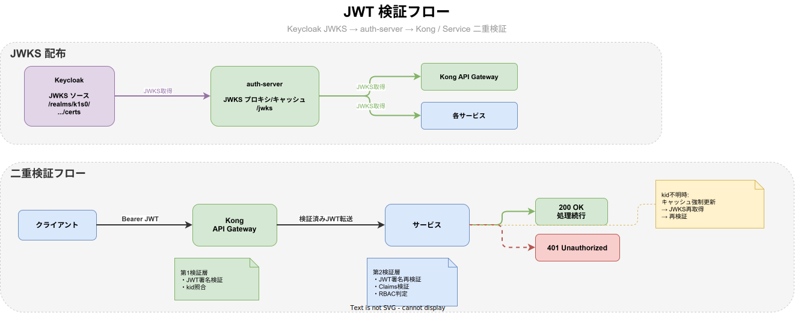
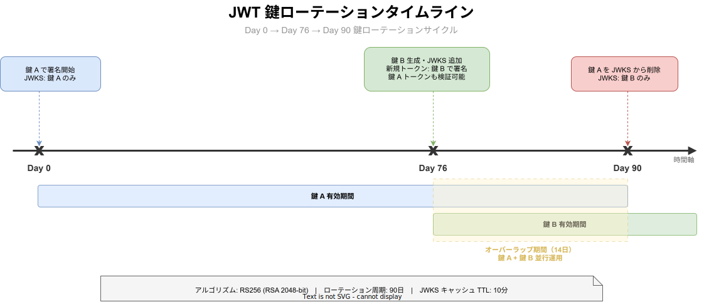

# JWT 設計

D-002: JWT 公開鍵ローテーション。JWKS 方式、Go/Rust 実装を定義する。

元ドキュメント: [認証認可設計.md](./認証認可設計.md)

---

## Kong JWT プラグイン設定（H-03 対応済み）

Kong の JWT プラグインでは `exp`（有効期限）と `iss`（発行元）の両方を検証する。
`iss` クレーム検証により、Keycloak 以外のシステムが発行したトークンによる不正アクセスを防止する。

```yaml
# infra/kong/kong.yaml（グローバル JWT プラグイン設定）
config:
  claims_to_verify:
    - exp   # 有効期限検証
    - iss   # 発行元検証: consumer の key（KONG_KEYCLOAK_ISSUER）と一致することを確認
  key_claim_name: kid
```

`iss` クレームの期待値は Kong Consumer の `key` フィールドで設定する：

```yaml
consumers:
  - username: keycloak
    jwt_secrets:
      - algorithm: RS256
        key: "${KONG_KEYCLOAK_ISSUER}"  # 例: https://auth.k1s0.internal.example.com/realms/k1s0
```

> **注意**: 現行の JWT プラグインは JWKS URL による動的公開鍵解決に対応していない。
> ADR-0017 にて OIDC プラグインへの移行を検討中。

---

## tier_access クレームのクライアント別制限（H-11 対応済み）

`tier_access` クレームはクライアントの役割に応じて最小権限原則に基づき設定する。

| クライアント | tier_access | 備考 |
|------------|------------|------|
| `react-spa` | `["service"]` | エンドユーザークライアント（service tier のみアクセス可） |
| `flutter-mobile` | `["service"]` | エンドユーザークライアント（service tier のみアクセス可） |
| `k1s0-bff` | `["service"]` | BFF（エンドユーザー代理。service tier のみアクセス可） |
| `k1s0-cli` | `["system", "business", "service"]` | 管理ツール（全 tier アクセス可） |
| `k1s0-service` | `["system", "business", "service"]` | サービス間通信（全 tier アクセス可） |

エンドユーザー向けクライアント（react-spa, flutter-mobile, k1s0-bff）に system/business tier への
アクセス権限を付与しないことで、エンドユーザーが管理 API へアクセスするリスクを排除する。

---

## D-002: JWT 公開鍵ローテーション

### JWKS エンドポイント方式

JWT の公開鍵配布には **JWKS（JSON Web Key Set）エンドポイント方式** を採用する。

- 公開鍵の最終ソースは Keycloak の JWKS
- 各サービスは原則として auth-server が提供する JWKS エンドポイント（Keycloak JWKS のプロキシ/キャッシュ）から取得する

JWT 検証の責務は **防御層**とし、API Gateway（Kong）でも検証するが、各サービスも（Bearer トークンを受け取る場合）JWKS により検証する。

```
# 推奨（内部サービス）
JWKS URL: http://auth-server.k1s0-system.svc.cluster.local/jwks

# 上流（Keycloak）
JWKS URL: https://auth.k1s0.internal.example.com/realms/k1s0/protocol/openid-connect/certs
```



### 鍵ローテーションスケジュール

| 項目                 | 値                                     |
| -------------------- | -------------------------------------- |
| アルゴリズム         | RS256（RSA 3072-bit、NIST SP 800-57 推奨）|
| ローテーション周期   | 90 日                                  |
| オーバーラップ期間   | 14 日（新旧鍵の並行運用）             |
| JWKS キャッシュ TTL  | 推奨 10 分（実値はサービス設定）        |

### ローテーションフロー

```
Day 0:     鍵 A で署名（JWKS には鍵 A のみ）
Day 76:    鍵 B を生成・JWKS に追加（鍵 A + 鍵 B）
Day 76-90: 新規トークンは鍵 B で署名、鍵 A のトークンも検証可能
Day 90:    鍵 A を JWKS から削除（鍵 B のみ）
```



### Go 実装例

```go
// internal/infra/auth/jwks.go

type JWKSVerifier struct {
    jwksURL    string
    cacheTTL   time.Duration
    mu         sync.RWMutex
    keySet     jwk.Set
    lastFetch  time.Time
}

func NewJWKSVerifier(jwksURL string, cacheTTL time.Duration) *JWKSVerifier {
    return &JWKSVerifier{
        jwksURL:  jwksURL,
        cacheTTL: cacheTTL,
    }
}

func (v *JWKSVerifier) VerifyToken(tokenString string) (*jwt.Token, error) {
    keySet, err := v.getKeySet()
    if err != nil {
        return nil, fmt.Errorf("failed to get JWKS: %w", err)
    }

    token, err := jwt.Parse(tokenString, func(token *jwt.Token) (interface{}, error) {
        kid, ok := token.Header["kid"].(string)
        if !ok {
            return nil, fmt.Errorf("missing kid in token header")
        }
        key, found := keySet.LookupKeyID(kid)
        if !found {
            // キャッシュを強制更新して再試行
            v.invalidateCache()
            keySet, err := v.getKeySet()
            if err != nil {
                return nil, err
            }
            key, found = keySet.LookupKeyID(kid)
            if !found {
                return nil, fmt.Errorf("unknown kid: %s", kid)
            }
        }
        var pubKey interface{}
        if err := key.Raw(&pubKey); err != nil {
            return nil, err
        }
        return pubKey, nil
    })
    return token, err
}

func (v *JWKSVerifier) getKeySet() (jwk.Set, error) {
    v.mu.RLock()
    if v.keySet != nil && time.Since(v.lastFetch) < v.cacheTTL {
        defer v.mu.RUnlock()
        return v.keySet, nil
    }
    v.mu.RUnlock()

    v.mu.Lock()
    defer v.mu.Unlock()

    keySet, err := jwk.Fetch(context.Background(), v.jwksURL)
    if err != nil {
        return nil, err
    }
    v.keySet = keySet
    v.lastFetch = time.Now()
    return keySet, nil
}
```

### Rust 実装例

```rust
// src/infra/auth/jwks.rs

use jsonwebtoken::{decode, DecodingKey, Validation, Algorithm};
use std::sync::Arc;
use tokio::sync::RwLock;

pub struct JwksVerifier {
    jwks_url: String,
    cache_ttl: std::time::Duration,
    cache: Arc<RwLock<Option<JwksCache>>>,
}

struct JwksCache {
    keys: Vec<Jwk>,
    fetched_at: std::time::Instant,
}

impl JwksVerifier {
    pub fn new(jwks_url: String, cache_ttl: std::time::Duration) -> Self {
        Self {
            jwks_url,
            cache_ttl,
            cache: Arc::new(RwLock::new(None)),
        }
    }

    pub async fn verify_token(&self, token: &str) -> Result<Claims, AuthError> {
        let header = jsonwebtoken::decode_header(token)
            .map_err(|_| AuthError::InvalidToken)?;

        let kid = header.kid.ok_or(AuthError::MissingKid)?;
        let key = self.get_key(&kid).await?;

        let mut validation = Validation::new(Algorithm::RS256);
        validation.set_issuer(&["https://auth.k1s0.internal.example.com/realms/k1s0"]);

        let token_data = decode::<Claims>(token, &key, &validation)
            .map_err(|_| AuthError::InvalidToken)?;

        Ok(token_data.claims)
    }
}
```

---

## 関連ドキュメント

- [認証認可設計.md](./認証認可設計.md) -- 基本方針・技術スタック
- [認証設計.md](./認証設計.md) -- OAuth 2.0 / OIDC 実装
- [サービス間認証設計.md](./サービス間認証設計.md) -- mTLS 設計
- [RBAC設計.md](RBAC設計.md) -- RBAC 設計
