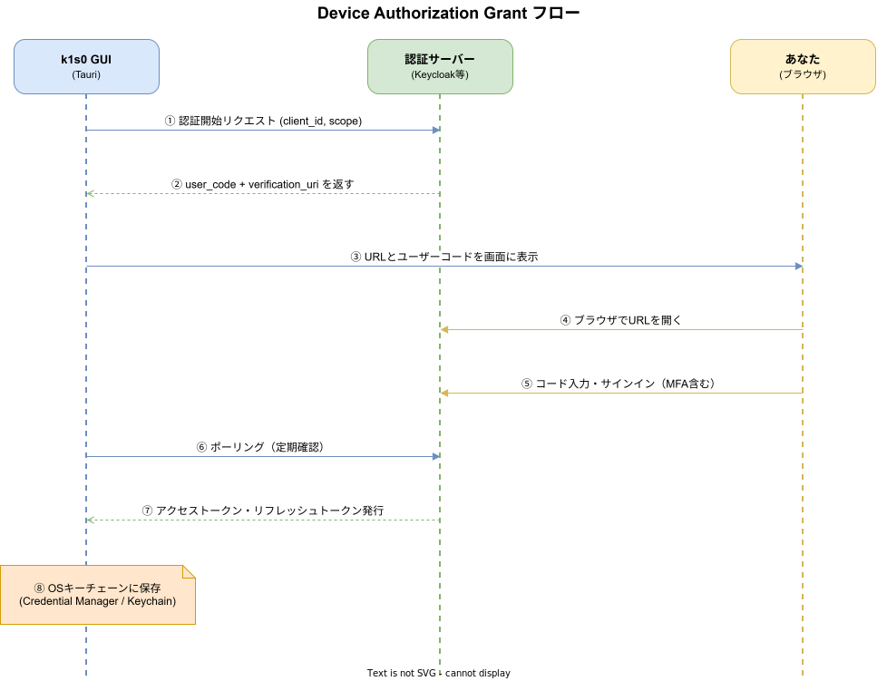
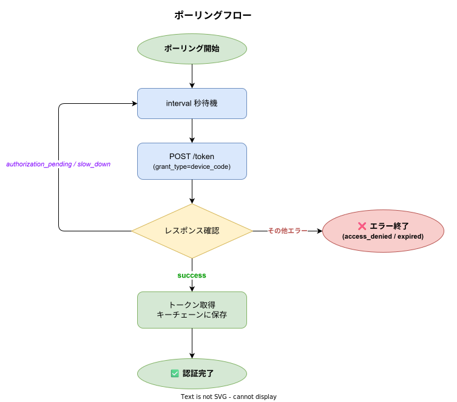

# Device Authorization Grant 入門ガイド

> **対象読者**: 「今までトークンを環境変数に入れていた」「サービスアカウントを使い回していた」「そもそもOAuthをちゃんと理解していない」という方向けの実践ガイドです。

---

## 1. まず「今まで何が問題だったか」から理解する

### よくある現場の認証方法と問題点

多くの開発現場では、こういった方法でツールやスクリプトに認証情報を渡しています。

```bash
# ❌ よくある方法 1: 環境変数に直接トークンを書く
export K1S0_TOKEN="eyJhbGciOiJSUzI1NiIsInR5cCI6IkpXVCJ9..."
./k1s0 generate server

# ❌ よくある方法 2: .env ファイルに書く
K1S0_TOKEN=eyJhbGciOiJSUzI1NiIsInR5cCI6IkpXVCJ9...

# ❌ よくある方法 3: 設定ファイルに書く
[auth]
token = "eyJhbGciOiJSUzI1NiIsInR5cCI6IkpXVCJ9..."
```

これらには共通の問題があります。

| 問題 | 内容 |
|------|------|
| **誰が実行したか分からない** | チームで同じトークンを使い回すと、誰の操作か追跡できない |
| **トークンの更新が面倒** | 有効期限が来るたびに手動で発行・配布が必要 |
| **漏洩リスクが高い** | `.env` ファイルを git に誤コミット、`ps aux` で見えてしまうなど |
| **MFAが使えない** | 多要素認証をバイパスした形になってしまう |

---

## 2. Device Authorization Grant とは何か

### 一言で言うと

> **「ツール側はURLとコードを表示するだけ。ブラウザでのサインインはユーザーが自分でやる」** という認証方式です。

### フローの流れ（図解）



### ポイント

- **ツールはURLとコードを表示するだけ**
- **サインインはブラウザで行う**（MFAもそのまま使える）
- **ツールはバックグラウンドでポーリング**し、サインイン完了を待つ
- **完了したらトークンを取得・保存**して、次回から使い回す

---

## 3. 他のOAuth方式との違い

k1s0では複数の認証方式を用途別に使い分けています。「なぜDevice Flowなのか」を理解するために比較します。

### 方式の比較

| 方式 | 主な用途 | ブラウザ必要 | Client Secret | 対話的サインイン |
|------|---------|------------|---------------|----------------|
| **Authorization Code + PKCE** | Webアプリ・モバイル | リダイレクト必要 | 不要 | あり |
| **Device Authorization Grant** | **デスクトップツール・CLI** | **URLを開くだけ** | **不要** | **あり（ブラウザで）** |
| **Client Credentials** | サービス間通信（無人） | 不要 | 必要 | なし |

### k1s0 GUIがDevice Flowを選んだ理由

```
Tauriアプリには「リダイレクトを受け取るURL」がない

  ❌ http://localhost:8888/callback  → ポート競合の可能性
  ❌ k1s0://callback                 → OSのカスタムURIスキーム登録が必要

  ✅ Device Flow → ブラウザのリダイレクト不要！
```

また、サービスアカウントの Client Credentials では「誰が実行したか」が追跡できません。Device Flowは必ず人間のオペレーターが認証するため、**操作ログに個人を紐付け**できます。

---

## 4. k1s0 GUIでの実際の操作手順

### Step 1: OIDC設定を確認する

GUIを起動して「認証」ページを開きます。

```
Discovery URL : https://auth.k1s0.internal.example.com/realms/k1s0/.well-known/openid-configuration
クライアントID : k1s0-cli
スコープ       : openid profile email
```

**[接続確認] ボタン**を押すと、認証サーバーに疎通できるか確認できます。

```
Discovery OK。発行者: https://auth.k1s0.internal.example.com/realms/k1s0 | デバイスエンドポイント: ...
```

### Step 2: デバイスフローを開始する

**[デバイスフロー開始] ボタン**を押すと、画面に以下が表示されます。

```
認証URL  : https://auth.k1s0.internal.example.com/realms/k1s0/device
ユーザーコード : ABCD-1234
```

### Step 3: ブラウザでサインインする

1. 表示されたURLをブラウザで開く（またはリンクをクリック）
2. ユーザーコード `ABCD-1234` を入力
3. IDプロバイダー（Keycloak等）でサインイン
4. MFAが設定されていれば、そのまま認証アプリで承認

### Step 4: GUIが自動で完了を検知する

ブラウザでサインインが完了すると、GUIが自動的に検知してトークンを取得・保存します。

```
認証が完了しました。
```

以降の操作（Generate、Init等）はこのトークンが自動的に使われます。

---

## 5. 裏側で何が起きているか（技術詳細）

興味がある方向けに、内部の動作を説明します。

### トークンの保存場所

取得したトークンは **OSのキーチェーン** に保存されます。環境変数や設定ファイルには一切書き込まれません。

| OS | 保存先 |
|----|--------|
| Windows | Credential Manager（資格情報マネージャー） |
| macOS | Keychain（キーチェーン） |
| Linux | Secret Service / pass |

これは `ps aux` で見えることもなく、誤って git にコミットされることもありません。

### ポーリングの仕組み



認証サーバーから `slow_down` が返ってきた場合（チェック頻度が高すぎる場合）は、自動的にポーリング間隔を延ばします。

### トークンの自動リフレッシュ

取得したトークンには有効期限があります。k1s0 GUIは有効期限が近づくと自動的にリフレッシュします。**ユーザーが手動で再サインインする必要はありません**（リフレッシュトークンが有効な間は）。

| トークン種別 | 有効期限 | 役割 |
|------------|---------|------|
| アクセストークン | 5分〜1時間程度 | APIリクエスト認証 |
| リフレッシュトークン | 数日〜数週間 | アクセストークンの自動更新に使用 |

リフレッシュトークンを使ってアクセストークンを自動更新するため、リフレッシュトークンが有効な間はユーザーの操作は不要です。

---

## 6. OIDC設定の意味

GUIに入力する3つの値について説明します。

### Discovery URL

```
https://auth.k1s0.internal.example.com/realms/k1s0/.well-known/openid-configuration
```

認証サーバーの「案内板」のようなURLです。ここにアクセスすると、トークンエンドポイントやデバイス認証エンドポイントなどのURLが自動で取得できます。エンドポイントを個別に設定する必要がないため、設定ミスが減ります。

### クライアントID

```
k1s0-cli
```

「k1s0 GUIというアプリケーション」を識別するIDです。**Client Secretは不要**です（Device Flowではパブリッククライアントとして扱われます）。

### スコープ

```
openid profile email
```

「どの情報にアクセスするか」の宣言です。

| スコープ | 取得できる情報 |
|---------|--------------|
| `openid` | 認証情報（必須） |
| `profile` | 名前、ユーザー名 |
| `email` | メールアドレス |

---

## 7. よくある質問

### Q. 毎回サインインが必要ですか？

**いいえ。** 初回のみサインインが必要です。取得したトークンはOSのキーチェーンに保存されるため、次回起動時は自動的に読み込まれます。リフレッシュトークンの有効期限内（通常数日〜数週間）はサインイン不要です。

### Q. 認証サーバーに接続できない環境ではどうなりますか？

認証不要なページ（ダッシュボードなど）は引き続き利用できますが、**保護されたアクション（Generate、Initなど）は実行できません**。社内ネットワークへのVPN接続が必要な場合は、VPN接続後に再度操作してください。

### Q. セッションを削除したい場合は？

認証ページの **[セッションを削除] ボタン** を押すと、OSのキーチェーンからトークンが削除されます。

### Q. 複数人で同じPCを使う場合は？

OSのキーチェーンはユーザーアカウント単位で管理されています。同じPCでも、Windowsのログインアカウントが異なれば、それぞれが独立したトークンを持ちます。

### Q. Keycloak以外のIDプロバイダーでも使えますか？

OIDCのDevice Authorization Grantをサポートするプロバイダーであれば利用可能です（Azure AD、Okta、Auth0等）。Discovery URLを変更するだけで対応できます。

---

## 8. 関連ドキュメント

- [認証認可設計.md](認証認可設計.md) — k1s0全体の認証設計
- [JWT設計.md](JWT設計.md) — JWTトークンの構造と検証
- [RBAC設計.md](RBAC設計.md) — ロールベースアクセス制御
- [authlib設計](../../libraries/auth-security/auth.md) — 認証ライブラリAPI仕様
- [TauriGUI設計](../../cli/gui/TauriGUI設計.md) — GUI実装の詳細設計
