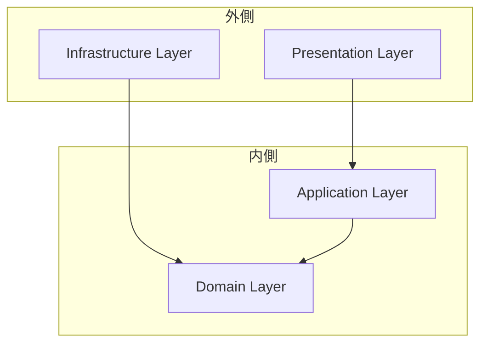

# Clean Architecture

## 概要

k1s0 は Clean Architecture の原則に従い、ビジネスロジックを外部フレームワークや技術的詳細から分離する。これにより、テスト容易性、保守性、技術的負債の軽減を実現する。

## 原則

### 依存方向のルール

```
外側のレイヤーは内側のレイヤーに依存できるが、
内側のレイヤーは外側のレイヤーに依存してはならない。
```



### レイヤーの責務

| レイヤー | 責務 | 依存先 |
|---------|------|--------|
| Domain | ビジネスルール、エンティティ、値オブジェクト | なし |
| Application | ユースケース、アプリケーションサービス | Domain |
| Infrastructure | DB、外部 API、ファイルシステム等の実装 | Domain |
| Presentation | HTTP/gRPC ハンドラ、UI | Application |

## k1s0 でのレイヤー構成

### バックエンド（Rust）

```
src/
├── domain/              # Domain Layer
│   ├── entities/        # エンティティ
│   ├── value_objects/   # 値オブジェクト
│   ├── repositories/    # リポジトリ trait（ポート）
│   ├── services/        # ドメインサービス
│   └── errors.rs        # ドメインエラー
│
├── application/         # Application Layer
│   ├── usecases/        # ユースケース
│   ├── services/        # アプリケーションサービス
│   ├── dtos/            # Data Transfer Objects
│   └── errors.rs        # アプリケーションエラー
│
├── infrastructure/      # Infrastructure Layer
│   ├── repositories/    # リポジトリ実装
│   ├── external/        # 外部サービスクライアント
│   ├── persistence/     # DB 関連
│   └── cache/           # キャッシュ実装
│
└── presentation/        # Presentation Layer
    ├── grpc/            # gRPC ハンドラ
    ├── rest/            # REST ハンドラ（必要な場合）
    ├── middleware/      # ミドルウェア
    └── mappers/         # リクエスト/レスポンス変換
```

### フロントエンド（React）

```
src/
├── domain/              # Domain Layer
│   ├── entities/        # エンティティ
│   └── value_objects/   # 値オブジェクト
│
├── application/         # Application Layer
│   ├── usecases/        # ユースケース
│   └── state/           # 状態管理
│
├── infrastructure/      # Infrastructure Layer
│   ├── api/             # API クライアント
│   └── repositories/    # リポジトリ実装
│
└── presentation/        # Presentation Layer
    ├── pages/           # ページコンポーネント
    ├── components/      # UI コンポーネント
    └── hooks/           # カスタムフック
```

### バックエンド（Go）

```
cmd/
├── server/
│   └── main.go           # エントリポイント
│
internal/
├── domain/              # Domain Layer
│   ├── entities/        # エンティティ
│   ├── valueobjects/    # 値オブジェクト
│   ├── repositories/    # リポジトリインターフェース（ポート）
│   ├── services/        # ドメインサービス
│   └── errors.go        # ドメインエラー
│
├── application/         # Application Layer
│   ├── usecases/        # ユースケース
│   ├── services/        # アプリケーションサービス
│   └── dtos/            # Data Transfer Objects
│
├── infrastructure/      # Infrastructure Layer
│   ├── repositories/    # リポジトリ実装
│   ├── external/        # 外部サービスクライアント
│   └── persistence/     # DB 関連
│
└── presentation/        # Presentation Layer
    ├── grpc/            # gRPC ハンドラ
    ├── rest/            # REST ハンドラ
    └── middleware/      # ミドルウェア
```

### バックエンド（C#）

```
src/
├── {Name}.Domain/              # Domain Layer
│   ├── Entities/               # エンティティ
│   ├── ValueObjects/           # 値オブジェクト
│   ├── Repositories/           # リポジトリインターフェース（ポート）
│   ├── Services/               # ドメインサービス
│   └── Errors/                 # ドメインエラー
│
├── {Name}.Application/         # Application Layer
│   ├── UseCases/               # ユースケース
│   ├── Services/               # アプリケーションサービス
│   └── Dtos/                   # Data Transfer Objects
│
├── {Name}.Infrastructure/      # Infrastructure Layer
│   ├── Repositories/           # リポジトリ実装
│   ├── External/               # 外部サービスクライアント
│   └── Persistence/            # DB 関連 (EF Core)
│
└── {Name}.Presentation/        # Presentation Layer
    ├── Grpc/                   # gRPC ハンドラ
    ├── Controllers/            # REST コントローラ
    └── Middleware/             # ミドルウェア
```

### バックエンド（Python）

```
src/{feature_name_snake}/
├── domain/              # Domain Layer
│   ├── entities/        # エンティティ
│   ├── value_objects/   # 値オブジェクト
│   ├── repositories/    # リポジトリ抽象クラス（ポート）
│   ├── services/        # ドメインサービス
│   └── errors.py        # ドメインエラー
│
├── application/         # Application Layer
│   ├── usecases/        # ユースケース
│   ├── services/        # アプリケーションサービス
│   └── dtos/            # Data Transfer Objects
│
├── infrastructure/      # Infrastructure Layer
│   ├── repositories/    # リポジトリ実装
│   ├── external/        # 外部サービスクライアント
│   └── persistence/     # DB 関連 (SQLAlchemy)
│
└── presentation/        # Presentation Layer
    ├── grpc/            # gRPC サービス
    ├── rest/            # FastAPI ルーター
    └── middleware/      # ミドルウェア
```

### バックエンド（Kotlin）

```
src/main/kotlin/{package}/
├── domain/              # Domain Layer
│   ├── entities/        # エンティティ
│   ├── valueobjects/    # 値オブジェクト
│   ├── repositories/    # リポジトリインターフェース（ポート）
│   ├── services/        # ドメインサービス
│   └── errors/          # ドメインエラー
│
├── application/         # Application Layer
│   ├── usecases/        # ユースケース
│   ├── services/        # アプリケーションサービス
│   └── dtos/            # Data Transfer Objects
│
├── infrastructure/      # Infrastructure Layer
│   ├── repositories/    # リポジトリ実装 (Exposed)
│   ├── external/        # 外部サービスクライアント
│   └── persistence/     # DB 関連 (HikariCP)
│
└── presentation/        # Presentation Layer
    ├── grpc/            # gRPC サービス (grpc-kotlin)
    ├── rest/            # Ktor ルート
    └── middleware/      # ミドルウェア
```

### フロントエンド（Flutter）

```
lib/src/
├── domain/              # Domain Layer
│   ├── entities/        # エンティティ
│   └── value_objects/   # 値オブジェクト
│
├── application/         # Application Layer
│   ├── usecases/        # ユースケース
│   └── state/           # Riverpod プロバイダ
│
├── infrastructure/      # Infrastructure Layer
│   ├── api/             # API クライアント
│   └── repositories/    # リポジトリ実装
│
└── presentation/        # Presentation Layer
    ├── pages/           # ページウィジェット
    ├── widgets/         # UI ウィジェット
    └── controllers/     # コントローラ
```

### フロントエンド（Android）

```
app/src/main/kotlin/{package}/
├── domain/              # Domain Layer
│   ├── entities/        # エンティティ
│   ├── valueobjects/    # 値オブジェクト
│   ├── repositories/    # リポジトリインターフェース（ポート）
│   └── services/        # ドメインサービス
│
├── application/         # Application Layer
│   ├── usecases/        # ユースケース
│   ├── viewmodels/      # ViewModel (StateFlow)
│   └── dtos/            # Data Transfer Objects
│
├── infrastructure/      # Infrastructure Layer
│   ├── repositories/    # リポジトリ実装
│   ├── api/             # API クライアント (Ktor Client)
│   └── persistence/     # ローカル DB (Room)
│
└── presentation/        # Presentation Layer
    ├── screens/         # Composable スクリーン
    ├── components/      # UI コンポーネント (Material 3)
    └── theme/           # テーマ定義
```

## Domain Layer

### エンティティ

ビジネス上の一意な識別子を持つオブジェクト。

```rust
// Rust
pub struct User {
    id: UserId,
    name: UserName,
    email: Email,
    created_at: DateTime<Utc>,
}

impl User {
    pub fn new(name: UserName, email: Email) -> Self { ... }
    pub fn change_email(&mut self, email: Email) -> Result<(), DomainError> { ... }
}
```

```typescript
// TypeScript
interface User {
  readonly id: UserId;
  name: UserName;
  email: Email;
  createdAt: Date;
}
```

### 値オブジェクト

不変で、属性によって同一性が決まるオブジェクト。

```rust
// Rust
#[derive(Debug, Clone, PartialEq, Eq)]
pub struct Email(String);

impl Email {
    pub fn new(value: impl Into<String>) -> Result<Self, DomainError> {
        let value = value.into();
        if !value.contains('@') {
            return Err(DomainError::invalid_input("無効なメールアドレス"));
        }
        Ok(Self(value))
    }

    pub fn as_str(&self) -> &str {
        &self.0
    }
}
```

### リポジトリ trait（ポート）

データ永続化の抽象化。Infrastructure Layer で実装される。

```rust
// Rust - domain/repositories/user_repository.rs
#[async_trait]
pub trait UserRepository: Send + Sync {
    async fn find_by_id(&self, id: &UserId) -> Result<Option<User>, DomainError>;
    async fn find_by_email(&self, email: &Email) -> Result<Option<User>, DomainError>;
    async fn save(&self, user: &User) -> Result<(), DomainError>;
    async fn delete(&self, id: &UserId) -> Result<bool, DomainError>;
}
```

### ドメインサービス

エンティティに属さないドメインロジック。

```rust
// Rust - domain/services/user_domain_service.rs
pub struct UserDomainService;

impl UserDomainService {
    pub fn is_email_available(
        existing_user: Option<&User>,
        current_user_id: Option<&UserId>,
    ) -> bool {
        match (existing_user, current_user_id) {
            (None, _) => true,
            (Some(existing), Some(current_id)) => existing.id() == current_id,
            _ => false,
        }
    }
}
```

## Application Layer

### ユースケース

アプリケーションのビジネスルールを表現。1 ユースケース = 1 ファイルを推奨。

```rust
// Rust - application/usecases/create_user.rs
pub struct CreateUserUseCase<R: UserRepository> {
    user_repository: Arc<R>,
}

impl<R: UserRepository> CreateUserUseCase<R> {
    pub fn new(user_repository: Arc<R>) -> Self {
        Self { user_repository }
    }

    pub async fn execute(&self, input: CreateUserInput) -> Result<UserOutput, AppError> {
        // 1. バリデーション
        let email = Email::new(&input.email)
            .map_err(|e| AppError::from_domain(e, ErrorCode::new("USER_INVALID_EMAIL")))?;

        // 2. 重複チェック
        if self.user_repository.find_by_email(&email).await?.is_some() {
            return Err(AppError::from_domain(
                DomainError::conflict("このメールアドレスは既に使用されています"),
                ErrorCode::new("USER_EMAIL_ALREADY_EXISTS"),
            ));
        }

        // 3. エンティティ生成
        let user = User::new(UserName::new(&input.name)?, email);

        // 4. 永続化
        self.user_repository.save(&user).await
            .map_err(|e| AppError::from_domain(e, ErrorCode::new("USER_SAVE_FAILED")))?;

        // 5. 出力変換
        Ok(UserOutput::from(user))
    }
}
```

### DTO（Data Transfer Objects）

レイヤー間のデータ受け渡し用構造体。

```rust
// Rust - application/dtos/user_dto.rs
#[derive(Debug, Deserialize)]
pub struct CreateUserInput {
    pub name: String,
    pub email: String,
}

#[derive(Debug, Serialize)]
pub struct UserOutput {
    pub id: String,
    pub name: String,
    pub email: String,
    pub created_at: String,
}

impl From<User> for UserOutput {
    fn from(user: User) -> Self {
        Self {
            id: user.id().to_string(),
            name: user.name().as_str().to_string(),
            email: user.email().as_str().to_string(),
            created_at: user.created_at().to_rfc3339(),
        }
    }
}
```

## Infrastructure Layer

### リポジトリ実装

Domain Layer で定義された trait を実装。

```rust
// Rust - infrastructure/repositories/pg_user_repository.rs
pub struct PgUserRepository {
    pool: PgPool,
}

impl PgUserRepository {
    pub fn new(pool: PgPool) -> Self {
        Self { pool }
    }
}

#[async_trait]
impl UserRepository for PgUserRepository {
    async fn find_by_id(&self, id: &UserId) -> Result<Option<User>, DomainError> {
        let row = sqlx::query_as::<_, UserRow>(
            "SELECT id, name, email, created_at FROM users WHERE id = $1"
        )
        .bind(id.as_str())
        .fetch_optional(&self.pool)
        .await
        .map_err(|e| DomainError::internal(format!("DB error: {}", e)))?;

        row.map(User::try_from).transpose()
    }

    async fn save(&self, user: &User) -> Result<(), DomainError> {
        sqlx::query(
            "INSERT INTO users (id, name, email, created_at) VALUES ($1, $2, $3, $4)
             ON CONFLICT (id) DO UPDATE SET name = $2, email = $3"
        )
        .bind(user.id().as_str())
        .bind(user.name().as_str())
        .bind(user.email().as_str())
        .bind(user.created_at())
        .execute(&self.pool)
        .await
        .map_err(|e| DomainError::internal(format!("DB error: {}", e)))?;

        Ok(())
    }

    // ...
}
```

### 外部サービスクライアント

外部 API との通信。

```rust
// Rust - infrastructure/external/auth_client.rs
pub struct AuthServiceClient {
    inner: AuthServiceGrpcClient<Channel>,
}

impl AuthServiceClient {
    pub async fn verify_token(&self, token: &str) -> Result<Claims, InfraError> {
        let request = VerifyTokenRequest {
            token: token.to_string(),
        };

        let response = self.inner
            .clone()
            .verify_token(request)
            .await
            .map_err(InfraError::from)?;

        Ok(Claims::from(response.into_inner()))
    }
}
```

## Presentation Layer

### gRPC ハンドラ

```rust
// Rust - presentation/grpc/user_service.rs
pub struct UserGrpcService<R: UserRepository> {
    create_user: CreateUserUseCase<R>,
}

#[tonic::async_trait]
impl<R: UserRepository + 'static> UserService for UserGrpcService<R> {
    async fn create_user(
        &self,
        request: Request<CreateUserRequest>,
    ) -> Result<Response<CreateUserResponse>, Status> {
        let ctx = RequestContext::from_metadata(request.metadata())?;

        let input = CreateUserInput {
            name: request.get_ref().name.clone(),
            email: request.get_ref().email.clone(),
        };

        let result = self.create_user.execute(input).await
            .map_err(|e| e.to_grpc_error())?;

        Ok(Response::new(CreateUserResponse {
            user: Some(result.into()),
        }))
    }
}
```

## 依存性注入

### 構成例（Rust）

```rust
// main.rs
#[tokio::main]
async fn main() -> Result<()> {
    // Infrastructure
    let pool = create_db_pool(&config).await?;
    let user_repository = Arc::new(PgUserRepository::new(pool.clone()));

    // Application
    let create_user = CreateUserUseCase::new(user_repository.clone());
    let get_user = GetUserUseCase::new(user_repository.clone());

    // Presentation
    let user_service = UserGrpcService::new(create_user, get_user);

    // Server
    Server::builder()
        .add_service(UserServiceServer::new(user_service))
        .serve(addr)
        .await?;

    Ok(())
}
```

## 禁止事項

### Domain Layer での禁止

1. **外部フレームワークへの依存**
   - Tonic、Axum、SQLx 等のインポート禁止
   - HTTP/gRPC の概念を持ち込まない

2. **Infrastructure への直接依存**
   - `infrastructure/` からのインポート禁止
   - 具象リポジトリへの参照禁止

3. **環境変数の参照**
   - `std::env::var()` の使用禁止

### Application Layer での禁止

1. **Presentation/Infrastructure への依存**
   - gRPC/REST の型を直接使用しない
   - DB の具象型を使用しない

2. **トランスポート固有のエラー**
   - HTTP ステータスコードや gRPC ステータスの直接使用禁止

## 検証方法

`k1s0 lint` で以下を検査:

```bash
# 依存方向違反の検出
k1s0 lint --rules dependency-direction

# 環境変数参照の検出
k1s0 lint --rules no-env-var
```

詳細: [lint 設計書](../design/lint/)

## 関連ドキュメント

- [Tier システム](./tier-system.md): crate レベルの依存ルール
- [サービス構成規約](../conventions/service-structure.md): ディレクトリ構成
- [エラー規約](../conventions/error-handling.md): レイヤー別エラー設計
