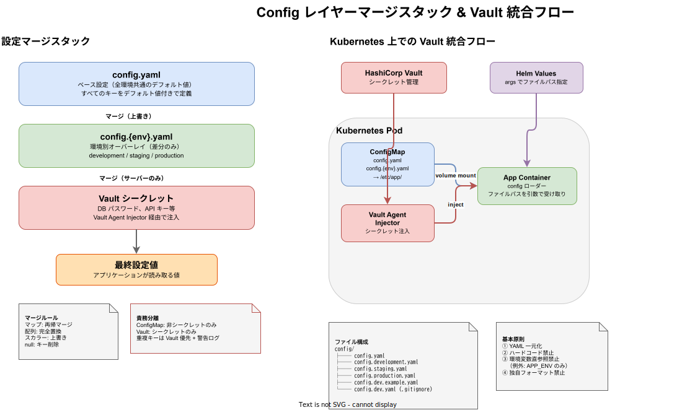

# 設定管理方針

k1s0 プロジェクトにおける設定値の管理ルールを定義する。すべてのアプリケーション（サーバー・クライアント）で YAML による一元管理を原則とし、ハードコードや設定形式の分散を防ぐ。

## Config レイヤーマージスタック & Vault 統合フロー



## 基本原則

| # | 原則 | 説明 |
|---|------|------|
| 1 | YAML 一元化 | 設定値はすべて YAML ファイルで管理する |
| 2 | ハードコード禁止 | API URL・ポート番号・タイムアウト値等をソースコードに直接記述しない |
| 3 | 環境変数直参照禁止 | 環境変数を個別に読み取らない（例外: `APP_ENV` のみ許可） |
| 4 | 独自フォーマット禁止 | JSON・TOML・.env・独自テキスト形式で設定を定義しない |

> **`APP_ENV` の例外**: 環境名（`development`, `staging`, `production`）を取得するためだけに `APP_ENV` 環境変数を参照してよい。この値は読み込む YAML ファイルの選択にのみ使用する。

## 設定値の分類

| 分類 | 例 | 管理方法 | YAML に記載 |
|------|----|----------|-------------|
| アプリ設定 | ポート番号、ログレベル、タイムアウト | `config.yaml` | Yes |
| 環境差分 | DB ホスト、API エンドポイント | `config.{env}.yaml` | Yes |
| シークレット | DB パスワード、API キー | Vault → マージ | No（プレースホルダのみ） |
| ビルド時定数 | バージョン番号、ビルド日時 | ビルドシステム注入 | No |

## 設定ファイル構成

すべてのアプリケーションで以下のディレクトリ構造に統一する。

```
{service-root}/
└── config/
    ├── config.yaml              # ベース設定（全環境共通のデフォルト値）
    ├── config.development.yaml  # 開発環境オーバーレイ
    ├── config.staging.yaml      # ステージング環境オーバーレイ
    ├── config.production.yaml   # 本番環境オーバーレイ
    ├── config.dev.example.yaml  # ローカル開発用テンプレート（Git 管理）
    └── config.dev.yaml          # ローカル開発用設定（Git 管理外）
```

- ベース設定にはすべてのキーをデフォルト値付きで定義する
- 環境別ファイルには環境固有の差分のみを記載する

### ローカル開発用設定ファイル（config.dev.yaml / config.local.yaml）

ローカル開発環境ではシークレットを含む `config.dev.yaml` を使用するが、**このファイルは `.gitignore` で Git 管理外としている**。

- `config.dev.example.yaml` がテンプレートとして Git 管理されている
- 初回セットアップ時に `cp config.dev.example.yaml config.dev.yaml` でコピーし、ローカル環境に合わせてシークレット値を記入する
- `${DB_PASSWORD}` 等のプレースホルダをローカル環境の実際の値に置き換える

## スキーマ

### サーバー共通スキーマ

サーバー側スキーマの詳細は [config ライブラリ設計](../../libraries/config/config.md) を参照。

| セクション | 説明 |
|------------|------|
| `app` | アプリケーション基本設定（name, version, env） |
| `server` | HTTP サーバー設定（host, port, timeout） |
| `grpc` | gRPC サーバー設定 |
| `database` | DB 接続設定 |
| `kafka` | Kafka 接続設定 |
| `redis` | Redis 接続設定 |
| `observability` | トレーシング・メトリクス・ログ設定 |
| `auth` | 認証設定（JWKS, issuer, audience） |

### クライアント専用スキーマ

クライアント（React / Flutter）はサーバースキーマとは独立した以下のセクションを使用する。

```yaml
# クライアント config.yaml の構成例
app:
  name: "my-client"
  version: "1.0.0"
  env: "development"

# API 接続先の設定
api:
  base_url: "http://localhost:8080"
  timeout: 30
  retry:
    max_attempts: 3
    backoff_ms: 1000

# プロキシ設定（開発時の API プロキシ等）
proxy:
  enabled: false
  target: "http://localhost:8080"

# フィーチャーフラグ
features:
  dark_mode: true
  experimental_ui: false
```

| セクション | 説明 |
|------------|------|
| `app` | アプリケーション基本設定（サーバーと共通） |
| `api` | API 接続先設定（base_url, timeout, retry） |
| `proxy` | 開発用プロキシ設定 |
| `features` | フィーチャーフラグ（実行時トグル） |

## 環境別オーバーレイ

### マージ戦略

設定値は以下の順序でマージされる。後のレイヤーが前のレイヤーを上書きする。

```
config.yaml（ベース）
  ↓ マージ
config.{env}.yaml（環境オーバーレイ）
  ↓ マージ（サーバーのみ）
Vault シークレット
```

### Kubernetes 上での運用

本番環境では YAML ファイルを Kubernetes ConfigMap / Secret としてマウントする。

- `config.yaml` と `config.{env}.yaml` は ConfigMap としてボリュームマウントする
- シークレット値は Vault Agent Injector 経由で注入する（YAML に直接記載しない）
- マウントパス: ローカル開発では `config/config.yaml`、Kubernetes では `/etc/app/config.yaml`
- config ローダーはファイルパスを引数で受け取り、Dockerfile の `CMD` や Helm values の `args` でパスを指定する

#### ConfigMap と Vault の責務分離

- ConfigMap にシークレットを定義してはならない（空文字またはダミー値を記載）
- Vault に非シークレットを格納してはならない（設定値の出所が曖昧になるため）
- 万が一 ConfigMap と Vault で同一キーが存在した場合、Vault の値を採用し警告ログを出力する

### マージルール

| データ型 | ルール | 例 |
|----------|--------|----|
| マップ（オブジェクト） | 再帰マージ | `database.host` のみ上書き、他のキーは保持 |
| 配列（リスト） | 完全置換 | `kafka.brokers` はオーバーレイの値で全置換 |
| スカラー値 | 上書き | `server.port: 9090` がベースの `8080` を置換 |
| null 値 | キーの削除 | `redis: null` でベースの redis セクションを削除 |

> **配列が完全置換の理由**: 配列のマージ（追加・差分比較）は要素の同一性判定が曖昧になるため、完全置換を採用する。Kafka brokers のように環境ごとに異なるホスト一覧を持つケースでは、部分マージよりも完全置換が安全である。

## 言語別ルール

### Go

```go
// ✅ OK: config ライブラリ経由で設定を取得する
cfg, err := config.Load("config/config.yaml", "config/config."+os.Getenv("APP_ENV")+".yaml")
srv := http.Server{Addr: fmt.Sprintf(":%d", cfg.Server.Port)}

// ❌ NG: ハードコード
srv := http.Server{Addr: ":8080"}

// ❌ NG: 環境変数を直接参照
port := os.Getenv("SERVER_PORT")
```

### Rust

```rust
// ✅ OK: config ライブラリ経由で設定を取得する
let cfg = config::load("config/config.yaml", env_overlay)?;
let addr = format!("0.0.0.0:{}", cfg.server.port);

// ❌ NG: ハードコード
let addr = "0.0.0.0:8080";

// ❌ NG: 環境変数を直接参照
let port = std::env::var("SERVER_PORT")?;
```

### TypeScript（React）

```typescript
// ✅ OK: ビルド時に注入された設定を使用する
const apiUrl = __APP_CONFIG__.api.base_url;

// ❌ NG: ハードコード
const apiUrl = "http://localhost:8080";

// ❌ NG: 環境変数を直接参照
const apiUrl = import.meta.env.VITE_API_URL;
```

### Dart（Flutter）

```dart
// ✅ OK: DI 経由で設定を取得する
final config = ref.watch(appConfigProvider);
final apiUrl = config.api.baseUrl;

// ❌ NG: ハードコード
const apiUrl = "http://localhost:8080";

// ❌ NG: 環境変数を直接参照（Flutter では通常不可だが、dotenv 等のパッケージ利用も禁止）
final apiUrl = dotenv.env['API_URL'];
```

## クライアント側の設定管理

### React（Vite define 注入方式）

SPA ではサーバーサイドのように実行時に YAML を読み込めないため、ビルド時に Vite の `define` 機能で設定値をバンドルに注入する。

#### 仕組み

1. `vite.config.ts` で YAML ファイルを読み込み、`define` でグローバル定数として注入する
2. アプリケーションコードは `__APP_CONFIG__` 経由で設定値を参照する

```typescript
// vite.config.ts
import { defineConfig } from 'vite';
import { readFileSync, existsSync } from 'fs';
import { parse } from 'yaml';

// YAML 設定ファイルを読み込む
const env = process.env.APP_ENV ?? 'development';
const base = parse(readFileSync('config/config.yaml', 'utf-8'));

// 環境別オーバーレイ設定が存在する場合のみ読み込んでマージする
const overlayPath = `config/config.${env}.yaml`;
const overlay = existsSync(overlayPath) ? parse(readFileSync(overlayPath, 'utf-8')) : {};
const config = deepMerge(base, overlay);

export default defineConfig({
  define: {
    __APP_CONFIG__: JSON.stringify(config),
  },
});
```

```typescript
// src/config.ts — 型安全なアクセサ
declare const __APP_CONFIG__: AppConfig;

// アプリケーション設定の型定義
interface AppConfig {
  app: { name: string; version: string; env: string };
  api: { base_url: string; timeout: number; retry: { max_attempts: number; backoff_ms: number } };
  features: Record<string, boolean>;
}

// グローバル定数から設定を取得する
export const appConfig: AppConfig = __APP_CONFIG__;
```

#### メリット

- バンドルサイズに設定値が埋め込まれるため、追加の HTTP リクエストが不要
- ツリーシェイキングにより未使用の設定値は除去される
- 起動速度に影響しない

### Flutter（アセット同梱 + Riverpod DI 方式）

Flutter ではアセットとして YAML を同梱し、起動時に読み込んで Riverpod プロバイダ経由で DI する。

#### 仕組み

1. `config/` ディレクトリの YAML をアセットとして `pubspec.yaml` に登録する
2. アプリ起動時に YAML を読み込み、Config オブジェクトを生成する
3. Riverpod プロバイダ経由で全ウィジェットに設定を提供する

```yaml
# pubspec.yaml
flutter:
  assets:
    - config/config.yaml
    - config/config.development.yaml
    - config/config.staging.yaml
    - config/config.production.yaml
```

```dart
// lib/config/app_config.dart
import 'package:flutter/services.dart';
import 'package:yaml/yaml.dart';

/// YAML 設定ファイルを読み込んで Config オブジェクトを生成するローダー
class AppConfig {
  final String appName;
  final ApiConfig api;
  final Map<String, bool> features;

  AppConfig._({required this.appName, required this.api, required this.features});

  /// アセットから YAML を読み込み、環境オーバーレイをマージして返す
  static Future<AppConfig> load(String env) async {
    final baseYaml = await rootBundle.loadString('config/config.yaml');
    final base = loadYaml(baseYaml) as Map;

    // 環境別オーバーレイ設定が存在する場合のみ読み込んでマージする
    Map merged;
    try {
      final overlayYaml = await rootBundle.loadString('config/config.$env.yaml');
      final overlay = loadYaml(overlayYaml) as Map;
      merged = deepMerge(base, overlay);
    } catch (_) {
      merged = base;
    }
    return AppConfig._fromMap(merged);
  }
}
```

```dart
// lib/config/config_provider.dart
import 'package:flutter_riverpod/flutter_riverpod.dart';

/// アプリケーション設定を提供する Riverpod プロバイダ
final appConfigProvider = Provider<AppConfig>((ref) {
  throw UnimplementedError('main() で override すること');
});
```

```dart
// lib/main.dart
void main() async {
  WidgetsFlutterBinding.ensureInitialized();
  final env = const String.fromEnvironment('APP_ENV', defaultValue: 'development');
  final config = await AppConfig.load(env);

  runApp(
    ProviderScope(
      overrides: [appConfigProvider.overrideWithValue(config)],
      child: const MyApp(),
    ),
  );
}
```

## ホットリロード（WatchConfig）

サーバー側では config ライブラリの `WatchConfigClient` を使い、gRPC ストリーミング経由で設定変更を実行時に反映できる。

- ホットリロード対象はログレベル・フィーチャーフラグ等の安全に変更可能な値に限定する
- DB 接続先・ポート番号等の構造的変更はホットリロード対象外（再起動が必要）
- クライアント側はホットリロード非対応（ビルド時注入 / 起動時読み込みのため）

詳細は [config ライブラリ設計](../../libraries/config/config.md) の `WatchConfigClient` を参照。

## シークレット管理

### 対象フィールド

以下のフィールドはシークレットとして扱い、YAML に平文で記載しない。

| フィールド | 説明 |
|------------|------|
| `database.password` | DB パスワード |
| `kafka.sasl.username` | Kafka SASL ユーザー名 |
| `kafka.sasl.password` | Kafka SASL パスワード |
| `redis.password` | Redis パスワード |
| `redis_session.password` | BFF セッション用 Redis パスワード |
| `auth.oidc.client_secret` | OAuth クライアントシークレット |

### Vault 統合フロー（サーバーのみ）

```
起動時:
  1. config.yaml + config.{env}.yaml をマージ → Config 生成
  2. Vault からシークレットを取得
  3. MergeVaultSecrets() で Config にシークレットを注入
  4. Validate() で最終バリデーション → 失敗時は即座にエラー終了（exit(1)）
```

### バリデーション

| タイミング | 実行方法 | 動作 |
|------------|----------|------|
| アプリケーション起動時 | `config.Validate()` を `main()` 内で呼び出し | 失敗時は即座にエラー終了 |
| CI パイプライン | `config validate` コマンド | デプロイ前に不正設定を検出 |

- 不正な設定のまま稼働することを防止するため、バリデーション失敗時は起動しない
- 設定値の追加時は Config 構造体（Go/Rust）とスキーマ（TypeScript Zod）の両方を更新すること

### クライアントとシークレット

- クライアント（React / Flutter）にシークレットを含めてはならない
- API キー等が必要な場合は、BFF（Backend for Frontend）経由でアクセスする
- クライアントの YAML にはシークレット系フィールドを定義しない

## 開発環境セキュリティポリシー

本セクションは LOW-01/02/03 監査指摘事項への対応として、開発・verify 環境での意図的な設計を明確に定義する。

### 開発環境パスワードポリシー（LOW-01）

- 開発環境（`docker-compose.dev.yaml`）では `${DB_PASSWORD:-dev}` 形式でデフォルト値 `dev` を使用する（意図的設計）
- これはローカル開発の初期セットアップコストを下げるための意図的なフォールバックであり、セキュリティ上のリスクはローカル環境に限定される
- 本番環境では必ず環境変数 `DB_PASSWORD` を上書きすること（未設定時は起動を拒否するバリデーションを入れること）
- staging 環境は本番と同等のシークレット管理（Vault）を使用し、デフォルト値フォールバックを使用しないこと

### sslmode ポリシー（LOW-02）

- Docker Compose 内部通信は `sslmode=disable`（意図的設計）
  - 理由: Docker ネットワーク内はコンテナ間通信であり、外部からの盗聴リスクが存在しないため
  - 開発・CI 環境でのセルフ署名証明書管理コストを避けるための設計判断
- 本番環境（Kubernetes）は全 DB 接続で TLS を必須とする（`sslmode=verify-full`）
- staging 環境は必ず本番と同等の TLS 設定を使用する（`sslmode=disable` は staging で禁止）

### verify 環境 Secret 管理（LOW-03）

- `infra/kubernetes/verify/` の Secret ファイルはテスト専用固定値のみを含み、Git 管理下に置く（意図的設計）
  - 理由: verify 環境は CI/CD パイプライン内の一時的な検証環境であり、シークレットの機密性よりも再現性を優先する
- 本番・staging 環境の Secret は GitOps リポジトリに含めず、HashiCorp Vault または External Secrets Operator で管理すること
- GitOps パイプラインは `infra/kubernetes/verify/` の Secret を本番・staging 環境へ適用しないようにブランチ保護・Argo CD の `destination` 制限で自動的にブロックすること

## 非開発環境シークレット必須チェックパターン（C-05 監査対応）

初期化スクリプト（`init-vault.sh` 等）で非開発環境を検出し、シークレットが設定されていることを検証する。

```bash
# 開発環境以外ではシークレットの明示的設定を必須とする
if [ "$ENVIRONMENT" != "development" ] && [ "$ENVIRONMENT" != "dev" ] && [ "$ENVIRONMENT" != "local" ]; then
    : "${DB_PASSWORD:?本番環境では DB_PASSWORD を必ず設定してください}"
    : "${AUTH_API_KEY:?本番環境では AUTH_API_KEY を必ず設定してください}"
fi
```

Vault へのシークレット登録時は、コマンドライン引数にシークレット値が露出しないよう JSON ファイル経由で渡す。

```bash
# vault kv put でシークレットをファイル経由で安全に渡すヘルパー関数
vault_kv_put() {
  local path="$1" json="$2"
  local tmpfile="/tmp/vault-secret-$$.json"
  echo "${json}" > "${tmpfile}"
  vault kv put "${path}" @"${tmpfile}"
  shred -u "${tmpfile}" 2>/dev/null || rm -f "${tmpfile}"
}
```

## 禁止事項

### ハードコードの禁止

設定値をソースコードにリテラルとして記述してはならない。

```go
// ❌ NG
timeout := 30 * time.Second
```

```typescript
// ❌ NG
const MAX_RETRY = 3;
```

```dart
// ❌ NG
const apiUrl = "https://api.example.com";
```

### 環境変数直参照の禁止

`APP_ENV` 以外の環境変数を直接読み取ってはならない。

```go
// ❌ NG
dbHost := os.Getenv("DB_HOST")
```

```typescript
// ❌ NG
const dbHost = process.env.DB_HOST;
```

### 独自フォーマットの禁止

YAML 以外の形式で設定ファイルを作成してはならない。

```
❌ config.json
❌ config.toml
❌ .env / .env.local
❌ settings.ini
```

### 例外リスト

以下は本方針の適用対象外とする。

| 対象 | 理由 |
|------|------|
| `APP_ENV` 環境変数 | YAML ファイル選択に必要な最小限の環境識別子 |
| config ローダー内部の環境変数参照 | config ライブラリの `Load` 関数内でのみ許可 |
| Kubernetes ConfigMap / Secret による環境変数注入 | インフラレイヤーでの設定管理は Kubernetes に委譲する |
| CI/CD パイプラインでの環境変数設定 | ビルド・デプロイプロセスはインフラ管轄 |
| ビルドツール設定（`vite.config.ts`, `Cargo.toml` 等） | ビルドツール自体の設定であり、アプリケーション設定ではない |
| テストのフィクスチャ値 | テストコード内の固定値は設定とは異なる |
| `pubspec.yaml` / `package.json` | パッケージマネージャの設定ファイル |

## 既存コードの改善指針

### 違反パターンと改善方法

| 違反パターン | 改善方法 | 優先度 |
|-------------|----------|--------|
| API URL のハードコード | `config.yaml` の `api.base_url` に移動 | 高 |
| ポート番号のハードコード | `config.yaml` の `server.port` に移動 | 高 |
| タイムアウト値のハードコード | `config.yaml` の該当セクションに移動 | 中 |
| `import.meta.env.VITE_*` の使用 | Vite define 方式に移行 | 高 |
| `.env` ファイルの使用 | `config.{env}.yaml` に統合 | 高 |
| `dotenv` パッケージの使用 | アセット YAML + Riverpod DI に移行 | 高 |
| Vite proxy の `localhost` ハードコード | `config.yaml` の `proxy.target` から読み込み | 高 |
| WebSocket URL のハードコード（`ws://localhost`） | `config.yaml` の `api` セクションに移動 | 高 |
| フィーチャーフラグのハードコード | `config.yaml` の `features` セクションに移動 | 中 |

### 移行手順

1. `config/` ディレクトリと YAML ファイルを作成する
2. ハードコードされた値を YAML に移動する
3. config ライブラリ / Vite define / Riverpod DI 経由で設定を参照するよう変更する
4. 不要になった `.env` ファイルや環境変数参照を削除する
5. テストで動作確認する

## 関連ドキュメント

- [config ライブラリ設計](../../libraries/config/config.md)
- [config 設計（CLI）](../../cli/config/config設計.md)
- [コーディング規約](./コーディング規約.md)
- [コンセプト](../overview/コンセプト.md)
- [helm 設計](../../infrastructure/kubernetes/helm設計.md)
- [認証認可設計](../auth/認証認可設計.md)
