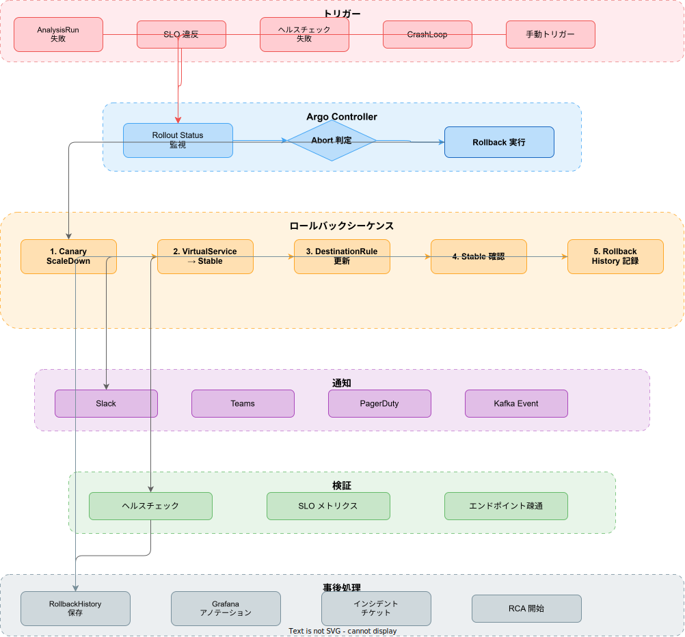

# プログレッシブデリバリー設計

k1s0 マイクロサービスプラットフォームにおけるプログレッシブデリバリーの全体設計を定義する。
Tier アーキテクチャの詳細は [tier-architecture.md](../../architecture/overview/tier-architecture.md) を参照。

## 基本方針

- **"デプロイは日常、リリースは戦略的判断"** — デプロイとリリースを分離し、Feature Flag との連携で段階的公開を実現する
- メトリクスベースの自動判定により、人的ミスを排除した安全なリリースを行う
- 段階的ロールアウトでリスクを最小化し、問題発生時は自動ロールバックで即座に安定版へ切り戻す
- Argo Rollouts と Istio の統合により、宣言的なプログレッシブデリバリーを実現する

---

## 詳細設計ドキュメント

各設計の詳細は以下のセクションを参照。

| ドキュメント ID | セクション | 内容 |
| --- | --- | --- |
| D-210 | [プログレッシブデリバリー全体設計](#d-210-プログレッシブデリバリー全体設計) | アーキテクチャ概要、デプロイ戦略マトリクス、Argo Rollouts 統合 |
| D-211 | [カナリアデプロイ設計](#d-211-カナリアデプロイ設計) | カナリアステップ、分析テンプレート、Istio トラフィック制御 |
| D-212 | [自動ロールバック設計](#d-212-自動ロールバック設計) | ロールバックトリガー、通知・アラート、ロールバック演習 |
| D-213 | [マルチリージョンデプロイ設計](#d-213-マルチリージョンデプロイ設計) | Active-Active 構成、フェイルオーバー、ローリングリージョンアップデート |

---

## D-210: プログレッシブデリバリー全体設計

### アーキテクチャ概要


プログレッシブデリバリーは GitHub Actions による CI/CD パイプライン（D-101）から開始し、Argo Rollouts がデプロイの進行を管理する。Istio VirtualService / DestinationRule によるトラフィック制御と、Prometheus メトリクスに基づく AnalysisRun の判定結果を組み合わせ、段階的にトラフィックをシフトする。

### デプロイ戦略マトリクス

| 戦略 | ユースケース | リスク | 所要時間 | 適用条件 |
| --- | --- | --- | --- | --- |
| Rolling Update | 内部ツール、非クリティカルサービス | 低 | 5〜10 分 | SLO 影響が軽微なサービス |
| Blue-Green | DB マイグレーション伴うリリース、全面切り替え | 中 | 10〜15 分 | ダウンタイムゼロが必須、即時切り戻しが必要 |
| Canary | 本番サービスの通常リリース（k1s0 標準） | 低〜中 | 30〜60 分 | メトリクスで品質を段階評価可能 |
| A/B Testing | UI/UX の変更、ビジネスメトリクス比較 | 低 | 数時間〜数日 | ビジネス KPI で判定が必要 |
| Shadow Traffic（Dark Launch） | 新バージョンの負荷・互換性検証 | 極低 | 15〜30 分 | ユーザー影響ゼロで新バージョンを検証 |

> **注記**: k1s0 では **Canary デプロイ** を標準戦略として採用する。すべての本番サービスリリースは原則としてカナリアデプロイで実施し、例外的なケースにのみ他の戦略を適用する。

### 戦略適用判定フロー

| 判定条件 | 適用戦略 |
| --- | --- |
| DB スキーマ変更あり + 後方互換あり | Canary（マイグレーション先行実行） |
| DB スキーマ変更あり + 後方互換なし | Blue-Green（メンテナンスウィンドウ設定） |
| API の破壊的変更あり | Blue-Green + Feature Flag |
| 通常のコード変更 | Canary（標準フロー） |
| パフォーマンスに影響する変更 | Shadow Traffic → Canary |
| UI/UX の A/B 検証が必要 | A/B Testing（Feature Flag 連携） |

### Argo Rollouts 統合設計

#### Argo Rollouts の選定理由

| 比較項目 | Argo Rollouts | Flagger |
| --- | --- | --- |
| CRD ベース | Rollout CRD（Deployment 互換） | Canary CRD（Deployment をラップ） |
| Istio 統合 | ネイティブ対応（TrafficRouting） | ネイティブ対応（Provider） |
| 分析機能 | AnalysisTemplate / AnalysisRun（柔軟なカスタム分析） | MetricTemplate（組み込みメトリクスベース） |
| Blue-Green 対応 | ネイティブ対応 | 非対応 |
| UI ダッシュボード | Argo Rollouts Dashboard（専用 UI） | Flagger Grafana Dashboard |
| GitOps 統合 | Argo CD とのネイティブ統合 | Argo CD / Flux 対応 |
| カスタム分析 | Prometheus / Datadog / Kayenta / Web 等、多様なプロバイダ | Prometheus / Datadog 等 |
| CNCF ステータス | CNCF Graduated（Argo プロジェクト） | CNCF Graduated（Flux プロジェクト） |
| コミュニティ活性度 | 高（Argo エコシステム） | 中 |

> **注記**: k1s0 では Argo Rollouts を採用する。既存のサービスメッシュ設計（D-116）で Flagger を参照しているが、プログレッシブデリバリーの本格運用にあたり、Blue-Green 対応・柔軟な AnalysisTemplate・Argo CD とのネイティブ統合を重視し、Argo Rollouts に移行する。既存の Flagger Canary リソースは Argo Rollouts の Rollout CRD に段階的に移行する。

#### Argo Rollouts インストール

```yaml
# infra/helm/services/system/argo-rollouts/values.yaml
controller:
  replicas: 2
  metrics:
    enabled: true
    serviceMonitor:
      enabled: true
      namespace: observability

dashboard:
  enabled: true
  service:
    type: ClusterIP
    port: 3100

installCRDs: true

# Istio トラフィックルーティングをデフォルトで有効化
trafficRouterPlugins:
  istio:
    enabled: true
```

#### Rollout CRD 基本定義

```yaml
apiVersion: argoproj.io/v1alpha1
kind: Rollout
metadata:
  name: task-server
  namespace: k1s0-service
  labels:
    app: task-server
    tier: service
spec:
  replicas: 3
  revisionHistoryLimit: 5
  selector:
    matchLabels:
      app: task-server
  template:
    metadata:
      labels:
        app: task-server
        tier: service
    spec:
      containers:
        - name: task-server
          image: harbor.k1s0.internal/k1s0/task-server:latest
          ports:
            - containerPort: 8080
              name: http
              protocol: TCP
          readinessProbe:
            httpGet:
              path: /health/ready
              port: 8080
            initialDelaySeconds: 5
            periodSeconds: 10
          livenessProbe:
            httpGet:
              path: /health/live
              port: 8080
            initialDelaySeconds: 15
            periodSeconds: 20
          resources:
            requests:
              cpu: 100m
              memory: 128Mi
            limits:
              cpu: 500m
              memory: 512Mi
  strategy:
    canary:
      canaryService: task-server-canary
      stableService: task-server-stable
      trafficRouting:
        istio:
          virtualServices:
            - name: task-server
              routes:
                - primary
          destinationRule:
            name: task-server
            canarySubsetName: canary
            stableSubsetName: stable
      steps:
        - setWeight: 5
        - pause: { duration: 5m }
        - analysis:
            templates:
              - templateName: k1s0-canary-analysis
            args:
              - name: service-name
                value: task-server
              - name: namespace
                value: k1s0-service
        - setWeight: 10
        - pause: { duration: 5m }
        - setWeight: 25
        - pause: { duration: 5m }
        - analysis:
            templates:
              - templateName: k1s0-canary-analysis
            args:
              - name: service-name
                value: task-server
              - name: namespace
                value: k1s0-service
        - setWeight: 50
        - pause: { duration: 10m }
        - analysis:
            templates:
              - templateName: k1s0-canary-analysis
            args:
              - name: service-name
                value: task-server
              - name: namespace
                value: k1s0-service
        - setWeight: 100
      analysisRunMetadata:
        labels:
          app: task-server
          analysis-type: canary
```

#### Istio との統合設定

Argo Rollouts が管理する VirtualService と DestinationRule は、既存の `infra/istio/` 配下の定義と整合させる。Argo Rollouts は `spec.strategy.canary.trafficRouting.istio` で指定された VirtualService のウェイトを自動的に変更する。

```yaml
# infra/istio/virtualservices/task-server.yaml
# Argo Rollouts が weight を自動管理するため、初期値は stable: 100, canary: 0
apiVersion: networking.istio.io/v1
kind: VirtualService
metadata:
  name: task-server
  namespace: k1s0-service
spec:
  hosts:
    - task-server
  http:
    - name: primary
      route:
        - destination:
            host: task-server
            subset: stable
          weight: 100
        - destination:
            host: task-server
            subset: canary
          weight: 0
      timeout: 15s
      retries:
        attempts: 2
        perTryTimeout: 5s
        retryOn: "5xx,reset,connect-failure,retriable-4xx"
```

### デプロイパイプライン全体フロー

GitHub Actions から Argo Rollouts を経由して本番デプロイに至るまでの全体フローを以下に定義する。

| ステップ | 実行主体 | アクション | 成功条件 |
| --- | --- | --- | --- |
| 1. コードマージ | GitHub Actions | main ブランチへの PR マージをトリガー | CI パス済み |
| 2. イメージビルド | GitHub Actions | Docker イメージをビルドし Harbor にプッシュ | ビルド成功 + Trivy スキャン通過 |
| 3. マニフェスト更新 | GitHub Actions | Helm values のイメージタグを更新 | Git コミット成功 |
| 4. Rollout 開始 | Argo Rollouts | 新 ReplicaSet を作成し canary Pod を起動 | Pod Ready |
| 5. トラフィックシフト | Argo Rollouts + Istio | VirtualService のウェイトを段階的に変更 | 各ステップ完了 |
| 6. 分析実行 | Argo Rollouts AnalysisRun | Prometheus メトリクスを評価 | 全メトリクス閾値以内 |
| 7. プロモーション | Argo Rollouts | canary を stable に昇格、旧 ReplicaSet をスケールダウン | 100% トラフィック移行完了 |
| 8. 通知 | GitHub Actions + Slack | デプロイ結果を通知 | 通知送信完了 |

#### GitHub Actions デプロイワークフロー統合

```yaml
# .github/workflows/progressive-deploy.yaml
name: Progressive Deploy

on:
  push:
    branches: [main]
    paths:
      - 'regions/**/rust/**'
      - 'regions/**/go/**'

concurrency:
  group: deploy-${{ github.ref }}
  cancel-in-progress: false

jobs:
  detect-changes:
    runs-on: ubuntu-latest
    outputs:
      services: ${{ steps.detect.outputs.services }}
    steps:
      - uses: actions/checkout@v4
      - id: detect
        uses: dorny/paths-filter@v3
        with:
          filters: |
            auth:
              - 'regions/system/server/rust/auth/**'
            config:
              - 'regions/system/server/rust/config/**'
            saga:
              - 'regions/system/server/rust/saga/**'
            dlq-manager:
              - 'regions/system/server/rust/dlq-manager/**'
            bff-proxy:
              - 'regions/system/server/go/bff-proxy/**'

  build-and-push:
    needs: detect-changes
    runs-on: ubuntu-latest
    strategy:
      matrix:
        service: ${{ fromJson(needs.detect-changes.outputs.services) }}
    steps:
      - uses: actions/checkout@v4

      - name: Build and push image
        run: |
          docker build -t harbor.k1s0.internal/k1s0/${{ matrix.service }}:${{ github.sha }} \
            -f regions/system/server/*/{{ matrix.service }}/Dockerfile .
          docker push harbor.k1s0.internal/k1s0/${{ matrix.service }}:${{ github.sha }}

      - name: Security scan
        uses: aquasecurity/trivy-action@76071ef0d7ec797419534a183b498b4d6a132a02 # 0.29.0
        with:
          image-ref: harbor.k1s0.internal/k1s0/${{ matrix.service }}:${{ github.sha }}
          severity: CRITICAL,HIGH
          exit-code: 1

  deploy:
    needs: build-and-push
    runs-on: ubuntu-latest
    strategy:
      matrix:
        service: ${{ fromJson(needs.detect-changes.outputs.services) }}
    steps:
      - uses: actions/checkout@v4

      - name: Update Helm values
        run: |
          yq e ".image.tag = \"${{ github.sha }}\"" -i \
            infra/helm/services/system/${{ matrix.service }}/values-prod.yaml

      - name: Apply Rollout
        run: |
          kubectl apply -f infra/helm/services/system/${{ matrix.service }}/
          kubectl argo rollouts status ${{ matrix.service }} \
            -n k1s0-system --timeout 30m

      - name: Notify deployment result
        if: always()
        run: |
          STATUS=${{ job.status }}
          curl -X POST "${{ secrets.SLACK_WEBHOOK_URL }}" \
            -H "Content-Type: application/json" \
            -d "{\"text\":\"[$STATUS] ${{ matrix.service }} deployed (commit: ${{ github.sha }})\"}"
```

---

## D-211: カナリアデプロイ設計

### カナリアデプロイフロー


カナリアデプロイは新バージョンの Pod に段階的にトラフィックを流し、各ステップでメトリクスを自動分析する。分析に失敗した場合は即座にロールバックし、すべてのステップを通過した場合にプロモーション（全トラフィック移行）を実行する。

### Argo Rollouts Canary 定義

#### k1s0 標準カナリアステップ

k1s0 では以下の 5 段階カナリアステップを標準とする。

| ステップ | トラフィック比率 | pause 時間 | 分析実行 | 説明 |
| --- | --- | --- | --- | --- |
| 1 | 5% | 5 分 | あり | 初期検証。最小限のトラフィックで致命的問題を検知 |
| 2 | 10% | 5 分 | なし | 低負荷での安定性確認 |
| 3 | 25% | 5 分 | あり | 中間検証。統計的に有意なメトリクス収集 |
| 4 | 50% | 10 分 | あり | 高負荷での最終検証。パフォーマンス影響を評価 |
| 5 | 100% | - | - | プロモーション完了 |

#### Rust axum サーバー向け Rollout テンプレート

k1s0 の Rust axum サーバー（24 サービス）向けの標準 Rollout 定義。

```yaml
# infra/helm/templates/rollout-rust-axum.yaml
apiVersion: argoproj.io/v1alpha1
kind: Rollout
metadata:
  name: {{ .Values.service.name }}
  namespace: {{ .Values.service.namespace }}
  labels:
    app: {{ .Values.service.name }}
    tier: {{ .Values.service.tier }}
    lang: rust
spec:
  replicas: {{ .Values.replicaCount | default 3 }}
  revisionHistoryLimit: 5
  selector:
    matchLabels:
      app: {{ .Values.service.name }}
  template:
    metadata:
      labels:
        app: {{ .Values.service.name }}
        tier: {{ .Values.service.tier }}
        lang: rust
      annotations:
        prometheus.io/scrape: "true"
        prometheus.io/port: "8080"
        prometheus.io/path: "/metrics"
    spec:
      serviceAccountName: {{ .Values.service.name }}
      containers:
        - name: {{ .Values.service.name }}
          image: "{{ .Values.image.repository }}:{{ .Values.image.tag }}"
          ports:
            - containerPort: 8080
              name: http
              protocol: TCP
            - containerPort: 50051
              name: grpc
              protocol: TCP
          env:
            - name: RUST_LOG
              value: "{{ .Values.logLevel | default "info" }}"
            - name: CONFIG_PATH
              value: "/etc/k1s0/config.yaml"
          readinessProbe:
            httpGet:
              path: /health/ready
              port: 8080
            initialDelaySeconds: 5
            periodSeconds: 10
            failureThreshold: 3
          livenessProbe:
            httpGet:
              path: /health/live
              port: 8080
            initialDelaySeconds: 15
            periodSeconds: 20
            failureThreshold: 3
          resources:
            requests:
              cpu: {{ .Values.resources.requests.cpu | default "100m" }}
              memory: {{ .Values.resources.requests.memory | default "128Mi" }}
            limits:
              cpu: {{ .Values.resources.limits.cpu | default "500m" }}
              memory: {{ .Values.resources.limits.memory | default "512Mi" }}
          volumeMounts:
            - name: config
              mountPath: /etc/k1s0
              readOnly: true
      volumes:
        - name: config
          configMap:
            name: {{ .Values.service.name }}-config
  strategy:
    canary:
      canaryService: {{ .Values.service.name }}-canary
      stableService: {{ .Values.service.name }}-stable
      trafficRouting:
        istio:
          virtualServices:
            - name: {{ .Values.service.name }}
              routes:
                - primary
          destinationRule:
            name: {{ .Values.service.name }}
            canarySubsetName: canary
            stableSubsetName: stable
      steps:
        - setWeight: 5
        - pause: { duration: 5m }
        - analysis:
            templates:
              - templateName: k1s0-canary-analysis
            args:
              - name: service-name
                value: {{ .Values.service.name }}
              - name: namespace
                value: {{ .Values.service.namespace }}
        - setWeight: 10
        - pause: { duration: 5m }
        - setWeight: 25
        - pause: { duration: 5m }
        - analysis:
            templates:
              - templateName: k1s0-canary-analysis
            args:
              - name: service-name
                value: {{ .Values.service.name }}
              - name: namespace
                value: {{ .Values.service.namespace }}
        - setWeight: 50
        - pause: { duration: 10m }
        - analysis:
            templates:
              - templateName: k1s0-canary-analysis
            args:
              - name: service-name
                value: {{ .Values.service.name }}
              - name: namespace
                value: {{ .Values.service.namespace }}
        - setWeight: 100
      abortScaleDownDelaySeconds: 30
      autoPromotionEnabled: false
      analysisRunMetadata:
        labels:
          app: {{ .Values.service.name }}
          analysis-type: canary
```

#### BFF Proxy（Go）向け Rollout テンプレート

BFF Proxy は Go Gin サーバーであり、Rust サーバーとは異なるヘルスチェックパスとポート構成を持つ。

```yaml
# infra/helm/services/system/bff-proxy/templates/rollout.yaml
apiVersion: argoproj.io/v1alpha1
kind: Rollout
metadata:
  name: bff-proxy
  namespace: k1s0-system
  labels:
    app: bff-proxy
    tier: system
    lang: go
spec:
  replicas: 3
  revisionHistoryLimit: 5
  selector:
    matchLabels:
      app: bff-proxy
  template:
    metadata:
      labels:
        app: bff-proxy
        tier: system
        lang: go
      annotations:
        prometheus.io/scrape: "true"
        prometheus.io/port: "8080"
        prometheus.io/path: "/metrics"
    spec:
      serviceAccountName: bff-proxy
      containers:
        - name: bff-proxy
          image: harbor.k1s0.internal/k1s0/bff-proxy:latest
          ports:
            - containerPort: 8080
              name: http
              protocol: TCP
          env:
            - name: GIN_MODE
              value: "release"
            - name: CONFIG_PATH
              value: "/etc/k1s0/config.yaml"
          readinessProbe:
            httpGet:
              path: /health/ready
              port: 8080
            initialDelaySeconds: 3
            periodSeconds: 5
            failureThreshold: 3
          livenessProbe:
            httpGet:
              path: /health/live
              port: 8080
            initialDelaySeconds: 10
            periodSeconds: 15
            failureThreshold: 3
          resources:
            requests:
              cpu: 200m
              memory: 256Mi
            limits:
              cpu: 1000m
              memory: 1Gi
  strategy:
    canary:
      canaryService: bff-proxy-canary
      stableService: bff-proxy-stable
      trafficRouting:
        istio:
          virtualServices:
            - name: bff-proxy
              routes:
                - primary
          destinationRule:
            name: bff-proxy
            canarySubsetName: canary
            stableSubsetName: stable
      steps:
        - setWeight: 5
        - pause: { duration: 5m }
        - analysis:
            templates:
              - templateName: k1s0-canary-analysis
            args:
              - name: service-name
                value: bff-proxy
              - name: namespace
                value: k1s0-system
        - setWeight: 10
        - pause: { duration: 5m }
        - setWeight: 25
        - pause: { duration: 5m }
        - analysis:
            templates:
              - templateName: k1s0-canary-analysis
            args:
              - name: service-name
                value: bff-proxy
              - name: namespace
                value: k1s0-system
        - setWeight: 50
        - pause: { duration: 10m }
        - analysis:
            templates:
              - templateName: k1s0-canary-analysis
            args:
              - name: service-name
                value: bff-proxy
              - name: namespace
                value: k1s0-system
        - setWeight: 100
      abortScaleDownDelaySeconds: 30
      autoPromotionEnabled: false
```

### カナリア分析（AnalysisTemplate）設計

#### AnalysisTemplate CRD 定義

k1s0 のカナリア分析は Prometheus メトリクスに基づく自動判定を行う。Netflix Kayenta 相当のスコアリングモデルを AnalysisTemplate で実装する。

```yaml
# infra/argo-rollouts/analysis-templates/k1s0-canary-analysis.yaml
apiVersion: argoproj.io/v1alpha1
kind: AnalysisTemplate
metadata:
  name: k1s0-canary-analysis
  namespace: argo-rollouts
spec:
  args:
    - name: service-name
    - name: namespace
  metrics:
    # エラー率分析（5xx rate）
    - name: error-rate
      interval: 2m
      count: 3
      successCondition: result[0] < 0.01
      failureLimit: 1
      provider:
        prometheus:
          address: http://prometheus.observability.svc.cluster.local:9090
          query: |
            sum(rate(http_requests_total{
              namespace="{{ args.namespace }}",
              service="{{ args.service-name }}",
              status=~"5..",
              pod=~"{{ args.service-name }}-.*-canary-.*"
            }[5m]))
            /
            sum(rate(http_requests_total{
              namespace="{{ args.namespace }}",
              service="{{ args.service-name }}",
              pod=~"{{ args.service-name }}-.*-canary-.*"
            }[5m]))

    # P99 レイテンシ分析
    - name: latency-p99
      interval: 2m
      count: 3
      successCondition: result[0] < 0.5
      failureLimit: 1
      provider:
        prometheus:
          address: http://prometheus.observability.svc.cluster.local:9090
          query: |
            histogram_quantile(0.99,
              sum(rate(http_request_duration_seconds_bucket{
                namespace="{{ args.namespace }}",
                service="{{ args.service-name }}",
                pod=~"{{ args.service-name }}-.*-canary-.*"
              }[5m])) by (le)
            )

    # P95 レイテンシ分析
    - name: latency-p95
      interval: 2m
      count: 3
      successCondition: result[0] < 0.3
      failureLimit: 1
      provider:
        prometheus:
          address: http://prometheus.observability.svc.cluster.local:9090
          query: |
            histogram_quantile(0.95,
              sum(rate(http_request_duration_seconds_bucket{
                namespace="{{ args.namespace }}",
                service="{{ args.service-name }}",
                pod=~"{{ args.service-name }}-.*-canary-.*"
              }[5m])) by (le)
            )

    # P50 レイテンシ分析
    - name: latency-p50
      interval: 2m
      count: 3
      successCondition: result[0] < 0.1
      failureLimit: 1
      provider:
        prometheus:
          address: http://prometheus.observability.svc.cluster.local:9090
          query: |
            histogram_quantile(0.50,
              sum(rate(http_request_duration_seconds_bucket{
                namespace="{{ args.namespace }}",
                service="{{ args.service-name }}",
                pod=~"{{ args.service-name }}-.*-canary-.*"
              }[5m])) by (le)
            )

    # スループット変化率
    - name: throughput-change
      interval: 2m
      count: 3
      successCondition: result[0] > 0.8
      failureLimit: 1
      provider:
        prometheus:
          address: http://prometheus.observability.svc.cluster.local:9090
          query: |
            sum(rate(http_requests_total{
              namespace="{{ args.namespace }}",
              service="{{ args.service-name }}",
              pod=~"{{ args.service-name }}-.*-canary-.*"
            }[5m]))
            /
            sum(rate(http_requests_total{
              namespace="{{ args.namespace }}",
              service="{{ args.service-name }}",
              pod=~"{{ args.service-name }}-.*-stable-.*"
            }[5m]))

    # CPU 使用率（Saturation）
    - name: cpu-saturation
      interval: 2m
      count: 3
      successCondition: result[0] < 0.8
      failureLimit: 1
      provider:
        prometheus:
          address: http://prometheus.observability.svc.cluster.local:9090
          query: |
            avg(rate(container_cpu_usage_seconds_total{
              namespace="{{ args.namespace }}",
              pod=~"{{ args.service-name }}-.*-canary-.*"
            }[5m]))
            /
            avg(kube_pod_container_resource_limits{
              namespace="{{ args.namespace }}",
              pod=~"{{ args.service-name }}-.*-canary-.*",
              resource="cpu"
            })

    # メモリ使用率（Saturation）
    - name: memory-saturation
      interval: 2m
      count: 3
      successCondition: result[0] < 0.85
      failureLimit: 1
      provider:
        prometheus:
          address: http://prometheus.observability.svc.cluster.local:9090
          query: |
            avg(container_memory_working_set_bytes{
              namespace="{{ args.namespace }}",
              pod=~"{{ args.service-name }}-.*-canary-.*"
            })
            /
            avg(kube_pod_container_resource_limits{
              namespace="{{ args.namespace }}",
              pod=~"{{ args.service-name }}-.*-canary-.*",
              resource="memory"
            })
```

#### 分析メトリクス定義

| メトリクス | PromQL（概要） | 閾値 | 重み | 説明 |
| --- | --- | --- | --- | --- |
| エラー率（5xx rate） | `sum(rate(http_requests_total{status=~"5.."}[5m])) / sum(rate(http_requests_total[5m]))` | < 1% | 最重要 | 5xx レスポンスの割合。1% 超過で即失敗 |
| P99 レイテンシ | `histogram_quantile(0.99, sum(rate(http_request_duration_seconds_bucket[5m])) by (le))` | < 500ms | 高 | 99 パーセンタイルのレスポンス時間 |
| P95 レイテンシ | `histogram_quantile(0.95, sum(rate(http_request_duration_seconds_bucket[5m])) by (le))` | < 300ms | 高 | 95 パーセンタイルのレスポンス時間 |
| P50 レイテンシ | `histogram_quantile(0.50, sum(rate(http_request_duration_seconds_bucket[5m])) by (le))` | < 100ms | 中 | 中央値のレスポンス時間 |
| スループット変化率 | `canary_rps / stable_rps` | > 0.8 | 中 | Canary のスループットが Stable の 80% 以上 |
| CPU 使用率 | `container_cpu_usage / resource_limits_cpu` | < 80% | 中 | CPU リソースの飽和度 |
| メモリ使用率 | `container_memory_working_set / resource_limits_memory` | < 85% | 中 | メモリリソースの飽和度 |

#### Tier 別分析閾値

| メトリクス | system Tier | business Tier | service Tier |
| --- | --- | --- | --- |
| エラー率閾値 | < 0.05% | < 0.1% | < 1% |
| P99 レイテンシ閾値 | < 200ms | < 500ms | < 500ms |
| P95 レイテンシ閾値 | < 100ms | < 300ms | < 300ms |
| P50 レイテンシ閾値 | < 50ms | < 100ms | < 100ms |

> **注記**: Tier 別の閾値は SLO 設計（D-108）と整合させている。system Tier はより厳しい閾値を適用し、基盤サービスの品質を保証する。

#### 総合スコア計算アルゴリズム

各メトリクスの判定結果を総合して、カナリアの昇格可否を判断する。

| 判定ロジック | 条件 | アクション |
| --- | --- | --- |
| 即時失敗 | エラー率が閾値超過（failureLimit: 1） | 即座に Rollout を Abort → ロールバック |
| 即時失敗 | P99 レイテンシが閾値超過（failureLimit: 1） | 即座に Rollout を Abort → ロールバック |
| 累積失敗 | その他メトリクスが 3 回中 2 回以上失敗 | Rollout を Abort → ロールバック |
| 成功 | すべてのメトリクスが count 回成功 | 次のステップへ進行 |

#### カスタムビジネスメトリクス AnalysisTemplate

ビジネス固有のメトリクスを追加分析する場合は、サービスごとにカスタム AnalysisTemplate を定義する。

```yaml
# infra/argo-rollouts/analysis-templates/task-server-business-analysis.yaml
apiVersion: argoproj.io/v1alpha1
kind: AnalysisTemplate
metadata:
  name: task-server-business-analysis
  namespace: k1s0-service
spec:
  args:
    - name: service-name
  metrics:
    # タスク割り当て成功率
    - name: task-assignment-success-rate
      interval: 5m
      count: 3
      successCondition: result[0] > 0.95
      failureLimit: 1
      provider:
        prometheus:
          address: http://prometheus.observability.svc.cluster.local:9090
          query: |
            sum(rate(task_completed_total{
              service="{{ args.service-name }}",
              pod=~"{{ args.service-name }}-.*-canary-.*"
            }[10m]))
            /
            sum(rate(task_created_total{
              service="{{ args.service-name }}",
              pod=~"{{ args.service-name }}-.*-canary-.*"
            }[10m]))

    # DB クエリレイテンシ
    - name: db-query-latency
      interval: 2m
      count: 3
      successCondition: result[0] < 0.1
      failureLimit: 2
      provider:
        prometheus:
          address: http://prometheus.observability.svc.cluster.local:9090
          query: |
            histogram_quantile(0.99,
              sum(rate(db_query_duration_seconds_bucket{
                service="{{ args.service-name }}",
                pod=~"{{ args.service-name }}-.*-canary-.*"
              }[5m])) by (le)
            )
```

### Istio トラフィック制御

#### VirtualService によるウェイトベースルーティング

Argo Rollouts が自動管理する VirtualService。`weight` フィールドは Argo Rollouts がカナリアステップに応じて動的に変更する。

```yaml
# infra/istio/virtualservices/canary-managed.yaml
# Argo Rollouts が weight を自動制御する VirtualService の例
apiVersion: networking.istio.io/v1
kind: VirtualService
metadata:
  name: auth-server
  namespace: k1s0-system
spec:
  hosts:
    - auth-server
  http:
    - name: primary
      route:
        - destination:
            host: auth-server
            subset: stable
          weight: 100
        - destination:
            host: auth-server
            subset: canary
          weight: 0
      timeout: 5s
      retries:
        attempts: 3
        perTryTimeout: 2s
        retryOn: "5xx,reset,connect-failure"
```

#### DestinationRule のサブセット定義

既存の `infra/istio/destinationrules/default.yaml` に canary サブセットを追加する。Argo Rollouts が管理する Pod には `rollouts-pod-template-hash` ラベルが自動付与される。

```yaml
# infra/istio/destinationrules/default.yaml（抜粋）
apiVersion: networking.istio.io/v1
kind: DestinationRule
metadata:
  name: auth-server
  namespace: k1s0-system
spec:
  host: auth-server
  trafficPolicy:
    connectionPool:
      tcp:
        maxConnections: 100
      http:
        h2UpgradePolicy: UPGRADE
        http1MaxPendingRequests: 100
        http2MaxRequests: 1000
        maxRequestsPerConnection: 10
    loadBalancer:
      simple: LEAST_REQUEST
    tls:
      mode: ISTIO_MUTUAL
  subsets:
    - name: stable
      labels:
        app: auth-server
        role: stable
    - name: canary
      labels:
        app: auth-server
        role: canary
```

#### Header-based ルーティング（特定ユーザーへのカナリア公開）

社内テスターや特定ユーザーに対してのみカナリアバージョンを公開する場合、ヘッダーベースルーティングを使用する。

```yaml
# infra/istio/virtualservices/header-based-canary.yaml
apiVersion: networking.istio.io/v1
kind: VirtualService
metadata:
  name: auth-server-header-canary
  namespace: k1s0-system
spec:
  hosts:
    - auth-server
  http:
    # 内部テスター向け: x-canary ヘッダーで canary に振り分け
    - match:
        - headers:
            x-canary:
              exact: "true"
      route:
        - destination:
            host: auth-server
            subset: canary
    # 特定ユーザー ID 向け: x-user-id ヘッダーで canary に振り分け
    - match:
        - headers:
            x-user-id:
              regex: "^(test-user-001|test-user-002|test-user-003)$"
      route:
        - destination:
            host: auth-server
            subset: canary
    # デフォルト: stable
    - route:
        - destination:
            host: auth-server
            subset: stable
```

### カナリアデプロイの Grafana ダッシュボード定義

`infra/docker/grafana/dashboards/canary-comparison.json` に配置する。Canary と Stable のメトリクスをリアルタイムで比較表示する。

#### 比較パネル（Canary vs Stable）

| パネル名 | PromQL（Canary） | PromQL（Stable） | 可視化タイプ |
| --- | --- | --- | --- |
| Error Rate Comparison | `sum(rate(http_requests_total{pod=~"$service-.*-canary-.*",status=~"5.."}[5m])) / sum(rate(http_requests_total{pod=~"$service-.*-canary-.*"}[5m]))` | `sum(rate(http_requests_total{pod=~"$service-.*-stable-.*",status=~"5.."}[5m])) / sum(rate(http_requests_total{pod=~"$service-.*-stable-.*"}[5m]))` | Time Series |
| P99 Latency Comparison | `histogram_quantile(0.99, sum(rate(http_request_duration_seconds_bucket{pod=~"$service-.*-canary-.*"}[5m])) by (le))` | `histogram_quantile(0.99, sum(rate(http_request_duration_seconds_bucket{pod=~"$service-.*-stable-.*"}[5m])) by (le))` | Time Series |
| Request Rate Comparison | `sum(rate(http_requests_total{pod=~"$service-.*-canary-.*"}[5m]))` | `sum(rate(http_requests_total{pod=~"$service-.*-stable-.*"}[5m]))` | Time Series |
| CPU Usage Comparison | `avg(rate(container_cpu_usage_seconds_total{pod=~"$service-.*-canary-.*"}[5m]))` | `avg(rate(container_cpu_usage_seconds_total{pod=~"$service-.*-stable-.*"}[5m]))` | Gauge |
| Memory Usage Comparison | `avg(container_memory_working_set_bytes{pod=~"$service-.*-canary-.*"})` | `avg(container_memory_working_set_bytes{pod=~"$service-.*-stable-.*"})` | Gauge |

```json
{
  "dashboard": {
    "title": "k1s0 Canary Comparison",
    "uid": "k1s0-canary-comparison",
    "templating": {
      "list": [
        {
          "name": "namespace",
          "type": "query",
          "query": "label_values(http_requests_total, namespace)",
          "datasource": "Prometheus"
        },
        {
          "name": "service",
          "type": "query",
          "query": "label_values(http_requests_total{namespace=~\"$namespace\"}, service)",
          "datasource": "Prometheus"
        }
      ]
    },
    "panels": [
      {
        "title": "Canary vs Stable: Error Rate",
        "type": "timeseries",
        "gridPos": { "h": 8, "w": 12, "x": 0, "y": 0 },
        "targets": [
          {
            "expr": "sum(rate(http_requests_total{namespace=\"$namespace\",service=\"$service\",pod=~\"$service-.*-canary-.*\",status=~\"5..\"}[5m])) / sum(rate(http_requests_total{namespace=\"$namespace\",service=\"$service\",pod=~\"$service-.*-canary-.*\"}[5m]))",
            "legendFormat": "Canary Error Rate"
          },
          {
            "expr": "sum(rate(http_requests_total{namespace=\"$namespace\",service=\"$service\",pod=~\"$service-.*-stable-.*\",status=~\"5..\"}[5m])) / sum(rate(http_requests_total{namespace=\"$namespace\",service=\"$service\",pod=~\"$service-.*-stable-.*\"}[5m]))",
            "legendFormat": "Stable Error Rate"
          }
        ]
      },
      {
        "title": "Canary vs Stable: P99 Latency",
        "type": "timeseries",
        "gridPos": { "h": 8, "w": 12, "x": 12, "y": 0 },
        "targets": [
          {
            "expr": "histogram_quantile(0.99, sum(rate(http_request_duration_seconds_bucket{namespace=\"$namespace\",service=\"$service\",pod=~\"$service-.*-canary-.*\"}[5m])) by (le))",
            "legendFormat": "Canary P99"
          },
          {
            "expr": "histogram_quantile(0.99, sum(rate(http_request_duration_seconds_bucket{namespace=\"$namespace\",service=\"$service\",pod=~\"$service-.*-stable-.*\"}[5m])) by (le))",
            "legendFormat": "Stable P99"
          }
        ]
      },
      {
        "title": "Canary vs Stable: Request Rate",
        "type": "timeseries",
        "gridPos": { "h": 8, "w": 12, "x": 0, "y": 8 },
        "targets": [
          {
            "expr": "sum(rate(http_requests_total{namespace=\"$namespace\",service=\"$service\",pod=~\"$service-.*-canary-.*\"}[5m]))",
            "legendFormat": "Canary RPS"
          },
          {
            "expr": "sum(rate(http_requests_total{namespace=\"$namespace\",service=\"$service\",pod=~\"$service-.*-stable-.*\"}[5m]))",
            "legendFormat": "Stable RPS"
          }
        ]
      },
      {
        "title": "Canary Traffic Weight",
        "type": "gauge",
        "gridPos": { "h": 8, "w": 12, "x": 12, "y": 8 },
        "targets": [
          {
            "expr": "sum(rate(http_requests_total{namespace=\"$namespace\",service=\"$service\",pod=~\"$service-.*-canary-.*\"}[5m])) / sum(rate(http_requests_total{namespace=\"$namespace\",service=\"$service\"}[5m])) * 100",
            "legendFormat": "Canary Traffic %"
          }
        ]
      }
    ]
  }
}
```

---

## D-212: 自動ロールバック設計

### 自動ロールバックパイプライン



自動ロールバックは複数のトリガー条件を検知し、Argo Rollouts の Abort 機能を通じて安全にロールバックを実行する。ロールバック完了後は通知チャネルを通じてチームに速やかに報告する。

### ロールバックトリガー条件

| 条件 | 検知方法 | 閾値 | アクション |
| --- | --- | --- | --- |
| SLO 違反（エラーバジェット枯渇） | Prometheus バーンレートアラート（D-108） | バーンレート > 14.4x（1h 窓） | 即時 Abort → ロールバック |
| AnalysisRun 失敗 | Argo Rollouts AnalysisRun | failureLimit 超過 | 自動 Abort → ロールバック |
| ヘルスチェック失敗 | Kubernetes readinessProbe | failureThreshold 超過 | Pod を Endpoints から除外 → Rollout 再評価 |
| Crash Loop 検知 | Kubernetes CrashLoopBackOff | 連続 3 回再起動 | 自動 Abort → ロールバック |
| 手動トリガー | `kubectl argo rollouts abort` | - | 即時 Abort → ロールバック |

### Argo Rollouts ロールバック設定

```yaml
# ロールバック関連の Rollout 設定（strategy.canary 内）
strategy:
  canary:
    # Abort 後の canary Pod スケールダウンまでの待機時間
    # ログ収集・デバッグ用に 30 秒維持
    abortScaleDownDelaySeconds: 30

    # 自動プロモーション無効化（手動確認を挟む場合）
    # 本番環境では false にして最終プロモーションは手動承認とすることも可能
    autoPromotionEnabled: false

    # maxSurge: Canary Pod の最大追加数
    maxSurge: "25%"

    # maxUnavailable: ロールバック時の最大利用不可 Pod 数
    maxUnavailable: 0

    # 動的な安定バージョンのスケール
    dynamicStableScale: true

    # Anti-Affinity: Canary と Stable を異なるノードに配置
    antiAffinity:
      preferredDuringSchedulingIgnoredDuringExecution:
        weight: 100
```

#### ロールバック時の Istio トラフィック切り替え

Argo Rollouts が Abort を実行すると、以下の順序でトラフィックを切り替える。

| 順序 | アクション | 所要時間 |
| --- | --- | --- |
| 1 | VirtualService のウェイトを stable: 100, canary: 0 に即時変更 | < 1 秒 |
| 2 | Istio の設定伝播（Envoy サイドカーへの反映） | 1〜5 秒 |
| 3 | Canary Pod の Graceful Shutdown 開始 | `abortScaleDownDelaySeconds` 後 |
| 4 | Canary ReplicaSet のスケールダウン | 30 秒〜1 分 |
| 5 | ロールバック完了通知 | 即時 |

### ロールバック後の通知・アラート

#### Slack 通知テンプレート

```yaml
# infra/argo-rollouts/notifications/slack-template.yaml
apiVersion: v1
kind: ConfigMap
metadata:
  name: argo-rollouts-notification-configmap
  namespace: argo-rollouts
data:
  trigger.on-rollback: |
    - when: rollout.status.phase == "Degraded"
      send: [rollback-notification]

  template.rollback-notification: |
    slack:
      attachments: |
        [{
          "color": "#FF0000",
          "title": "Rollback Detected: {{.rollout.metadata.name}}",
          "fields": [
            { "title": "Service", "value": "{{.rollout.metadata.name}}", "short": true },
            { "title": "Namespace", "value": "{{.rollout.metadata.namespace}}", "short": true },
            { "title": "Revision", "value": "{{.rollout.status.currentStepIndex}}", "short": true },
            { "title": "Phase", "value": "{{.rollout.status.phase}}", "short": true },
            { "title": "Message", "value": "{{.rollout.status.message}}" }
          ]
        }]

  service.slack: |
    token: $slack-token
    channel: k1s0-deployments
    signingSecret: $slack-signing-secret
```

#### Microsoft Teams 通知テンプレート

```yaml
# infra/argo-rollouts/notifications/teams-template.yaml
apiVersion: v1
kind: ConfigMap
metadata:
  name: argo-rollouts-notification-teams
  namespace: argo-rollouts
data:
  template.teams-rollback-notification: |
    webhook:
      teams-webhook:
        headers:
          - name: Content-Type
            value: application/json
        body: |
          {
            "@type": "MessageCard",
            "@context": "http://schema.org/extensions",
            "themeColor": "FF0000",
            "summary": "Rollback: {{.rollout.metadata.name}}",
            "sections": [{
              "activityTitle": "Rollback Detected",
              "facts": [
                { "name": "Service", "value": "{{.rollout.metadata.name}}" },
                { "name": "Namespace", "value": "{{.rollout.metadata.namespace}}" },
                { "name": "Phase", "value": "{{.rollout.status.phase}}" },
                { "name": "Time", "value": "{{.rollout.status.conditions[0].lastTransitionTime}}" }
              ],
              "markdown": true
            }],
            "potentialAction": [{
              "@type": "OpenUri",
              "name": "View Rollout",
              "targets": [{
                "os": "default",
                "uri": "https://argo-rollouts.k1s0.internal/rollout/{{.rollout.metadata.namespace}}/{{.rollout.metadata.name}}"
              }]
            }]
          }

  service.webhook.teams-webhook: |
    url: $teams-webhook-url
```

#### PagerDuty 連携設定

```yaml
# infra/argo-rollouts/notifications/pagerduty-template.yaml
apiVersion: v1
kind: ConfigMap
metadata:
  name: argo-rollouts-notification-pagerduty
  namespace: argo-rollouts
data:
  trigger.on-critical-rollback: |
    - when: rollout.status.phase == "Degraded" && rollout.metadata.labels.tier == "system"
      send: [pagerduty-incident]

  template.pagerduty-incident: |
    webhook:
      pagerduty:
        headers:
          - name: Content-Type
            value: application/json
          - name: Authorization
            value: "Token token=$pagerduty-api-key"
        body: |
          {
            "routing_key": "$pagerduty-routing-key",
            "event_action": "trigger",
            "payload": {
              "summary": "Rollback triggered for {{.rollout.metadata.name}} in {{.rollout.metadata.namespace}}",
              "severity": "critical",
              "source": "argo-rollouts",
              "component": "{{.rollout.metadata.name}}",
              "group": "{{.rollout.metadata.namespace}}",
              "class": "deployment-rollback"
            }
          }
```

> **注記**: PagerDuty 連携は system Tier のサービスに対するロールバックのみ発火する。business / service Tier のロールバックは Slack / Teams 通知のみとする。

### ロールバック履歴管理

#### RollbackHistory CRD 設計

ロールバック履歴を Kubernetes カスタムリソースとして記録し、ダッシュボードで可視化する。

```yaml
# infra/argo-rollouts/crds/rollback-history.yaml
apiVersion: apiextensions.k8s.io/v1
kind: CustomResourceDefinition
metadata:
  name: rollbackhistories.k1s0.io
spec:
  group: k1s0.io
  names:
    kind: RollbackHistory
    listKind: RollbackHistoryList
    plural: rollbackhistories
    singular: rollbackhistory
    shortNames:
      - rbh
  scope: Namespaced
  versions:
    - name: v1
      served: true
      storage: true
      schema:
        openAPIV3Schema:
          type: object
          properties:
            spec:
              type: object
              properties:
                serviceName:
                  type: string
                namespace:
                  type: string
                rollbackTime:
                  type: string
                  format: date-time
                fromRevision:
                  type: string
                toRevision:
                  type: string
                trigger:
                  type: string
                  enum:
                    - analysis-failure
                    - slo-violation
                    - health-check-failure
                    - crash-loop
                    - manual
                analysisRunName:
                  type: string
                failedMetrics:
                  type: array
                  items:
                    type: object
                    properties:
                      name:
                        type: string
                      value:
                        type: string
                      threshold:
                        type: string
                duration:
                  type: string
                notes:
                  type: string
      additionalPrinterColumns:
        - name: Service
          type: string
          jsonPath: .spec.serviceName
        - name: Trigger
          type: string
          jsonPath: .spec.trigger
        - name: From
          type: string
          jsonPath: .spec.fromRevision
        - name: To
          type: string
          jsonPath: .spec.toRevision
        - name: Time
          type: string
          jsonPath: .spec.rollbackTime
```

#### ロールバック履歴の記録

Argo Rollouts の PostAnalysisRun Hook でロールバック履歴を自動記録する。

```yaml
# infra/argo-rollouts/hooks/record-rollback-history.yaml
apiVersion: batch/v1
kind: Job
metadata:
  name: record-rollback-{{ .rollout.metadata.name }}
  namespace: {{ .rollout.metadata.namespace }}
spec:
  template:
    spec:
      containers:
        - name: recorder
          image: harbor.k1s0.internal/k1s0/rollback-recorder:latest
          env:
            - name: SERVICE_NAME
              value: "{{ .rollout.metadata.name }}"
            - name: NAMESPACE
              value: "{{ .rollout.metadata.namespace }}"
            - name: TRIGGER
              value: "analysis-failure"
            - name: FROM_REVISION
              value: "{{ .rollout.status.currentPodHash }}"
            - name: TO_REVISION
              value: "{{ .rollout.status.stableRS }}"
      restartPolicy: Never
  backoffLimit: 3
```

#### ダッシュボードでの履歴可視化

| パネル名 | データソース | 表示内容 |
| --- | --- | --- |
| Rollback Timeline | RollbackHistory CRD | 時系列でのロールバック発生状況 |
| Rollback by Service | RollbackHistory CRD | サービス別ロールバック回数 |
| Rollback by Trigger | RollbackHistory CRD | トリガー別ロールバック内訳 |
| MTTR (Mean Time To Recovery) | RollbackHistory CRD | ロールバック検知から完了までの平均時間 |

### ロールバックテスト（Rollback Drill）

定期的にロールバック演習を実施し、ロールバック手順の有効性を検証する。

#### 演習設計

| 項目 | 設定 |
| --- | --- |
| 実施頻度 | 月 1 回（staging 環境） |
| 対象サービス | ローテーションで毎月 2〜3 サービスを選択 |
| 演習シナリオ | 意図的に不正なイメージをデプロイし、AnalysisRun 失敗を発生させる |
| 検証項目 | ロールバック完了時間、通知到達、サービス影響の有無 |
| 成功基準 | ロールバック完了まで 5 分以内、通知遅延 30 秒以内 |

#### 演習用 Rollout マニフェスト

```yaml
# infra/argo-rollouts/drills/rollback-drill.yaml
apiVersion: argoproj.io/v1alpha1
kind: Rollout
metadata:
  name: rollback-drill-target
  namespace: k1s0-staging
  labels:
    drill: "true"
    tier: system
spec:
  replicas: 2
  selector:
    matchLabels:
      app: rollback-drill-target
  template:
    metadata:
      labels:
        app: rollback-drill-target
    spec:
      containers:
        - name: drill-app
          # 意図的にエラーレスポンスを返すテストイメージ
          image: harbor.k1s0.internal/k1s0/drill-error-app:latest
          ports:
            - containerPort: 8080
  strategy:
    canary:
      steps:
        - setWeight: 10
        - pause: { duration: 2m }
        - analysis:
            templates:
              - templateName: k1s0-canary-analysis
            args:
              - name: service-name
                value: rollback-drill-target
              - name: namespace
                value: k1s0-staging
        - setWeight: 50
        - pause: { duration: 2m }
      abortScaleDownDelaySeconds: 10
```

#### 演習後の評価テンプレート

| 評価項目 | 測定方法 | 目標値 |
| --- | --- | --- |
| ロールバック検知時間 | AnalysisRun 失敗検知からの経過時間 | < 2 分 |
| ロールバック完了時間 | Abort 発行からトラフィック 100% stable 復帰 | < 5 分 |
| 通知到達時間 | Abort 発行から Slack/Teams メッセージ受信 | < 30 秒 |
| サービス影響 | ロールバック中のエラーレスポンス数 | 0 件 |
| 手順整合性 | ランブック記載の手順との乖離 | なし |

---

## D-213: マルチリージョンデプロイ設計

### マルチリージョンアーキテクチャ


k1s0 のマルチリージョンデプロイは Active-Active 構成を基本とし、各リージョンが独立してリクエストを処理する。リージョン間のデータ整合性はデータベースレプリケーションと Kafka クロスリージョンレプリケーションで担保する。

### Active-Active 構成設計

#### リージョン構成

| リージョン | 役割 | Kubernetes クラスタ | 優先度 |
| --- | --- | --- | --- |
| Primary（Region A） | メインリージョン。書き込み優先 | k1s0-cluster-a | 最高 |
| Secondary（Region B） | セカンダリリージョン。読み取り分散 + 書き込みフェイルオーバー | k1s0-cluster-b | 高 |
| DR（Region C） | ディザスタリカバリ。緊急時のみアクティブ化 | k1s0-cluster-c | 中 |

#### リージョン別リソース配置

| コンポーネント | Region A (Primary) | Region B (Secondary) | Region C (DR) |
| --- | --- | --- | --- |
| Kubernetes クラスタ | フル構成 | フル構成 | 最小構成（自動スケール） |
| PostgreSQL | Primary (RW) | Streaming Replica (RO) | Streaming Replica (RO) |
| Kafka | クラスタ (3 ブローカー) | クラスタ (3 ブローカー) | クラスタ (1 ブローカー) |
| Istio Control Plane | フル構成 | フル構成 | フル構成 |
| Argo Rollouts | フル構成 | フル構成 | 最小構成 |

#### データレプリケーション戦略

##### PostgreSQL Streaming Replication

| 項目 | 設定 |
| --- | --- |
| レプリケーション方式 | PostgreSQL Streaming Replication（非同期） |
| Primary | Region A |
| Standby | Region B（Hot Standby）、Region C（Warm Standby） |
| レプリケーションラグ目標 | < 1 秒（Region B）、< 5 秒（Region C） |
| フェイルオーバー方式 | Patroni による自動フェイルオーバー |
| 昇格時間目標 | < 30 秒 |

```yaml
# infra/postgres/patroni-config.yaml
scope: k1s0-postgres
namespace: k1s0-system

bootstrap:
  dcs:
    ttl: 30
    loop_wait: 10
    retry_timeout: 10
    maximum_lag_on_failover: 1048576  # 1MB
    postgresql:
      parameters:
        max_connections: 200
        wal_level: replica
        hot_standby: "on"
        max_wal_senders: 10
        max_replication_slots: 10
        wal_keep_size: "1GB"
        synchronous_commit: "on"
        synchronous_standby_names: "k1s0-region-b"

  initdb:
    - encoding: UTF8
    - data-checksums

postgresql:
  listen: 0.0.0.0:5432
  connect_address: ${POD_IP}:5432
  authentication:
    superuser:
      username: postgres
      password: ${POSTGRES_PASSWORD}
    replication:
      username: replicator
      password: ${REPLICATION_PASSWORD}

  parameters:
    archive_mode: "on"
    archive_command: "test ! -f /archive/%f && cp %p /archive/%f"
```

##### Kafka MirrorMaker 2 クロスリージョンレプリケーション

| 項目 | 設定 |
| --- | --- |
| レプリケーションツール | Kafka MirrorMaker 2（Strimzi KafkaMirrorMaker2 CRD） |
| レプリケーション方向 | Region A → Region B（双方向） |
| DR レプリケーション | Region A → Region C（単方向） |
| レプリケーション対象 | `k1s0.*` トピック（全 k1s0 イベント） |
| レプリケーションラグ目標 | < 5 秒 |

```yaml
# infra/kafka/mirror-maker-2.yaml
apiVersion: kafka.strimzi.io/v1beta2
kind: KafkaMirrorMaker2
metadata:
  name: k1s0-mirror-maker
  namespace: messaging
spec:
  version: 3.8.0
  replicas: 2
  connectCluster: region-b
  clusters:
    - alias: region-a
      bootstrapServers: kafka-region-a.messaging.svc.cluster.local:9092
      tls:
        trustedCertificates:
          - secretName: kafka-region-a-cluster-ca-cert
            pattern: "*.crt"
    - alias: region-b
      bootstrapServers: kafka-region-b.messaging.svc.cluster.local:9092
      tls:
        trustedCertificates:
          - secretName: kafka-region-b-cluster-ca-cert
            pattern: "*.crt"
  mirrors:
    - sourceCluster: region-a
      targetCluster: region-b
      sourceConnector:
        tasksMax: 4
        config:
          replication.factor: 3
          offset-syncs.topic.replication.factor: 3
          sync.topic.acls.enabled: "false"
          replication.policy.class: "org.apache.kafka.connect.mirror.IdentityReplicationPolicy"
      topicsPattern: "k1s0\\..*"
      groupsPattern: ".*"
    - sourceCluster: region-b
      targetCluster: region-a
      sourceConnector:
        tasksMax: 4
        config:
          replication.factor: 3
          offset-syncs.topic.replication.factor: 3
          sync.topic.acls.enabled: "false"
          replication.policy.class: "org.apache.kafka.connect.mirror.IdentityReplicationPolicy"
      topicsPattern: "k1s0\\..*"
      groupsPattern: ".*"
```

### リージョンフェイルオーバー設計

#### DNS ベースフェイルオーバー

| 項目 | 設定 |
| --- | --- |
| DNS プロバイダ | 内部 DNS サーバー（CoreDNS + External-DNS） |
| フェイルオーバー方式 | ヘルスチェックベースの DNS フェイルオーバー |
| ヘルスチェック間隔 | 10 秒 |
| フェイルオーバー判定 | 3 回連続ヘルスチェック失敗 |
| TTL | 30 秒（フェイルオーバー迅速化のため短め設定） |
| フェイルバック方式 | 手動確認後に DNS レコードを切り替え |

#### Istio マルチクラスタ構成

```yaml
# infra/istio/multicluster/mesh-config.yaml
apiVersion: install.istio.io/v1alpha1
kind: IstioOperator
metadata:
  name: k1s0-istio
  namespace: service-mesh
spec:
  meshConfig:
    defaultConfig:
      meshId: k1s0-mesh
      # マルチクラスタ用のメトリクスラベル追加
      proxyMetadata:
        ISTIO_META_CLUSTER_ID: region-a
    enableAutoMtls: true

  values:
    global:
      meshID: k1s0-mesh
      multiCluster:
        clusterName: region-a
      network: network-a

  components:
    pilot:
      k8s:
        env:
          - name: PILOT_ENABLE_WORKLOAD_ENTRY_AUTOREGISTRATION
            value: "true"
          - name: PILOT_ENABLE_WORKLOAD_ENTRY_HEALTHCHECKS
            value: "true"
```

#### フェイルオーバー判定条件と自動化

| 判定条件 | 検知方法 | 閾値 | アクション |
| --- | --- | --- | --- |
| リージョン全体停止 | DNS ヘルスチェック | 3 回連続失敗 | DNS フェイルオーバー発動 |
| Kubernetes API サーバー停止 | 外部監視（Blackbox Exporter） | 30 秒間応答なし | アラート発火 + 手動フェイルオーバー判断 |
| Kafka クラスタ停止 | MirrorMaker 2 ラグ監視 | レプリケーションラグ > 30 秒 | アラート発火 + Consumer 切り替え |
| PostgreSQL Primary 停止 | Patroni ヘルスチェック | leader 不在 30 秒 | Patroni 自動フェイルオーバー |

### ローリングリージョンアップデート

段階的にリージョンを更新し、全リージョン同時障害のリスクを排除する。

#### デプロイ順序

| 順序 | リージョン | アクション | 検証 | 次ステップまでの待機 |
| --- | --- | --- | --- | --- |
| 1 | Region C (DR) | Rollout 実行 + カナリア分析 | 基本的なヘルスチェック | 10 分 |
| 2 | Region B (Secondary) | Rollout 実行 + カナリア分析 | 全メトリクス検証 + リージョン間整合性確認 | 30 分 |
| 3 | Region A (Primary) | Rollout 実行 + カナリア分析 | 全メトリクス検証 + グローバル整合性確認 | - |

#### リージョン間カナリア分析

リージョン間でのメトリクス比較により、リージョン固有の問題を検知する。

```yaml
# infra/argo-rollouts/analysis-templates/cross-region-analysis.yaml
apiVersion: argoproj.io/v1alpha1
kind: AnalysisTemplate
metadata:
  name: cross-region-canary-analysis
  namespace: argo-rollouts
spec:
  args:
    - name: service-name
    - name: region
  metrics:
    # 更新済みリージョンと未更新リージョンのエラー率比較
    - name: cross-region-error-rate
      interval: 5m
      count: 3
      successCondition: result[0] < 2.0
      failureLimit: 1
      provider:
        prometheus:
          address: http://thanos-query.observability.svc.cluster.local:9090
          query: |
            (
              sum(rate(http_requests_total{
                service="{{ args.service-name }}",
                region="{{ args.region }}",
                status=~"5.."
              }[5m]))
              /
              sum(rate(http_requests_total{
                service="{{ args.service-name }}",
                region="{{ args.region }}"
              }[5m]))
            )
            /
            (
              sum(rate(http_requests_total{
                service="{{ args.service-name }}",
                region!="{{ args.region }}",
                status=~"5.."
              }[5m]))
              /
              sum(rate(http_requests_total{
                service="{{ args.service-name }}",
                region!="{{ args.region }}"
              }[5m]))
            )

    # 更新済みリージョンのレイテンシが他リージョンの 1.5 倍以内であること
    - name: cross-region-latency
      interval: 5m
      count: 3
      successCondition: result[0] < 1.5
      failureLimit: 1
      provider:
        prometheus:
          address: http://thanos-query.observability.svc.cluster.local:9090
          query: |
            histogram_quantile(0.99,
              sum(rate(http_request_duration_seconds_bucket{
                service="{{ args.service-name }}",
                region="{{ args.region }}"
              }[5m])) by (le)
            )
            /
            histogram_quantile(0.99,
              sum(rate(http_request_duration_seconds_bucket{
                service="{{ args.service-name }}",
                region!="{{ args.region }}"
              }[5m])) by (le)
            )
```

### デプロイ順序・依存関係管理

#### Tier 別デプロイ順序

同一リージョン内のサービスデプロイは、Tier アーキテクチャの依存関係に従って段階的に実行する。

| 順序 | Tier | 対象 Namespace | 先行条件 | 説明 |
| --- | --- | --- | --- | --- |
| 0 | インフラ | messaging, observability | - | Kafka / Prometheus の更新が必要な場合のみ |
| 1 | System | k1s0-system | インフラ更新完了 | auth, config, saga, dlq-manager, bff-proxy |
| 2 | Business | k1s0-business | System Tier 全サービス Healthy | ビジネスロジック層のサーバー |
| 3 | Service | k1s0-service | Business Tier 全サービス Healthy | エンドユーザー向けサービス |

#### Database マイグレーション先行実行

DB スキーマ変更を伴うデプロイでは、マイグレーションを先行実行する。

| ステップ | アクション | 検証 |
| --- | --- | --- |
| 1 | マイグレーション SQL を staging で実行 | テスト通過 |
| 2 | 本番 DB にマイグレーション適用（後方互換な変更のみ） | マイグレーション成功 |
| 3 | 新バージョンのカナリアデプロイ開始 | Pod Ready |
| 4 | カナリア分析通過後、プロモーション | 全メトリクス正常 |
| 5 | 旧バージョン互換の DB カラム/テーブル削除（次回リリースで実施） | テスト通過 |

> **注記**: 後方互換でない DB マイグレーション（カラム名変更、型変更等）は Blue-Green デプロイを使用し、メンテナンスウィンドウで実施する。

### グローバルロールバック手順

全リージョンでのロールバックが必要な場合の手順を定義する。

| ステップ | アクション | 実行者 | 所要時間 |
| --- | --- | --- | --- |
| 1 | 全リージョンの Rollout を Abort | オンコール担当 | < 1 分 |
| 2 | DNS フェイルオーバーで正常リージョンにトラフィック集中 | 自動（DNS ヘルスチェック） | < 1 分 |
| 3 | 各リージョンでロールバック完了を確認 | オンコール担当 | < 5 分 |
| 4 | DNS を通常構成に復帰 | オンコール担当 | 手動 |
| 5 | ポストモーテム実施 | チーム全体 | 24 時間以内 |

```bash
# グローバルロールバックコマンド例
# Region A
kubectl --context k1s0-cluster-a argo rollouts abort <service-name> -n <namespace>

# Region B
kubectl --context k1s0-cluster-b argo rollouts abort <service-name> -n <namespace>

# Region C
kubectl --context k1s0-cluster-c argo rollouts abort <service-name> -n <namespace>

# ロールバック状況確認
for ctx in k1s0-cluster-a k1s0-cluster-b k1s0-cluster-c; do
  echo "=== $ctx ==="
  kubectl --context $ctx argo rollouts status <service-name> -n <namespace>
done
```

---

## 技術スタック選定理由

| 技術 | 選定理由 | 代替案 | 不採用理由 |
| --- | --- | --- | --- |
| Argo Rollouts | CNCF Graduated、Istio ネイティブ統合、Blue-Green 対応、柔軟な AnalysisTemplate | Flagger | Blue-Green 非対応、AnalysisTemplate の柔軟性が劣る |
| Istio | 既存導入済み（D-116）、VirtualService/DestinationRule によるトラフィック制御 | Linkerd | Istio 既存導入済みのため移行コストが不要 |
| Prometheus | 既存導入済み（D-107）、メトリクスベースの分析に最適 | Datadog | セルフホスト前提のためクラウド SaaS は不採用 |
| GitHub Actions | 既存 CI/CD 基盤（D-101）、Argo Rollouts との連携が容易 | GitLab CI | GitHub リポジトリ前提のため |
| Thanos | マルチリージョンの Prometheus メトリクス統合クエリ | Cortex | Thanos はサイドカーモデルで既存 Prometheus に非侵襲的に統合可能 |
| Patroni | PostgreSQL の自動フェイルオーバー、Kubernetes ネイティブ | PgBouncer + repmgr | Patroni は Kubernetes StatefulSet との統合が成熟 |

---

## ローカル開発環境

### Argo Rollouts のローカルセットアップ手順

ローカルの Kubernetes クラスタ（kind / minikube）で Argo Rollouts を動作確認する手順。

```bash
# 1. kind クラスタ作成
kind create cluster --name k1s0-local --config infra/kind/cluster-config.yaml

# 2. Argo Rollouts インストール
kubectl create namespace argo-rollouts
kubectl apply -n argo-rollouts -f https://github.com/argoproj/argo-rollouts/releases/latest/download/install.yaml

# 3. Argo Rollouts Dashboard インストール
kubectl apply -n argo-rollouts -f https://github.com/argoproj/argo-rollouts/releases/latest/download/dashboard-install.yaml

# 4. kubectl argo rollouts プラグインインストール
curl -LO https://github.com/argoproj/argo-rollouts/releases/latest/download/kubectl-argo-rollouts-linux-amd64
chmod +x kubectl-argo-rollouts-linux-amd64
sudo mv kubectl-argo-rollouts-linux-amd64 /usr/local/bin/kubectl-argo-rollouts

# 5. ダッシュボードへのアクセス
kubectl argo rollouts dashboard -n argo-rollouts
# ブラウザで http://localhost:3100 にアクセス
```

### ミニマルなカナリアデプロイのデモ

ローカル環境で最小限のカナリアデプロイを体験するためのデモ手順。

```yaml
# infra/demo/canary-demo/rollout.yaml
apiVersion: argoproj.io/v1alpha1
kind: Rollout
metadata:
  name: demo-canary
  namespace: default
spec:
  replicas: 3
  selector:
    matchLabels:
      app: demo-canary
  template:
    metadata:
      labels:
        app: demo-canary
    spec:
      containers:
        - name: demo
          image: harbor.k1s0.internal/k1s0/demo-server:v1
          ports:
            - containerPort: 8080
  strategy:
    canary:
      steps:
        - setWeight: 20
        - pause: { duration: 30s }
        - setWeight: 50
        - pause: { duration: 30s }
        - setWeight: 100
```

```bash
# デモ手順
# 1. デモ Rollout をデプロイ
kubectl apply -f infra/demo/canary-demo/rollout.yaml

# 2. 新バージョンにイメージ更新（カナリアデプロイ開始）
kubectl argo rollouts set image demo-canary demo=harbor.k1s0.internal/k1s0/demo-server:v2

# 3. ロールアウト状況をリアルタイム監視
kubectl argo rollouts get rollout demo-canary --watch

# 4. 手動プロモーション（pause 中の場合）
kubectl argo rollouts promote demo-canary

# 5. ロールバックテスト
kubectl argo rollouts abort demo-canary
kubectl argo rollouts undo demo-canary
```

### docker-compose での擬似マルチリージョン確認

```yaml
# infra/docker/docker-compose.multi-region.yaml
services:
  # Region A のサービス
  auth-server-region-a:
    image: harbor.k1s0.internal/k1s0/auth-server:latest
    environment:
      - REGION=region-a
      - CONFIG_PATH=/etc/k1s0/config.yaml
    ports:
      - "8081:8080"
    labels:
      region: region-a
    profiles:
      - multi-region

  # Region B のサービス
  auth-server-region-b:
    image: harbor.k1s0.internal/k1s0/auth-server:latest
    environment:
      - REGION=region-b
      - CONFIG_PATH=/etc/k1s0/config.yaml
    ports:
      - "8082:8080"
    labels:
      region: region-b
    profiles:
      - multi-region

  # PostgreSQL Primary (Region A)
  postgres-primary:
    image: postgres:17
    environment:
      - POSTGRES_PASSWORD=dev
      - POSTGRES_DB=k1s0
    volumes:
      - postgres-primary-data:/var/lib/postgresql/data
      - ./postgres/primary-init.sql:/docker-entrypoint-initdb.d/init.sql
    ports:
      - "5432:5432"
    profiles:
      - multi-region

  # PostgreSQL Replica (Region B)
  postgres-replica:
    image: postgres:17
    environment:
      - POSTGRES_PASSWORD=dev
      - POSTGRES_PRIMARY_HOST=postgres-primary
    depends_on:
      - postgres-primary
    ports:
      - "5433:5432"
    profiles:
      - multi-region

  # Kafka Region A
  kafka-region-a:
    image: confluentinc/cp-kafka:7.7.1
    environment:
      KAFKA_NODE_ID: 1
      KAFKA_PROCESS_ROLES: broker,controller
      KAFKA_LISTENERS: PLAINTEXT://0.0.0.0:9092,CONTROLLER://0.0.0.0:9093
      KAFKA_CONTROLLER_QUORUM_VOTERS: 1@kafka-region-a:9093
      CLUSTER_ID: "k1s0-region-a"
    ports:
      - "9092:9092"
    profiles:
      - multi-region

  # Kafka Region B
  kafka-region-b:
    image: confluentinc/cp-kafka:7.7.1
    environment:
      KAFKA_NODE_ID: 1
      KAFKA_PROCESS_ROLES: broker,controller
      KAFKA_LISTENERS: PLAINTEXT://0.0.0.0:9092,CONTROLLER://0.0.0.0:9093
      KAFKA_CONTROLLER_QUORUM_VOTERS: 1@kafka-region-b:9093
      CLUSTER_ID: "k1s0-region-b"
    ports:
      - "9093:9092"
    profiles:
      - multi-region

volumes:
  postgres-primary-data:
```

```bash
# 擬似マルチリージョン環境の起動
docker compose -f infra/docker/docker-compose.multi-region.yaml --profile multi-region up -d

# Region A / B のヘルスチェック
curl http://localhost:8081/health/ready  # Region A
curl http://localhost:8082/health/ready  # Region B
```

---

## CLI テンプレート統合

### k1s0 CLI で Rollout テンプレート生成する仕様

k1s0 CLI の `generate` コマンドで Argo Rollouts の Rollout マニフェストを自動生成する。

```bash
# Rust axum サーバー向け Rollout テンプレート生成
k1s0 generate rollout --name task-server --tier service --lang rust

# Go Gin サーバー向け Rollout テンプレート生成
k1s0 generate rollout --name bff-proxy --tier system --lang go

# カスタム AnalysisTemplate 生成
k1s0 generate analysis-template --name task-server --tier service

# 生成されるファイル一覧
# infra/helm/services/{tier}/{name}/templates/rollout.yaml
# infra/helm/services/{tier}/{name}/templates/analysis-template.yaml
# infra/istio/virtualservices/{name}.yaml（新規の場合）
# infra/istio/destinationrules/default.yaml（サブセット追記）
```

### テンプレート変数定義

| 変数名 | 型 | デフォルト値 | 説明 |
| --- | --- | --- | --- |
| `service.name` | string | （必須） | サービス名 |
| `service.namespace` | string | `k1s0-{tier}` | デプロイ先 Namespace |
| `service.tier` | string | （必須） | Tier（system / business / service） |
| `image.repository` | string | `harbor.k1s0.internal/k1s0/{name}` | コンテナイメージリポジトリ |
| `image.tag` | string | `latest` | コンテナイメージタグ |
| `replicaCount` | int | 3 | レプリカ数 |
| `canary.steps` | list | k1s0 標準 5 段階 | カナリアステップ定義 |
| `canary.analysisTemplate` | string | `k1s0-canary-analysis` | 使用する AnalysisTemplate 名 |
| `canary.abortScaleDownDelay` | int | 30 | Abort 後のスケールダウン待機（秒） |
| `canary.autoPromotion` | bool | false | 自動プロモーションの有効/無効 |
| `resources.requests.cpu` | string | `100m` | CPU リクエスト |
| `resources.requests.memory` | string | `128Mi` | メモリリクエスト |
| `resources.limits.cpu` | string | `500m` | CPU リミット |
| `resources.limits.memory` | string | `512Mi` | メモリリミット |
| `logLevel` | string | `info` | ログレベル |

### テンプレート生成の内部処理

```toml
# CLI/crates/k1s0-cli/templates/rollout.toml
[template]
name = "rollout"
description = "Argo Rollouts Canary Deployment manifest"
output_files = [
    "infra/helm/services/{{ tier }}/{{ name }}/templates/rollout.yaml",
    "infra/helm/services/{{ tier }}/{{ name }}/templates/analysis-template.yaml",
]

[variables]
name = { type = "string", required = true, prompt = "Service name" }
tier = { type = "string", required = true, prompt = "Tier (system/business/service)", choices = ["system", "business", "service"] }
lang = { type = "string", required = true, prompt = "Language (rust/go)", choices = ["rust", "go"] }
replica_count = { type = "int", default = 3, prompt = "Replica count" }
auto_promotion = { type = "bool", default = false, prompt = "Enable auto promotion" }
```

---

## 関連ドキュメント

- [CI-CD設計.md](../../infrastructure/cicd/CI-CD設計.md) -- D-101: GitHub Actions パイプライン設計
- [サービスメッシュ設計.md](../../infrastructure/service-mesh/サービスメッシュ設計.md) -- D-116: Istio 詳細設計・VirtualService / DestinationRule
- [可観測性設計.md](../observability/可観測性設計.md) -- D-107, D-108: Prometheus メトリクス・SLO/SLA 定義
- [可観測性-監視アラート設計.md](../observability/監視アラート設計.md) -- D-107: 監視・アラート設計
- [可観測性-SLO設計.md](../observability/SLO設計.md) -- D-108: SLO/SLA 定義・エラーバジェット運用
- [メッセージング設計.md](../messaging/メッセージング設計.md) -- D-119, D-120: Kafka メッセージング設計
- [kubernetes設計.md](../../infrastructure/kubernetes/kubernetes設計.md) -- Namespace・NetworkPolicy 設計
- [helm設計.md](../../infrastructure/kubernetes/helm設計.md) -- Helm Chart 設計
- [Dockerイメージ戦略.md](../../infrastructure/docker/Dockerイメージ戦略.md) -- Docker イメージビルド戦略
- [tier-architecture.md](../overview/tier-architecture.md) -- Tier アーキテクチャの詳細
- [テンプレート仕様-サーバー.md](../../templates/server/サーバー.md) -- サーバーテンプレート仕様
