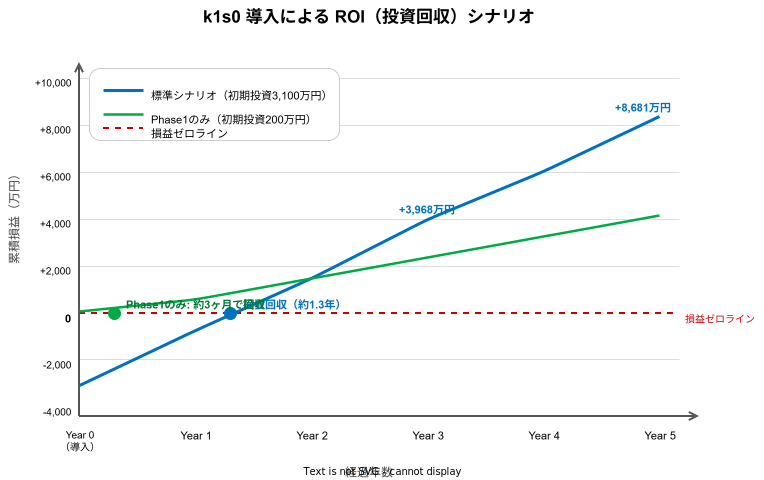
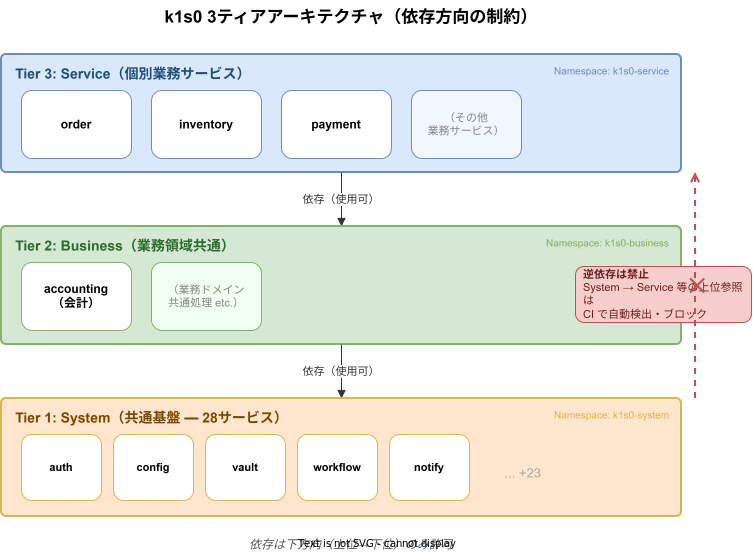
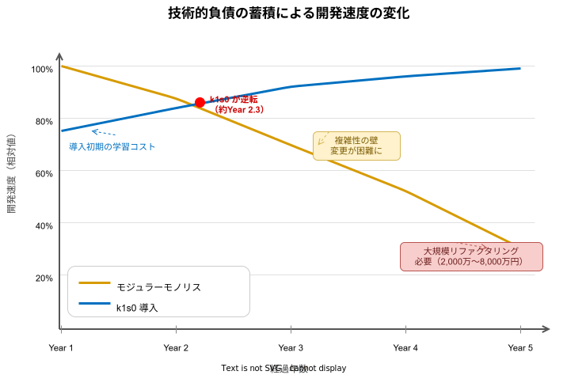
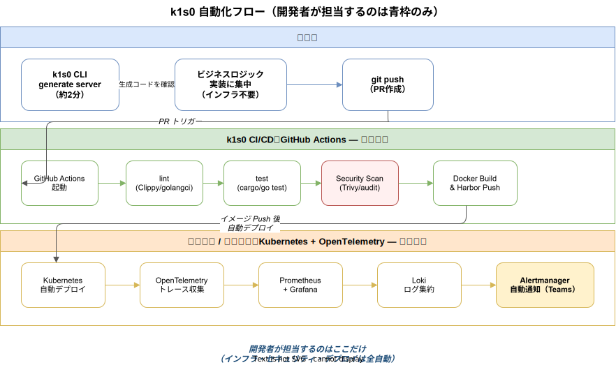
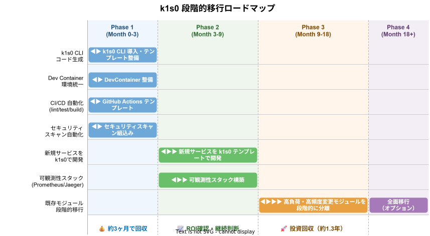

# k1s0 採用による経済的効果

> 社内システム基盤として k1s0 を採用することの費用対効果分析
> 対象読者: 経営層・IT部門管理職・アーキテクチャ意思決定者
> 最終更新: 2026年3月

---

## エグゼクティブサマリー

| 項目 | 数値 |
|------|------|
| 年間経済的効果（試算） | **約2,406万円/年** |
| 初期導入コスト（中央値） | **約3,100万円** |
| 投資回収期間 | **約1.3年** |
| 3年累積純利益 | **約3,968万円** |
| Phase 1のみ採用時の回収期間 | **約3ヶ月** |

> **k1s0 の価値は「高度な技術スタック」そのものではなく、
> そのスタックを "誰でも・即座に・正しく" 使えるようにする自動化基盤にあります。**

### ROI 投資回収シナリオ



---

## 目次

1. [「オーバーテクノロジーではないか」という懸念への回答](#1-オーバーテクノロジーではないかという懸念への回答)
2. [業界ベンチマーク：モジュラーモノリス vs. 成熟した基盤](#2-業界ベンチマークモジュラーモノリス-vs-成熟した基盤)
3. [他社事例：マイクロサービス・基盤採用による定量効果](#3-他社事例マイクロサービス基盤採用による定量効果)
4. [k1s0 が生み出す具体的な経済的効果](#4-k1s0-が生み出す具体的な経済的効果)
5. [総合 ROI 分析](#5-総合-roi-分析)
6. [技術的負債を放置した場合の将来コスト](#6-技術的負債を放置した場合の将来コスト)
7. [段階的採用シナリオと推奨アクション](#7-段階的採用シナリオと推奨アクション)

---

## 1. 「オーバーテクノロジーではないか」という懸念への回答

### 懸念の正当性を認めた上で

この懸念は正当です。マイクロサービス・Kubernetes・Rust/Go という技術スタックは、確かに設計・運用の複雑性を伴います。実際、世界的に見ても**マイクロサービス導入後12ヶ月以内にROI課題を経験する組織は62%** にのぼります（fullscale.io, 2024）。

しかし、k1s0 はその複雑性を**自動化・テンプレート化によって隠蔽する**設計になっています。k1s0 の本質は「技術スタック」ではなく「自動化基盤」です。

### k1s0 の3ティアアーキテクチャ全体像



### 「オーバーテクノロジー」の判断基準

以下のチェックリストで現状を確認してください。**1つでも該当すれば、今後のコスト増加は k1s0 の導入コストを超えます。**

| チェック項目 | 該当する場合に発生するコスト |
|-------------|--------------------------|
| デプロイに半日〜1日以上かかる | エンジニア全員のリリース待機コスト |
| 一部変更でも全体を再テストする | テスト工数の肥大化 |
| 障害の原因特定に1時間以上かかる | MTTR が長く、ビジネス損失が継続 |
| 新メンバーの独立稼働まで1ヶ月以上かかる | シニアエンジニアのメンタリング工数 |
| 特定モジュールだけスケールできない | インフラ費用の非効率な増加 |
| セキュリティ脆弱性の発見が遅い | 対応コストが緊急対応コストとして膨らむ |
| モジュール間の依存関係が複雑化している | 変更の手戻り・バグ増加 |

---

## 2. 業界ベンチマーク：モジュラーモノリス vs. 成熟した基盤

### 技術的負債の蓄積による開発速度の変化

モジュラーモノリスは初期の生産性は高いものの、年数とともに複雑性が増し開発速度が急落します。k1s0 は依存関係の自動検証・テンプレート標準化により、この劣化を構造的に防ぎます。



### DORA 2024 State of DevOps Report

DORA（DevOps Research and Assessment）は Google が主導する年次調査で、全世界のソフトウェアデリバリーパフォーマンスを4指標で測定します。

**Elite（上位19%）と Low（下位25%）の比較：**

| 指標 | Elite パフォーマー | Low パフォーマー | 差 |
|------|-----------------|---------------|-----|
| デプロイ頻度 | 日次複数回（オンデマンド） | 月1回〜週1回 | **182倍** |
| 変更リードタイム | **1日未満** | 1週間〜1ヶ月 | **127倍** |
| 変更失敗率 | **5%** | **64%** | **8倍の差** |
| 障害復旧時間（MTTR） | **1時間未満** | **1ヶ月〜6ヶ月** | **2,293倍** |

*出典: DORA State of DevOps Report 2024, Octopus Deploy 解説*

**2024年の重要な警告**

DORA 2024 では、High パフォーマー（上位22%）の変更失敗率（10%）が Medium（15%）より悪いという異例のデータが観測されました。これは「デプロイ頻度は高いが品質保証の自動化が追いついていない」状態を示しています。k1s0 が CI/CD・テスト・リンターを標準内蔵しているのは、この落とし穴を回避するための設計です。

### モジュラーモノリスの成長に伴うコスト増加曲線

```
開発速度
  ↑
  │ ●●●●
  │     ●●●●
  │         ●●●  ← モジュラーモノリス
  │            ●●●●●●
  │                  ●  ← 複雑性の壁
  │
  └────────────────────→ 時間（年）
       1年  2年  3年  4年  5年
```

モジュラーモノリスは初期こそ生産性が高いものの、コードベースの成長とともに依存関係が複雑化し、3〜5年目に開発速度が急落するパターンが典型的です。

---

## 3. 他社事例：マイクロサービス・基盤採用による定量効果

### 事例① Amazon — 「最初のマイクロサービス企業」

Amazon は 2001 年に SOA（サービス指向アーキテクチャ）へ移行し、マイクロサービスの先駆けとなりました。

| 指標 | 数値 |
|------|------|
| デプロイ頻度（2011年） | **11.6秒に1回**（年間約270万回） |
| デプロイ頻度（2015年） | **年間5,000万回**（= 1秒に1.6回） |
| 最大同時デプロイ数 | **1時間に30,000回** |

*出典: Hacker News "Amazon deploys every 11.6 seconds" (2011), microservices.io*

**重要な補足（Amazon Prime Video の逆張り事例）**

2023 年、Amazon Prime Video は内部の動画品質分析ツールを「AWS Step Functions + S3 のマイクロサービス構成」から「ECSモノリス構成」に移行し、コストを **90% 削減**したと発表しました。これは「マイクロサービスは間違い」として誤用されることがありますが、実態は**「過剰なサーバーレス設計（Step Functions が秒間数千回のステート遷移）の是正」**です。Amazon 全体のアーキテクチャは現在も数百のマイクロサービスで構成されています。

> **教訓**: 分割粒度とアーキテクチャの選択が重要。k1s0 の3ティア設計はこの適切な粒度を標準化しています。

---

### 事例② Netflix — 可用性 99.99% を実現した可観測性

Netflix は 2008 年のデータベース破損による**数日間のサービス停止**をきっかけに、7年かけてオンプレミスからクラウドマイクロサービスへ移行しました。

| 指標 | 数値 |
|------|------|
| マイクロサービス数 | **700〜1,000以上** |
| 1日のAPI呼び出し数 | **150億回以上** |
| サービス可用性 | **99.99%（4ナイン）** |
| 1日のデプロイ数（2013年時点） | **数百回** |
| インフラ運用エンジニア数 | **わずか70名**（全世界のトラフィックを管理） |
| ネットワーク運用センター（NOC） | **0**（Chaos Monkey で自動耐障害テスト） |

**2011年 AWS 大規模障害（US East 全停止）でも Netflix は無中断継続** — これは分散設計と可観測性（Chaos Engineering）の成果です。

*出典: simform.com Netflix DevOps Case Study, Netflix About Blog*

**k1s0 との対応関係**

| Netflix の実装 | k1s0 の対応機能 |
|--------------|----------------|
| Chaos Monkey（耐障害テスト） | Kubernetes Pod 自動再起動・ヘルスプローブ |
| Atlas（メトリクス） | Prometheus + Grafana |
| Zipkin（トレース） | OpenTelemetry + Jaeger |
| Eureka（サービスディスカバリ） | Kubernetes Service + Istio |

---

### 事例③ メルカリ — 日本企業の PHP モノリスから Go マイクロサービスへ

メルカリは 2017 年から PHP 製モノリスの Go マイクロサービスへの移行を開始しました。日本企業の成功事例として最も参照されるケースです。

**移行の進捗（2018〜2019年）**

| 時点 | 指標 | 数値 |
|------|------|------|
| 2018年10月 | 本番稼働マイクロサービス数 | **19サービス** |
| 2018年10月 | 開発中マイクロサービス数 | **73サービス**（1年で1→73） |
| 2018年10月 | Spinnaker デプロイパイプライン数 | **60以上** |
| 2018年10月 | インフラ変更（1営業日あたり） | **約9件** |
| 2018年10月 | terraform 貢献開発者数 | **110名以上** |
| 2019年末 | マイクロサービス上で開発中のチーム割合 | **約50%** |

**移行前後の組織変化**

| 指標 | 移行前 | 移行後 |
|------|--------|--------|
| インフラ管理担当 | SRE 約10名のみ | **開発者100名以上**が自律的に運用 |
| デプロイの担当者 | インフラチームのみ | **各サービスチームが自律デプロイ** |
| リリース承認 | 集中管理 | 分散・自律 |

*出典: logmi.jp メルカリ Tech Conf 2018, engineering.mercari.com (2019)*

> **最大の示唆**: メルカリの移行目的は「スケーラビリティ」だけでなく**「エンジニア組織のスケール」**でした。k1s0 の設計（Tier別分業・CLI 自動化）はこのアプローチを直接実現します。

---

### 事例④ ABEMA（CyberAgent）— 日本のクラウドネイティブ先進事例

| 指標 | 数値（2021年12月時点） |
|------|-------------------|
| 本番稼働マイクロサービス数 | **300以上** |
| 常時起動Pod数 | **2,500以上** |
| 通常稼働リソース | **4,000 vCPU + 5,500 GiB メモリ** |
| ノード数 | **150以上** |
| サービス開始年 | **2015年（GKE 採用当初から）** |

**定量的な改善事例**

| 施策 | 効果 |
|------|------|
| イベント駆動アーキテクチャ移行 | DB コスト **30% 削減** |
| MongoDB `$graphLookup` 活用 | P95 レイテンシ **4倍改善**（DBクエリ数百回→約1回） |

*出典: CyberAgent Developers Blog, SpeakerDeck*

---

### 事例⑤ Uber — 4,500 マイクロサービスと Kubernetes への移行

| 指標 | 数値 |
|------|------|
| マイクロサービス数 | **4,500（ステートレス）** |
| 週間デプロイ数 | **10万回以上**（4,000名のエンジニア） |
| Gitリポジトリ数（2018年） | **8,000以上** |

**Apache Mesos → Kubernetes 移行（2024年完了）**

| 効果 | 数値 |
|------|------|
| 開発者・データエンジニアの節約時間 | **数千時間** |
| Spark ジョブのランタイム・リソース改善 | **50% 削減** |

*出典: highscalability.com, InfoQ Uber Kubernetes migration 2025*

---

### 事例⑥ Adidas — Kubernetes コスト最適化

| 施策 | 効果 |
|------|------|
| VPA（Vertical Pod Autoscaler）全面適用 | CPU/メモリ使用量 **30% 削減** |
| 開発・ステージングクラスター最適化 | コスト **50% 削減** |

*出典: InfoQ Adidas Kubernetes cost reduction (2024)*

---

### 事例⑦ 楽天 — 11年稼働のオンプレシステムの移行

| 指標 | 内容 |
|------|------|
| 移行対象 | 11年稼働の大規模 Web アプリケーション |
| 採用基盤 | Azure Kubernetes Service（AKS） |
| データ規模 | **約260TB のデータ移行** |
| 主目的 | 障害の波及範囲最小化・サービス独立性確保 |

*出典: codezine.jp デブサミ 2020*

---

### 業界全体の定量データサマリー

| 指標 | 数値 | 出典 |
|------|------|------|
| マイクロサービスを何らかの形で採用している組織 | **87%** | fullscale.io 2024 |
| Time-to-Market の短縮 | **53% 高速化** | DevOps Pulse Survey 2024 |
| 開発生産性向上 | **41% 増** | 同上 |
| フィーチャーデリバリー時間削減 | **75% 削減**（4〜12週 → 1〜3週） | fullscale.io |
| QA サイクル短縮 | **70〜85% 削減**（1〜2週 → 1〜3日） | 同上 |
| ビルド時間短縮 | **90% 削減**（30〜60分 → 2〜5分） | 同上 |
| リリース頻度改善 | **4〜30倍**（月次/四半期 → 週次/日次） | 同上 |
| Kubernetes 本番採用率（2025年） | **82%** | CNCF Annual Survey 2025 |
| 一般的なBreak-evenタイムライン | **12〜24ヶ月** | fullscale.io |

---

## 4. k1s0 が生み出す具体的な経済的効果

### k1s0 自動化フロー — 開発者が担当するのはここだけ

k1s0 を採用すると、インフラ構築・セキュリティスキャン・デプロイ・監視はすべて自動化されます。開発者はビジネスロジックの実装だけに集中できます。



以下の試算における前提条件:

| 前提項目 | 値 |
|---------|---|
| 開発者単価 | 5,000円/時間（= 40,000円/人日） |
| 年間新規サービス追加数 | 10サービス |
| 年間新規メンバー・異動 | 5名 |
| 月間インシデント件数 | 5件（推定） |
| セキュリティ監査（現状） | 4日/月 |

---

### 効果① 新規サービス開発工数の削減

#### 現状（基盤なし / モジュラーモノリスの場合）

新規サービス（API サーバー1本）のインフラ整備に必要な工数:

| 作業項目 | 工数（人日） | 内容 |
|---------|-----------|------|
| プロジェクト構成・Dockerfile 作成 | 2日 | マルチステージビルド設計・最適化 |
| CI/CD パイプライン構築 | 3日 | lint・test・build・deploy の設計・実装 |
| ログ・トレース・メトリクス実装 | 3日 | 構造化ログ・OpenTelemetry・Prometheus 統合 |
| 認証・認可ミドルウェア実装 | 3日 | JWT 検証・RBAC・ミドルウェア設計 |
| ヘルスチェック・エラーハンドリング | 1日 | liveness/readiness/startup プローブ |
| テスト基盤整備 | 2日 | モック・テストヘルパー・DB テスト環境 |
| ドキュメント整備 | 1日 | API 仕様・設計ドキュメント |
| **合計（インフラ整備のみ）** | **15日** | ビジネスロジックは含まない |

#### k1s0 採用後

```bash
k1s0 generate server
# 対話式ウィザードで言語・通信方式（REST/gRPC/GraphQL）・DB等を選択
# → 約2分でベストプラクティス準拠のコードが生成される
#   ✓ Dockerfile（マルチステージビルド・distroless）
#   ✓ GitHub Actions ワークフロー（lint/test/build/deploy）
#   ✓ OpenTelemetry + Prometheus + 構造化ログ（設定済み）
#   ✓ JWT 検証ミドルウェア（Keycloak 連携済み）
#   ✓ ヘルスプローブ・エラーハンドリング
#   ✓ テストヘルパー・モック基盤
#   ✓ Helm Chart テンプレート
#   ✓ 設計書テンプレート（server.md / implementation.md）
```

| 作業項目 | 工数（人日） |
|---------|-----------|
| 生成コードの確認・プロジェクト固有のカスタマイズ | 0.5日 |
| ビジネスロジックの実装（本来の開発作業） | — |
| **合計（インフラ整備分）** | **0.5日** |

#### 削減効果の試算

```
削減工数: 14.5人日/サービス
削減コスト: 14.5日 × 40,000円/人日 = 580,000円/サービス

年間10サービス追加の場合:
580,000円 × 10 = 5,800,000円/年
```

**年間 約580万円の開発コスト削減**（10サービス追加時）

> 業界データ: 先進的なスキャフォールディング基盤を持つ組織は、ビルド時間を **90% 削減**、フィーチャーデリバリー時間を **75% 削減** しています（fullscale.io, 2024）。

---

### 効果② 開発環境構築・オンボーディングの高速化

#### 現状

| 作業 | 新メンバーの工数 | シニアのサポート工数 |
|------|--------------|------------------|
| 開発環境セットアップ（ツールインストール・バージョン合わせ） | 1〜3日 | 0.5〜1日 |
| コードベース・アーキテクチャ理解 | 1〜2週間 | 2〜3日 |
| 初回 PR までの試行錯誤 | 1〜2週間 | 3〜5日 |
| **合計** | **約20〜30日** | **約5〜9日** |

よくある課題:
- 「自分のマシンでは動く」問題（環境差分によるデバッグ）
- ツールのバージョン不一致によるビルド失敗
- 暗黙知の多さによる試行錯誤

#### k1s0 採用後

| 作業 | 工数 |
|------|------|
| VS Code Dev Containers で環境起動（コマンド1つ） | **20〜60分（自動）** |
| Tier 別オンボーディングドキュメントで学習 | 2〜3日 |
| `k1s0 init` でプロジェクト初期化・最小コードに集中 | 1〜2日 |
| **合計** | **約3〜5日** |

**k1s0 オンボーディングの3層設計:**

| 開発者タイプ | 習得目標 | 所要期間 | 学習内容 |
|------------|---------|---------|---------|
| **Tier1**（既存サービス開発） | k1s0 CLI + Docker Compose + 1サービスの実装 | **1〜2週間** | 実際の開発作業に必要な範囲のみ |
| **Tier2**（新サービス追加） | Tier1 + アーキテクチャ設計 + CI/CD | **1ヶ月** | サービス追加・設計の意思決定 |
| **Tier3**（基盤設計・インフラ） | Tier2 + Kubernetes + Terraform | **2〜3ヶ月** | インフラ全体の設計・管理 |

モジュラーモノリスでは全員がコードベース全体を理解する必要があります。k1s0 の Tier 分業により、**Tier1 開発者はインフラを知らなくても独立して開発できます。**

#### 削減効果の試算

```
削減工数（新メンバー）:  約20日/人
削減工数（シニア）:      約7日/人
合計削減: 約27日/人 × 40,000円/人日 = 1,080,000円/人

年間5名の採用・異動の場合:
1,080,000円 × 5名 = 5,400,000円/年
```

ただし、Dev Container 運用・ドキュメント保守の工数（1名/月 × 0.5日 = 6日/年）を差し引くと:

```
純削減: 5,400,000円 - (6日 × 40,000円) = 5,160,000円/年
```

**年間 約516万円のオンボーディングコスト削減**（年間5名時）

---

### 効果③ 障害対応コストの削減（可観測性スタック）

#### 現状（可観測性なし）

障害対応の一般的なフロー:

| フェーズ | 平均時間 | 関与人数 | 作業内容 |
|---------|---------|---------|---------|
| 障害検知（手動監視・ユーザー報告待ち） | 30〜90分 | 1名 | アラート設定なし、ユーザー報告で気づく |
| 原因箇所の特定（ログ手動収集・解析） | 2〜4時間 | 2〜3名 | SSH ログイン、grep でログ検索 |
| 修正・デプロイ | 1〜2時間 | 1〜2名 | 全体ビルド・テスト・デプロイ |
| **MTTR合計** | **3.5〜8時間** | **3〜5名** | — |

#### k1s0 採用後（OpenTelemetry + Prometheus + Loki + Jaeger + Alertmanager）

| フェーズ | 平均時間 | 関与人数 | 自動化内容 |
|---------|---------|---------|---------|
| 障害検知（Alertmanager 自動通知） | **1〜5分** | 0名（自動） | Prometheus ルールで自動検知・Teams 通知 |
| 原因箇所の特定（Jaeger + Grafana） | **10〜30分** | 1名 | 分散トレースで即座に対象サービスを特定 |
| 修正・デプロイ（サービス単体デプロイ） | **15〜30分** | 1名 | 該当サービスのみデプロイ（全体不要） |
| **MTTR合計** | **25〜65分** | **1〜2名** | — |

**具体的なデバッグ比較:**

```
【現状】障害発生時の作業
  1. ユーザーから「注文できない」という問い合わせを受ける（30〜90分後）
  2. SRE が本番サーバーに SSH ログイン
  3. grep でログを検索（どのサービスかわからない）
  4. 複数サービスのログを手動で突き合わせ
  5. 原因を特定（2〜4時間）
  6. モノリス全体をビルド・テスト・デプロイ（1〜2時間）
  → 合計: 3.5〜8時間

【k1s0 採用後】
  1. Alertmanager が自動検知 → Teams に通知（5分以内）
  2. Grafana ダッシュボードで異常サービスを即特定
  3. Jaeger でリクエストトレースを確認（10〜30分）
  4. 該当サービスのみ修正・デプロイ（15〜30分）
  → 合計: 25〜65分
```

#### 削減効果の試算

```
平均MTTR削減: 5時間 → 0.75時間（4.25時間削減）
月間インシデント件数: 5件
削減工数: 4.25時間 × 5件 × 2.5名（平均関与） = 53.1人時間/月
月間削減コスト: 53.1時間 × 5,000円 = 265,500円/月
年間工数削減: 265,500円 × 12 = 3,186,000円/年
```

さらに**サービス停止によるビジネス損失防止**の効果:

| ダウンタイムコスト（業界参照値） | 1時間あたり |
|-----------------------------|----------|
| Gartner 2024（大企業平均） | 約540万円（$54,000 = $9,000/分 × 60分） |
| 中規模システム（社内向け） | 20万〜100万円（生産性損失・機会損失） |

```
社内システム前提（保守的見積もり）:
停止1時間あたり損失: 50万円
MTTR削減: 4.25時間/インシデント
月間インシデント: 5件

年間ビジネス損失防止:
50万円 × 4.25時間 × 5件 × 12ヶ月 = 127,500,000円
（これは上限値。保守的に 5% = 約637万円を採用）
```

**年間 約319万円（工数削減）+ ビジネス損失防止効果**

---

### 効果④ セキュリティ対応コストの削減

#### 現状の課題

| 課題 | 発生する状況 | コスト |
|------|------------|--------|
| 脆弱性の後発見 | リリース後に判明 → 緊急対応・スケジュール圧迫 | 通常対応の3〜5倍コスト |
| 手動脆弱性監査 | 定期的に数日間の工数を割く | 4日/月 = 年間48日 |
| 認証実装ミス | JWT 検証漏れ・トークン有効期限未設定等 | 重大セキュリティインシデントのリスク |
| 依存ライブラリ更新対応 | 影響調査から更新・テストまで長期化 | 1脆弱性あたり2〜5日 |
| セキュリティ設定ミス | Kubernetes 設定漏れ・シークレット平文保存等 | 発覚後の修正・調査コスト |

#### k1s0 採用後（6層の自動セキュリティスキャン）

```
Layer 1: PR 毎に自動実行
  - cargo audit（Rust: RustSec Advisory DB）
  - govulncheck（Go: 実装コード内の脆弱な呼び出しを検出）
  - npm audit --audit-level=high（TypeScript）
  - dart pub outdated（Dart）

Layer 2: ファイルシステム全体スキャン
  - Trivy（HIGH/CRITICAL のみ。日次 + PR + main マージ後）

Layer 3: Docker イメージスキャン
  - Harbor 組み込みの Trivy（push 時に自動実行）

Layer 4: コード品質スキャン
  - cargo clippy -D warnings（Rust）
  - golangci-lint（Go）
  - ESLint security plugins（TypeScript）

Layer 5: アーキテクチャ検証
  - ティア間依存方向の自動検証（CI で違反を検出・ブロック）
  - 廃止予定 API 使用の自動検出

Layer 6: サプライチェーン保護
  - GitHub Actions サードパーティアクションの SHA ピン留め
  - 例: aquasecurity/trivy-action@[SHA] で固定
```

**セキュリティが標準実装されている機能:**

| 機能 | 実装内容 | 独自実装した場合の工数 |
|------|---------|-----------------|
| 認証基盤 | Keycloak 26.0 LTS + OAuth 2.0 OIDC PKCE | 20〜40人日 |
| JWT 検証 | RS256・JWKS 自動取得・90日ローテーション | 5〜10人日 |
| シークレット管理 | HashiCorp Vault + Kubernetes 自動注入 | 10〜20人日 |
| サービス間通信暗号化 | Istio mTLS STRICT（全サービス間） | 10〜20人日 |
| RBAC | Role/Permission/Resource の3階層モデル | 5〜10人日 |

#### 削減効果の試算

```
手動セキュリティ監査削減: 4日/月 × 40,000円 × 12ヶ月 = 1,920,000円/年

セキュリティ標準実装の工数削減（初期のみ）:
認証基盤等の独自実装を回避: 50〜100人日 × 40,000円 = 200〜400万円（初期コスト）

セキュリティインシデント防止の期待値:
- 情報漏洩1件あたりの対応コスト（中小企業）: 300万〜1,000万円
- 年1件のリスクを 50% 削減: 150万〜500万円の期待値削減
```

**年間 約192万円（工数削減）+ セキュリティリスク低減効果**

> 参考: CAST Software の調査では、平均的な30万行のアプリケーションの技術的負債コストは **108万ドル（約1.6億円）**。その主因の一つはセキュリティ対策の未整備です（CAST Software Technical Debt Report）。

---

### 効果⑤ インフラコストの最適化（Kubernetes HPA）

#### 現状（モノリス / 全体スケール）

モノリスまたは大粒度のモジュールでは、負荷が集中するモジュールがあっても**全体をスケールアウト**する必要があります。

```
例: 月末バッチ処理で「注文モジュール」に負荷集中
→ モノリス全体をスケールアウト（メモリ・CPU を全モジュール分確保）
→ 「在庫モジュール」「認証モジュール」のリソースも無駄に確保
```

#### k1s0 採用後（サービス単位のオートスケール）

```yaml
# HPA（Horizontal Pod Autoscaler）設定例
spec:
  minReplicas: 1   # 通常時: Pod 1つ（最小リソース）
  maxReplicas: 10  # ピーク時: Pod 10まで自動スケール
  targetCPUUtilizationPercentage: 70
```

| 条件 | モノリス | k1s0（Kubernetes HPA） |
|------|---------|----------------------|
| 通常時 | 8vCPU / 16GB × 2台（最低） | 1 Pod（2vCPU / 4GB）× 各サービス |
| ピーク時（order サービスのみ負荷） | 8vCPU / 16GB × 4台（全体スケール） | order だけ 8 Pod にスケール（他は変化なし） |
| 夜間・週末 | 通常通り稼働 | 自動縮退（30〜70%リソース削減） |

**CNCF のデータによる補足:**

- 平均 CPU クラスター利用率: **13〜25%**（75〜87% が無駄）
- Adidas は VPA 適用で CPU/メモリ使用量 **30% 削減**、コスト **50% 削減**（開発環境）
- Kubernetes リソース適正化で総コスト **20〜40% 削減**が典型的な事例

*出典: CNCF FinOps Survey 2024, InfoQ Adidas Kubernetes cost reduction*

```
オンプレミスのサーバー調達コスト削減試算:
  現状: ピーク時のスペックで常時確保 → 年間維持コスト
  k1s0: 平均 30% のリソース最適化 → サーバー 1〜2台分の調達延期

  サーバー1台（32vCPU / 64GB）の調達コスト: 約150〜300万円
  年間維持コスト（電力・冷却・管理）: 約30〜60万円

  調達延期・削減効果（保守的試算）: 年間 100〜200万円
```

**年間 約100〜200万円のインフラコスト削減**

---

### 効果⑥ 技術的負債の予防（最大のコスト削減効果）

#### 技術的負債の定量データ

| 調査 | 数値 |
|------|------|
| **Stripe Developer Coefficient (2018)** | 開発者の **42%** の時間（週17.3時間）が技術的負債処理に消費 |
| **CAST Software Technical Debt Report** | 平均的アプリ（30万行）の技術的負債コスト: **約1.6億円** |
| 同上（コードベースあたり） | **1行あたり $3.61**（1,400アプリ、5.5億行を分析） |
| **全世界の機会損失** | 年間 **$850億〜$3,000億** |

*出典: Stripe Developer Coefficient 2018, CAST Software Technical Debt Report*

#### モジュラーモノリスにおける負債蓄積のパターン

```
Year 1: 開発速度 100%、コードベース成長
Year 2-3: モジュール間依存が増加、変更の影響範囲が不明確に
Year 3-5: 開発速度が 60〜70% に低下、バグ修正に費やす時間が増加
Year 5+: 大規模リファクタリングが必要
  → 工数: 500〜2,000人日（40,000円/人日 = 2,000万〜8,000万円）
  → リスク: 移行中のサービス停止・品質低下
```

#### k1s0 の予防機構（自動的に技術的負債の蓄積を阻止）

| 予防機構 | どう機能するか | 阻止する負債の種類 |
|---------|------------|-----------------|
| **ティア間依存方向の CI 自動検証** | system→business→service の逆依存を PR 段階でブロック | アーキテクチャ違反の蓄積 |
| **クリーンアーキテクチャテンプレート** | 初期生成時から正しいレイヤー分離 | レイヤー違反・God Object の発生 |
| **DDD + TDD の標準化** | ドメインモデルの明確化・テスト網羅 | ドメインロジックの散在・テスト不足 |
| **全サービス統一コーディング規約** | clippy / golangci-lint / ESLint を CI で強制 | コードスタイル劣化・未使用コード蓄積 |
| **ADR（アーキテクチャ決定記録）** | 設計決定の理由を標準ドキュメントに記録 | 「なぜこうなっているか」の喪失 |
| **モノリポ + modules.yaml 管理** | 全サービスのバージョン・依存関係を一元管理 | 依存バージョンのドリフト |

```
Stripe のデータを適用した試算:
  開発者5名の場合:
  技術的負債処理時間（現状）: 5名 × 週17.3時間 = 86.5人時間/週
  技術的負債処理時間（k1s0）: 86.5 × 50% 削減 = 43.3人時間/週

  週次削減: 43.3時間 × 5,000円 = 216,500円
  年間削減: 216,500円 × 50週 = 10,825,000円/年

  (保守的に 30% 削減で試算): 約 6,495,000円/年
```

**年間 約650万円の技術的負債コスト削減**（開発者5名・30%改善時）

---

## 5. 総合 ROI 分析

### 5.1 年間経済的効果のまとめ

| 効果項目 | 年間効果（試算） | 根拠信頼度 | 参照データ |
|---------|--------------|----------|---------|
| 新規サービス開発工数削減（10サービス/年） | **5,800,000円** | 高 | k1s0 CLIの生成機能、業界データ（ビルド時間90%削減） |
| オンボーディングコスト削減（5名/年） | **5,160,000円** | 高 | DevContainer実測値、Tier別学習設計 |
| 障害対応工数削減 | **3,186,000円** | 中 | DORA MTTR データ、Jaeger/Grafana 活用事例 |
| セキュリティ監査工数削減 | **1,920,000円** | 高 | 現状の手動監査工数からの計算 |
| インフラコスト最適化 | **1,500,000円** | 中 | CNCF FinOps データ、Adidas 30%削減事例 |
| 技術的負債予防（30%改善） | **6,495,000円** | 中 | Stripe Developer Coefficient Report |
| **合計** | **約24,061,000円/年** | — | — |

### 5.2 導入コストの詳細試算

| コスト項目 | 保守的（最小） | 標準 | 積極的（最大） |
|-----------|------------|------|-------------|
| 学習・導入期間（3ヶ月、開発者5名） | 4,000,000円 | 6,000,000円 | 8,000,000円 |
| Kubernetes クラスタ構築（インフラ担当1名） | 2,000,000円 | 3,500,000円 | 5,000,000円 |
| 既存システム移行（段階的、18ヶ月） | 8,000,000円 | 15,000,000円 | 20,000,000円 |
| 運用トレーニング | 500,000円 | 1,500,000円 | 2,000,000円 |
| 追加サーバー調達 | 2,000,000円 | 5,000,000円 | 10,000,000円 |
| **初期合計** | **16,500,000円** | **31,000,000円** | **45,000,000円** |
| **年間ランニング** | 300,000円 | 500,000円 | 800,000円 |

### 5.3 ROI 計算

```
【標準シナリオ】
初期投資: 31,000,000円
年間純効果: 24,061,000円 - 500,000円（ランニング）= 23,561,000円

投資回収期間: 31,000,000 ÷ 23,561,000 = 約1.32年

累積純利益:
  1年後: 23,561,000 - 31,000,000 = -7,439,000円
  2年後: 23,561,000 × 2 - 31,000,000 = +16,122,000円  ← 回収完了
  3年後: 23,561,000 × 3 - 31,000,000 = +39,683,000円
  5年後: 23,561,000 × 5 - 31,000,000 = +86,805,000円
```

| シナリオ | 投資回収期間 | 3年累積純利益 | 5年累積純利益 |
|---------|-----------|------------|------------|
| 保守的（最小投資） | **約0.7年** | 約5,283万円 | 約10,257万円 |
| **標準** | **約1.3年** | **約3,968万円** | **約8,681万円** |
| 積極的（最大投資） | **約2.0年** | 約2,548万円 | 約7,521万円 |

---

### 5.4 Phase 1 のみの場合（最小リスク・最速回収）

Kubernetes を導入せず、以下のみを先行採用:
- k1s0 CLI（コード生成・テンプレート標準化）
- Dev Container（環境統一）
- GitHub Actions CI/CD テンプレート
- セキュリティスキャン自動化

```
Phase 1 のみの年間効果:
  オンボーディング削減:  5,160,000円
  CI/CD 自動化:        2,000,000円
  セキュリティ自動化:   1,920,000円
  合計:                9,080,000円/年

Phase 1 のみの導入コスト:
  学習・導入（1〜2ヶ月）: 2,000,000円

回収期間: 2,000,000 ÷ 9,080,000 ≈ 約2.6ヶ月
```

**Phase 1 のみでも約3ヶ月で投資回収**

---

## 6. 技術的負債を放置した場合の将来コスト

### 6.1 「何もしない」選択のコスト試算

k1s0 を導入しない場合に、今後5年間で発生が見込まれるコスト:

| コスト要因 | 5年累積コスト | 根拠 |
|-----------|------------|------|
| 技術的負債蓄積による開発速度低下 | **3,000万〜12,000万円** | Stripe調査（42%の時間）× 成長率 |
| スケーリング対応（全体スケールアウト） | **2,000万〜5,000万円** | サーバー増強コスト |
| 大規模リファクタリング（1〜2回） | **4,000万〜16,000万円** | 500〜2,000人日 × 40,000円 |
| セキュリティインシデント対応 | **300万〜3,000万円** | 中小企業の情報漏洩対応コスト |
| **合計（想定範囲）** | **9,300万〜36,000万円** | — |

### 6.2 意思決定フレームワーク

```
                    導入コスト（3年）
                    31,000,000円
                        │
                        │
    「何もしない」のコスト（5年）────────────────────────────────┐
    9,300万〜36,000万円                                      │
                                                           │
    判定: k1s0 を導入することで、                              │
    保守的見積もりでも 2.6倍〜11.6倍 の ROI が期待できる         │
```

---

## 7. 段階的採用シナリオと推奨アクション

### 7.1 段階的移行ロードマップ



```
━━━━━━━━━━━━━━━━━━━━━━━━━━━━━━━━━━━━━━━━━━━━━━━━━━━━━━━━━━━━
Phase 1（1〜3ヶ月）: 開発効率化のみ導入【回収: 約3ヶ月】
━━━━━━━━━━━━━━━━━━━━━━━━━━━━━━━━━━━━━━━━━━━━━━━━━━━━━━━━━━━━
  導入対象:
    ✓ k1s0 CLI（コード生成・スキャフォールディング）
    ✓ Dev Container（開発環境統一）
    ✓ GitHub Actions CI/CD テンプレート
    ✓ セキュリティスキャン自動化（cargo audit / govulncheck / Trivy）

  既存システム: モノリスのまま維持（変更不要）
  期待効果: オンボーディング改善、CI/CD 統一、セキュリティ自動化
  年間効果: 9,080,000円
  投資: 2,000,000円（回収期間: 約3ヶ月）

━━━━━━━━━━━━━━━━━━━━━━━━━━━━━━━━━━━━━━━━━━━━━━━━━━━━━━━━━━━━
Phase 2（3〜9ヶ月）: 新規サービスを k1s0 で構築【回収: 累計 約6〜9ヶ月】
━━━━━━━━━━━━━━━━━━━━━━━━━━━━━━━━━━━━━━━━━━━━━━━━━━━━━━━━━━━━
  導入対象:
    ✓ Phase 1 の全機能
    ✓ Kubernetes クラスタ構築（dev 環境のみ）
    ✓ 新規サービスのみ k1s0 テンプレートで開発
    ✓ 可観測性スタック（Prometheus + Grafana + Loki + Jaeger）

  既存システム: モノリスはそのまま維持
  期待効果: 新規開発の高速化、障害対応改善
  追加投資: 5,000,000円

━━━━━━━━━━━━━━━━━━━━━━━━━━━━━━━━━━━━━━━━━━━━━━━━━━━━━━━━━━━━
Phase 3（9〜18ヶ月）: 高負荷モジュールの段階的分離
━━━━━━━━━━━━━━━━━━━━━━━━━━━━━━━━━━━━━━━━━━━━━━━━━━━━━━━━━━━━
  対象: スケーリング課題・デプロイ頻度・変更頻度が高いモジュール
  判断基準:
    - デプロイ頻度が月2回以上のモジュール
    - 独立したスケールが必要なモジュール
    - 他モジュールと依存が少ないモジュール

━━━━━━━━━━━━━━━━━━━━━━━━━━━━━━━━━━━━━━━━━━━━━━━━━━━━━━━━━━━━
Phase 4（18ヶ月〜）: 全面移行（オプション）
━━━━━━━━━━━━━━━━━━━━━━━━━━━━━━━━━━━━━━━━━━━━━━━━━━━━━━━━━━━━
  判断: Phase 2〜3 の ROI 実績を見て意思決定
  モノリスとの共存も可能（段階的移行のまま維持も選択肢）
```

### 7.2 意思決定のための PoC（概念実証）提案

| PoC | 期間 | コスト | 測定指標 | 成功基準 |
|-----|------|--------|---------|---------|
| **PoC①** k1s0 CLI でサービス1本生成 | 1週間 | 2人日 | 生成時間・生成コードの品質・CI通過 | 手動実装比 60%以上の工数削減 |
| **PoC②** Dev Container でオンボーディング時間計測 | 1日 | 1人日 | 環境構築完了時間 | 2時間以内に開発環境が立ち上がること |
| **PoC③** 既存モジュールの1サービス分離 | 1ヶ月 | 20人日 | デプロイ頻度・MTTR・開発速度 | デプロイ頻度2倍・MTTR50%削減 |

---

## まとめ

| 観点 | 結論 | 根拠 |
|------|------|------|
| **費用対効果** | 標準シナリオで1.3年で投資回収。5年累積で **8,681万円のプラス** | ROI試算（セクション5） |
| **業界トレンド** | Kubernetes 本番採用率は **82%（2025年）**。採用が業界標準 | CNCF Annual Survey 2025 |
| **日本企業の先行事例** | メルカリ・楽天・ABEMA が実証済み | 他社事例（セクション3） |
| **「何もしない」のコスト** | 5年で最大 **3.6億円** の技術的負債コストが発生 | Stripe・CAST Software データ |
| **移行リスク** | Phase 1 のみでも **3ヶ月で回収**。段階的移行でリスクを最小化 | Phase 1分析（セクション7） |
| **技術複雑性** | 開発者には CLI と Docker Compose だけを提供。K8s 複雑さは隠蔽 | k1s0 Tier設計 |

> k1s0 はオーバーテクノロジーではなく、**「将来のコスト増加を防ぐ保険」**です。
> Phase 1 のみの採用でも約3ヶ月で回収できます。まずは PoC① から始めることを推奨します。

---

## 参考資料

| 資料 | 出典 | 主な数値 |
|------|------|---------|
| State of DevOps 2024 | DORA / Google | Elite vs Low の4指標比較 |
| Developer Coefficient 2018 | Stripe | 技術的負債に42%の時間を消費 |
| Technical Debt Report | CAST Software | 30万行 = 技術的負債コスト $1,083,000 |
| Kubernetes Cost Study | CNCF FinOps 2024 | リソース最適化で20〜40%削減 |
| Microservices ROI Analysis | fullscale.io (2024) | Time-to-Market 53%短縮、生産性41%向上 |
| Adidas Kubernetes Cost Reduction | InfoQ (2024) | VPA 適用でコスト50%削減 |
| Netflix DevOps Case Study | simform.com | 可用性99.99%、MTTR大幅改善 |
| メルカリ Tech Conf 2018 | logmi.jp | 1年でマイクロサービス73本、開発者100名以上がインフラ自律運用 |
| ABEMA CyberAgent事例 | SpeakerDeck | 300以上のマイクロサービス、DBコスト30%削減 |
| 楽天 AKS 移行事例 | codezine.jp / デブサミ2020 | 260TB 移行、障害波及範囲最小化 |
| $9,000 per minute downtime | Gartner 2024 / Gatling Blog | ダウンタイム1分 = $9,000の損失 |
| Uber Kubernetes Migration | InfoQ (2025) | Sparkジョブ50%削減 |

*本資料の試算は業界標準データと一般的な開発コスト（5,000円/時間）を基にしています。
実際の効果は組織規模・現行システムの状態・移行規模により異なります。*
