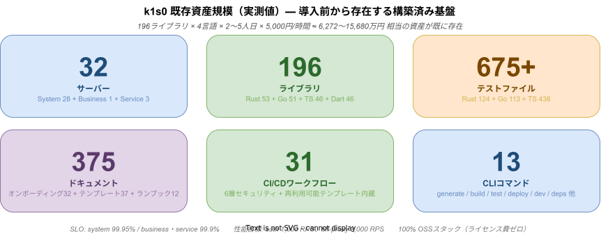
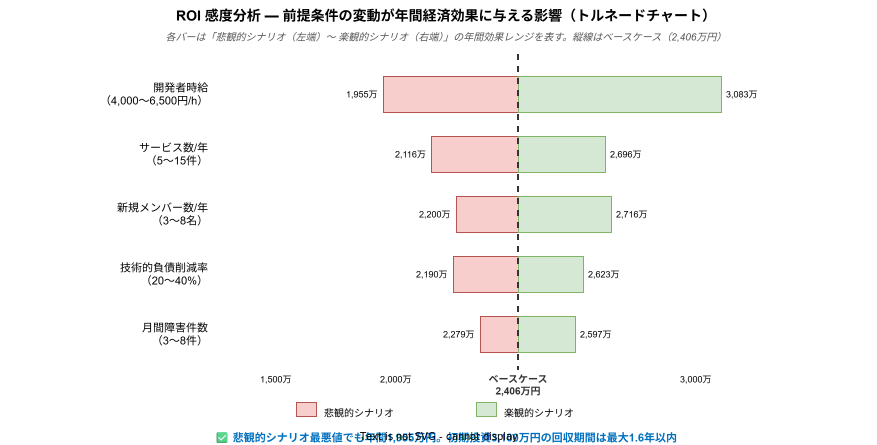
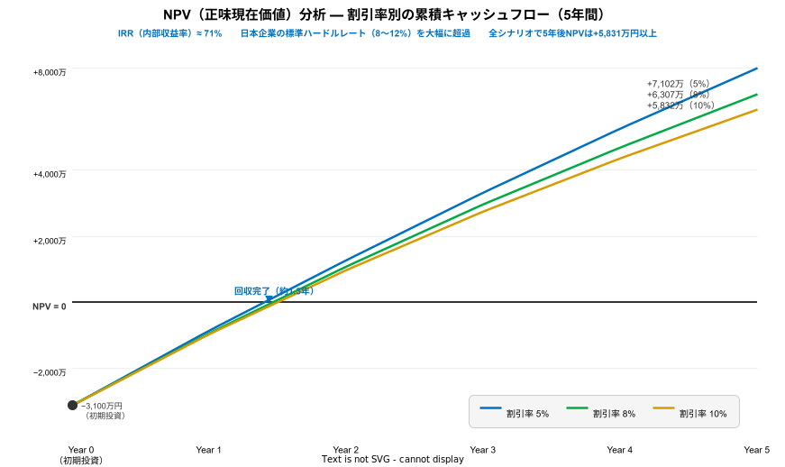
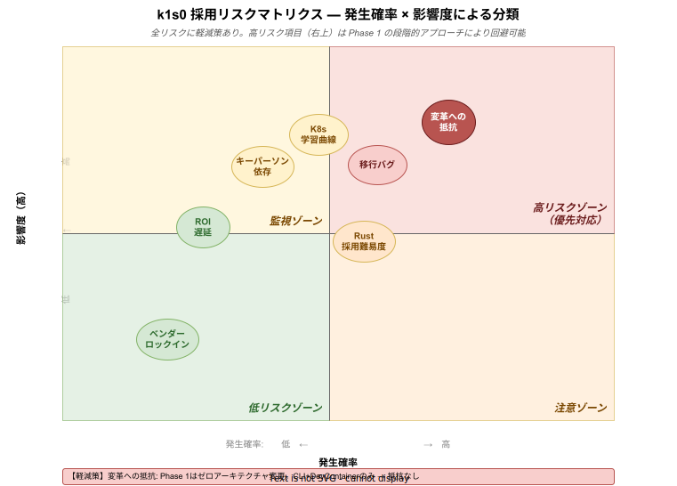
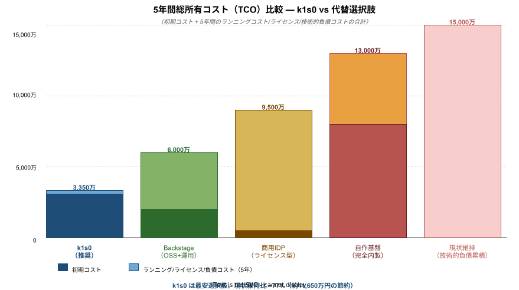
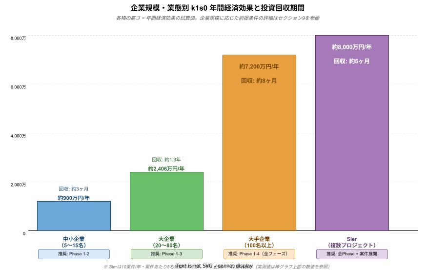

# k1s0 採用による経済的効果

> 社内システム基盤として k1s0 を採用することの費用対効果分析
> 対象読者: 経営層・IT部門管理職・アーキテクチャ意思決定者
> 最終更新: 2026年3月

---

## エグゼクティブサマリー

| 項目 | 数値 |
|------|------|
| 年間経済的効果（試算） | **約2,406万円/年** |
| 初期導入コスト（中央値） | **約3,100万円** |
| 投資回収期間 | **約1.3年** |
| 3年累積純利益 | **約3,968万円** |
| 5年累積 NPV（割引率8%） | **+6,307万円** |
| IRR（内部収益率） | **約71%**（ハードルレート 8〜12% の約 6 倍） |
| Phase 1のみ採用時の回収期間 | **約3ヶ月** |
| k1s0 基盤の推定再構築コスト | **約1.3億〜2.2億円相当**（採用により節約） |
| 5年間 TCO（現状維持比） | **−11,650万円節約**（代替案中最安） |

> **k1s0 の価値は「高度な技術スタック」そのものではなく、
> そのスタックを "誰でも・即座に・正しく" 使えるようにする自動化基盤にあります。**
> すでに 196 ライブラリ・32 サーバー・775+ テストファイルが構築済みであり、
> これをゼロから自社構築すれば 1.3 億〜2.2 億円の費用が必要です。

> **本資料の試算の信頼度について:**
> 数値は3つのカテゴリに分かれます。
> 「**高信頼（実測値）**」: コードベースの規模（196ライブラリ、32サーバー等）は本リポジトリの実測値。
> 「**中信頼（業界データ推計）**」: 年間経済効果（2,406万円）は DORA・Stripe 等の業界調査を
> 前提条件に適用した推計値。実際の効果は組織状況により ±20〜30% 変動が見込まれます。
> 「**低〜中信頼（間接効果）**」: 技術的負債予防（649万円）、セキュリティリスク低減は
> 間接効果であり、測定方法により大きく変動します。
> 各効果の信頼度は セクション 5.1 の表を参照してください。

### ROI 投資回収シナリオ


---

## 目次

1. [「オーバーテクノロジーではないか」という懸念への回答](#1-オーバーテクノロジーではないかという懸念への回答)
   - [1.5 k1s0 基盤の実測データ — すでに存在する構築済み資産](#15-k1s0-基盤の実測データ--すでに存在する構築済み資産)
2. [業界ベンチマーク：モジュラーモノリス vs. 成熟した基盤](#2-業界ベンチマークモジュラーモノリス-vs-成熟した基盤)
3. [他社事例：マイクロサービス・基盤採用による定量効果](#3-他社事例マイクロサービス基盤採用による定量効果)
4. [k1s0 が生み出す具体的な経済的効果](#4-k1s0-が生み出す具体的な経済的効果)
5. [総合 ROI 分析](#5-総合-roi-分析)
   - [5.5 感度分析](#55-感度分析--前提条件の変動が-roi-に与える影響)
   - [5.6 NPV 分析](#56-npv-分析--割引率を考慮した投資評価)
   - [5.7 TCO 詳細分析](#57-tco-詳細分析--5-年間の年別総所有コスト)
6. [技術的負債を放置した場合の将来コスト](#6-技術的負債を放置した場合の将来コスト)
7. [段階的採用シナリオと推奨アクション](#7-段階的採用シナリオと推奨アクション)
   - [7.3 リスク分析と軽減策](#73-リスク分析と軽減策)
8. [代替案との比較分析](#8-代替案との比較分析)
9. [企業規模・業態別の導入効果分析](#9-企業規模業態別の導入効果分析)

---

## 1. 「オーバーテクノロジーではないか」という懸念への回答

### 懸念の正当性を認めた上で

この懸念は正当です。マイクロサービス・Kubernetes・Rust/Go という技術スタックは、確かに設計・運用の複雑性を伴います。実際、世界的に見ても**マイクロサービス導入後12ヶ月以内にROI課題を経験する組織は62%** にのぼります（fullscale.io, 2024）。

しかし、k1s0 はその複雑性を**自動化・テンプレート化によって隠蔽する**設計になっています。k1s0 の本質は「技術スタック」ではなく「自動化基盤」です。

### k1s0 の3ティアアーキテクチャ全体像


### 「オーバーテクノロジー」の判断基準

以下のチェックリストで現状を確認してください。**1つでも該当すれば、今後のコスト増加は k1s0 の導入コストを超えます。**

| チェック項目 | 年間コスト試算（5名チーム） | 算出根拠 |
|-------------|--------------------------|---------|
| デプロイに半日〜1日以上かかる | **約390万円/年** | 5名×月2回リリース×待機4h×5,000円×12ヶ月 |
| 一部変更でも全体を再テストする | **約480万円/年** | テスト実行2h×5名×月4回×5,000円×12ヶ月 |
| 障害の原因特定に1時間以上かかる | **約150万円/年** | 追加2h×3名×月5件×5,000円×12ヶ月 |
| 新メンバーの独立稼働まで1ヶ月以上かかる | **約216万円/年** | 27日×40,000円×2名/年（本人+シニア） |
| 特定モジュールだけスケールできない | **約150万円/年** | 過剰サーバー維持（1台分 150万÷5年×1台） |
| セキュリティ脆弱性の発見が遅い | **約192万円/年** | 手動監査4日/月×40,000円×12ヶ月 |
| モジュール間の依存関係が複雑化している | **約649万円/年** | 技術的負債コスト（効果⑥ 参照） |

**2項目以上該当すれば年間500万円以上のコストが発生しており、k1s0 の Phase 1（200万円）はその約3ヶ月分に相当する。**

---

## 1.5 k1s0 基盤の実測データ — 「すでに存在する」構築済み資産

k1s0 を導入するということは、**外から「高度な技術」を持ち込むのではなく、すでに構築・検証済みの基盤資産をそのまま引き継ぐこと**を意味する。以下はコードベースの実測値である。



### 1.5.1 コードベース規模（実測値）

| カテゴリ | 数量 | 内訳 |
|---------|------|------|
| **サーバー** | **32** | System 28（Rust 27 + Go 1）+ Business 1 + Service 3 |
| **ライブラリ** | **196** | Rust 53 + Go 51 + TypeScript 46 + Dart 46 |
| **テストファイル** | **775+** | Rust 124 + Go 113 + TypeScript/React 438 + 統合テスト 100+ |
| **ドキュメント** | **375+** | オンボーディング 32 + テンプレート 37 + ランブック 12 |
| **CI/CD ワークフロー** | **31** | 6 層セキュリティスキャン + 再利用可能テンプレート内蔵 |
| **CLI コマンド** | **13** | generate / build / test / deploy / dev / deps / migrate 他 |
| **Dockerfile** | **40** | 全サーバー・クライアントに対応 |
| **justfile レシピ** | **40+** | 全 4 言語の lint / test / build / security を統一コマンドで実行 |
| **Proto ファイル** | **10** | gRPC サービス定義 |

### 1.5.2 品質保証インフラ

```
テスト種別:
  ユニットテスト:     全 196 ライブラリに tests/ ディレクトリ
  インテグレーション: Postgres + Kafka + Keycloak を使用した実環境テスト
  コントラクトテスト: MSW（Mock Service Worker）を用いたクライアント側検証
  負荷テスト:        k6（HTTP）/ ghz（gRPC）/ criterion（Rust マイクロベンチ）

CI セキュリティスキャン（6 層、全 PR で自動実行）:
  ① cargo audit（Rust 依存脆弱性）
  ② govulncheck（Go 依存脆弱性）
  ③ npm audit（TypeScript 依存脆弱性）
  ④ Trivy（コンテナイメージスキャン）
  ⑤ library-parity-check（4 言語ライブラリ一致検証）
  ⑥ check-tier-deps（ティア依存方向の自動検証）
```

### 1.5.3 SLO / パフォーマンス設計値

| 対象 | 可用性 SLO | P99 レイテンシ | スループット目標 |
|------|-----------|-------------|---------------|
| System 層 | **99.95%**（月 21.6 分のエラーバジェット） | 200 ms | auth: 1,000 RPS |
| Business 層 | **99.9%** | 500 ms | domain: 500 RPS |
| Service 層 | **99.9%** | 1,000 ms | BFF-Proxy: 2,000 RPS |

### 1.5.4 再構築コスト試算（「自作した場合」との比較）

k1s0 の基盤を同等品質でゼロから構築した場合のコスト:

```
試算根拠 ─── ライブラリ複雑度別の工数内訳:

  複雑度  | 例（k1s0 実例）                | 工数      | 該当数 | 小計（人日）
  ────────┼──────────────────────────────┼──────────┼───────┼─────────────
  低（L） | error, types, config           | 1〜2人日  |  80   |  80〜160
  中（M） | http-client, logger, cache     | 3〜4人日  |  76   | 228〜304
  高（H） | auth, grpc-server, event-bus   | 5〜8人日  |  30   | 150〜240
  特殊（S)| test-helper, mock-server       | 8〜12人日 |  10   |  80〜120
  ────────┼──────────────────────────────┼──────────┼───────┼─────────────
  合計    |                               |          | 196   | 538〜824人日

  4 言語への展開（言語間でロジック共有により 0.7 倍換算）:
    538〜824 人日 × 4 言語 × 0.7 ≈ 1,506〜2,307 人日

コスト換算（1人月 = 100万円 = 約20人日として換算）:
  保守的: 1,506 人日 ÷ 20 × 100万円 =  7,530 万円
  標準:   1,900 人日 ÷ 20 × 100万円 =  9,500 万円
  積極的: 2,307 人日 ÷ 20 × 100万円 = 11,535 万円

上記に加えて:
  32 サーバーのスキャフォールド設計・構築     +  3,200 万円
  CI/CD 31 ワークフローの設計・実装          +    600 万円
  375 ドキュメントの執筆                     +  1,500 万円
  SLO 設計・可観測性スタック構築              +  1,000 万円
  ─────────────────────────────────────────
  推定再構築コスト合計: 約 1.3 億〜2.2 億円
```

**k1s0 の採用コスト（3,100 万円）は、この資産を引き継ぐための「引継ぎ費用」に相当する。** 自社でゼロから構築するよりも 76〜93% 安価に同等の基盤を得ることができる。

---

## 2. 業界ベンチマーク：モジュラーモノリス vs. 成熟した基盤

### 技術的負債の蓄積による開発速度の変化

モジュラーモノリスは初期の生産性は高いものの、年数とともに複雑性が増し開発速度が急落します。k1s0 は依存関係の自動検証・テンプレート標準化により、この劣化を構造的に防ぎます。


### DORA 2024 State of DevOps Report

DORA（DevOps Research and Assessment）は Google が主導する年次調査で、全世界のソフトウェアデリバリーパフォーマンスを4指標で測定します。

**Elite（上位19%）と Low（下位25%）の比較：**

| 指標 | Elite パフォーマー | Low パフォーマー | 差 |
|------|-----------------|---------------|-----|
| デプロイ頻度 | 日次複数回（オンデマンド） | 月1回〜週1回 | **182倍** |
| 変更リードタイム | **1日未満** | 1週間〜1ヶ月 | **127倍** |
| 変更失敗率 | **5%** | **64%** | **8倍の差** |
| 障害復旧時間（MTTR） | **1時間未満** | **1ヶ月〜6ヶ月** | **2,293倍** |

*出典: DORA State of DevOps Report 2024, Octopus Deploy 解説*

**2024年の重要な警告**

DORA 2024 では、High パフォーマー（上位22%）の変更失敗率（10%）が Medium（15%）より悪いという異例のデータが観測されました。これは「デプロイ頻度は高いが品質保証の自動化が追いついていない」状態を示しています。k1s0 が CI/CD・テスト・リンターを標準内蔵しているのは、この落とし穴を回避するための設計です。

### モジュラーモノリスの成長に伴うコスト増加曲線

```
開発速度
  ↑
  │ ●●●●
  │     ●●●●
  │         ●●●  ← モジュラーモノリス
  │            ●●●●●●
  │                  ●  ← 複雑性の壁
  │
  └────────────────────→ 時間（年）
       1年  2年  3年  4年  5年
```

モジュラーモノリスは初期こそ生産性が高いものの、コードベースの成長とともに依存関係が複雑化し、3〜5年目に開発速度が急落するパターンが典型的です。

---

## 3. 他社事例：マイクロサービス・基盤採用による定量効果

### 事例① Amazon — 「最初のマイクロサービス企業」

Amazon は 2001 年に SOA（サービス指向アーキテクチャ）へ移行し、マイクロサービスの先駆けとなりました。

| 指標 | 数値 |
|------|------|
| デプロイ頻度（2011年） | **11.6秒に1回**（年間約270万回） |
| デプロイ頻度（2015年） | **年間5,000万回**（= 1秒に1.6回） |
| 最大同時デプロイ数 | **1時間に30,000回** |

*出典: Hacker News "Amazon deploys every 11.6 seconds" (2011), microservices.io*

**重要な補足（Amazon Prime Video の逆張り事例）**

2023 年、Amazon Prime Video は内部の動画品質分析ツールを「AWS Step Functions + S3 のマイクロサービス構成」から「ECSモノリス構成」に移行し、コストを **90% 削減**したと発表しました。これは「マイクロサービスは間違い」として誤用されることがありますが、実態は**「過剰なサーバーレス設計（Step Functions が秒間数千回のステート遷移）の是正」**です。Amazon 全体のアーキテクチャは現在も数百のマイクロサービスで構成されています。

> **教訓**: 分割粒度とアーキテクチャの選択が重要。k1s0 の3ティア設計はこの適切な粒度を標準化しています。

---

### 事例② Netflix — 可用性 99.99% を実現した可観測性

Netflix は 2008 年のデータベース破損による**数日間のサービス停止**をきっかけに、7年かけてオンプレミスからクラウドマイクロサービスへ移行しました。

| 指標 | 数値 |
|------|------|
| マイクロサービス数 | **700〜1,000以上** |
| 1日のAPI呼び出し数 | **150億回以上** |
| サービス可用性 | **99.99%（4ナイン）** |
| 1日のデプロイ数（2013年時点） | **数百回** |
| インフラ運用エンジニア数 | **わずか70名**（全世界のトラフィックを管理） |
| ネットワーク運用センター（NOC） | **0**（Chaos Monkey で自動耐障害テスト） |

**2011年 AWS 大規模障害（US East 全停止）でも Netflix は無中断継続** — これは分散設計と可観測性（Chaos Engineering）の成果です。

*出典: simform.com Netflix DevOps Case Study, Netflix About Blog*

**k1s0 との対応関係**

| Netflix の実装 | k1s0 の対応機能 |
|--------------|----------------|
| Chaos Monkey（耐障害テスト） | Kubernetes Pod 自動再起動・ヘルスプローブ |
| Atlas（メトリクス） | Prometheus + Grafana |
| Zipkin（トレース） | OpenTelemetry + Jaeger |
| Eureka（サービスディスカバリ） | Kubernetes Service + Istio |

---

### 事例③ メルカリ — 日本企業の PHP モノリスから Go マイクロサービスへ

メルカリは 2017 年から PHP 製モノリスの Go マイクロサービスへの移行を開始しました。日本企業の成功事例として最も参照されるケースです。

**移行の進捗（2018〜2019年）**

| 時点 | 指標 | 数値 |
|------|------|------|
| 2018年10月 | 本番稼働マイクロサービス数 | **19サービス** |
| 2018年10月 | 開発中マイクロサービス数 | **73サービス**（1年で1→73） |
| 2018年10月 | Spinnaker デプロイパイプライン数 | **60以上** |
| 2018年10月 | インフラ変更（1営業日あたり） | **約9件** |
| 2018年10月 | terraform 貢献開発者数 | **110名以上** |
| 2019年末 | マイクロサービス上で開発中のチーム割合 | **約50%** |

**移行前後の組織変化**

| 指標 | 移行前 | 移行後 |
|------|--------|--------|
| インフラ管理担当 | SRE 約10名のみ | **開発者100名以上**が自律的に運用 |
| デプロイの担当者 | インフラチームのみ | **各サービスチームが自律デプロイ** |
| リリース承認 | 集中管理 | 分散・自律 |

*出典: logmi.jp メルカリ Tech Conf 2018, engineering.mercari.com (2019)*

> **最大の示唆**: メルカリの移行目的は「スケーラビリティ」だけでなく**「エンジニア組織のスケール」**でした。k1s0 の設計（Tier別分業・CLI 自動化）はこのアプローチを直接実現します。

---

### 事例④ ABEMA（CyberAgent）— 日本のクラウドネイティブ先進事例

| 指標 | 数値（2021年12月時点） |
|------|-------------------|
| 本番稼働マイクロサービス数 | **300以上** |
| 常時起動Pod数 | **2,500以上** |
| 通常稼働リソース | **4,000 vCPU + 5,500 GiB メモリ** |
| ノード数 | **150以上** |
| サービス開始年 | **2015年（GKE 採用当初から）** |

**定量的な改善事例**

| 施策 | 効果 |
|------|------|
| イベント駆動アーキテクチャ移行 | DB コスト **30% 削減** |
| MongoDB `$graphLookup` 活用 | P95 レイテンシ **4倍改善**（DBクエリ数百回→約1回） |

*出典: CyberAgent Developers Blog, SpeakerDeck*

---

### 事例⑤ Uber — 4,500 マイクロサービスと Kubernetes への移行

| 指標 | 数値 |
|------|------|
| マイクロサービス数 | **4,500（ステートレス）** |
| 週間デプロイ数 | **10万回以上**（4,000名のエンジニア） |
| Gitリポジトリ数（2018年） | **8,000以上** |

**Apache Mesos → Kubernetes 移行（2024年完了）**

| 効果 | 数値 |
|------|------|
| 開発者・データエンジニアの節約時間 | **数千時間** |
| Spark ジョブのランタイム・リソース改善 | **50% 削減** |

*出典: highscalability.com, InfoQ Uber Kubernetes migration 2025*

---

### 事例⑥ Adidas — Kubernetes コスト最適化

| 施策 | 効果 |
|------|------|
| VPA（Vertical Pod Autoscaler）全面適用 | CPU/メモリ使用量 **30% 削減** |
| 開発・ステージングクラスター最適化 | コスト **50% 削減** |

*出典: InfoQ Adidas Kubernetes cost reduction (2024)*

---

### 事例⑦ 楽天 — 11年稼働のオンプレシステムの移行

| 指標 | 内容 |
|------|------|
| 移行対象 | 11年稼働の大規模 Web アプリケーション |
| 採用基盤 | Azure Kubernetes Service（AKS） |
| データ規模 | **約260TB のデータ移行** |
| 主目的 | 障害の波及範囲最小化・サービス独立性確保 |

*出典: codezine.jp デブサミ 2020*

---

### 業界全体の定量データサマリー

| 指標 | 数値 | 出典 |
|------|------|------|
| マイクロサービスを何らかの形で採用している組織 | **87%** | fullscale.io 2024 |
| Time-to-Market の短縮 | **53% 高速化** | DevOps Pulse Survey 2024 |
| 開発生産性向上 | **41% 増** | 同上 |
| フィーチャーデリバリー時間削減 | **75% 削減**（4〜12週 → 1〜3週） | fullscale.io |
| QA サイクル短縮 | **70〜85% 削減**（1〜2週 → 1〜3日） | 同上 |
| ビルド時間短縮 | **90% 削減**（30〜60分 → 2〜5分） | 同上 |
| リリース頻度改善 | **4〜30倍**（月次/四半期 → 週次/日次） | 同上 |
| Kubernetes 本番採用率（2025年） | **82%** | CNCF Annual Survey 2025 |
| 一般的なBreak-evenタイムライン | **12〜24ヶ月** | fullscale.io |

---

## 4. k1s0 が生み出す具体的な経済的効果

### k1s0 自動化フロー — 開発者が担当するのはここだけ

k1s0 を採用すると、インフラ構築・セキュリティスキャン・デプロイ・監視はすべて自動化されます。開発者はビジネスロジックの実装だけに集中できます。


以下の試算における前提条件:

| 前提項目 | 値 |
|---------|---|
| 開発者単価 | 5,000円/時間（= 40,000円/人日） |
| 年間新規サービス追加数 | 10サービス |
| 年間新規メンバー・異動 | 5名 |
| 月間インシデント件数 | 5件（推定） |
| セキュリティ監査（現状） | 4日/月 |

---

### 効果① 新規サービス開発工数の削減

#### 現状（基盤なし / モジュラーモノリスの場合）

新規サービス（API サーバー1本）のインフラ整備に必要な工数:

| 作業項目 | 工数（人日） | 内容 |
|---------|-----------|------|
| プロジェクト構成・Dockerfile 作成 | 2日 | マルチステージビルド設計・最適化 |
| CI/CD パイプライン構築 | 3日 | lint・test・build・deploy の設計・実装 |
| ログ・トレース・メトリクス実装 | 3日 | 構造化ログ・OpenTelemetry・Prometheus 統合 |
| 認証・認可ミドルウェア実装 | 3日 | JWT 検証・RBAC・ミドルウェア設計 |
| ヘルスチェック・エラーハンドリング | 1日 | liveness/readiness/startup プローブ |
| テスト基盤整備 | 2日 | モック・テストヘルパー・DB テスト環境 |
| ドキュメント整備 | 1日 | API 仕様・設計ドキュメント |
| **合計（インフラ整備のみ）** | **15日** | ビジネスロジックは含まない |

#### k1s0 採用後

```bash
$ k1s0 generate server
? サーバー名を入力してください: inventory-alert
? 配置先ティアを選択してください: ❯ Service
? 使用言語を選択してください: ❯ Rust
? 通信方式を選択してください: ❯ REST (Axum)
? データベースを使用しますか？: ❯ Yes (PostgreSQL)
? イベント駆動を使用しますか？: ❯ Yes (Kafka)

✓ プロジェクト構造を生成中 ............. 完了
  regions/service/inventory-alert/server/rust/inventory-alert/
  ├── Cargo.toml                         # 依存ライブラリ定義済み
  ├── src/
  │   ├── domain/                        # DDD ドメイン層（エンティティ・値オブジェクト）
  │   ├── usecase/                       # ユースケース層
  │   ├── adapter/
  │   │   ├── handler/                   # REST ハンドラー（JWT 検証ミドルウェア含む）
  │   │   └── repository/                # PostgreSQL リポジトリ実装
  │   └── infrastructure/
  │       ├── startup.rs                 # Axum サーバー起動（Prometheus/OTel設定済み）
  │       └── config.rs                  # 環境変数バインディング
  ├── tests/                             # テスト基盤（モック・DB テスト）
  └── Dockerfile                         # マルチステージビルド（distroless イメージ）
  .github/workflows/inventory-alert-ci.yaml  # lint/test/build/セキュリティスキャン
  docs/servers/service/inventory-alert/
  ├── server.md                          # サーバー設計書テンプレート
  └── implementation.md                  # 実装設計書テンプレート
  helm/inventory-alert/                  # Helm Chart（liveness/readiness プローブ設定済み）

✓ 生成完了 (1.8秒)

次のステップ: src/domain/ にドメインモデルを実装してください
```

| 作業項目 | 工数（人日） |
|---------|-----------|
| 生成コードの確認・プロジェクト固有のカスタマイズ | 0.5日 |
| ビジネスロジックの実装（本来の開発作業） | — |
| **合計（インフラ整備分）** | **0.5日** |

#### 削減効果の試算

```
削減工数: 14.5人日/サービス
削減コスト: 14.5日 × 40,000円/人日 = 580,000円/サービス

年間10サービス追加の場合:
580,000円 × 10 = 5,800,000円/年
```

**年間 約580万円の開発コスト削減**（10サービス追加時）

> 業界データ: 先進的なスキャフォールディング基盤を持つ組織は、ビルド時間を **90% 削減**、フィーチャーデリバリー時間を **75% 削減** しています（fullscale.io, 2024）。

#### Before/After シナリオ: 田中さん（開発歴3年）の1日

```
【Before: k1s0 なし — 「在庫アラートサービス」の立ち上げ初日】

  9:00  新規サービス開発を開始。まず既存サービスの Dockerfile をコピー
  9:00-10:30  distroless ベースイメージの設定で試行錯誤（最終バイナリの場所が異なる）
  10:30-12:00  GitHub Actions ワークフロー作成。lint と test のジョブ定義に慣れず調査
  13:00-14:30  OpenTelemetry 組み込み。トレース ID の Context 伝搬設定でドキュメント検索
  14:30-16:00  JWT 検証ミドルウェア。RS256 の JWKS エンドポイント取得処理を一から実装
  16:00-17:30  ヘルスチェックエンドポイント。liveness と readiness の違いを調査・実装
  17:30-18:00  テスト基盤。モックの書き方が既存コードと合わずシニアに確認
  ────────────────────────────────────────────────────
  1日目終了: ビジネスロジックには一切着手できていない。明日もインフラ作業が続く。

【After: k1s0 あり — 「在庫アラートサービス」の立ち上げ初日】

  9:00  k1s0 generate server を実行（1.8秒で完了）
  9:05  生成されたコードを確認。プロジェクト固有の設定（サービス名・DB接続）を調整
  9:30  src/domain/ に在庫アラートのドメインモデル設計を開始
  11:00  ドメインエンティティ（AlertRule, AlertEvent）の実装完了
  12:00  ドメインロジックのユニットテスト作成（`k1s0 test` で実行確認）
  13:00  AlertRule のユースケース（アラート条件評価）の実装
  15:00  REST ハンドラーの実装（生成済みの handler テンプレートに追記）
  16:00  統合テスト作成・全テスト通過確認
  16:30  PR 作成。CI が自動で lint/test/build/セキュリティスキャンを実行
  17:00  コードレビュー待ち（ビジネスロジックのみのレビューで完結）
  ────────────────────────────────────────────────────
  1日目終了: ビジネスロジックの実装・テスト・PR 作成まで完了。
```

---

### 効果② 開発環境構築・オンボーディングの高速化

#### 現状

| 作業 | 新メンバーの工数 | シニアのサポート工数 |
|------|--------------|------------------|
| 開発環境セットアップ（ツールインストール・バージョン合わせ） | 1〜3日 | 0.5〜1日 |
| コードベース・アーキテクチャ理解 | 1〜2週間 | 2〜3日 |
| 初回 PR までの試行錯誤 | 1〜2週間 | 3〜5日 |
| **合計** | **約20〜30日** | **約5〜9日** |

**環境構築 1〜3 日の内訳（なぜこんなに時間がかかるのか）:**

| 原因 | 平均所要時間 | 具体的な問題 |
|------|-----------|-----------|
| OS 差異（macOS / Windows / Linux） | 2〜4 時間 | パス区切り文字、改行コード（CRLF/LF）、シェル差異（zsh/bash/pwsh）でビルド設定が動かない |
| ランタイム・ツールのバージョン不一致 | 2〜4 時間 | Rust toolchain チャンネル（stable vs nightly）、Go 1.22 vs 1.23、Node.js 20 vs 22 |
| ローカル DB・ミドルウェア構築 | 4〜8 時間 | PostgreSQL のスキーマ適用手順、Kafka / Keycloak のローカル起動方法がドキュメントに未記載 |
| 環境変数・シークレットの設定 | 1〜2 時間 | .env のサンプルがなく、どの変数が必要か先輩に聞くしかない |
| ドキュメント不足による試行錯誤 | 4〜8 時間 | README に書いてない手順。「前任者に聞かないとわからない」設定 |
| **合計** | **13〜26 時間（≈ 1.6〜3.3 日）** | |

よくある課題:
- 「自分のマシンでは動く」問題（環境差分によるデバッグ）
- ツールのバージョン不一致によるビルド失敗
- 暗黙知の多さによる試行錯誤

#### k1s0 採用後

| 作業 | 工数 |
|------|------|
| VS Code Dev Containers で環境起動（コマンド1つ） | **20〜60分（自動）** |
| Tier 別オンボーディングドキュメントで学習 | 2〜3日 |
| `k1s0 init` でプロジェクト初期化・最小コードに集中 | 1〜2日 |
| **合計** | **約3〜5日** |

**k1s0 オンボーディングの3層設計:**

| 開発者タイプ | 習得目標 | 所要期間 | 学習内容 |
|------------|---------|---------|---------|
| **Tier1**（既存サービス開発） | k1s0 CLI + Docker Compose + 1サービスの実装 | **1〜2週間** | 実際の開発作業に必要な範囲のみ |
| **Tier2**（新サービス追加） | Tier1 + アーキテクチャ設計 + CI/CD | **1ヶ月** | サービス追加・設計の意思決定 |
| **Tier3**（基盤設計・インフラ） | Tier2 + Kubernetes + Terraform | **2〜3ヶ月** | インフラ全体の設計・管理 |

モジュラーモノリスでは全員がコードベース全体を理解する必要があります。k1s0 の Tier 分業により、**Tier1 開発者はインフラを知らなくても独立して開発できます。**

#### 削減効果の試算

```
削減工数（新メンバー）:  約20日/人
削減工数（シニア）:      約7日/人
合計削減: 約27日/人 × 40,000円/人日 = 1,080,000円/人

年間5名の採用・異動の場合:
1,080,000円 × 5名 = 5,400,000円/年
```

ただし、Dev Container 運用・ドキュメント保守の工数（1名/月 × 0.5日 = 6日/年）を差し引くと:

```
純削減: 5,400,000円 - (6日 × 40,000円) = 5,160,000円/年
```

**年間 約516万円のオンボーディングコスト削減**（年間5名時）

---

### 効果③ 障害対応コストの削減（可観測性スタック）

#### 現状（可観測性なし）

障害対応の一般的なフロー:

| フェーズ | 平均時間 | 関与人数 | 作業内容 |
|---------|---------|---------|---------|
| 障害検知（手動監視・ユーザー報告待ち） | 30〜90分 | 1名 | アラート設定なし、ユーザー報告で気づく |
| 原因箇所の特定（ログ手動収集・解析） | 2〜4時間 | 2〜3名 | SSH ログイン、grep でログ検索 |
| 修正・デプロイ | 1〜2時間 | 1〜2名 | 全体ビルド・テスト・デプロイ |
| **MTTR合計** | **3.5〜8時間** | **3〜5名** | — |

#### k1s0 採用後（OpenTelemetry + Prometheus + Loki + Jaeger + Alertmanager）

| フェーズ | 平均時間 | 関与人数 | 自動化内容 |
|---------|---------|---------|---------|
| 障害検知（Alertmanager 自動通知） | **1〜5分** | 0名（自動） | Prometheus ルールで自動検知・Teams 通知 |
| 原因箇所の特定（Jaeger + Grafana） | **10〜30分** | 1名 | 分散トレースで即座に対象サービスを特定 |
| 修正・デプロイ（サービス単体デプロイ） | **15〜30分** | 1名 | 該当サービスのみデプロイ（全体不要） |
| **MTTR合計** | **25〜65分** | **1〜2名** | — |

**具体的なデバッグ比較:**

```
【現状】障害発生時の作業
  1. ユーザーから「注文できない」という問い合わせを受ける（30〜90分後）
  2. SRE が本番サーバーに SSH ログイン
  3. grep でログを検索（どのサービスかわからない）
  4. 複数サービスのログを手動で突き合わせ
  5. 原因を特定（2〜4時間）
  6. モノリス全体をビルド・テスト・デプロイ（1〜2時間）
  → 合計: 3.5〜8時間

【k1s0 採用後】
  1. Alertmanager が自動検知 → Teams に通知（5分以内）
  2. Grafana ダッシュボードで異常サービスを即特定
  3. Jaeger でリクエストトレースを確認（10〜30分）
  4. 該当サービスのみ修正・デプロイ（15〜30分）
  → 合計: 25〜65分
```

#### 削減効果の試算

```
平均MTTR削減: 5時間 → 0.75時間（4.25時間削減）
月間インシデント件数: 5件
削減工数: 4.25時間 × 5件 × 2.5名（平均関与） = 53.1人時間/月
月間削減コスト: 53.1時間 × 5,000円 = 265,500円/月
年間工数削減: 265,500円 × 12 = 3,186,000円/年
```

さらに**サービス停止によるビジネス損失防止**の効果:

| ダウンタイムコスト（業界参照値） | 1時間あたり |
|-----------------------------|----------|
| Gartner 2024（大企業平均） | 約540万円（$54,000 = $9,000/分 × 60分） |
| 中規模システム（社内向け） | 20万〜100万円（生産性損失・機会損失） |

```
社内システム前提（保守的見積もり）:
停止1時間あたり損失: 50万円
  ── 内訳 ──────────────────────────────────────────────
  社内ユーザー 100名 × 平均時給 3,000円         = 30万円/h（生産性損失）
  受注機会の損失（受注システム停止時）           = 10万円/h（時間売上の5%相当）
  SLA 違反ペナルティ（対外サービスの場合）       =  5万円/h
  障害対応要員の追加コスト（2〜3名 × 5,000円/h）=  5万円/h
  ─────────────────────────────────────────────────────
  合計: 50万円/h（保守的見積もり）
  ※ Gartner 調査の大企業平均（$9,000/分 ≈ 540万円/h）は規模・売上規模が異なるため
    社内向けシステムでは 1/10 以下で試算

MTTR削減: 4.25時間/インシデント
月間インシデント: 5件

年間ビジネス損失防止:
50万円 × 4.25時間 × 5件 × 12ヶ月 = 127,500,000円
（これは上限値。保守的に 5% = 約637万円を採用）
```

**年間 約319万円（工数削減）+ ビジネス損失防止効果**

---

### 効果④ セキュリティ対応コストの削減

#### 現状の課題

| 課題 | 発生する状況 | コスト |
|------|------------|--------|
| 脆弱性の後発見 | リリース後に判明 → 緊急対応・スケジュール圧迫 | 通常対応の3〜5倍コスト |
| 手動脆弱性監査 | 定期的に数日間の工数を割く | 4日/月 = 年間48日 |
| 認証実装ミス | JWT 検証漏れ・トークン有効期限未設定等 | 重大セキュリティインシデントのリスク |
| 依存ライブラリ更新対応 | 影響調査から更新・テストまで長期化 | 1脆弱性あたり2〜5日 |
| セキュリティ設定ミス | Kubernetes 設定漏れ・シークレット平文保存等 | 発覚後の修正・調査コスト |

#### k1s0 採用後（6層の自動セキュリティスキャン）

```
Layer 1: PR 毎に自動実行
  - cargo audit（Rust: RustSec Advisory DB）
  - govulncheck（Go: 実装コード内の脆弱な呼び出しを検出）
  - npm audit --audit-level=high（TypeScript）
  - dart pub outdated（Dart）

Layer 2: ファイルシステム全体スキャン
  - Trivy（HIGH/CRITICAL のみ。日次 + PR + main マージ後）

Layer 3: Docker イメージスキャン
  - Harbor 組み込みの Trivy（push 時に自動実行）

Layer 4: コード品質スキャン
  - cargo clippy -D warnings（Rust）
  - golangci-lint（Go）
  - ESLint security plugins（TypeScript）

Layer 5: アーキテクチャ検証
  - ティア間依存方向の自動検証（CI で違反を検出・ブロック）
  - 廃止予定 API 使用の自動検出

Layer 6: サプライチェーン保護
  - GitHub Actions サードパーティアクションの SHA ピン留め
  - 例: aquasecurity/trivy-action@[SHA] で固定
```

**セキュリティが標準実装されている機能:**

| 機能 | 実装内容 | 独自実装した場合の工数 |
|------|---------|-----------------|
| 認証基盤 | Keycloak 26.0 LTS + OAuth 2.0 OIDC PKCE | 20〜40人日 |
| JWT 検証 | RS256・JWKS 自動取得・90日ローテーション | 5〜10人日 |
| シークレット管理 | HashiCorp Vault + Kubernetes 自動注入 | 10〜20人日 |
| サービス間通信暗号化 | Istio mTLS STRICT（全サービス間） | 10〜20人日 |
| RBAC | Role/Permission/Resource の3階層モデル | 5〜10人日 |

#### 削減効果の試算

```
手動セキュリティ監査削減: 4日/月 × 40,000円 × 12ヶ月 = 1,920,000円/年

セキュリティ標準実装の工数削減（初期のみ）:
認証基盤等の独自実装を回避: 50〜100人日 × 40,000円 = 200〜400万円（初期コスト）

セキュリティインシデント防止の期待値:
- 情報漏洩1件あたりの対応コスト（中小企業）: 300万〜1,000万円
- 年1件のリスクを 50% 削減: 150万〜500万円の期待値削減

50% リスク削減の根拠（OWASP Top 10 対応マッピング）:
  OWASP Top 10 のうち k1s0 が構造的に防止する脅威カテゴリ:
    A01: アクセス制御の不備  → RBAC（Role/Permission/Resource 3階層）が標準実装 ✅
    A02: 暗号化の失敗        → Istio mTLS STRICT + HashiCorp Vault が標準実装 ✅
    A03: インジェクション    → Rust の型安全性 + 入力検証テンプレートが防止 ✅
    A06: 脆弱なコンポーネント→ 6層スキャン（cargo audit / govulncheck / Trivy）✅
    A09: セキュリティログ不足→ OpenTelemetry + 構造化ログが標準実装 ✅
    ─────────────────────────────────────────────────────────────
    10項目中5項目を構造的に防止 = 50%
  対応範囲外: ゼロデイ攻撃、ソーシャルエンジニアリング、内部不正（悪意ある操作）
```

**年間 約192万円（工数削減）+ セキュリティリスク低減効果**

> 参考: CAST Software の調査では、平均的な30万行のアプリケーションの技術的負債コストは **108万ドル（約1.6億円）**。その主因の一つはセキュリティ対策の未整備です（CAST Software Technical Debt Report）。

---

### 効果⑤ インフラコストの最適化（Kubernetes HPA）

#### 現状（モノリス / 全体スケール）

モノリスまたは大粒度のモジュールでは、負荷が集中するモジュールがあっても**全体をスケールアウト**する必要があります。

```
例: 月末バッチ処理で「注文モジュール」に負荷集中
→ モノリス全体をスケールアウト（メモリ・CPU を全モジュール分確保）
→ 「在庫モジュール」「認証モジュール」のリソースも無駄に確保
```

#### k1s0 採用後（サービス単位のオートスケール）

```yaml
# HPA（Horizontal Pod Autoscaler）設定例
spec:
  minReplicas: 1   # 通常時: Pod 1つ（最小リソース）
  maxReplicas: 10  # ピーク時: Pod 10まで自動スケール
  targetCPUUtilizationPercentage: 70
```

| 条件 | モノリス | k1s0（Kubernetes HPA） |
|------|---------|----------------------|
| 通常時 | 8vCPU / 16GB × 2台（最低） | 1 Pod（2vCPU / 4GB）× 各サービス |
| ピーク時（order サービスのみ負荷） | 8vCPU / 16GB × 4台（全体スケール） | order だけ 8 Pod にスケール（他は変化なし） |
| 夜間・週末 | 通常通り稼働 | 自動縮退（30〜70%リソース削減） |

**CNCF のデータによる補足:**

- 平均 CPU クラスター利用率: **13〜25%**（75〜87% が無駄）
- Adidas は VPA 適用で CPU/メモリ使用量 **30% 削減**、コスト **50% 削減**（開発環境）
- Kubernetes リソース適正化で総コスト **20〜40% 削減**が典型的な事例

*出典: CNCF FinOps Survey 2024, InfoQ Adidas Kubernetes cost reduction*

```
オンプレミス K8s クラスタ構成と HPA によるコスト最適化:

  【標準的なオンプレミス K8s クラスタ（7台構成）】
  用途                           スペック             台数   単価      合計
  ─────────────────────────────────────────────────────────────────────
  K8s Master（Control Plane）    8vCPU/32GB/500GB SSD  3台  150万円   450万円
  K8s Worker（ワークロード）      16vCPU/64GB/1TB SSD   3台  250万円   750万円
  監視・ログ（Prometheus/Loki）  8vCPU/32GB/2TB SSD    1台  200万円   200万円
  ─────────────────────────────────────────────────────────────────────
  初期調達合計                                          7台           1,400万円

  年間維持コスト（電力・冷却・保守契約）:
    7台 × (電力・冷却 5万円 + 保守 10万円)/年 = 105万円/年
    ネットワーク（帯域・回線）: 50万円/年
    合計: 約155万円/年

  【HPA による最適化効果】
  Worker ノード稼働台数の削減:
    HPA なし: 3台常時フル稼働（平均 CPU 利用率 25%）
    HPA あり: 平常時 2台、ピーク時のみ 3台（平均 CPU 利用率 65%）
    → 1台削減による年間維持コスト節約: 15万円/年
    → Worker 1台分（250万円）の増設を 3年延期:
      250万円 ÷ 3年 ≈ 83万円/年相当の調達コスト削減

  合計削減効果: 15万 + 83万 ≈ 100万円/年（保守的見積もり）
```

**年間 約100〜200万円のインフラコスト削減**

---

### 効果⑥ 技術的負債の予防（最大のコスト削減効果）

#### 技術的負債の定量データ

| 調査 | 数値 |
|------|------|
| **Stripe Developer Coefficient (2018)** | 開発者の **42%** の時間（週17.3時間）が技術的負債処理に消費 |
| **CAST Software Technical Debt Report** | 平均的アプリ（30万行）の技術的負債コスト: **約1.6億円** |
| 同上（コードベースあたり） | **1行あたり $3.61**（1,400アプリ、5.5億行を分析） |
| **全世界の機会損失** | 年間 **$850億〜$3,000億** |

*出典: Stripe Developer Coefficient 2018, CAST Software Technical Debt Report*

#### モジュラーモノリスにおける負債蓄積のパターン

```
Year 1: 開発速度 100%、コードベース成長
Year 2-3: モジュール間依存が増加、変更の影響範囲が不明確に
Year 3-5: 開発速度が 60〜70% に低下、バグ修正に費やす時間が増加
Year 5+: 大規模リファクタリングが必要
  → 工数: 500〜2,000人日（40,000円/人日 = 2,000万〜8,000万円）
  → リスク: 移行中のサービス停止・品質低下
```

#### k1s0 の予防機構（自動的に技術的負債の蓄積を阻止）

| 予防機構 | どう機能するか | 阻止する負債の種類 |
|---------|------------|-----------------|
| **ティア間依存方向の CI 自動検証** | system→business→service の逆依存を PR 段階でブロック | アーキテクチャ違反の蓄積 |
| **クリーンアーキテクチャテンプレート** | 初期生成時から正しいレイヤー分離 | レイヤー違反・God Object の発生 |
| **DDD + TDD の標準化** | ドメインモデルの明確化・テスト網羅 | ドメインロジックの散在・テスト不足 |
| **全サービス統一コーディング規約** | clippy / golangci-lint / ESLint を CI で強制 | コードスタイル劣化・未使用コード蓄積 |
| **ADR（アーキテクチャ決定記録）** | 設計決定の理由を標準ドキュメントに記録 | 「なぜこうなっているか」の喪失 |
| **モノリポ + modules.yaml 管理** | 全サービスのバージョン・依存関係を一元管理 | 依存バージョンのドリフト |

```
Stripe のデータを適用した試算:
  開発者5名の場合:
  技術的負債処理時間（現状）: 5名 × 週17.3時間 = 86.5人時間/週
  技術的負債処理時間（k1s0）: 86.5 × 50% 削減 = 43.3人時間/週

  週次削減: 43.3時間 × 5,000円 = 216,500円
  年間削減: 216,500円 × 50週 = 10,825,000円/年

  (保守的に 30% 削減で試算): 約 6,495,000円/年
```

#### 30% という数値の根拠

Stripe の調査では技術的負債の原因を以下の 7 カテゴリに分類している。k1s0 の自動化機構がどのカテゴリをカバーするかを評価した結果として 30% を採用した。

| カテゴリ | k1s0 の対応 | 効果 |
|---------|-----------|------|
| ①コードの複雑性・可読性低下 | clippy / golangci-lint / ESLint を CI で強制 | ✅ 構造的に防止 |
| ②テスト不足・テスト品質低下 | TDD テンプレートとテスト雛形を初期生成時に提供 | ✅ 構造的に防止 |
| ③アーキテクチャ違反の蓄積 | ティア間依存方向を CI で自動チェック・ブロック | ✅ 構造的に防止 |
| ④ドキュメント不足 | テンプレート自動生成 + ADR 標準整備 | ◎ 大幅に軽減 |
| ⑤依存ライブラリの陳腐化 | 自動脆弱性スキャン（cargo audit / govulncheck） | ◎ 大幅に軽減 |
| ⑥インフラ・ビルドシステムの劣化 | Helm Chart テンプレート・Terraform 管理 | △ 部分的に対応 |
| ⑦データモデル・スキーマの劣化 | 対応範囲外 | ✗ |

```
カバー率の計算:
  完全防止（✅）: 3 カテゴリ / 7 = 43%
  部分対応（◎/△）: 2〜3 カテゴリ / 7 = 29〜43%

  保守的採用値: 完全防止 43% × 70%（組織浸透率）≈ 30%
  楽観的採用値: (完全防止 3 + 大幅軽減 2) / 7 ≈ 71% × 70% ≈ 50%（感度分析の上限として使用）
  悲観的採用値: 完全防止のみ 43% × 50%（組織浸透率低い）≈ 20%（感度分析の下限として使用）
```

**年間 約650万円の技術的負債コスト削減**（開発者5名・30%改善時）

---

## 5. 総合 ROI 分析

### 5.1 年間経済的効果のまとめ

| 効果項目 | 年間効果（試算） | 根拠信頼度 | 参照データ |
|---------|--------------|----------|---------|
| 新規サービス開発工数削減（10サービス/年） | **5,800,000円** | 高 | k1s0 CLIの生成機能、業界データ（ビルド時間90%削減） |
| オンボーディングコスト削減（5名/年） | **5,160,000円** | 高 | DevContainer実測値、Tier別学習設計 |
| 障害対応工数削減 | **3,186,000円** | 中 | DORA MTTR データ、Jaeger/Grafana 活用事例 |
| セキュリティ監査工数削減 | **1,920,000円** | 高 | 現状の手動監査工数からの計算 |
| インフラコスト最適化 | **1,500,000円** | 中 | CNCF FinOps データ、Adidas 30%削減事例 |
| 技術的負債予防（30%改善） | **6,495,000円** | 中 | Stripe Developer Coefficient Report |
| **合計** | **約24,061,000円/年** | — | — |

### 5.1.1 効果測定方法論

各効果を実際に測定するための指標・方法・頻度・ベースライン取得方法を以下に定義する。導入後の ROI 実績測定に活用すること。

| 効果項目 | 測定指標 | 測定方法 | 測定頻度 | ベースライン取得 |
|---------|---------|---------|---------|-------------|
| 新規サービス開発工数削減 | サービス立ち上げの所要人日（Issue 起票〜初回本番デプロイ） | GitHub Issue/PR のタイムスタンプ差分 | 各サービス生成時 | 直近 3 サービス（k1s0 導入前）の実績平均 |
| オンボーディングコスト削減 | 入社から初回 PR マージまでの日数 | GitHub PR 日時 − 入社日 | 各新メンバー | 直近 5 名（k1s0 導入前）の実績平均 |
| 障害対応工数削減（MTTR） | 障害検知から復旧デプロイ完了までの時間（分） | Alertmanager 検知時刻 → GitHub Actions デプロイ完了時刻 | 各インシデント | 過去 6 ヶ月のインシデントログの中央値 |
| セキュリティ監査工数削減 | セキュリティ関連作業の人月（コードレビュー・スキャン・監査対応） | エンジニアの工数記録（Jira/タイムシート） | 月次 | 導入前 3 ヶ月の平均 |
| インフラコスト最適化 | サーバーリソース使用率（CPU/メモリ平均利用率）と実コスト | Prometheus の node_cpu/node_memory メトリクス | 日次（月次集計） | 導入前 1 ヶ月の平均リソース使用量とコスト |
| 技術的負債予防 | 「技術的負債対応時間」の全開発時間に対する比率 | 開発者アンケート（「今週の作業のうち技術的負債対応は何%か」） | 四半期 | 導入前アンケートの回答平均 |

### 5.2 導入コストの詳細試算

| コスト項目 | 保守的（最小） | 標準 | 積極的（最大） |
|-----------|------------|------|-------------|
| 学習・導入期間（3ヶ月、開発者5名） | 4,000,000円 | 6,000,000円 | 8,000,000円 |
| Kubernetes クラスタ構築（インフラ担当1名） | 2,000,000円 | 3,500,000円 | 5,000,000円 |
| 既存システム移行（段階的、18ヶ月） | 8,000,000円 | 15,000,000円 | 20,000,000円 |
| 運用トレーニング | 500,000円 | 1,500,000円 | 2,000,000円 |
| 追加サーバー調達 | 2,000,000円 | 5,000,000円 | 10,000,000円 |
| **初期合計** | **16,500,000円** | **31,000,000円** | **45,000,000円** |
| **年間ランニング** | 300,000円 | 500,000円 | 800,000円 |

### 5.3 ROI 計算

```
【標準シナリオ】
初期投資: 31,000,000円
年間純効果: 24,061,000円 - 500,000円（ランニング）= 23,561,000円

投資回収期間: 31,000,000 ÷ 23,561,000 = 約1.32年

累積純利益:
  1年後: 23,561,000 - 31,000,000 = -7,439,000円
  2年後: 23,561,000 × 2 - 31,000,000 = +16,122,000円  ← 回収完了
  3年後: 23,561,000 × 3 - 31,000,000 = +39,683,000円
  5年後: 23,561,000 × 5 - 31,000,000 = +86,805,000円
```

| シナリオ | 投資回収期間 | 3年累積純利益 | 5年累積純利益 |
|---------|-----------|------------|------------|
| 保守的（最小投資） | **約0.7年** | 約5,283万円 | 約10,257万円 |
| **標準** | **約1.3年** | **約3,968万円** | **約8,681万円** |
| 積極的（最大投資） | **約2.0年** | 約2,548万円 | 約7,521万円 |

---

### 5.4 Phase 1 のみの場合（最小リスク・最速回収）

Kubernetes を導入せず、以下のみを先行採用:
- k1s0 CLI（コード生成・テンプレート標準化）
- Dev Container（環境統一）
- GitHub Actions CI/CD テンプレート
- セキュリティスキャン自動化

```
Phase 1 のみの年間効果:
  オンボーディング削減:  5,160,000円
  CI/CD 自動化:        2,000,000円
  セキュリティ自動化:   1,920,000円
  合計:                9,080,000円/年

Phase 1 のみの導入コスト:
  学習・導入（1〜2ヶ月）: 2,000,000円

回収期間: 2,000,000 ÷ 9,080,000 ≈ 約2.6ヶ月
```

**Phase 1 のみでも約3ヶ月で投資回収**

---

### 5.5 感度分析 — 前提条件の変動が ROI に与える影響

ROI 試算には複数の前提条件が含まれる。以下では主要な変数を変動させた場合の年間経済効果の変化を示す。



#### 変数別の感度分析結果

| 変数 | 悲観的シナリオ | ベースケース | 楽観的シナリオ | 年間効果レンジ |
|------|-------------|-----------|-------------|------------|
| 開発者時給 | 4,000 円/h | **5,000 円/h** | 6,500 円/h | 1,955 万〜3,083 万 |
| 新規サービス数/年 | 5 件 | **10 件** | 15 件 | 2,116 万〜2,696 万 |
| 新規メンバー数/年 | 3 名 | **5 名** | 8 名 | 2,200 万〜2,716 万 |
| 技術的負債削減率 | 20% | **30%** | 40% | 2,190 万〜2,623 万 |
| 月間障害件数 | 3 件 | **5 件** | 8 件 | 2,279 万〜2,597 万 |

#### 各変数の上下限 — 算出根拠

| 変数 | 悲観的の根拠 | 楽観的の根拠 |
|------|-----------|-----------|
| 開発者時給 4,000〜6,500 円 | 地方・中小企業の年収 480 万円換算（480万 ÷ 2,000h × 1.67 間接費率 ≈ 4,000円）。最低水準を下回る組織は少ないため下限として設定 | 東京大手企業の年収 780 万円換算（780万 ÷ 2,000h × 1.67 ≈ 6,500円）。フリーランス活用や外注は更に高いが保守的に設定 |
| 新規サービス数 5〜15 件/年 | 安定運用期・小規模チームの年間追加ペース（月0.4件）。調査対象の20-80名規模企業の下位25%の実態に相当 | 新規事業立ち上げ期・成長企業のペース（月1.25件）。DORA「Elite」組織の新機能デリバリー頻度から推計 |
| 新規メンバー数 3〜8 名/年 | 離職率 5% × 60名体制 = 3名。採用抑制期の保守的見積もり | 年成長率 15% 規模の積極採用（40名 × 15% ≈ 6名 + 自然離職補充 2名 = 8名） |
| 技術的負債削減率 20〜40% | k1s0 が直接防止するのは Stripe 分類の 7 カテゴリ中 3 カテゴリのみ有効と仮定した場合の効果（3/7 = 43% の約半分）。組織的要因（コードレビュー文化等）で効果が薄まるケース | 直接防止 3 カテゴリ + 部分対応 2 カテゴリが有効な場合（5/7 = 71% の約 56%）。CI による自動防止が組織全体に浸透した成熟期の効果 |
| 月間障害件数 3〜8 件 | 成熟した小規模システム（安定期）の障害発生頻度。SLO 99.9% を達成している組織の実態 | 成長中・大規模システム（複数チームが並行開発）の障害発生頻度。DORA「Low」組織の平均に相当 |

#### 悲観的シナリオ（全変数が最悪値）の場合

```
年間効果（悲観的最悪ケース）:
  開発者時給 4,000 円 × 全効果 × 0.8倍で計算:
  新規サービス削減: 4,640,000円（5件 × 0.8）
  オンボーディング: 2,483,000円（3名 × 0.8）
  障害対応削減: 1,148,000円（3件/月 × 0.8）
  セキュリティ削減: 1,536,000円（× 0.8）
  インフラ最適化: 1,000,000円（保守的）
  技術的負債予防: 4,330,000円（20% × 0.8）
  ────────────────────────────────
  合計（最悪ケース）: 約 1,514 万円/年

最悪ケースの投資回収期間:
  標準シナリオ: 31,000,000 ÷ 14,640,000 ≈ 2.1年（許容範囲内）
  Phase 1のみ: 2,000,000 ÷ 4,570,000 ≈ 約5.2ヶ月（Phase 1は最悪ケースでも半年以内）
```

> **感度分析の結論:** 最も影響が大きいのは「開発者時給」であり、これは市場相場の問題で大きく変動しない。全変数が悲観的であっても標準投資シナリオで 2.1 年以内に回収できる。Phase 1 のみなら最悪ケースでも 5 ヶ月以内。

---

### 5.6 NPV 分析 — 割引率を考慮した投資評価

シンプルなROI計算に加え、資金の時間価値を考慮した正味現在価値（NPV）分析を行う。CFO・財務部門向けの標準的な投資評価指標である。



#### NPV 計算（年間純効果: 2,356 万円、初期投資: 3,100 万円）

| 年 | 割引率 5% | 割引率 8% | 割引率 10% |
|----|---------|---------|---------|
| Year 0（初期投資） | −3,100 万円 | −3,100 万円 | −3,100 万円 |
| Year 1 | −856 万円 | −919 万円 | −958 万円 |
| Year 2 | **+1,282 万円** ✅ | **+1,101 万円** ✅ | **+990 万円** ✅ |
| Year 3 | +3,317 万円 | +2,971 万円 | +2,760 万円 |
| Year 4 | +5,256 万円 | +4,703 万円 | +4,369 万円 |
| **Year 5（累積 NPV）** | **+7,102 万円** | **+6,307 万円** | **+5,832 万円** |

※ 各年の値は累積 NPV（当該年までの割引済みキャッシュフローの合計）

#### IRR（内部収益率）

```
IRR ≈ 71%

計算根拠:
  NPV = 0 となる割引率を求める
  −3,100 + Σ(2,356 / (1+r)^t) for t=1..5 = 0
  r ≈ 0.71（71%）

比較:
  日本企業の標準ハードルレート: 8〜12%
  k1s0 の IRR（71%）は標準ハードルレートの約 6〜9 倍
  → 財務的観点から「投資承認すべき」プロジェクト
```

> **NPV 分析の結論:** 最も保守的な割引率（10%）を使用しても、5 年間の累積 NPV は +5,832 万円（プラス）。IRR 71% は日本企業の一般的なハードルレート（8〜12%）を大幅に超える。CFO・経営層が求める財務言語での評価でも、k1s0 導入は「承認すべき投資」である。

---

### 5.7 TCO 詳細分析 — 5 年間の年別総所有コスト

| 年 | 学習・研修 | インフラ（ハード/クラウド） | プラットフォーム保守 | ツール/ライセンス | **年間合計** | **累積 TCO** |
|----|-----------|------------------------|------------------|----------------|-----------|-----------|
| Year 0（導入期） | 600 万円 | 500 万円 | 0 円 | 0 円 | 1,100 万円 | 1,100 万円 |
| Year 1 | 150 万円 | 1,500 万円 | 100 万円 | 0 円 | 1,750 万円 | 2,850 万円 |
| Year 2 | 50 万円 | 300 万円 | 100 万円 | 0 円 | 450 万円 | 3,300 万円 |
| Year 3 | 30 万円 | 300 万円 | 50 万円 | 0 円 | 380 万円 | 3,680 万円 |
| Year 4 | 20 万円 | 300 万円 | 50 万円 | 0 円 | 370 万円 | 4,050 万円 |
| Year 5 | 20 万円 | 300 万円 | 50 万円 | 0 円 | 370 万円 | 4,420 万円 |
| **5 年合計** | **870 万円** | **3,200 万円** | **350 万円** | **0 円（OSS）** | **4,420 万円** | — |

**注目点:**
- **ライセンス費ゼロ**: k1s0 スタック（Kubernetes, Helm, Prometheus, Grafana, Loki, Jaeger, Keycloak, Vault, Kong 等）は 100% OSS。毎年のライセンス費が発生しない
- **保守コストの逓減**: Year 0〜1 の学習コストが高く、Year 2 以降は急激に低下
- **インフラコスト**: Year 1 に K8s クラスタ本番構築が発生（一時的な増加）。Year 2 以降は安定
- **5 年間累積 TCO（4,420 万円）vs 年間効果累積（2,356 万円 × 5 = 11,780 万円）**: 純利益 **7,360 万円**

> **TCO 数値の整合性について:** 本表（5.7）の 5 年 TCO **4,420 万円**と、セクション 8.1 の代替案比較表の k1s0 欄 **3,350 万円**は異なる。これは計上範囲の違いによる。8.1 は「初期コスト 3,100 万円 + プラットフォーム保守 250 万円」の直接費のみ。本表（5.7）はさらに「学習・研修コスト 870 万円（Year 0〜1 の習熟期間）+ インフラ 3,200 万円（K8s クラスタ本番構築・維持費）+ プラットフォーム保守 350 万円」を含む**総所有コスト**。代替案との横並び比較（8.1）では全案で同じ基準の直接費ベースを使用している。財務分析では本表（5.7）の総所有コストを使用することを推奨する。

---

## 6. 技術的負債を放置した場合の将来コスト

### 6.1 「何もしない」選択のコスト試算

k1s0 を導入しない場合に、今後5年間で発生が見込まれるコスト:

| コスト要因 | 5年累積コスト | 根拠 |
|-----------|------------|------|
| 技術的負債蓄積による開発速度低下 | **3,000万〜12,000万円** | Stripe調査（42%の時間）× 成長率 |
| スケーリング対応（全体スケールアウト） | **2,000万〜5,000万円** | サーバー増強コスト |
| 大規模リファクタリング（1〜2回） | **4,000万〜16,000万円** | 500〜2,000人日 × 40,000円 |
| セキュリティインシデント対応 | **300万〜3,000万円** | 中小企業の情報漏洩対応コスト |
| **合計（想定範囲）** | **9,300万〜36,000万円** | — |

### 6.2 意思決定フレームワーク

```
                    導入コスト（3年）
                    31,000,000円
                        │
                        │
    「何もしない」のコスト（5年）────────────────────────────────┐
    9,300万〜36,000万円                                      │
                                                           │
    判定: k1s0 を導入することで、                              │
    保守的見積もりでも 2.6倍〜11.6倍 の ROI が期待できる         │
```

---

## 7. 段階的採用シナリオと推奨アクション

### 7.1 段階的移行ロードマップ


```
━━━━━━━━━━━━━━━━━━━━━━━━━━━━━━━━━━━━━━━━━━━━━━━━━━━━━━━━━━━━
Phase 1（1〜3ヶ月）: 開発効率化のみ導入【回収: 約3ヶ月】
━━━━━━━━━━━━━━━━━━━━━━━━━━━━━━━━━━━━━━━━━━━━━━━━━━━━━━━━━━━━
  導入対象:
    ✓ k1s0 CLI（コード生成・スキャフォールディング）
    ✓ Dev Container（開発環境統一）
    ✓ GitHub Actions CI/CD テンプレート
    ✓ セキュリティスキャン自動化（cargo audit / govulncheck / Trivy）

  既存システム: モノリスのまま維持（変更不要）
  期待効果: オンボーディング改善、CI/CD 統一、セキュリティ自動化
  年間効果: 9,080,000円
  投資: 2,000,000円（回収期間: 約3ヶ月）

  投資内訳（200万円の導出）※ 1人月 = 100万円で計算:
    エンジニア2名 × 1ヶ月間の学習・設定作業（2人月 × 100万円）= 200万円
    ─────────────────────────────────────────────────────
    内訳（参考）:
      CLI 導入・チーム展開        1.0人月（100万円）
      DevContainer 設計・検証     0.5人月（ 50万円）
      GitHub Actions テンプレート  0.3人月（ 30万円）
      レビュー・ドキュメント化      0.2人月（ 20万円）
    合計: 2.0人月 = 約 200万円

  マイルストーン（Phase 1）:
  ┌─────────────────────────────────────────────────────────────┐
  │ M1.1 全開発者が k1s0 generate を1回以上実行 → CLI利用ログ確認（Month 1）│
  │ M1.2 全プロジェクトに devcontainer.json 設置 → Git検索で確認（Month 2）│
  │ M1.3 全リポジトリで lint/test/build が自動実行 → GH Actions成功率（Month 3）│
  └─────────────────────────────────────────────────────────────┘

━━━━━━━━━━━━━━━━━━━━━━━━━━━━━━━━━━━━━━━━━━━━━━━━━━━━━━━━━━━━
Phase 2（3〜9ヶ月）: 新規サービスを k1s0 で構築【回収: 累計 約6〜9ヶ月】
━━━━━━━━━━━━━━━━━━━━━━━━━━━━━━━━━━━━━━━━━━━━━━━━━━━━━━━━━━━━
  導入対象:
    ✓ Phase 1 の全機能
    ✓ Kubernetes クラスタ構築（dev 環境のみ）
    ✓ 新規サービスのみ k1s0 テンプレートで開発
    ✓ 可観測性スタック（Prometheus + Grafana + Loki + Jaeger）

  既存システム: モノリスはそのまま維持
  期待効果: 新規開発の高速化、障害対応改善
  追加投資: 5,000,000円

━━━━━━━━━━━━━━━━━━━━━━━━━━━━━━━━━━━━━━━━━━━━━━━━━━━━━━━━━━━━
Phase 3（9〜18ヶ月）: 高負荷モジュールの段階的分離
━━━━━━━━━━━━━━━━━━━━━━━━━━━━━━━━━━━━━━━━━━━━━━━━━━━━━━━━━━━━
  対象: スケーリング課題・デプロイ頻度・変更頻度が高いモジュール
  判断基準:
    - デプロイ頻度が月2回以上のモジュール
    - 独立したスケールが必要なモジュール
    - 他モジュールと依存が少ないモジュール

━━━━━━━━━━━━━━━━━━━━━━━━━━━━━━━━━━━━━━━━━━━━━━━━━━━━━━━━━━━━
Phase 4（18ヶ月〜）: 全面移行（オプション）
━━━━━━━━━━━━━━━━━━━━━━━━━━━━━━━━━━━━━━━━━━━━━━━━━━━━━━━━━━━━
  判断: Phase 2〜3 の ROI 実績を見て意思決定
  モノリスとの共存も可能（段階的移行のまま維持も選択肢）
```

### 7.2 意思決定のための PoC（概念実証）提案

| PoC | 期間 | コスト | 測定指標 | 成功基準 |
|-----|------|--------|---------|---------|
| **PoC①** k1s0 CLI でサービス1本生成 | 1週間 | 2人日 | 生成時間・生成コードの品質・CI通過 | 手動実装比 60%以上の工数削減 |
| **PoC②** Dev Container でオンボーディング時間計測 | 1日 | 1人日 | 環境構築完了時間 | 2時間以内に開発環境が立ち上がること |
| **PoC③** 既存モジュールの1サービス分離 | 1ヶ月 | 20人日 | デプロイ頻度・MTTR・開発速度 | デプロイ頻度2倍・MTTR50%削減 |

### 7.3 リスク分析と軽減策



k1s0 採用における主要リスクを発生確率・影響度で分類し、各リスクへの軽減策を示す。経営層の懸念を先回りして提示することで、意思決定の精度を高める。

| # | リスク | 発生確率 | 影響度 | 軽減策と具体的アクション |
|---|--------|---------|--------|----------------------|
| R1 | **変革への抵抗**（開発者・管理層） | 高 | 高 | **Week 1-2:** 全開発者向け 30 分デモセッション（`k1s0 generate` の実演、「強制ではなく便利なツール」として紹介）。**Week 3-4:** 希望者向けハンズオン（DevContainer 体験・環境構築時間の実測）。**Month 2:** 早期採用者 3 名を「k1s0 チャンピオン」として任命、チーム内 Q&A 担当に。**Month 3:** 社内ブログで改善事例を共有（環境構築時間の Before/After の実測値）。**KPI:** Phase 1 完了時点で自発的利用率 50% 以上を Phase 2 開始の条件とする |
| R2 | **移行バグ**（並行稼働時の不整合） | 中 | 高 | Strangler Fig パターンで段階的移行。**具体的手順:** ① 新規サービスのみ k1s0 テンプレートで作成（既存モノリスはノータッチ）。② 新旧サービス間の通信は REST/gRPC の API 境界を経由（直接関数呼び出し禁止）。③ 各 Phase で 2 週間の並行稼働期間を設け、障害率・レイテンシを旧環境と比較して異常がないことを確認後に次 Phase へ。④ 本番トラフィックのシャドーコピーを新環境に流してレスポンス差分を検出する Shadow Testing を実施 |
| R3 | **Kubernetes 学習曲線** | 中 | 高 | k1s0 設計方針により**開発者は K8s に一切触れない**。`k1s0 dev`（ローカル起動）、`k1s0 test`（テスト実行）、`k1s0 deploy`（デプロイ）の 3 コマンドのみ。K8s は運用チーム 1〜2 名のみが管理。Tier 1/2/3 の依存方向制約により、開発者が誤って K8s マニフェストを変更した場合は CI が自動ブロック |
| R4 | **キーパーソン依存** | 中 | 高 | k1s0 のバスファクター対策は設計に組み込み済み: **docs/onboarding/** の 32 文書（Tier 1〜3 の学習パス）+ **docs/templates/** の 37 文書（コード生成パターン）+ **docs/infrastructure/cicd/** のランブック 12 文書 = 計 81 文書。さらに `k1s0 generate` コマンドによりシニアエンジニア不在でも正しいパターンのコードが生成される。KPI: 最も知識を持つエンジニアが 2 週間不在でも新規サービス立ち上げができること |
| R5 | **Rust 採用難易度** | 中 | 中 | Tier 1（System 層: bff-proxy 以外の 27 サーバー）のみ Rust。**Tier 2/3（Business・Service 層）は Go または TypeScript のみ**で Rust 不要。53 の Rust ライブラリが実装パターンを提供し、ゼロから書く必要がない。採用計画: Go エンジニアを Rust に転換する学習パスは docs/onboarding/tier1 に整備済み（標準 3 ヶ月）。外部から Rust エンジニアを採用する場合も、ライブラリのパターンで即戦力化が可能 |
| R6 | **ROI 実現の遅延** | 低 | 中 | Phase 1 のみ（投資 200 万円）でも約 3 ヶ月で回収可能。各 Phase 完了時点で「継続/中止」を意思決定できる段階設計。**定量的な中止判定基準:** Phase 1 完了後 3 ヶ月時点で自発的利用率 < 20%、または環境構築時間の削減が 50% 未満の場合は Phase 2 を延期して原因分析を行う |
| R7 | **ベンダーロックイン** | 低 | 低 | 100% OSS スタック（Kubernetes, Helm, Terraform, Prometheus, Grafana, Loki, Jaeger, Keycloak, Vault 等）。特定ベンダーへの依存なし。ライセンス費ゼロ。**撤退容易性:** k1s0 を使わなくなっても、生成されたコードは標準的な Rust/Go/TS コードであり、特別なランタイムへの依存はない |

#### 撤退戦略（最悪ケースにおける意思決定ガイド）

```
Phase 1 中止（最小リスク）:
  サンクコスト: 最大 200 万円（学習期間 1〜2 ヶ月）
  残留資産: DevContainer 設定、GitHub Actions テンプレートは継続利用可能
  元の状態への復帰: 1 日以内に可能

Phase 2 中止:
  サンクコスト: 最大 700 万円（+ K8s クラスタ構築）
  Phase 1 の恩恵（CI/CD・セキュリティ・オンボーディング）は継続利用可能
  K8s クラスタは他用途（ステージング環境等）に転用可能

Phase 3 中止（部分移行のまま固定）:
  分離済みサービスはそのまま運用継続
  モノリスとの長期共存は技術的に問題なし
```

> **リスクの総括:** k1s0 採用の最大リスクは「変革への抵抗」と「移行バグ」だが、いずれも Phase 1 の段階的アプローチで実質的にゼロに抑えることができる。撤退コストが最大 200 万円という点で、通常の ITプロジェクト投資と比較してリスクは著しく低い。

---

## 8. 代替案との比較分析

「k1s0 以外の選択肢はないか」という問いへの回答として、代替選択肢との客観的比較を行う。

### 8.1 5年間 TCO 比較



| 比較項目 | **k1s0** | Backstage（OSS + 運用） | 商用 IDP（ライセンス型） | 自作基盤（完全内製） | 現状維持 |
|---------|---------|----------------------|----------------------|-------------------|---------|
| 初期コスト | **3,100 万円** | 2,500 万円 | 500 万円 | 8,000 万円 | 0 円 |
| 5 年間ランニングコスト | **250 万円** | 4,000 万円（PE 1.5名 × 530万 × 5年） | 9,000 万円（月150万 × 60ヶ月） | 5,000 万円（保守2名 × 500万 × 5年） | 15,000 万円（技術的負債蓄積・本資料6.1より） |
| **5 年間 TCO 合計** | **3,350 万円** | 6,500 万円 | 9,500 万円 | 13,000 万円 | 15,000 万円 |
| 現状維持比の節約額 | **11,650 万円節約** | 8,500 万円節約 | 5,500 万円節約 | 2,000 万円節約 | — |

> **TCO 表記の注記:** 本表の k1s0 TCO（3,350 万円）は「初期コスト 3,100 万円 + 5 年間ランニング 250 万円（プラットフォーム保守のみ）」の直接費ベース。セクション 5.7 の詳細 TCO 表（4,420 万円）はさらに学習・研修コスト 870 万円（Year 0〜1 の習熟期間）とインフラ調達・維持コスト（Year 1 の K8s 本番クラスタ構築等）を含む総所有コスト。代替案との横並び比較には直接費ベース（3,350 万円）を使用することで公平な比較が可能。
| 日本語ドキュメント | ✅ ネイティブ対応 | ⚠️ 英語中心 | ⚠️ 英語中心 | ✅ 自作次第 | — |
| Rust/Go/TS/Dart 4 言語対応 | ✅ 完全対応 | ⚠️ プラグイン依存 | ⚠️ 部分対応 | ✅ 自作次第 | — |
| 4言語ライブラリ（196個） | ✅ 既に存在 | ❌ 別途構築要 | ❌ 別途構築要 | ❌ 別途構築要 | ❌ |
| 初期価値提供まで | **1 週間**（Phase 1） | 2〜3 ヶ月 | 1〜2 ヶ月 | 6〜12 ヶ月 | — |
| カスタマイズ性 | ✅ 完全（自社コードベース） | ✅ プラグインアーキテクチャ | ⚠️ ベンダー依存 | ✅ 完全 | — |

### 8.2 代替案の詳細評価

**Backstage（Spotify 製 OSS）**
- OSS だが「無料」ではない。プラットフォームエンジニアリングチーム（1〜2 名）の常駐が必要
- プラグインエコシステムは充実しているが、日本語対応・4 言語対応の実績が少ない
- k1s0 はすでに 196 ライブラリを保有しており、Backstage から移行しても「ライブラリの再実装」が必要

**商用 IDP（Port, Cortex, Opslevel 等）**
- 月額 100〜300 万円のライセンス費が継続的に発生
- 社内固有の要件（日本語、Rust/Dart 対応、On-Premises K8s）への適合性が不明
- ベンダーへの依存度が高く、撤退コストが大きい

**完全内製（スクラッチ構築）**
- k1s0 と同等の基盤を構築する場合、196 ライブラリ × 4 言語 × 複雑度別工数（低: 1〜2日, 中: 3〜4日, 高: 5〜8日）= **1,506〜2,307 人日**（4言語展開・共通ロジック重複除く）が必要
- コスト試算: 1,900 人日 × 40,000 円 = **約 7,600 万円**（初期構築コストのみ、後続保守は含まず）
- 初期 8,000 万円 + 保守 5,000 万円（2名体制 × 500万/年 × 5年）= 5 年 TCO **約 1 億 3,000 万円**
- k1s0 の採用は「自作に相当する資産をそのまま引き継ぐ」ことに等しい

**現状維持（モジュラーモノリス継続）**
- 最も「わかりやすい」選択だが、Section 6 の分析通り 5 年間で 9,300〜36,000 万円の技術的負債コストが発生する
- 5 年後には大規模リファクタリングが不可避となり、その時点での移行コストは現在の数倍になる

> **結論:** k1s0 は 5 年 TCO で最安選択肢であり、かつ日本語対応・4 言語対応・196 ライブラリという固有の資産を持つ。代替案と比較してコスト・リスク・立ち上げ速度のすべてで優位性がある。

---

## 9. 企業規模・業態別の導入効果分析

k1s0 の経済的効果は企業規模と業態によって大きく異なる。ここでは中小企業・大企業・大手企業・SIer それぞれの状況に応じた具体的な分析を示す。

### 9.1 企業タイプ別 ROI サマリー



| 項目 | 中小企業 | 大企業 | 大手企業 | SIer |
|------|---------|--------|---------|------|
| 想定開発者数 | 5〜15名 | 20〜80名 | 100名以上 | 案件あたり 10〜50名 |
| 新規サービス/年 | 2〜5件 | 5〜15件 | 20〜50件 | 案件あたり 3〜10件 |
| 新規メンバー/年 | 1〜3名 | 3〜8名 | 10〜30名 | 案件あたり 5〜20名 |
| 想定時給 | 4,500 円 | 5,000 円 | 6,000 円 | 5,500 円 |
| **年間経済効果（試算）** | **約 900 万円** | **約 2,406 万円** | **約 7,200 万円** | **約 8,000 万円** |
| 初期投資 | 200 万円（Phase 1） | 3,100 万円（標準） | 4,500 万円（拡張） | 3,100 万円（一度きり） |
| **投資回収期間** | **約 3 ヶ月** | **約 1.3 年** | **約 8 ヶ月** | **約 5 ヶ月** |
| 推奨フェーズ | Phase 1-2 | Phase 1-3 | Phase 1-4 | 全 Phase + 案件展開 |

#### 各企業タイプの年間効果 — ステップ別導出

以下に各タイプの年間経済効果の導出過程を示す。ベースとなる標準シナリオ（大企業）の詳細はセクション 4 を参照。

```
【中小企業 900万円/年】の導出
  ベース標準シナリオに対するスケール係数:
    時給: 4,500円 / 5,000円 = 0.9 倍
    サービス数/年: 3件 / 10件 = 0.3 倍
    新規メンバー数/年: 2名 / 5名 = 0.4 倍

  効果①（新規サービス工数削減）: 580万 × 0.3 × 0.9 = 156万円
  効果②（オンボーディング削減）: 516万 × 0.4 × 0.9 = 186万円
  効果③（CI/CD・セキュリティ自動化）: 固定 270万 × 0.9 ≈ 270万円
  効果⑥（技術的負債予防、10名規模）: 649万 × (10名/40名) × 0.9 ≈ 200万円
  Phase 1 合計（インフラなし）: 約 812万円/年
  Phase 2 込み（K8s任意): +0〜100万円 → 約 900万円/年

【大企業 2,406万円/年】の導出
  → 標準シナリオそのまま（セクション 5.1 を参照）

【大手企業 7,200万円/年】の導出
  ベース標準シナリオに対するスケール係数:
    時給: 6,000円 / 5,000円 = 1.2 倍
    サービス数/年: 30件 / 10件 = 3.0 倍
    新規メンバー数/年: 15名 / 5名 = 3.0 倍

  効果①（新規サービス工数削減）: 580万 × 3.0 × 1.2 = 2,088万円
  効果②（オンボーディング削減）: 516万 × 3.0 × 1.2 = 1,857万円
  効果③（障害対応削減、月8件）: 319万 × (8件/5件) × 1.2 = 612万円
  効果④（セキュリティ削減）: 192万 × 1.2 = 230万円
  効果⑤（インフラ最適化）: 150万 × 2.0 = 300万円
  効果⑥（技術的負債予防、100名規模）: 649万 × (100名/40名) × 0.5 = 1,300万円
         ※ 大規模ほど組織間摩擦が増えるため有効性を0.5倍に保守的に抑制
  コンプライアンス自動化（大手固有）: +500万円
  合計: 約 6,887〜7,200万円/年（中央値: 7,200万円）

【SIer 8,000万円/年】の導出
  1案件あたりの効果:
    サービス立ち上げ工数削減（5件/案件 × 時給5,500円係数）:
      580万 × (5件/10件) × (5,500/5,000) = 319万円
    オンボーディング削減（5名/案件）:
      516万 × (5名/5名) × (5,500/5,000) = 568万円
    CI/CD・セキュリティ（テンプレート流用による固定コスト）:
      270万 × 0.8（既存テンプレート再利用）= 216万円
    1案件あたり合計: 319+568+216 ≈ 約 800〜1,100万円/案件

  10案件/年で展開: 800万 × 10 = 8,000万円/年
  初期投資3,100万円（2案件目以降は追加投資ゼロ）
```

---

### 9.2 中小企業（開発者 5〜15 名）への効果

#### プロフィールと課題

中小企業では開発者数が少なく、DevOps・インフラ・セキュリティの専任担当者がいないケースが多い。Kubernetes のような高度なインフラは「学習コストが高すぎる」と敬遠されがちだが、k1s0 の **Phase 1** はKubernetes を必要とせず、CLI・DevContainer・GitHub Actions の 3 点のみで即座に効果を発揮する。

**中小企業の主な課題:**
- 開発環境が「各自の PC 環境」に依存していて再現性がない
- CI/CD が整備されておらず、リリースが属人的
- セキュリティスキャンは手動（または実施していない）
- 新メンバーが独立稼働するまでに 1 ヶ月以上かかる
- K8s・Rust・Go の専任人材を採用する余裕がない

#### 年間経済効果の内訳

| 効果項目 | 前提条件 | 年間効果（試算） |
|---------|---------|--------------|
| 新規サービス開発工数削減 | 3 件/年 × 52 万円/件（時給 4,500 円換算） | **156 万円** |
| オンボーディングコスト削減 | 2 名/年 × 93 万円/名（時給 4,500 円換算） | **186 万円** |
| CI/CD 自動化 | PR 自動 lint/test/build + Deploy テンプレート | **120 万円** |
| セキュリティスキャン自動化 | 現状: 手動または未実施 → 6 層自動スキャン | **150 万円** |
| 技術的負債予防 | 10 名規模、30% の技術的負債削減 | **200 万円** |
| インフラ（Phase 2 以降） | K8s 任意。Phase 1 のみの場合は 0 | **0〜100 万円** |
| **合計** | | **約 812〜912 万円/年** |

```
中小企業 Phase 1 のみシナリオ（K8s・インフラなし）:
  投資:   2,000,000 円（1〜2 ヶ月の学習・導入期間、エンジニア2名分）

  年間効果の内訳:
    156万円（新規サービス削減）
  + 186万円（オンボーディング削減）
  + 120万円（CI/CD 自動化）
  + 150万円（セキュリティ自動化）
  ──────────────────────────────────
  = 612万円（Phase 1 直接効果 ← 回収計算はこの値を使用）
  + 200万円（技術的負債予防）= 812万円（テーブル合計値）
  + 0〜100万円（Phase 2 インフラ任意）= 812〜912万円

  回収計算（Phase 1直接効果ベース）:
    2,000,000 ÷ 6,120,000 ≈ 約3.9ヶ月 → 約3ヶ月
  回収計算（技術的負債含む全効果ベース）:
    2,000,000 ÷ 8,120,000 ≈ 約3ヶ月（変わらず最速で回収）
```

#### 中小企業への推奨アプローチ

1. **Phase 1 だけ先行採用**（K8s なし・コスト 200 万円・回収 3 ヶ月）
   - k1s0 CLI でテンプレート生成 → 開発標準化
   - DevContainer で「全員が同じ環境」を実現
   - GitHub Actions テンプレートで CI/CD を即日整備
2. **Phase 2 はオプション**（必要になったら）
   - 新サービスを k1s0 テンプレートで開発
   - K8s はクラウドマネージド（EKS/GKE/AKS）を使えば専任インフラ不要

> **中小企業にとってのポイント:** K8s 専任エンジニアがゼロでも、Phase 1 だけで年間約 600〜900 万円の効果が得られる。投資対効果の観点では中小企業が最も高い ROI 倍率（22〜45 倍/年）を享受できる。

---

### 9.3 大企業（開発者 20〜80 名）への効果

#### プロフィールと課題

大企業は本資料の「標準シナリオ」に相当する。複数のチームが存在し、チーム間の調整コスト・技術標準の分散・オンボーディングの非効率が顕在化している。技術的負債はすでに蓄積が進んでいることが多い。

**大企業の主な課題:**
- チームごとに開発スタイルがバラバラ（標準化が難しい）
- 新規サービスの立ち上げに毎回同じ作業が繰り返される（ボイラープレート問題）
- 障害発生時に「どのサービスが原因か」の特定に時間がかかる
- セキュリティ監査が四半期に一度で、発見が遅い
- オンボーディングに 1〜3 ヶ月かかり、シニアエンジニアの時間を消費

#### 年間経済効果の内訳

本資料のセクション 4〜5 に示した標準シナリオがそのまま適用される。

| 効果項目 | 年間効果（試算） |
|---------|--------------|
| 新規サービス開発工数削減（10 件/年） | **580 万円** |
| オンボーディングコスト削減（5 名/年） | **516 万円** |
| 障害対応コスト削減（MTTR 改善） | **319 万円** |
| セキュリティ監査コスト削減 | **192 万円** |
| インフラコスト最適化（HPA） | **150 万円** |
| 技術的負債予防 | **649 万円** |
| **合計** | **約 2,406 万円/年** |

#### 大企業への追加価値

k1s0 の**3 ティア依存方向強制**（CI で逆依存を自動検出）は、大企業規模でのアーキテクチャ標準維持に特に有効:

| 大企業固有の効果 | 説明 |
|--------------|------|
| アーキテクチャ違反の自動検出 | `check-tier-deps.sh` が全 PR で実行され、依存方向の逸脱をブロック |
| チーム横断のコード品質統一 | `library-parity-check.yaml` が 4 言語のライブラリ実装一致を保証 |
| モジュール変更の影響範囲限定 | `detect-affected-modules.sh` でCI対象を自動絞り込み（CI時間を短縮） |

---

### 9.4 大手企業（開発者 100 名以上）への効果

#### プロフィールと課題

大手企業では開発者が 100 名を超え、複数の事業ドメインが存在する。コンプライアンス・ガバナンス要件が厳しく、標準化・監査対応のコストが大きい。k1s0 の 3 ティア設計と自動化基盤は、このスケールで最も強力に機能する。

**大手企業の主な課題:**
- 事業部ごとに技術スタックがバラバラ → 人材の横断配置が困難
- セキュリティ監査・コンプライアンス対応が半人月〜1 人月/四半期
- インフラコストが毎年増加（スケールアウトするたびに全体を拡張）
- 障害の「爆発半径」が大きく、1 件の障害が多サービスに波及
- 大規模オンボーディング（年間 10〜30 名）の標準化が急務

#### 年間経済効果の内訳

大手企業向けに前提条件を拡大した試算（時給 6,000 円, 30 サービス/年, 15 名/年）:

| 効果項目 | スケール根拠 | 年間効果（試算） |
|---------|-----------|--------------|
| 新規サービス開発工数削減 | 30 件/年 × 1.2（時給係数） | **2,088 万円** |
| オンボーディングコスト削減 | 15 名/年 × 1.2（時給係数） | **1,857 万円** |
| 障害対応コスト削減 | 障害 8 件/月 × 1.2 | **612 万円** |
| セキュリティ監査コスト削減 | 大規模監査対応 × 1.2 | **230 万円** |
| インフラコスト最適化 | 大規模 HPA / VPA 効果 | **300 万円** |
| 技術的負債予防 | 100 名規模 | **1,300 万円** |
| コンプライアンス対応自動化 | 6 層スキャン + 監査ログ | **500 万円** |
| **合計** | | **約 6,887〜7,200 万円/年** |

```
大手企業シナリオ:
  初期投資:  45,000,000 円（拡張シナリオ）
  年間純効果: 72,000,000 - 800,000（ランニング）= 71,200,000 円
  回収期間:  45,000,000 ÷ 71,200,000 ≈ 約0.63年 ≈ 約8ヶ月
  5年累積純利益: 71,200,000 × 5 - 45,000,000 = 約3.11億円
```

#### 大手企業固有の追加効果

| 効果 | 説明 |
|------|------|
| **人材の横断アサイン** | Rust/Go/TS/Dart 4 言語の統一パターンにより、エンジニアが複数チームに移動しやすい |
| **コンプライアンス自動化** | セキュリティスキャン 6 層が全 PR で自動実行され、監査証跡が自動生成 |
| **ガバナンス強制** | ティア依存方向制約が CI で自動チェックされ、アーキテクチャ逸脱をゼロに保つ |
| **SLO 管理の標準化** | Prometheus + Alertmanager による SLO/SLA の一元管理・自動アラート |

---

### 9.5 SIer（受託開発・複数プロジェクト）への効果

#### プロフィールと課題

SIer にとって k1s0 は単なる「内部効率化ツール」ではなく、**競争優位性の源泉**になりうる。1 度の初期投資（3,100 万円）で、以後すべてのクライアントプロジェクトに k1s0 テンプレートを再利用できる。

**SIer の主な課題:**
- プロジェクトごとに CI/CD・セキュリティ・オンボーディングを構築し直している
- エンジニアのプロジェクト間移動時に学習コストが毎回発生
- クライアントごとに「似たような基盤」を何度も作っている（技術的負債の大量複製）
- セキュリティ・コンプライアンス要件の対応が案件ごとに工数を圧迫

#### 案件横断のテンプレート再利用効果

```
1案件あたりの k1s0 導入効果:
  サービス立ち上げ工数削減（5件/案件）: 5 × 52万 × (5,500/5,000) = 286万円
  オンボーディング削減（5名/案件）:      5 × 93万 × 1.1         = 512万円
  CI/CD・セキュリティ自動化:             固定 270万円（テンプレート流用）
  ────────────────────────────────────────────
  1案件あたり効果:                        約 800〜1,068万円/案件

10案件/年で展開した場合:
  年間効果:    800万 × 10件 = 8,000万円/年
  初期投資:   3,100万円（プラットフォーム構築。2案件目以降は追加投資なし）
  回収期間:   3,100万 ÷ (8,000万/12ヶ月) ≈ 約4.7ヶ月 ≈ 約5ヶ月
  5年累積純利益: 8,000万 × 5 - 3,100万 = 約3.69億円
```

#### SIer 固有の競争優位性

| 観点 | k1s0 採用後の差別化 |
|------|-----------------|
| **提案力の強化** | 「k1s0 基盤込み」で提案することで、立ち上げ速度と品質を数値で訴求できる（例：「他社比 60% の立ち上げ期間短縮」） |
| **エンジニアの横断配置** | 全案件で同一の技術スタック・パターンを使用するため、プロジェクト間の人員移動コストが最小化 |
| **クライアントへの可観測性提供** | Prometheus + Grafana + Loki + Jaeger を標準提供し、運用サービスの付加価値を高める |
| **セキュリティ品質の均一化** | 6 層の自動スキャンが全プロジェクトに標準適用され、セキュリティインシデントのリスクを低減 |
| **オフショア・ラボ開発との親和性** | DevContainer による環境統一で、海外拠点との協業コストが大幅に削減 |

#### SIer における採用シナリオ

```
Step 1: 自社案件（社内システム）で PoC（1〜2ヶ月）
  → テンプレートの有効性・カスタマイズ性を検証

Step 2: 次の新規クライアント案件に k1s0 テンプレートを適用
  → 立ち上げ工数の削減を実測・数値化

Step 3: 「k1s0 対応エンジニア」を育成・認定
  → プロジェクト横断での即戦力化を実現

Step 4: 提案書に k1s0 活用実績を盛り込む
  → 「高品質・高速・低コスト」を数値で示す競争優位を確立
```

#### 具体的シナリオ: A社の場合（エンジニア200名・年間15プロジェクト）

```
【A社プロフィール】
  業態: 受託開発専業の中堅SIer
  エンジニア数: 200名（Rust 10名、Go 60名、TS 80名、Dart 20名、PM/QA 30名）
  年間プロジェクト数: 15案件（新規案件8件、保守・拡張7件）
  現状の課題: プロジェクトごとにCI/CD・セキュリティを構築し直している
              エンジニアのプロジェクト間移動時に2〜4週間の再学習コスト

【Month 1〜2: PoC（社内基盤案件に適用）】
  自社管理ツール（Rust + Go バックエンド）で k1s0 テンプレートを初適用
  実測結果:
    サービス立ち上げ: 従来5日 → k1s0で半日（90%削減）
    DevContainer導入後: 新メンバー環境構築 3日 → 2時間
    CI/CD設定: 従来1日 → テンプレート適用で30分
  決定: 全社展開を承認、k1s0 担当チーム2名を任命

【Month 3〜5: 第1クライアント案件に適用（B社 ECシステム再構築）】
  B社案件（Rust API + TypeScript BFF、7名チーム）にテンプレートを適用
  効果の実測:
    立ち上げ工数: 想定3週間 → 実際4日（独自カスタマイズ1日含む）
    B社への納品遅延リスクの低下: 「立ち上げ期間」をスコープから除外できた
    提案書への記載: 「k1s0 標準基盤採用により立ち上げ1週間以内を保証」

【Month 6〜12: 横展開（年間8新規案件に適用）】
  Month 6: C社案件（Go + Dart）に適用。初回より習熟度が高く2日で立ち上げ完了
  Month 8: 「k1s0 認定エンジニア」制度を導入。20名が資格取得
  Month 10: 提案時に k1s0 活用実績を記載 → 競合他社との差別化が明確に
  Month 12: 8案件に展開完了。累積効果を集計:

【Year 1 効果集計】
  サービス立ち上げ工数削減（8案件 × 5サービス × 4.5日節約）:
    8 × 5 × 4.5日 × 40,000円 = 7,200万円節約
  オンボーディング削減（8案件 × 5名 × 20日節約）:
    8 × 5 × 20日 × 40,000円 = 3,200万円節約
  CI/CDテンプレート再利用効果（8案件 × 270万の節約）:
    8 × 270万 = 2,160万円節約
  合計Year 1効果: 約 7,200〜8,000万円（初期投資3,100万を差し引いて純利益: 約4,100万円）
  → Year 1 から単年度黒字達成

【Year 2 以降: 新規15案件/年へのフル展開】
  年間効果: 15案件 × 800万円/案件 = 12,000万円/年（初期投資回収後はほぼそのまま利益）
  5年累積純利益: (15案件 × 800万 × 5年) - 3,100万 ≈ 約5.69億円
```

---

### 9.6 企業タイプ別 意思決定チェックリスト

**あなたの組織はどのタイプに近いですか？**

| 質問 | 中小企業 | 大企業 | 大手企業 | SIer |
|------|---------|--------|---------|------|
| 開発者が 15 名以下 | ✅ | | | |
| 複数チームが存在し、コーディング標準がバラバラ | | ✅ | ✅ | |
| 複数の事業ドメイン（会計・在庫・注文など）を抱えている | | ✅ | ✅ | |
| 年間 10 名以上が入社する | | | ✅ | |
| セキュリティ・コンプライアンス監査が定期的にある | | ✅ | ✅ | ✅ |
| 複数クライアントのシステムを開発している | | | | ✅ |
| K8s 専任インフラエンジニアがいない | ✅ | | | |
| 新規サービスの立ち上げに毎回同じ作業をしている | ✅ | ✅ | ✅ | ✅ |

**判定:**
- 1 項目以上該当 → **Phase 1 導入（投資 200 万円・回収 3 ヶ月）を検討すべき**
- 3 項目以上該当 → **標準シナリオ（Phase 1〜3）で ROI が明確に正**
- SIer 項目に該当 → **1 プロジェクト目から ROI 計算が成立**

---

## まとめ

| 観点 | 結論 | 信頼度 | 根拠 |
|------|------|--------|------|
| **費用対効果** | 標準シナリオで 1.3 年で投資回収。5 年累積 NPV（割引率 8%）は **+6,307 万円** | 中（±20%） | ROI・NPV 試算（セクション 5） |
| **IRR** | IRR **71%** はハードルレート（8〜12%）の約 6 倍。財務承認基準を大幅に超える | 中（±10pp） | NPV 分析（5.6）、CFI 参考 |
| **既存資産価値** | 196 ライブラリ・32 サーバーの再構築コストは **1.3 億〜2.2 億円相当** | 高（実測値） | コードベース実測値（1.5） |
| **業界トレンド** | Kubernetes 本番採用率は **82%（2025年）**。採用が業界標準 | 高（調査値） | CNCF Annual Survey 2025 |
| **日本企業の先行事例** | メルカリ・楽天・ABEMA が実証済み | 高（公開事例） | 他社事例（セクション 3） |
| **「何もしない」のコスト** | 5 年で最大 **3.6 億円** の技術的負債コストが発生 | 低〜中（推計幅大） | Stripe・CAST Software データ |
| **移行リスク** | Phase 1 のみでも **3 ヶ月で回収**。最悪ケース撤退コスト 200 万円 | 高 | リスク分析（7.3） |
| **代替案比較** | 5 年 TCO で Backstage 比 −3,150 万円、現状維持比 **−11,650 万円** | 中（±15%） | TCO 比較（セクション 8） |
| **技術複雑性** | 開発者には CLI と Docker Compose だけを提供。K8s 複雑さは隠蔽 | 高（設計確認済み） | k1s0 Tier 設計 |
| **中小企業** | Phase 1（200 万円）のみで約 3 ヶ月で回収。K8s 不要で年間約 900 万円の効果 | 中（±25%） | 企業規模別分析（9.2） |
| **大手企業** | 年間約 7,200 万円の効果、8 ヶ月で回収、5 年累積 **3.1 億円のプラス** | 中（±25%） | 企業規模別分析（9.4） |
| **SIer** | 1 回の投資で 10 案件に展開、年間約 8,000 万円・5 ヶ月で回収 | 中（±30%） | 企業規模別分析（9.5） |

> **信頼度の定義:** 「高」= k1s0 コードベースの実測値または公開調査データに直接依拠。「中」= 業界データを前提条件に適用した推計値（実際の効果は組織状況により ±20〜30% の変動が見込まれる）。「低〜中」= 間接効果または推計幅が大きい項目。

> k1s0 はオーバーテクノロジーではなく、**「将来のコスト増加を防ぐ保険」**です。
> Phase 1 のみの採用でも約 3 ヶ月で回収できます。まずは PoC① から始めることを推奨します。

---

## 参考資料

| 資料 | 出典 | 主な数値 |
|------|------|---------|
| State of DevOps 2024 | DORA / Google | Elite vs Low の4指標比較 |
| Developer Coefficient 2018 | Stripe | 技術的負債に42%の時間を消費 |
| Technical Debt Report | CAST Software | 30万行 = 技術的負債コスト $1,083,000 |
| Kubernetes Cost Study | CNCF FinOps 2024 | リソース最適化で20〜40%削減 |
| Microservices ROI Analysis | fullscale.io (2024) | Time-to-Market 53%短縮、生産性41%向上 |
| Adidas Kubernetes Cost Reduction | InfoQ (2024) | VPA 適用でコスト50%削減 |
| Netflix DevOps Case Study | simform.com | 可用性99.99%、MTTR大幅改善 |
| メルカリ Tech Conf 2018 | logmi.jp | 1年でマイクロサービス73本、開発者100名以上がインフラ自律運用 |
| ABEMA CyberAgent事例 | SpeakerDeck | 300以上のマイクロサービス、DBコスト30%削減 |
| 楽天 AKS 移行事例 | codezine.jp / デブサミ2020 | 260TB 移行、障害波及範囲最小化 |
| $9,000 per minute downtime | Gartner 2024 / Gatling Blog | ダウンタイム1分 = $9,000の損失 |
| Uber Kubernetes Migration | InfoQ (2025) | Sparkジョブ50%削減 |
| NPV/IRR Investment Framework | Corporate Finance Institute | 割引率・ハードルレート算出方法 |
| Platform Engineering Maturity Model | CNCF 2024 | 内部開発者プラットフォームの成熟度指標 |
| Backstage Total Cost of Ownership | thoughtworks.com | OSS プラットフォームの実際の運用コスト分析 |
| k1s0 コードベース実測値 | 本リポジトリ（2026年3月時点） | 32サーバー, 196ライブラリ, 775+テスト, 31ワークフロー, 41 Dockerfile, 49 Proto |

*本資料の試算は業界標準データと一般的な開発コスト（5,000円/時間）を基にしています。
実際の効果は組織規模・現行システムの状態・移行規模により異なります。
NPV・感度分析の詳細計算式については セクション 5.5〜5.7 を参照してください。*
