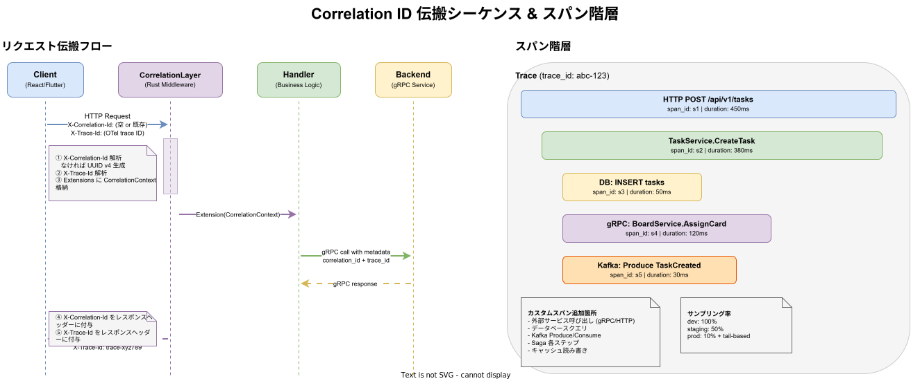

# 可観測性 - トレーシング設計

D-110: 分散トレーシング設計。OpenTelemetry SDK 初期化パターン、自動インストルメンテーション、カスタムスパンガイドラインを定義する。

元ドキュメント: [可観測性設計.md](./可観測性設計.md)

---

## D-110: 分散トレーシング設計（OpenTelemetry）

### Correlation ID 伝搬シーケンス & スパン階層



### OpenTelemetry SDK 初期化パターン

> **注**: 以下は OpenTelemetry SDK の基本パターンを示す簡略例である。実際のプロジェクトでは k1s0 telemetry ライブラリ（`telemetry.InitTelemetry` / `k1s0_telemetry::init_telemetry`）経由で初期化する。サンプリング、リソース属性、ログ統合などの詳細は [可観測性設計.md](./可観測性設計.md) の「言語別テレメトリライブラリの初期化」セクションを参照。

#### Go

```go
package otel

import (
    "context"

    "go.opentelemetry.io/otel"
    "go.opentelemetry.io/otel/exporters/otlp/otlptrace/otlptracegrpc"
    "go.opentelemetry.io/otel/sdk/resource"
    sdktrace "go.opentelemetry.io/otel/sdk/trace"
    semconv "go.opentelemetry.io/otel/semconv/v1.21.0"
)

func initTracer(ctx context.Context, serviceName string) (*sdktrace.TracerProvider, error) {
    exporter, err := otlptracegrpc.New(ctx)
    if err != nil {
        return nil, err
    }
    tp := sdktrace.NewTracerProvider(
        sdktrace.WithBatcher(exporter),
        sdktrace.WithResource(resource.NewWithAttributes(
            semconv.SchemaURL,
            semconv.ServiceNameKey.String(serviceName),
        )),
    )
    otel.SetTracerProvider(tp)
    return tp, nil
}
```

#### Rust

```rust
use opentelemetry::global;
use opentelemetry_otlp::SpanExporter;
use opentelemetry_sdk::{trace as sdktrace, Resource};
use std::error::Error;

fn init_tracer(service_name: &str) -> Result<sdktrace::TracerProvider, Box<dyn Error>> {
    let exporter = SpanExporter::builder()
        .with_tonic()
        .build()?;
    let provider = sdktrace::TracerProvider::builder()
        .with_batch_exporter(exporter)
        .with_resource(Resource::builder()
            .with_service_name(service_name)
            .build())
        .build();
    global::set_tracer_provider(provider.clone());
    Ok(provider)
}
```

### 自動インストルメンテーション

| 言語 | コンポーネント                          | 用途                                           |
| ---- | --------------------------------------- | ---------------------------------------------- |
| Go   | `telemetry.HTTPMiddleware`              | HTTP サーバーの自動スパン生成・構造化ログ記録   |
| Go   | `telemetry.GRPCUnaryInterceptor`        | gRPC Unary コールの自動スパン生成・構造化ログ記録 |
| Rust | `tracing-opentelemetry`                 | `tracing` クレートとの統合によるスパン自動生成  |
| Rust | `k1s0_telemetry::MetricsLayer`          | HTTP リクエストの自動メトリクス記録（Tower Layer） |
| Rust | `k1s0_telemetry::GrpcMetricsLayer`      | gRPC リクエストの自動メトリクス記録（Tower Layer） |
| TS   | `telemetry.httpMiddleware`              | HTTP リクエストの構造化ログ記録（Express/Fastify 互換） |
| TS   | `telemetry.createGrpcInterceptor`       | gRPC Unary コールのスパン生成・メトリクス記録   |
| Dart | `TelemetryMiddleware`                   | HTTP リクエストの構造化ログ・trace-id 伝播（shelf） |

> **補足**: Go の HTTP 自動インストルメンテーションは、OpenTelemetry 公式の `otelhttp` ではなく、メトリクス統合を含むカスタムミドルウェア（telemetry ライブラリ提供）を使用している。Dart は OpenTelemetry トレースの送信は未対応であり、HTTP ヘッダ（`x-trace-id`）経由でサーバー側トレースと相関させる。

## HTTP ミドルウェアによる相関 ID 自動伝播

Rust サーバーの `k1s0_correlation::layer::CorrelationLayer` により、
すべての HTTP リクエストに対して相関 ID の解析・生成・伝播が自動化される。

| コンポーネント | 役割 |
|---|---|
| `CorrelationLayer` | HTTP リクエストの `X-Correlation-Id` / `X-Trace-Id` を解析・生成 |
| `CorrelationContext` | リクエストスコープの相関コンテキスト（Extensions経由でハンドラーから取得可能） |

### リクエスト伝播フロー

```
クライアント
  │ X-Correlation-Id: corr-abc123  （なければ空）
  │ X-Trace-Id: <OTel trace ID>    （なければ空）
  ▼
CorrelationLayer（受信時）
  ├─ X-Correlation-Id を解析 / なければ UUID v4 を生成
  ├─ X-Trace-Id を解析（不正値は無視）
  └─ Extensions<CorrelationContext> に格納
  ▼
ハンドラー（Extension(ctx) で取得可能）
  ▼
CorrelationLayer（レスポンス時）
  ├─ X-Correlation-Id をレスポンスヘッダーに付与
  └─ X-Trace-Id をレスポンスヘッダーに付与（あれば）
  ▼
クライアント（相関 ID 付きレスポンス）
```

### カスタムスパン ガイドライン

ビジネスロジックの重要な処理にはカスタムスパンを追加し、処理の可視性を高める。

**カスタムスパンを追加すべき箇所:**
- 外部サービス呼び出し（gRPC / HTTP クライアント）
- データベースクエリ（特に複雑なトランザクション）
- Kafka メッセージの Produce / Consume
- Saga の各ステップ実行
- キャッシュの読み書き

**Go でのカスタムスパン例:**

```go
func (s *TaskService) CreateTask(ctx context.Context, input CreateTaskInput) (*Task, error) {
    ctx, span := otel.Tracer("task-server").Start(ctx, "TaskService.CreateTask")
    defer span.End()

    span.SetAttributes(
        attribute.String("task.project_id", input.ProjectID),
        attribute.String("task.assignee_id", input.AssigneeID),
    )

    // ビジネスロジック...
}
```

**Rust でのカスタムスパン例:**

```rust
#[tracing::instrument(skip(self), fields(task.project_id = %input.project_id))]
async fn create_task(&self, input: CreateTaskInput) -> Result<Task, AppError> {
    tracing::info!("Creating task");
    // ビジネスロジック...
}
```

### トレース保持期間ポリシー

| 環境 | 保持期間 | 理由 |
|------|---------|------|
| 本番（Jaeger + Elasticsearch） | 30日 | ログの90日保持に対して合理的な範囲でログとのトレース相関を確保 |
| ローカル開発（Jaeger in-memory） | セッション中のみ | 開発環境のためデータ永続化なし |

> **ログとトレースの相関について**: ログに含まれる `trace_id` からJaegerでトレースを参照できる期間は保持期間（30日）以内に限られる。
> 30日以上前のインシデント調査にはトレースデータが使えないため、ログとの差分を考慮した調査計画が必要。

---

## 関連ドキュメント

- [可観測性設計.md](./可観測性設計.md) -- 基本方針・概要
- [可観測性-監視アラート設計.md](./監視アラート設計.md) -- 監視・アラート設計
- [可観測性-SLO設計.md](./SLO設計.md) -- SLO/SLA・エラーバジェット
- [可観測性-ログ設計.md](./ログ設計.md) -- 構造化ログ・Loki
