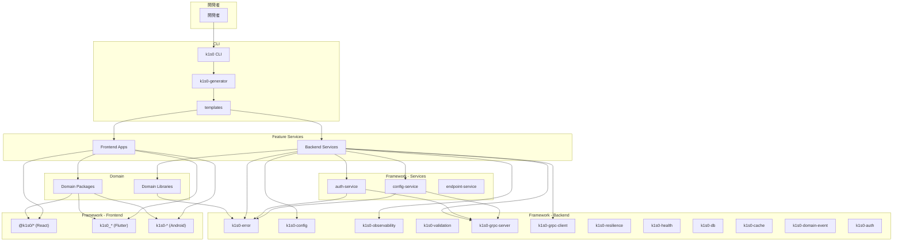
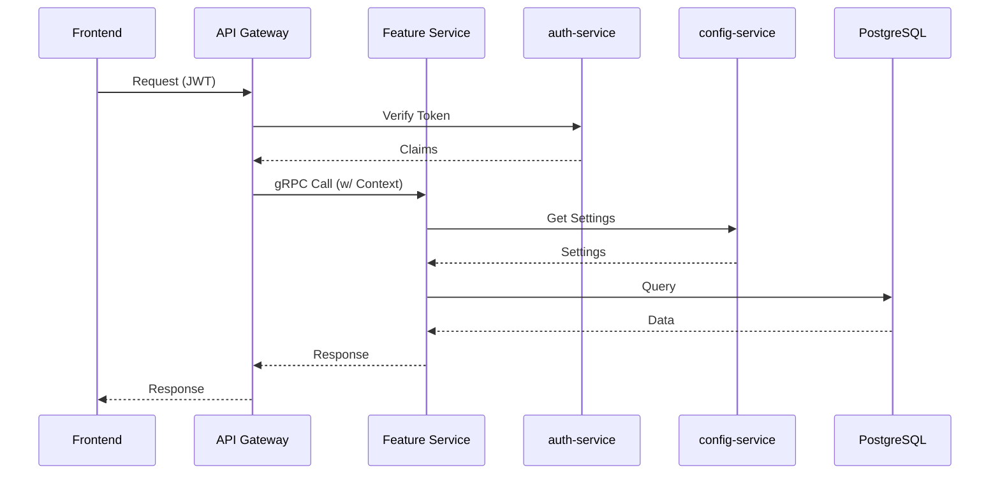

# k1s0 システム全体像

## 概要

k1s0 は、マイクロサービス開発のための統合プラットフォームである。CLI によるサービス雛形生成、Framework による共通機能提供、Templates による一貫した構造を通じて、開発チームが「画面/ビジネスロジックの実装」に集中できる環境を実現する。

## システム構成

```
k1s0/
├── CLI/                    # 開発支援ツール
│   ├── crates/
│   │   ├── k1s0-cli/       # CLI メインプログラム
│   │   ├── k1s0-generator/ # テンプレートエンジン & Lint エンジン
│   │   └── k1s0-lsp/       # LSP サーバ（実装済み）
│   └── templates/          # サービス雛形テンプレート
│
├── framework/              # 共通ライブラリ・サービス（Layer 1）
│   ├── backend/
│   │   ├── rust/
│   │   │   ├── crates/     # 共通 crate 群
│   │   │   └── services/   # 共通サービス
│   │   ├── go/             # Go パッケージ群
│   │   ├── csharp/         # C# NuGet パッケージ群
│   │   ├── python/         # Python パッケージ群（uv）
│   │   └── kotlin/         # Kotlin パッケージ群（Gradle）
│   └── frontend/
│       ├── react/          # React パッケージ群
│       ├── flutter/        # Flutter パッケージ群
│       └── android/        # Android パッケージ群
│
├── domain/                 # ビジネスドメイン（Layer 2）
│   ├── backend/
│   │   ├── rust/           # Rust ドメインクレート
│   │   ├── go/             # Go ドメインモジュール
│   │   ├── csharp/         # C# ドメインプロジェクト
│   │   ├── python/         # Python ドメインパッケージ
│   │   └── kotlin/         # Kotlin ドメインモジュール
│   └── frontend/
│       ├── react/          # React ドメインパッケージ
│       ├── flutter/        # Flutter ドメインパッケージ
│       └── android/        # Android ドメインモジュール
│
├── feature/                # 個別機能サービス（Layer 3）
│   ├── backend/
│   │   ├── rust/           # Rust バックエンド
│   │   ├── go/             # Go バックエンド
│   │   ├── csharp/         # C# バックエンド
│   │   ├── python/         # Python バックエンド
│   │   └── kotlin/         # Kotlin バックエンド
│   └── frontend/
│       ├── react/          # React フロントエンド
│       ├── flutter/        # Flutter フロントエンド
│       └── android/        # Android フロントエンド
│
└── docs/                   # ドキュメント
```

## コンポーネント図



## 主要コンポーネント

### CLI

開発者が直接使用するコマンドラインツール。

| コマンド | 説明 |
|---------|------|
| `k1s0 init` | リポジトリ初期化（`.k1s0/` 作成） |
| `k1s0 new-feature` | サービス雛形生成 |
| `k1s0 new-domain` | ドメイン雛形生成 |
| `k1s0 new-screen` | 画面雛形生成 |
| `k1s0 lint` | 規約違反検査 |
| `k1s0 upgrade` | テンプレート更新 |
| `k1s0 doctor` | 開発環境ヘルスチェック |
| `k1s0 completions` | シェル補完スクリプト生成 |
| `k1s0 domain-list` | ドメイン一覧表示 |
| `k1s0 domain-version` | ドメインバージョン表示・更新 |
| `k1s0 domain-dependents` | ドメイン依存先表示 |
| `k1s0 domain-impact` | バージョンアップグレード影響分析 |
| `k1s0 domain-catalog` | ドメインカタログ表示 |
| `k1s0 domain-graph` | ドメイン依存グラフ出力（Mermaid/DOT） |
| `k1s0 feature-update-domain` | Feature のドメイン依存更新 |
| `k1s0 registry` | テンプレートレジストリ操作 |
| `k1s0 docker` | Docker ビルド・compose 操作 |
| `k1s0 playground` | Playground 環境管理 |
| `k1s0 migrate` | 既存プロジェクト取り込み |

詳細: [CLI 設計書](../design/cli/)

### Framework - Backend Crates

マイクロサービス開発のための共通ライブラリ群。Clean Architecture の原則に従い、各 crate は独立して使用可能。

| Crate | 説明 | Tier |
|-------|------|------|
| `k1s0-error` | エラー表現の統一 | Tier 1 |
| `k1s0-config` | 設定読み込み | Tier 1 |
| `k1s0-validation` | 入力バリデーション | Tier 1 |
| `k1s0-observability` | ログ/トレース/メトリクス | Tier 2 |
| `k1s0-resilience` | レジリエンスパターン | Tier 2 |
| `k1s0-grpc-server` | gRPC サーバ共通基盤 | Tier 2 |
| `k1s0-grpc-client` | gRPC クライアント共通 | Tier 2 |
| `k1s0-health` | ヘルスチェック | Tier 2 |
| `k1s0-db` | DB 接続・トランザクション | Tier 2 |
| `k1s0-cache` | Redis キャッシュ | Tier 2 |
| `k1s0-domain-event` | ドメインイベント publish/subscribe/outbox | Tier 2 |
| `k1s0-auth` | 認証・認可 | Tier 3 |

詳細: [Framework 設計書](../design/framework.md)、[Tier システム](./tier-system.md)

### Framework - Services

k1s0 が提供する共通サービス。

| サービス | 説明 |
|---------|------|
| `auth-service` | JWT/OIDC 検証、ポリシー評価、監査ログ |
| `config-service` | 動的設定管理（`fw_m_setting`） |
| `endpoint-service` | エンドポイント情報管理 |

### Framework - Frontend

フロントエンド開発のための共通パッケージ群。

**React:**
- `@k1s0/navigation`: 設定駆動ナビゲーション
- `@k1s0/config`: YAML 設定管理
- `@k1s0/api-client`: API 通信クライアント
- `@k1s0/ui`: Design System
- `@k1s0/shell`: AppShell
- `@k1s0/auth-client`: 認証クライアント
- `@k1s0/observability`: OTel/ログ
- `@k1s0/realtime`: WebSocket/SSE クライアント

**Flutter:**
- `k1s0_navigation`: 設定駆動ナビゲーション
- `k1s0_config`: YAML 設定管理
- `k1s0_http`: API 通信クライアント
- `k1s0_auth`: 認証クライアント
- `k1s0_observability`: OTel/ログ
- `k1s0_ui`: Design System
- `k1s0_state`: 状態管理
- `k1s0_realtime`: WebSocket/SSE クライアント

**Android:**
- `k1s0-navigation`: Navigation Compose ルーティング
- `k1s0-config`: YAML 設定管理
- `k1s0-http`: Ktor Client HTTP
- `k1s0-ui`: Material 3 Design System
- `k1s0-auth`: JWT 認証クライアント
- `k1s0-observability`: ログ/トレース
- `k1s0-state`: ViewModel + StateFlow ユーティリティ
- `k1s0-realtime`: WebSocket/SSE クライアント

## 技術スタック

### バックエンド

| カテゴリ | 技術 | バージョン |
|---------|------|-----------|
| 言語 | Rust | 1.85+ |
| 言語 | Go | 1.21+ |
| 言語 | C# (ASP.NET Core) | 8.0 |
| 言語 | Python (FastAPI) | 3.12+ |
| 言語 | Kotlin (Ktor) | 3.x |
| 非同期ランタイム | Tokio | 1.x |
| gRPC | Tonic | 0.12 |
| Protocol Buffers | Prost | 0.13 |
| データベース | PostgreSQL | 15+ |
| ORM | SQLx | 0.8 |
| キャッシュ | Redis | 7+ |
| シリアライゼーション | Serde | 1.x |
| 観測性 | OpenTelemetry | 0.24 |

### フロントエンド（React）

| カテゴリ | 技術 | バージョン |
|---------|------|-----------|
| 言語 | TypeScript | 5.x |
| フレームワーク | React | 18.x |
| UI ライブラリ | Material-UI | 5.x / 6.x |
| ルーティング | React Router | 6.x |
| バリデーション | Zod | 3.x |
| 観測性 | OpenTelemetry | - |

### フロントエンド（Flutter）

| カテゴリ | 技術 | バージョン |
|---------|------|-----------|
| 言語 | Dart | 3.x |
| フレームワーク | Flutter | 3.x |
| 状態管理 | Riverpod | 2.x |
| HTTP クライアント | Dio | 5.x |
| ルーティング | GoRouter | 13.x |
| UI | Material 3 | - |

### フロントエンド（Android）

| カテゴリ | 技術 | バージョン |
|---------|------|-----------|
| 言語 | Kotlin | 2.x |
| UI | Jetpack Compose | - |
| デザイン | Material 3 | - |
| DI | Koin | - |
| 状態管理 | ViewModel + StateFlow | - |

### インフラストラクチャ

| カテゴリ | 技術 |
|---------|------|
| コンテナオーケストレーション | Kubernetes |
| コンテナランタイム | containerd |
| サービスメッシュ | Istio（予定） |
| CI/CD | GitHub Actions |
| 契約管理 | buf |

## データフロー



## 関連ドキュメント

- [Clean Architecture](./clean-architecture.md): レイヤー構成と依存方向
- [Tier システム](./tier-system.md): crate の階層と依存ルール
- [サービス間通信](./service-mesh.md): gRPC 通信と認証・認可
- [ADR-0001](../adr/ADR-0001-scope-and-prerequisites.md): 実装スコープと前提
