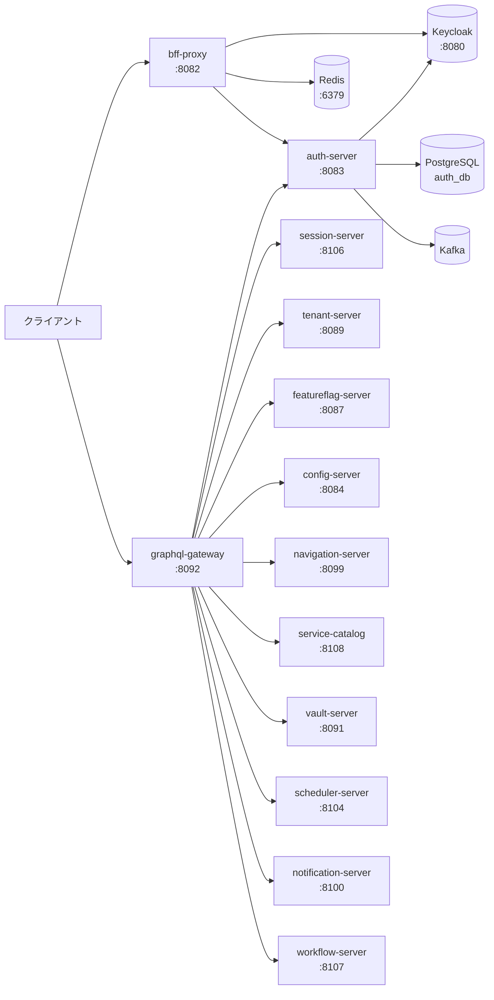
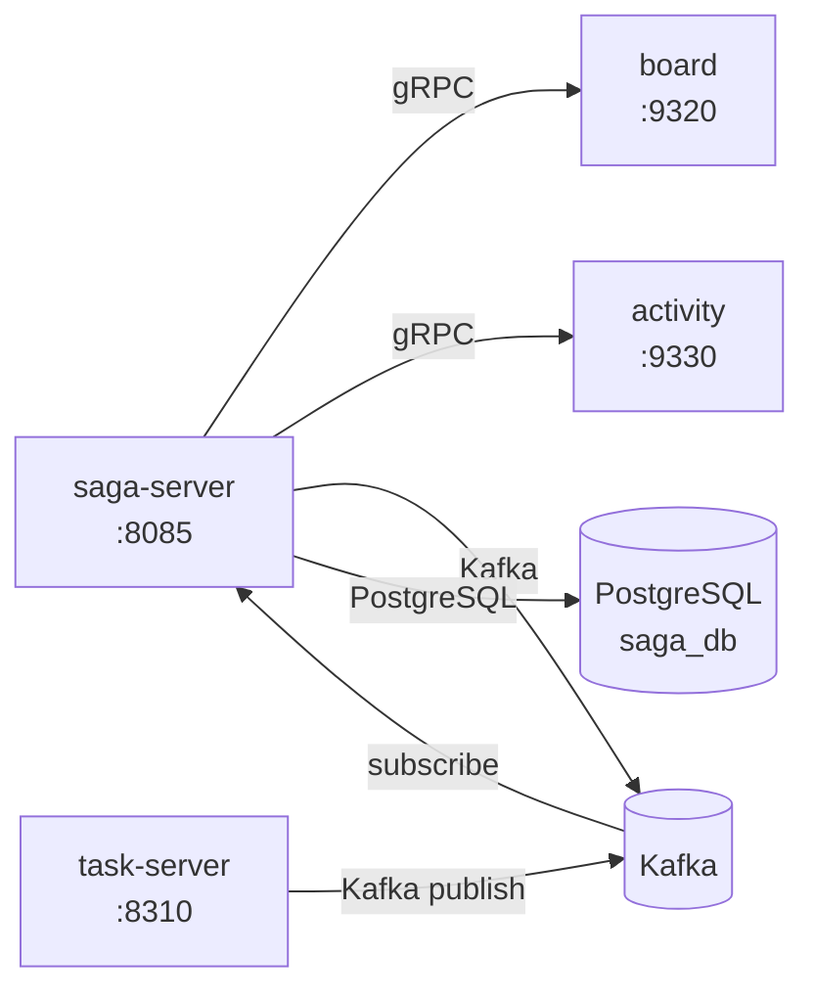
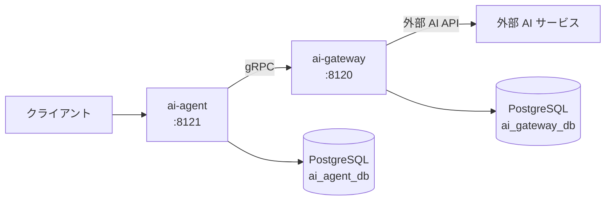

# サービス依存関係マップ

## このドキュメントについて

k1s0 全サービス間の依存関係を定義したマップ。障害発生時の影響範囲を素早く特定し、
根本原因に最短でたどり着くための参照資料として使用する。

---

## サービス一覧

### System Tier（28 サービス）

| サービス名 | REST | gRPC | 役割 |
|-----------|------|------|------|
| bff-proxy | 8082 | — | BFF プロキシ（OAuth/PKCE、セッション管理） |
| auth | 8083 | 50052 | 認証・認可（JWT/JWKS、RBAC、監査ログ） |
| session | 8106 | 50065 | セッション管理 |
| config | 8084 | 50054 | 設定管理（namespace/key/value） |
| saga | 8085 | 50055 | Saga オーケストレーター |
| dlq-manager | 8086 | — | Dead Letter Queue 管理・再処理 |
| featureflag | 8087 | 50056 | フィーチャーフラグ |
| ratelimit | 8088 | 50057 | レート制限 |
| tenant | 8089 | 50058 | テナント管理 |
| vault | 8091 | 50059 | シークレット管理（Vault ラッパー） |
| graphql-gateway | 8092 | — | GraphQL 統合ゲートウェイ |
| api-registry | 8093 | — | API レジストリ（OpenAPI/Protobuf 検証） |
| app-registry | 8094 | — | アプリケーションレジストリ |
| event-monitor | 8095 | 50060 | イベント監視・KPI |
| event-store | 8096 | — | イベントストア（EventSourcing） |
| file | 8097 | — | ファイル管理 |
| master-maintenance | 8098 | 50061 | マスタメンテナンス |
| navigation | 8099 | 50062 | ナビゲーション（メニュー等） |
| notification | 8100 | — | 通知（Email/SMS/Push/Slack） |
| policy | 8101 | 50063 | ポリシー管理 |
| quota | 8102 | — | クォータ管理 |
| rule-engine | 8103 | 50064 | ルールエンジン |
| scheduler | 8104 | — | スケジューラー |
| search | 8105 | — | 検索 |
| workflow | 8107 | — | ワークフロー |
| service-catalog | 8108 | — | サービスカタログ |
| ai-gateway | 8120 | 50071 | AI ゲートウェイ |
| ai-agent | 8121 | 50072 | AI エージェント |

### Business Tier（1 サービス）

| サービス名 | REST | gRPC | 役割 |
|-----------|------|------|------|
| project-master | 8210 | 9210 | プロジェクトタイプ/ステータス定義マスタ（タスク管理） |

### Service Tier（3 サービス）

| サービス名 | REST | gRPC | 役割 |
|-----------|------|------|------|
| task | 8310 | 9310 | タスク管理（CRUD + ステータスマシン） |
| board | 8320 | 9320 | ボードカラム管理（WIP制限） |
| activity | 8330 | 9330 | アクティビティ記録（承認フロー + 冪等性） |

---

## 外部インフラ依存

| インフラ | バージョン | 用途 | 依存サービス |
|---------|----------|------|------------|
| PostgreSQL | 17 | 主要 RDBMS（サービスごとに専用 DB） | ほぼ全サービス |
| Kafka | 3.8 (KRaft) | 非同期イベントバス | auth, config, saga, dlq-manager, notification, task, project-master 等 |
| Keycloak | 26 | IdP（OAuth2/OIDC） | bff-proxy, auth |
| Redis | 7 | セッション、キャッシュ、分散ロック、レート制限 | bff-proxy, ratelimit, quota |
| HashiCorp Vault | 1.17 | シークレット管理 | vault-server |
| PersistentVolume (PV) | — | ファイルストレージ（ローカルFS）| file, app-registry |
| Jaeger + OTLP | — | 分散トレーシング | 全サービス |
| Prometheus | — | メトリクス収集 | 全サービス（`/metrics` エンドポイント） |

---

## 依存関係詳細

### クリティカルパス（障害時に影響範囲が最大のフロー）

> **注意**: Keycloak が停止すると bff-proxy と auth-server の両方が認証不能になり、
> 実質的にシステム全体の認証が機能しなくなる。最大の単一障害点（SPOF）。

### Saga オーケストレーション（分散トランザクション）

### AI サービスフロー

---

## サービス間通信詳細（同期 gRPC）

| 呼び出し元 | 呼び出し先 | 用途 |
|-----------|----------|------|
| graphql-gateway | auth, session, tenant, featureflag, config, navigation, service-catalog, vault, scheduler, notification, workflow | 各ドメインの読み取り・操作 |
| saga | board (9320) | ボードWIP制限チェック・取消 |
| saga | activity (9330) | アクティビティ記録・取消 |
| ai-agent | ai-gateway (50071) | AI モデル呼び出し |
| master-maintenance | rule-engine (50064) | ルール評価 |

---

## 非同期メッセージング（Kafka トピック）

| トピック名 | Publisher | Subscriber | 説明 |
|-----------|----------|-----------|------|
| `k1s0.system.auth.login.v1` | auth | — | ログインイベント（監査） |
| `k1s0.system.auth.token_validate.v1` | auth | — | トークン検証イベント（監査） |
| `k1s0.system.auth.permission_denied.v1` | auth | — | 権限拒否イベント（監査） |
| `k1s0.system.config.changed.v1` | config | — | 設定変更イベント |
| `k1s0.service.task.created.v1` | task | saga | タスク作成イベント |
| `k1s0.service.task.updated.v1` | task | — | タスク更新イベント |
| `k1s0.service.task.cancelled.v1` | task | saga | タスクキャンセルイベント |
| `{topic}.dlq` | dlq ライブラリ | dlq-manager | Dead Letter Queue |

---

## 障害影響分析

| 障害対象 | 影響サービス | 影響の種類 | SEV レベル目安 |
|---------|------------|----------|--------------|
| **Keycloak** | bff-proxy, auth, システム全体 | 認証不能（全ユーザーがログイン不可） | **SEV1** |
| **PostgreSQL（auth_db）** | auth-server | 認証履歴・ロール管理不能 | **SEV1** |
| **PostgreSQL（saga_db）** | saga-server | 分散トランザクション処理停止 | **SEV1** |
| **Redis** | bff-proxy, ratelimit, quota | セッション喪失、レート制限不能 | **SEV1** または **SEV2** |
| **Kafka** | auth, config, saga, dlq-manager, task, project-master 等 | 非同期イベント処理停止（DLQ に蓄積） | **SEV1** |
| **auth-server** | 全サービス（認証必須エンドポイント） | 認証・権限チェック不能 | **SEV1** |
| **session-server** | graphql-gateway, bff-proxy | セッション確認不能 | **SEV2** |
| **graphql-gateway** | フロントエンドの全操作 | GraphQL API 全体が利用不可 | **SEV1** |
| **saga-server** | task, board, activity の整合性 | 分散トランザクションが宙に浮く | **SEV2** |
| **dlq-manager** | 各コンシューマー | DLQ メッセージの再処理不能（蓄積） | **SEV2** |
| **board-server** | task（WIP制限チェック） | タスク割り当て時のWIP確認不能 | **SEV2** |
| **activity-server** | task（操作履歴記録） | アクティビティ記録不能 | **SEV3** |
| **notification-server** | scheduler, 各サービス | 通知送信不能 | **SEV3** |
| **featureflag-server** | graphql-gateway, 各サービス | フラグ評価できずデフォルト値で動作 | **SEV3** |

---

## トラブルシューティング参照先

| 症状 | 参照 Runbook / ドキュメント |
|------|--------------------------|
| エラー率が急増している | [高エラー率 Runbook](../observability/runbooks/common/high-error-rate.md) |
| レイテンシが悪化している | [高レイテンシ Runbook](../observability/runbooks/common/high-latency.md) |
| サービスがダウンしている | [サービスダウン Runbook](../observability/runbooks/common/service-down.md) |
| DB 接続が枯渇している | [DB プール枯渇 Runbook](../observability/runbooks/common/db-pool-exhaustion.md) |
| Kafka コンシューマーラグが増加 | [Kafka コンシューマーラグ Runbook](../observability/runbooks/common/kafka-consumer-lag.md) |
| 各エラーコードの意味・対処法 | [エラーコードカタログ](../conventions/エラーコードカタログ.md) |
| よくある障害の対処法 | [運用 FAQ](../observability/運用FAQ.md) |
