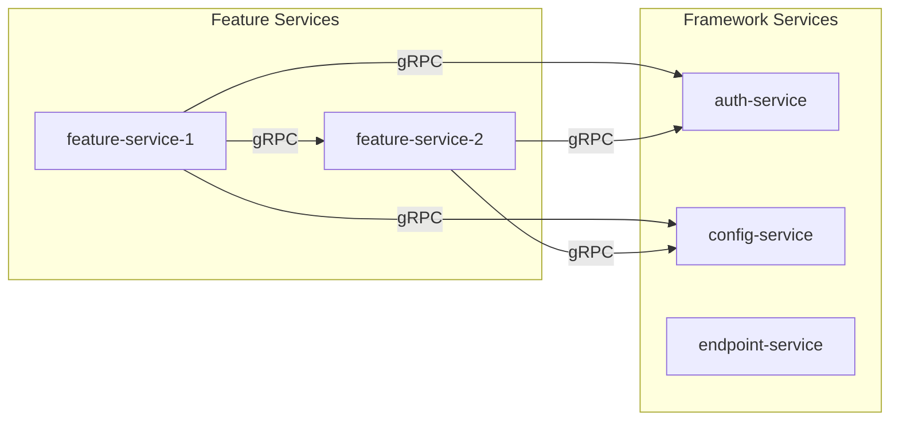
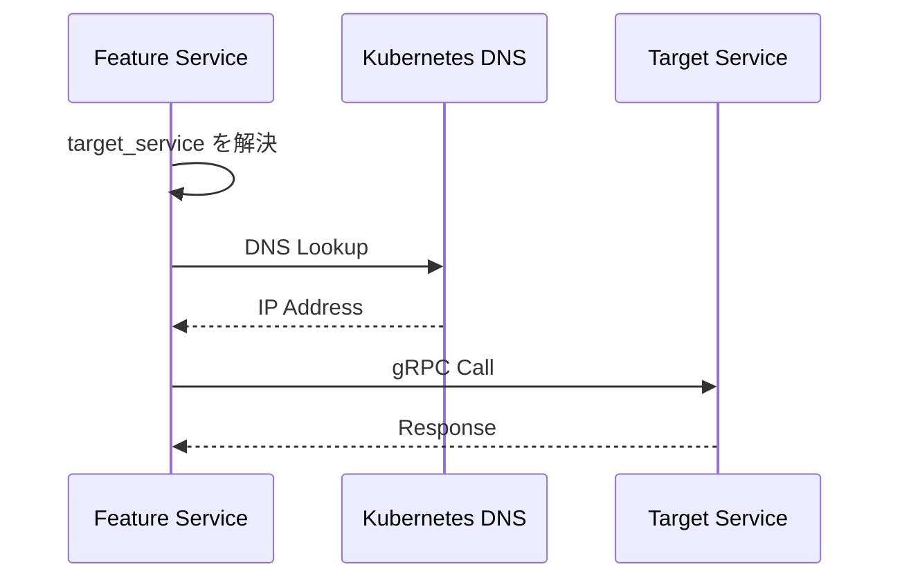
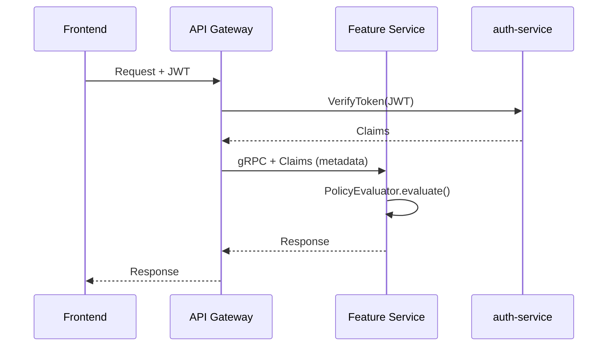

# サービス間通信

## 概要

k1s0 のマイクロサービス間通信は、gRPC をプライマリプロトコルとして採用する。本ドキュメントでは、サービス間通信のパターン、認証・認可、観測性について定義する。

## gRPC サービス間通信

### 通信パターン



### 設計原則

1. **deadline 必須**: 無制限呼び出しを防ぐ（100ms〜5分）
2. **retry 原則 0**: リトライは明示的な opt-in
3. **トレース伝播**: W3C Trace Context の自動付与
4. **エラーコード統一**: gRPC ステータス + error_code メタデータ

### クライアント設定

```rust
use k1s0_grpc_client::{GrpcClientBuilder, GrpcClientConfig, CallOptions};

// クライアント構築
let client = GrpcClientBuilder::new("my-service")
    .target_service("auth-service")
    .config(GrpcClientConfig {
        timeout_ms: 5000,           // デフォルト: 30秒
        connect_timeout_ms: 2000,   // デフォルト: 5秒
        retry: RetryConfig::disabled(),
        ..Default::default()
    })
    .build()?;

// 呼び出しオプション
let options = CallOptions::new()
    .with_timeout_ms(3000)          // リクエスト単位で上書き可能
    .with_trace_id(&ctx.trace_id)
    .with_request_id(&ctx.request_id);
```

#### Go

```go
import "github.com/k1s0/framework/backend/go/k1s0-grpc-client"

client, err := grpcclient.NewBuilder("my-service").
    TargetService("auth-service").
    Config(grpcclient.Config{
        TimeoutMs:        5000,
        ConnectTimeoutMs: 2000,
        Retry:            grpcclient.RetryDisabled(),
    }).
    Build()
```

#### C#

```csharp
using K1s0.Grpc.Client;

var client = new GrpcClientBuilder("my-service")
    .TargetService("auth-service")
    .Config(new GrpcClientConfig
    {
        TimeoutMs = 5000,
        ConnectTimeoutMs = 2000,
        Retry = RetryConfig.Disabled()
    })
    .Build();
```

#### Python

```python
from k1s0_grpc_client import GrpcClientBuilder, GrpcClientConfig, RetryConfig

client = (
    GrpcClientBuilder("my-service")
    .target_service("auth-service")
    .config(GrpcClientConfig(
        timeout_ms=5000,
        connect_timeout_ms=2000,
        retry=RetryConfig.disabled(),
    ))
    .build()
)
```

#### Kotlin

```kotlin
import com.k1s0.grpc.client.GrpcClientBuilder
import com.k1s0.grpc.client.GrpcClientConfig

val client = GrpcClientBuilder("my-service")
    .targetService("auth-service")
    .config(GrpcClientConfig(
        timeoutMs = 5000,
        connectTimeoutMs = 2000,
        retry = RetryConfig.disabled()
    ))
    .build()
```

### タイムアウトポリシー

| 設定 | 最小値 | 最大値 | デフォルト |
|------|--------|--------|-----------|
| `timeout_ms` | 100ms | 300,000ms (5分) | 30,000ms (30秒) |
| `connect_timeout_ms` | 100ms | 30,000ms | 5,000ms |

```rust
// タイムアウトのバリデーション
pub const MIN_TIMEOUT_MS: u64 = 100;
pub const MAX_TIMEOUT_MS: u64 = 300_000;

impl GrpcClientConfig {
    pub fn validate(&self) -> Result<(), ConfigError> {
        if self.timeout_ms < MIN_TIMEOUT_MS || self.timeout_ms > MAX_TIMEOUT_MS {
            return Err(ConfigError::InvalidTimeout);
        }
        Ok(())
    }
}
```

## サービスディスカバリ

### Kubernetes DNS ベース

```rust
use k1s0_grpc_client::ServiceDiscoveryConfig;

let discovery = ServiceDiscoveryConfig::builder()
    .default_namespace("production")
    .cluster_domain("svc.cluster.local")
    .default_port(50051)
    .build();

// 論理名からアドレス解決
// "auth-service" -> "auth-service.production.svc.cluster.local:50051"
let client = GrpcClientBuilder::new("my-service")
    .target_service("auth-service")
    .discovery(discovery)
    .build()?;
```

### エンドポイント解決フロー



#### Go

```go
discovery := grpcclient.NewServiceDiscovery().
    DefaultNamespace("production").
    ClusterDomain("svc.cluster.local").
    DefaultPort(50051)

client, _ := grpcclient.NewBuilder("my-service").
    TargetService("auth-service").
    Discovery(discovery).
    Build()
```

#### C# / Python / Kotlin

各言語でも同様の `ServiceDiscoveryConfig` を使用する。API は Rust/Go と同一の設計思想に基づく。

### 明示的エンドポイント指定

```rust
// 開発環境や特殊なケース
let client = GrpcClientBuilder::new("my-service")
    .target_address("localhost:50051")
    .build()?;
```

## 認証・認可フロー

### トークン伝播



### gRPC メタデータ

```rust
// 送信側（Gateway/呼び出し元）
let mut request = Request::new(payload);
request.metadata_mut().insert("x-trace-id", trace_id.parse()?);
request.metadata_mut().insert("x-request-id", request_id.parse()?);
request.metadata_mut().insert("x-tenant-id", tenant_id.parse()?);
request.metadata_mut().insert("x-user-id", user_id.parse()?);
request.metadata_mut().insert("x-roles", roles.join(",").parse()?);
request.metadata_mut().insert("x-permissions", permissions.join(",").parse()?);
```

```rust
// 受信側（Feature Service）
impl RequestContext {
    pub fn from_metadata(metadata: &MetadataMap) -> Result<Self, Status> {
        Ok(Self {
            trace_id: extract_header(metadata, "x-trace-id")?,
            request_id: extract_header(metadata, "x-request-id")?,
            tenant_id: extract_header_optional(metadata, "x-tenant-id"),
            user_id: extract_header_optional(metadata, "x-user-id"),
            roles: extract_header_list(metadata, "x-roles"),
            permissions: extract_header_list(metadata, "x-permissions"),
            deadline: extract_deadline(metadata),
        })
    }
}
```

### ポリシー評価

```rust
use k1s0_auth::{PolicyEvaluator, PolicyRequest, PolicySubject, Action};

// サービス内でのポリシー評価
let evaluator = PolicyEvaluator::new();
evaluator.add_rules(load_policy_rules()).await;

let subject = PolicySubject::new(&ctx.user_id)
    .with_roles(ctx.roles.clone())
    .with_permissions(ctx.permissions.clone())
    .with_tenant(&ctx.tenant_id);

let action = Action::new("user", "delete");

let request = PolicyRequest { subject, action, resource: Default::default() };
let result = evaluator.evaluate(&request).await;

match result.decision {
    PolicyDecision::Allow => { /* 処理続行 */ }
    PolicyDecision::Deny => {
        return Err(Status::permission_denied(
            result.reason.unwrap_or_default()
        ));
    }
    PolicyDecision::NotApplicable => {
        return Err(Status::permission_denied("No applicable policy"));
    }
}
```

## 観測性

### トレース伝播

W3C Trace Context を使用したトレース伝播。

```
HTTP Headers / gRPC Metadata:
traceparent: 00-{trace_id}-{span_id}-{flags}
tracestate: (optional)
```

```rust
// k1s0-grpc-client での自動伝播
impl GrpcClientInterceptor {
    fn inject_trace_context(&self, request: &mut Request<()>) {
        if let Some(ctx) = Span::current().context() {
            let traceparent = format!(
                "00-{}-{}-01",
                ctx.trace_id(),
                ctx.span_id()
            );
            request.metadata_mut().insert("traceparent", traceparent.parse().unwrap());
        }
    }
}
```

### リクエストログ

```rust
use k1s0_grpc_server::{RequestLog, LogLevel, GrpcStatusCode};

let log = RequestLog::new(
    LogLevel::Info,
    "gRPC request completed",
    "my-service",
    "dev",
    &ctx,
)
.with_grpc("UserService", "CreateUser", GrpcStatusCode::Ok)
.with_latency(elapsed_ms);

println!("{}", log.to_json()?);
```

出力例:

```json
{
  "timestamp": "2026-01-27T10:30:00.123Z",
  "level": "INFO",
  "message": "gRPC request completed",
  "service_name": "my-service",
  "env": "dev",
  "trace_id": "abc123def456",
  "request_id": "req-001",
  "grpc.service": "UserService",
  "grpc.method": "CreateUser",
  "grpc.status_code": 0,
  "latency_ms": 42.5
}
```

### メトリクス

```rust
// 必須メトリクス（自動収集）
// - k1s0.{service}.grpc.request_count
// - k1s0.{service}.grpc.request_duration_ms
// - k1s0.{service}.grpc.request_failures

// ラベル
// - grpc_service: "UserService"
// - grpc_method: "CreateUser"
// - grpc_status_code: "0"
// - error_code: "USER_NOT_FOUND" (エラー時)
```

### ヘルスチェック

```rust
use k1s0_health::{ProbeHandler, HealthResponse, ComponentHealth};

let handler = ProbeHandler::new("my-service")
    .with_version("1.0.0");

// Kubernetes プローブ
// GET /healthz (liveness)
// GET /readyz (readiness)

// gRPC Health Check
// grpc.health.v1.Health/Check
```

## エラーハンドリング

### gRPC ステータスマッピング

| ErrorKind | gRPC Status | HTTP Status |
|-----------|-------------|-------------|
| InvalidInput | INVALID_ARGUMENT | 400 |
| NotFound | NOT_FOUND | 404 |
| Conflict | ALREADY_EXISTS | 409 |
| Unauthorized | UNAUTHENTICATED | 401 |
| Forbidden | PERMISSION_DENIED | 403 |
| DependencyFailure | UNAVAILABLE | 502 |
| Transient | UNAVAILABLE | 503 |
| Internal | INTERNAL | 500 |

### エラーレスポンス

```rust
use k1s0_error::{AppError, ErrorCode};
use k1s0_grpc_server::ResponseMetadata;

// エラー発生時
let app_err = AppError::from_domain(
    DomainError::not_found("User", "user-123"),
    ErrorCode::new("USER_NOT_FOUND"),
)
.with_trace_id(&ctx.trace_id)
.with_request_id(&ctx.request_id);

// gRPC エラーへ変換
let status = app_err.to_grpc_error();
// Status::not_found("User not found")
// + metadata: {"error_code": "USER_NOT_FOUND", "trace_id": "...", "request_id": "..."}
```

## レジリエンス

### タイムアウト

```rust
use k1s0_resilience::{TimeoutGuard, TimeoutConfig};

let guard = TimeoutGuard::new(TimeoutConfig::new(5000))?;

let result = guard.execute(async {
    client.call(request).await
}).await?;
```

### サーキットブレーカ

```rust
use k1s0_resilience::{CircuitBreaker, CircuitBreakerConfig};

let cb = CircuitBreaker::new(
    CircuitBreakerConfig::enabled()
        .failure_threshold(5)
        .success_threshold(3)
        .reset_timeout_secs(30)
        .build()
);

let result = cb.execute(async {
    client.call(request).await
}).await?;
```

### バルクヘッド

```rust
use k1s0_resilience::{Bulkhead, BulkheadConfig};

let bulkhead = Bulkhead::new(
    BulkheadConfig::new(100)  // デフォルト同時実行数
        .with_service_limit("auth-service", 10)
        .with_service_limit("config-service", 20)
);

let result = bulkhead.execute("auth-service", async {
    auth_client.verify_token(token).await
}).await?;
```

### 他言語でのレジリエンスパターン

#### Go

```go
import "github.com/k1s0/framework/backend/go/k1s0-resilience"

cb := resilience.NewCircuitBreaker(resilience.CircuitBreakerConfig{
    FailureThreshold: 5,
    SuccessThreshold: 3,
    ResetTimeoutSecs: 30,
})

result, err := cb.Execute(ctx, func(ctx context.Context) (interface{}, error) {
    return client.Call(ctx, request)
})
```

#### C#

```csharp
using K1s0.Resilience;

var cb = new CircuitBreaker(new CircuitBreakerConfig
{
    FailureThreshold = 5,
    SuccessThreshold = 3,
    ResetTimeoutSecs = 30
});

var result = await cb.ExecuteAsync(() => client.CallAsync(request));
```

#### Python

```python
from k1s0_resilience import CircuitBreaker, CircuitBreakerConfig

cb = CircuitBreaker(CircuitBreakerConfig(
    failure_threshold=5,
    success_threshold=3,
    reset_timeout_secs=30,
))

result = await cb.execute(lambda: client.call(request))
```

#### Kotlin

```kotlin
import com.k1s0.resilience.CircuitBreaker
import com.k1s0.resilience.CircuitBreakerConfig

val cb = CircuitBreaker(CircuitBreakerConfig(
    failureThreshold = 5,
    successThreshold = 3,
    resetTimeoutSecs = 30
))

val result = cb.execute { client.call(request) }
```

## 契約管理

### buf による契約検証

```yaml
# buf.yaml
version: v1
lint:
  use:
    - DEFAULT
    - COMMENTS
  disallow_comment_ignores: true
  enum_zero_value_suffix: _UNSPECIFIED
  service_suffix: Service

breaking:
  use:
    - FILE
  ignore_unstable_packages: true
```

### 破壊的変更の検出

```bash
# CI で実行
buf lint proto/
buf breaking proto/ --against '.git#branch=main'
```

詳細: [ADR-0005](../adr/0005-grpc-contract-management.md)

## 関連ドキュメント

- [システム全体像](./overview.md): コンポーネント構成
- [観測性規約](../conventions/observability.md): ログ/トレース/メトリクス
- [API 契約規約](../conventions/api-contracts.md): gRPC/REST 契約管理
- [Framework 設計書](../design/framework.md): crate の詳細
