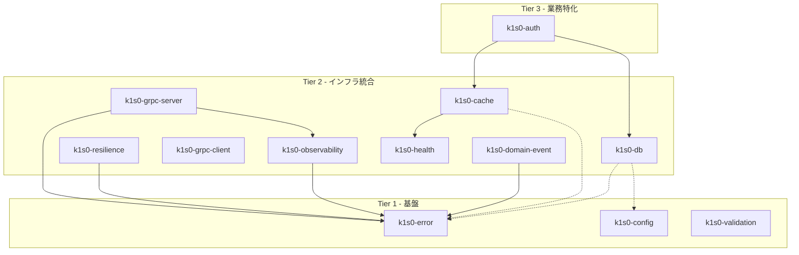

# Tier システム

## 概要

k1s0 Framework の crate 群は、3 つの Tier（階層）に分類される。このシステムにより、依存関係の複雑化を防ぎ、各 crate の責務を明確にする。

## Tier の定義



## Tier 1: 基盤 crate

### 特徴

- 外部依存が最小限
- 他の k1s0 crate に依存しない（スタンドアロン）
- 純粋な Rust で実装可能（他言語でも同等の実装）
- 全サービスで使用される基本機能

### crate 一覧

| Crate | 説明 | 外部依存 |
|-------|------|---------|
| `k1s0-error` | エラー表現の統一 | thiserror |
| `k1s0-config` | 設定読み込み | serde, serde_yaml |
| `k1s0-validation` | 入力バリデーション | serde |

### 依存関係

```toml
# k1s0-error/Cargo.toml
[dependencies]
thiserror = "1"
serde = { version = "1", features = ["derive"] }

# 他の k1s0 crate への依存なし
```

## Tier 2: インフラ統合 crate

### 特徴

- 特定の技術/プロトコルと統合
- Tier 1 crate に依存可能
- 同一 Tier 内での相互依存は限定的に許可（feature gate）

### crate 一覧

| Crate | 説明 | 依存する Tier 1/2 |
|-------|------|------------------|
| `k1s0-observability` | ログ/トレース/メトリクス | k1s0-error |
| `k1s0-resilience` | レジリエンスパターン | k1s0-error |
| `k1s0-grpc-server` | gRPC サーバ共通基盤 | k1s0-error, k1s0-observability |
| `k1s0-grpc-client` | gRPC クライアント共通 | - |
| `k1s0-health` | ヘルスチェック | - |
| `k1s0-db` | DB 接続・トランザクション | k1s0-config (feature: `config`) |
| `k1s0-cache` | Redis キャッシュ | k1s0-health (feature) |
| `k1s0-domain-event` | ドメインイベント publish/subscribe/outbox | k1s0-error |

### 依存関係

```toml
# k1s0-grpc-server/Cargo.toml
[dependencies]
k1s0-error = { path = "../k1s0-error" }
k1s0-observability = { path = "../k1s0-observability" }
tonic = "0.12"
prost = "0.13"

# Tier 2 内の依存は feature gate で制御
[features]
default = []
health = ["k1s0-health"]
```

```toml
# k1s0-cache/Cargo.toml
[dependencies]
# Tier 1 への依存は許可（必要な場合）

[features]
default = []
redis = ["dep:redis", "dep:bb8", "dep:bb8-redis"]
health = ["dep:k1s0-health"]  # 同一 Tier は feature gate
```

## Tier 3: 業務特化 crate

### 特徴

- 特定のビジネス要件に対応
- Tier 1, 2 crate に依存可能
- 複数の Tier 2 crate を組み合わせて使用
- feature gate による柔軟な構成

### crate 一覧

| Crate | 説明 | 依存する Tier 1/2 |
|-------|------|------------------|
| `k1s0-auth` | 認証・認可 | k1s0-cache, k1s0-db (feature) |

### 依存関係

```toml
# k1s0-auth/Cargo.toml
[dependencies]
# Tier 2 への依存
# feature gate で有効化

[features]
default = []
axum-layer = ["axum", "tower"]
tonic-interceptor = ["tonic"]
redis-cache = ["k1s0-cache/redis"]
postgres-policy = ["k1s0-db/postgres"]
full = ["axum-layer", "tonic-interceptor", "redis-cache", "postgres-policy"]
```

## 依存ルール

### 基本ルール

```
Tier N は Tier N-1 以下にのみ依存可能
```

| 依存元 | 依存先 Tier 1 | 依存先 Tier 2 | 依存先 Tier 3 |
|--------|--------------|--------------|--------------|
| Tier 1 | - | 禁止 | 禁止 |
| Tier 2 | 許可 | 限定許可（feature） | 禁止 |
| Tier 3 | 許可 | 許可 | 禁止 |

### 同一 Tier 内の依存

- **Tier 1**: 相互依存禁止
- **Tier 2**: feature gate 経由のみ許可
- **Tier 3**: 原則禁止（将来的な検討事項）

### 循環依存の禁止

すべての Tier において循環依存は禁止。

```
禁止例:
k1s0-cache -> k1s0-health -> k1s0-cache
```

## crate 詳細

### Tier 1

#### k1s0-error

```
責務: エラー表現の統一
依存: なし

提供する型:
- DomainError: ドメイン層エラー
- AppError: アプリケーション層エラー
- ErrorCode: エラーコード
- ErrorKind: エラー分類
```

#### k1s0-config

```
責務: 設定読み込み
依存: なし

提供する型:
- ConfigOptions: 設定オプション
- ConfigLoader: 設定ローダー
- ServiceInit: サービス初期化

db feature で追加される型:
- DbSettingRepository: DB設定リポジトリ trait
- DbConfigLoader: YAML + DB 統合ローダー
- SettingEntry: 設定エントリ
- FailureMode: 障害時挙動
- MockDbSettingRepository: テスト用モック
```

#### k1s0-validation

```
責務: 入力バリデーション
依存: なし

提供する型:
- FieldError: フィールドエラー
- ValidationErrors: バリデーションエラー集約
- Validate: バリデーション trait
```

### Tier 2

#### k1s0-observability

```
責務: 観測性の初期化
依存: k1s0-error

提供する型:
- ObservabilityConfig: 観測性設定
- RequestContext: リクエストコンテキスト
- LogEntry: ログエントリ
```

#### k1s0-resilience

```
責務: レジリエンスパターン
依存: k1s0-error

提供する型:
- TimeoutGuard: タイムアウト
- ConcurrencyLimiter: 同時実行制限
- Bulkhead: バルクヘッド
- CircuitBreaker: サーキットブレーカ
```

#### k1s0-grpc-server

```
責務: gRPC サーバ共通基盤
依存: k1s0-error, k1s0-observability

提供する型:
- GrpcServerConfig: サーバ設定
- RequestContext: リクエストコンテキスト
- ResponseMetadata: レスポンスメタデータ
- RequestLog: リクエストログ
```

#### k1s0-grpc-client

```
責務: gRPC クライアント共通
依存: なし

提供する型:
- GrpcClientBuilder: クライアントビルダー
- GrpcClientConfig: クライアント設定
- ServiceDiscoveryConfig: サービスディスカバリ設定
- CallOptions: 呼び出しオプション
```

#### k1s0-health

```
責務: ヘルスチェック
依存: なし

提供する型:
- HealthStatus: ヘルスステータス
- ComponentHealth: コンポーネントヘルス
- HealthResponse: ヘルスレスポンス
- ProbeHandler: プローブハンドラ
```

#### k1s0-db

```
責務: DB 接続・トランザクション
依存: k1s0-config (feature: config)

提供する型:
- DbConfig: DB 設定
- Repository: リポジトリ trait
- UnitOfWork: Unit of Work trait
- Pagination: ページネーション

config feature で追加される型:
- PostgresSettingRepository: fw_m_setting リポジトリ実装
- PostgresSettingWriter: 設定書き込み操作
- SETTING_MIGRATION_SQL: テーブル作成 SQL
- SETTING_ROLLBACK_SQL: ロールバック SQL
```

#### k1s0-cache

```
責務: キャッシュクライアント
依存: k1s0-health (feature)

提供する型:
- CacheConfig: キャッシュ設定
- CacheOperations: キャッシュ操作 trait
- CacheClient: キャッシュクライアント
```

#### k1s0-domain-event

```
責務: ドメインイベント publish/subscribe/outbox
依存: k1s0-error

提供する型:
- DomainEvent: ドメインイベント
- EventPublisher: イベント発行
- EventSubscriber: イベント購読
- OutboxRepository: Outbox パターン実装
```

### Tier 3

#### k1s0-auth

```
責務: 認証・認可
依存: k1s0-cache (feature), k1s0-db (feature)

提供する型:
- Claims: JWT クレーム
- JwtVerifier: JWT 検証
- PolicyEvaluator: ポリシー評価
- AuditLogger: 監査ログ
```

## サービスでの使用例

### 最小構成（Tier 1 のみ）

```toml
[dependencies]
k1s0-error = { path = "../../framework/backend/rust/crates/k1s0-error" }
k1s0-config = { path = "../../framework/backend/rust/crates/k1s0-config" }
k1s0-observability = { path = "../../framework/backend/rust/crates/k1s0-observability" }
```

### gRPC サービス（Tier 1 + 2）

```toml
[dependencies]
k1s0-error = { path = "..." }
k1s0-config = { path = "..." }
k1s0-observability = { path = "..." }
k1s0-grpc-server = { path = "..." }
k1s0-health = { path = "..." }
k1s0-db = { path = "...", features = ["postgres"] }
```

### 認証が必要なサービス（Tier 1 + 2 + 3）

```toml
[dependencies]
k1s0-error = { path = "..." }
k1s0-config = { path = "..." }
k1s0-observability = { path = "..." }
k1s0-grpc-server = { path = "..." }
k1s0-auth = { path = "...", features = ["tonic-interceptor"] }
```

## 依存チェック

### k1s0 lint での検証

```bash
# Tier 依存ルールの検証
k1s0 lint --rules tier-dependency

# 循環依存の検出
k1s0 lint --rules no-circular-dependency
```

### Cargo での確認

```bash
# 依存グラフの可視化
cargo tree -p k1s0-auth

# 逆依存の確認
cargo tree -p k1s0-error --invert
```

## 他言語での Tier 構成

Tier システムは Rust 以外の全バックエンド言語でも同一の構成を採用している。各言語のパッケージ名と Tier 分類は以下の通り。

### Go

| パッケージ | Tier |
|-----------|------|
| `k1s0-error`, `k1s0-config`, `k1s0-validation` | Tier 1 |
| `k1s0-observability`, `k1s0-resilience`, `k1s0-grpc-server`, `k1s0-grpc-client`, `k1s0-health`, `k1s0-db`, `k1s0-cache`, `k1s0-domain-event` | Tier 2 |
| `k1s0-auth` | Tier 3 |

### C# (NuGet)

| パッケージ | Tier |
|-----------|------|
| `K1s0.Error`, `K1s0.Config`, `K1s0.Validation` | Tier 1 |
| `K1s0.Observability`, `K1s0.Resilience`, `K1s0.Grpc.Server`, `K1s0.Grpc.Client`, `K1s0.Health`, `K1s0.Db`, `K1s0.Cache`, `K1s0.DomainEvent` | Tier 2 |
| `K1s0.Auth` | Tier 3 |

### Python (uv)

| パッケージ | Tier |
|-----------|------|
| `k1s0-error`, `k1s0-config`, `k1s0-validation` | Tier 1 |
| `k1s0-observability`, `k1s0-resilience`, `k1s0-grpc-server`, `k1s0-grpc-client`, `k1s0-health`, `k1s0-db`, `k1s0-cache`, `k1s0-domain-event` | Tier 2 |
| `k1s0-auth` | Tier 3 |

### Kotlin (Gradle)

| パッケージ | Tier |
|-----------|------|
| `k1s0-error`, `k1s0-config`, `k1s0-validation` | Tier 1 |
| `k1s0-observability`, `k1s0-resilience`, `k1s0-grpc-server`, `k1s0-grpc-client`, `k1s0-health`, `k1s0-db`, `k1s0-cache`, `k1s0-domain-event` | Tier 2 |
| `k1s0-auth` | Tier 3 |

依存ルールは全言語で共通: Tier N は Tier N-1 以下にのみ依存可能。

## 関連ドキュメント

- [システム全体像](./overview.md): コンポーネント構成
- [Clean Architecture](./clean-architecture.md): レイヤー構成
- [Framework 設計書](../design/framework.md): 各 crate の詳細
