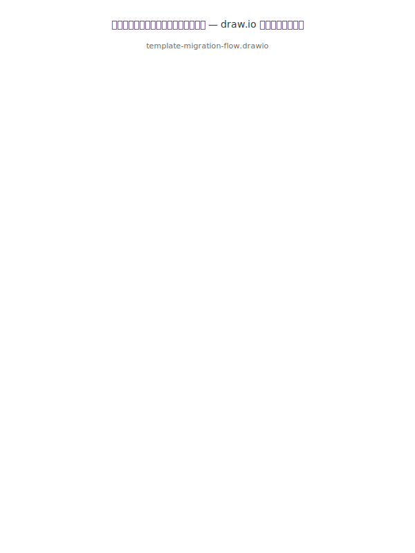

# テンプレートマイグレーション設計

## 概要

テンプレートバージョンが更新された際に、既存のプロジェクト（ひな形生成済み）を新バージョンに安全にマイグレーションする仕組み。Three-way Merge を用いて、ユーザーのカスタマイズを保持しつつテンプレート変更を適用する。

## 設計思想

- Copier inspired migration approach with k1s0-native implementation
- テンプレートとユーザーカスタマイズの分離
- 非破壊的マイグレーション（ユーザー変更を破壊しない）
- ドライラン対応（実際の変更前にプレビュー）
- ロールバック可能（マイグレーション前の状態に復元）

## .k1s0-template.yaml 仕様

テンプレートから生成されたプロジェクトのルートに配置されるメタデータファイル:

```yaml
apiVersion: k1s0/v1
kind: TemplateInstance
metadata:
  name: task-server
  generatedAt: "2026-01-15T10:00:00Z"
  generatedBy: k1s0-cli@0.5.0
spec:
  template:
    type: server          # server/client/library/database
    language: rust         # go/rust/typescript/dart
    version: "1.2.0"      # テンプレートバージョン
    checksum: "sha256:abc123..."  # テンプレートのチェックサム
  parameters:
    tier: service
    serviceName: task
    apiStyles: [rest, grpc]
    database: task-db
    databaseType: postgresql
    kafka: true
    redis: true
  customizations:
    ignorePaths:            # マイグレーション時に無視するパス
      - "src/domain/**"     # ドメインロジックは常に保護
      - "migrations/**"     # マイグレーションファイルは保護
    mergeStrategy:          # ファイル別マージ戦略
      "Cargo.toml": merge   # 依存関係はマージ
      "docker-compose.yaml": merge
      ".env.example": merge
      "src/main.rs": template  # テンプレート優先
```

## CLIフロー統合

メインメニューに「テンプレートマイグレーション」を追加:

```
? 操作を選択してください
> プロジェクト初期化
  ひな形生成
  テンプレートマイグレーション    ← 新規追加
  設定スキーマ型生成
  ...
```

### マイグレーションフロー

```
[ステップ 1] マイグレーション対象の選択
? マイグレーション対象を選択してください
> regions/service/taskmanagement/server/rust  (v1.2.0 → v1.5.0)
  regions/system/server/rust/auth    (v1.0.0 → v1.5.0, 最新)
  regions/business/taskmanagement/server/go/ledger (v1.3.0, 最新)

[ステップ 2] 変更プレビュー（ドライラン）
? 変更をプレビューしますか？
> はい
  いいえ（直接マイグレーション）

[プレビュー表示]
テンプレート v1.2.0 → v1.5.0 の変更:
  M  Cargo.toml           (依存関係更新)
  M  src/main.rs          (エントリポイント変更)
  A  src/adapter/middleware/correlation.rs  (新規ファイル)
  D  src/adapter/middleware/logging.rs      (削除: telemetryに統合)
  C  docker-compose.yaml  (コンフリクト: ユーザー変更あり)

ユーザーカスタマイズ保護:
  S  src/domain/**         (スキップ: カスタマイズ保護)
  S  migrations/**         (スキップ: カスタマイズ保護)

[ステップ 3] コンフリクト解決
? docker-compose.yaml にコンフリクトがあります。解決方法を選択してください
> テンプレート版を採用
  ユーザー版を維持
  マージエディタで編集
  スキップ（後で手動解決）

[ステップ 4] 確認
[確認] 以下のマイグレーションを実行します。よろしいですか？
    対象:       regions/service/taskmanagement/server/rust
    バージョン: v1.2.0 → v1.5.0
    変更:       3 ファイル更新, 1 ファイル追加, 1 ファイル削除
    コンフリクト: 0 件（解決済み）
    > はい
      いいえ（前のステップに戻る）
      キャンセル（メインメニューに戻る）
```

## Three-way Merge アルゴリズム

- **Base**: 元テンプレートバージョンで生成されたファイル（.k1s0-template.yaml の checksum から復元）
- **Ours**: 現在のユーザーファイル（カスタマイズ含む）
- **Theirs**: 新テンプレートバージョンで生成されるファイル
- **マージ結果** = Ours + (Theirs - Base) — ユーザー変更を保持しつつテンプレート差分を適用

### マージ戦略

| 戦略 | 説明 | 適用例 |
| --- | --- | --- |
| merge | Three-way Merge | Cargo.toml, package.json, docker-compose.yaml |
| template | テンプレート優先（ユーザー変更を上書き） | src/main.rs, Dockerfile |
| user | ユーザー優先（テンプレート変更を無視） | .env, src/domain/** |
| ask | コンフリクト時にユーザーに確認 | デフォルト |

## Rust実装概要

- `CLI/src/commands/migrate/` ディレクトリに実装
- `similar` crateでdiff/merge、`dialoguer`で対話、`tempfile`でバックアップ
- `.k1s0-template.yaml` のパース: `serde_yaml`
- テンプレートバージョン管理: CLI内蔵テンプレートのバージョンを参照

## ロールバック

マイグレーション実行前に `.k1s0-backup/` ディレクトリにバックアップを作成。

```
$ k1s0
? 操作を選択してください
> テンプレートマイグレーション
? マイグレーション操作を選択してください
> マイグレーション実行
  ロールバック
```

## 関連ドキュメント

- [CLIフロー](../flow/CLIフロー.md)
- [マイグレーション管理設計](マイグレーション管理設計.md)
- [テンプレート仕様-サーバー](../../templates/server/サーバー.md)
- [テンプレートエンジン仕様](../../templates/engine/テンプレートエンジン仕様.md)
- 
- 
