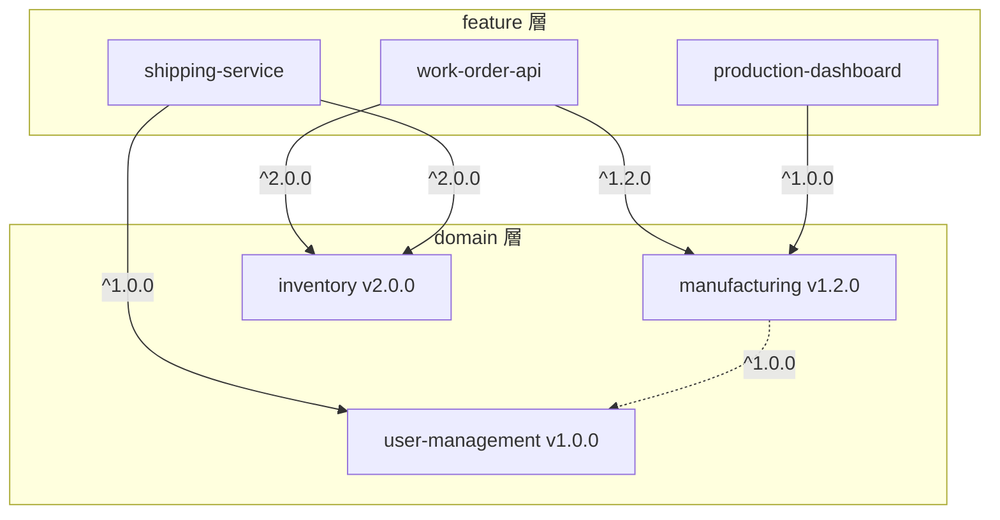

# domain 層設計

## 概要

domain 層は、k1s0 の3層アーキテクチャ（framework -> domain -> feature）における中間層です。
特定の業務領域に共通するビジネスロジックを一元管理し、複数の feature から共有できるようにします。

## domain の責務

domain 層は以下を提供します。

### 1. エンティティ（Entities）

ビジネスドメインの核となるオブジェクト。一意の識別子を持ち、ライフサイクルを通じて同一性を維持します。

```rust
// domain/backend/rust/manufacturing/src/domain/entities/work_order.rs
pub struct WorkOrder {
    pub id: WorkOrderId,
    pub product: ProductReference,
    pub quantity: Quantity,
    pub status: WorkOrderStatus,
    pub scheduled_start: DateTime<Utc>,
}
```

### 2. 値オブジェクト（Value Objects）

不変で同一性を持たないオブジェクト。属性の組み合わせで等価性を判断します。

```rust
// domain/backend/rust/manufacturing/src/domain/value_objects/quantity.rs
#[derive(Clone, Debug, PartialEq)]
pub struct Quantity {
    value: u32,
    unit: QuantityUnit,
}

impl Quantity {
    pub fn new(value: u32, unit: QuantityUnit) -> Result<Self, ValidationError> {
        if value == 0 {
            return Err(ValidationError::ZeroQuantity);
        }
        Ok(Self { value, unit })
    }
}
```

### 3. ドメインサービス（Domain Services）

エンティティや値オブジェクトに自然に属さないビジネスロジック。

```rust
// domain/backend/rust/manufacturing/src/domain/services/scheduling.rs
pub struct SchedulingService;

impl SchedulingService {
    pub fn calculate_completion_date(
        &self,
        work_order: &WorkOrder,
        capacity: &ProductionCapacity,
    ) -> DateTime<Utc> {
        // スケジューリングロジック
    }
}
```

### 4. リポジトリインターフェース

データアクセス層の抽象化。実装は feature 層で行う。

```rust
// domain/backend/rust/manufacturing/src/domain/repositories/work_order_repository.rs
#[async_trait]
pub trait WorkOrderRepository: Send + Sync {
    async fn find_by_id(&self, id: &WorkOrderId) -> Result<Option<WorkOrder>, DomainError>;
    async fn save(&self, work_order: &WorkOrder) -> Result<(), DomainError>;
}
```

### 5. アプリケーションサービス

ユースケースの共通部分。feature 固有のユースケースは feature 層で実装。

```rust
// domain/backend/rust/manufacturing/src/application/services/work_order_service.rs
pub struct WorkOrderService<R: WorkOrderRepository> {
    repository: R,
    scheduling: SchedulingService,
}

impl<R: WorkOrderRepository> WorkOrderService<R> {
    pub async fn create_work_order(&self, command: CreateWorkOrderCommand) -> Result<WorkOrder, DomainError> {
        // 共通のビジネスロジック
    }
}
```

## domain の作成

### コマンド

```bash
k1s0 new-domain --type backend-rust --name manufacturing
k1s0 new-domain --type backend-rust --name manufacturing --with-events --version 1.0.0
k1s0 new-domain --type backend-rust --name manufacturing --with-events --with-repository
```

### new-domain オプション

| オプション | デフォルト | 説明 |
|-----------|-----------|------|
| `--with-events` | false | ドメインイベント雛形を含める |
| `--with-repository` | true | リポジトリ trait/interface を含める |
| `--version` | 0.1.0 | 初期バージョン |

### 生成されるディレクトリ構造

```
domain/backend/rust/manufacturing/
├── .k1s0/
│   └── manifest.json
├── Cargo.toml
├── README.md
├── CHANGELOG.md
├── src/
│   ├── lib.rs
│   ├── domain/
│   │   ├── mod.rs
│   │   ├── entities/
│   │   │   ├── mod.rs
│   │   │   └── sample_entity.rs      # サンプルエンティティ
│   │   ├── value_objects/
│   │   │   ├── mod.rs
│   │   │   └── sample_value.rs       # サンプル値オブジェクト
│   │   ├── repositories/             # --with-repository 有効時
│   │   │   ├── mod.rs
│   │   │   └── sample_repository.rs
│   │   ├── events/                   # --with-events 有効時
│   │   │   ├── mod.rs
│   │   │   └── sample_event.rs
│   │   └── services/
│   │       └── mod.rs
│   ├── application/
│   │   ├── mod.rs
│   │   └── services/
│   │       └── mod.rs
│   └── infrastructure/
│       ├── mod.rs
│       └── repositories/
│           └── mod.rs
└── tests/
    └── integration_test.rs           # 統合テスト
```

### テンプレート強化（v0.1.7）

v0.1.7 以降、`new-domain` で生成されるテンプレートには以下のサンプルコードが含まれます。

#### サンプルエンティティ（ID newtype パターン）

エンティティの ID を newtype パターンでラップし、型安全性を確保します。

```rust
// src/domain/entities/sample_entity.rs
#[derive(Clone, Debug, PartialEq, Eq, Hash)]
pub struct ManufacturingId(uuid::Uuid);

impl ManufacturingId {
    pub fn new() -> Self {
        Self(uuid::Uuid::new_v4())
    }
}

pub struct SampleEntity {
    pub id: ManufacturingId,
    pub name: String,
}
```

#### サンプル値オブジェクト（バリデーション付き）

値オブジェクトのコンストラクタでバリデーションを行い、不正な値の生成を防ぎます。

```rust
// src/domain/value_objects/sample_value.rs
#[derive(Clone, Debug, PartialEq)]
pub struct SampleValue {
    value: String,
}

impl SampleValue {
    pub fn new(value: impl Into<String>) -> Result<Self, ValidationError> {
        let value = value.into();
        if value.is_empty() {
            return Err(ValidationError::Empty("SampleValue"));
        }
        Ok(Self { value })
    }
}
```

#### リポジトリ trait（`--with-repository` 有効時）

feature 層で実装するリポジトリのインターフェースを定義します。デフォルトで有効です。

```rust
// src/domain/repositories/sample_repository.rs
#[async_trait]
pub trait SampleRepository: Send + Sync {
    async fn find_by_id(&self, id: &ManufacturingId) -> Result<Option<SampleEntity>, DomainError>;
    async fn save(&self, entity: &SampleEntity) -> Result<(), DomainError>;
    async fn delete(&self, id: &ManufacturingId) -> Result<(), DomainError>;
}
```

#### ドメインイベント雛形（`--with-events` 有効時）

k1s0-domain-event クレートと連携するイベント定義の雛形です。

```rust
// src/domain/events/sample_event.rs
use k1s0_domain_event::DomainEvent;

#[derive(Clone, Debug, Serialize, Deserialize)]
pub struct SampleCreated {
    pub id: ManufacturingId,
    pub name: String,
    pub occurred_at: DateTime<Utc>,
}

impl DomainEvent for SampleCreated {
    fn event_type(&self) -> &str {
        "manufacturing.sample.created"
    }
}
```

#### 統合テスト

生成される統合テストは、サンプルエンティティと値オブジェクトの基本動作を検証します。

```rust
// tests/integration_test.rs
#[test]
fn test_sample_entity_creation() {
    let entity = SampleEntity {
        id: ManufacturingId::new(),
        name: "test".to_string(),
    };
    assert!(!entity.name.is_empty());
}

#[test]
fn test_sample_value_validation() {
    assert!(SampleValue::new("valid").is_ok());
    assert!(SampleValue::new("").is_err());
}
```

### manifest.json

```json
{
  "schema_version": "1.0.0",
  "k1s0_version": "0.1.0",
  "template": {
    "name": "backend-rust",
    "version": "0.1.0",
    "source": "local",
    "path": "CLI/templates/backend-rust/domain",
    "fingerprint": "..."
  },
  "service": {
    "service_name": "manufacturing",
    "language": "rust",
    "type": "backend"
  },
  "layer": "domain",
  "version": "0.1.0",
  "min_framework_version": "0.1.0",
  "dependencies": {
    "framework": ["k1s0-error", "k1s0-config"]
  }
}
```

## バージョン管理

### SemVer ルール

domain は Semantic Versioning に従います。

- **MAJOR**: 破壊的変更（API 非互換）
- **MINOR**: 後方互換な機能追加
- **PATCH**: 後方互換なバグ修正

### バージョン更新

```bash
# 現在のバージョンを確認
k1s0 domain version --name manufacturing

# バージョンを更新
k1s0 domain version --name manufacturing --bump minor
```

### 破壊的変更の記録

manifest.json に breaking_changes を記録します。

```json
{
  "version": "2.0.0",
  "breaking_changes": {
    "2.0.0": "WorkOrder.quantity を Quantity 値オブジェクトに変更",
    "1.0.0": "初回リリース"
  }
}
```

## domain への依存

### feature から domain への依存

```bash
k1s0 new-feature --type backend-rust --name work-order-api --domain manufacturing
```

feature の manifest.json:

```json
{
  "layer": "feature",
  "domain": "manufacturing",
  "domain_version": "^1.2.0",
  "dependencies": {
    "domain": {
      "manufacturing": "^1.2.0"
    }
  }
}
```

### 依存の更新

```bash
k1s0 feature update-domain --name work-order-api --domain manufacturing --version "^2.0.0"
```

## 非推奨化

domain を非推奨にする場合は、manifest.json に deprecated を設定します。

```json
{
  "deprecated": {
    "since": "1.5.0",
    "migrate_to": "manufacturing-v2",
    "deadline": "2026-12-31",
    "reason": "新しい manufacturing-v2 domain に機能を統合"
  }
}
```

非推奨の domain を使用している feature は、`k1s0 lint` で K044 警告が表示されます。

## ドメインカタログ

`domain-catalog` コマンドで、プロジェクト内の全ドメインを一覧表示できます。

```bash
# ドメイン一覧を表形式で表示
k1s0 domain-catalog

# 非推奨ドメインも含めて表示
k1s0 domain-catalog --include-deprecated

# 言語でフィルタリング
k1s0 domain-catalog --language rust

# JSON 出力
k1s0 domain-catalog --json
```

### 出力例

```
NAME              TYPE     LANGUAGE  VERSION  STATUS      DEPENDENTS
manufacturing     backend  rust      1.2.0    active      3
inventory         backend  rust      2.0.0    active      2
user-management   backend  go        1.0.0    active      5
billing           backend  rust      0.5.0    deprecated  1
```

| カラム | 説明 |
|--------|------|
| NAME | ドメイン名 |
| TYPE | バックエンド/フロントエンドの種別 |
| LANGUAGE | 実装言語（rust, go, react, flutter） |
| VERSION | 現在のバージョン |
| STATUS | active または deprecated |
| DEPENDENTS | このドメインに依存している feature の数 |

## ドメイン依存グラフ

`domain-graph` コマンドで、ドメイン間および feature-domain 間の依存関係をグラフとして可視化できます。

```bash
# Mermaid 形式で依存グラフを出力
k1s0 domain-graph

# DOT 形式で出力
k1s0 domain-graph --format dot

# 特定ドメインのサブグラフ
k1s0 domain-graph --root manufacturing

# 循環依存の検出
k1s0 domain-graph --detect-cycles
```

### Mermaid 出力例

````markdown

````

`--detect-cycles` を指定した場合、循環依存が検出されるとエラーコードとともに該当するドメインの一覧が出力されます。これは Lint ルール K043 と同等のチェックを行います。

## Lint ルール

domain に関連する Lint ルール。

| ID | 説明 |
|----|------|
| K040 | 層間依存の基本違反 |
| K041 | domain が見つからない |
| K042 | domain バージョン制約不整合 |
| K043 | 循環依存の検出 |
| K044 | 非推奨 domain の使用 |
| K045 | min_framework_version 違反 |
| K046 | breaking_changes の影響 |
| K047 | domain 層の version 未設定 |

## ベストプラクティス

### 1. domain の粒度

- **細かすぎない**: 1つの domain に 2-3 以上の関連エンティティをまとめる
- **大きすぎない**: 100ファイル以上になったら分割を検討
- **業務境界**: Bounded Context（境界づけられたコンテキスト）に沿う

### 2. 命名規則

- kebab-case を使用: `manufacturing`, `inventory`, `user-management`
- 技術用語を避ける: `database-access` ではなく業務名
- 予約語を避ける: `framework`, `feature`, `domain`, `k1s0`, `common`, `shared`

### 3. 依存の最小化

- framework への依存は必要最小限に
- 他の domain への依存は慎重に（循環依存のリスク）

### 4. テスト

- domain 層は単体テスト可能に設計
- 外部依存（DB、外部API）はモック化
- `tests/` ディレクトリに統合テストを配置

## 関連ドキュメント

- [ADR-0006: 3層アーキテクチャ](../adr/ADR-0006-three-layer-architecture.md)
- [Clean Architecture](../architecture/clean-architecture.md)
- [Lint ルール](lint.md)
