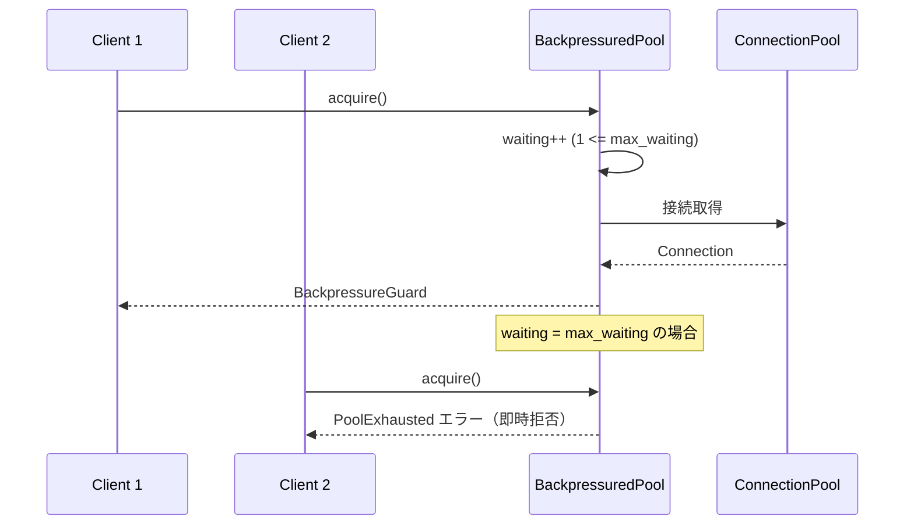

# k1s0-backpressure

## 目的

マイクロサービスの各レイヤーにおけるバックプレッシャー制御を標準化する。DB コネクションプール、gRPC ストリーミング、ドメインイベントバスの3つの主要コンポーネントに対して、統一的なバックプレッシャー機構を提供する。

本設計は [ADR-0016: バックプレッシャー制御機構](../../adr/ADR-0016-backpressure-control.md) に基づく。

## 設計原則

- **オプトイン**: 既存 API を変更せず、ラッパーとして提供する
- **多層防御**: フロントエンドスロットル -> レート制限 -> サーキットブレーカー -> プールバックプレッシャー
- **可観測性**: 全コンポーネントが `k1s0_` プレフィクスの Prometheus メトリクスを公開

## アーキテクチャ概要

```
k1s0-backpressure（各パッケージに分散実装）
├── k1s0-db/pool          # BackpressuredPool（待機キュー上限）
├── k1s0-grpc-server/stream  # FlowControlledSender（送信バッファ制御）
├── k1s0-grpc-client/stream  # FlowControlledReceiver（受信バッファ制御）
└── k1s0-domain-event/bus    # BackpressureStrategy（イベントバスオーバーフロー戦略）
```

## 1. DB コネクションプール バックプレッシャー

### 概要

`BackpressuredPool` は既存のコネクションプールをラップし、接続取得の待機キューに上限を設ける。待機数が `max_waiting` を超えた場合、新たな取得要求を即時拒否してカスケード障害を防止する。

### シーケンス図



### API（Rust）

```rust
use k1s0_db::pool::{BackpressuredPool, BackpressuredPoolConfig};

// 設定
let config = BackpressuredPoolConfig::default()
    .with_max_waiting(50)          // 最大待機数
    .with_acquire_timeout_ms(5_000); // タイムアウト

let bp_pool = BackpressuredPool::new(config);

// 接続取得（待機キュー満杯で即時拒否）
let mut guard = bp_pool.acquire().await?;
guard.mark_acquired();
// ... DB 操作 ...
drop(guard); // スロット解放

// タイムアウト付き取得
let mut guard = bp_pool.acquire_timeout().await?;
guard.mark_acquired();

// メトリクス取得
let snap = bp_pool.metrics().snapshot();
println!("active={}, waiting={}, rejected={}",
    snap.active_connections, snap.waiting_count, snap.rejected_total);
```

### API（Go）

```go
import k1s0db "github.com/example/k1s0/framework/backend/go/k1s0-db"

// 設定
config := k1s0db.DefaultBackpressuredPoolConfig()
config.MaxWaiting = 50
config.AcquireTimeout = 5 * time.Second

bp := k1s0db.NewBackpressuredPool(pool, *config)

// 接続取得（待機数超過で ErrPoolBackpressure）
if err := bp.Acquire(ctx); err != nil {
    if errors.Is(err, k1s0db.ErrPoolBackpressure) {
        // 過負荷: リクエストを拒否
    }
}

// メトリクス取得
stats := bp.Stats()
fmt.Printf("active=%d, waiting=%d, rejected=%d\n",
    stats.ActiveConnections, stats.WaitingCount, stats.RejectedTotal)
```

## 2. gRPC ストリーミング バックプレッシャー

### 概要

gRPC サーバストリーミングとクライアントストリーミングの両方に対して、セマフォベースのフロー制御を提供する。バッファ容量を超えた送受信をブロックまたは拒否することで、OOM リスクを排除する。

| コンポーネント | クラス | 方向 | デフォルトバッファ |
|---------------|--------|------|------------------|
| `k1s0-grpc-server` | `FlowControlledSender` | サーバ -> クライアント | 64 |
| `k1s0-grpc-client` | `FlowControlledReceiver` | サーバ -> クライアント（受信側） | 32 |

### API（Rust - サーバ側送信）

```rust
use k1s0_grpc_server::stream::{FlowControlledSender, StreamBackpressureConfig};

// 設定から作成
let config = StreamBackpressureConfig {
    send_buffer_size: 64,
    slow_producer_timeout_ms: 30_000,
};
let sender = FlowControlledSender::from_config(&config);

// ブロッキング取得（バッファ空きまで待機）
let permit = sender.acquire().await?;
// ... メッセージ送信 ...
drop(permit); // バッファスロット解放

// タイムアウト付き取得
let permit = sender.acquire_timeout(5_000).await?;

// 非ブロッキング試行
match sender.try_acquire() {
    Ok(permit) => { /* 送信可能 */ }
    Err(StreamBackpressureError::BufferFull) => { /* バッファ満杯 */ }
}

// メトリクス
let usage = sender.metrics().buffer_usage();     // 0.0 - 1.0
let count = sender.metrics().backpressure_count(); // バックプレッシャー発生回数
```

### API（Rust - クライアント側受信）

```rust
use k1s0_grpc_client::stream::{FlowControlledReceiver, StreamRecvConfig};

let config = StreamRecvConfig {
    recv_buffer_size: 32,
    slow_consumer_timeout_ms: 30_000,
};
let receiver = FlowControlledReceiver::from_config(&config);

// 受信前にスロット確保
let permit = receiver.acquire().await?;
// ... メッセージ受信・処理 ...
drop(permit); // 処理完了後にスロット解放
```

### API（Go - サーバ側送信）

```go
import k1s0grpc "github.com/example/k1s0/framework/backend/go/k1s0-grpc-server"

config := k1s0grpc.DefaultStreamBackpressureConfig()
config.SendBufferSize = 16
config.SlowProducerTimeout = 5 * time.Second

stream := k1s0grpc.NewFlowControlledStream(config)

// スロット取得（タイムアウトまたはコンテキストキャンセルでエラー）
if err := stream.Acquire(ctx); err != nil {
    if errors.Is(err, k1s0grpc.ErrStreamBackpressure) {
        // バッファ満杯
    }
}
defer stream.Release()
// ... メッセージ送信 ...

// メトリクス
stats := stream.Stats()
fmt.Printf("buffer_usage=%.2f, backpressure=%d\n",
    stats.BufferUsage, stats.BackpressureCount)
```

## 3. ドメインイベントバス バックプレッシャー

### 概要

`InMemoryEventBus` のブロードキャストチャネルが満杯になった場合の振る舞いを `BackpressureStrategy` で制御する。4つの戦略から用途に応じて選択できる。

### 戦略比較

| 戦略 | 満杯時の動作 | 返り値 | ユースケース |
|------|------------|--------|------------|
| `DropOldest`（デフォルト） | 古いメッセージを上書き | `Ok(())` | リアルタイム通知、最新データ優先 |
| `Block` | サブスクライバが消費するまでブロック | `Ok(())` / `Err` | イベント消失不可の処理 |
| `Reject` | 新規発行を拒否 | `Err(PublishError)` | 送信側でリトライ制御が必要な場合 |
| `DropNewest` | 送信しようとしたメッセージを破棄 | `Ok(())` | 既存バッファの保全を優先 |

### API（Rust）

```rust
use k1s0_domain_event::bus::{InMemoryEventBus, BackpressureStrategy};

// デフォルト（DropOldest, 容量 256）
let bus = InMemoryEventBus::default();

// 戦略を指定して作成
let bus = InMemoryEventBus::with_strategy(128, BackpressureStrategy::Reject);

// 発行（戦略に従って処理される）
bus.publish(envelope).await?;

// メトリクス
let metrics = bus.metrics();
println!("queue={}, dropped={}, rejected={}, lagged={}",
    metrics.queue_depth(),
    metrics.dropped_events(),
    metrics.rejected_events(),
    metrics.lagged_count());

// リカバリバッファからラグしたイベントを回収
let recovered = bus.recover_lagged(100).await;
```

## 設定リファレンス

```yaml
database:
  backpressure:
    max_waiting: 100             # 最大同時待機数（デフォルト: 100）
    acquire_timeout_ms: 5000     # 接続取得タイムアウト ms（デフォルト: 5000）

grpc:
  server:
    stream:
      send_buffer_size: 64       # 送信バッファサイズ（デフォルト: 64）
      slow_producer_timeout_ms: 30000  # 低速プロデューサタイムアウト ms（デフォルト: 30000）
  client:
    stream:
      recv_buffer_size: 32       # 受信バッファサイズ（デフォルト: 32）
      slow_consumer_timeout_ms: 30000  # 低速コンシューマタイムアウト ms（デフォルト: 30000）

domain_event:
  bus:
    capacity: 256                # イベントバス容量（デフォルト: 256）
    strategy: drop_oldest        # drop_oldest | block | reject | drop_newest
```

## メトリクスリファレンス

全メトリクスは `k1s0_` プレフィックスを使用する。

### DB コネクションプール

| メトリクス名 | 型 | 説明 |
|-------------|-----|------|
| `k1s0_pool_active_connections` | Gauge | アクティブ接続数 |
| `k1s0_pool_idle_connections` | Gauge | アイドル接続数 |
| `k1s0_pool_waiting_count` | Gauge | 現在の待機数 |
| `k1s0_pool_rejected_total` | Counter | 拒否された取得試行数 |
| `k1s0_pool_acquire_duration_seconds` | Histogram | 接続取得にかかった時間 |

### gRPC ストリーミング

| メトリクス名 | 型 | ラベル | 説明 |
|-------------|-----|--------|------|
| `k1s0_stream_buffer_usage` | Gauge | `direction` | バッファ使用率（0.0 - 1.0） |
| `k1s0_stream_backpressure_total` | Counter | `direction` | バックプレッシャー発生回数 |

### ドメインイベントバス

| メトリクス名 | 型 | 説明 |
|-------------|-----|------|
| `k1s0_eventbus_queue_depth` | Gauge | 現在のキュー深度 |
| `k1s0_eventbus_dropped_total` | Counter | 破棄されたイベント数 |
| `k1s0_eventbus_rejected_total` | Counter | 拒否されたイベント数 |
| `k1s0_eventbus_lagged_total` | Counter | サブスクライバラグ発生回数 |

## 全言語対応

バックプレッシャー制御は各言語のフレームワークパッケージに分散して実装されている。

| 言語 | DB プール | gRPC ストリーム | イベントバス |
|------|----------|----------------|------------|
| Rust | `k1s0-db` | `k1s0-grpc-server` / `k1s0-grpc-client` | `k1s0-domain-event` |
| Go | `k1s0-db` | `k1s0-grpc-server` | `k1s0-domain-event` |
| C# | `K1s0.Db` | `K1s0.Grpc.Server` / `K1s0.Grpc.Client` | `K1s0.DomainEvent` |
| Python | `k1s0-db` | `k1s0-grpc-server` / `k1s0-grpc-client` | `k1s0-domain-event` |
| Kotlin | `k1s0-db` | `k1s0-grpc-server` / `k1s0-grpc-client` | `k1s0-domain-event` |

各言語の API は同一の設計思想に基づき、言語の慣習に合わせて実装されている。設定キーとメトリクス名は全言語で共通である。

## 関連パッケージとの棲み分け

| パッケージ | 責務 | バックプレッシャーとの関係 |
|-----------|------|------------------------|
| `k1s0-rate-limit` | 外部からのリクエストレート制限 | バックプレッシャーの前段防御 |
| `k1s0-resilience` | サーキットブレーカー、リトライ | バックプレッシャー発生時の障害伝播防止 |
| `k1s0-health` | ヘルスチェック | バックプレッシャーメトリクスを readiness に反映可能 |

## 関連ドキュメント

- [ADR-0016: バックプレッシャー制御機構](../../adr/ADR-0016-backpressure-control.md)
- [ADR-0015: レート制限フレームワーク](../../adr/ADR-0015-rate-limiting.md)
