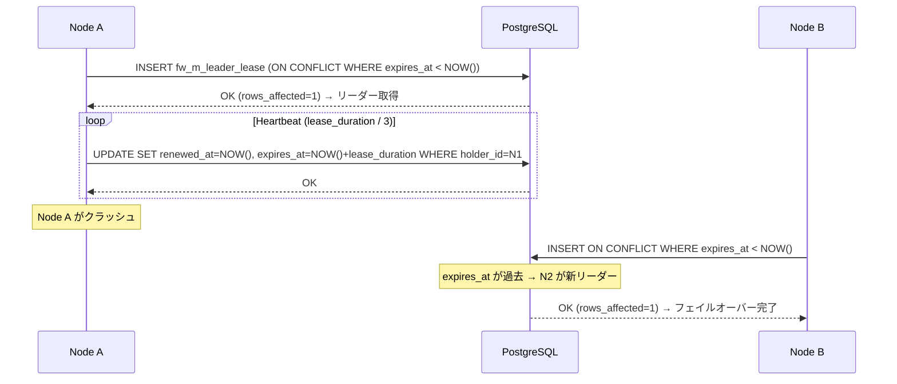
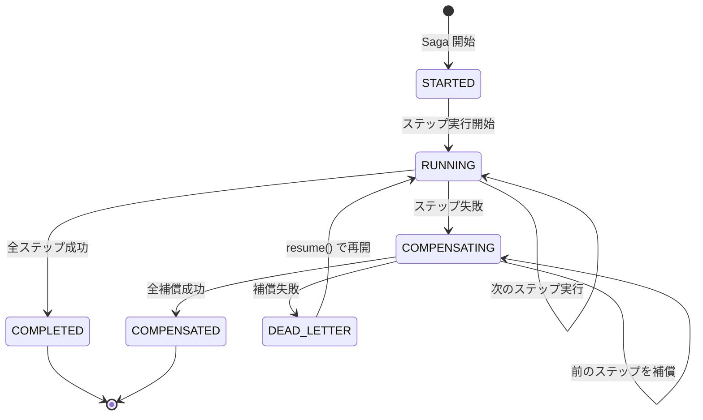
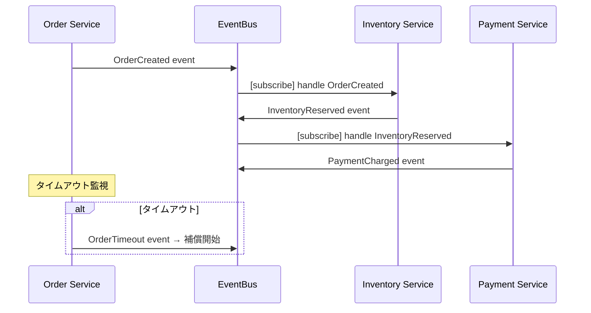

# k1s0-consensus

## 目的

マイクロサービス間の分散合意プロトコルを標準化する。リーダー選出、分散ロック、Saga パターン（オーケストレーション/コレオグラフィ）を全バックエンド言語（Rust, Go, C#, Python, Kotlin）で統一 API として提供する。

## Tier

**Tier 2** — 以下に依存:
- Tier 1: `k1s0-error`, `k1s0-config`
- Tier 2: `k1s0-db`, `k1s0-domain-event`, `k1s0-observability`
- 外部: `prometheus` 系、`redis`、`uuid`、`chrono`

## アーキテクチャ概要

```
k1s0-consensus
├── leader/          # リーダー選出（DB ベースリース）
├── lock/            # 分散ロック（DB / Redis）
├── saga/            # Saga パターン
│   ├── orchestrator # オーケストレーション型
│   └── choreography # コレオグラフィ型（domain-event 連携）
└── config           # YAML 設定
```

## 1. リーダー選出（Leader Election）

### 概要

DB ベースのリース方式によるリーダー選出。ハートビートによる死活監視、自動フェイルオーバー、リーダー変更の watch 通知を提供する。

### シーケンス図



### DB テーブル

```sql
CREATE TABLE fw_m_leader_lease (
    lease_key       VARCHAR(255) PRIMARY KEY,
    holder_id       VARCHAR(255) NOT NULL,
    acquired_at     TIMESTAMPTZ  NOT NULL DEFAULT NOW(),
    renewed_at      TIMESTAMPTZ  NOT NULL DEFAULT NOW(),
    expires_at      TIMESTAMPTZ  NOT NULL,
    fence_token     BIGINT       NOT NULL DEFAULT 0,
    metadata        JSONB
);
CREATE INDEX idx_leader_lease_expires ON fw_m_leader_lease (expires_at);
```

### API（Rust）

```rust
#[async_trait]
pub trait LeaderElector: Send + Sync {
    async fn try_acquire(&self, lease_key: &str) -> Result<Option<LeaderLease>, ConsensusError>;
    async fn renew(&self, lease: &LeaderLease) -> Result<bool, ConsensusError>;
    async fn release(&self, lease: &LeaderLease) -> Result<(), ConsensusError>;
    async fn current_leader(&self, lease_key: &str) -> Result<Option<String>, ConsensusError>;
    async fn watch(&self, lease_key: &str) -> Result<LeaderWatcher, ConsensusError>;
}
```

## 2. 分散ロック（Distributed Lock）

### 概要

DB ベースと Redis ベースの2種類の分散ロックを提供。TTL による自動解放、フェンシングトークンによる安全なロック検証を含む。

### フェンシングトークン

フェンシングトークンは単調増加する整数値で、GC 停止やネットワーク遅延によりリースが期限切れした後に、古いクライアントがロック保護された操作を続行するリスクを防止する。

```
Client A: lock(token=33) → [GC pause] → write(token=33) → REJECTED (token < 34)
Client B: lock(token=34) → write(token=34) → OK
```

ロック保護された外部リソース（DB、キャッシュ等）への書き込み時に、フェンシングトークンを検証することで安全性を保証する。

### DB テーブル

```sql
CREATE TABLE fw_m_distributed_lock (
    lock_key        VARCHAR(255) PRIMARY KEY,
    holder_id       VARCHAR(255) NOT NULL,
    fence_token     BIGINT       NOT NULL DEFAULT 0,
    acquired_at     TIMESTAMPTZ  NOT NULL DEFAULT NOW(),
    expires_at      TIMESTAMPTZ  NOT NULL,
    metadata        JSONB
);
CREATE INDEX idx_distributed_lock_expires ON fw_m_distributed_lock (expires_at);
```

### API（Rust）

```rust
#[async_trait]
pub trait DistributedLock: Send + Sync {
    async fn try_lock(&self, key: &str, ttl: Duration) -> Result<Option<LockGuard>, ConsensusError>;
    async fn lock(&self, key: &str, ttl: Duration, timeout: Duration) -> Result<LockGuard, ConsensusError>;
    async fn extend(&self, guard: &LockGuard, ttl: Duration) -> Result<bool, ConsensusError>;
    async fn unlock(&self, guard: LockGuard) -> Result<(), ConsensusError>;
}
```

`LockGuard` は Drop 時に自動解放される。

## 3. Saga オーケストレーション

### 概要

ステップ定義 → 正方向実行 → 失敗時補償（逆順）のオーケストレーション型 Saga。状態の DB 永続化、リトライ、デッドレターキューを含む。

### ステート図



### DB テーブル

```sql
CREATE TABLE fw_m_saga_instance (
    saga_id         UUID         PRIMARY KEY DEFAULT gen_random_uuid(),
    saga_type       VARCHAR(255) NOT NULL,
    status          VARCHAR(50)  NOT NULL DEFAULT 'STARTED',
    current_step    INT          NOT NULL DEFAULT 0,
    payload         JSONB        NOT NULL,
    error_message   TEXT,
    created_at      TIMESTAMPTZ  NOT NULL DEFAULT NOW(),
    updated_at      TIMESTAMPTZ  NOT NULL DEFAULT NOW(),
    completed_at    TIMESTAMPTZ
);

CREATE TABLE fw_m_saga_step (
    id              UUID         PRIMARY KEY DEFAULT gen_random_uuid(),
    saga_id         UUID         NOT NULL REFERENCES fw_m_saga_instance(saga_id),
    step_index      INT          NOT NULL,
    step_name       VARCHAR(255) NOT NULL,
    status          VARCHAR(50)  NOT NULL DEFAULT 'PENDING',
    output          JSONB,
    error_message   TEXT,
    retry_count     INT          NOT NULL DEFAULT 0,
    executed_at     TIMESTAMPTZ,
    compensated_at  TIMESTAMPTZ,
    created_at      TIMESTAMPTZ  NOT NULL DEFAULT NOW()
);
```

### API（Rust）

```rust
#[async_trait]
pub trait SagaStep<C: Send + Sync>: Send + Sync {
    fn name(&self) -> &str;
    async fn execute(&self, ctx: &mut C) -> Result<serde_json::Value, ConsensusError>;
    async fn compensate(&self, ctx: &mut C, output: &serde_json::Value) -> Result<(), ConsensusError>;
}

// ビルダーパターン
let saga = SagaDefinition::builder("order-processing")
    .step(ReserveInventoryStep)
    .step(ChargePaymentStep)
    .step(DispatchShippingStep)
    .retry_policy(RetryPolicy {
        max_retries: 3,
        backoff: BackoffStrategy::Exponential { base: Duration::from_secs(1), max: Duration::from_secs(30) },
    })
    .build();
```

## 4. Saga コレオグラフィ

### 概要

`k1s0-domain-event` の `EventBus` と連携したイベント駆動型 Saga。イベント発行 → 購読 → 次ステップ実行の非同期ワークフローをサポートする。

### イベントフロー図



### API（Rust）

```rust
#[async_trait]
pub trait EventStepHandler: Send + Sync {
    fn event_type(&self) -> &str;
    async fn handle(&self, event: &DomainEvent) -> Result<Option<DomainEvent>, ConsensusError>;
    async fn on_timeout(&self) -> Result<(), ConsensusError>;
}

let saga = ChoreographySaga::builder()
    .on_event("order.created", HandleOrderCreated)
    .on_event("inventory.reserved", HandleInventoryReserved)
    .on_event("payment.charged", HandlePaymentCharged)
    .timeout(Duration::from_secs(60))
    .build();
saga.register(&event_bus).await?;
```

## 設定リファレンス

```yaml
consensus:
  leader:
    lease_duration: 30s          # リース有効期間
    heartbeat_interval: 10s      # ハートビート間隔（lease_duration の 1/3 推奨）
    renew_retries: 3             # リース更新リトライ回数

  lock:
    default_ttl: 30s             # デフォルトロック TTL
    max_wait_timeout: 10s        # ロック待機タイムアウト
    backend: db                  # db | redis
    redis:
      url: redis://localhost:6379
      key_prefix: "k1s0:lock:"
      password_file: /var/run/secrets/k1s0/redis_password

  saga:
    max_retries: 3               # 最大リトライ回数
    backoff:
      strategy: exponential      # fixed | exponential
      base: 1s                   # ベース待機時間
      max: 30s                   # 最大待機時間
    dead_letter:
      enabled: true
      max_age: 7d                # デッドレター保持期間
    choreography:
      timeout: 60s               # コレオグラフィタイムアウト
```

## メトリクスリファレンス

全メトリクスは `k1s0_` プレフィックスを使用する。

### リーダー選出

| メトリクス名 | 型 | ラベル | 説明 |
|-------------|-----|--------|------|
| `k1s0_leader_elections_total` | Counter | `lease_key`, `result` | 選出試行数 |
| `k1s0_leader_is_leader` | Gauge | `lease_key` | 現在リーダーか（0/1） |
| `k1s0_leader_lease_duration_seconds` | Histogram | `lease_key` | リーダー保持期間 |
| `k1s0_leader_heartbeat_failures_total` | Counter | `lease_key` | ハートビート失敗数 |

### 分散ロック

| メトリクス名 | 型 | ラベル | 説明 |
|-------------|-----|--------|------|
| `k1s0_lock_acquisitions_total` | Counter | `lock_key`, `backend`, `result` | ロック取得試行数 |
| `k1s0_lock_held_duration_seconds` | Histogram | `lock_key`, `backend` | ロック保持時間 |
| `k1s0_lock_wait_duration_seconds` | Histogram | `lock_key`, `backend` | ロック待機時間 |
| `k1s0_lock_active_count` | Gauge | `backend` | 保持中ロック数 |
| `k1s0_lock_fence_token_violations_total` | Counter | `lock_key` | フェンシングトークン違反数 |

### Saga

| メトリクス名 | 型 | ラベル | 説明 |
|-------------|-----|--------|------|
| `k1s0_saga_executions_total` | Counter | `saga_type`, `result` | Saga 実行数 |
| `k1s0_saga_duration_seconds` | Histogram | `saga_type` | Saga 実行時間 |
| `k1s0_saga_step_duration_seconds` | Histogram | `saga_type`, `step_name`, `phase` | ステップ実行時間 |
| `k1s0_saga_active_count` | Gauge | `saga_type` | 実行中 Saga 数 |
| `k1s0_saga_dead_letter_count` | Gauge | `saga_type` | デッドレター数 |
| `k1s0_saga_retries_total` | Counter | `saga_type`, `step_name` | リトライ回数 |

## 冪等性ガイドライン

Saga の各ステップは冪等に設計する必要がある:

### execute の冪等性

一意キー（`saga_id` + `step_index`）で重複実行を検出する:

```rust
// 例: 在庫引当ステップ
async fn execute(&self, ctx: &mut OrderContext) -> Result<Value, ConsensusError> {
    // 冪等キーで既存の引当を確認
    let existing = self.repo.find_reservation(&ctx.saga_id, self.step_index).await?;
    if let Some(reservation) = existing {
        return Ok(json!({"reservation_id": reservation.id}));
    }
    // 新規引当を実行
    let reservation = self.repo.reserve(&ctx.order_id, &ctx.saga_id, self.step_index).await?;
    Ok(json!({"reservation_id": reservation.id}))
}
```

### compensate の冪等性

補償済みかどうかを DB で確認してからロールバックを実行する:

```rust
async fn compensate(&self, ctx: &mut OrderContext, output: &Value) -> Result<(), ConsensusError> {
    let reservation_id = output["reservation_id"].as_str().unwrap();
    // 既に補償済みなら何もしない
    let reservation = self.repo.find_reservation_by_id(reservation_id).await?;
    if reservation.is_none() || reservation.unwrap().status == "released" {
        return Ok(());
    }
    self.repo.release_reservation(reservation_id).await?;
    Ok(())
}
```

## k1s0-resilience との棲み分け

| パッケージ | 責務 | 例 |
|-----------|------|-----|
| `k1s0-resilience` | 障害への耐性 | サーキットブレーカー、リトライ、タイムアウト、セマフォ、バルクヘッド |
| `k1s0-rate-limit` | 負荷の制御 | トークンバケット、スライディングウィンドウ |
| `k1s0-consensus` | 分散合意 | リーダー選出、分散ロック、Saga（オーケストレーション/コレオグラフィ） |

## 多言語 API 例

以下に Go, C#, Python, Kotlin の主要 API を示す。Rust API は上記の各セクションを参照。

### Go

```go
// リーダー選出
elector := consensus.NewDbLeaderElector(pool, nodeID, config)
lease, err := elector.TryAcquire(ctx, "scheduler")
if err != nil {
    return err
}
if lease != nil {
    defer elector.Release(ctx, lease)
    // リーダーとして処理を実行
}

// 分散ロック
locker := consensus.NewDbDistributedLock(pool, nodeID)
guard, err := locker.TryLock(ctx, "order:123", 30*time.Second)
if err != nil {
    return err
}
if guard != nil {
    defer guard.Close()
    // ロック保護された処理
}
```

### C#

```csharp
// リーダー選出
ILeaderElector elector = new DbLeaderElector(dbContext, config);
var lease = await elector.TryAcquireAsync("scheduler", nodeId);
if (lease is not null)
{
    // リーダーとして処理を実行
    await elector.ReleaseAsync(lease);
}

// 分散ロック
IDistributedLock locker = new DbDistributedLock(dbContext, config);
var guard = await locker.TryLockAsync("order:123", nodeId, TimeSpan.FromSeconds(30));
if (guard is not null)
{
    // ロック保護された処理
    await locker.UnlockAsync("order:123", nodeId);
}
```

### Python

```python
# リーダー選出
elector = DbLeaderElector(pool, node_id=node_id, config=config)
lease = await elector.try_acquire("scheduler")
if lease is not None:
    # リーダーとして処理を実行
    await elector.release(lease)

# 分散ロック（async context manager 対応）
locker = DbDistributedLock(pool, node_id=node_id)
guard = await locker.try_lock("order:123", ttl_ms=30000)
if guard is not None:
    async with guard:
        # ロック保護された処理
        pass
```

### Kotlin

```kotlin
// リーダー選出
val elector: LeaderElector = DbLeaderElector(database, config)
val lease = elector.tryAcquire()
if (lease != null) {
    // リーダーとして処理を実行
    elector.release(lease)
}

// 分散ロック（suspendClose で解放）
val locker: DistributedLock = DbDistributedLock(database, config)
val guard = locker.tryLock("order:123", ownerId = nodeId, ttlMs = 30_000L)
if (guard != null) {
    try {
        // ロック保護された処理
    } finally {
        guard.suspendClose()
    }
}
```

## 全言語対応

| 言語 | パッケージ | 場所 |
|------|----------|------|
| Rust | `k1s0-consensus` | `framework/backend/rust/crates/k1s0-consensus/` |
| Go | `k1s0-consensus` | `framework/backend/go/k1s0-consensus/` |
| C# | `K1s0.Consensus` | `framework/backend/csharp/src/K1s0.Consensus/` |
| Python | `k1s0-consensus` | `framework/backend/python/packages/k1s0-consensus/` |
| Kotlin | `k1s0-consensus` | `framework/backend/kotlin/packages/k1s0-consensus/` |
