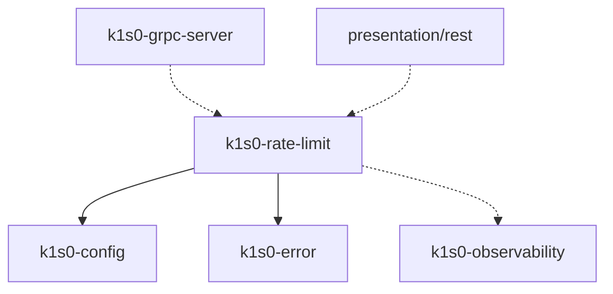

# k1s0-rate-limit

## 概要

単位時間あたりのリクエスト数を制御するレート制限ライブラリ。トークンバケットとスライディングウィンドウの 2 つのアルゴリズムを提供し、gRPC/REST ミドルウェアとしてシームレスに統合できる。

## アーキテクチャ

### Tier 配置

k1s0-rate-limit は **Tier 2** に配置する。Tier 1（k1s0-config, k1s0-error）に依存し、k1s0-observability と組み合わせてメトリクスを出力する。

```
Tier 3: k1s0-auth
          |
Tier 2: k1s0-rate-limit, k1s0-resilience, k1s0-grpc-server, ...
          |
Tier 1: k1s0-config, k1s0-error, k1s0-validation
```

### 依存関係



- 実線: 必須依存
- 点線: オプション依存（メトリクス出力、ミドルウェア統合）

## アルゴリズム

### トークンバケット（Token Bucket）

一定レートでトークンを補充し、リクエストごとにトークンを消費する。バースト対応に優れる。

| パラメータ | 説明 | デフォルト |
|-----------|------|-----------|
| `capacity` | バケット最大容量 | 100 |
| `refill_rate` | 秒あたり補充トークン数 | 10 |
| `refill_interval_ms` | 補充間隔（ミリ秒） | 100 |

```
時間 →
トークン: [████████░░] capacity=10, refill_rate=2/s
           ↑ リクエスト消費    ↑ 定期補充
```

**特徴:**
- バースト許容（capacity 分まで瞬間的に処理可能）
- 長期的には refill_rate に収束
- メモリ効率が良い（カウンタのみ）

### スライディングウィンドウ（Sliding Window）

直近の時間窓内のリクエスト数を追跡し、上限を超えたら拒否する。

| パラメータ | 説明 | デフォルト |
|-----------|------|-----------|
| `window_size_ms` | ウィンドウサイズ（ミリ秒） | 60000 |
| `max_requests` | ウィンドウ内の最大リクエスト数 | 100 |
| `precision_ms` | サブウィンドウ精度（ミリ秒） | 1000 |

**特徴:**
- 正確なレート制御（バースト非許容）
- 時間窓境界での急激な変動を精度パラメータで緩和
- トークンバケットより若干メモリ使用量が多い

### アルゴリズム選択ガイド

| ユースケース | 推奨アルゴリズム | 理由 |
|-------------|----------------|------|
| API ゲートウェイ | トークンバケット | バースト許容、シンプル |
| 課金 API | スライディングウィンドウ | 正確なレート制御が必要 |
| 内部 gRPC 通信 | トークンバケット | 低オーバーヘッド |
| ユーザー単位制限 | スライディングウィンドウ | 公平性が重要 |

## API 設計

### Rust

```rust
/// レート制限の判定結果
pub enum RateLimitResult {
    /// 許可
    Allowed,
    /// 拒否（リトライ可能時間を含む）
    Rejected { retry_after_ms: u64 },
}

/// レート制限トレイト
pub trait RateLimiter: Send + Sync {
    /// リクエストの許可/拒否を判定する
    fn try_acquire(&self, key: &str) -> RateLimitResult;

    /// 残トークン数（トークンバケットの場合）またはウィンドウ内残数を返す
    fn remaining(&self, key: &str) -> u64;

    /// レート制限をリセットする
    fn reset(&self, key: &str);
}

/// トークンバケット実装
pub struct TokenBucketLimiter {
    capacity: u64,
    refill_rate: u64,
    refill_interval_ms: u64,
}

impl TokenBucketLimiter {
    pub fn new(config: TokenBucketConfig) -> Self;
    pub fn from_yaml(config: &k1s0_config::Config) -> Result<Self, RateLimitError>;
}

impl RateLimiter for TokenBucketLimiter { /* ... */ }

/// スライディングウィンドウ実装
pub struct SlidingWindowLimiter {
    window_size_ms: u64,
    max_requests: u64,
    precision_ms: u64,
}

impl SlidingWindowLimiter {
    pub fn new(config: SlidingWindowConfig) -> Self;
    pub fn from_yaml(config: &k1s0_config::Config) -> Result<Self, RateLimitError>;
}

impl RateLimiter for SlidingWindowLimiter { /* ... */ }

/// エラー型
pub struct RateLimitError {
    kind: RateLimitErrorKind,
    message: String,
}

pub enum RateLimitErrorKind {
    Rejected,
    ConfigError,
}

impl RateLimitError {
    pub fn rejected(retry_after_ms: u64) -> Self;
    pub fn error_code(&self) -> &'static str;
}
```

### Go

```go
// RateLimitResult はレート制限の判定結果。
type RateLimitResult struct {
    Allowed       bool
    RetryAfterMs  uint64
}

// RateLimiter はレート制限インターフェース。
type RateLimiter interface {
    TryAcquire(ctx context.Context, key string) RateLimitResult
    Remaining(key string) uint64
    Reset(key string)
}

// TokenBucketConfig はトークンバケット設定。
type TokenBucketConfig struct {
    Capacity         uint64 `yaml:"capacity"`
    RefillRate       uint64 `yaml:"refill_rate"`
    RefillIntervalMs uint64 `yaml:"refill_interval_ms"`
}

func NewTokenBucketLimiter(config TokenBucketConfig) RateLimiter

// SlidingWindowConfig はスライディングウィンドウ設定。
type SlidingWindowConfig struct {
    WindowSizeMs uint64 `yaml:"window_size_ms"`
    MaxRequests  uint64 `yaml:"max_requests"`
    PrecisionMs  uint64 `yaml:"precision_ms"`
}

func NewSlidingWindowLimiter(config SlidingWindowConfig) RateLimiter
```

### C#

```csharp
public enum RateLimitResultType { Allowed, Rejected }

public record RateLimitResult(RateLimitResultType Type, ulong RetryAfterMs = 0);

public interface IRateLimiter
{
    RateLimitResult TryAcquire(string key);
    ulong Remaining(string key);
    void Reset(string key);
}

public class TokenBucketLimiter : IRateLimiter
{
    public TokenBucketLimiter(TokenBucketConfig config);
}

public class SlidingWindowLimiter : IRateLimiter
{
    public SlidingWindowLimiter(SlidingWindowConfig config);
}

public record TokenBucketConfig(ulong Capacity, ulong RefillRate, ulong RefillIntervalMs);
public record SlidingWindowConfig(ulong WindowSizeMs, ulong MaxRequests, ulong PrecisionMs);
```

### Python

```python
from enum import Enum
from dataclasses import dataclass
from abc import ABC, abstractmethod

class RateLimitResultType(Enum):
    ALLOWED = "allowed"
    REJECTED = "rejected"

@dataclass
class RateLimitResult:
    type: RateLimitResultType
    retry_after_ms: int = 0

class RateLimiter(ABC):
    @abstractmethod
    def try_acquire(self, key: str) -> RateLimitResult: ...

    @abstractmethod
    def remaining(self, key: str) -> int: ...

    @abstractmethod
    def reset(self, key: str) -> None: ...

@dataclass
class TokenBucketConfig:
    capacity: int = 100
    refill_rate: int = 10
    refill_interval_ms: int = 100

class TokenBucketLimiter(RateLimiter):
    def __init__(self, config: TokenBucketConfig) -> None: ...

@dataclass
class SlidingWindowConfig:
    window_size_ms: int = 60000
    max_requests: int = 100
    precision_ms: int = 1000

class SlidingWindowLimiter(RateLimiter):
    def __init__(self, config: SlidingWindowConfig) -> None: ...
```

### Kotlin

```kotlin
enum class RateLimitResultType { Allowed, Rejected }

data class RateLimitResult(
    val type: RateLimitResultType,
    val retryAfterMs: Long = 0
)

interface RateLimiter {
    fun tryAcquire(key: String): RateLimitResult
    fun remaining(key: String): Long
    fun reset(key: String)
}

data class TokenBucketConfig(
    val capacity: Long = 100,
    val refillRate: Long = 10,
    val refillIntervalMs: Long = 100
)

class TokenBucketLimiter(config: TokenBucketConfig) : RateLimiter

data class SlidingWindowConfig(
    val windowSizeMs: Long = 60000,
    val maxRequests: Long = 100,
    val precisionMs: Long = 1000
)

class SlidingWindowLimiter(config: SlidingWindowConfig) : RateLimiter
```

## ミドルウェア統合

### gRPC インターセプタ

```rust
// Rust (tonic)
use k1s0_rate_limit::{RateLimiter, TokenBucketLimiter};

pub struct RateLimitInterceptor<L: RateLimiter> {
    limiter: Arc<L>,
    key_extractor: Box<dyn Fn(&Request<()>) -> String + Send + Sync>,
}

impl<L: RateLimiter> RateLimitInterceptor<L> {
    pub fn new(limiter: Arc<L>) -> Self;
    pub fn with_key_extractor(self, f: impl Fn(&Request<()>) -> String + Send + Sync + 'static) -> Self;
}
```

```go
// Go (grpc)
func UnaryRateLimitInterceptor(limiter RateLimiter) grpc.UnaryServerInterceptor
func StreamRateLimitInterceptor(limiter RateLimiter) grpc.StreamServerInterceptor
```

### REST ミドルウェア

```rust
// Rust (axum)
pub fn rate_limit_layer<L: RateLimiter + 'static>(limiter: Arc<L>) -> RateLimitLayer<L>;
```

```go
// Go (net/http)
func RateLimitMiddleware(limiter RateLimiter) func(http.Handler) http.Handler
```

レート制限を超えた場合のレスポンス:
- REST: `429 Too Many Requests` + `Retry-After` ヘッダ
- gRPC: `RESOURCE_EXHAUSTED` + `retry-after-ms` メタデータ

## 設定

`config/default.yaml` での設定例:

```yaml
rate_limit:
  # エンドポイント単位の設定
  endpoints:
    - path: "/api/v1/users"
      algorithm: token_bucket
      capacity: 100
      refill_rate: 10
      refill_interval_ms: 100

    - path: "/api/v1/billing"
      algorithm: sliding_window
      window_size_ms: 60000
      max_requests: 50
      precision_ms: 1000

  # グローバルフォールバック
  default:
    algorithm: token_bucket
    capacity: 1000
    refill_rate: 100
    refill_interval_ms: 100

  # キー抽出戦略（ip / user_id / api_key）
  key_strategy: ip
```

## メトリクス

以下のメトリクスを `k1s0_` プレフィックスで出力する。

| メトリクス名 | 型 | ラベル | 説明 |
|-------------|-----|--------|------|
| `k1s0_rate_limit_requests_total` | Counter | `endpoint`, `result` | リクエスト総数（result=allowed/rejected） |
| `k1s0_rate_limit_tokens_remaining` | Gauge | `endpoint` | 残トークン数 |
| `k1s0_rate_limit_wait_duration_seconds` | Histogram | `endpoint` | レート制限待機時間 |
| `k1s0_rate_limit_rejected_total` | Counter | `endpoint`, `reason` | 拒否リクエスト総数 |
| `k1s0_rate_limit_bucket_capacity` | Gauge | `endpoint` | バケット容量 |

メトリクスは k1s0-observability が提供する `MetricsExporter` を通じて出力される。k1s0-observability がオプション依存のため、メトリクス出力は feature flag で制御する。

## k1s0-resilience との棲み分け

| パッケージ | 責務 | パターン |
|-----------|------|---------|
| k1s0-resilience | 障害への耐性 | サーキットブレーカー、リトライ、タイムアウト、セマフォ、バルクヘッド |
| k1s0-rate-limit | 負荷の制御 | トークンバケット、スライディングウィンドウ、リクエストスロットリング |

**判断基準:**
- 「障害が起きた後の回復・保護」 → k1s0-resilience
- 「障害が起きる前の負荷制御」 → k1s0-rate-limit

セマフォ（同時実行制限）は k1s0-resilience に維持する。セマフォは「同時に実行中のリクエスト数」を制限するが、レート制限は「単位時間あたりのリクエスト数」を制限する点で異なる。

**組み合わせ例:**

```
リクエスト → [Rate Limit] → [Circuit Breaker] → [Timeout] → 処理
              k1s0-rate-limit    k1s0-resilience
```

## 使用例

### Rust

```rust
use k1s0_rate_limit::{
    TokenBucketConfig, TokenBucketLimiter,
    SlidingWindowConfig, SlidingWindowLimiter,
    RateLimiter, RateLimitResult,
};

// トークンバケット
let limiter = TokenBucketLimiter::new(TokenBucketConfig {
    capacity: 100,
    refill_rate: 10,
    refill_interval_ms: 100,
});

match limiter.try_acquire("user:123") {
    RateLimitResult::Allowed => {
        // リクエスト処理
    }
    RateLimitResult::Rejected { retry_after_ms } => {
        // 429 応答（Retry-After ヘッダ付き）
    }
}

// スライディングウィンドウ
let limiter = SlidingWindowLimiter::new(SlidingWindowConfig {
    window_size_ms: 60000,
    max_requests: 50,
    precision_ms: 1000,
});

let remaining = limiter.remaining("user:123");
```

### Go

```go
import ratelimit "github.com/k1s0/framework/backend/go/k1s0-rate-limit"

limiter := ratelimit.NewTokenBucketLimiter(ratelimit.TokenBucketConfig{
    Capacity:         100,
    RefillRate:       10,
    RefillIntervalMs: 100,
})

result := limiter.TryAcquire(ctx, "user:123")
if !result.Allowed {
    // 429 応答
    w.Header().Set("Retry-After", fmt.Sprintf("%d", result.RetryAfterMs/1000))
    w.WriteHeader(http.StatusTooManyRequests)
    return
}

// gRPC インターセプタとして統合
server := grpc.NewServer(
    grpc.UnaryInterceptor(ratelimit.UnaryRateLimitInterceptor(limiter)),
)
```

## 関連ドキュメント

- [k1s0-resilience](k1s0-resilience.md) - 障害耐性パターン
- [観測性規約](../../../conventions/observability.md) - メトリクス出力規約
- [エラー規約](../../../conventions/error-handling.md) - エラーコード体系
- [設定規約](../../../conventions/config-and-secrets.md) - YAML 設定管理
