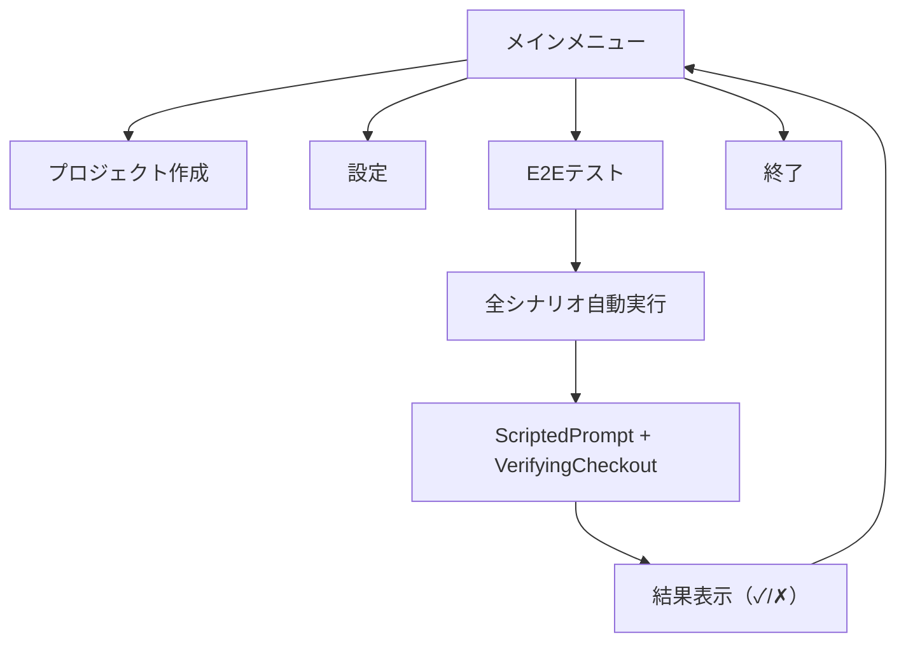

# E2Eテスト仕様

## 背景

ユニットテストはMockベースで全88テストが成功するが、実際のCLI操作時にエラーが発生するケースがある。
ユーザー視点の操作フローを自動検証するため、メインメニューにE2Eテスト機能を組み込む。

## 方針

- CLIのメインメニューに「E2Eテスト」を追加する
- 選択すると全シナリオを `ScriptedPrompt`（事前定義された回答を返す `UserPrompt` 実装）で自動実行し、結果を表示する
- CLIへの引数・サブコマンド・環境変数の追加は行わない
- CI用には `lib.rs` を追加し、統合テストから同じE2Eランナーを直接呼び出す

## メニュー変更

```
k1s0 メインメニュー
> プロジェクト作成
  設定
  E2Eテスト              ← 追加
  終了
```

### 実行時の出力イメージ

```
E2Eテスト実行中...

[プロジェクト作成 - System Region]
  ✓ System / Library / Rust
  ✓ System / Library / Go
  ✓ System / Service / Rust
  ✓ System / Service / Go

[プロジェクト作成 - Business Region]
  ✓ Business / sales(既存) / Library / Rust
  ✓ Business / sales(既存) / Library / Go
  ✓ Business / sales(既存) / Service / Rust
  ✓ Business / sales(既存) / Service / Go
  ✓ Business / sales(既存) / Client / React
  ✓ Business / sales(既存) / Client / Flutter
  ✓ Business / marketing(新規) / Library / Rust
  ✓ Business / marketing(新規) / Service / Go
  ✓ Business / 空リスト自動新規 / Library / Go

[プロジェクト作成 - Service Region]
  ✓ Service / sales / Server / Rust
  ✓ Service / sales / Server / Go
  ✓ Service / sales / Client / React
  ✓ Service / sales / Client / Flutter

[ワークスペース設定]
  ✓ 設定 → 確認のラウンドトリップ
  ✓ 未設定時のメッセージ表示
  ✓ ワークスペース設定 - 無効なパス
  ✓ ワークスペース設定 - 保存エラー

[エラーハンドリング]
  ✓ ワークスペース未設定でプロジェクト作成
  ✓ 不正なビジネス領域名
  ✓ チェックアウト失敗時のメッセージ
  ✓ 部門固有領域が空でService Region選択
  ✗ 不正なビジネス領域名(Service Region)  ← 失敗例

結果: 29/30 成功
```

## ディレクトリ構成

```
cli/
├── Cargo.toml                              # 変更なし（新規クレート追加なし）
├── src/
│   ├── lib.rs                              # 新規: 統合テストからモジュールを利用可能にする
│   ├── main.rs                             # 変更: E2Eテストメニュー追加
│   ├── application/
│   │   ├── mod.rs                          # 変更: e2e_runner モジュール追加
│   │   ├── port.rs                         # 変更: MainMenuChoice に E2eTest 追加
│   │   ├── e2e_runner.rs                   # 新規: E2Eシナリオ定義・実行ロジック
│   │   ├── create_project.rs               # 既存のまま
│   │   ├── configure_workspace.rs          # 既存のまま
│   │   └── show_workspace.rs               # 既存のまま
│   ├── domain/
│   │   ├── mod.rs                          # 既存のまま
│   │   ├── error.rs                        # 既存のまま
│   │   ├── workspace.rs                    # 既存のまま
│   │   └── region.rs                       # 既存のまま
│   └── infrastructure/
│       ├── mod.rs                          # 変更: scripted_prompt モジュール追加
│       ├── scripted_prompt.rs              # 新規: ScriptedPrompt（UserPrompt実装）
│       ├── prompt.rs                       # 変更: E2Eテスト選択肢を追加
│       ├── config_file.rs                  # 既存のまま
│       ├── sparse_checkout.rs              # 既存のまま
│       ├── business_region_repository.rs   # 既存のまま
│       └── ui.rs                           # 既存のまま
└── tests/
    ├── config_persistence_test.rs          # 既存のまま
    └── e2e/
        ├── main.rs                         # 新規: E2Eテストエントリーポイント
        ├── create_project.rs               # 新規: プロジェクト作成シナリオ検証
        └── workspace.rs                    # 新規: ワークスペース設定シナリオ検証
```

### 変更サマリ

| 区分 | ファイル | 変更内容 |
|---|---|---|
| 新規 | `src/lib.rs` | モジュール公開 |
| 新規 | `src/application/e2e_runner.rs` | E2Eシナリオ定義・実行 |
| 新規 | `src/infrastructure/scripted_prompt.rs` | ScriptedPrompt |
| 新規 | `tests/e2e/main.rs` | CI用テストエントリーポイント |
| 新規 | `tests/e2e/create_project.rs` | プロジェクト作成シナリオ検証 |
| 新規 | `tests/e2e/workspace.rs` | ワークスペース設定シナリオ検証 |
| 変更 | `src/main.rs` | E2Eメニュー分岐追加 |
| 変更 | `src/application/mod.rs` | `e2e_runner` モジュール追加 |
| 変更 | `src/application/port.rs` | `MainMenuChoice::E2eTest` 追加 |
| 変更 | `src/infrastructure/mod.rs` | `scripted_prompt` モジュール追加 |
| 変更 | `src/infrastructure/prompt.rs` | メニュー選択肢追加 |

## 設計詳細

### lib.rs

`main.rs` と統合テストの両方からモジュールにアクセスするために追加する。

```rust
// src/lib.rs
pub mod application;
pub mod domain;
pub mod infrastructure;
```

### ScriptedPrompt (`infrastructure/scripted_prompt.rs`)

事前定義された回答を順番に返す `UserPrompt` 実装。
既存のユニットテストで使用している `MockPrompt` と同じ発想だが、プロダクションコードとして組み込む。

```rust
pub struct ScriptedPrompt {
    messages: RefCell<Vec<String>>,
    region_choice: RegionChoice,
    project_type_choice: ProjectTypeChoice,
    language_choice: LanguageChoice,
    service_type_choice: ServiceTypeChoice,
    client_framework_choice: ClientFrameworkChoice,
    business_region_action: BusinessRegionAction,
    business_region_list_selection: String,
    business_region_name_input: String,
    path_input: String,
}
```

- 各メニューに対して固定値を返す
- `show_message()` で受け取ったメッセージを記録し、テスト後に検証可能にする

### VerifyingCheckout

E2Eシナリオ内で使用する `RegionCheckout` 実装。
実際のgit操作は行わず、チェックアウト対象のパスを記録して期待値と照合する。

```rust
struct VerifyingCheckout {
    called_with: RefCell<Option<Vec<String>>>,
}
```

### E2Eランナー (`application/e2e_runner.rs`)

#### シナリオ定義

各シナリオは「名前」「ScriptedPromptの設定」「期待するチェックアウト対象」の3つで構成する。

```rust
pub struct E2eScenario {
    pub name: String,
    pub prompt: ScriptedPrompt,
    pub expected_targets: Vec<String>,
}

pub struct E2eResult {
    pub name: String,
    pub passed: bool,
    pub detail: Option<String>,
}

pub fn run_all() -> Vec<E2eResult> {
    let scenarios = build_scenarios();
    scenarios.into_iter().map(|s| run_scenario(s)).collect()
}
```

#### シナリオ一覧

##### プロジェクト作成 - System Region（4件）

| シナリオ名 | 領域 | 種別 | 言語/FW | 期待するチェックアウト対象 |
|---|---|---|---|---|
| System / Library / Rust | System | Library | Rust | `system-region/library/rust` |
| System / Library / Go | System | Library | Go | `system-region/library/go` |
| System / Service / Rust | System | Service | Rust | `system-region/service/rust` |
| System / Service / Go | System | Service | Go | `system-region/service/go` |

##### プロジェクト作成 - Business Region（13件）

| シナリオ名 | 領域操作 | 種別 | 言語/FW | 期待するチェックアウト対象 |
|---|---|---|---|---|
| Business / sales(既存) / Library / Rust | 既存選択 | Library | Rust | `system-region` + `business-region/sales/library/rust` |
| Business / sales(既存) / Library / Go | 既存選択 | Library | Go | `system-region` + `business-region/sales/library/go` |
| Business / sales(既存) / Service / Rust | 既存選択 | Service | Rust | `system-region` + `business-region/sales/service/rust` |
| Business / sales(既存) / Service / Go | 既存選択 | Service | Go | `system-region` + `business-region/sales/service/go` |
| Business / sales(既存) / Client / React | 既存選択 | Client | React | `system-region` + `business-region/sales/client/react` |
| Business / sales(既存) / Client / Flutter | 既存選択 | Client | Flutter | `system-region` + `business-region/sales/client/flutter` |
| Business / marketing(新規) / Library / Rust | 新規作成 | Library | Rust | `system-region` + `business-region/marketing/library/rust` |
| Business / marketing(新規) / Library / Go | 新規作成 | Library | Go | `system-region` + `business-region/marketing/library/go` |
| Business / marketing(新規) / Service / Rust | 新規作成 | Service | Rust | `system-region` + `business-region/marketing/service/rust` |
| Business / marketing(新規) / Service / Go | 新規作成 | Service | Go | `system-region` + `business-region/marketing/service/go` |
| Business / marketing(新規) / Client / React | 新規作成 | Client | React | `system-region` + `business-region/marketing/client/react` |
| Business / marketing(新規) / Client / Flutter | 新規作成 | Client | Flutter | `system-region` + `business-region/marketing/client/flutter` |
| Business / 空リスト自動新規 / Library / Go | 空リスト→自動新規 | Library | Go | `system-region` + `business-region/new-dept/library/go` |

##### プロジェクト作成 - Service Region（4件）

| シナリオ名 | サービス種別 | 言語/FW | 期待するチェックアウト対象 |
|---|---|---|---|
| Service / sales / Server / Rust | Server | Rust | `system-region` + `business-region/sales` + `service-region/server/rust` |
| Service / sales / Server / Go | Server | Go | `system-region` + `business-region/sales` + `service-region/server/go` |
| Service / sales / Client / React | Client | React | `system-region` + `business-region/sales` + `service-region/client/react` |
| Service / sales / Client / Flutter | Client | Flutter | `system-region` + `business-region/sales` + `service-region/client/flutter` |

##### ワークスペース設定（4件）

| シナリオ名 | 操作 | 検証内容 |
|---|---|---|
| 設定→確認のラウンドトリップ | set → show | 設定した値が show で表示される |
| 未設定時のメッセージ表示 | show（未設定状態） | 「未設定」メッセージが表示される |
| ワークスペース設定 - 無効なパス | 空文字で設定 | 「無効なパス」メッセージが表示される |
| ワークスペース設定 - 保存エラー | 保存処理失敗 | 「保存に失敗しました」メッセージが表示される |

##### エラーハンドリング（5件）

| シナリオ名 | 操作 | 検証内容 |
|---|---|---|
| ワークスペース未設定でプロジェクト作成 | create（未設定） | 「未設定です」メッセージが表示される |
| 不正なビジネス領域名 | 空文字で領域作成 | 「領域名が不正です」メッセージが表示される |
| チェックアウト失敗 | checkout失敗 | 「失敗しました」メッセージが表示される |
| 部門固有領域が空でService Region選択 | Service選択（領域なし） | 「部門固有領域が存在しません」メッセージが表示される |
| 不正なビジネス領域名(Service Region) | Service Region内で不正な選択 | 「領域名が不正です」メッセージが表示される |

**合計: 30シナリオ**

### main.rs の変更

```rust
fn run(
    prompt: &impl UserPrompt,
    config: &impl ConfigStore,
    checkout: &impl RegionCheckout,
    business_region_repo: &impl BusinessRegionRepository,
) {
    loop {
        match prompt.show_main_menu() {
            MainMenuChoice::CreateProject => { /* 既存のまま */ }
            MainMenuChoice::Settings => { /* 既存のまま */ }
            MainMenuChoice::E2eTest => {
                let results = e2e_runner::run_all();
                e2e_runner::print_results(&results);
            }
            MainMenuChoice::Exit => { /* 既存のまま */ }
        }
    }
}
```

### port.rs の変更

```rust
#[derive(Debug, Clone, Copy, PartialEq, Eq)]
pub enum MainMenuChoice {
    CreateProject,
    Settings,
    E2eTest,       // 追加
    Exit,
}
```

## CI連携（`tests/e2e/`）

統合テストから `e2e_runner::run_all()` を直接呼び出し、全シナリオの成功を検証する。

```rust
// tests/e2e/main.rs
mod create_project;
mod workspace;
```

```rust
// tests/e2e/create_project.rs
use k1s0::application::e2e_runner;

#[test]
fn all_system_region_scenarios_pass() {
    let results = e2e_runner::run_all();
    let filtered: Vec<_> = results.iter()
        .filter(|r| r.name.starts_with("System")).collect();
    assert_eq!(filtered.len(), 4);
    for result in &filtered {
        assert!(result.passed, "FAILED: {} - {:?}", result.name, result.detail);
    }
}

#[test]
fn all_business_region_scenarios_pass() {
    let results = e2e_runner::run_all();
    let filtered: Vec<_> = results.iter()
        .filter(|r| r.name.starts_with("Business")).collect();
    assert_eq!(filtered.len(), 13);
    for result in &filtered {
        assert!(result.passed, "FAILED: {} - {:?}", result.name, result.detail);
    }
}

#[test]
fn all_service_region_scenarios_pass() {
    let results = e2e_runner::run_all();
    let filtered: Vec<_> = results.iter()
        .filter(|r| r.name.starts_with("Service")).collect();
    assert_eq!(filtered.len(), 4);
    for result in &filtered {
        assert!(result.passed, "FAILED: {} - {:?}", result.name, result.detail);
    }
}

#[test]
fn all_error_scenarios_pass() {
    let results = e2e_runner::run_all();
    let filtered: Vec<_> = results.iter()
        .filter(|r| r.name.contains("未設定でプロジェクト")
                  || r.name.contains("不正")
                  || r.name.contains("失敗")
                  || r.name.contains("空で")).collect();
    assert_eq!(filtered.len(), 5);
    for result in &filtered {
        assert!(result.passed, "FAILED: {} - {:?}", result.name, result.detail);
    }
}
```

```rust
// tests/e2e/workspace.rs
use k1s0::application::e2e_runner;

#[test]
fn workspace_roundtrip_scenario_passes() {
    let results = e2e_runner::run_all();
    let filtered: Vec<_> = results.iter()
        .filter(|r| r.name.contains("ラウンドトリップ")).collect();
    assert_eq!(filtered.len(), 1);
    assert!(filtered[0].passed, "FAILED: {} - {:?}", filtered[0].name, filtered[0].detail);
}

#[test]
fn workspace_not_configured_scenario_passes() {
    let results = e2e_runner::run_all();
    let filtered: Vec<_> = results.iter()
        .filter(|r| r.name.contains("未設定時")).collect();
    assert_eq!(filtered.len(), 1);
    assert!(filtered[0].passed, "FAILED: {} - {:?}", filtered[0].name, filtered[0].detail);
}

#[test]
fn workspace_invalid_path_scenario_passes() {
    let results = e2e_runner::run_all();
    let filtered: Vec<_> = results.iter()
        .filter(|r| r.name.contains("無効なパス")).collect();
    assert_eq!(filtered.len(), 1);
    assert!(filtered[0].passed, "FAILED: {} - {:?}", filtered[0].name, filtered[0].detail);
}

#[test]
fn workspace_save_failure_scenario_passes() {
    let results = e2e_runner::run_all();
    let filtered: Vec<_> = results.iter()
        .filter(|r| r.name.contains("保存エラー")).collect();
    assert_eq!(filtered.len(), 1);
    assert!(filtered[0].passed, "FAILED: {} - {:?}", filtered[0].name, filtered[0].detail);
}
```

### テスト実行コマンド

```bash
cargo test --test e2e          # E2Eテストのみ実行
cargo test                     # 全テスト（ユニット + 統合 + E2E）実行
```

## フロー図（CLI設計書への追記）


