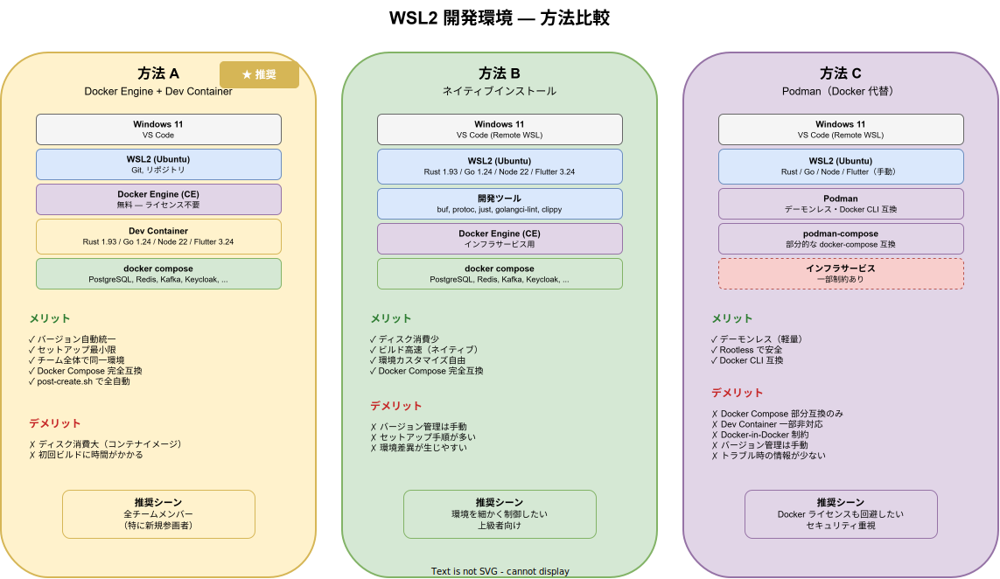

# WSL2 開発環境セットアップ

Docker Desktop を使用せずに WSL2 上で k1s0 の開発環境を構築する手順を定義する。

## 背景・課題

- Docker Desktop はライセンス条件（従業員 250 名以上または年間収益 1,000 万ドル以上の企業は有料）がある
- Windows ネイティブでは Bash 必須のスクリプト・justfile が動作しない
- 一部サーバー（master-maintenance の zen-engine）は Windows ネイティブでビルドできない

## 基本方針

- WSL2 上の Ubuntu に Docker Engine（CE）を直接インストールし、Docker Desktop を不要にする
- Dev Container を活用し、ツールチェーンのバージョンをチーム全体で統一する
- Docker Desktop 使用時と同等の開発体験を提供する

## アーキテクチャ概要


## 前提条件

| 項目 | 要件 |
| --- | --- |
| OS | Windows 10 (21H2 以降) / Windows 11 |
| メモリ | 16 GB 以上推奨（WSL2 + Docker で 8 GB 以上消費） |
| ディスク | SSD、空き 50 GB 以上 |
| エディタ | VS Code + Remote WSL 拡張 |

## セットアップフロー


## セットアップ手順

### 1. WSL2 のインストール

```powershell
# PowerShell（管理者権限）で実行
wsl --install -d Ubuntu-24.04
```

インストール後、再起動してユーザー名・パスワードを設定する。

```powershell
# WSL2 が有効か確認
wsl -l -v
# NAME              STATE           VERSION
# Ubuntu-24.04      Running         2
```

> **注意**: VERSION が `1` の場合は `wsl --set-version Ubuntu-24.04 2` で変換する。

### 2. WSL2 のリソース設定

WSL2 のデフォルトではホストメモリの 50% を使用する。開発に十分なリソースを割り当てる。

```ini
# Windows 側: %USERPROFILE%\.wslconfig
[wsl2]
memory=8GB
processors=4
swap=4GB
```

設定変更後は `wsl --shutdown` で再起動する。

### 3. Git の設定

```bash
# WSL2 内で実行

# ユーザー情報
git config --global user.name "Your Name"
git config --global user.email "your.email@example.com"

# 改行コード（LF に統一）
git config --global core.autocrlf input

# パス長制限の回避
git config --global core.longpaths true
```

### 4. リポジトリのクローン

**必ず WSL2 のファイルシステム内にクローンする**。Windows 側のパス（`/mnt/c/...`）は I/O が遅く、ファイル監視（inotify）が効かない。

```bash
# WSL2 のホームディレクトリ内にクローン
cd ~
mkdir -p work && cd work
git clone <repository-url> k1s0
cd k1s0
```

## 方法 A: Docker Engine + Dev Container（推奨）

Dev Container を使うことで、ツールチェーンのバージョン管理を含めた統一環境を最小の手間で構築できる。

### A-1. Docker Engine のインストール

```bash
# 古いパッケージを削除
sudo apt-get remove -y docker docker-engine docker.io containerd runc 2>/dev/null || true

# 必要なパッケージをインストール
sudo apt-get update
sudo apt-get install -y ca-certificates curl gnupg

# Docker 公式 GPG 鍵を追加
sudo install -m 0755 -d /etc/apt/keyrings
curl -fsSL https://download.docker.com/linux/ubuntu/gpg | sudo gpg --dearmor -o /etc/apt/keyrings/docker.gpg
sudo chmod a+r /etc/apt/keyrings/docker.gpg

# リポジトリを追加
echo \
  "deb [arch=$(dpkg --print-architecture) signed-by=/etc/apt/keyrings/docker.gpg] https://download.docker.com/linux/ubuntu \
  $(. /etc/os-release && echo "$VERSION_CODENAME") stable" | \
  sudo tee /etc/apt/sources.list.d/docker.list > /dev/null

# Docker Engine をインストール
sudo apt-get update
sudo apt-get install -y docker-ce docker-ce-cli containerd.io docker-buildx-plugin docker-compose-plugin

# 現在のユーザーを docker グループに追加（sudo なしで実行可能にする）
sudo usermod -aG docker $USER
```

> **注意**: グループ変更を反映するため、一度 WSL2 を終了して再起動する（`wsl --shutdown` → `wsl`）。

### A-2. Docker の起動と動作確認

WSL2 では systemd が有効な場合、Docker は自動起動する。

```bash
# systemd が有効か確認
systemctl is-system-running

# Docker デーモンを起動（systemd が有効な場合）
sudo systemctl start docker
sudo systemctl enable docker

# systemd が無効な場合は手動起動
# sudo dockerd &

# 動作確認
docker run --rm hello-world
docker compose version
```

> **注意**: systemd を有効にするには `/etc/wsl.conf` に以下を追加して WSL を再起動する。
> ```ini
> [boot]
> systemd=true
> ```

### A-3. VS Code から Dev Container を起動

```
1. VS Code に以下の拡張機能をインストール:
   - Remote - WSL (ms-vscode-remote.remote-wsl)
   - Dev Containers (ms-vscode-remote.remote-containers)

2. VS Code で WSL2 に接続:
   コマンドパレット → "WSL: Connect to WSL"

3. WSL2 内のリポジトリを開く:
   File → Open Folder → ~/work/k1s0

4. Dev Container で再オープン:
   コマンドパレット → "Dev Containers: Reopen in Container"

5. 初回ビルド完了後、post-create.sh が自動実行される
   （Go ツール、Rust コンポーネント、Flutter SDK、buf 等がインストールされる）
```

### A-4. インフラサービスの起動

Dev Container 内のターミナルで実行する。

```bash
# インフラサービス（PostgreSQL, Redis, Kafka, Keycloak 等）を起動
docker compose --profile infra up -d

# 可観測性スタック（Jaeger, Prometheus, Grafana）も必要な場合
docker compose --profile infra --profile observability up -d
```

## 方法 B: WSL2 にツールチェーンを直接インストール

Dev Container を使わず、WSL2 内にネイティブで全ツールをインストールする方法。環境の自由度は高いが、バージョン管理は開発者自身で行う必要がある。

> **自動セットアップ**: `scripts/setup-wsl.sh` を使うと以下の B-1〜B-8 の手順を自動化できる。
> ```bash
> bash scripts/setup-wsl.sh
> ```
> 冪等設計のため、既にインストール済みのツールはスキップされる。

### B-1. 基本パッケージ

```bash
sudo apt-get update
sudo apt-get install -y \
  build-essential \
  pkg-config \
  libssl-dev \
  libsasl2-dev \
  libz-dev \
  cmake \
  protobuf-compiler \
  curl \
  wget \
  unzip \
  git \
  patch
```

### B-2. Rust 1.93

```bash
# rustup でインストール
curl --proto '=https' --tlsv1.2 -sSf https://sh.rustup.rs | sh -s -- -y
source "$HOME/.cargo/env"

# プロジェクトで使用するバージョンをインストール
rustup install 1.93
rustup default 1.93

# 必要なコンポーネント
rustup component add clippy rustfmt

# sqlx-cli（データベースマイグレーション管理ツール）
cargo install sqlx-cli --no-default-features --features postgres

# Tauri CLI（GUI 開発に必要）
cargo install tauri-cli --locked

# Tauri WebView 依存ライブラリ
sudo apt-get install -y \
  libwebkit2gtk-4.1-dev \
  libgtk-3-dev \
  libayatana-appindicator3-dev \
  librsvg2-dev
```

### B-3. Go 1.24.0

```bash
# Go をダウンロード・インストール
GO_VERSION="1.24.0"
curl -fsSL "https://go.dev/dl/go${GO_VERSION}.linux-amd64.tar.gz" -o "/tmp/go${GO_VERSION}.linux-amd64.tar.gz"
sudo rm -rf /usr/local/go
sudo tar -C /usr/local -xzf "/tmp/go${GO_VERSION}.linux-amd64.tar.gz"
rm "/tmp/go${GO_VERSION}.linux-amd64.tar.gz"

# PATH を設定
echo 'export PATH=$PATH:/usr/local/go/bin:$HOME/go/bin' >> ~/.bashrc
source ~/.bashrc

# Go ツールをインストール（バージョン固定: devcontainer の post-create.sh と同期）
go install golang.org/x/tools/cmd/goimports@v0.31.0
go install github.com/golangci/golangci-lint/cmd/golangci-lint@v1.64.8
go install google.golang.org/protobuf/cmd/protoc-gen-go@v1.36.3
go install google.golang.org/grpc/cmd/protoc-gen-go-grpc@v1.5.1
go install github.com/oapi-codegen/oapi-codegen/v2/cmd/oapi-codegen@v2.4.1
```

### B-4. Node.js 22

```bash
# NodeSource リポジトリからインストール
curl -fsSL https://deb.nodesource.com/setup_22.x | sudo -E bash -
sudo apt-get install -y nodejs

# バージョン確認
node --version  # v22.x.x
npm --version
```

### B-5. Flutter 3.24.0

```bash
# Flutter SDK をインストール
FLUTTER_VERSION="3.24.0"
git clone https://github.com/flutter/flutter.git -b "${FLUTTER_VERSION}" --depth 1 /opt/flutter
echo 'export PATH="/opt/flutter/bin:$PATH"' >> ~/.bashrc
source ~/.bashrc

# キャッシュ・分析設定
flutter precache --web
flutter config --no-analytics

# 動作確認
flutter doctor
```

### B-6. buf（Protocol Buffers ツール）

```bash
BUF_VERSION="1.47.2"
curl -sSL "https://github.com/bufbuild/buf/releases/download/v${BUF_VERSION}/buf-$(uname -s)-$(uname -m)" \
  -o /usr/local/bin/buf
sudo chmod +x /usr/local/bin/buf

# 動作確認
buf --version
```

### B-7. just（タスクランナー）

```bash
# just をインストール
curl --proto '=https' --tlsv1.2 -sSf https://just.systems/install.sh | bash -s -- --to /usr/local/bin

# 動作確認
just --version
```

### B-8. pnpm（TypeScript ワークスペース管理）

```bash
# Node.js に同梱の corepack で pnpm を有効化
sudo corepack enable pnpm

# 動作確認
pnpm --version
```

### B-9. Docker Engine（方法 A-1 と同じ）

方法 B でもインフラサービス（PostgreSQL, Redis, Kafka 等）の起動に Docker が必要。[方法 A-1](#a-1-docker-engine-のインストール) の手順で Docker Engine をインストールする。

## 方法 C: Podman（Docker 代替）

Podman はデーモンレスのコンテナランタイムで、Docker CLI 互換の操作が可能。

### C-1. Podman のインストール

```bash
sudo apt-get update
sudo apt-get install -y podman

# Docker コマンド互換のエイリアスを設定
echo 'alias docker=podman' >> ~/.bashrc
source ~/.bashrc

# 動作確認
podman run --rm hello-world
```

### C-2. VS Code Dev Container で Podman を使用

VS Code の設定で Docker パスを Podman に変更する。

```json
// VS Code settings.json
{
  "dev.containers.dockerPath": "podman"
}
```

### C-3. 制約事項

| 項目 | 状況 |
| --- | --- |
| Docker Compose | `podman-compose` が必要（`pip install podman-compose`） |
| Docker-in-Docker | Podman では rootless モードの制約あり |
| Dev Container 互換性 | 基本動作するが、一部 feature が非対応の場合がある |

> **注意**: Podman は Docker と完全互換ではないため、問題が発生した場合は方法 A（Docker Engine）を推奨する。

## 動作確認チェックリスト

セットアップ完了後、以下を確認する。

```bash
# 1. Docker / コンテナランタイム
docker run --rm hello-world
docker compose version

# 2. Rust
rustc --version   # 1.93.x
cargo --version
cargo clippy --version
rustfmt --version

# 3. Go
go version        # go1.24.x
golangci-lint --version

# 4. Node.js
node --version    # v22.x.x
npm --version

# 5. Flutter
flutter --version # 3.24.0
flutter doctor

# 6. Protocol Buffers
protoc --version
buf --version     # 1.47.2

# 7. just
just --version

# 8. インフラサービス起動
docker compose --profile infra up -d
docker compose ps  # 全サービスが running であること

# 9. ビルド確認（CLI）
cd CLI && cargo build

# 10. テスト確認
just test         # 変更ファイルに対応するテストが通ること
```

## トラブルシューティング

### Docker デーモンが起動しない

```bash
# systemd が有効か確認
cat /etc/wsl.conf
# [boot]
# systemd=true が必要

# ログを確認
sudo journalctl -u docker.service --no-pager -n 50

# 手動起動で切り分け
sudo dockerd --debug
```

### ファイル監視が効かない（ホットリロード不可）

WSL2 ファイルシステム内（`~/...`）にリポジトリがあるか確認する。`/mnt/c/...`（Windows ファイルシステム）では inotify が動作しない。

```bash
# リポジトリの場所を確認
pwd
# NG: /mnt/c/Users/... → WSL2 内に移動する
# OK: /home/<user>/...
```

### WSL2 のメモリ不足

Docker + ビルドでメモリが不足する場合は `.wslconfig` の `memory` を増やす。

```ini
# %USERPROFILE%\.wslconfig
[wsl2]
memory=12GB
```

### Docker Compose でポートが競合する

Windows 側で同じポートを使用しているプロセスがないか確認する。

```powershell
# PowerShell で確認
netstat -ano | findstr :5432
```

### VS Code が WSL2 の Docker を認識しない

Dev Container 拡張の設定で Docker ソケットのパスを明示する。

```json
// VS Code settings.json
{
  "dev.containers.dockerSocketPath": "/var/run/docker.sock"
}
```

## 方法比較



| | 方法 A: Docker Engine + Dev Container | 方法 B: ネイティブインストール | 方法 C: Podman |
| --- | --- | --- | --- |
| セットアップ難度 | 低 | 中 | 中 |
| バージョン管理 | Dev Container で自動統一 | 開発者が手動管理 | 開発者が手動管理 |
| ライセンス | 無料（Docker CE） | 無料 | 無料 |
| Docker Compose 互換 | 完全互換 | 完全互換 | 部分互換 |
| Dev Container 対応 | 完全対応 | 不要 | 部分対応 |
| ディスク使用量 | 大（コンテナイメージ） | 小 | 大 |
| 推奨度 | **推奨** | 上級者向け | 制約あり |

## 関連ドキュメント

- [Dev Container 設計](devcontainer設計.md)
- [共用開発サーバー設計](共用開発サーバー設計.md)
- [docker-compose 設計](../docker/docker-compose設計.md)
- [Docker イメージ戦略](../docker/Dockerイメージ戦略.md)
- [CI-CD 設計](../cicd/CI-CD設計.md)
- [ポート割り当て](../docker/ポート割り当て.md)
