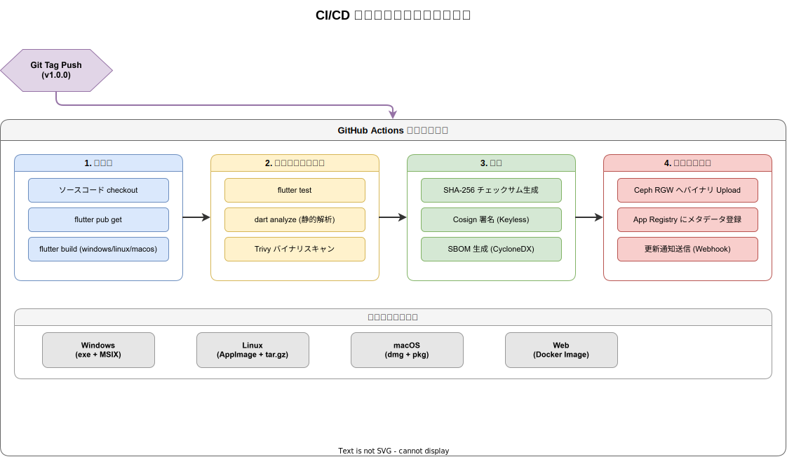
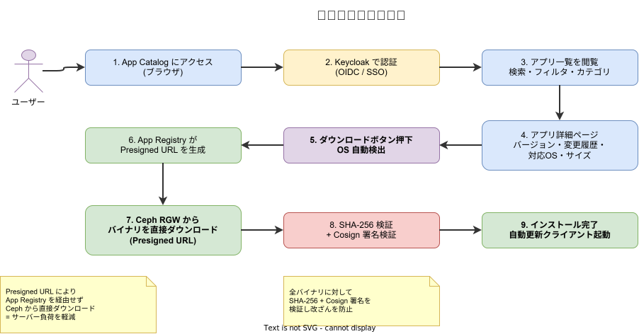

# アプリ配布基盤設計

Flutter デスクトップアプリ（exe / dmg / AppImage）をユーザーが自由にダウンロードできる、社内 App Store 相当の配布基盤を設計する。

## 基本方針

- 既存インフラ（GitHub Actions + Harbor + Ceph）を最大限活用する
- 新規サービスは App Registry Server と App Catalog UI の 2 つに限定する
- Presigned URL による直接ダウンロードでサーバー負荷を回避する
- 全バイナリに対して署名・チェックサム・SBOM を付与する
- デスクトップアプリには自動更新機能を組み込む

## 全体アーキテクチャ


## コンポーネント

### App Registry Server

アプリのメタデータ管理とダウンロード URL 生成を担うバックエンドサービス。

**配置:** `regions/system/server/rust/app-registry/`

**技術スタック:**

- Rust (axum)
- PostgreSQL（メタデータ DB）
- Ceph RGW（S3 互換 API で Presigned URL 生成）

**主要 API:**

```
GET    /api/v1/apps                         アプリ一覧
GET    /api/v1/apps/{id}                    アプリ詳細
GET    /api/v1/apps/{id}/versions           バージョン一覧
GET    /api/v1/apps/{id}/latest             最新バージョン情報（自動更新用）
POST   /api/v1/apps/{id}/versions           バージョン登録（CI/CD から呼び出し）
GET    /api/v1/apps/{id}/versions/{ver}/download   Presigned URL 発行
DELETE /api/v1/apps/{id}/versions/{ver}     バージョン削除
```

**クエリパラメータ（latest / download）:**

```
?platform=windows|linux|macos
&arch=x64|arm64
```

**レスポンス例（latest）:**

```json
{
  "app_id": "order-client",
  "version": "1.2.0",
  "platform": "windows",
  "arch": "x64",
  "size_bytes": 52428800,
  "checksum_sha256": "a1b2c3...",
  "release_notes": "注文フローの改善",
  "mandatory": false,
  "published_at": "2026-03-10T09:00:00Z",
  "download_url": "https://ceph-rgw.internal/k1s0-apps/order-client/1.2.0/windows-x64/order-client.exe?X-Amz-..."
}
```

**RBAC:**

| ロール | 権限 |
|---|---|
| admin | 全操作 |
| publisher | バージョン登録・削除（CI/CD サービスアカウント） |
| user | 一覧・詳細・ダウンロード |

### App Catalog UI

ユーザー向け Web ポータル。ブラウザからアプリを検索・閲覧・ダウンロードできる。

**配置:** `regions/system/client/react/app-catalog/`

**技術スタック:**

- React + Vite
- system-client SDK（認証・ルーティング）
- Tanstack Query（API 通信）

**画面構成:**

- **アプリ一覧ページ** — カテゴリ・検索・OS フィルタ付きグリッド表示
- **アプリ詳細ページ** — スクリーンショット、変更履歴、対応 OS、サイズ、ダウンロードボタン
- **管理ページ** — パブリッシュ状況確認、ダウンロード統計（admin ロール限定）

**ダウンロード UX:**

- ブラウザの User-Agent から OS を自動検出し、適切なバイナリを推奨
- ダウンロード前に SHA-256 チェックサムを表示
- 他の OS 用バイナリも選択可能

### 自動更新 SDK

デスクトップアプリに組み込む Dart ライブラリ。起動時に最新バージョンをチェックし、差分更新を実行する。

**配置:** `regions/system/library/dart/app_updater/`

**機能:**

- 起動時バージョンチェック（App Registry API）
- 更新ダイアログ表示（変更内容・サイズ・必須/任意）
- バックグラウンドダウンロード（進捗表示付き）
- SHA-256 検証 + Cosign 署名検証
- 再起動して適用

**使用例:**

```dart
final updater = AppUpdater(
  registryUrl: 'https://app-registry.internal',
  appId: 'order-client',
  currentVersion: '1.1.0',
);

// main.dart で起動時にチェック
await updater.checkAndPrompt(context);
```

## ストレージ設計

### Ceph RGW（S3 互換オブジェクトストレージ）

アプリバイナリの実体を保存する。

**バケット構成:**

```
k1s0-apps/
  {app-id}/
    {version}/
      {platform}-{arch}/
        {app-name}.exe          # Windows バイナリ
        {app-name}.exe.sha256   # チェックサム
        {app-name}.exe.sig      # Cosign 署名
        {app-name}.sbom.json    # SBOM (CycloneDX)
```

**例:**

```
k1s0-apps/
  order-client/
    1.2.0/
      windows-x64/
        order-client.exe
        order-client.exe.sha256
        order-client.exe.sig
        order-client.sbom.json
      linux-x64/
        order-client.AppImage
        order-client.AppImage.sha256
        order-client.AppImage.sig
        order-client.sbom.json
      macos-arm64/
        order-client.dmg
        order-client.dmg.sha256
        order-client.dmg.sig
        order-client.sbom.json
```

**アクセスポリシー:**

- バケットはプライベート（パブリックアクセス不可）
- Presigned URL（有効期限 1 時間）経由でのみダウンロード可能
- CI/CD サービスアカウントのみ書き込み権限を持つ

### PostgreSQL（メタデータ DB）

**テーブル設計:**

```sql
CREATE TABLE apps (
    id          TEXT PRIMARY KEY,
    name        TEXT NOT NULL,
    description TEXT,
    category    TEXT NOT NULL,
    icon_url    TEXT,
    created_at  TIMESTAMPTZ NOT NULL DEFAULT now(),
    updated_at  TIMESTAMPTZ NOT NULL DEFAULT now()
);

CREATE TABLE app_versions (
    id              UUID PRIMARY KEY DEFAULT gen_random_uuid(),
    app_id          TEXT NOT NULL REFERENCES apps(id),
    version         TEXT NOT NULL,
    platform        TEXT NOT NULL,
    arch            TEXT NOT NULL,
    size_bytes      BIGINT NOT NULL,
    checksum_sha256 TEXT NOT NULL,
    s3_key          TEXT NOT NULL,
    release_notes   TEXT,
    mandatory       BOOLEAN NOT NULL DEFAULT false,
    published_at    TIMESTAMPTZ NOT NULL DEFAULT now(),
    UNIQUE (app_id, version, platform, arch)
);

CREATE TABLE download_stats (
    id              UUID PRIMARY KEY DEFAULT gen_random_uuid(),
    app_id          TEXT NOT NULL REFERENCES apps(id),
    version         TEXT NOT NULL,
    platform        TEXT NOT NULL,
    user_id         TEXT,
    downloaded_at   TIMESTAMPTZ NOT NULL DEFAULT now()
);
```

## CI/CD パブリッシュパイプライン



**トリガー:** Git タグ push（`v*` パターン）

**ワークフロー概要:**

```yaml
name: publish-app
on:
  push:
    tags: ['v*']

jobs:
  build:
    strategy:
      matrix:
        include:
          - os: windows-latest
            platform: windows
            arch: x64
            build-cmd: flutter build windows --release
            artifact: build/windows/x64/runner/Release/*
          - os: ubuntu-latest
            platform: linux
            arch: x64
            build-cmd: flutter build linux --release
            artifact: build/linux/x64/release/bundle/*
          - os: macos-latest
            platform: macos
            arch: arm64
            build-cmd: flutter build macos --release
            artifact: build/macos/Build/Products/Release/*.app

    runs-on: ${{ matrix.os }}
    steps:
      - uses: actions/checkout@v4
      - uses: subosito/flutter-action@v2
      - run: flutter pub get
      - run: flutter test
      - run: flutter analyze
      - run: ${{ matrix.build-cmd }}

      # パッケージング
      - run: scripts/package.sh ${{ matrix.platform }} ${{ matrix.arch }}

      # セキュリティ
      - run: sha256sum $ARTIFACT > $ARTIFACT.sha256
      - uses: sigstore/cosign-installer@v3
      - run: cosign sign-blob --yes $ARTIFACT > $ARTIFACT.sig
      - run: trivy fs --format cyclonedx --output $ARTIFACT.sbom.json .

      # アップロード
      - run: |
          aws s3 cp $ARTIFACT s3://k1s0-apps/$APP_ID/$VERSION/$PLATFORM-$ARCH/ \
            --endpoint-url $CEPH_RGW_ENDPOINT

      # メタデータ登録
      - run: |
          curl -X POST $APP_REGISTRY_URL/api/v1/apps/$APP_ID/versions \
            -H "Authorization: Bearer $CI_TOKEN" \
            -d @metadata.json
```

**ビルドマトリクス:**

| プラットフォーム | 出力形式 | Runner |
|---|---|---|
| Windows | exe + MSIX | windows-latest |
| Linux | AppImage + tar.gz | ubuntu-latest |
| macOS | dmg + pkg | macos-latest |
| Web | Docker Image → Harbor | ubuntu-latest |

## ダウンロードフロー



**フローの要点:**

1. ユーザーが App Catalog にブラウザでアクセス
2. Keycloak で OIDC 認証（SSO 対応）
3. アプリ一覧から目的のアプリを選択
4. 詳細ページでバージョン・変更履歴・対応 OS を確認
5. ダウンロードボタン押下（OS 自動検出）
6. App Registry が Presigned URL を生成
7. ブラウザが Ceph RGW から直接バイナリをダウンロード
8. ダウンロード後、チェックサムと署名を検証
9. インストール完了後、自動更新クライアントが有効になる

Presigned URL を使用することで、App Registry Server にダウンロードトラフィックが集中することを防ぐ。

## 自動更新フロー


**フローの要点:**

1. デスクトップアプリ起動時に App Registry の `latest` API を呼び出し
2. レスポンスのバージョンとローカルバージョンを比較
3. 更新がある場合、ダイアログでユーザーに通知（mandatory フラグで強制更新も可能）
4. Presigned URL を使って Ceph RGW からバックグラウンドダウンロード
5. SHA-256 + Cosign 署名検証
6. 再起動して新バージョンを適用

## セキュリティ

### バイナリの完全性

- **SHA-256 チェックサム** — 全バイナリに対して生成・検証
- **Cosign 署名 (Keyless)** — OIDC ベースの署名で改ざんを防止
- **SBOM (CycloneDX)** — サプライチェーン透明性の確保

### アクセス制御

- **Keycloak OIDC** — ユーザー認証（SSO 対応）
- **RBAC** — admin / publisher / user の 3 ロール
- **Presigned URL** — 有効期限付き（1 時間）、認証済みユーザーにのみ発行
- **CI/CD サービスアカウント** — publisher ロールで最小権限

### ネットワーク

- App Registry / App Catalog は Kubernetes クラスタ内で稼働
- 社内ネットワークからのみアクセス可能（Nginx Ingress で制御）
- Ceph RGW への Presigned URL アクセスも社内ネットワーク内に限定

## 配置パス

| コンポーネント | パス |
|---|---|
| App Registry Server | `regions/system/server/rust/app-registry/` |
| App Catalog UI | `regions/system/client/react/app-catalog/` |
| 自動更新 SDK | `regions/system/library/dart/app_updater/` |
| Helm Chart | `infra/helm/services/system/app-registry/` |
| Terraform (Ceph バケット) | `infra/terraform/modules/ceph/app-distribution.tf` |
| DB マイグレーション | `regions/system/database/app-registry/` |

## 環境別設定

| 設定項目 | dev | staging | prod |
|---|---|---|---|
| Ceph バケット | `k1s0-apps-dev` | `k1s0-apps-stg` | `k1s0-apps` |
| Presigned URL 有効期限 | 24 時間 | 1 時間 | 1 時間 |
| 自動デプロイ | タグ push で自動 | タグ push で自動 | 手動承認 |
| ダウンロード制限 | なし | なし | レートリミット適用 |
