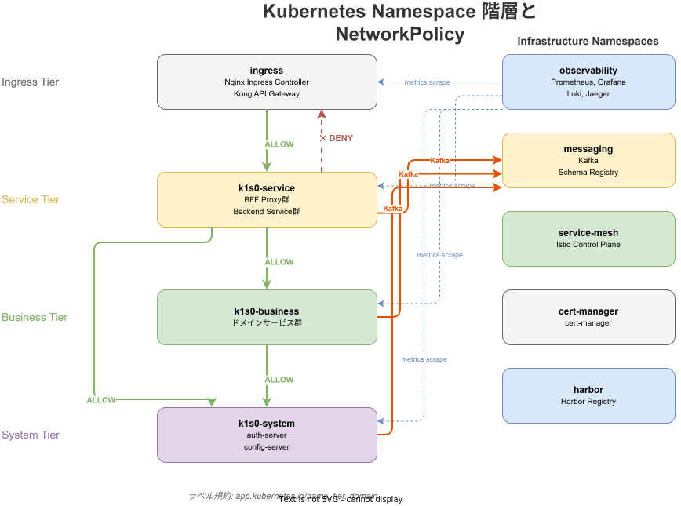
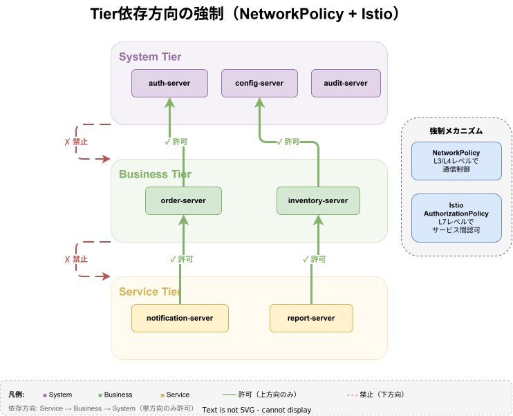
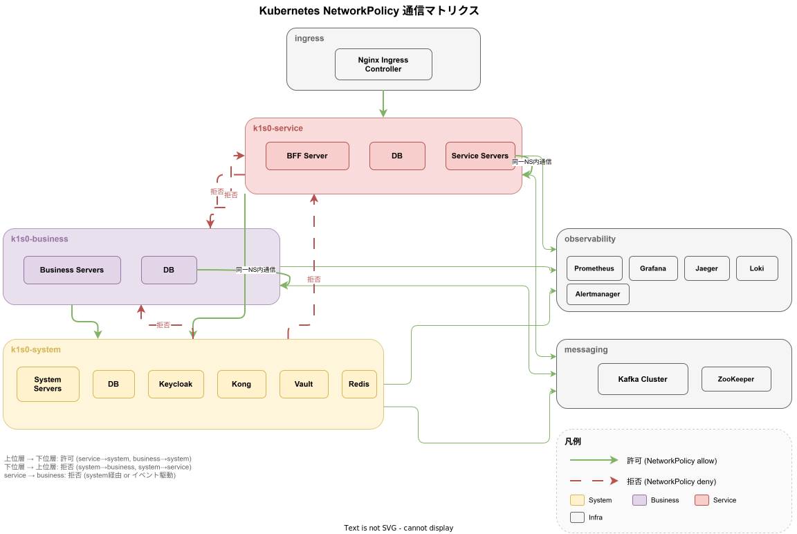
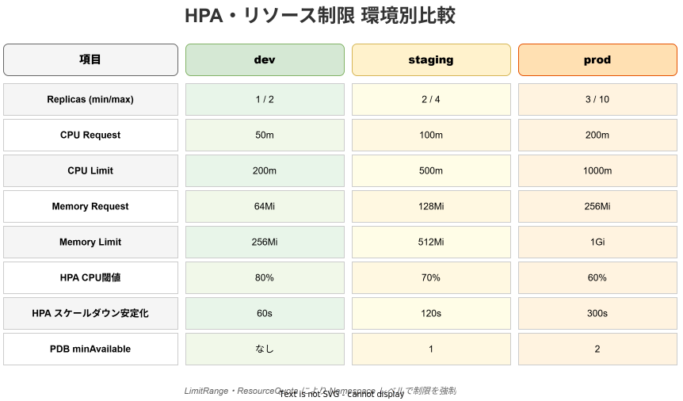
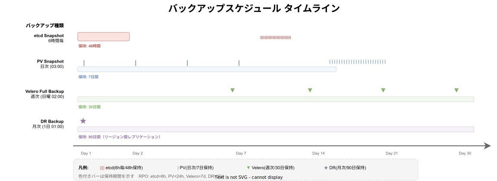

# Kubernetes 設計

オンプレミス Kubernetes クラスタのリソース設計を定義する。

## 基本方針

- Namespace を Tier アーキテクチャの階層に対応させる
- NetworkPolicy で階層間の依存方向を強制する
- リソースリミットを全 Pod に設定し、ノイジーネイバーを防止する
- HPA でトラフィックに応じたオートスケールを行う

## Namespace 設計

| Namespace         | 対象                                | Tier     | `tier` ラベル値 |
| ----------------- | ----------------------------------- | -------- | --------------- |
| `k1s0-system`     | system tier のサーバー・DB・Schema Registry・Kong API Gateway・Keycloak・Vault・Redis・Redis Session（BFF用） | system   | `system`  |
| `k1s0-business`   | business tier のサーバー・クライアント・DB | business | `business` |
| `k1s0-service`    | service tier のサーバー・クライアント・DB | service  | `service`  |
| `observability`   | Prometheus, Grafana, Jaeger, Loki   | infra    | `infra`    |
| `messaging`       | Kafka クラスタ                      | infra    | `infra`    |
| `ingress`         | Nginx Ingress Controller            | infra    | `infra`    |
| `service-mesh`    | Istio Control Plane, Flagger        | infra    | `infra`    |
| `cert-manager`    | 証明書管理                          | infra    | `infra`    |
| `harbor`          | コンテナレジストリ（同一クラスタの場合） | infra  | `infra`    |



## Pod Security Standards（H-008）

各 Namespace に Pod Security Standards ラベルを設定し、特権コンテナや危険な設定を防止する。

| Namespace | enforce レベル | 説明 |
|---|---|---|
| k1s0-system, k1s0-business, k1s0-service | `restricted` | アプリワークロードは最も厳格なセキュリティ要件を適用 |
| observability, messaging, ingress, service-mesh, cert-manager, harbor | `baseline` | インフラ系は baseline（restricted が適用困難な場合あり） |

```yaml
# アプリ Namespace の設定例
pod-security.kubernetes.io/enforce: restricted
pod-security.kubernetes.io/audit: restricted
pod-security.kubernetes.io/warn: restricted
```

## NetworkPolicy



Tier アーキテクチャの依存ルール（下位 → 上位の一方向のみ）を NetworkPolicy で強制する。

**通信方針:**
- 下位 Tier から上位 Tier（system）への依存は全 Tier で許可する（認証・config 取得等の共通基盤へのアクセスは全 Tier から必要なため）
- 同一 Namespace 内の通信は各 Tier で許可する（tier-architecture.md の同一 Tier 例外規定に基づく）
- 異なる Tier 間の同階層直接依存は禁止（tier-architecture.md の例外規定を除く）
- k1s0-system の NetworkPolicy では system 自身・business・service の全 Tier からのインバウンドを許可している

```yaml
# k1s0-system: business および service からのインバウンドを許可
# service Tier から system Tier への直接通信を許可する
# （認証・config取得等の共通基盤へのアクセスは全 Tier から必要）
apiVersion: networking.k8s.io/v1
kind: NetworkPolicy
metadata:
  name: allow-from-business-and-service
  namespace: k1s0-system
spec:
  podSelector: {}
  policyTypes:
    - Ingress
  ingress:
    - from:
        - namespaceSelector:
            matchLabels:
              tier: system
        - namespaceSelector:
            matchLabels:
              tier: business
        - namespaceSelector:
            matchLabels:
              tier: service

---
# k1s0-business: service および同一 Namespace からのインバウンドを許可
apiVersion: networking.k8s.io/v1
kind: NetworkPolicy
metadata:
  name: allow-from-service
  namespace: k1s0-business
spec:
  podSelector: {}
  policyTypes:
    - Ingress
  ingress:
    - from:
        - namespaceSelector:
            matchLabels:
              tier: business
        - namespaceSelector:
            matchLabels:
              tier: service

---
# k1s0-service: Ingress および同一 Namespace からのインバウンドを許可
# 注意: この NetworkPolicy は L3/L4 レベルで同一 Namespace（tier: service）内の
# 通信を許可しているが、tier-architecture.md で定義されている「service tier の BFF 間の
# 通信は原則禁止」ルールは Istio AuthorizationPolicy（L7）で制御する。
# BFF 間の直接通信の禁止については認証認可設計.md の AuthorizationPolicy を参照。
apiVersion: networking.k8s.io/v1
kind: NetworkPolicy
metadata:
  name: allow-from-ingress
  namespace: k1s0-service
spec:
  podSelector: {}
  policyTypes:
    - Ingress
  ingress:
    - from:
        - namespaceSelector:
            matchLabels:
              tier: service
        - namespaceSelector:
            matchLabels:
              kubernetes.io/metadata.name: ingress

---
# observability: 全 Tier からのインバウンドを許可（トレース送信・メトリクス取得）
apiVersion: networking.k8s.io/v1
kind: NetworkPolicy
metadata:
  name: allow-from-all-tiers
  namespace: observability
spec:
  podSelector: {}
  policyTypes:
    - Ingress
  ingress:
    - from:
        - namespaceSelector:
            matchLabels:
              tier: system
        - namespaceSelector:
            matchLabels:
              tier: business
        - namespaceSelector:
            matchLabels:
              tier: service
        - namespaceSelector:
            matchLabels:
              tier: infra

---
# messaging: 全 Tier からのインバウンドを許可（Kafka アクセス）
apiVersion: networking.k8s.io/v1
kind: NetworkPolicy
metadata:
  name: allow-from-all-tiers
  namespace: messaging
spec:
  podSelector: {}
  policyTypes:
    - Ingress
  ingress:
    - from:
        - namespaceSelector:
            matchLabels:
              tier: system
        - namespaceSelector:
            matchLabels:
              tier: business
        - namespaceSelector:
            matchLabels:
              tier: service
```



## リソースリミット

### サーバー Pod

| 環境    | requests CPU | requests Memory | limits CPU | limits Memory |
| ------- | ------------ | --------------- | ---------- | ------------- |
| dev     | 100m         | 128Mi           | 500m       | 512Mi         |
| staging | 250m         | 256Mi           | 1000m      | 1Gi           |
| prod    | 500m         | 512Mi           | 2000m      | 2Gi           |

### クライアント Pod（Nginx）

| 環境    | requests CPU | requests Memory | limits CPU | limits Memory |
| ------- | ------------ | --------------- | ---------- | ------------- |
| dev     | 50m          | 64Mi            | 200m       | 256Mi         |
| staging | 100m         | 128Mi           | 500m       | 512Mi         |
| prod    | 200m         | 256Mi           | 1000m      | 1Gi           |

### データベース Pod

| 環境    | requests CPU | requests Memory | limits CPU | limits Memory |
| ------- | ------------ | --------------- | ---------- | ------------- |
| dev     | 250m         | 256Mi           | 1000m      | 1Gi           |
| staging | 500m         | 1Gi             | 2000m      | 4Gi           |
| prod    | 1000m        | 2Gi             | 4000m      | 8Gi           |

### LimitRange

各 Namespace にデフォルトのリソースリミットを設定する。

> **注記**: LimitRange の実定義は `infra/kubernetes/limit-ranges/default-limits.yaml` に一元管理している。各 Namespace YAML（`namespaces/`）には重複定義を含めない。

```yaml
apiVersion: v1
kind: LimitRange
metadata:
  name: default-limits
  namespace: k1s0-service
spec:
  limits:
    - default:
        cpu: "1"
        memory: 1Gi
      defaultRequest:
        cpu: 250m
        memory: 256Mi
      type: Container
```

### ResourceQuota

Namespace 単位でリソースの上限を設定する。

> **注記**: ResourceQuota の実定義は `infra/kubernetes/resource-quotas/namespace-quotas.yaml` に一元管理している。各 Namespace YAML（`namespaces/`）には重複定義を含めない。

| Namespace       | requests.cpu | requests.memory | limits.cpu | limits.memory | pods  |
| --------------- | ------------ | --------------- | ---------- | ------------- | ----- |
| k1s0-system     | 8            | 16Gi            | 16         | 32Gi          | 50    |
| k1s0-business   | 16           | 32Gi            | 32         | 64Gi          | 100   |
| k1s0-service    | 8            | 16Gi            | 16         | 32Gi          | 50    |

```yaml
# k1s0-system
apiVersion: v1
kind: ResourceQuota
metadata:
  name: namespace-quota
  namespace: k1s0-system
spec:
  hard:
    requests.cpu: "8"
    requests.memory: 16Gi
    limits.cpu: "16"
    limits.memory: 32Gi
    pods: "50"
    persistentvolumeclaims: "20"
---
# k1s0-business
apiVersion: v1
kind: ResourceQuota
metadata:
  name: namespace-quota
  namespace: k1s0-business
spec:
  hard:
    requests.cpu: "16"
    requests.memory: 32Gi
    limits.cpu: "32"
    limits.memory: 64Gi
    pods: "100"
    persistentvolumeclaims: "40"
---
# k1s0-service
apiVersion: v1
kind: ResourceQuota
metadata:
  name: namespace-quota
  namespace: k1s0-service
spec:
  hard:
    requests.cpu: "8"
    requests.memory: 16Gi
    limits.cpu: "16"
    limits.memory: 32Gi
    pods: "50"
    persistentvolumeclaims: "20"
```

## HPA（Horizontal Pod Autoscaler）



> **注記**: 以下のサンプル YAML は staging 環境の設定例である。環境別の minReplicas / maxReplicas は後述の「環境別 HPA 設定」テーブルを参照。

```yaml
apiVersion: autoscaling/v2
kind: HorizontalPodAutoscaler
metadata:
  name: task-server
  namespace: k1s0-service
spec:
  scaleTargetRef:
    apiVersion: apps/v1
    kind: Deployment
    name: task-server
  minReplicas: 2       # staging 環境の値。prod では 3（環境別 HPA 設定を参照）
  maxReplicas: 5        # staging 環境の値。prod では 10（環境別 HPA 設定を参照）
  metrics:
    - type: Resource
      resource:
        name: cpu
        target:
          type: Utilization
          averageUtilization: 70
    - type: Resource
      resource:
        name: memory
        target:
          type: Utilization
          averageUtilization: 80
  behavior:
    scaleUp:
      stabilizationWindowSeconds: 60
      policies:
        - type: Pods
          value: 2
          periodSeconds: 60
    scaleDown:
      stabilizationWindowSeconds: 300
      policies:
        - type: Pods
          value: 1
          periodSeconds: 120
```

### 環境別 HPA 設定

| 環境    | minReplicas | maxReplicas | 備考               |
| ------- | ----------- | ----------- | ------------------ |
| dev     | 1           | 2           | HPA 無効がデフォルト（[helm設計.md](helm設計.md) 参照）。有効化時はこの値を使用 |
| staging | 2           | 5           | スケール検証       |
| prod    | 3           | 10          | トラフィックに追従 |

## PodDisruptionBudget

prod 環境ではメンテナンス時の可用性を保証する。

```yaml
apiVersion: policy/v1
kind: PodDisruptionBudget
metadata:
  name: task-server
  namespace: k1s0-service
spec:
  minAvailable: 1
  selector:
    matchLabels:
      app: task-server
```

## バックアップ



### 環境別バックアップ方式

バックアップの管理方式は環境によって異なる。

| 環境 | 管理方式 | ソース of Truth |
| --- | --- | --- |
| **本番 (prod)** | Terraform による S3 オフロード方式 | `infra/terraform/modules/database/backup.tf` |
| **dev / staging** | Kubernetes CronJob による PVC 保存方式 | `infra/kubernetes/backup/` |

### dev / staging 環境バックアップ（K8s CronJob 方式）

各コンポーネントのバックアップは CronJob として `k1s0-system` Namespace で実行する。実装ファイルは `infra/kubernetes/backup/` に格納されている。

| CronJob 名          | 対象               | スケジュール         | 保持期間 | 実装ファイル                      |
| ------------------- | ------------------ | -------------------- | -------- | --------------------------------- |
| `ceph-rbd-snapshot` | Ceph RBD スナップショット | 毎日 01:00 UTC  | 14 日    | `backup/ceph-backup-config.yaml`  |
| `etcd-backup`       | etcd スナップショット     | 毎日 02:00 UTC  | 30 日    | `backup/etcd-backup-cronjob.yaml` |
| `postgres-backup`   | PostgreSQL 全 DB   | 毎日 03:00 UTC       | 30 日    | `backup/postgres-backup-cronjob.yaml` |
| `vault-backup`      | Vault Raft スナップショット | 毎日 01:00 UTC | 30 日    | `backup/vault-backup-cronjob.yaml` |
| `harbor-backup`     | Harbor DB          | 毎週日曜 04:00 UTC   | 90 日    | `backup/harbor-backup-cronjob.yaml` |

全 CronJob は以下の共通設定を持つ。

- `concurrencyPolicy: Forbid`（多重実行禁止）
- `successfulJobsHistoryLimit: 3` / `failedJobsHistoryLimit: 3`
- **ServiceAccount**: 最小権限の原則に基づき、各 CronJob に専用の ServiceAccount を付与する（L-07 監査対応）。定義は `infra/kubernetes/backup/service-accounts.yaml` を参照。
  - `vault-backup` → `vault-backup-sa`
  - `postgres-backup` → `postgres-backup-sa`
  - `etcd-backup` → `etcd-backup-sa`
  - `harbor-backup` → `harbor-backup-sa`
  - `ceph-rbd-snapshot` → `ceph-backup-sa`
- バックアップデータは PVC `backup-pvc` にマウントして保存（Ceph バックアップを除く）
- **オフサイト保存**: PVC ローカル保存のみ。外部オブジェクトストレージ（S3/Ceph RGW）は使用しない

### リストア手順・定期テスト

障害発生時のリストア手順および定期リストアテスト（四半期に1回以上）の手順は以下を参照すること。

- **手順書**: [`バックアップリストア手順書.md`](バックアップリストア手順書.md)
  - Vault Raft スナップショット リストア（`-force` フラグの使用について含む）
  - etcd スナップショット リストア（全 Master ノードでの実施手順）
  - PostgreSQL ダンプ リストア（dev/staging および prod）
  - Harbor DB リストア
  - Consul State リストア
  - 定期リストアテスト手順（7章）
- **リストアテストスクリプト**: `infra/kubernetes/backup/restore-test/`
  - `vault-restore-test.sh`: PVC から最新スナップショットを取得して整合性検証
  - `postgres-restore-test.sh`: pg_restore --list によるダンプ構造検証 + 実リストアテスト

### 本番環境バックアップ（Terraform PVC ローカル保存方式）

本番環境のバックアップは `infra/terraform/modules/database/backup.tf` で Terraform 管理する。PVC（PersistentVolumeClaim）にローカル保存する方式であり、外部オブジェクトストレージ（S3/Ceph RGW）は使用しない。

| コンポーネント | スケジュール | 保存先 | 実装ファイル |
| --- | --- | --- | --- |
| PostgreSQL | 毎日 03:00 UTC | PVC `/backup/postgresql/` | `infra/terraform/modules/database/backup.tf` |
| MySQL | 毎日 03:00 UTC | PVC `/backup/mysql/` | `infra/terraform/modules/database/backup.tf` |

### PostgreSQL バックアップ対象 DB

| DB 名         | 用途                          |
| ------------- | ----------------------------- |
| `k1s0_system` | 汎用システム DB               |
| `config_db`   | 設定サーバー DB               |
| `dlq_db`      | Dead Letter Queue DB          |

## RBAC

| Role                  | 権限                                          | 対象ユーザー      |
| --------------------- | --------------------------------------------- | ----------------- |
| k1s0-admin            | クラスタ全体の管理                            | インフラチーム    |
| k1s0-operator         | リソースの作成・更新・削除を含む運用操作      | 運用チーム        |
| k1s0-developer        | Deployment, Pod, Service の参照・ログ閲覧     | 開発者            |
| readonly              | 全リソースの参照のみ                          | 運用監視          |

### ServiceAccount

各 Tier Namespace に対応する ServiceAccount を配置する（`infra/kubernetes/rbac/service-accounts.yaml`）。

| ServiceAccount 名   | Namespace       | `tier` ラベル値 |
| ------------------- | --------------- | --------------- |
| `k1s0-system-sa`    | `k1s0-system`   | `system`        |
| `k1s0-business-sa`  | `k1s0-business` | `business`      |
| `k1s0-service-sa`   | `k1s0-service`  | `service`       |

### ClusterRoleBinding

`infra/kubernetes/rbac/role-bindings.yaml` に以下 4 件の ClusterRoleBinding が定義されている。

| ClusterRoleBinding 名  | 対象 ClusterRole  | 対象グループ       |
| ---------------------- | ----------------- | ------------------ |
| `k1s0-admin-binding`   | `k1s0-admin`      | `k1s0-admin`       |
| `k1s0-operator-binding`| `k1s0-operator`   | `k1s0-operator`    |
| `k1s0-developer-binding` | `k1s0-developer` | `k1s0-developer`  |
| `readonly-binding`     | `readonly`        | `readonly`         |

### ClusterRole 定義

```yaml
# 開発者用 Role
apiVersion: rbac.authorization.k8s.io/v1
kind: ClusterRole
metadata:
  name: k1s0-developer
rules:
  - apiGroups: [""]
    resources: ["pods", "services", "configmaps"]
    verbs: ["get", "list", "watch"]
  - apiGroups: ["apps"]
    resources: ["deployments"]
    verbs: ["get", "list", "watch"]
---
# 運用者用 Role
apiVersion: rbac.authorization.k8s.io/v1
kind: ClusterRole
metadata:
  name: k1s0-operator
rules:
  - apiGroups: [""]
    resources: ["pods", "services", "configmaps", "secrets"]
    verbs: ["get", "list", "watch", "create", "update", "delete"]
  - apiGroups: ["apps"]
    resources: ["deployments", "statefulsets"]
    verbs: ["get", "list", "watch", "create", "update", "patch", "delete"]
---
# インフラ管理者用 Role
apiVersion: rbac.authorization.k8s.io/v1
kind: ClusterRole
metadata:
  name: k1s0-admin
rules:
  - apiGroups: ["*"]
    resources: ["*"]
    verbs: ["*"]
```

## Ingress 設計


Ingress リソースは `ingress` Namespace に配置する。Kubernetes の Ingress はバックエンドとして同一 Namespace 内のサービスのみ参照できるため、他 Namespace のサービスへのルーティングには ExternalName サービスを `ingress` Namespace に作成する。

```yaml
# ExternalName サービス: ingress → k1s0-system の Kong Proxy
apiVersion: v1
kind: Service
metadata:
  name: kong-proxy
  namespace: ingress
spec:
  type: ExternalName
  externalName: kong-proxy.k1s0-system.svc.cluster.local
---
# ExternalName サービス: ingress → observability の Grafana
apiVersion: v1
kind: Service
metadata:
  name: grafana
  namespace: ingress
spec:
  type: ExternalName
  externalName: grafana.observability.svc.cluster.local
---
apiVersion: networking.k8s.io/v1
kind: Ingress
metadata:
  name: k1s0-ingress
  namespace: ingress
  annotations:
    nginx.ingress.kubernetes.io/ssl-redirect: "true"
    cert-manager.io/cluster-issuer: "internal-ca"
spec:
  ingressClassName: nginx
  tls:
    - hosts:
        - "*.k1s0.internal.example.com"
      secretName: k1s0-tls
  rules:
    - host: api.k1s0.internal.example.com
      http:
        paths:
          - path: /
            pathType: Prefix
            backend:
              service:
                name: kong-proxy          # ExternalName → kong-proxy.k1s0-system
                port:
                  number: 80
    - host: grafana.k1s0.internal.example.com
      http:
        paths:
          - path: /
            pathType: Prefix
            backend:
              service:
                name: grafana             # ExternalName → grafana.observability
                port:
                  number: 3000
```

## cert-manager

TLS 証明書の自動発行・更新を cert-manager で管理する。実装ファイルは `infra/kubernetes/cert-manager/cluster-issuer.yaml`。

### ClusterIssuer / Certificate 構成

3 ステップのブートストラップ構成で内部 CA を構築する。

| リソース種別  | 名前                    | 用途                                           |
| ------------- | ----------------------- | ---------------------------------------------- |
| `ClusterIssuer` | `selfsigned-bootstrap` | 自己署名 CA 証明書を生成するためのブートストラップ Issuer |
| `Certificate`   | `k1s0-ca`              | 内部 CA 証明書（有効期間 10 年、1 年前に自動更新） |
| `ClusterIssuer` | `internal-ca`          | `k1s0-ca` をバックエンドとする内部 CA Issuer    |

```yaml
# Step 1: セルフサインのブートストラップ Issuer
apiVersion: cert-manager.io/v1
kind: ClusterIssuer
metadata:
  name: selfsigned-bootstrap
spec:
  selfSigned: {}
---
# Step 2: 内部 CA 証明書（10 年有効、1 年前に自動更新）
apiVersion: cert-manager.io/v1
kind: Certificate
metadata:
  name: k1s0-ca
  namespace: cert-manager
spec:
  isCA: true
  commonName: k1s0-internal-ca
  secretName: k1s0-ca-secret
  duration: 87600h        # 10 years
  renewBefore: 8760h      # Renew 1 year before expiry
  privateKey:
    algorithm: ECDSA
    size: 256
  issuerRef:
    name: selfsigned-bootstrap
    kind: ClusterIssuer
    group: cert-manager.io
---
# Step 3: k1s0-ca をバックエンドとする内部 CA Issuer
apiVersion: cert-manager.io/v1
kind: ClusterIssuer
metadata:
  name: internal-ca
spec:
  ca:
    secretName: k1s0-ca-secret
```

Ingress リソースでは `cert-manager.io/cluster-issuer: "internal-ca"` アノテーションを指定することで、TLS 証明書が自動発行される（Ingress 設計セクション参照）。

## verify/ 配下の検証用リソース

`infra/kubernetes/verify/` には CI/CD 統合テスト用の一時的なリソース定義を格納する。

> **注記**: これらのリソースはローカル Kubernetes 環境（kind 等）での動作検証および CI/CD パイプラインの統合テストを目的とした設定である。本番環境には適用しない。

| ファイル名           | 用途                                              |
| -------------------- | ------------------------------------------------- |
| `auth-values.yaml`   | auth-server（Rust）の検証用 Helm オーバーライド値 |
| `config-values.yaml` | config-server（Rust）の検証用 Helm オーバーライド値 |
| `postgres.yaml`      | 検証用 PostgreSQL StatefulSet・ConfigMap・Service |
| `keycloak.yaml`      | 検証用 Keycloak Deployment・ConfigMap・Service    |
| `kafka.yaml`         | 検証用 Kafka StatefulSet・Service（KRaft モード） |

各 values ファイルの共通設定:
- `image.pullPolicy: Never`（ローカルビルドイメージを使用）
- `autoscaling.enabled: false` / `pdb.enabled: false`（スケール機能無効）
- `vault.enabled: false`（Vault 連携無効）

## StorageClass

StorageClass の定義は terraform設計.md の kubernetes-storage モジュール（`modules/kubernetes-storage/`）で管理する。
Kubernetes 上では以下の 3 種類の StorageClass を使用する。

| StorageClass 名     | アクセスモード | 用途                             |
| ------------------- | -------------- | -------------------------------- |
| `ceph-block`        | RWO            | 一般用途（ログ、キャッシュ等）   |
| `ceph-filesystem`   | RWX            | 共有ストレージ（複数 Pod 間共有）|
| `ceph-block-fast`   | RWO（SSD）     | データベース用（高 IOPS 要求）   |

- PVC を作成する際は用途に応じて適切な StorageClass を指定する
- データベース Pod には `ceph-block-fast` を使用し、SSD による低レイテンシを確保する
- 詳細な設定パラメータは terraform設計.md の `modules/kubernetes-storage/` セクションを参照

## ラベル規約

すべての Kubernetes リソースに以下のラベルを付与する。

| ラベル                         | 値の例         | 用途                 |
| ------------------------------ | -------------- | -------------------- |
| `app.kubernetes.io/name`       | task-server    | アプリケーション名   |
| `app.kubernetes.io/version`    | 1.2.3          | バージョン           |
| `app.kubernetes.io/component`  | server         | コンポーネント種別   |
| `app.kubernetes.io/part-of`    | k1s0           | プロジェクト名       |
| `app.kubernetes.io/managed-by` | helm           | 管理ツール           |
| `tier`                         | service        | Tier 階層            |

## Doc Sync (2026-03-21)

### k1s0-operator ロールの secrets 権限削減 [技術品質監査 High 4-5]

**背景・問題**

`infra/kubernetes/rbac/cluster-roles.yaml` の `k1s0-operator` ロールが
`secrets` リソースに対して `create, update, delete` を含む全書き込み操作を許可していた。
運用者が誤ってシークレットを削除・上書きするリスクがあり、最小権限の原則に反していた。

**対応内容**

`secrets` リソースの権限を参照系のみ（`get, list, watch`）に限定した。

```yaml
# 変更前
- apiGroups: [""]
  resources: ["pods", "services", "configmaps", "secrets"]
  verbs: ["get", "list", "watch", "create", "update", "delete"]

# 変更後（secrets を分離して参照のみに限定）
- apiGroups: [""]
  resources: ["pods", "services", "configmaps"]
  verbs: ["get", "list", "watch", "create", "update", "delete"]
- apiGroups: [""]
  resources: ["secrets"]
  verbs: ["get", "list", "watch"]
```

シークレットの書き込み操作が必要な場合は `k1s0-admin` ロールを使用すること。

## Doc Sync (2026-03-22)

### DNS Egress ルールの kube-system 限定化（M-07）

`infra/kubernetes/network-policies/system.yaml` の `restrict-egress` ポリシーにおいて、DNS（port 53）宛の Egress ルールを修正した。

**変更前**: `namespaceSelector: {}` — 全 Namespace への egress を許可していた

**変更後**: `kubernetes.io/metadata.name: kube-system` ラベルを持つ Namespace のみに制限

```yaml
# 変更前（全 Namespace へのDNS egress を許可）
- to:
    - namespaceSelector: {}
  ports:
    - protocol: UDP
      port: 53
    - protocol: TCP
      port: 53

# 変更後（CoreDNS が存在する kube-system ネームスペースのみに制限）
- to:
    - namespaceSelector:
        matchLabels:
          kubernetes.io/metadata.name: kube-system
  ports:
    - protocol: UDP
      port: 53
    - protocol: TCP
      port: 53
```

`namespaceSelector: {}` は空のセレクター（全 Namespace にマッチ）を意味するため、DNS 通信を装った意図しない egress 経路を開いてしまう。CoreDNS は `kube-system` Namespace に配置されているため、DNS 名前解決の機能を維持しつつ、攻撃対象を最小化する。

## Kubernetes etcd at-rest 暗号化（H-10 監査対応）

etcd にはクラスタの全シークレット（Secret リソース）が保存されており、CA 秘密鍵・Vault 設定・各種認証情報等の機密データを含む。`EncryptionConfiguration` が有効でない場合、これらのデータが etcd 上に平文で保存されるリスクがある。

### リスクの背景

k1s0 は Vault をシークレット管理の中心として採用しているが、Kubernetes Secret（`KUBECONFIG`・ServiceAccount トークン・Vault の Unseal Key 等）は依然として etcd に格納される。etcd への物理アクセスまたはバックアップデータへの不正アクセスが発生した場合、暗号化されていない etcd では機密情報が平文で漏洩する。

### 確認手順

```bash
# 暗号化設定が有効か確認する（kube-controller-manager の ConfigMap を参照）
kubectl get cm -n kube-system kube-controller-manager -o yaml | grep encryption

# セルフホスト Kubernetes の場合: kube-apiserver のオプションを確認する
# --encryption-provider-config オプションが設定されているか確認する
kubectl get pod -n kube-system kube-apiserver-<node-name> -o yaml | grep encryption-provider-config
```

### 環境別の対応状況

| 環境 | 対応方法 |
|------|---------|
| **マネージド Kubernetes（EKS / GKE / AKS）** | プロバイダーがデフォルトで etcd at-rest 暗号化を有効化している場合が多い。各プロバイダーのドキュメントで確認すること |
| **セルフホスト Kubernetes（本番 on-premises）** | kube-apiserver 起動オプション `--encryption-provider-config` に `EncryptionConfiguration` マニフェストを指定すること |

### EncryptionConfiguration 設定例（セルフホスト向け）

```yaml
# /etc/kubernetes/encryption-config.yaml（kube-apiserver に --encryption-provider-config で指定する）
# AES-CBC による etcd at-rest 暗号化を有効化する
apiVersion: apiserver.config.k8s.io/v1
kind: EncryptionConfiguration
resources:
  - resources:
      - secrets
    providers:
      # AES-GCM（推奨）: 認証付き暗号化で改ざん検知も可能
      - aesgcm:
          keys:
            - name: key1
              secret: <base64-encoded-32-byte-key>
      # 暗号化なし（フォールバック読み取り用）
      - identity: {}
```

> **注意**: 暗号化キーは Vault 等の外部シークレットマネージャーで管理し、コードや ConfigMap にハードコードしないこと。キーローテーション手順は [Vault設計.md](../security/Vault設計.md) を参照。

---

## 関連ドキュメント

- [tier-architecture](../../architecture/overview/tier-architecture.md)
- [helm設計](helm設計.md)
- [terraform設計](../terraform/terraform設計.md)
- [サービスメッシュ設計](../service-mesh/サービスメッシュ設計.md)
- [可観測性設計](../../architecture/observability/可観測性設計.md)
- [インフラ設計](../overview/インフラ設計.md)
- [認証認可設計](../../architecture/auth/認証認可設計.md)
- [APIゲートウェイ設計](../../architecture/api/APIゲートウェイ設計.md)
- [API設計](../../architecture/api/API設計.md)
- [メッセージング設計](../../architecture/messaging/メッセージング設計.md)
- [CI-CD設計](../cicd/CI-CD設計.md)
