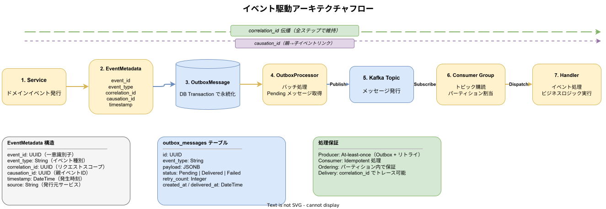

# イベント駆動設計

system tier のイベント駆動アーキテクチャにおける共通パターンを定義する。

---

## EventMetadata

全イベントに付与される共通メタデータ。`api/proto/k1s0/system/common/v1/event_metadata.proto` で定義。

| フィールド | 型 | 説明 |
| --- | --- | --- |
| event_id | string | イベント一意識別子（UUID v4） |
| event_type | string | イベント種別（`event_types.proto` の enum に対応） |
| aggregate_id | string | 集約ルートID |
| aggregate_type | string | 集約種別 |
| version | int64 | イベントバージョン番号 |
| timestamp | google.protobuf.Timestamp | イベント発生時刻 |
| correlation_id | string | リクエスト相関ID（リクエストチェーン追跡用） |
| causation_id | string | 原因イベントID（このイベントを引き起こしたイベントのID） |

### correlation_id と causation_id の違い

- **correlation_id**: 最初のリクエストから最後のレスポンスまで、一連の処理チェーン全体で同じ値を共有する。デバッグ・トレーシングに使用。
- **causation_id**: 直接の原因となったイベントのIDを格納する。イベント因果関係の追跡に使用。あるイベントが別のイベントをトリガーした場合、子イベントの `causation_id` に親イベントの `event_id` が入る。

---

## Outbox パターン

トランザクショナルアウトボックスパターンにより、DBトランザクションとイベント発行の整合性を保証する。

### idempotency_key

`OutboxMessage` には `idempotency_key` フィールドが含まれる。INSERT 時に `ON CONFLICT (idempotency_key) DO NOTHING` を使用し、重複メッセージの発行を防止する。

- デフォルト: UUID v4 から自動生成
- 明示指定: `with_idempotency_key()` メソッドで業務キーを設定可能

### 並列処理

`OutboxProcessor` は `tokio::task::JoinSet` によりメッセージを並列処理する。

- デフォルト並列度: 4
- `with_concurrency(n)` で設定可能

---

## ポイズンピル検出

DLQ Manager のコンシューマーは、メッセージのデシリアライゼーション失敗を「ポイズンピル」として検出する。

### エラー分類

| エラー種別 | 判定 | 処理 |
| --- | --- | --- |
| パースエラー（デシリアライズ失敗） | ポイズンピル | 即座に Dead 判定、リトライしない |
| 一時エラー（ネットワーク障害等） | 一時障害 | 通常のリトライフローで処理 |

ポイズンピルと判定されたメッセージは `mark_dead()` により即座に Dead 状態に移行し、無限リトライループを防止する。

---

## イベントタイプレジストリ

全イベントタイプは `api/proto/k1s0/system/common/v1/event_types.proto` の enum で一元管理する。文字列ベースのイベントタイプ指定を避け、型安全なイベント識別を実現する。

---

## 関連ドキュメント

- [メッセージング設計](../../architecture/messaging/メッセージング設計.md)
- [proto設計](../../architecture/api/proto設計.md)
- [共通実装パターン](共通実装パターン.md)
