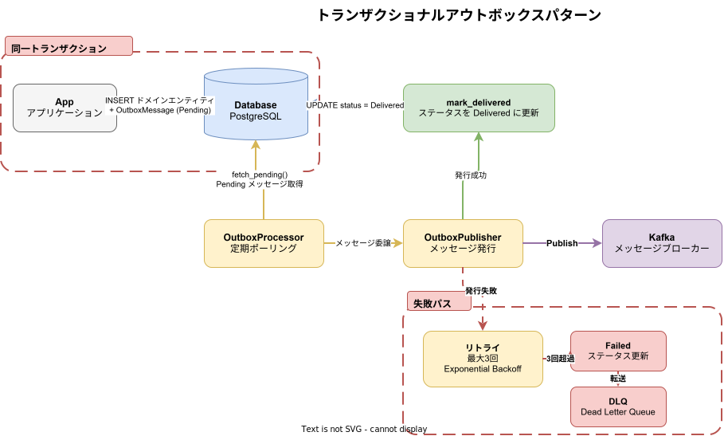
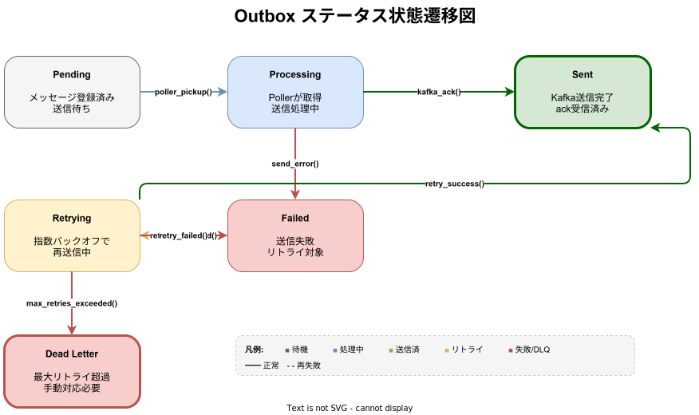
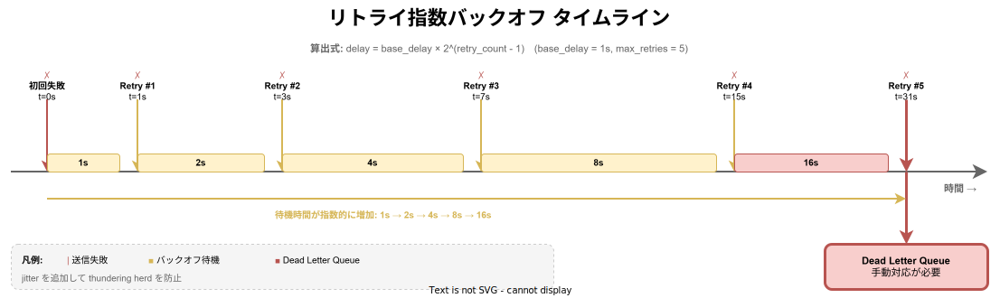

# k1s0-outbox ライブラリ設計

## 概要

トランザクショナルアウトボックスパターンライブラリ。データベーストランザクションと Kafka メッセージ発行の原子性を保証する。`OutboxMessage`（指数バックオフリトライ）、`OutboxStore` トレイト、`OutboxPublisher` トレイト、`OutboxProcessor` を提供する。

**配置先**: `regions/system/library/rust/outbox/`







## 公開 API

| 型・トレイト | 種別 | 説明 |
|-------------|------|------|
| `OutboxMessage` | 構造体 | アウトボックスに保存するメッセージ（`id`・`topic`・`partition_key`・`payload`・`status`・`retry_count`・`max_retries`・`last_error`・`created_at`・`process_after`） |
| `OutboxStatus` | enum | メッセージのステータス（`Pending`・`Processing`・`Delivered`・`Failed`・`DeadLetter`） |
| `OutboxStore` | トレイト | アウトボックスメッセージの永続化抽象（`save`・`fetch_pending`・`update`・`delete_delivered`） |
| `OutboxPublisher` | トレイト | アウトボックスメッセージの発行インターフェース（`publish`） |
| `OutboxProcessor` | 構造体 | `OutboxStore` から未発行メッセージを取得し `OutboxPublisher` 経由で発行するバッチプロセッサ（`batch_size` 指定、デフォルト 100） |
| `OutboxError` | enum | StoreError・PublishError・SerializationError・NotFound エラー型 |
| `PostgresOutboxStore` | 構造体 | PostgreSQL を使った `OutboxStore` 実装（feature = "postgres" で有効） |
| `OutboxMessage::new` / `createOutboxMessage` / `NewOutboxMessage` | ファクトリ | 新しい OutboxMessage を生成する（Rust: `OutboxMessage::new(topic, partition_key, payload)`、Go: `NewOutboxMessage(topic, partitionKey, payload)`、TS/Dart: `createOutboxMessage(topic, partitionKey, payload)`） |
| `mark_processing` / `mark_delivered` / `mark_failed` | メソッド | ステータス遷移メソッド。Rust/Go/Dart は OutboxMessage のメソッド、TS のみ外部関数（`markProcessing(msg)` 等） |
| `is_processable` | メソッド | メッセージが処理可能か判定（Pending/Failed かつ process_after 到来済み）。Dart は getter（`isProcessable`） |
| `canTransitionTo` | 関数 | ステータス遷移の妥当性チェック（TS/Dart のみ。Go/Rust は未実装） |

## Rust 実装

**Cargo.toml**:

```toml
[package]
name = "k1s0-outbox"
version = "0.1.0"
edition = "2021"

[features]
postgres = ["sqlx"]

[dependencies]
async-trait = "0.1"
chrono = { version = "0.4", features = ["serde"] }
serde = { version = "1", features = ["derive"] }
serde_json = "1"
thiserror = "2"
tokio = { version = "1", features = ["macros", "sync", "time"] }
tokio-util = { version = "0.7", features = ["sync"] }
tracing = "0.1"
uuid = { version = "1", features = ["v4", "serde"] }
sqlx = { version = "0.8", features = ["runtime-tokio-rustls", "postgres", "uuid", "chrono", "json"], optional = true }

[dev-dependencies]
tokio = { version = "1", features = ["full"] }
mockall = "0.13"
```

**依存追加**: `k1s0-outbox = { path = "../../system/library/rust/outbox" }`（[追加方法参照](../_common/共通実装パターン.md#cargo依存追加)）

**モジュール構成**:

```
outbox/
├── src/
│   ├── lib.rs              # 公開 API（再エクスポート）
│   ├── error.rs            # OutboxError（StoreError・PublishError・SerializationError・NotFound）
│   ├── message.rs          # OutboxMessage・OutboxStatus（指数バックオフ計算含む）
│   ├── processor.rs        # OutboxPublisher トレイト・OutboxProcessor（バッチ処理・リトライ制御）
│   ├── store.rs            # OutboxStore トレイト
│   └── postgres_store.rs   # PostgresOutboxStore（feature = "postgres"）
└── Cargo.toml
```

**使用例**:

```rust
use std::sync::Arc;
use k1s0_outbox::{OutboxMessage, OutboxProcessor, OutboxStore};

// ドメインイベント保存とメッセージ発行を同一トランザクションで実行
async fn create_user_with_event<S: OutboxStore>(
    store: &S,
    user_id: &str,
) -> Result<(), k1s0_outbox::OutboxError> {
    let payload = serde_json::json!({ "user_id": user_id });
    let msg = OutboxMessage::new(
        "k1s0.system.auth.user-created.v1",
        user_id,   // partition_key
        payload,
    );
    // DB トランザクション内で保存（Saga の一部として）
    store.save(&msg).await
}

// バッチプロセッサで未発行メッセージを処理
let processor = OutboxProcessor::new(
    Arc::new(store),
    Arc::new(publisher),
    /* batch_size */ 10,
);
let processed = processor.process_batch().await?;
```

**PostgreSQL ストア**（feature = "postgres"）:

```rust
use k1s0_outbox::PostgresOutboxStore;
use sqlx::PgPool;

let pool = PgPool::connect("postgres://...").await?;
let store = PostgresOutboxStore::new(pool);
// OutboxStore トレイトの全メソッド（save, fetch_pending, update, delete_delivered）を実装
```

## Go 実装

**配置先**: `regions/system/library/go/outbox/`（[定型構成参照](../_common/共通実装パターン.md#定型ディレクトリ構成)）

**依存関係**: `github.com/google/uuid v1.6.0`, `github.com/stretchr/testify v1.10.0`

**主要インターフェース**:

```go
type OutboxStatus string // "PENDING" | "PROCESSING" | "DELIVERED" | "FAILED" | "DEAD_LETTER"

type OutboxMessage struct {
    ID           string
    Topic        string
    PartitionKey string
    Payload      json.RawMessage
    Status       OutboxStatus
    RetryCount   int
    MaxRetries   int
    LastError    string
    CreatedAt    time.Time
    ProcessAfter time.Time
}

// OutboxMessage オプション関数型（MaxRetries 等を後付けで設定可能）
type OutboxMessageOption func(*OutboxMessage)

func WithMaxRetries(n int) OutboxMessageOption  // リトライ上限設定オプション

// opts は可変長引数のため既存コードへの後方互換性を維持する
func NewOutboxMessage(topic, partitionKey string, payload json.RawMessage, opts ...OutboxMessageOption) OutboxMessage
func (m *OutboxMessage) MarkProcessing()
func (m *OutboxMessage) MarkDelivered()
func (m *OutboxMessage) MarkFailed(errMsg string)
func (m *OutboxMessage) IsProcessable() bool

type OutboxStore interface {
    Save(ctx context.Context, msg *OutboxMessage) error
    // FetchPending は後方互換のために残存。単一インスタンスまたはテスト用途向け。
    FetchPending(ctx context.Context, limit int) ([]OutboxMessage, error)
    // FetchAndLock は SELECT FOR UPDATE SKIP LOCKED で取得しロックする。
    // 分散環境での重複処理防止のために使用する。
    FetchAndLock(ctx context.Context, batchSize int) ([]OutboxMessage, error)
    Update(ctx context.Context, msg *OutboxMessage) error
    DeleteDelivered(ctx context.Context, olderThanDays int) (int64, error)
}

type OutboxPublisher interface {
    Publish(ctx context.Context, msg *OutboxMessage) error
}

type OutboxProcessor struct { /* store, publisher, batchSize */ }
func NewOutboxProcessor(store OutboxStore, publisher OutboxPublisher, batchSize int) *OutboxProcessor
func (p *OutboxProcessor) ProcessBatch(ctx context.Context) (int, error)
func (p *OutboxProcessor) Run(ctx context.Context, interval time.Duration)
```

## TypeScript 実装

**配置先**: `regions/system/library/typescript/outbox/`（[定型構成参照](../_common/共通実装パターン.md#定型ディレクトリ構成)）

**主要 API**:

```typescript
export type OutboxStatus = 'PENDING' | 'PROCESSING' | 'DELIVERED' | 'FAILED' | 'DEAD_LETTER';

export type OutboxErrorCode = 'STORE_ERROR' | 'PUBLISH_ERROR' | 'SERIALIZATION_ERROR' | 'NOT_FOUND';

export interface OutboxMessage {
  id: string;
  topic: string;
  partitionKey: string;
  payload: string;
  status: OutboxStatus;
  retryCount: number;
  maxRetries: number;
  lastError: string | null;
  createdAt: Date;
  processAfter: Date;
}

export function createOutboxMessage(topic: string, partitionKey: string, payload: string): OutboxMessage;
export function markProcessing(msg: OutboxMessage): void;
export function markDelivered(msg: OutboxMessage): void;
export function markFailed(msg: OutboxMessage, error: string): void;
export function isProcessable(msg: OutboxMessage): boolean;
export function canTransitionTo(from: OutboxStatus, to: OutboxStatus): boolean;

export interface OutboxStore {
  save(msg: OutboxMessage): Promise<void>;
  fetchPending(limit: number): Promise<OutboxMessage[]>;
  update(msg: OutboxMessage): Promise<void>;
  deleteDelivered(olderThanDays: number): Promise<number>;
}

export interface OutboxPublisher {
  publish(msg: OutboxMessage): Promise<void>;
}

export class OutboxProcessor {
  constructor(store: OutboxStore, publisher: OutboxPublisher, batchSize?: number); // デフォルト: 100
  processBatch(): Promise<number>;
  run(intervalMs: number, signal?: AbortSignal): Promise<void>;
}

export class OutboxError extends Error {
  constructor(code: OutboxErrorCode, message?: string);
}
```

**カバレッジ目標**: 85%以上

## Dart 実装

**配置先**: `regions/system/library/dart/outbox/`（[定型構成参照](../_common/共通実装パターン.md#定型ディレクトリ構成)）

**依存関係**: `uuid: ^4.4.0`, `lints: ^4.0.0` (dev)

**主要 API**:

```dart
enum OutboxStatus { pending, processing, delivered, failed, deadLetter }

enum OutboxErrorCode { storeError, publishError, serializationError, notFound }

class OutboxMessage {
  final String id;
  final String topic;
  final String partitionKey;
  final String payload;
  OutboxStatus status;
  int retryCount;
  int maxRetries;
  String? lastError;
  final DateTime createdAt;
  DateTime processAfter;

  void markProcessing();
  void markDelivered();
  void markFailed(String error);
  bool get isProcessable;
}

OutboxMessage createOutboxMessage(String topic, String partitionKey, String payload);
bool canTransitionTo(OutboxStatus from, OutboxStatus to);

abstract class OutboxStore {
  Future<void> save(OutboxMessage msg);
  Future<List<OutboxMessage>> fetchPending(int limit);
  Future<void> update(OutboxMessage msg);
  Future<int> deleteDelivered(int olderThanDays);
}

abstract class OutboxPublisher {
  Future<void> publish(OutboxMessage msg);
}

class OutboxProcessor {
  OutboxProcessor(OutboxStore store, OutboxPublisher publisher, {int batchSize = 100});
  Future<int> processBatch();
  Future<void> run(Duration interval, {Future<void>? stopSignal});
}

class OutboxError implements Exception {
  final OutboxErrorCode code;
  final String? message;
  final Object? cause;
}
```

**カバレッジ目標**: 85%以上

## 設計ノート: OutboxProcessor の run() メソッドに関する言語差異

Rust の `OutboxProcessor` も `run(interval, cancellation_token)` を提供する。停止制御は `tokio_util::sync::CancellationToken` を用いる。

- **Rust**: `process_batch()` + `run(interval, cancellation_token)`
- **Go**: `ProcessBatch(ctx)` + `Run(ctx, interval)`
- **TypeScript**: `processBatch()` + `run(intervalMs, signal?)`
- **Dart**: `processBatch()` + `run(interval, {stopSignal?})`

## 設計ノート: OutboxError の言語間パターン差異

エラーの種類（StoreError・PublishError・SerializationError・NotFound）は全4言語で統一されているが、表現パターンは言語特性に合わせて異なる。

- **Rust**: `enum OutboxError { StoreError(String), PublishError(String), SerializationError(String), NotFound(String) }`
- **Go**: `struct OutboxError { Kind OutboxErrorKind, Message string, Err error }` + `OutboxErrorKind` iota enum + ヘルパーコンストラクタ（`NewStoreError`, `NewPublishError` 等）
- **TypeScript**: `class OutboxError extends Error { code: OutboxErrorCode }` + `type OutboxErrorCode = 'STORE_ERROR' | 'PUBLISH_ERROR' | 'SERIALIZATION_ERROR' | 'NOT_FOUND'`
- **Dart**: `class OutboxError implements Exception { code: OutboxErrorCode, message: String?, cause: Object? }` + `enum OutboxErrorCode { storeError, publishError, serializationError, notFound }`

## 分散環境での重複処理リスクと FetchAndLock

### 問題: 複数インスタンスによるレース状態

複数のアウトボックスプロセッサインスタンスが同時に稼働している場合、`FetchPending` と `MarkProcessing` 更新の間にレース状態が発生する。
2つのインスタンスが同一メッセージを同時に取得・処理し、重複配信が起きる可能性がある。

### 推奨実装: FetchAndLock（SELECT FOR UPDATE SKIP LOCKED）

Go 実装の `OutboxStore` インターフェースには `FetchAndLock` メソッドが追加されており、
`OutboxProcessor` はこのメソッドを呼び出す。`FetchAndLock` の実装では、以下のような
`SELECT FOR UPDATE SKIP LOCKED` クエリを推奨する:

```sql
-- PostgreSQL 実装例: SELECT FOR UPDATE SKIP LOCKED でメッセージを原子的に取得・ロックする
SELECT id, topic, partition_key, payload, status, retry_count, max_retries, last_error, created_at, process_after
FROM outbox_messages
WHERE (status = 'PENDING' OR status = 'FAILED')
  AND process_after <= NOW()
ORDER BY created_at ASC
LIMIT $1
FOR UPDATE SKIP LOCKED;
```

`SKIP LOCKED` により、他のインスタンスが既にロックしている行はスキップされるため、
同一メッセージが複数インスタンスで処理されることはない。

### フォールバック実装

`FetchAndLock` の実装コストが高い場合（テスト用モック等）は、
`FetchPending` と同等の動作にフォールバックしてよい。
その場合、分散環境での重複処理リスクを許容することになる。

### OutboxProcessor の処理フロー

```
FetchAndLock(ctx, batchSize)
    → DB レベルで SELECT FOR UPDATE SKIP LOCKED
    → 各メッセージを MarkProcessing → Update
    → Publish → MarkDelivered → Update
    → エラー時: MarkFailed → Update（指数バックオフ）
```

## トランザクション保持ポリシー（クレーム方式）

### 問題: コミット後のロック解放による重複取得

`fetch_unpublished_events` で `FOR UPDATE SKIP LOCKED` による行ロックを取得した後にトランザクションをコミットすると、行ロックが即座に解放される。複数のポーラーインスタンスが同時に稼働している場合、ロック解放後に別のポーラーが同一イベントを取得し、重複配信が発生する。

### 修正: processing_at クレーム方式

`outbox_events` テーブルに `processing_at TIMESTAMPTZ` カラムを追加し、以下の UPDATE+RETURNING 方式でクレームを実装する:

```sql
UPDATE outbox_events
SET processing_at = NOW()
WHERE id IN (
    SELECT id FROM outbox_events
    WHERE published_at IS NULL AND processing_at IS NULL
    ORDER BY created_at ASC
    LIMIT $1
    FOR UPDATE SKIP LOCKED
)
RETURNING id, aggregate_type, aggregate_id, event_type, payload, created_at, published_at
```

コミット後も `processing_at IS NOT NULL` となっているイベントは他のポーラーが取得しないため、重複配信が防止される。`published_at` が設定されると Outbox から除外される（論理削除相当）。

マイグレーション:

```sql
-- up
ALTER TABLE outbox_events ADD COLUMN IF NOT EXISTS processing_at TIMESTAMPTZ;
CREATE INDEX IF NOT EXISTS idx_outbox_events_unprocessed
  ON outbox_events (created_at ASC)
  WHERE published_at IS NULL AND processing_at IS NULL;

-- down
DROP INDEX IF EXISTS idx_outbox_events_unprocessed;
ALTER TABLE outbox_events DROP COLUMN IF EXISTS processing_at;
```

## 配信セマンティクス：At-Least-Once（最低1回）

<!-- HIGH-DOC-01 監査対応: docs/libraries/outbox.md より統合 -->

### 設計方針

本ライブラリは **at-least-once（最低1回）配信** を採用している。
イベントはメッセージブローカーへのディスパッチ **成功後に** パブリッシュ済みとしてマークされる。

```
1. 未パブリッシュイベントを SELECT ... FOR UPDATE SKIP LOCKED で取得
2. イベントを Kafka へ publish
3. publish 成功したイベントのみを published_at = NOW() でマーク
4. publish 失敗したイベントは mark されず、次回ポーリングでリトライ
```

### セマンティクス比較

| 観点 | At-Most-Once（旧実装） | At-Least-Once（現在の実装） |
|------|------------------------|----------------------------|
| 重複イベント | 発生しない | 発生しうる（Kafka 障害後のリトライ時） |
| イベントロスト | Kafka 障害時に発生しうる | 発生しない |
| コンシューマーの要件 | 冪等性不要 | 冪等性の実装を推奨 |
| 実装の複雑性 | シンプル | やや複雑（fetch と mark が分離） |

at-least-once を採用した主な理由：

1. **イベントロストの防止**: Kafka 障害・ネットワーク断でもイベントが失われない
2. **at-least-once の重複は `idempotency_key` で排除可能**: outbox の `id` または `idempotency_key` による冪等性チェックで重複排除できる
3. **projection / saga / billing への安全性**: イベント欠損によるデータ不整合を防ぐ

### トレードオフ

- **メリット**: Kafka 障害でもイベントが失われない。at-least-once の信頼性
- **デメリット**: 重複イベントが発生しうる。コンシューマーに冪等性の考慮が必要

## Fetch-Then-Mark パターン

イベントの取得と mark を分離することで、publish 成功後のみ mark するフローを実現する。

### 動作の詳細

1. `SELECT ... FOR UPDATE SKIP LOCKED` で未パブリッシュイベントを排他的に取得する（mark は行わない）
2. 取得したイベントを Kafka へ publish する
3. publish 成功したイベントの ID を収集する
4. 成功した ID に対してのみ `UPDATE outbox_events SET published_at = NOW()` を実行する
5. publish 失敗したイベントは `published_at` が NULL のまま残り、次回ポーリングで自動リトライ

`FOR UPDATE SKIP LOCKED` により、複数のポーラーが同時に動作しても、同じイベントが二重に取得されることはない。

### コード上の実装箇所

- `OutboxEventSource::fetch_unpublished_events` — イベントの取得インターフェース（mark なし）
- `OutboxEventSource::mark_events_published` — publish 成功後の mark インターフェース
- `OutboxEventPoller::poll_and_publish` — ポーリングループの本体。fetch → dispatch → mark のフロー
- `OutboxEventHandler::handle_event` — イベント種別ごとの変換・Kafka publish ロジック

## idempotency_key による冪等性保証

outbox_events テーブルには `idempotency_key` カラム（NOT NULL, UNIQUE）が設定されている。

### INSERT 時の動作

各サービスの repository は outbox 行を INSERT する際に `ON CONFLICT (idempotency_key) DO NOTHING` を指定する。

```sql
INSERT INTO outbox_events (id, ..., idempotency_key)
VALUES ($1, ..., $7)
ON CONFLICT (idempotency_key) DO NOTHING
```

`idempotency_key` には `event_id`（UUID）を文字列化したものを使用する。

### コンシューマーの冪等性

at-least-once では同一イベントが複数回配信される可能性がある（Kafka 障害後のリトライ時）。
コンシューマーは以下のいずれかで冪等性を担保すること：

- イベント ID をキーとした処理済み判定（処理済みイベント ID テーブル or キャッシュ）
- または、イベントのバージョン番号による楽観的ロック

## スキーマ要件

### search_path の設定

service 系サーバーの DB 接続は、接続 URL に `options=-c search_path%3D{schema}` を指定して、
runtime SQL が正しいスキーマのテーブルを参照するようにすること。

```rust
// config.rs の connection_url() の実装例
format!(
    "postgresql://{}:{}@{}:{}/{}?sslmode={}&options=-c search_path%3D{}",
    user, password, host, port, name, ssl_mode, schema
)
```

各サービスのデフォルトスキーマ：
- task-server: `task_service`
- board-server: `board_service`
- activity-server: `activity_service`

## Dead Letter Queue（DLQ）仕様（M-007 監査対応）

### DeadLetter ステータスへの遷移条件

`OutboxMessage` は `mark_failed()` が呼ばれるたびにリトライ回数（`retry_count`）をインクリメントし、`retry_count >= max_retries`（デフォルト: 3）に達した時点でステータスが `DeadLetter` に遷移する。

```
Pending → Processing → (publish 失敗) → Failed → ... → DeadLetter
                                                  ↑ retry_count が max_retries を超過した時点
```

状態遷移のコード（Rust 実装）:

```rust
// mark_failed() の実装（message.rs より）
pub fn mark_failed(&mut self, error: impl Into<String>) {
    self.retry_count += 1;
    self.last_error = Some(error.into());
    if self.retry_count >= self.max_retries {
        self.status = OutboxStatus::DeadLetter;  // DLQ 相当のステータスに遷移
    } else {
        self.status = OutboxStatus::Failed;
        // 指数バックオフ: 2^retry_count 秒後に再処理
        let delay_secs = 2u64.pow(self.retry_count);
        self.process_after = Utc::now() + chrono::Duration::seconds(delay_secs as i64);
    }
}
```

### 現在の DLQ 実装

現在の実装では、メッセージブローカー（Kafka）への DLQ トピック転送は行わない。`DeadLetter` ステータスのメッセージは DB テーブル上に `status = 'DEAD_LETTER'` としてマークされたまま残る。

| 項目 | 詳細 |
|------|------|
| DLQ トピックへの転送 | **なし**（現時点では未実装） |
| DeadLetter メッセージの保管場所 | DB テーブル（`outbox_messages`）に `status = 'DEAD_LETTER'` として残存 |
| DeadLetter メッセージの処理 | `OutboxProcessor.fetch_pending()` の対象外（`Pending` / `Failed` のみ取得） |
| 再処理方法 | 手動で `status = 'PENDING'` に更新するか、個別スクリプトを実行する |
| `delete_delivered()` の対象 | `Delivered` のみ。`DeadLetter` メッセージは削除されない |

### DeadLetter メッセージの確認クエリ

```sql
-- DeadLetter 状態のメッセージを確認する（手動対応が必要）
SELECT id, topic, partition_key, retry_count, last_error, created_at
FROM outbox_messages
WHERE status = 'DEAD_LETTER'
ORDER BY created_at ASC;
```

### 将来の改善: DLQ トピックへの転送

将来的には、`DeadLetter` 状態に遷移した際に専用の Kafka DLQ トピック（例: `k1s0.dlq.{original_topic}`）へ転送することを検討している。これにより:

- DLQ メッセージの自動モニタリング（Kafka Consumer Lag 等）が可能になる
- 再処理ワークフローを Kafka Streams で実装できる
- DB テーブルの肥大化を防ぐ

実装時は `OutboxPublisher` トレイトの拡張または `DlqPublisher` トレイトの追加で対応する予定。

## 関連ドキュメント

- [system-library-概要](../_common/概要.md) — ライブラリ一覧・テスト方針
- [system-library-config設計](../config/config.md) — config ライブラリ
- [system-library-telemetry設計](../observability/telemetry.md) — telemetry ライブラリ
- [system-library-authlib設計](../auth-security/authlib.md) — authlib ライブラリ
- [system-library-messaging設計](messaging.md) — k1s0-messaging ライブラリ
- [system-library-kafka設計](kafka.md) — k1s0-kafka ライブラリ
- [system-library-correlation設計](../observability/correlation.md) — k1s0-correlation ライブラリ
- [system-library-schemaregistry設計](../data/schemaregistry.md) — k1s0-schemaregistry ライブラリ

---
