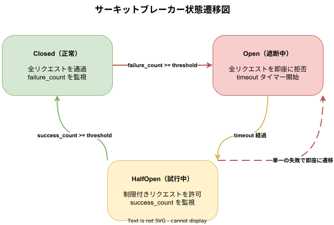

# k1s0-circuit-breaker ライブラリ設計

## 概要

サーキットブレーカーパターン実装ライブラリ。Closed/Open/HalfOpen の3状態管理と、OpenTelemetry メトリクス連携によるサーキットブレーカー状態の可視化を提供する。gRPC/HTTP のサービス間呼び出しで利用する。

失敗閾値を超えた呼び出し先を一定期間遮断し、HalfOpen 状態でプローブ呼び出しを行い自動復旧を判定する。スレッドセーフな状態遷移を `tokio::sync::Mutex` で保証し、全状態変化を OpenTelemetry メトリクスとして記録する。

> **HalfOpen→Open 遷移**: 全言語共通で、HalfOpen 状態での単一の失敗は即座に Open 状態へ戻る（failure_threshold は参照しない）。これにより、回復途中のサービスへの過負荷を防ぐ。

**配置先**: `regions/system/library/rust/circuit-breaker/`



## 公開 API

| 型・トレイト | 種別 | 説明 |
|-------------|------|------|
| `CircuitBreaker` | 構造体 | 失敗閾値・オープン時間・ハーフオープン試行数の設定と状態管理 |
| `CircuitBreakerState` | enum | `Closed`（正常）/ `Open`（遮断中）/ `HalfOpen`（試行中） |
| `CircuitBreakerConfig` | 構造体 | failure_threshold, success_threshold, timeout 設定（デフォルト: 5 / 3 / 30s） |
| `CircuitBreakerMetrics` | 構造体（全 4 言語） | メトリクス（failure_count / success_count / state）。Rust は OpenTelemetry 連携、Go/TS/Dart は構造体/クラスとして提供 |
| `CircuitBreakerError<E>` | enum | ジェネリックエラー型（`Open`・`Inner(E)`） |
| `CircuitBreaker::record_success()` | メソッド | 成功を記録し、HalfOpen 状態での復旧判定を行う |
| `CircuitBreaker::record_failure()` | メソッド | 失敗を記録し、閾値超過で Open 遷移。HalfOpen 状態では即座に Open へ戻る |
| `CircuitBreaker::metrics()` | メソッド（全 4 言語） | 現在の failure_count / success_count / state を返す |

## Rust 実装

**Cargo.toml**:

```toml
[package]
name = "k1s0-circuit-breaker"
version = "0.1.0"
edition = "2021"

[features]
metrics = ["opentelemetry"]
mock = ["mockall"]

[dependencies]
async-trait = "0.1"
thiserror = "2"
tokio = { version = "1", features = ["sync", "time", "macros"] }
opentelemetry = { version = "0.27", optional = true }
mockall = { version = "0.13", optional = true }

[dev-dependencies]
tokio = { version = "1", features = ["full"] }
```

`metrics` feature はオプトインで有効化する。無効時は OpenTelemetry 依存なしで利用できる。

**依存追加**: `k1s0-circuit-breaker = { path = "../../system/library/rust/circuit-breaker" }`（[追加方法参照](../_common/共通実装パターン.md#cargo依存追加)）

**モジュール構成**:

```
circuit-breaker/
├── src/
│   ├── lib.rs          # 公開 API（再エクスポート）・使用例ドキュメント
│   ├── breaker.rs      # CircuitBreaker・CircuitBreakerState
│   ├── config.rs       # CircuitBreakerConfig（failure_threshold, success_threshold, timeout）
│   ├── metrics.rs      # CircuitBreakerMetrics（OTel メトリクス）
│   └── error.rs        # CircuitBreakerError<E>
└── Cargo.toml
```

**使用例**:

```rust
use k1s0_circuit_breaker::{CircuitBreaker, CircuitBreakerConfig};
use std::time::Duration;

// サーキットブレーカー設定（連続5回失敗で30秒遮断、HalfOpen で3回成功なら復旧）
let config = CircuitBreakerConfig {
    failure_threshold: 5,
    success_threshold: 3,
    timeout: Duration::from_secs(30),
};

let cb = CircuitBreaker::new(config);

// サーキットブレーカー経由でサービス呼び出し
let result = cb.call(|| async {
    grpc_client.call_service(request.clone()).await
}).await?;

// 現在の状態を確認
let state = cb.state().await;
println!("CircuitBreaker state: {:?}", state);

// メトリクス取得
let metrics = cb.metrics().await;
println!("failures: {}, successes: {}", metrics.failure_count, metrics.success_count);
```

## Go 実装

**配置先**: `regions/system/library/go/circuit-breaker/`（[定型構成参照](../_common/共通実装パターン.md#定型ディレクトリ構成)）

**依存関係**: なし（標準ライブラリのみ）

### HalfOpen 状態の同時実行制御

Go 実装の `Call` メソッドは HalfOpen 状態において `sync/atomic` の CAS（Compare-And-Swap）操作を使用し、同時に **1件のみ** プローブリクエストを通過させる。

- `halfOpenInFlight int32` フィールドをアトミックに管理する
- `atomic.CompareAndSwapInt32(&cb.halfOpenInFlight, 0, 1)` で1件のみ通過を許可
- 2件目以降は即座に `ErrOpen` を返す
- プローブリクエスト完了後（成功・失敗どちらでも）`atomic.StoreInt32(&cb.halfOpenInFlight, 0)` でリセット

これにより、回復途中のサービスに複数のプローブが同時に到達してサービスを再ダウンさせるリスクを防ぐ。

**主要インターフェース**:

```go
type State int

const (
    StateClosed   State = iota
    StateOpen
    StateHalfOpen
)

type Config struct {
    FailureThreshold uint32
    SuccessThreshold uint32
    Timeout          time.Duration
}

type CircuitBreaker struct {
    // unexported fields
}

func New(cfg Config) *CircuitBreaker

func (cb *CircuitBreaker) Call(fn func() error) error

func (cb *CircuitBreaker) State() State

func (cb *CircuitBreaker) IsOpen() bool

func (cb *CircuitBreaker) RecordSuccess()

func (cb *CircuitBreaker) RecordFailure()

func (cb *CircuitBreaker) Metrics() CircuitBreakerMetrics

// CircuitBreakerMetrics はサーキットブレーカーの現在の状態メトリクスを保持する。
type CircuitBreakerMetrics struct {
    FailureCount uint32
    SuccessCount uint32
    State        State
}

// センチネルエラー: Open 状態で Call() を呼んだ場合に返される
var ErrOpen = errors.New("circuit breaker is open")
```

## TypeScript 実装

**配置先**: `regions/system/library/typescript/circuit-breaker/`（[定型構成参照](../_common/共通実装パターン.md#定型ディレクトリ構成)）

**主要 API**:

```typescript
export type CircuitState = 'closed' | 'open' | 'half-open';

export interface CircuitBreakerConfig {
  failureThreshold: number;
  successThreshold: number;
  timeoutMs: number;
}

export class CircuitBreakerError extends Error {
  constructor();
}

export class CircuitBreaker {
  constructor(config: CircuitBreakerConfig);
  get state(): CircuitState;
  isOpen(): boolean;
  recordSuccess(): void;
  recordFailure(): void;
  metrics(): CircuitBreakerMetrics;
  async call<T>(fn: () => Promise<T>): Promise<T>;
}

export interface CircuitBreakerMetrics {
  failureCount: number;
  successCount: number;
  state: CircuitState;
}
```

**カバレッジ目標**: 90%以上

## Dart 実装

**配置先**: `regions/system/library/dart/circuit_breaker/`（[定型構成参照](../_common/共通実装パターン.md#定型ディレクトリ構成)）

**主要 API**:

```dart
enum CircuitState { closed, open, halfOpen }

class CircuitBreakerConfig {
  final int failureThreshold;
  final int successThreshold;
  final Duration timeout;

  const CircuitBreakerConfig({
    required this.failureThreshold,
    required this.successThreshold,
    required this.timeout,
  });
}

class CircuitBreakerException implements Exception {
  const CircuitBreakerException();
}

class CircuitBreaker {
  CircuitBreaker(CircuitBreakerConfig config);

  CircuitState get state;
  bool get isOpen;

  void recordSuccess();
  void recordFailure();
  CircuitBreakerMetrics get metrics;
  Future<T> call<T>(Future<T> Function() fn);
}

class CircuitBreakerMetrics {
  final int failureCount;
  final int successCount;
  final CircuitState state;

  const CircuitBreakerMetrics({
    required this.failureCount,
    required this.successCount,
    required this.state,
  });
}
```

**カバレッジ目標**: 90%以上

## テスト戦略

| テスト種別 | 対象 | ツール |
|-----------|------|--------|
| ユニットテスト（`#[cfg(test)]`） | 状態遷移ロジック（Closed→Open→HalfOpen→Closed）・閾値カウント・タイムアウト計算 | tokio::test |
| モックテスト | `mockall` による実行関数モック・失敗注入テスト | mockall (feature = "mock") |
| 並行性テスト | 複数タスクからの同時実行・状態レースコンディション検証 | tokio::test（複数スポーン） |
| プロパティテスト | ランダムな失敗シーケンスでの状態整合性検証 | proptest |

## 関連ドキュメント

- [system-library-概要](../_common/概要.md) — ライブラリ一覧・テスト方針
- [system-library-retry設計](retry.md) — リトライと組み合わせた利用パターン
- [可観測性設計](../../architecture/observability/可観測性設計.md) — OpenTelemetry メトリクス設計
- [gRPC設計](../../architecture/api/gRPC設計.md) — サービス間呼び出し設計
