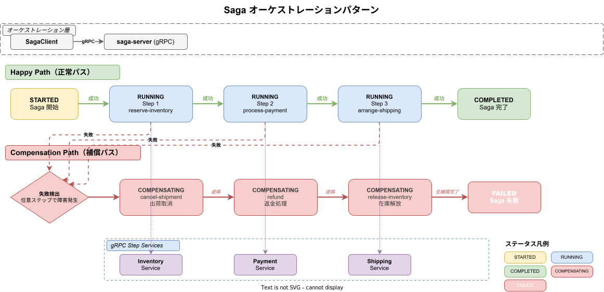
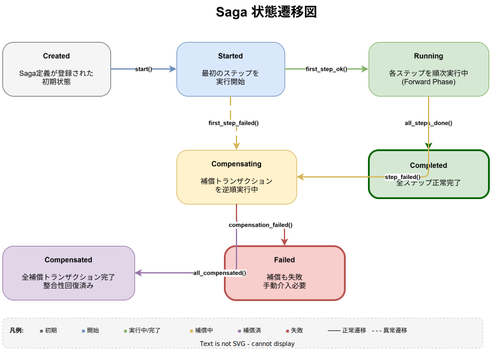
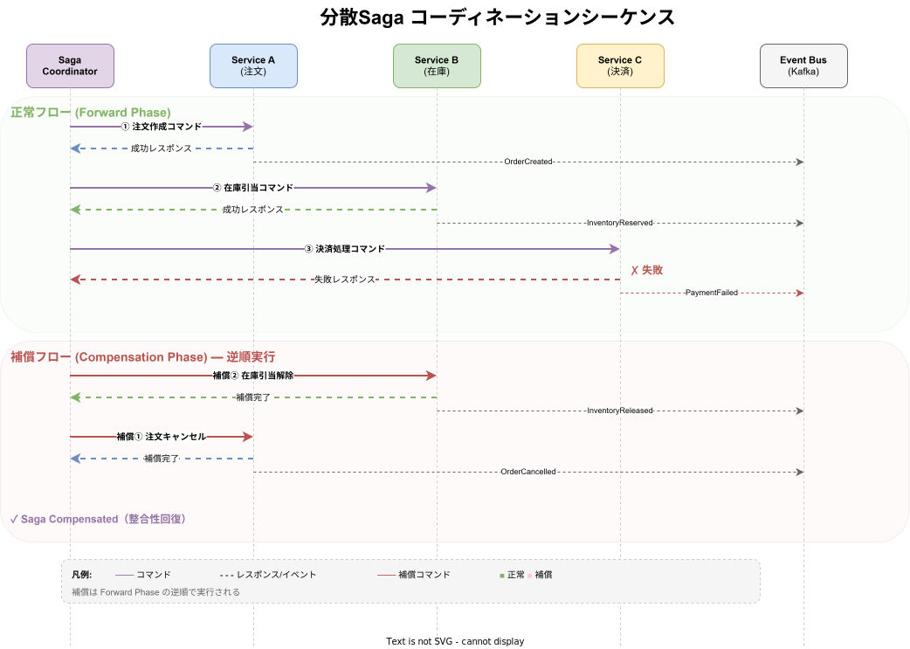

# k1s0-saga ライブラリ設計

## 概要

Saga パターンクライアントライブラリ。分散トランザクションの開始・状態取得・キャンセルを管理する REST クライアントを提供する。`SagaClient` 構造体、`SagaState`・`SagaStatus` 型、補償トランザクション制御をサポートする。

**配置先**: `regions/system/library/rust/saga/`







## 公開 API

| 型・トレイト | 種別 | 説明 |
|-------------|------|------|
| `SagaClient` | 構造体 | Saga サーバーへの REST クライアント（HTTP、タイムアウト30秒） |
| `SagaStatus` | enum | Saga の実行ステータス（`Started`・`Running`・`Completed`・`Compensating`・`Failed`・`Cancelled`、シリアライズ時 SCREAMING_SNAKE_CASE） |
| `SagaState` | 構造体 | Saga の現在状態（saga_id・workflow_name・current_step・status・payload・correlation_id・initiated_by・error_message・created_at・updated_at） |
| `SagaStepLog` | 構造体 | 各ステップの実行ログ（id・saga_id・step_index・step_name・action・status・request_payload・response_payload・error_message・started_at・completed_at） |
| `StartSagaRequest` | 構造体 | Saga 開始リクエスト（workflow_name・payload・correlation_id・initiated_by） |
| `StartSagaResponse` | 構造体 | Saga 開始レスポンス（saga_id・status） |
| `SagaError` | enum | NetworkError・DeserializeError・ApiError（status_code + message） |

## Rust 実装

**Cargo.toml**:

```toml
[package]
name = "k1s0-saga"
version = "0.1.0"
edition = "2021"

[dependencies]
reqwest = { version = "0.12", features = ["json"] }
serde = { version = "1", features = ["derive"] }
serde_json = "1"
thiserror = "2"
uuid = { version = "1", features = ["v4", "serde"] }
chrono = { version = "0.4", features = ["serde"] }
async-trait = "0.1"

[dev-dependencies]
tokio = { version = "1", features = ["full"] }
wiremock = "0.6"
```

**モジュール構成**:

```
saga/
├── src/
│   ├── lib.rs      # 公開 API（再エクスポート）
│   ├── client.rs   # SagaClient（HTTP REST クライアント）
│   ├── types.rs    # SagaStatus・SagaState・StartSagaRequest/Response・SagaStepLog
│   └── error.rs    # SagaError
└── Cargo.toml
```

**使用例**:

```rust
use k1s0_saga::{SagaClient, StartSagaRequest};

let client = SagaClient::new("http://saga-server:8080");

// Saga 開始
let request = StartSagaRequest {
    workflow_name: "task-assignment".to_string(),
    payload: serde_json::json!({ "task_id": "task-123" }),
    correlation_id: Some("corr-001".to_string()),
    initiated_by: Some("task-service".to_string()),
};
let response = client.start_saga(&request).await?;

// 状態取得
let state = client.get_saga(&response.saga_id).await?;
println!("Status: {:?}", state.status);
println!("Current step: {}", state.current_step);

// キャンセル
client.cancel_saga(&response.saga_id).await?;
```

**API エンドポイント**:

| メソッド | パス | 説明 |
|---------|------|------|
| `POST` | `/api/v1/sagas` | Saga 開始 |
| `GET` | `/api/v1/sagas/{id}` | Saga 状態取得 |
| `POST` | `/api/v1/sagas/{id}/cancel` | Saga キャンセル |

## Go 実装

**配置先**: `regions/system/library/go/saga/`（[定型構成参照](../_common/共通実装パターン.md#定型ディレクトリ構成)）

**主要型**:

```go
type SagaStatus string

const (
    SagaStatusStarted      SagaStatus = "STARTED"
    SagaStatusRunning      SagaStatus = "RUNNING"
    SagaStatusCompleted    SagaStatus = "COMPLETED"
    SagaStatusCompensating SagaStatus = "COMPENSATING"
    SagaStatusFailed       SagaStatus = "FAILED"
    SagaStatusCancelled    SagaStatus = "CANCELLED"
)

type SagaState struct {
    SagaID       string        `json:"saga_id"`
    WorkflowName string        `json:"workflow_name"`
    Status       SagaStatus    `json:"status"`
    StepLogs     []SagaStepLog `json:"step_logs"`
    CreatedAt    time.Time     `json:"created_at"`
    UpdatedAt    time.Time     `json:"updated_at"`
}

type StartSagaRequest struct {
    WorkflowName  string  `json:"workflow_name"`
    Payload       any     `json:"payload"`
    CorrelationID *string `json:"correlation_id,omitempty"`
    InitiatedBy   *string `json:"initiated_by,omitempty"`
}

type StartSagaResponse struct {
    SagaID string `json:"saga_id"`
    Status string `json:"status"`
}

type SagaClient struct {
    endpoint   string
    httpClient *http.Client
}

func NewSagaClient(endpoint string) *SagaClient
func (c *SagaClient) StartSaga(ctx context.Context, req *StartSagaRequest) (*StartSagaResponse, error)
func (c *SagaClient) GetSaga(ctx context.Context, sagaID string) (*SagaState, error)
func (c *SagaClient) CancelSaga(ctx context.Context, sagaID string) error
```

### セキュリティ: URL パスエスケープ（パストラバーサル防止）

`GetSaga` および `CancelSaga` の `sagaID` パラメータは URL パスに直接埋め込まれる。
`sagaID` に `../` のようなパストラバーサルシーケンスが含まれる場合、
意図しないエンドポイントへのリクエストが発生する可能性がある。

Go 実装では `net/url` パッケージの `url.PathEscape` を使用して `sagaID` をエスケープする:

```go
// url.PathEscape により "/" は "%2F" にエンコードされ、パストラバーサルを防止する
url.PathEscape(sagaID)
// 例: "../attack" → "..%2Fattack"（HTTP リクエストの RawPath に %2F として送信）
```

**注意**: `r.URL.Path`（Go HTTP サーバーの decoded パス）では `%2F` がデコードされて `/` に戻るが、
HTTP ワイヤー上の実際のリクエストは `%2F` のままであるため、パストラバーサルは防止される。

## TypeScript 実装

**配置先**: `regions/system/library/typescript/saga/`（[定型構成参照](../_common/共通実装パターン.md#定型ディレクトリ構成)）

**主要 API**:

```typescript
export type SagaStatus =
  | 'STARTED' | 'RUNNING' | 'COMPLETED'
  | 'COMPENSATING' | 'FAILED' | 'CANCELLED';

export interface SagaState {
  sagaId: string;
  workflowName: string;  // saga_type → workflow_name に統一
  currentStep: number;
  status: SagaStatus;
  payload: Record<string, unknown>;
  correlationId?: string;
  initiatedBy?: string;
  errorMessage?: string;
  stepLogs: SagaStepLog[];
  createdAt: string;
  updatedAt: string;
}

export interface StartSagaRequest {
  workflowName: string;  // saga_type → workflow_name に統一
  payload: unknown;
  correlationId?: string;
  initiatedBy?: string;
}

export interface StartSagaResponse {
  sagaId: string;
  status: string;
}

export class SagaClient {
  constructor(endpoint: string);
  startSaga(request: StartSagaRequest): Promise<StartSagaResponse>;
  getSaga(sagaId: string): Promise<SagaState>;
  cancelSaga(sagaId: string): Promise<void>;
}
```

## Dart 実装

**配置先**: `regions/system/library/dart/saga/`（[定型構成参照](../_common/共通実装パターン.md#定型ディレクトリ構成)）

**主要型**:

```dart
class SagaState {
  final String sagaId;
  final String workflowName;
  final int currentStep;
  final SagaStatus status;
  final Map<String, dynamic> payload;
  final String? correlationId;
  final String? initiatedBy;
  final String? errorMessage;
  final List<SagaStepLog> stepLogs;
  final String createdAt;
  final String updatedAt;
}

class StartSagaResponse {
  final String sagaId;
  final String status;
}
```

## 関連ドキュメント

- [system-library-概要](../_common/概要.md) — ライブラリ一覧・テスト方針
- [system-saga-server設計](../../servers/saga/server.md) — saga-server REST API 設計
- [system-library-messaging設計](../messaging/messaging.md) — k1s0-messaging ライブラリ

---
