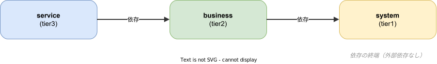

# System Tier 概要

## system tier とは

system tier（共通基盤層）は、k1s0 プラットフォーム全体を支える最下層のインフラストラクチャレイヤーである。business tier および service tier が依存する共通機能を提供し、プロジェクト横断で再利用される。

k1s0 はモノリポ構成を採用しており、`regions/` 配下に 3 つの tier が存在する。

```
regions/
  system/    ← 共通基盤層（本ドキュメントの対象）
  business/  ← ビジネスロジック層
  service/   ← サービス固有層
```

system tier は**依存される側**であり、上位 tier から参照されるが、上位 tier に依存することはない。この単方向依存が k1s0 のアーキテクチャの根幹を成す。

## 提供するもの

### サーバー（24 種類）

system tier は以下のカテゴリのサーバーを提供する。実装言語は Rust（コアサービス）と Go（BFF）。

| カテゴリ | サーバー |
|---------|---------|
| 認証・認可 | auth, session, policy, vault |
| 構成管理 | config, featureflag |
| 流量制御 | ratelimit, quota |
| API 管理 | api-registry, graphql-gateway, bff-proxy |
| イベント基盤 | event-store, event-monitor, dlq-manager |
| オーケストレーション | workflow, saga |
| マスタ管理 | domain-master, rule-engine, master-maintenance, tenant |
| ユーティリティ | navigation, notification, search, file, scheduler |

### ライブラリ（50+ 種類）

4 言語（Go / Rust / TypeScript / Dart）で提供される共通ライブラリ群。

- **サーバー共通**: k1s0-server-common（認証、設定、DB、gRPC、Kafka、RBAC、トレース等）
- **構成管理**: config, featureflag
- **メッセージング**: k1s0-messaging, k1s0-kafka, websocket
- **可観測性**: telemetry, tracing, correlation, audit-client
- **認証・セキュリティ**: auth, session-client, tenant-client
- **データ**: eventstore, schemaregistry
- **耐障害性**: resilience 関連ライブラリ
- **クライアント SDK**: ratelimit-client, quota-client 等

### クライアント SDK

- **React**（TypeScript）: Web フロントエンド向け SDK
- **Flutter**（Dart）: モバイル/デスクトップ向け SDK

### データベース

- PostgreSQL 17 を標準 DB として使用
- sqlx による型安全なクエリ（Go / Rust 共通パターン）
- マイグレーション管理

### Proto 定義

- サービス間通信の gRPC スキーマ定義
- buf によるコード生成パイプライン

## 他 tier との関係



- **business tier から**: system tier のライブラリ・クライアント SDK を利用し、system tier のサーバーに gRPC で通信する
- **service tier から**: business tier を経由して間接的に利用するか、共通ライブラリを直接参照する
- **system tier 内部**: サーバー間は gRPC で通信し、Kafka によるイベント駆動連携も行う

## 担当開発者に求められるスキル

### 必須スキル

- **Rust**: axum / tonic / sqlx によるサーバー実装経験
- **Go**: BFF 実装、gRPC クライアント実装経験
- **gRPC / Protocol Buffers**: サービス間通信の設計・実装
- **PostgreSQL**: スキーマ設計、クエリ最適化、マイグレーション管理
- **Docker / Kubernetes**: コンテナ化とオーケストレーション
- **クリーンアーキテクチャ / DDD**: ドメインモデリング、レイヤー分離の設計判断

### 推奨スキル

- **TypeScript / Dart**: クライアント SDK の開発・メンテナンス
- **Kafka**: イベント駆動アーキテクチャの設計・運用
- **OpenTelemetry**: 分散トレーシング、メトリクス収集
- **Keycloak / OAuth 2.0 / OIDC**: 認証認可基盤の構築・運用
- **Terraform / Helm**: インフラのコード化
- **Istio**: サービスメッシュの設定・運用

### マインドセット

- **後方互換性への意識**: system tier の変更は全 tier に影響する。破壊的変更は慎重に判断する
- **汎用性と拡張性**: 特定プロジェクト向けではなく、横断的に使える設計を心がける
- **信頼性**: 基盤として SLO を意識した実装と運用を行う
- **ドキュメント**: API 仕様・設計意図を明文化する習慣

---

## 関連ドキュメント

- [コンセプト](../../architecture/overview/コンセプト.md) — k1s0 全体のコンセプトと設計思想
- [Tier アーキテクチャ](../../architecture/overview/tier-architecture.md) — tier 構成の詳細設計
- [ディレクトリ構成図](../../architecture/overview/ディレクトリ構成図.md) — リポジトリ全体のディレクトリ構造
- [ライブラリ概要](../../libraries/_common/概要.md) — 共通ライブラリの全体像
- [共通実装パターン](../../libraries/_common/共通実装パターン.md) — ライブラリ間の共通実装パターン
- [サーバー共通実装](../../servers/_common/implementation.md) — サーバー実装の共通パターン
