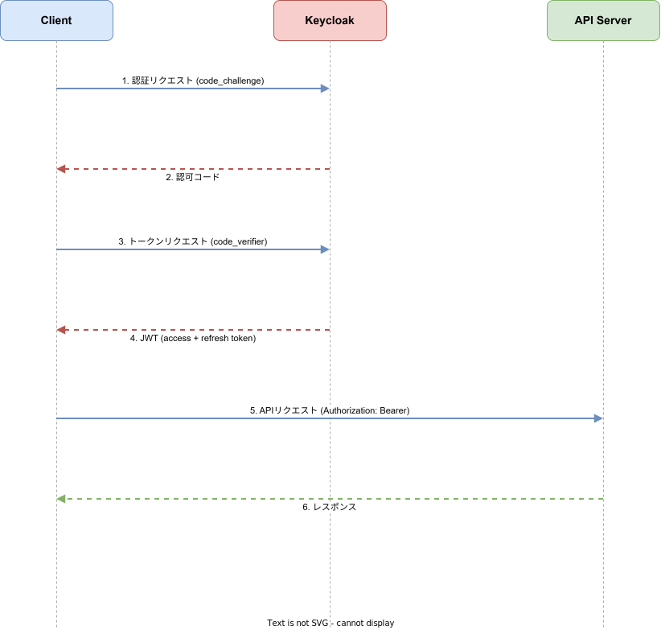
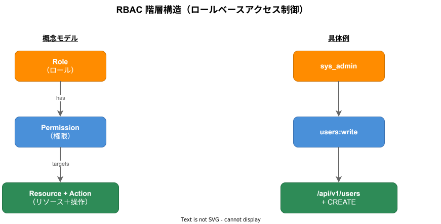

# 認証とセキュリティ

## Keycloak 統合

k1s0 は認証認可基盤として Keycloak 26.0 LTS を採用する。全 tier のユーザー認証・サービス認証を一元管理する。

### Realm 構成

| Realm | 用途 |
|-------|------|
| k1s0 | メインの Realm。全ユーザー・サービスアカウントを管理 |
| k1s0-internal | 内部サービス間認証専用 |

### Client 設定

各サーバー・クライアントアプリケーションは Keycloak の Client として登録される。

| Client 種別 | アクセスタイプ | フロー |
|-------------|--------------|--------|
| Web フロントエンド（React） | public | Authorization Code + PKCE |
| モバイルアプリ（Flutter） | public | Authorization Code + PKCE |
| CLI ツール | public | Device Authorization Grant |
| バックエンドサービス | confidential | Client Credentials |
| BFF（graphql-gateway） | confidential | Authorization Code（サーバーサイド） |

### Keycloak の管理

```bash
# ローカル Keycloak の起動（docker-compose）
just local-up-dev
# または infra のみ起動する場合:
# just local-up-profile infra

# 管理コンソール: http://localhost:8180
# 初期管理者: admin / dev（ローカル環境のみ）
```

Realm 設定、Client 設定、Role 設定は Terraform で管理し、環境間の一貫性を保つ。

## OAuth 2.0 フロー

### Authorization Code + PKCE（Web / モバイル）



### Device Authorization Grant（CLI）

k1s0 CLI からの認証に使用する。ブラウザを持たない環境でも認証可能。

```
1. CLI が Keycloak に device_code をリクエスト
2. ユーザーにブラウザで verification_uri を開くよう表示
3. ユーザーがブラウザで認証・認可
4. CLI が polling でトークンを取得
```

### Client Credentials（サービス間）

サービス間の認証に使用する。ユーザーコンテキストを持たない機械的な通信。

```bash
# トークン取得
curl -X POST "http://keycloak:8080/realms/k1s0/protocol/openid-connect/token" \
  -d "grant_type=client_credentials" \
  -d "client_id=auth-service" \
  -d "client_secret=${CLIENT_SECRET}"
```

## JWT クレーム構造とトークンライフタイム

### アクセストークンのクレーム構造

```json
{
  "iss": "https://keycloak.k1s0.internal/realms/k1s0",
  "sub": "user-uuid",
  "aud": ["k1s0-api"],
  "exp": 1700000000,
  "iat": 1699999100,
  "jti": "token-uuid",
  "typ": "Bearer",
  "azp": "web-client",
  "scope": "openid profile",
  "realm_access": {
    "roles": ["user", "admin"]
  },
  "resource_access": {
    "tenant-service": {
      "roles": ["tenant:read", "tenant:write"]
    }
  },
  "tenant_id": "tenant-uuid",
  "preferred_username": "user@example.com"
}
```

### トークンライフタイム

| トークン種別 | 有効期間 | 用途 |
|-------------|---------|------|
| アクセストークン | 5 分 | API リクエストの認証 |
| リフレッシュトークン | 30 分（スライディング） | アクセストークンの更新 |
| ID トークン | 5 分 | ユーザー情報の取得 |
| オフライントークン | 30 日 | CLI 等の長期セッション |

### JWT 検証

全サーバーは k1s0-server-common の `JwtValidator` を使用して JWT を検証する。

```rust
use k1s0_server_common::auth::JwtValidator;

// 初期化（Keycloak の JWKS エンドポイントから公開鍵を取得）
let validator = JwtValidator::new(&config.auth).await?;

// gRPC インターセプターとして使用
let grpc_server = Server::builder()
    .layer(AuthLayer::new(validator))
    .add_service(service)
    .serve(addr)
    .await?;
```

## RBAC モデル

k1s0 はロールベースアクセス制御（RBAC）を採用する。Role → Permission → Resource の 3 階層モデル。

### 構造



### 具体例

| Role | Permission | Resource | Action |
|------|-----------|----------|--------|
| system-admin | tenant:* | tenant | create, read, update, delete |
| tenant-admin | tenant:read, tenant:update | tenant | read, update |
| developer | config:read | config | read |
| viewer | *:read | * | read |

### RBAC ミドルウェアの使用

```rust
use k1s0_server_common::rbac::{RbacMiddleware, require_permission};

// gRPC ハンドラでの権限チェック
async fn create_tenant(
    &self,
    request: Request<CreateTenantRequest>,
) -> Result<Response<CreateTenantResponse>, Status> {
    // RBAC チェック
    require_permission(&request, "tenant", "create")?;

    // ビジネスロジック実行
    // ...
}
```

### Policy サーバーとの連携

RBAC ポリシーの評価は policy サーバーに委譲される。各サーバーは policy サーバーに gRPC で問い合わせ、結果をキャッシュする。

```yaml
# config.yaml
rbac:
  policy_service_url: "http://policy:50051"
  cache_ttl_secs: 300    # ポリシー評価結果を 5 分間キャッシュ
  cache_max_entries: 1000
```

## サービス間認証

### mTLS（Istio 経由）

Kubernetes クラスタ内のサービス間通信は Istio のサービスメッシュにより mTLS で自動暗号化される。アプリケーション側での明示的な TLS 設定は不要。

```yaml
# Istio PeerAuthentication
apiVersion: security.istio.io/v1
kind: PeerAuthentication
metadata:
  name: default
  namespace: k1s0-system
spec:
  mtls:
    mode: STRICT
```

### OAuth 2.0 Client Credentials

mTLS に加え、アプリケーションレベルの認証として Client Credentials フローを使用する。各サービスは Keycloak のサービスアカウントを持つ。

```rust
use k1s0_server_common::auth::ServiceTokenProvider;

// サービストークンの取得（自動更新付き）
let token_provider = ServiceTokenProvider::new(&config.auth).await?;
let token = token_provider.get_token().await?;

// gRPC クライアントにトークンを付与
let mut request = Request::new(payload);
request.metadata_mut().insert(
    "authorization",
    format!("Bearer {}", token).parse()?,
);
```

## Vault によるシークレット管理

HashiCorp Vault を使用してシークレット（DB パスワード、API キー、証明書等）を一元管理する。

### シークレットの格納パス

```
secret/
├── k1s0-system/
│   ├── auth/           # auth サーバーのシークレット
│   │   ├── db-url
│   │   ├── keycloak-client-secret
│   │   └── jwt-signing-key
│   ├── config/         # config サーバーのシークレット
│   └── ...
├── k1s0-business/
└── k1s0-service/
```

### Kubernetes 連携

Vault の Kubernetes Auth Backend を使用し、Pod の ServiceAccount と Vault のポリシーを紐付ける。

```yaml
# Vault Agent Injector アノテーション
apiVersion: apps/v1
kind: Deployment
metadata:
  name: auth-server
spec:
  template:
    metadata:
      annotations:
        vault.hashicorp.com/agent-inject: "true"
        vault.hashicorp.com/role: "auth-server"
        vault.hashicorp.com/agent-inject-secret-db-url: "secret/k1s0-system/auth/db-url"
```

### ローカル開発環境

ローカル開発では docker-compose で起動される Vault を使用する。開発用のシークレットは自動的にシードされる。

```bash
# Vault UI: http://localhost:8200
# 開発用トークン: root（ローカル環境のみ）

# シークレットの確認
vault kv get secret/k1s0-system/auth/db-url
```

---

## 関連ドキュメント

- [認証設計](../../architecture/auth/認証設計.md) — 認証アーキテクチャの全体設計
- [認証認可設計](../../architecture/auth/認証認可設計.md) — 認証認可の詳細設計
- [JWT 設計](../../architecture/auth/JWT設計.md) — JWT クレーム構造と検証ルール
- [RBAC 設計](../../architecture/auth/RBAC設計.md) — RBAC モデルの詳細設計
- [サービス間認証設計](../../architecture/auth/サービス間認証設計.md) — mTLS / OAuth2 サービス間認証
- [Vault 設計](../../infrastructure/security/Vault設計.md) — HashiCorp Vault の設計と運用
- [Keycloak テンプレート](../../templates/middleware/Keycloak.md) — Keycloak 設定テンプレート
- [サーバー認証テンプレート](../../templates/server/サーバー-認証.md) — サーバー認証実装テンプレート
