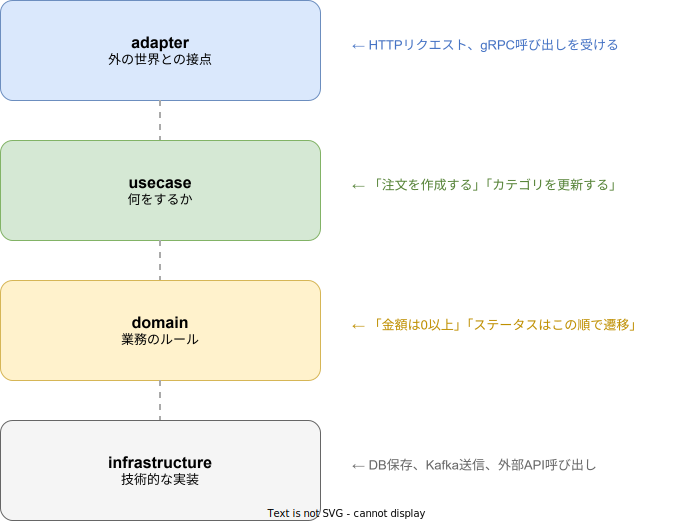

# ドメイン設計

## この章を読む前に

### 「ドメイン設計」とは何か？

ドメイン設計を料理に例えてみましょう。

- **レシピ** = **ドメインモデル**（業務の全体像を書き出したもの）
- **材料**（肉、野菜、調味料）= **エンティティ**（注文、商品、ユーザーなど、システムが扱うモノ）
- **調理手順**（焼く、煮る、盛り付ける）= **ユースケース**（注文を作成する、カテゴリを更新する、などの操作）

料理で「レシピなしに適当に作ると失敗する」のと同じように、ソフトウェアでも「業務の構造を整理せずにコードを書くと、バグだらけで変更しにくいシステムになる」のです。ドメイン設計は、その整理のための手法です。

### DDDを一言で言うと

DDD（Domain-Driven Design）とは、**「業務の言葉でコードを書く設計手法」** です。

たとえばタスク管理の業務なら「タスク」「ボード」「アクティビティ」といった業務用語がそのままコード上のクラス名や関数名になります。業務担当者とエンジニアが同じ言葉で会話できるので、認識のズレが起きにくくなります。

### なぜDDDが必要か

- **ビジネスロジックとコードが乖離するとバグが増える** -- 業務では「金額はマイナスにならない」というルールがあるのに、コード上でそれがチェックされていなければ不正なデータが入り込みます。
- **仕様変更に弱くなる** -- 業務ルールがコードのあちこちに散らばっていると、1つの変更で何箇所も修正が必要になり、修正漏れが発生します。
- DDDでは業務ルールを「ドメイン層」に集約するので、変更箇所が明確になり、安全に修正できます。

### 4層構成の図解

本プロジェクトのサーバーは以下の4層で構成されています。上の層から順に、外の世界に近い層→業務の核心に近い層となります。



- **adapter**: ユーザーや外部システムからの入力を受け取り、内部の形式に変換する層です。レストランでいえば「受付カウンター」です。
- **usecase**: 「何をするか」を記述する層です。業務の手順書にあたります。
- **domain**: 業務のルールそのものを表現する層です。「金額は0円以上でなければならない」などのルールがここに書かれます。
- **infrastructure**: データベースへの保存やメッセージの送信など、技術的な処理を担当する層です。

### キーワード早見表

| 用語 | ひとことで言うと |
| --- | --- |
| **エンティティ** | IDを持つモノ。「注文 #1234」のように、同じ属性でもIDが違えば別物として扱う |
| **値オブジェクト** | IDを持たないモノ。「1,000円」は別のどの「1,000円」とも同じ意味になる |
| **集約** | 「まとめて整合性を保つ単位」。注文ヘッダーと注文明細を一緒に扱うイメージ |
| **リポジトリ** | データの保存・取得を担当する窓口。ドメイン層からは「保存して」と頼むだけでOK |
| **ドメインイベント** | 「注文が作成された」「ステータスが変わった」など、起きた出来事を表すメッセージ |

---

## DDDに基づくドメインモデリング

business tier では DDD（Domain-Driven Design）に基づいてドメインモデルを設計する。各業務領域（`regions/business/{領域名}/`）が1つの境界づけられたコンテキストに対応する。

### モデリングの進め方

1. **ユビキタス言語の定義** -- 業務領域の専門家と開発者が共通して使う用語を定義する。用語は領域内で一意に解釈できること。
2. **集約の識別** -- トランザクション境界となる集約を特定する。集約はドメインの不変条件を保証する単位。
3. **エンティティと値オブジェクトの分類** -- 識別子を持つものをエンティティ、属性の組み合わせで等価性を判断するものを値オブジェクトとする。
4. **リポジトリの定義** -- 集約ルートごとにリポジトリインターフェースを定義する。
5. **ドメインイベントの設計** -- 状態変更を他のコンテキストに通知するためのイベントを定義する。

## 境界づけられたコンテキストの設計


### コンテキストの単位

`regions/business/` 配下の各領域ディレクトリが1つの境界づけられたコンテキストに対応する。

```
regions/business/
├── taskmanagement/    # タスク管理コンテキスト
├── fa/                # 固定資産コンテキスト
└── ...
```

### コンテキスト内の構造

各コンテキスト内のサーバーは、以下のモジュール構成を取る。

```
server/rust/{サーバー名}/src/
├── domain/              # ドメイン層
│   ├── entity/          #   エンティティ・値オブジェクト
│   ├── repository/      #   リポジトリインターフェース
│   └── service/         #   ドメインサービス
├── usecase/             # ユースケース層
├── adapter/             # アダプター層
│   ├── grpc/            #   gRPC サービス実装
│   └── handler/         #   REST ハンドラー
└── infrastructure/      # インフラストラクチャ層
    ├── persistence/     #   リポジトリ実装
    ├── messaging/       #   Kafka プロデューサー等
    └── config/          #   設定読み込み
```

### コンテキストマップ

コンテキスト間の関係を明示的に定義する。

| 関係パターン | 説明 | 例 |
| --- | --- | --- |
| Published Language | 共有するイベントスキーマ | タスク管理 → FA へのプロジェクト完了イベント |
| Anti-Corruption Layer | 外部コンテキストのモデルを自コンテキストのモデルに変換 | FA がタスク管理のプロジェクトデータを受け取る際の変換層 |
| Conformist | 上流のモデルをそのまま受け入れる | system tier のユーザーモデル |

## エンティティ、値オブジェクト、集約、リポジトリ


### エンティティ

一意な識別子を持ち、ライフサイクルを通じて同一性が保たれるオブジェクト。

```rust
// Rust の例（taskmanagement/server/rust/project-master より）
pub struct MasterStatusDefinition {
    pub id: MasterStatusDefinitionId,   // 識別子
    pub project_type_id: ProjectTypeId,
    pub code: String,
    pub name: String,
    pub display_order: i32,
    pub is_active: bool,
    pub created_at: DateTime<Utc>,
    pub updated_at: DateTime<Utc>,
}
```

```go
// Go の例
type MasterStatusDefinition struct {
    ID            MasterStatusDefinitionID
    ProjectTypeID ProjectTypeID
    Code          string
    Name          string
    DisplayOrder  int
    IsActive      bool
    CreatedAt     time.Time
    UpdatedAt     time.Time
}
```

### 値オブジェクト

識別子を持たず、属性の組み合わせで等価性を判断するオブジェクト。不変（immutable）であること。

```rust
// Rust の例
#[derive(Clone, PartialEq, Eq)]
pub struct MasterStatusDefinitionId(Uuid);

#[derive(Clone, PartialEq, Eq)]
pub struct TaskPriority {
    pub level: i32,
    pub label: String,
}
```

### 集約

トランザクション整合性の境界。集約ルートを通じてのみ内部の要素を操作する。

設計ルール:
- 集約はできるだけ小さく保つ
- 集約間の参照は ID で行う（オブジェクト参照は禁止）
- 1トランザクションで1集約のみを更新する
- 集約の境界を越えた整合性はドメインイベントで担保する

```rust
// MasterProjectType が集約ルート
// MasterStatusDefinition は MasterProjectType を project_type_id で参照する（ID参照）
pub struct MasterProjectType {
    pub id: ProjectTypeId,
    pub name: String,
    pub description: Option<String>,
    pub is_system: bool,
}
```

### リポジトリ

集約ルートごとにリポジトリインターフェースを domain 層に定義する。実装は infrastructure 層に置く。

```rust
// domain/repository/project_type_repository.rs（インターフェース）
#[async_trait]
pub trait ProjectTypeRepository: Send + Sync {
    async fn find_by_id(&self, id: &ProjectTypeId) -> Result<Option<MasterProjectType>>;
    async fn find_all(&self) -> Result<Vec<MasterProjectType>>;
    async fn save(&self, project_type: &MasterProjectType) -> Result<()>;
    async fn delete(&self, id: &ProjectTypeId) -> Result<()>;
}
```

```rust
// infrastructure/persistence/project_type_repo_impl.rs（実装）
pub struct ProjectTypeRepositoryImpl {
    pool: PgPool,
}

#[async_trait]
impl ProjectTypeRepository for ProjectTypeRepositoryImpl {
    async fn find_by_id(&self, id: &ProjectTypeId) -> Result<Option<MasterProjectType>> {
        sqlx::query_as("SELECT * FROM master_project_types WHERE id = $1")
            .bind(id.as_ref())
            .fetch_optional(&self.pool)
            .await
            .map_err(Into::into)
    }
    // ...
}
```

## ドメインイベントの定義と発行

ドメインイベントは、集約の状態変更を他のコンテキストに通知するために使用する。

### イベントの定義

```rust
// ドメインイベントの定義
pub struct MasterStatusDefinitionCreated {
    pub status_definition_id: MasterStatusDefinitionId,
    pub project_type_id: ProjectTypeId,
    pub code: String,
    pub name: String,
    pub occurred_at: DateTime<Utc>,
}

pub struct MasterStatusDefinitionUpdated {
    pub status_definition_id: MasterStatusDefinitionId,
    pub changes: Vec<FieldChange>,
    pub occurred_at: DateTime<Utc>,
}
```

### イベントの発行

ドメインイベントは usecase 層で発行し、infrastructure 層の Kafka プロデューサーを通じて配信する。

```rust
// usecase/manage_status_definitions.rs
pub struct ManageStatusDefinitionsUseCase {
    status_definition_repo: Arc<dyn StatusDefinitionRepository>,
    event_publisher: Arc<dyn EventPublisher>,
}

impl ManageStatusDefinitionsUseCase {
    pub async fn create_status_definition(&self, input: CreateStatusDefinitionInput) -> Result<MasterStatusDefinition> {
        let status_definition = MasterStatusDefinition::new(input)?;
        self.status_definition_repo.save(&status_definition).await?;

        // ドメインイベントを発行
        let event = MasterStatusDefinitionCreated::from(&status_definition);
        self.event_publisher.publish("taskmanagement.master-status-definition.created", &event).await?;

        Ok(status_definition)
    }
}
```

### イベントスキーマ

ドメインイベントは Schema Registry に登録し、スキーマの互換性を保証する。イベントのシリアライゼーションには Protobuf を使用する。

```protobuf
// proto/k1s0/business/taskmanagement/events/v1/master_status_definition.proto
message MasterStatusDefinitionCreated {
  string status_definition_id = 1;
  string project_type_id = 2;
  string code = 3;
  string name = 4;
  google.protobuf.Timestamp occurred_at = 5;
}
```

## 領域間の通信パターン

### 同一ドメインコンテキスト内: 同期通信

同一の `regions/business/{領域名}/` 配下にあるサーバー間では、gRPC による同期通信が許可されている。


- 同期通信はレイテンシが低く、トランザクション整合性を取りやすい
- ただし結合度が高くなるため、必要最小限に留める
- サーキットブレーカーとリトライを適用すること

### 異なるドメインコンテキスト間: Kafka 非同期

異なる領域間（例: `taskmanagement/` と `fa/`）では Kafka を使った非同期メッセージングを使用する。


- トピック命名規則: `{領域名}.{集約名}.{イベント名}`（例: `taskmanagement.master-status-definition.created`）
- Schema Registry でイベントスキーマを管理
- コンシューマーグループ: `{領域名}.{サーバー名}`
- 冪等性を保証するため、イベントID による重複排除を実装すること
- Dead Letter Queue（DLQ）を設定し、処理失敗イベントを保全すること

## 関連ドキュメント

- [メッセージング設計](../../architecture/messaging/メッセージング設計.md) -- Kafka 設計の詳細
- [API設計](../../architecture/api/API設計.md) -- API 設計の全体方針
- [gRPC設計](../../architecture/api/gRPC設計.md) -- gRPC 設計ガイドライン
- [proto設計](../../architecture/api/proto設計.md) -- Protocol Buffers 設計規約
- [eventstore ライブラリ](../../libraries/data/eventstore.md) -- イベントストアの実装
- [kafka ライブラリ](../../libraries/messaging/kafka.md) -- Kafka クライアントライブラリ
- [schemaregistry ライブラリ](../../libraries/data/schemaregistry.md) -- Schema Registry クライアント
- [共通実装パターン](../../libraries/_common/共通実装パターン.md) -- ライブラリ共通の実装パターン
- [outbox ライブラリ](../../libraries/messaging/outbox.md) -- Transactional Outbox パターン
