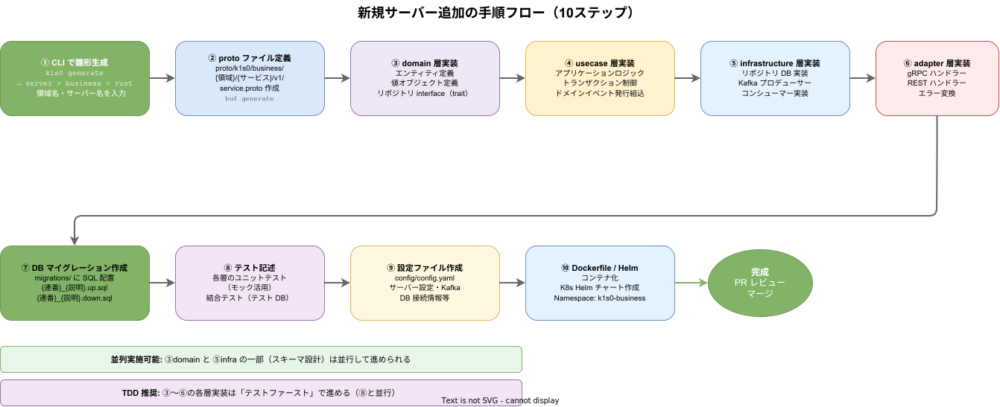

# サーバー開発

## Rust/Go サーバー実装パターン

business tier のサーバーはクリーンアーキテクチャの4層構成で実装する。依存の方向は外側から内側への一方向のみ。

<!-- 4層の同心円構造と各層の責務・依存方向を示す図。内側の層は外側を知らない -->


```
adapter → usecase → domain
    ↓
infrastructure
```

### 各層の責務

| 層 | 責務 | 配置 |
| --- | --- | --- |
| domain | エンティティ、値オブジェクト、リポジトリインターフェース、ドメインサービス | `src/domain/` |
| usecase | アプリケーションロジック、トランザクション制御、ドメインイベント発行 | `src/usecase/` |
| adapter | 外部インターフェース（gRPC, REST）、リクエスト/レスポンス変換 | `src/adapter/` |
| infrastructure | 技術的実装（DB接続、Kafka、外部API呼出） | `src/infrastructure/` |

### Rust サーバーの実装構成

実装例として `regions/business/taskmanagement/server/rust/project-master/` を参照。

```
src/
├── domain/
│   ├── entity/
│   │   ├── master_project_type.rs
│   │   ├── master_status_definition.rs
│   │   ├── master_status_definition_version.rs
│   │   └── tenant_master_extension.rs
│   ├── repository/
│   │   ├── project_type_repository.rs      # trait 定義
│   │   ├── status_definition_repository.rs
│   │   ├── version_repository.rs
│   │   └── tenant_extension_repository.rs
│   └── service/
│       └── validation_service.rs
├── usecase/
│   ├── manage_project_types.rs
│   ├── manage_status_definitions.rs
│   ├── get_status_definition_versions.rs
│   └── manage_tenant_extensions.rs
├── adapter/
│   ├── grpc/
│   │   └── project_master_grpc.rs       # gRPC サービス実装
│   └── handler/
│       ├── project_type_handler.rs      # REST ハンドラー
│       ├── status_definition_handler.rs
│       ├── tenant_handler.rs
│       └── error.rs                     # エラー変換
├── infrastructure/
│   ├── persistence/
│   │   ├── project_type_repo_impl.rs    # trait 実装
│   │   ├── status_definition_repo_impl.rs
│   │   ├── version_repo_impl.rs
│   │   └── tenant_extension_repo_impl.rs
│   ├── messaging/
│   │   └── kafka_producer.rs
│   └── config/
│       └── mod.rs
├── proto/                               # 生成された Protobuf コード
├── lib.rs
└── main.rs
```

### Go サーバーの実装構成

```
internal/
├── domain/
│   ├── entity/
│   ├── repository/                      # interface 定義
│   └── service/
├── usecase/
├── adapter/
│   ├── grpc/
│   └── handler/
└── infrastructure/
    ├── persistence/                     # interface 実装
    ├── messaging/
    └── config/
cmd/
└── server/
    └── main.go
```

### DI（依存性注入）

Rust では trait オブジェクト（`Arc<dyn Trait>`）、Go ではインターフェースによるコンストラクタインジェクションを使用する。

```rust
// Rust: main.rs での DI 組み立て
let pool = PgPool::connect(&config.database_url).await?;
let project_type_repo = Arc::new(ProjectTypeRepositoryImpl::new(pool.clone()));
let event_publisher = Arc::new(KafkaEventPublisher::new(&config.kafka));
let manage_project_types = ManageProjectTypesUseCase::new(project_type_repo, event_publisher);
let grpc_service = ProjectMasterGrpcService::new(manage_project_types);
```

```go
// Go: main.go での DI 組み立て
pool, err := pgxpool.New(ctx, config.DatabaseURL)
projectTypeRepo := persistence.NewProjectTypeRepository(pool)
eventPublisher := messaging.NewKafkaPublisher(config.Kafka)
manageProjectTypes := usecase.NewManageProjectTypes(projectTypeRepo, eventPublisher)
grpcService := grpc.NewProjectMasterService(manageProjectTypes)
```

## gRPC サービス定義（proto, buf）

### proto ファイルの配置

```
proto/
└── k1s0/
    └── business/
        └── {領域名}/
            └── {サービス名}/
                └── v1/
                    ├── service.proto        # サービス定義
                    ├── messages.proto        # リクエスト/レスポンス
                    └── resources.proto       # リソース型
```

### サービス定義の例

```protobuf
syntax = "proto3";
package k1s0.business.taskmanagement.projectmaster.v1;

service ProjectMasterService {
  // ドメイン操作 API（gRPC Unary）
  rpc CreateProjectType(CreateProjectTypeRequest) returns (CreateProjectTypeResponse);
  rpc GetProjectType(GetProjectTypeRequest) returns (GetProjectTypeResponse);
  rpc ListProjectTypes(ListProjectTypesRequest) returns (ListProjectTypesResponse);
  rpc UpdateProjectType(UpdateProjectTypeRequest) returns (UpdateProjectTypeResponse);
  rpc DeleteProjectType(DeleteProjectTypeRequest) returns (DeleteProjectTypeResponse);

  // ドメインイベント配信（gRPC Server Streaming）
  rpc SubscribeProjectTypeEvents(SubscribeProjectTypeEventsRequest)
    returns (stream ProjectTypeEvent);
}
```

### buf の設定

```yaml
# buf.yaml
version: v2
modules:
  - path: proto
lint:
  use:
    - DEFAULT
breaking:
  use:
    - WIRE_JSON
```

```yaml
# buf.gen.yaml
version: v2
plugins:
  - remote: buf.build/protocolbuffers/rust
    out: src/proto
  - remote: buf.build/grpc/rust
    out: src/proto
```

```bash
# コード生成
buf generate
```

## REST API 実装

ドメインCRUD APIは REST で提供する。gRPC と REST の使い分けは以下の通り。

| API 種別 | プロトコル | 用途 |
| --- | --- | --- |
| ドメインCRUD API | REST | クライアントからのデータ操作 |
| ドメインイベント配信 | gRPC Stream | サーバー間のリアルタイムイベント通知 |
| ドメイン操作 API | gRPC Unary | サーバー間の同期的なオペレーション呼出 |

### REST ハンドラーの実装（Rust: axum）

```rust
// adapter/handler/project_type_handler.rs
pub fn routes(usecase: Arc<ManageProjectTypesUseCase>) -> Router {
    Router::new()
        .route("/api/v1/project-types", get(list_project_types).post(create_project_type))
        .route("/api/v1/project-types/{id}", get(get_project_type).put(update_project_type).delete(delete_project_type))
        .with_state(usecase)
}

async fn create_project_type(
    State(usecase): State<Arc<ManageProjectTypesUseCase>>,
    claims: JwtClaims,  // system tier の認証ミドルウェアで検証済み
    Json(input): Json<CreateProjectTypeRequest>,
) -> Result<Json<ProjectTypeResponse>, AppError> {
    let project_type = usecase.create(input.into()).await?;
    Ok(Json(project_type.into()))
}
```

### REST ハンドラーの実装（Go: chi/echo）

```go
// adapter/handler/project_type_handler.go
func NewProjectTypeHandler(uc *usecase.ManageProjectTypes) http.Handler {
    r := chi.NewRouter()
    h := &projectTypeHandler{uc: uc}
    r.Get("/api/v1/project-types", h.List)
    r.Post("/api/v1/project-types", h.Create)
    r.Get("/api/v1/project-types/{id}", h.Get)
    r.Put("/api/v1/project-types/{id}", h.Update)
    r.Delete("/api/v1/project-types/{id}", h.Delete)
    return r
}
```

## DB スキーマ設計とマイグレーション

### データベース設計方針

- RDBMS: PostgreSQL 17
- 各 business サーバーは独自のデータベースを持つ
- スキーマはマイグレーションファイルで管理する
- DB アクセスには sqlx（Rust / Go 共通名だが別ライブラリ）を使用する

### マイグレーションファイルの配置

```
regions/business/{領域名}/database/{db名}/migrations/
├── 001_create_schema.up.sql
├── 001_create_schema.down.sql
├── 002_create_project_master_tables.up.sql
└── 002_create_project_master_tables.down.sql
```

### マイグレーションの命名規則

- ファイル名: `{連番}_{説明}.{up|down}.sql`
- 連番は3桁ゼロ埋め（001, 002, ...）
- `up.sql` はスキーマ変更を適用、`down.sql` はロールバック

### マイグレーション実行

```bash
# Rust: sqlx-cli
sqlx migrate run --database-url "$DATABASE_URL"
sqlx migrate revert --database-url "$DATABASE_URL"  # ロールバック

# Go: golang-migrate
migrate -path ./migrations -database "$DATABASE_URL" up
migrate -path ./migrations -database "$DATABASE_URL" down 1  # 1つ戻す
```

### スキーマ設計のルール

```sql
-- 001_create_schema.up.sql
CREATE SCHEMA IF NOT EXISTS taskmanagement;

-- 002_create_project_master_tables.up.sql
CREATE TABLE taskmanagement.master_project_types (
    id          UUID PRIMARY KEY DEFAULT gen_random_uuid(),
    name        VARCHAR(255) NOT NULL,
    description TEXT,
    is_system   BOOLEAN NOT NULL DEFAULT FALSE,
    created_at  TIMESTAMPTZ NOT NULL DEFAULT NOW(),
    updated_at  TIMESTAMPTZ NOT NULL DEFAULT NOW()
);

CREATE TABLE taskmanagement.master_status_definitions (
    id              UUID PRIMARY KEY DEFAULT gen_random_uuid(),
    project_type_id UUID NOT NULL REFERENCES taskmanagement.master_project_types(id),
    code            VARCHAR(100) NOT NULL,
    name            VARCHAR(255) NOT NULL,
    display_order   INT NOT NULL DEFAULT 0,
    is_active       BOOLEAN NOT NULL DEFAULT TRUE,
    created_at      TIMESTAMPTZ NOT NULL DEFAULT NOW(),
    updated_at      TIMESTAMPTZ NOT NULL DEFAULT NOW(),
    UNIQUE (project_type_id, code)
);

CREATE INDEX idx_master_status_definitions_project_type ON taskmanagement.master_status_definitions(project_type_id);
```

設計ルール:
- 主キーには UUID を使用する
- `created_at`, `updated_at` は全テーブル必須
- タイムスタンプは `TIMESTAMPTZ`（タイムゾーン付き）を使用する
- 外部キー制約を設定する
- 適切なインデックスを作成する
- 領域ごとにスキーマを分離する（`CREATE SCHEMA`）

## system tier ライブラリの利用

business tier のサーバーは system tier の共通ライブラリを積極的に利用する。

### 主要ライブラリ一覧

| ライブラリ | 用途 | 利用場面 |
| --- | --- | --- |
| `authlib` | JWT 検証、RBAC | 全リクエストの認証・認可 |
| `config` | 設定管理 | サーバー起動時の設定読み込み |
| `telemetry` | トレース・メトリクス | 可観測性の計装 |
| `messaging` / `kafka` | Kafka クライアント | ドメインイベントの発行・購読 |
| `migration` | マイグレーション管理 | DB スキーマ管理 |
| `pagination` | ページネーション | リスト API のページング |
| `validation` | バリデーション | 入力値検証 |
| `correlation` | 相関ID管理 | リクエスト追跡 |

### Rust での依存追加（Cargo.toml）

```toml
[dependencies]
k1s0-authlib = { path = "../../../../../system/library/rust/authlib" }
k1s0-config = { path = "../../../../../system/library/rust/config" }
k1s0-telemetry = { path = "../../../../../system/library/rust/telemetry" }
k1s0-kafka = { path = "../../../../../system/library/rust/kafka" }
```

### Go での依存追加（go.mod）

```
require (
    github.com/k1s0/system/library/go/authlib v0.0.0
    github.com/k1s0/system/library/go/config v0.0.0
    github.com/k1s0/system/library/go/telemetry v0.0.0
    github.com/k1s0/system/library/go/kafka v0.0.0
)

replace (
    github.com/k1s0/system/library/go/authlib => ../../../../../system/library/go/authlib
    // ...
)
```

## 新規サーバー追加の手順

<!-- 10ステップの開発フローを可視化した図。並列実施可能なステップも明示 -->


1. **k1s0 CLI でひな形を生成する**
   ```bash
   k1s0 generate
   # または: k1s0 → よく使う操作 > ひな形生成
   # 対話プロンプトで: server → business → rust → 領域名・サーバー名を入力
   ```

2. **proto ファイルを定義する**
   - `proto/k1s0/business/{領域名}/{サービス名}/v1/` にサービス定義を作成
   - `buf generate` でコードを生成

3. **domain 層を実装する**
   - エンティティ、値オブジェクト、リポジトリインターフェースを定義

4. **usecase 層を実装する**
   - アプリケーションロジックを実装
   - ドメインイベントの発行を組み込む

5. **infrastructure 層を実装する**
   - リポジトリの DB 実装
   - Kafka プロデューサー/コンシューマーの実装

6. **adapter 層を実装する**
   - gRPC サービスハンドラーを実装
   - REST ハンドラーを実装

7. **DB マイグレーションを作成する**
   - `regions/business/{領域名}/database/{db名}/migrations/` にSQLファイルを配置

8. **テストを記述する**
   - 各層のユニットテスト（モックを活用）
   - 結合テスト（テスト用 DB を使用）

9. **設定ファイルを作成する**
   - `config/config.yaml` にサーバー設定を記述

10. **Dockerfile と Helm チャートを作成する**
    - K8s Namespace: `k1s0-business`

## 関連ドキュメント

- [サーバー共通実装](../../servers/_common/implementation.md) -- サーバー共通の実装パターン
- [Rust共通実装](../../servers/_common/Rust共通実装.md) -- Rust サーバー固有のパターン
- [サーバー共通DB設計](../../servers/_common/database.md) -- DB 設計の共通ルール
- [サーバー共通デプロイ](../../servers/_common/deploy.md) -- デプロイ設定の共通パターン
- [project-master サーバー設計](../../servers/project-master/server.md) -- 実装リファレンス
- [project-master 実装](../../servers/project-master/implementation.md) -- 実装の詳細
- [project-master DB設計](../../servers/project-master/database.md) -- DB スキーマの詳細
- [REST-API設計](../../architecture/api/REST-API設計.md) -- REST API の設計規約
- [gRPC設計](../../architecture/api/gRPC設計.md) -- gRPC 設計ガイドライン
- [proto設計](../../architecture/api/proto設計.md) -- Protocol Buffers 設計規約
- [migration ライブラリ](../../libraries/data/migration.md) -- マイグレーション管理
- [サーバーテンプレート](../../templates/server/サーバー.md) -- CLI サーバー生成テンプレート
- [サーバー-Rust テンプレート](../../templates/server/サーバー-Rust.md) -- Rust サーバー生成テンプレート
- [Helm設計](../../infrastructure/kubernetes/helm設計.md) -- Helm チャートの設計
- [Dockerfile テンプレート](../../templates/infrastructure/docker-build.md) -- Dockerfile 生成テンプレート
