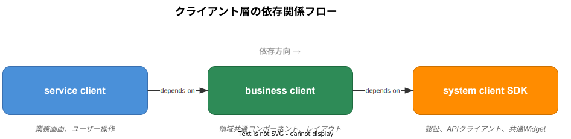
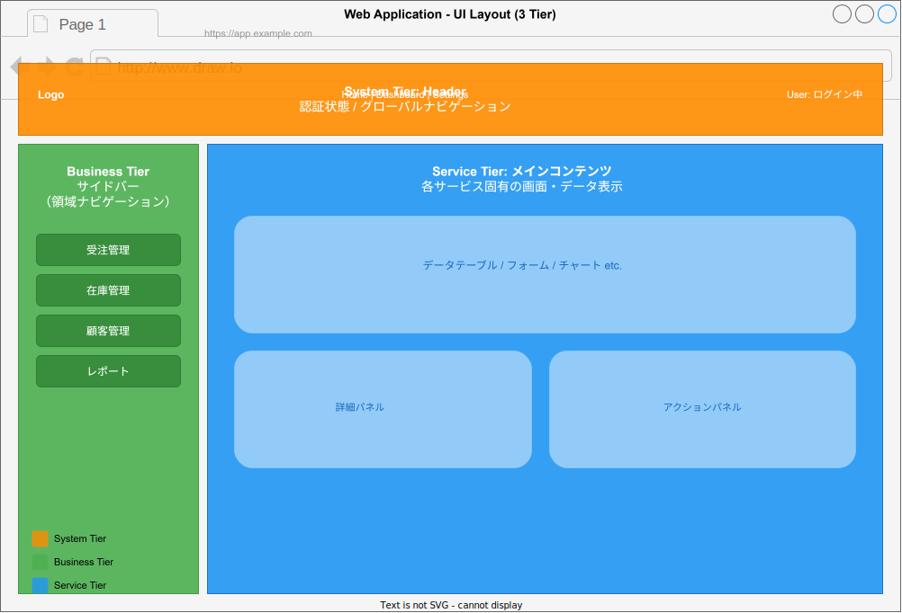

# クライアント開発

## 概要

business tier のクライアントは、業務領域内で共通利用する UI コンポーネント・レイアウト・テーマを提供する。system tier の client SDK（認証・API クライアント・共通Widget）を基盤として利用し、service tier のクライアントに領域固有のコンポーネントを提供する。



配置場所:

```
regions/business/{領域名}/client/
├── react/       # React 共通コンポーネント
└── flutter/     # Flutter 共通コンポーネント
```

## React 共通コンポーネント開発

### system-client SDK の利用

system tier の React SDK（`system-client`）は以下を提供する。business tier ではこれらを import して使用する。

| 機能 | 提供内容 |
| --- | --- |
| 認証 | `useAuth`, `AuthProvider`, `LoginGuard` |
| API クライアント | `useApiClient`（Cookie/CSRF対応済み） |
| 共通 Widget | `Button`, `Input`, `Modal`, `Table` 等の基本コンポーネント |
| ルーティングガード | 未認証ユーザーのリダイレクト |

### プロジェクト構成

```
regions/business/{領域名}/client/react/
├── src/
│   ├── components/         # 領域共通コンポーネント
│   │   ├── forms/          #   領域固有のフォーム部品
│   │   ├── tables/         #   領域固有のテーブル
│   │   └── charts/         #   領域固有のグラフ
│   ├── layouts/            # 領域共通レイアウト
│   │   ├── DomainLayout.tsx
│   │   └── SidebarNav.tsx
│   ├── hooks/              # 領域共通カスタムフック
│   │   ├── useProjectMaster.ts
│   │   └── useDomainEvents.ts
│   ├── api/                # API クライアント定義
│   │   └── project-master.ts
│   ├── theme/              # 領域固有テーマ
│   │   └── index.ts
│   ├── types/              # 型定義
│   │   └── domain.ts
│   └── index.ts            # パッケージエントリポイント
├── package.json
├── tsconfig.json
└── vitest.config.ts
```

### コンポーネント実装例

```tsx
// components/forms/MasterStatusDefinitionForm.tsx
import { Button, Input, Select } from '@k1s0/system-client';
import { useProjectMaster } from '../../hooks/useProjectMaster';

interface MasterStatusDefinitionFormProps {
  projectTypeId: string;
  onSubmit: (item: MasterStatusDefinitionInput) => void;
}

export function MasterStatusDefinitionForm({ projectTypeId, onSubmit }: MasterStatusDefinitionFormProps) {
  const { projectTypes } = useProjectMaster();
  // system-client の共通コンポーネントを利用しつつ、
  // 領域固有のフォームロジックを実装
  return (
    <form onSubmit={handleSubmit}>
      <Select
        label="プロジェクトタイプ"
        options={projectTypes}
        value={projectTypeId}
      />
      <Input label="コード" name="code" required />
      <Input label="名前" name="name" required />
      <Button type="submit">保存</Button>
    </form>
  );
}
```

### テスト

React コンポーネントのテストには Vitest + Testing Library を使用する。

```tsx
// components/forms/MasterStatusDefinitionForm.test.tsx
import { render, screen, fireEvent } from '@testing-library/react';
import { describe, it, expect, vi } from 'vitest';
import { MasterStatusDefinitionForm } from './MasterStatusDefinitionForm';

describe('MasterStatusDefinitionForm', () => {
  it('フォーム送信時にonSubmitが呼ばれる', async () => {
    const onSubmit = vi.fn();
    render(<MasterStatusDefinitionForm projectTypeId="pt-1" onSubmit={onSubmit} />);

    fireEvent.change(screen.getByLabelText('コード'), { target: { value: 'ITEM001' } });
    fireEvent.change(screen.getByLabelText('名前'), { target: { value: 'テスト項目' } });
    fireEvent.click(screen.getByText('保存'));

    expect(onSubmit).toHaveBeenCalledWith(
      expect.objectContaining({ code: 'STATUS001', name: 'テストステータス' })
    );
  });
});
```

## Flutter 共通コンポーネント開発

### system_client SDK の利用

system tier の Flutter SDK（`system_client`）は以下を提供する。

| 機能 | 提供内容 |
| --- | --- |
| 認証 | `AuthNotifier`, `AuthGuard`, `LoginPage` |
| API クライアント | `ApiClient`（トークン管理済み） |
| 共通 Widget | `K1s0Button`, `K1s0TextField`, `K1s0DataTable` 等 |
| テーマ | `K1s0ThemeData` |

### プロジェクト構成

```
regions/business/{領域名}/client/flutter/
├── lib/
│   ├── components/         # 領域共通 Widget
│   │   ├── forms/
│   │   ├── tables/
│   │   └── charts/
│   ├── layouts/            # 領域共通レイアウト
│   │   ├── domain_layout.dart
│   │   └── sidebar_nav.dart
│   ├── providers/          # 領域共通 Provider
│   │   ├── project_master_provider.dart
│   │   └── domain_event_provider.dart
│   ├── api/                # API クライアント定義
│   │   └── project_master_api.dart
│   ├── theme/              # 領域固有テーマ
│   │   └── domain_theme.dart
│   ├── models/             # データモデル
│   │   └── domain_models.dart
│   └── {パッケージ名}.dart  # パッケージエントリポイント
├── test/
├── pubspec.yaml
└── analysis_options.yaml
```

### Widget 実装例

```dart
// components/forms/master_status_definition_form.dart
import 'package:flutter/material.dart';
import 'package:flutter_riverpod/flutter_riverpod.dart';
import 'package:system_client/system_client.dart';
import '../../providers/project_master_provider.dart';

class MasterStatusDefinitionForm extends ConsumerWidget {
  final String projectTypeId;
  final void Function(MasterStatusDefinitionInput) onSubmit;

  const MasterStatusDefinitionForm({
    required this.projectTypeId,
    required this.onSubmit,
    super.key,
  });

  @override
  Widget build(BuildContext context, WidgetRef ref) {
    final projectTypes = ref.watch(projectTypesProvider);
    return Form(
      child: Column(
        children: [
          K1s0DropdownField(
            label: 'プロジェクトタイプ',
            items: projectTypes,
            value: projectTypeId,
          ),
          const K1s0TextField(label: 'コード'),
          const K1s0TextField(label: '名前'),
          K1s0Button(
            label: '保存',
            onPressed: () => onSubmit(/* ... */),
          ),
        ],
      ),
    );
  }
}
```

### テスト

Flutter のテストには `flutter_test` + `mocktail` を使用する。

```dart
// test/components/forms/master_item_form_test.dart
import 'package:flutter_test/flutter_test.dart';
import 'package:mocktail/mocktail.dart';
import 'package:flutter_riverpod/flutter_riverpod.dart';

void main() {
  testWidgets('フォーム送信時にonSubmitが呼ばれる', (tester) async {
    var submitted = false;
    await tester.pumpWidget(
      ProviderScope(
        overrides: [/* テスト用オーバーライド */],
        child: MaterialApp(
          home: MasterStatusDefinitionForm(
            projectTypeId: 'pt-1',
            onSubmit: (_) => submitted = true,
          ),
        ),
      ),
    );

    await tester.enterText(find.byLabel('コード'), 'STATUS001');
    await tester.enterText(find.byLabel('名前'), 'テストステータス');
    await tester.tap(find.text('保存'));
    expect(submitted, isTrue);
  });
}
```

## 共通レイアウト・テーマの設計

### レイアウト設計方針

business tier のレイアウトは、system tier の基本レイアウト構造を拡張して領域固有のナビゲーションやサイドバーを追加する。



### テーマの拡張

各領域は system tier の基本テーマを拡張して、領域固有のカラーパレットやタイポグラフィを定義できる。

```tsx
// React: theme/index.ts
import { createTheme, baseTheme } from '@k1s0/system-client';

export const taskmanagementTheme = createTheme({
  ...baseTheme,
  colors: {
    ...baseTheme.colors,
    primary: '#1565C0',       // 領域固有のプライマリカラー
    secondary: '#0277BD',
  },
  // 領域固有の追加トークン
  domain: {
    taskActiveColor: '#2E7D32',
    taskArchivedColor: '#757575',
  },
});
```

```dart
// Flutter: theme/domain_theme.dart
import 'package:system_client/system_client.dart';

final taskmanagementTheme = K1s0ThemeData.light().copyWith(
  colorScheme: ColorScheme.light(
    primary: Color(0xFF1565C0),
    secondary: Color(0xFF0277BD),
  ),
);
```

## 状態管理パターン

### React: TanStack Query + Zustand

| ライブラリ | 用途 |
| --- | --- |
| TanStack Query | サーバー状態（API データのキャッシュ、自動再取得） |
| Zustand | クライアント状態（UI状態、フォーム状態） |

```tsx
// hooks/useProjectMaster.ts
import { useQuery, useMutation, useQueryClient } from '@tanstack/react-query';
import { useApiClient } from '@k1s0/system-client';

export function useProjectTypes() {
  const api = useApiClient();
  return useQuery({
    queryKey: ['project-types'],
    queryFn: () => api.get('/api/v1/project-types'),
  });
}

export function useCreateProjectType() {
  const api = useApiClient();
  const queryClient = useQueryClient();
  return useMutation({
    mutationFn: (input: CreateProjectTypeInput) =>
      api.post('/api/v1/project-types', input),
    onSuccess: () => {
      queryClient.invalidateQueries({ queryKey: ['project-types'] });
    },
  });
}
```

### Flutter: Riverpod

```dart
// providers/project_master_provider.dart
import 'package:flutter_riverpod/flutter_riverpod.dart';
import 'package:system_client/system_client.dart';

final projectTypesProvider = FutureProvider<List<ProjectType>>((ref) async {
  final api = ref.watch(apiClientProvider);
  return api.get('/api/v1/project-types');
});

final createProjectTypeProvider = Provider((ref) {
  final api = ref.watch(apiClientProvider);
  return CreateProjectTypeNotifier(api);
});
```

## service tier への提供インターフェース

business tier のクライアントコンポーネントを service tier に公開する際のルール。

### エクスポート方針

```tsx
// React: src/index.ts
// コンポーネント
export { MasterStatusDefinitionForm } from './components/forms/MasterStatusDefinitionForm';
export { MasterStatusDefinitionTable } from './components/tables/MasterStatusDefinitionTable';
export { DomainLayout } from './layouts/DomainLayout';
export { SidebarNav } from './layouts/SidebarNav';

// フック
export { useProjectTypes, useCreateProjectType } from './hooks/useProjectMaster';
export { useDomainEvents } from './hooks/useDomainEvents';

// テーマ
export { taskmanagementTheme } from './theme';

// 型
export type { ProjectType, MasterStatusDefinition, MasterStatusDefinitionInput } from './types/domain';
```

```dart
// Flutter: lib/{パッケージ名}.dart
library taskmanagement_client;

export 'components/forms/master_status_definition_form.dart';
export 'components/tables/master_status_definition_table.dart';
export 'layouts/domain_layout.dart';
export 'layouts/sidebar_nav.dart';
export 'providers/project_master_provider.dart';
export 'theme/domain_theme.dart';
export 'models/domain_models.dart';
```

### service tier での利用例

```tsx
// service tier の React クライアント
import {
  DomainLayout,
  MasterStatusDefinitionForm,
  useProjectTypes,
  taskmanagementTheme,
} from '@k1s0/business-taskmanagement-client';
import { ThemeProvider } from '@k1s0/system-client';

function TaskBoardPage() {
  const { data: projectTypes } = useProjectTypes();
  return (
    <ThemeProvider theme={taskmanagementTheme}>
      <DomainLayout>
        <MasterStatusDefinitionForm
          projectTypeId={selectedProjectType}
          onSubmit={handleSubmit}
        />
      </DomainLayout>
    </ThemeProvider>
  );
}
```

## 関連ドキュメント

- [クライアント共通設計](../../servers/_common/client.md) -- クライアント共通の設計方針
- [React テンプレート](../../templates/client/React.md) -- React コード生成テンプレート
- [Flutter テンプレート](../../templates/client/Flutter.md) -- Flutter コード生成テンプレート
- [クライアントテンプレート](../../templates/client/クライアント.md) -- クライアント生成テンプレート共通
- [BFF テンプレート](../../templates/client/BFF.md) -- BFF 生成テンプレート
- [session-client ライブラリ](../../libraries/client-sdk/session-client.md) -- セッション管理 SDK
- [tenant-client ライブラリ](../../libraries/client-sdk/tenant-client.md) -- テナント管理 SDK
- [graphql-client ライブラリ](../../libraries/client-sdk/graphql-client.md) -- GraphQL クライアント SDK
- [アプリ配布基盤設計](../../infrastructure/distribution/アプリ配布基盤設計.md) -- デスクトップアプリの配布・自動更新
