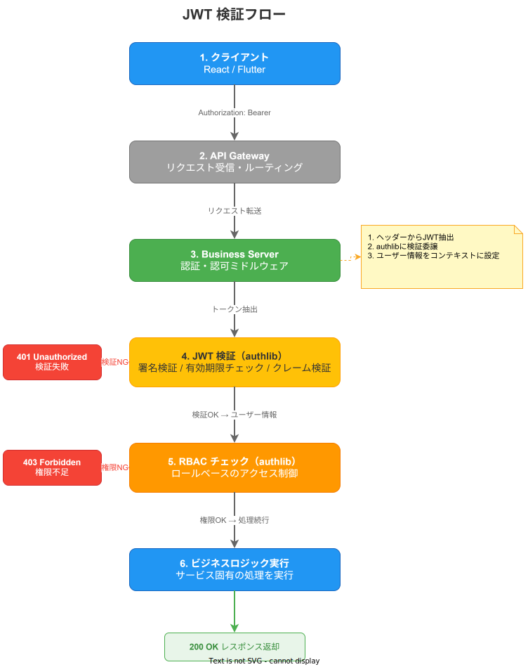

# system tier との連携

## 概要

business tier は system tier に依存し、認証・設定・可観測性・メッセージングなどの横断的な機能を利用する。この章では、system tier の各機能との具体的な連携方法を説明する。

## system tier サーバーへの gRPC 呼び出し

business tier のサーバーから system tier のサーバーへ gRPC で通信するパターン。

### 主な呼び出し先

| system サーバー | 用途 | gRPC サービス例 |
| --- | --- | --- |
| auth | ユーザー情報取得、トークン検証 | `AuthService.GetUser` |
| config | 設定値の動的取得 | `ConfigService.GetConfig` |
| session | セッション情報取得 | `SessionService.GetSession` |
| tenant | テナント情報取得 | `TenantService.GetTenant` |
| featureflag | フィーチャーフラグ判定 | `FeatureFlagService.Evaluate` |

### gRPC クライアントの実装（Rust）

```rust
use k1s0_authlib::AuthClient;
use k1s0_config::ConfigClient;

pub struct SystemClients {
    pub auth: AuthClient,
    pub config: ConfigClient,
}

impl SystemClients {
    pub async fn new(config: &AppConfig) -> Result<Self> {
        let auth = AuthClient::connect(&config.system.auth_endpoint).await?;
        let config_client = ConfigClient::connect(&config.system.config_endpoint).await?;
        Ok(Self { auth, config: config_client })
    }
}

// usecase での利用
impl ManageStatusDefinitionsUseCase {
    pub async fn create_status_definition(&self, input: CreateStatusDefinitionInput, token: &str) -> Result<MasterStatusDefinition> {
        // system tier の auth サーバーでユーザー情報を取得
        let user = self.system_clients.auth.get_user(token).await?;

        // テナント固有の設定を取得
        let tenant_config = self.system_clients.config
            .get_config(&user.tenant_id, "taskmanagement.master")
            .await?;

        // ビジネスロジック実行
        let status_definition = MasterStatusDefinition::new(input, &user, &tenant_config)?;
        self.status_definition_repo.save(&status_definition).await?;
        Ok(status_definition)
    }
}
```

### gRPC クライアントの実装（Go）

```go
import (
    authpb "github.com/k1s0/system/server/auth/proto"
    configpb "github.com/k1s0/system/server/config/proto"
)

type SystemClients struct {
    Auth   authpb.AuthServiceClient
    Config configpb.ConfigServiceClient
}

func NewSystemClients(cfg *config.SystemConfig) (*SystemClients, error) {
    authConn, err := grpc.Dial(cfg.AuthEndpoint, grpc.WithTransportCredentials(insecure.NewCredentials()))
    if err != nil {
        return nil, err
    }
    configConn, err := grpc.Dial(cfg.ConfigEndpoint, grpc.WithTransportCredentials(insecure.NewCredentials()))
    if err != nil {
        return nil, err
    }
    return &SystemClients{
        Auth:   authpb.NewAuthServiceClient(authConn),
        Config: configpb.NewConfigServiceClient(configConn),
    }, nil
}
```

### 接続設定

system tier サーバーへのエンドポイントは `config.yaml` で管理する。

```yaml
# config/config.yaml
system:
  auth_endpoint: "k1s0-system-auth:50051"
  config_endpoint: "k1s0-system-config:50051"
  session_endpoint: "k1s0-system-session:50051"
  tenant_endpoint: "k1s0-system-tenant:50051"
```

ローカル開発では Docker Compose のサービス名、K8s 上では Service DNS 名を使用する。

## system tier ライブラリの import と利用パターン

### ライブラリの分類と用途

| カテゴリ | ライブラリ | 用途 |
| --- | --- | --- |
| 認証・セキュリティ | `authlib` | JWT検証、RBAC、サービス間認証 |
| | `encryption` | データ暗号化 |
| | `serviceauth` | サービス間認証トークン管理 |
| 設定 | `config` | 設定管理 |
| | `featureflag` | フィーチャーフラグ |
| データ | `pagination` | ページネーション |
| | `cache` | キャッシュ管理 |
| | `eventstore` | イベントストア |
| | `schemaregistry` | スキーマ管理 |
| | `migration` | DBマイグレーション |
| メッセージング | `kafka` | Kafka クライアント |
| | `outbox` | Transactional Outbox |
| | `event-bus` | イベントバス |
| | `dlq-client` | DLQ 管理 |
| 可観測性 | `telemetry` | トレース・メトリクス |
| | `correlation` | 相関ID管理 |
| | `health` | ヘルスチェック |
| | `audit-client` | 監査ログ |
| 耐障害性 | `circuit-breaker` | サーキットブレーカー |
| | `retry` | リトライ |
| | `idempotency` | 冪等性 |
| テスト | `test-helper` | テストユーティリティ |
| | `validation` | バリデーション |

### 利用パターン: サーバー初期化

典型的な business サーバーの初期化で使用するライブラリ群。

```rust
use k1s0_config::Config;
use k1s0_authlib::{JwtValidator, RbacEnforcer};
use k1s0_telemetry::{init_tracing, init_metrics};
use k1s0_kafka::KafkaProducer;
use k1s0_health::HealthServer;
use k1s0_correlation::CorrelationLayer;

#[tokio::main]
async fn main() -> Result<()> {
    // 1. 設定読み込み
    let config = Config::load("config/config.yaml")?;

    // 2. 可観測性の初期化
    init_tracing(&config.telemetry)?;
    init_metrics(&config.telemetry)?;

    // 3. DB 接続
    let pool = PgPool::connect(&config.database_url).await?;

    // 4. 認証ミドルウェアの初期化
    let jwt_validator = JwtValidator::new(&config.auth)?;
    let rbac = RbacEnforcer::new(&config.auth.rbac)?;

    // 5. Kafka プロデューサー
    let kafka = KafkaProducer::new(&config.kafka)?;

    // 6. アプリケーション組み立て
    let app = Router::new()
        .merge(project_type_routes(/* ... */))
        .merge(status_definition_routes(/* ... */))
        .layer(CorrelationLayer::new())      // 相関ID伝播
        .layer(AuthLayer::new(jwt_validator)) // JWT検証
        .layer(TraceLayer::new());            // トレース計装

    // 7. ヘルスチェックサーバー
    let health = HealthServer::new(pool.clone());

    // 8. サーバー起動
    tokio::try_join!(
        serve_http(app, config.server.port),
        serve_grpc(grpc_service, config.server.grpc_port),
        health.serve(config.server.health_port),
    )?;

    Ok(())
}
```

## 認証・認可の統合（JWT 検証、RBAC）

### JWT 検証フロー



1. クライアントが Keycloak から JWT を取得
2. API Gateway がリクエストをルーティング
3. business server の認証ミドルウェア（`authlib`）が JWT を検証
4. RBAC ミドルウェアがロール・パーミッションをチェック

### JWT 検証の設定

```yaml
# config/config.yaml
auth:
  jwt:
    issuer: "https://keycloak.k1s0.internal/realms/k1s0"
    audience: "k1s0-business"
    jwks_url: "https://keycloak.k1s0.internal/realms/k1s0/protocol/openid-connect/certs"
  rbac:
    policy_endpoint: "k1s0-system-policy:50051"
```

### RBAC の適用

```rust
// adapter/handler/project_type_handler.rs
async fn create_project_type(
    State(usecase): State<Arc<ManageProjectTypesUseCase>>,
    claims: JwtClaims,                                          // 認証済みクレーム
    rbac: RbacGuard<"taskmanagement:project-type:create">,      // パーミッションチェック
    Json(input): Json<CreateProjectTypeRequest>,
) -> Result<Json<ProjectTypeResponse>, AppError> {
    let project_type = usecase.create(input.into(), &claims).await?;
    Ok(Json(project_type.into()))
}
```

```go
// Go の場合
func (h *projectTypeHandler) Create(w http.ResponseWriter, r *http.Request) {
    claims := authlib.ClaimsFromContext(r.Context())
    if err := h.rbac.Enforce(claims, "taskmanagement:project-type:create"); err != nil {
        http.Error(w, "Forbidden", http.StatusForbidden)
        return
    }
    // ...
}
```

### サービス間認証

business サーバー間、および business → system サーバー間の通信では、サービス間認証トークンを使用する。

```rust
use k1s0_serviceauth::ServiceTokenProvider;

let token_provider = ServiceTokenProvider::new(&config.service_auth)?;
let token = token_provider.get_token("k1s0-system-auth").await?;
// gRPC メタデータにトークンを設定
let mut request = tonic::Request::new(GetUserRequest { user_id });
request.metadata_mut().insert("authorization", format!("Bearer {}", token).parse()?);
```

## 可観測性の統合（トレース伝播、メトリクス、ログ）

### トレース伝播

OpenTelemetry を使用し、リクエストのトレースを system tier → business tier → 外部サービス間で伝播する。

```rust
use k1s0_telemetry::{init_tracing, TracingConfig};
use k1s0_correlation::CorrelationLayer;

// トレースの初期化
init_tracing(&TracingConfig {
    service_name: "taskmanagement-project-master",
    otlp_endpoint: "http://otel-collector:4317",
    sample_rate: 1.0,
})?;

// ミドルウェアとして適用
let app = Router::new()
    .merge(routes)
    .layer(CorrelationLayer::new())  // X-Correlation-ID を伝播
    .layer(TraceLayer::new());       // OpenTelemetry スパンを自動生成
```

### カスタムスパンの追加

```rust
use k1s0_telemetry::instrument;

#[instrument(name = "manage_status_definitions.create", skip(self))]
pub async fn create_status_definition(&self, input: CreateStatusDefinitionInput) -> Result<MasterStatusDefinition> {
    // このメソッドの実行がスパンとして記録される
    let status_definition = MasterStatusDefinition::new(input)?;
    self.status_definition_repo.save(&status_definition).await?;
    Ok(status_definition)
}
```

### メトリクス

```rust
use k1s0_telemetry::metrics::{counter, histogram};

// カウンター
counter!("project_master.status_definitions.created", 1, "project_type" => project_type_name);

// ヒストグラム（レイテンシ）
let timer = histogram!("project_master.status_definitions.create_duration_ms");
let _guard = timer.start();
// ... 処理 ...
```

### 構造化ログ

```rust
use tracing::{info, warn, error};
use k1s0_correlation::current_correlation_id;

info!(
    correlation_id = %current_correlation_id(),
    status_definition_id = %status_definition.id,
    project_type = %status_definition.project_type_id,
    "マスタステータス定義を作成しました"
);
```

```go
import "github.com/k1s0/system/library/go/telemetry/log"

log.Info(ctx, "マスタステータス定義を作成しました",
    "status_definition_id", statusDefinition.ID,
    "project_type", statusDefinition.ProjectTypeID,
)
```

## メッセージング連携（Kafka, Schema Registry）

### Kafka プロデューサー

ドメインイベントを Kafka に発行する。

```rust
use k1s0_kafka::{KafkaProducer, ProducerConfig};
use k1s0_schemaregistry::SchemaRegistry;

let schema_registry = SchemaRegistry::new(&config.schema_registry_url)?;
let producer = KafkaProducer::new(&ProducerConfig {
    brokers: config.kafka.brokers.clone(),
    schema_registry: schema_registry.clone(),
})?;

// イベント発行
producer.produce(
    "taskmanagement.master-status-definition.created",          // トピック
    &status_definition.id.to_string(),                          // キー（パーティショニング用）
    &MasterStatusDefinitionCreatedEvent::from(&status_definition),  // Protobuf シリアライズ
).await?;
```

### Kafka コンシューマー

他の領域からのイベントを購読する。

```rust
use k1s0_kafka::{KafkaConsumer, ConsumerConfig};

let consumer = KafkaConsumer::new(&ConsumerConfig {
    brokers: config.kafka.brokers.clone(),
    group_id: "taskmanagement.project-master".to_string(),
    topics: vec!["fa.asset.acquired".to_string()],
    schema_registry: schema_registry.clone(),
})?;

consumer.subscribe(|event: AssetAcquiredEvent| async move {
    // イベント処理（冪等性を保証すること）
    handle_asset_acquired(event).await
}).await?;
```

### Kafka 設定

```yaml
# config/config.yaml
kafka:
  brokers:
    - "kafka:9092"
  schema_registry_url: "http://schema-registry:8081"
  producer:
    acks: "all"
    retries: 3
    idempotent: true
  consumer:
    auto_offset_reset: "earliest"
    enable_auto_commit: false  # 手動コミットで exactly-once に近づける
```

### トピック命名規則

| パターン | 形式 | 例 |
| --- | --- | --- |
| ドメインイベント | `{領域名}.{集約名}.{イベント名}` | `taskmanagement.master-status-definition.created` |
| コマンド | `{領域名}.{集約名}.command.{操作名}` | `taskmanagement.master-status-definition.command.sync` |
| DLQ | `{元トピック}.dlq` | `taskmanagement.master-status-definition.created.dlq` |

### Schema Registry の利用

全てのイベントスキーマは Schema Registry に登録し、互換性チェックを行う。

```bash
# スキーマの登録（buf + Schema Registry）
buf build proto/ -o schema.bin
curl -X POST "http://schema-registry:8081/subjects/taskmanagement.master-status-definition.created-value/versions" \
  -H "Content-Type: application/vnd.schemaregistry.v1+json" \
  -d @schema.json
```

互換性ルール:
- `BACKWARD` 互換性をデフォルトとする（新しいコンシューマーが古いメッセージを読める）
- フィールドの削除は禁止（deprecated にして残す）
- 新しいフィールドの追加は optional とする

### Transactional Outbox パターン

DB 更新とイベント発行の整合性を保証するために、Transactional Outbox パターンを利用できる。

```rust
use k1s0_outbox::OutboxPublisher;

// DB トランザクション内でイベントを outbox テーブルに書き込み
let mut tx = pool.begin().await?;
item_repo.save_with_tx(&item, &mut tx).await?;
outbox.publish_with_tx(
    "taskmanagement.master-status-definition.created",
    &MasterStatusDefinitionCreatedEvent::from(&status_definition),
    &mut tx,
).await?;
tx.commit().await?;
// outbox リレーが非同期で Kafka に配信
```

## 関連ドキュメント

- [認証認可設計](../../architecture/auth/認証認可設計.md) -- 認証・認可の全体設計
- [JWT設計](../../architecture/auth/JWT設計.md) -- JWT トークンの設計詳細
- [RBAC設計](../../architecture/auth/RBAC設計.md) -- ロールベースアクセス制御の設計
- [サービス間認証設計](../../architecture/auth/サービス間認証設計.md) -- サービス間認証の設計
- [認証設計](../../architecture/auth/認証設計.md) -- Keycloak 認証フローの設計
- [可観測性設計](../../architecture/observability/可観測性設計.md) -- 可観測性の全体設計
- [トレーシング設計](../../architecture/observability/トレーシング設計.md) -- 分散トレーシングの設計
- [ログ設計](../../architecture/observability/ログ設計.md) -- 構造化ログの設計
- [監視アラート設計](../../architecture/observability/監視アラート設計.md) -- 監視とアラートの設計
- [SLO設計](../../architecture/observability/SLO設計.md) -- SLO の設計
- [メッセージング設計](../../architecture/messaging/メッセージング設計.md) -- Kafka メッセージングの全体設計
- [authlib ライブラリ](../../libraries/auth-security/authlib.md) -- 認証ライブラリの詳細
- [serviceauth ライブラリ](../../libraries/auth-security/serviceauth.md) -- サービス間認証ライブラリ
- [telemetry ライブラリ](../../libraries/observability/telemetry.md) -- テレメトリライブラリの詳細
- [tracing ライブラリ](../../libraries/observability/tracing.md) -- トレーシングライブラリ
- [correlation ライブラリ](../../libraries/observability/correlation.md) -- 相関IDライブラリ
- [kafka ライブラリ](../../libraries/messaging/kafka.md) -- Kafka クライアントライブラリ
- [outbox ライブラリ](../../libraries/messaging/outbox.md) -- Transactional Outbox ライブラリ
- [schemaregistry ライブラリ](../../libraries/data/schemaregistry.md) -- Schema Registry クライアント
- [dlq-client ライブラリ](../../libraries/messaging/dlq-client.md) -- DLQ 管理クライアント
- [circuit-breaker ライブラリ](../../libraries/resilience/circuit-breaker.md) -- サーキットブレーカー
- [retry ライブラリ](../../libraries/resilience/retry.md) -- リトライライブラリ
- [health ライブラリ](../../libraries/observability/health.md) -- ヘルスチェックライブラリ
