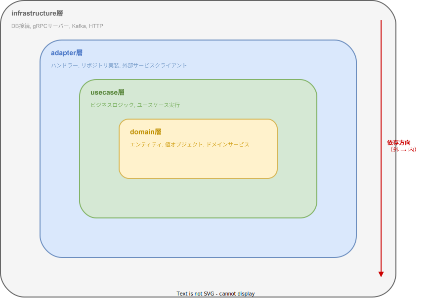

# service tier 用語集

このドキュメントは、k1s0 プロジェクトで使われる専門用語を初心者向けにわかりやすく解説する辞書である。各用語は「一言で言うと」と「もう少し詳しく」の 2 段構成で説明する。

service tier の開発者が日常的に触れる範囲（特にクライアント技術）を厚めに記載している。

---

## プロジェクト用語

### Tier（ティア）

- **一言で言うと**: プロジェクト内のコードの「階層」のこと。
- **もう少し詳しく**: k1s0 では system / business / service の 3 つの Tier がある。上の Tier ほど汎用的で、下の Tier ほど個別の業務に特化している。「自分の Tier より上にあるものは使える、下にあるものは使えない」というルールで依存関係を管理する。

### system tier（システムティア）

- **一言で言うと**: 全サービス共通の土台を提供する最上位層。
- **もう少し詳しく**: 認証（ログイン機能）、設定管理、ログ収集、API ゲートウェイなど、どの業務サービスでも必要になる共通基盤を担当する。50 以上の共通ライブラリを提供しており、service tier の開発者はこれらを import して使う。配置先は `regions/system/`。

### business tier（ビジネスティア）

- **一言で言うと**: 業務領域（経理、FA など）ごとの共通機能を提供する中間層。
- **もう少し詳しく**: 同じ業務領域に属する複数のサービスが共通で使うサーバー API、UI コンポーネント、ライブラリを提供する。例えば「経理」領域なら、通貨入力フィールドや税計算ロジックなどが共通化されている。配置先は `regions/business/{領域名}/`。

### service tier（サービスティア）

- **一言で言うと**: 実際にデプロイして動く個別の業務サービス。あなたが主に開発する層。
- **もう少し詳しく**: エンドユーザーに価値を届ける最前線。注文管理、在庫管理といった具体的な業務サービスを実装する。サーバー、クライアント（Web / モバイル）、データベースをそれぞれ持ち、独立してデプロイできる。配置先は `regions/service/{サービス名}/`。

### regions（リージョンズ）

- **一言で言うと**: リポジトリ内でコードを Tier ごとに分類するためのトップレベルフォルダ。
- **もう少し詳しく**: `regions/system/`、`regions/business/`、`regions/service/` の 3 つに分かれている。Tier という論理的な概念を、ディレクトリ構造として実現したもの。歴史的経緯で「regions」という名前になっている。

### sparse-checkout（スパースチェックアウト）

- **一言で言うと**: モノリポの中から「自分に必要な部分だけ」をダウンロードする Git の仕組み。
- **もう少し詳しく**: k1s0 はすべてのコードを 1 つのリポジトリ（モノリポ）で管理しているが、全部をダウンロードすると巨大になる。sparse-checkout を使うと、自分が担当するサービスと、そのサービスが依存するライブラリだけをチェックアウトできる。k1s0 CLI がこの設定を自動で行ってくれる。

### k1s0 CLI

- **一言で言うと**: プロジェクトの構築から運用までを対話的に行える Rust 製のコマンドラインツール。
- **もう少し詳しく**: ターミナルで `k1s0` と打つと対話式のメニューが表示され、新規サービスの作成、ビルド、テスト、DB マイグレーション、デプロイなどの操作を選択できる。sparse-checkout の設定やコード生成も自動で行ってくれるので、複雑なコマンドを覚える必要がない。

### BFF（Backend for Frontend）

- **一言で言うと**: クライアント（Web / モバイル）専用の中間サーバー。
- **もう少し詳しく**: クライアントが直接業務サーバーと通信するのではなく、間に BFF を挟む。BFF はクライアントが必要なデータだけを集約して返す役割を持つ。Go（gqlgen）または Rust（async-graphql）で実装し、GraphQL API を提供する。**重要**: 異なるサービスの BFF 同士が直接通信することは禁止されている。

---

## アーキテクチャ用語

### クリーンアーキテクチャ

- **一言で言うと**: コードを「役割ごとの層」に分けて、依存方向を一方向に制限する設計手法。
- **もう少し詳しく**: ビジネスロジック（ドメイン層）を中心に置き、外側にユースケース層、アダプター層、インフラストラクチャ層を配置する。内側の層は外側の層を知らないようにする。こうすることで、DB やフレームワークを変更してもビジネスロジックに影響が出ない。

### DDD（Domain-Driven Design / ドメイン駆動設計）

- **一言で言うと**: 「業務の言葉」でコードを書く設計手法。
- **もう少し詳しく**: 業務の専門家（ドメインエキスパート）が使う言葉（「注文」「顧客」「在庫」など）をそのままコードのクラス名やメソッド名に使う。業務の構造をコードに正確に反映することで、仕様変更に強く、読みやすいコードになる。

### TDD（Test-Driven Development / テスト駆動開発）

- **一言で言うと**: テストを先に書いてから、そのテストを通すコードを書く開発手法。
- **もう少し詳しく**: (1) まず失敗するテストを書く → (2) テストが通る最小限のコードを書く → (3) コードをきれいにリファクタリングする、というサイクルを繰り返す。「Red → Green → Refactor」とも呼ばれる。

### ドメイン層

- **一言で言うと**: ビジネスルールそのものを表現する、最も重要な層。
- **もう少し詳しく**: 「注文金額は 0 以上でなければならない」「在庫が足りなければ注文できない」といったビジネスルールをコードにしたもの。フレームワークや DB に依存しない純粋なロジック。配置先: `server/rust/src/domain/`。

### ユースケース層（アプリケーション層）

- **一言で言うと**: 「○○を作成する」「○○を一覧取得する」という業務フローを定義する層。
- **もう少し詳しく**: ドメイン層のオブジェクトを組み合わせて、ひとつの業務処理の流れを記述する。例えば「注文を作成する」ユースケースは、入力値の検証 → 注文エンティティの生成 → DB 保存 → イベント発行、という手順を記述する。配置先: `server/rust/src/application/`。

### アダプター層（プレゼンテーション層）

- **一言で言うと**: 外部とのやりとり（HTTP リクエストの受付、レスポンスの返却など）を担当する層。
- **もう少し詳しく**: gRPC や REST の具体的なハンドラーを実装する。外部からの入力をユースケース層が理解できる形に変換し、ユースケースの結果を外部向けのレスポンスに変換する。配置先: `server/rust/src/presentation/`。

### インフラストラクチャ層

- **一言で言うと**: DB やメッセージキューなど、技術的な「外部システム」との接続を担当する層。
- **もう少し詳しく**: PostgreSQL への SQL 発行、Kafka へのメッセージ送信、外部 API の gRPC 呼び出しなど、具体的な技術に依存する実装を置く。ドメイン層が定義した「リポジトリ」インターフェースの実装もここに置く。配置先: `server/rust/src/infrastructure/`。

### エンティティ

- **一言で言うと**: 固有の ID を持つビジネスオブジェクト。
- **もう少し詳しく**: 「注文（Order）」「顧客（Customer）」のように、一意の識別子（ID）で区別されるオブジェクト。同じ内容でも ID が違えば別物として扱う。ドメイン層に配置する。

### 値オブジェクト（Value Object）

- **一言で言うと**: ID を持たず、「値そのもの」で等しさを判断するオブジェクト。
- **もう少し詳しく**: 「金額（Money）」「住所（Address）」のように、内容が同じなら同一とみなすオブジェクト。イミュータブル（変更不可）に作るのが原則。

### リポジトリ（Repository）

- **一言で言うと**: エンティティの保存・取得を抽象化するインターフェース。
- **もう少し詳しく**: ドメイン層では「OrderRepository に保存する」とだけ書き、実際の SQL 文はインフラストラクチャ層で実装する。こうすることでドメインロジックが DB の種類に依存しなくなる。

### DTO（Data Transfer Object）

- **一言で言うと**: 層の間でデータを受け渡すための入れ物。
- **もう少し詳しく**: API のリクエスト/レスポンスの型や、ユースケースの入出力型として使う。エンティティをそのまま外部に返すのではなく、DTO に変換してから返すことで、内部構造の変更が外部に影響しないようにする。

---

## サーバー技術

### gRPC（ジーアールピーシー）

- **一言で言うと**: 高速なサーバー間通信のための仕組み。
- **もう少し詳しく**: Google が開発した RPC（リモートプロシージャコール）フレームワーク。サーバー同士がお互いの関数を呼び出すように通信できる。Protocol Buffers でインターフェースを定義し、通信データをバイナリ形式でやりとりするため、JSON より高速。k1s0 では業務サーバー同士や、BFF から業務サーバーへの通信に使う。

### REST API（レストエーピーアイ）

- **一言で言うと**: HTTP メソッド（GET / POST / PUT / DELETE）で操作するシンプルな Web API。
- **もう少し詳しく**: URL でリソースを指定し、HTTP メソッドで操作を表現する。例: `GET /api/v1/orders` で注文一覧取得、`POST /api/v1/orders` で注文作成。JSON 形式でデータをやりとりする。外部連携やシンプルな CRUD には REST を使う。

### GraphQL（グラフキューエル）

- **一言で言うと**: クライアントが「欲しいデータだけ」を指定して取得できる API の仕組み。
- **もう少し詳しく**: REST では決まった形のレスポンスが返るが、GraphQL ではクライアントが「この項目だけください」とクエリで指定できる。BFF が GraphQL エンドポイントを提供し、React や Flutter のクライアントから利用する。

### Protocol Buffers（プロトコルバッファ / proto）

- **一言で言うと**: gRPC で使うデータ形式の定義ファイル（`.proto`）。
- **もう少し詳しく**: サーバー間で送受信するメッセージの構造と、呼び出せるメソッド（RPC）を `.proto` ファイルに定義する。この定義から Rust / Go の型やクライアントコードを自動生成する。

### axum（アクサム）

- **一言で言うと**: Rust で HTTP サーバーを作るためのフレームワーク。
- **もう少し詳しく**: Tokio（非同期ランタイム）ベースの高速な Web フレームワーク。ルーティング、ミドルウェア、エラーハンドリングなどを提供する。k1s0 の業務サーバーと Rust BFF はこれを使って構築する。

### tonic（トニック）

- **一言で言うと**: Rust で gRPC サーバー/クライアントを作るためのライブラリ。
- **もう少し詳しく**: `.proto` ファイルから Rust のコードを自動生成し、型安全な gRPC 通信を実現する。k1s0 の業務サーバーが gRPC API を提供する際に使用する。

### sqlx（エスキューエルエックス）

- **一言で言うと**: Rust から SQL データベースに接続するためのライブラリ。
- **もう少し詳しく**: コンパイル時に SQL 文の文法チェックを行う機能が特徴。つまり、間違った SQL を書くとビルド時にエラーになる。PostgreSQL / MySQL / SQLite に対応。ORM（オブジェクト関係マッピング）ではなく、生の SQL を書く方式。

### gqlgen（ジーキューエルジェン）

- **一言で言うと**: Go で GraphQL サーバーを作るためのコード生成ツール。
- **もう少し詳しく**: GraphQL スキーマ（`.graphqls` ファイル）を書くと、Go の型定義とリゾルバーのひな形を自動生成してくれる。Go BFF はこれを使って構築する。

### async-graphql（アシンクグラフキューエル）

- **一言で言うと**: Rust で GraphQL サーバーを作るためのライブラリ。
- **もう少し詳しく**: Rust のマクロ（`#[Object]` など）を使って GraphQL のスキーマをコード上で定義する。Rust BFF はこれを使って構築する。

### マイグレーション

- **一言で言うと**: データベースのテーブル構造（スキーマ）を、コードで管理しながら段階的に変更していく仕組み。
- **もう少し詳しく**: 「テーブルを作る」「カラムを追加する」といった変更を SQL ファイルとして記録し、番号順に実行する。これにより、チームメンバー全員が同じ DB 構造で開発でき、本番環境にも安全にスキーマ変更を適用できる。k1s0 では sqlx のマイグレーション機能を使う。

### config.yaml

- **一言で言うと**: サーバーの設定を 1 つのファイルにまとめたもの。
- **もう少し詳しく**: DB の接続先、認証サーバーの URL、Kafka の設定、ログレベルなどをこのファイルに書く。system tier の config ライブラリが読み込みを担当する。環境（開発/ステージング/本番）ごとに値を切り替えることもできる。

---

## クライアント技術

### TanStack Query

- **一言で言うと**: React でサーバーからのデータ取得・キャッシュを簡単に管理するライブラリ。
- **もう少し詳しく**: `useQuery` フックを使うと、API からのデータ取得、ローディング状態、エラー処理、キャッシュ、再取得を自動的に管理してくれる。「このデータはサーバーから来たもの」という「サーバー状態」の管理に特化している。データ変更時は `useMutation` を使う。

### Zustand（ツスタンド）

- **一言で言うと**: React でアプリ内の UI 状態を管理する軽量ライブラリ。
- **もう少し詳しく**: フィルターの選択状態、モーダルの開閉、選択中のタブなど、サーバーに保存しない「クライアント状態」を管理する。Redux より設定が少なく、`create` 関数でストアを作るだけで使い始められる。

### TanStack Router

- **一言で言うと**: React でページ遷移（ルーティング）を型安全に管理するライブラリ。
- **もう少し詳しく**: URL のパスとページコンポーネントを紐付ける。TypeScript の型情報が効くため、存在しないパスへのリンクをコンパイル時に検出できる。ファイルベースルーティングに対応しており、`routes/` フォルダのファイル構成がそのまま URL 構造になる。

### React Hook Form

- **一言で言うと**: React でフォーム（入力画面）を効率的に管理するライブラリ。
- **もう少し詳しく**: 入力値の管理、バリデーション（入力チェック）、送信処理を少ないコードで実現できる。再レンダリングを最小限に抑える設計になっているため、項目数が多いフォームでもパフォーマンスが良い。

### Zod（ゾッド）

- **一言で言うと**: TypeScript でデータの形（スキーマ）を定義し、バリデーションする ライブラリ。
- **もう少し詳しく**: 「この項目は文字列で必須」「この項目は 0 以上の数値」といったルールを定義できる。定義したスキーマから TypeScript の型を自動生成できるため、型定義とバリデーションルールを二重に書く必要がない。React Hook Form と組み合わせてフォームのバリデーションに使う。

### Tailwind CSS（テイルウィンド CSS）

- **一言で言うと**: HTML に直接クラス名を書いてスタイルを当てる CSS フレームワーク。
- **もう少し詳しく**: `className="bg-blue-500 text-white p-4 rounded"` のように、小さなユーティリティクラスを組み合わせてデザインする。別途 CSS ファイルを書く必要がなく、HTML を見るだけでスタイルがわかる。デザインの統一性も保ちやすい。

### Radix UI（ラディックスユーアイ）

- **一言で言うと**: アクセシブル（誰でも使いやすい）な UI 部品集。
- **もう少し詳しく**: ダイアログ、ドロップダウン、タブなどのインタラクティブな UI 部品を提供する。見た目のスタイルは含まず、「振る舞い」と「アクセシビリティ」だけを提供する「ヘッドレス UI」設計。Tailwind CSS と組み合わせて好みのデザインを当てる。

### Riverpod（リバーポッド）

- **一言で言うと**: Flutter で状態管理と依存性注入を行うためのライブラリ。
- **もう少し詳しく**: 「このデータが変わったら、この画面を自動的に更新する」というリアクティブな仕組みを提供する。Provider（データの提供元）と Notifier（データの変更ロジック）を組み合わせて使う。React における TanStack Query + Zustand に相当する役割を 1 つで担う。

### go_router（ゴールーター）

- **一言で言うと**: Flutter でページ遷移（ルーティング）を管理するライブラリ。
- **もう少し詳しく**: URL ベースの宣言的ルーティングを提供する。Web アプリとしてデプロイする場合にも URL と画面を正しく対応付けられる。ディープリンク（特定の画面に直接飛ぶ URL）にも対応。

### freezed（フリーズド）

- **一言で言うと**: Dart でイミュータブル（変更不可能）なデータクラスを簡単に作るコード生成ツール。
- **もう少し詳しく**: `@freezed` アノテーションを付けるだけで、`copyWith`（一部だけ変更したコピーを作る）、`==`（等価比較）、`toJson` / `fromJson`（JSON 変換）などのメソッドを自動生成してくれる。API のレスポンス型やアプリ内のモデルに使う。

### dio（ディオ）

- **一言で言うと**: Flutter / Dart で HTTP 通信を行うためのライブラリ。
- **もう少し詳しく**: GET / POST / PUT / DELETE などの HTTP リクエストを送信できる。インターセプター（リクエスト前後に処理を挟む仕組み）に対応しており、認証トークンの自動付与やログ出力を組み込める。

### system-client SDK

- **一言で言うと**: system tier が提供する、クライアント向けの共通機能パッケージ。
- **もう少し詳しく**: 認証（ログイン/ログアウト/トークン管理）、API クライアント（HTTP 通信の共通設定）、ルーティングガード（未ログインユーザーのリダイレクト）などを提供する。React 版（`system-client`）と Flutter 版（`system_client`）がある。service tier のクライアントは必ずこれを import して使う。

---

## インフラ・運用

### JWT（JSON Web Token / ジェイダブリューティー）

- **一言で言うと**: ユーザーの認証情報を安全にやりとりするための「電子証明書」のようなトークン。
- **もう少し詳しく**: ユーザーがログインすると JWT が発行される。以降のリクエストにこのトークンを添付することで「このユーザーは認証済み」と証明する。トークンには有効期限やユーザー情報（ID、テナント ID、権限など）が含まれている。

### OAuth 2.0（オーオース 2.0）

- **一言で言うと**: 外部サービスへのアクセス権を安全に委譲するための標準的な仕組み。
- **もう少し詳しく**: 「パスワードを直接渡す」のではなく、「このアプリにこの範囲の操作を許可する」というトークンを発行する方式。k1s0 では Keycloak がこの仕組みを使って認証・認可を管理する。

### Keycloak（キークローク）

- **一言で言うと**: ログイン画面やユーザー管理を提供するオープンソースの認証サーバー。
- **もう少し詳しく**: ユーザーの登録、ログイン、パスワードリセット、シングルサインオン（SSO）などの機能を備えている。k1s0 では Keycloak が JWT を発行し、各サービスのサーバーがその JWT を検証することで認証を実現する。

### Kafka（カフカ）

- **一言で言うと**: サービス間で非同期にメッセージ（イベント）を送受信する仕組み。
- **もう少し詳しく**: 「注文が作成された」「在庫が確保された」といったイベントを Kafka に送信（パブリッシュ）すると、そのイベントに興味のあるサービスが受信（サブスクライブ）できる。BFF 間の直接通信が禁止されているため、サービス間の連携はこの仕組みを使う。

### Docker（ドッカー）

- **一言で言うと**: アプリケーションを「コンテナ」という隔離された環境にパッケージングするツール。
- **もう少し詳しく**: 「自分の PC では動くけど他の環境では動かない」という問題を解決する。アプリケーションと、その実行に必要なもの（ライブラリ、設定ファイルなど）をまとめてコンテナイメージにする。開発環境では docker-compose で複数のコンテナ（サーバー、DB、Kafka など）をまとめて起動する。

### docker-compose（ドッカーコンポーズ）

- **一言で言うと**: 複数の Docker コンテナをまとめて起動・管理するツール。
- **もう少し詳しく**: `docker-compose.yaml` に「どのコンテナをどの設定で起動するか」を定義する。`docker-compose up` 一発で、業務サーバー、DB、Kafka、認証サーバーなどの開発に必要なサービスをすべて立ち上げられる。

### Kubernetes（クバネティス / K8s）

- **一言で言うと**: Docker コンテナを本番環境で大量に管理・運用するための仕組み。
- **もう少し詳しく**: コンテナの自動起動・停止、負荷分散、障害時の自動復旧などを行う。service tier の開発者が直接操作することは少ないが、デプロイ先の環境として意識しておく必要がある。

### CI/CD（シーアイ / シーディー）

- **一言で言うと**: コードの品質チェックとデプロイを自動化する仕組み。
- **もう少し詳しく**: CI（Continuous Integration / 継続的インテグレーション）はコードを変更するたびに自動でテスト・lint を実行する。CD（Continuous Delivery / 継続的デリバリー）はテストに通ったコードを自動でサーバーにデプロイする。k1s0 では GitHub Actions を使用する。

### GitHub Actions

- **一言で言うと**: GitHub が提供する CI/CD 実行環境。
- **もう少し詳しく**: PR の作成やコードのマージをトリガーに、テスト、lint、ビルド、デプロイなどのジョブを自動実行する。`.github/workflows/` にワークフロー定義ファイル（YAML）を置く。

### OpenTelemetry（オープンテレメトリ）

- **一言で言うと**: アプリケーションの動作状況を収集するための標準的な仕組み。
- **もう少し詳しく**: ログ、トレース、メトリクスの 3 つの情報を統一的なフォーマットで収集する。k1s0 では system tier の telemetry ライブラリがこの仕組みをラップして提供しているため、`init_telemetry()` を呼ぶだけで自動的にセットアップされる。

### トレース

- **一言で言うと**: 1 つのリクエストがシステム内をどう流れたかを追跡する仕組み。
- **もう少し詳しく**: ユーザーのリクエストが「React → BFF → 業務サーバー → DB」とどのように流れ、各段階でどれくらい時間がかかったかを可視化できる。問題が起きたときに「どこで遅くなっているか」「どこでエラーが起きたか」を特定するのに使う。

### メトリクス

- **一言で言うと**: アプリケーションの数値指標（リクエスト数、応答時間、エラー率など）を継続的に記録する仕組み。
- **もう少し詳しく**: 「1 分あたり何リクエストあるか」「レスポンスタイムの平均は何ミリ秒か」といった情報をグラフとして可視化できる。異常値を検知してアラートを飛ばすことも可能。

---

## 関連ドキュメント

- [Tier Architecture](../../architecture/overview/tier-architecture.md) -- 階層設計の詳細
- [コンセプト](../../architecture/overview/コンセプト.md) -- プロジェクト全体のミッション・技術スタック
- [API 設計](../../architecture/api/API設計.md) -- API 設計方針
- [GraphQL 設計](../../architecture/api/GraphQL設計.md) -- GraphQL 設計方針
- [proto 設計](../../architecture/api/proto設計.md) -- Protocol Buffers 設計
- [認証認可設計](../../architecture/auth/認証認可設計.md) -- 認証・認可の全体設計
- [JWT 設計](../../architecture/auth/JWT設計.md) -- JWT トークン設計
- [可観測性設計](../../architecture/observability/可観測性設計.md) -- ログ・トレース・メトリクスの全体設計
- [メッセージング設計](../../architecture/messaging/メッセージング設計.md) -- Kafka を使ったメッセージング設計
- [system-library 概要](../../libraries/_common/概要.md) -- system tier ライブラリ一覧
