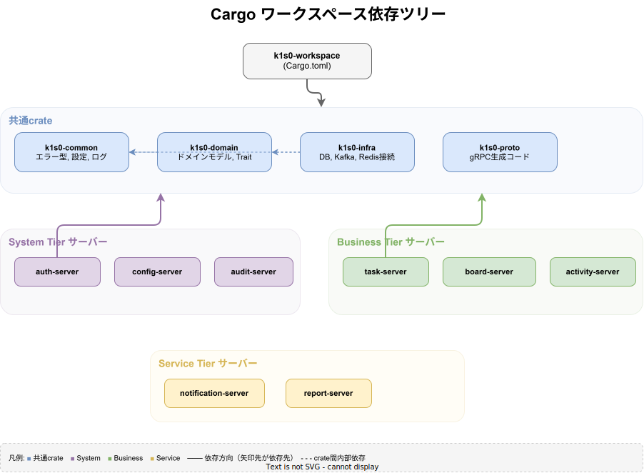
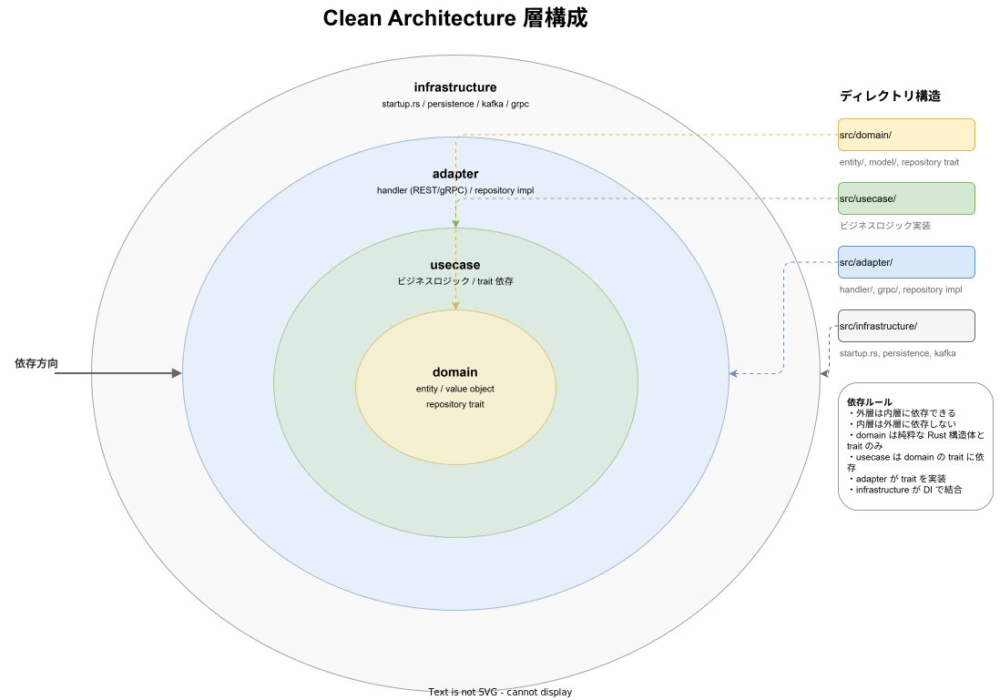
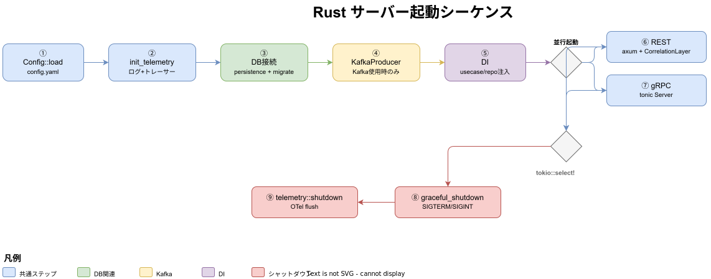
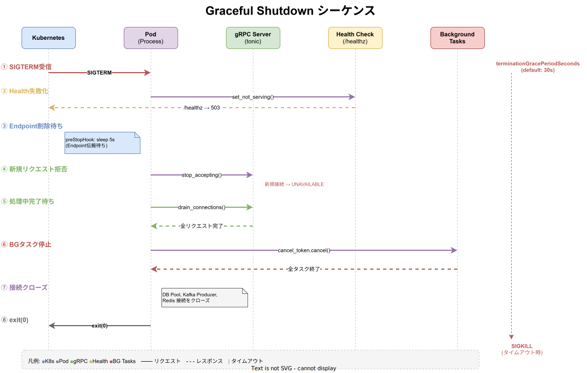

# system-server Rust 共通実装リファレンス

system tier の全 Rust サーバーで共通する実装パターンを定義する。各サーバーのimplementation.md ではサービス固有部分のみを記載し、共通部分は本ドキュメントを参照する。

---

## 共通 Cargo.toml 依存 {#共通cargo依存}



全サーバーで共通して使用する依存クレート。サービス固有の依存は各implementation.md に記載する。

### workspace.dependencies（一元管理）

`regions/system/Cargo.toml` の `[workspace.dependencies]` で共通依存のバージョンと features を一元定義している。各 crate は `workspace = true` で参照し、バージョンの分散を防ぐ。

```toml
# regions/system/Cargo.toml（抜粋）
[workspace.dependencies]
axum = { version = "0.8", features = ["macros"] }
tokio = { version = "1", features = ["full"] }
tower = { version = "0.5", features = ["util"] }
tower-http = { version = "0.6", features = ["trace", "cors"] }
serde = { version = "1", features = ["derive"] }
serde_json = "1"
serde_yaml = "0.9"
sqlx = { version = "0.8", features = ["runtime-tokio-rustls", "postgres", "uuid", "chrono", "json"] }
tonic = "0.12"
tonic-build = "0.12"
prost = "0.13"
prost-types = "0.13"
reqwest = { version = "0.12", features = ["json"] }
thiserror = "2"
anyhow = "1"
tracing = "0.1"
tracing-subscriber = { version = "0.3", features = ["env-filter", "json"] }
uuid = { version = "1", features = ["v4", "serde"] }
chrono = { version = "0.4", features = ["serde"] }
async-trait = "0.1"
utoipa = { version = "5", features = ["axum_extras", "chrono", "uuid"] }
utoipa-swagger-ui = { version = "8", features = ["axum"] }
mockall = "0.13"
tokio-test = "0.4"
```

### 各 crate での参照パターン

```toml
[dependencies]
# workspace.dependencies で定義済みのものは workspace = true で参照する
axum = {workspace = true}
tokio = {workspace = true}
serde = {workspace = true}
sqlx = {workspace = true}

# workspace 定義に含まれない追加 features がある場合は features を指定する
sqlx = {workspace = true, features = ["migrate"]}
reqwest = {workspace = true, features = ["rustls-tls"]}

# optional 依存の場合
axum = {workspace = true, optional = true}

# workspace 未定義の依存はバージョンを直接指定する
rdkafka = { version = "0.36", features = ["cmake-build"] }

# 社内ライブラリ（path 依存はワークスペース管理外）
k1s0-telemetry = { path = "../../../library/rust/telemetry", features = ["full"] }
k1s0-correlation = { path = "../../../library/rust/correlation", features = ["tower-layer"] }

[dev-dependencies]
mockall = {workspace = true}
tokio-test = {workspace = true}

[build-dependencies]
tonic-build = {workspace = true}
```

---

## 共通 build.rs パターン {#共通buildrs}

### k1s0-proto-build 共通クレート

service tier の Rust サーバー（payment / order / inventory）は `k1s0-proto-build` 共通クレートを使用して proto コンパイルを統一する。サービス proto とイベント proto を単一呼び出しでコンパイルし、共通型（`Pagination` / `PaginationResult` / `EventMetadata` 等）の上書き消失を防止する。

```rust
// build.rs — 共通クレートを使用したパターン（推奨）
fn main() -> Result<(), Box<dyn std::error::Error>> {
    k1s0_proto_build::compile_service_protos(
        "payment",                     // サービス名
        "../../../../../../api/proto", // proto ルートディレクトリ
        "src/proto",                   // 出力先
    )
}
```

```toml
# Cargo.toml
[build-dependencies]
k1s0-proto-build = { path = "../../../../../system/library/rust/proto-build" }
```

`k1s0-proto-build` は以下を自動化する:
- サービス proto + イベント proto の自動検出と単一呼び出しコンパイル
- 存在しない proto ファイルのスキップ（警告出力のみ）
- tonic-build 設定の統一（`build_server(true)` / `build_client(false)` / `out_dir` 固定）

### 直接 tonic-build を使用するパターン（system tier 等）

system tier のサーバーや、イベント proto を持たないサーバーでは直接 tonic-build を使用する。

```rust
fn main() -> Result<(), Box<dyn std::error::Error>> {
    tonic_build::configure()
        .build_server(true)
        .build_client(false)
        .out_dir("src/proto")
        .compile_protos(
            &["{proto_path}"],
            &["api/proto/", "../../../../../../api/proto/"],
        )?;
    Ok(())
}
```

### build.rs 運用ノート

- 生成先は `.out_dir("src/proto")` に固定し、CI/CD でも生成物パスを揃える。
- CI では `protobuf-compiler` を明示インストールするか、`PROTOC` 環境変数を設定してビルド再現性を担保する。
- **重要**: 複数の proto ファイルが共通パッケージ（`k1s0.system.common.v1` 等）を import する場合、`compile_protos()` を複数回呼び出すと共通型が上書き消失する。必ず単一呼び出しで全 proto を同時にコンパイルすること。

---

## Clean Architecture 層構成



---

## 共通 main.rs 起動シーケンス {#共通mainrs}

全サーバーは以下の起動シーケンスに従う。サービス固有の DI は各implementation.md に記載する。



```
1. Config::load("config/config.yaml")
2. init_telemetry(&telemetry_cfg)   # ログ + トレーサー一括初期化（TelemetryConfigBuilder 推奨）
3. persistence::connect(&cfg.database) + sqlx::migrate!
4. KafkaProducer::new(&cfg.kafka)  ※Kafka 使用時
5. DI（サービス固有のユースケース・リポジトリ注入）
6. REST サーバー起動（axum::Router + axum::serve + CorrelationLayer）
7. gRPC サーバー起動（tonic::transport::Server）
8. graceful_shutdown（SIGTERM/SIGINT 待機）
9. k1s0_telemetry::shutdown()（OpenTelemetry フラッシュ）
```

---

## Graceful Shutdown パターン {#graceful-shutdown}



全 Rust サーバーは `k1s0-server-common` の共通シャットダウンシグナルを使用する。

### shutdown_signal() — 共通モジュール

`k1s0_server_common::shutdown::shutdown_signal()` として一元管理されている。
各サーバーの `startup.rs` にローカル定義を置かず、共通クレートからインポートする。

```rust
// k1s0-server-common の shutdown モジュール（全サーバー共通）
// Cargo.toml に features = ["shutdown"] が必要
use k1s0_server_common::shutdown::shutdown_signal;
```

動作仕様:
- Unix: SIGTERM + SIGINT（Ctrl-C）を待機（`tokio::select!`）
- Windows: SIGINT（Ctrl-C）のみ

### REST + gRPC の並行 Graceful Shutdown

```rust
let grpc_shutdown = k1s0_server_common::shutdown::shutdown_signal();
let grpc_future = async move {
    tonic::transport::Server::builder()
        // ...
        .serve_with_shutdown(grpc_addr, async move { let _ = grpc_shutdown.await; })
        .await
};

let rest_future = axum::serve(listener, app)
    .with_graceful_shutdown(async { let _ = k1s0_server_common::shutdown::shutdown_signal().await; });

tokio::select! {
    result = rest_future => { /* error handling */ }
    result = grpc_future => { /* error handling */ }
}

k1s0_telemetry::shutdown();  // テレメトリを最後にフラッシュ
```

### CorrelationLayer の適用

全サーバーの REST アプリケーションに `CorrelationLayer` を追加する（MetricsLayer の外側に配置）:

```rust
let app = handler::router(state)
    .layer(k1s0_telemetry::MetricsLayer::new(metrics.clone()))
    .layer(k1s0_correlation::layer::CorrelationLayer::new());  // 最外層
```

CorrelationLayer は受信リクエストに対して:
1. `X-Correlation-Id` ヘッダーを解析（なければ UUID v4 を自動生成）
2. `X-Trace-Id` ヘッダーを解析（あれば伝播）
3. `CorrelationContext` を `Extensions` に格納（ハンドラーから取得可能）
4. レスポンスヘッダーに `X-Correlation-Id` / `X-Trace-Id` を自動付与

---

## 共通 ObservabilityConfig モジュール {#共通observabilityconfig}

技術監査対応により、全サーバーで重複していた可観測性設定構造体を `k1s0-server-common` の `config` モジュールに集約した。各サーバーの `config.rs` にローカル定義されていた `ObservabilityConfig` / `LogConfig` / `TraceConfig` / `MetricsConfig` を廃止し、共通クレートからインポートする。

### 集約された構造体

| 構造体 | 説明 | デフォルト値 |
|--------|------|-------------|
| `ObservabilityConfig` | ログ・トレース・メトリクス設定の親構造体 | 各サブ設定のデフォルト |
| `LogConfig` | ログレベル・フォーマット | `level: "info"`, `format: "json"` |
| `TraceConfig` | 分散トレースの有効/無効・エンドポイント・サンプリングレート | `enabled: true`, `endpoint: DEFAULT_OTEL_ENDPOINT`, `sample_rate: 1.0` |
| `MetricsConfig` | Prometheus メトリクスの有効/無効・エンドポイントパス | `enabled: true`, `path: "/metrics"` |

### 使用方法

```rust
// 各サーバーの config.rs — 共通クレートからインポート
use k1s0_server_common::config::ObservabilityConfig;

#[derive(Debug, Clone, Deserialize)]
pub struct Config {
    pub app: AppConfig,
    pub server: ServerConfig,
    pub database: DatabaseConfig,
    // 共通 ObservabilityConfig を使用（ローカル定義は不要）
    #[serde(default)]
    pub observability: ObservabilityConfig,
}
```

### Cargo.toml 設定

```toml
[dependencies]
k1s0-server-common = { path = "../../system/library/rust/server-common", features = ["axum"] }
# config モジュールは常に利用可能（feature フラグ不要）
```

### startup モジュールとの連携

`ObservabilityConfig` から `startup::ObservabilityFields` への `From` 変換が実装されており（`startup` feature 有効時）、`ServerBuilder` との連携がシームレスに行える。

### 設計判断

- **デフォルト値の一元管理**: エンドポイント URL やログレベルの変更を1ファイルで完結させる
- **serde(default) 対応**: YAML で省略されたフィールドには自動的にデフォルト値が適用される
- **後方互換**: 既存の config.yaml フォーマットを変更せずに移行可能

---

## 共通 config.yaml セクション {#共通configyaml}

全サーバーの config.yaml に含まれる共通セクション。サービス固有セクションは各設計書を参照。

```yaml
app:
  name: "{service-name}"
  version: "0.1.0"
  environment: "production"    # dev | staging | production

server:
  host: "0.0.0.0"
  port: 8080
  grpc_port: 50051             # サービスにより異なる

database:
  host: "postgres.k1s0-system.svc.cluster.local"
  port: 5432
  name: "k1s0_system"
  user: "app"
  password: ""                 # Vault 経由で注入
  ssl_mode: "disable"
  max_open_conns: 25
  max_idle_conns: 5
  conn_max_lifetime: "5m"

kafka:
  brokers:
    - "kafka-0.messaging.svc.cluster.local:9092"
  security_protocol: "PLAINTEXT"

# ObservabilityConfig 構造体に対応（k1s0-server-common の config モジュールで定義）
observability:
  log:
    level: "info"              # ログレベル（info, debug, warn, error）
    format: "json"             # 出力フォーマット（json, text）
  trace:
    enabled: true              # 分散トレースの有効/無効
    endpoint: "http://otel-collector.observability:4317"  # OTLP エンドポイント
    sample_rate: 1.0           # サンプリングレート（0.0〜1.0）
  metrics:
    enabled: true              # Prometheus メトリクスの有効/無効
    path: "/metrics"           # メトリクスエンドポイントパス
```

> **注記**: `observability` セクションは従来のフラット形式（`otlp_endpoint`, `log_level` 等）から構造化形式（`log.level`, `trace.endpoint` 等）に移行した。`k1s0-server-common` の `ObservabilityConfig` 構造体がこの構造化形式に対応している。

---

## Outbox 並列処理パターン

`OutboxProcessor` は `tokio::task::JoinSet` により複数メッセージを並列で処理する。

```rust
use tokio::task::JoinSet;

// 並列度の設定（デフォルト: 4）
let processor = OutboxProcessor::new(store, publisher)
    .with_concurrency(4);

// 内部実装: JoinSet で並列実行
let mut join_set = JoinSet::new();
for msg in pending_messages.into_iter().take(concurrency) {
    let store = store.clone();
    let publisher = publisher.clone();
    join_set.spawn(async move {
        publisher.publish(&msg).await?;
        store.mark_published(msg.id).await
    });
}
// 全タスクの完了を待機
while let Some(result) = join_set.join_next().await {
    result??;
}
```

### 設計判断

- **並列度制限**: バックプレッシャー制御のため、`concurrency` で同時実行数を制限
- **冪等性保証**: `idempotency_key` により重複発行を防止（`ON CONFLICT DO NOTHING`）
- **エラー伝播**: 個別タスクの失敗は次回のポーリングで再処理

---

## 環境別インフラフォールバック方針 {#環境別フォールバック}

system tier の Rust サーバーでは、インフラ（PostgreSQL / Kafka / Redis / Storage）への接続失敗時の動作を **環境によって明確に切り替える**。これにより、本番環境でのサイレントな品質劣化（データが揮発 InMemory に格納されるなど）を防止する。

### フォールバック許可条件

`k1s0_server_common::allow_in_memory_infra(environment)` が `true` を返す場合のみ InMemory/Noop フォールバックが許可される。

| 状況 | 判定条件 |
|------|---------|
| ビルドモード | `debug_assertions` が有効（`cargo build`）、または `dev-infra-bypass` feature が有効 |
| 環境名 | `"dev"` / `"development"` / `"test"` / `"local"` のいずれか |
| 環境変数 | `ALLOW_IN_MEMORY_INFRA=true` または `ALLOW_IN_MEMORY_INFRA=1` |

上記 **3条件すべて** を満たす場合のみ InMemory/Noop が許可される。リリースビルドや `"production"` / `"staging"` 等では常に `false`。

### ケース別の動作

| ケース | dev/test | production / staging |
|--------|----------|----------------------|
| インフラ設定が **None**（YAML 未記載） | `require_infra()` → warn ログ + Ok(None) → InMemory/Noop 起動 | `require_infra()` → **`Err` を返してサーバー起動を中断** |
| インフラ設定はあるが **接続に失敗** | `allow_in_memory_infra()` → warn ログ + InMemory/Noop 起動 | `allow_in_memory_infra()` → **`Err` を返してサーバー起動を中断** |
| 接続 **成功** | 実インフラを使用 | 実インフラを使用 |

### 実装パターン

```rust
// インフラ設定はあるが接続に失敗した場合の fail-fast パターン。
// allow_in_memory_infra が false（本番/リリースビルド）の場合は即座にエラーを返す。
Err(e) => {
    if !k1s0_server_common::allow_in_memory_infra(&cfg.app.environment) {
        return Err(anyhow::anyhow!(
            "PostgreSQL 接続に失敗しました。本番環境ではフォールバックは許可されていません: {}",
            e
        ));
    }
    tracing::warn!(
        error = %e,
        "dev/test 環境: インフラ接続失敗のため InMemory フォールバックで起動します"
    );
    Arc::new(InMemoryRepository::new())
}

// インフラ設定が未指定の場合の fail-fast パターン。
// require_infra が None + 本番環境の場合はエラーを返す。
} else {
    k1s0_server_common::require_infra(
        "service-name",
        k1s0_server_common::InfraKind::Database,
        &cfg.app.environment,
        None::<String>,
    )?;
    info!("no database config, using InMemory (dev/test bypass)");
    Arc::new(InMemoryRepository::new())
};
```

### 適用済みサーバー

| サーバー | 対象インフラ | 実装場所 |
|---------|------------|---------|
| quota | PostgreSQL（接続失敗）・Kafka（初期化失敗・設定なし） | `quota/src/infrastructure/startup.rs` |
| file | Kafka（初期化失敗）・DB/Storage/Kafka（設定なし） | `file/src/infrastructure/startup.rs` |

---

## startup.rs コピペ構造の共通化方針 {#startup共通化}

### 現状の問題

service / business 層の 4 サーバー（order, inventory, payment, domain-master）および system 層の多数のサーバーで、`startup.rs` がほぼ同一のボイラープレートコードをコピペしている。具体的に重複しているのは以下の処理ブロックである:

| # | 処理 | 重複行数（概算） | サーバー間の差分 |
|---|------|-----------------|----------------|
| 1 | Config ロード（CONFIG_PATH 環境変数 → Config::load） | ~3行 | なし |
| 2 | TelemetryConfig 構築 + init_telemetry 呼び出し | ~15行 | service_name, tier のみ |
| 3 | DB 接続（connect_database + MIGRATOR.run） | ~10行 | なし |
| 4 | Metrics 生成 | ~1行 | ラベル名のみ |
| 5 | Auth（JwksVerifier + AuthState 構築） | ~12行 | なし |
| 6 | REST + gRPC サーバー起動 + tokio::select! | ~30行 | gRPC サービス型のみ |
| 7 | Graceful shutdown シグナル処理 | ~10行 | なし |
| 8 | connect_database 関数 | ~10行 | なし |

**問題の影響**:
- クロスカッティングな改善（例: テレメトリ初期化のエラーハンドリング変更）を全サーバーに手動で適用する必要がある
- 改善漏れによるサーバー間の微妙な挙動差異が生まれる
- 新サーバー追加時にコピペ元の選定と手動カスタマイズが必要

### 既存の ServerBuilder との関係

`k1s0-server-common` には既に `ServerBuilder`（`startup.rs`）が存在し、テレメトリ初期化・DB プール作成・JWKS 検証器・Metrics 生成を提供している。しかし、現時点では一部のサーバーのみが `ServerBuilder` を利用しており、大半のサーバーは従来のインライン実装を維持している。

### 共通化方針

`k1s0-server-common` クレートの `ServerBuilder` を拡張し、以下の初期化処理を追加で共通化する:

1. **REST + gRPC 並行サーバー起動**: `ServerBuilder::serve()` メソッドを追加し、REST Router と gRPC Service を受け取って `tokio::select!` による並行起動 + graceful shutdown を一括で実行する
2. **connect_database の統一**: 各サーバーにローカル定義されている `connect_database()` を `ServerBuilder::init_db_pool()` に完全移行する
3. **Outbox Poller 起動の共通化**: Outbox を使用するサーバー向けに、ポーラーのバックグラウンド起動 + shutdown 連携を `ServerBuilder` に統合する

#### trait によるサーバー固有設定の注入

```rust
// サーバー固有の設定を注入するための trait（設計案）
#[async_trait::async_trait]
pub trait ServerApp: Send + Sync + 'static {
    /// サービス名（テレメトリ・メトリクスに使用）
    fn service_name(&self) -> &str;
    /// サービス階層
    fn tier(&self) -> Tier;
    /// REST ルーターを構築する
    fn build_rest_router(&self, state: &CommonState) -> axum::Router;
    /// gRPC サービスを構築し tonic Server に追加する
    fn build_grpc_server(&self, builder: tonic::transport::Server)
        -> tonic::transport::server::Router;
    /// gRPC メソッド名 → 必要なアクションのマッピング
    fn required_action(method: &str) -> &'static str;
}
```

各サーバーは `ServerApp` trait を実装し、`ServerBuilder::run(app)` を呼び出すだけで起動できるようにする。

### 移行ステップ

| Phase | 内容 | 影響範囲 |
|-------|------|---------|
| Phase 1 | `ServerBuilder` に `serve()` メソッドを追加。REST/gRPC 並行起動 + graceful shutdown を共通化 | server-common のみ |
| Phase 2 | 既存の `connect_database()` ローカル定義を持つサーバーを `ServerBuilder::init_db_pool()` に移行 | 全 Rust サーバー（段階的） |
| Phase 3 | service 層 3 サーバー（order, payment, inventory）を `ServerApp` trait ベースに移行。Outbox Poller 起動も統合 | service 層 3 サーバー |
| Phase 4 | business 層（domain-master）を移行 | domain-master |
| Phase 5 | system 層の残りのサーバーを段階的に移行 | system 層サーバー（段階的） |

**移行の原則**:
- 既存の動作を変更しない（リファクタリングのみ）
- 各 Phase で CI を通してからマージする
- `ServerApp` trait の採用は任意とし、各サーバーの startup.rs で `ServerBuilder` の個別メソッドを呼び出す方式も引き続きサポートする

---

## 関連ドキュメント

- [system-server.md](../auth/server.md) -- auth-server 設計（参考実装）
- [system-server-deploy.md](deploy.md) -- Dockerfile・Helm・テスト方針
- [テンプレート仕様-サーバー-Rust](../../templates/server/サーバー-Rust.md) -- Rust テンプレート詳細
- [イベント駆動設計](../../libraries/_common/イベント駆動設計.md) -- Outbox・イベントメタデータ
