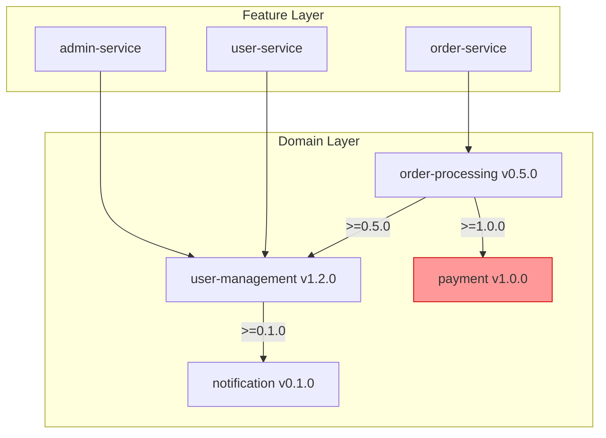
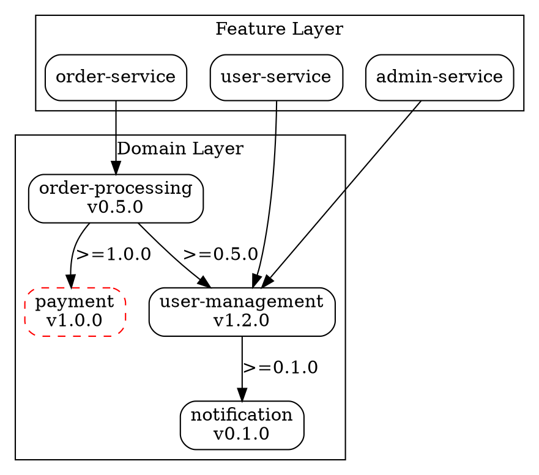

# 要望

プロジェクト内のドメイン層（`domain/`）を実際に活用できるようにしたい。
現在、ドメイン層のディレクトリは空であり、3層アーキテクチャ（framework → domain → feature）が形骸化している。
ドメインの雛形生成、依存関係の可視化、バージョン管理を統合的に行う仕組みが欲しい。

## 回答（実装方針）

### 概要

1. **`k1s0 domain init` コマンドの強化**: ドメイン雛形を Clean Architecture に準拠した構造で生成
2. **`k1s0 domain catalog` コマンドの新設**: プロジェクト内の全ドメインと依存関係を一覧・可視化
3. **`k1s0 domain graph` コマンドの新設**: ドメイン間依存グラフを Mermaid / DOT 形式で出力
4. **ドメインテンプレート**: Rust / Go / React / Flutter 向けのドメインスキャフォールドテンプレート整備

### 技術選定

| 機能 | 技術 | 理由 |
|------|------|------|
| CLI コマンド | clap 4.5 (Rust) | 既存 CLI と統一 |
| テンプレート生成 | Tera 1.19 | 既存テンプレートエンジン |
| 依存グラフ解析 | petgraph | Rust 標準的なグラフライブラリ |
| グラフ出力 | Mermaid / Graphviz DOT | 開発者に馴染みのある形式 |
| マニフェスト解析 | serde_json | 既存 manifest.json パーサー |

### 設計方針

- **既存 CLI 拡張**: `k1s0-cli` と `k1s0-generator` crate に機能追加（新 crate は作らない）
- **manifest.json 準拠**: ドメインのメタデータは `.k1s0/manifest.json` で管理（既存スキーマ活用）
- **K040-K047 lint ルール連携**: 生成されたドメインは既存 lint ルールで即座に検証可能
- **段階的導入**: まず Rust / Go バックエンドのドメインテンプレートから開始

---

## 機能 1: `k1s0 domain init` コマンド強化

### 現状

`k1s0 new-domain --type <type> --name <name>` コマンドは存在するが、生成されるテンプレートが最小限。

### 強化内容

```bash
# 基本的なドメイン生成
k1s0 new-domain --type backend-rust --name user-management

# オプション付き
k1s0 new-domain --type backend-rust --name order-processing \
  --with-events \           # ドメインイベント定義のボイラープレート
  --with-repository \       # リポジトリ trait 雛形
  --version 0.1.0           # 初期バージョン指定
```

### 生成されるディレクトリ構造（Rust）

```
domain/backend/rust/user-management/
├── .k1s0/
│   └── manifest.json          # layer: "domain", version: "0.1.0"
├── Cargo.toml
├── src/
│   ├── lib.rs                 # クレートルート
│   ├── entities/
│   │   ├── mod.rs
│   │   └── user.rs            # サンプルエンティティ
│   ├── value_objects/
│   │   ├── mod.rs
│   │   └── email.rs           # サンプル値オブジェクト
│   ├── repositories/
│   │   ├── mod.rs
│   │   └── user_repository.rs # リポジトリ trait
│   ├── services/
│   │   └── mod.rs             # ドメインサービス
│   └── events/                # --with-events 時のみ
│       ├── mod.rs
│       └── user_created.rs    # サンプルドメインイベント
└── tests/
    └── entity_test.rs
```

### 生成されるディレクトリ構造（Go）

```
domain/backend/go/user-management/
├── .k1s0/
│   └── manifest.json
├── go.mod
├── entities/
│   └── user.go
├── value_objects/
│   └── email.go
├── repositories/
│   └── user_repository.go     # interface 定義
├── services/
│   └── doc.go
├── events/                    # --with-events 時のみ
│   └── user_created.go
└── entities_test.go
```

### 生成されるディレクトリ構造（React）

```
domain/frontend/react/user-management/
├── .k1s0/
│   └── manifest.json
├── package.json
├── tsconfig.json
├── src/
│   ├── index.ts
│   ├── entities/
│   │   └── user.ts            # TypeScript interface + Zod schema
│   ├── value-objects/
│   │   └── email.ts
│   ├── repositories/
│   │   └── user-repository.ts # Repository interface
│   └── events/                # --with-events 時のみ
│       └── user-created.ts
└── tests/
    └── entity.test.ts
```

### 生成されるディレクトリ構造（Flutter）

```
domain/frontend/flutter/user-management/
├── .k1s0/
│   └── manifest.json
├── pubspec.yaml
├── lib/
│   ├── user_management.dart   # バレルファイル
│   └── src/
│       ├── entities/
│       │   └── user.dart
│       ├── value_objects/
│       │   └── email.dart
│       ├── repositories/
│       │   └── user_repository.dart
│       └── events/            # --with-events 時のみ
│           └── user_created.dart
└── test/
    └── entity_test.dart
```

### manifest.json（ドメイン層）

```json
{
  "schema_version": "1.0.0",
  "template": {
    "name": "domain-backend-rust",
    "version": "0.1.0",
    "source": "builtin"
  },
  "service": {
    "name": "user-management",
    "type": "backend",
    "language": "rust"
  },
  "layer": "domain",
  "domain": {
    "version": "0.1.0",
    "min_framework_version": "0.1.0",
    "dependencies": [],
    "breaking_changes": [],
    "deprecated": false
  },
  "managed_paths": [
    ".k1s0/",
    "Cargo.toml"
  ],
  "protected_paths": [
    "src/entities/",
    "src/value_objects/",
    "src/repositories/",
    "src/services/",
    "src/events/"
  ]
}
```

---

## 機能 2: `k1s0 domain catalog` コマンド

### 概要

プロジェクト内の全ドメインを一覧表示し、バージョン・依存関係・利用状況を確認できる。

### コマンド

```bash
# テーブル表示（デフォルト）
k1s0 domain catalog

# JSON 出力
k1s0 domain catalog --json

# 特定言語のみ
k1s0 domain catalog --language rust
```

### 出力例（テーブル）

```
Domain Catalog
==============

Name               | Type    | Language | Version | Status     | Dependents
-------------------|---------|----------|---------|------------|----------
user-management    | backend | rust     | 1.2.0   | active     | 3 features
order-processing   | backend | rust     | 0.5.0   | active     | 2 features
payment            | backend | go       | 1.0.0   | deprecated | 1 feature
user-management    | frontend| react    | 1.1.0   | active     | 2 features
notification       | backend | rust     | 0.1.0   | active     | 0 features

Total: 5 domains (4 active, 1 deprecated)
```

### 出力例（JSON）

```json
{
  "domains": [
    {
      "name": "user-management",
      "type": "backend",
      "language": "rust",
      "version": "1.2.0",
      "path": "domain/backend/rust/user-management",
      "deprecated": false,
      "min_framework_version": "0.1.0",
      "dependencies": ["notification"],
      "dependents": [
        "feature/backend/rust/user-service",
        "feature/backend/rust/admin-service",
        "feature/backend/rust/auth-gateway"
      ],
      "breaking_changes": [
        {
          "version": "1.0.0",
          "description": "UserEntity の email フィールドを Email 値オブジェクトに変更"
        }
      ]
    }
  ],
  "summary": {
    "total": 5,
    "active": 4,
    "deprecated": 1
  }
}
```

---

## 機能 3: `k1s0 domain graph` コマンド

### 概要

ドメイン間および domain → feature の依存関係をグラフ形式で出力する。

### コマンド

```bash
# Mermaid 形式（デフォルト）
k1s0 domain graph

# Graphviz DOT 形式
k1s0 domain graph --format dot

# 特定ドメインを起点とした部分グラフ
k1s0 domain graph --root user-management

# 循環依存検出モード
k1s0 domain graph --detect-cycles
```

### 出力例（Mermaid）



### 出力例（DOT）



### 循環依存検出

```bash
$ k1s0 domain graph --detect-cycles

Cycle detected!
  order-processing -> user-management -> notification -> order-processing

This violates K043 (Circular dependency detected between domains).
```

---

## 機能 4: ドメインテンプレート整備

### 概要

`CLI/templates/` にドメイン専用テンプレートを追加する。

### テンプレート一覧

| テンプレート名 | 対象 | 説明 |
|---------------|------|------|
| `domain-backend-rust` | Rust バックエンド | エンティティ・値オブジェクト・リポジトリ trait |
| `domain-backend-go` | Go バックエンド | interface 中心のドメインモデル |
| `domain-frontend-react` | React フロントエンド | TypeScript interface + Zod schema |
| `domain-frontend-flutter` | Flutter フロントエンド | Dart クラス + freezed |

### テンプレート変数

| 変数名 | 説明 | 例 |
|--------|------|-----|
| `{{ domain_name }}` | ドメイン名（kebab-case） | `user-management` |
| `{{ domain_name_snake }}` | snake_case 変換 | `user_management` |
| `{{ domain_name_pascal }}` | PascalCase 変換 | `UserManagement` |
| `{{ domain_version }}` | 初期バージョン | `0.1.0` |
| `{{ with_events }}` | イベント雛形を含むか | `true` / `false` |
| `{{ with_repository }}` | リポジトリ雛形を含むか | `true` / `false` |
| `{{ min_framework_version }}` | 最低フレームワークバージョン | `0.1.0` |

---

## 主要機能一覧

### CLI コマンド

| コマンド | 説明 | 状態 |
|---------|------|------|
| `k1s0 new-domain` | ドメイン雛形生成（強化版） | 改修 |
| `k1s0 domain catalog` | ドメイン一覧・依存表示 | 新規 |
| `k1s0 domain graph` | 依存グラフ出力 | 新規 |
| `k1s0 domain graph --detect-cycles` | 循環依存検出 | 新規 |

### テンプレート

| テンプレート | 対象 | 状態 |
|-------------|------|------|
| domain-backend-rust | Rust ドメイン | 新規 |
| domain-backend-go | Go ドメイン | 新規 |
| domain-frontend-react | React ドメイン | 新規 |
| domain-frontend-flutter | Flutter ドメイン | 新規 |

### Lint 連携

| ルール | 連携内容 |
|--------|---------|
| K040 | 生成されたドメインの層依存違反を検出 |
| K041 | feature が参照するドメインの存在確認 |
| K042 | バージョン制約の整合性チェック |
| K043 | `domain graph --detect-cycles` と同等の検出 |
| K044 | deprecated ドメインの利用警告 |
| K047 | ドメイン manifest の version フィールド必須チェック |

---

## 依存パッケージ

### 追加 Rust 依存（k1s0-generator）

```toml
[dependencies]
petgraph = "0.6"           # 依存グラフ解析・循環検出
```

### 既存依存（変更なし）

- `clap` 4.5: CLI コマンド定義
- `tera` 1.19: テンプレートレンダリング
- `serde_json`: manifest.json パース
- `walkdir`: ディレクトリ走査

---

## 期待される効果

1. **3層アーキテクチャの実体化**: ドメイン層が空の状態を解消し、実際に利用可能にする
2. **ドメイン駆動設計の促進**: エンティティ・値オブジェクト・リポジトリの雛形により DDD の導入障壁を下げる
3. **依存関係の可視化**: チーム間のドメイン依存を把握し、影響範囲を事前に確認できる
4. **循環依存の早期発見**: `domain graph --detect-cycles` で設計段階での問題を検出
5. **lint ルールとの統合**: K040-K047 がすぐに機能し、品質ゲートとして活用可能
6. **段階的成長**: 最小限のドメインから始め、feature 層との連携を徐々に構築可能

---

## 注意事項

- **ドメイン命名**: `{domain_name}` は kebab-case を必須とする（K003 準拠）
- **バージョニング**: SemVer 必須、breaking change は `breaking_changes` に記録すること
- **循環依存禁止**: domain → domain の依存は許可されるが、循環は K043 で検出・ブロック
- **環境変数禁止**: ドメイン層でも `std::env::var` 等の環境変数直接参照は K020 違反
- **infrastructure 禁止**: ドメイン層に infrastructure 依存を含めない（K022 準拠）
- **deprecated 管理**: ドメイン非推奨化時は `deprecated: true` + 移行先ドメインの明記が必要
